Walkthrough with all data analyses that comes with the manuscript
Comparing published FPKM/RPKM values and reprocessed FPKM values.
========================================================

The first part of this document defines some helper functions and then shows in detail how data were downloaded and combined. However, most of the material related to downloading and combining is commented out - it is just left for reference. 

Prepare by loading packages etc.

```r
library(pheatmap)
library(reshape)
library(gplots)
```

```
## Warning: package 'gplots' was built under R version 3.1.2
```

```
## 
## Attaching package: 'gplots'
## 
## The following object is masked from 'package:stats':
## 
##     lowess
```

```r
library(ops)
```

```
## 
## Attaching package: 'ops'
## 
## The following object is masked from 'package:stats':
## 
##     filter
```

```r
library(calibrate)
```

```
## Loading required package: MASS
```

```r
library(biomaRt)
library(sva)
```

```
## Loading required package: mgcv
```

```
## Warning: package 'mgcv' was built under R version 3.1.2
```

```
## Loading required package: nlme
## This is mgcv 1.8-4. For overview type 'help("mgcv-package")'.
## Loading required package: genefilter
## 
## Attaching package: 'genefilter'
## 
## The following object is masked from 'package:MASS':
## 
##     area
## 
## The following object is masked from 'package:base':
## 
##     anyNA
```

```r
library(ggplot2)
```
Function definitions
--------------------
Define functions for (a) Principle component analysis for published and reprocessed data (b) Restricting the data to only include protein coding genes (c) computing and plotting p-values for correlations between PCA scores and various sample features and (d) quantifying and plotting the importance of various sample features using ANOVA.

**Principal component analysis.**

```r
plot.pca.published <- function(df,x,y,z){
  
  p <- prcomp(t(df))
  
  v <- 100*(p$sdev)^2 / sum(p$sdev^2)
  v.x <- v[x]
  v.y <- v[y]
 
  colors <- c("indianred", "dodgerblue", "forestgreen",
            "indianred", "dodgerblue",
            "indianred", "dodgerblue", "forestgreen", 
            "indianred", "dodgerblue", "forestgreen")
  
  shapes <- c(rep(15,3),rep(16,2),rep(17,3),rep(8,3))

  plot(p$x[,x],p$x[,y],pch=shapes,cex=1.5,col=colors,xlab=paste(paste("PC",x),round(v.x),"% of variance"),ylab=paste(paste("PC",y),round(v.y),"% of variance"),main=paste(z," Published FPKM/RPKM values \n n=13,078"))
  
}

plot.pca.reprocessed <- function(df,x,y,z){
  
  p_repr <- prcomp(t(df))
  
  v <- 100*(p_repr$sdev)^2 / sum(p_repr$sdev^2)
  v.x <- v[x]
  v.y <- v[y]
 
  colors_repr <- c("dodgerblue", "indianred", "forestgreen",
                   "dodgerblue", "indianred", "forestgreen",
                   "dodgerblue", "indianred", "forestgreen",
                   "dodgerblue", "indianred", "forestgreen",
                   "dodgerblue", "indianred")          
 
  shapes_repr <- c(rep(11,3),rep(8,3),rep(17,3),rep(15,3),rep(16,2))
  
  plot(p_repr$x[,x],p_repr$x[,y],pch=shapes_repr,col=colors_repr,xlab=paste(paste("PC",x),round(v.x),"% of variance"),ylab=paste(paste("PC",y),round(v.y),"% of variance"),main=paste(z," reprocessed  cufflinks FPKM values \n n=18,175"))
  
}
```
**Restrict data to only include protein coding genes using ensembl BiomaRt.**

```r
getPcs <- function(x) {
            ensembl = useMart("ensembl",dataset= "hsapiens_gene_ensembl")
            type <- getBM(attributes=c("ensembl_gene_id","gene_biotype"),filters = "ensembl_gene_id",values = as.vector(x$ENSEMBL_ID),mart = ensembl)
            pc <- subset(type[,1],type[,2]=="protein_coding")
            results <- x[match(pc,x$ENSEMBL_ID),]              
            return(results)
          }
```
**Correlations between PCs and experimental factors.**

```r
print_PCA_corrs <- function(data,sampleinfo,caption="PCA correlations",include.quant=F){
pca <- prcomp(t(data[,]))
rot <- pca$r
x <- pca$x

if(include.quant){
  pc1 <- rep(1,8)
names(pc1) <- c("Raw reads","Mapped reads", "Tissue", "Library prep", "Study", "Read type", "Read length","Quantification method")
pc2 <- rep(1,8)
}
else{pc1 <- rep(1,7)
names(pc1) <- c("Raw reads","Mapped reads", "Tissue", "Library prep", "Study", "Read type", "Read length")
pc2 <- rep(1,7)
}
names(pc2) <- names(pc1)

# Test correlations between number of seq'd reads and PCs 1-4 from prcomp
pval.nraw.pc1 <- cor.test(x[,1], sampleinfo$NumberRaw,method="spearman")$p.value
pval.nraw.pc2 <- cor.test(x[,2], sampleinfo$NumberRaw,method="spearman")$p.value
pval.nraw.pc3 <- cor.test(x[,3], sampleinfo$NumberRaw,method="spearman")$p.value

cat(sprintf("Number_of_rawreads~PCAs: PCA1=\"%f\"PCA2=\"%f\"PCA3=\"%f\n", pval.nraw.pc1,pval.nraw.pc2,pval.nraw.pc3))

pc1[1] <- pval.nraw.pc1
pc2[1] <- pval.nraw.pc2

pval.nmapped.pc1 <- cor.test(x[,1], sampleinfo$Numbermapped,method="spearman")$p.value
pval.nmapped.pc2 <- cor.test(x[,2], sampleinfo$Numbermapped,method="spearman")$p.value
pval.nmapped.pc3 <- cor.test(x[,3], sampleinfo$Numbermapped,method="spearman")$p.value

cat(sprintf("Number_of_mappedreads~PCAs: PCA1=\"%f\"PCA2=\"%f\"PCA3=\"%f\n", pval.nmapped.pc1,pval.nmapped.pc2,pval.nmapped.pc3))

pc1[2] <- pval.nmapped.pc1
pc2[2] <- pval.nmapped.pc2

# For tissue, use kruskal.test which handles ordinal variables 
pval.tissue.pc1<-kruskal.test(x[,1], sampleinfo$Tissue)$p.value
pval.tissue.pc2<-kruskal.test(x[,2], sampleinfo$Tissue)$p.value
pval.tissue.pc3<-kruskal.test(x[,3], sampleinfo$Tissue)$p.value

cat(sprintf("Tissues~PCAs: PCA1=\"%f\"PCA2=\"%f\"PCA3=\"%f\"\n", pval.tissue.pc1,pval.tissue.pc2,pval.tissue.pc3))

pc1[3] <- pval.tissue.pc1
pc2[3] <- pval.tissue.pc2

# Library prep 
pval.prep.pc1<-kruskal.test(x[,1], sampleinfo$Preparation)$p.value
pval.prep.pc2<-kruskal.test(x[,2], sampleinfo$Preparation)$p.value
pval.prep.pc3<-kruskal.test(x[,3], sampleinfo$Preparation)$p.value

cat(sprintf("LibPrep~PCAs: PCA1=\"%f\"PCA2=\"%f\"PCA3=\"%f\"\n", pval.prep.pc1,pval.prep.pc2,pval.prep.pc3))

pc1[4] <- pval.prep.pc1
pc2[4] <- pval.prep.pc2

# Study  
pval.study.pc1<-kruskal.test(x[,1], sampleinfo$Study)$p.value
pval.study.pc2<-kruskal.test(x[,2], sampleinfo$Study)$p.value
pval.study.pc3<-kruskal.test(x[,3], sampleinfo$Study)$p.value

cat(sprintf("Study~PCAs: PCA1=\"%f\"PCA2=\"%f\"PCA3=\"%f\"\n", pval.study.pc1,pval.study.pc2,pval.study.pc3))

pc1[5] <- pval.study.pc1
pc2[5] <- pval.study.pc2

# Layout
pval.layout.pc1<-kruskal.test(x[,1], sampleinfo$Readtype)$p.value
pval.layout.pc2<-kruskal.test(x[,2], sampleinfo$Readtype)$p.value
pval.layout.pc3<-kruskal.test(x[,3], sampleinfo$Readtype)$p.value

cat(sprintf("Study~PCAs: PCA1=\"%f\"PCA2=\"%f\"PCA3=\"%f\"\n", pval.layout.pc1,pval.layout.pc2,pval.layout.pc3))

pc1[6] <- pval.layout.pc1
pc2[6] <- pval.layout.pc2

# Read length
pval.readlength.pc1<-cor.test(x[,1], sampleinfo$readlength)$p.value
pval.readlength.pc2<-cor.test(x[,2], sampleinfo$readlength)$p.value
pval.readlength.pc3<-cor.test(x[,3], sampleinfo$readlength)$p.value

cat(sprintf("ReadType~PCAs: PCA1=\"%f\"PCA2=\"%f\"PCA3=\"%f\"\n", pval.layout.pc1,pval.layout.pc2,pval.layout.pc3))

library("ggplot2")

pc1[7] <- pval.readlength.pc1
pc2[7] <- pval.readlength.pc2

# Quantification
if(include.quant){
pval.quant.pc1<-kruskal.test(x[,1], as.factor(sampleinfo$quantification))$p.value
pval.quant.pc2<-kruskal.test(x[,2], as.factor(sampleinfo$quantification))$p.value
pval.quant.pc3<-kruskal.test(x[,3], as.factor(sampleinfo$quantification))$p.value

cat(sprintf("QuantificationMethod~PCAs: PCA1=\"%f\"PCA2=\"%f\"PCA3=\"%f\"\n", pval.layout.pc1,pval.layout.pc2,pval.layout.pc3))

pc1[8] <- pval.quant.pc1
pc2[8] <- pval.quant.pc2
}
par(mfrow=c(2,1))
barplot(-log(pc1),las=2,main=paste(caption, "PC1"),ylab="-log(p)")
barplot(-log(pc2),las=2,main=paste(caption, "PC2"),ylab="-log(p)")
}
```

** ANOVA for estimating the influence of different factors.**

```r
do_anova <- function(data, sampleinfo, caption="ANOVA", include.quant=F){
m <- melt(data)
colnames(m) <- c("sample_ID","RPKM")
if (include.quant){
  meta <- sampleinfo[,c("Study","Tissue","Preparation","NumberRaw","Numbermapped","Readtype","readlength","quantification")]}
else{
  meta <- sampleinfo[,c("Study","Tissue","Preparation","NumberRaw","Numbermapped","Readtype","readlength")]}
rownames(meta) <- colnames(data)
tissue <- rep(meta$Tissue, each=nrow(data))
study <- rep(meta$Study, each=nrow(data))
prep <- rep(meta$Preparation, each=nrow(data))
layout <- rep(meta$Readtype, each=nrow(data))
raw <- rep(meta$NumberRaw, each=nrow(data))
mapped <- rep(meta$Numbermapped, each=nrow(data))
readlen <- rep(meta$readlength, each=nrow(data))
if(include.quant){
quant <- rep(meta$quantification, each=nrow(data))
matrix <- data.frame(m, tissue=tissue, study=study, prep=prep, layout=layout, readlen=readlen, nraw=raw,nmapped=mapped, quant=quant)
fit <- lm(RPKM ~ layout + readlen + prep + nraw + quant + study + tissue, data=matrix)
}
else{
matrix <- data.frame(m, tissue=tissue, study=study, prep=prep, layout=layout, readlen=readlen, nraw=raw,nmapped=mapped)
fit <- lm(RPKM ~ layout + readlen + prep + nraw + study + tissue, data=matrix)
}

a <- anova(fit)
nfac <- length(a[,1])-1
maxval = 100
barplot(100*a$"Sum Sq"[1:nfac]/sum(a$"Sum Sq"[1:nfac]),names.arg=rownames(a[1:nfac,]),main=caption,ylim=c(0,maxval))
}
```

**Function for plotting the highest gene loadings in PCA.**

```r
plot.highest.loadings <- function(p, fpkm.table, caption="Highest loading"){
      par(mfrow=c(3,1))
      for(i in 1:3){
      load <- p$rotation[,i][order(p$rotation[,i])]
      extreme <- c(tail(load), head(load))
      extreme.ensg <- names(extreme)
      ensembl = useMart("ensembl", dataset = "hsapiens_gene_ensembl") #select the ensembl database
      extreme.symbols <- getBM(attributes=c("ensembl_gene_id", "hgnc_symbol"), 
                           filters = "ensembl_gene_id",
                           values=extreme.ensg,
                           mart=ensembl)
      q <- extreme.symbols[,2]
      names(q) <- extreme.symbols[,1]
      fpkm <- cbind(q[extreme.ensg],fpkm.table[extreme.ensg,])
      names(fpkm)[names(fpkm) == 'q[extreme.ensg]'] <- 'Gene Symbol'
      barplot(extreme, names.arg=q[extreme.ensg],las=2,main=paste0(caption, ", PC", i))
      print(fpkm)
     }
}
```
**Function for adjusting data for distribution plots with ggplot.**

```r
distr_data <- function(x,y,z,k) {
  
  if(k==1){
    if(y=="heart"){
              data <- data.frame(x[grep("heart", names(x), value = TRUE)])
              }
            else if(y=="brain"){
                data <- data.frame(x[grep("brain", names(x), value = TRUE)])
              }
            else{
              data <- data.frame(x[grep("kidney", names(x), value = TRUE)])
            }
            colnames(data) <- "FPKM"
            data$study <- z
            return(data)
  }
  #om det är det mergade datat:
  else if(k==2){
    if(y=="heart"){
              tissue_data <- data.frame(x[grep("heart", names(x), value = TRUE)])
              data <- data.frame(tissue_data[grep(z, names(tissue_data), value = TRUE)])
              }
            else if(y=="brain"){
                tissue_data <- data.frame(x[grep("brain", names(x), value = TRUE)])
                data <- data.frame(tissue_data[grep(z, names(tissue_data), value = TRUE)])
              }
            else{
              tissue_data <- data.frame(x[grep("kidney", names(x), value = TRUE)])
              data <- data.frame(tissue_data[grep(z, names(tissue_data), value = TRUE)])
            }
            colnames(data) <- "FPKM"
            data$study <- z
            return(data)
  }
  }
```
**Function for adjusting data for distribution plots with ggplot, for re-processed data.**


```r
distr_data_repr <- function(x,y,z) {
    if(y=="heart"){
              tissue_data <- data.frame(x[grep("heart", names(x), value = TRUE)])
              data <- data.frame(tissue_data[grep(z, names(tissue_data), value = TRUE)])
              }
            else if(y=="brain"){
                tissue_data <- data.frame(x[grep("brain", names(x), value = TRUE)])
                data <- data.frame(tissue_data[grep(z, names(tissue_data), value = TRUE)])
              }
            else{
              tissue_data <- data.frame(x[grep("kidney", names(x), value = TRUE)])
              data <- data.frame(tissue_data[grep(z, names(tissue_data), value = TRUE)])
            }
            colnames(data) <- "FPKM"
            data$study <- paste(z,"_repr.",sep ="")
            return(data)
  }
```
**Function for quantile normalization.**

```r
quantile_normalisation <- function(df){
  df_rank <- apply(df,2,rank,ties.method="min")
  df_sorted <- data.frame(apply(df, 2, sort))
  df_mean <- apply(df_sorted, 1, mean)
  
  index_to_mean <- function(my_index, my_mean){
    return(my_mean[my_index])
  }
  
  df_final <- apply(df_rank, 2, index_to_mean, my_mean=df_mean)
  rownames(df_final) <- rownames(df)
  return(df_final)
}
```
Downloading public data sets
----------------------------
Data from four different public sources are downloaded and brain, heart and kidney samples are extracted. Please uncomment the next blocks to download; we have commented this code out because the downloading of the GTEx data in particular takes a fair amount of time.

Start with Human Protein Atlas (HPA):


```r
#temp <- tempfile()
#download.file(url="http://www.proteinatlas.org/download/rna.csv.zip",destfile=temp)
#hpa <- read.csv(unz(temp, "rna.csv"))
#unlink(temp)

#hpa.heart <- hpa[hpa$Sample=="heart muscle", c("Gene", "Value")]
#hpa.brain <- hpa[hpa$Sample=="cerebral cortex", c("Gene", "Value")]
#hpa.kidney <- hpa[hpa$Sample=="kidney", c("Gene", "Value")]

#hpa.fpkms <- merge(hpa.heart, hpa.brain, by="Gene")
#hpa.fpkms <- merge(hpa.fpkms, hpa.kidney, by="Gene")
#colnames(hpa.fpkms) <- c("ENSG_ID", "HPA_heart", "HPA_brain", "HPA_kidney")
```

Check if the identifiers are unique and write table to file.


```r
#length(hpa.fpkms[,1])
#length(unique(hpa.fpkms[,1]))

#write.table(hpa.fpkms,file="hpa_fpkms.txt",quote=F,sep="\t")
```

The next dataset, "AltIso", is from the article "Alternative isoform regulation in human tissue transcriptomes.." by Wang et al.


```r
#temp <- tempfile()
#download.file(url="http://genes.mit.edu/burgelab/Supplementary/wang_sandberg08/hg18.ensGene.CEs.rpkm.txt",destfile=temp)
#altiso <- read.delim(temp, sep="\t")
#unlink(temp)
```

There is no kidney sample here, so just use heart and brain.


```r
#altiso.fpkms <- altiso[,c("X.Gene","heart","brain")]
#colnames(altiso.fpkms) <- c("ENSG_ID", "AltIso_heart", "AltIso_brain")
```

Check uniqueness of IDs.


```r
#length(altiso.fpkms[,1])
#length(unique(altiso.fpkms[,1]))

#write.table(altiso.fpkms,file="altiso_fpkms.txt",quote=F,sep="\t")
```

The next dataset is derived from "GTEx": Genotype-Tissue Expression.

This is a big download: 337.8 Mb (as of 2014-02-04)
We also add some code to randomly select one sample from each tissue type; there are many biological replicates in this data set.


```r
#temp <- tempfile()
#download.file(url="http://www.gtexportal.org/home/rest/file/download?portalFileId=175729&forDownload=true",destfile=temp)
#header_lines <- readLines(temp, n=2)
#gtex <- read.delim(temp, skip=2, sep="\t")
#unlink(temp)

#write.table(gtex, file="gtex_all.txt",   quote=F, sep="\t")

#download.file(url="http://www.gtexportal.org/home/rest/file/download?portalFileId=175707&forDownload=true",destfile="GTEx_description.txt")

#metadata <- read.delim("GTEx_description.txt", sep="\t")
```

The metadata table seems to contain entries that are not in the RPKM table.


```r
#samp.id <- gsub('-','.',metadata$SAMPID)
#eligible.samples <- which(samp.id %in% colnames(gtex))
#metadata <- metadata[eligible.samples,]
```

Select random heart, kidney and brain samples.


```r
#random.heart <- sample(which(metadata$SMTS=="Heart"), size=1)
#random.heart.samplename <- gsub('-','.',metadata[random.heart, "SAMPID"])
#gtex.heart.fpkm <- as.numeric(gtex[,random.heart.samplename])

#random.brain <- sample(which(metadata$SMTS=="Brain"), size=1)
#random.brain.samplename <- gsub('-','.',metadata[random.brain, "SAMPID"])
#gtex.brain.fpkm <- as.numeric(gtex[,random.brain.samplename])

#random.kidney <- sample(which(metadata$SMTS=="Kidney"), size=1)
#random.kidney.samplename <- gsub('-','.',metadata[random.kidney, "SAMPID"])
#gtex.kidney.fpkm <- as.numeric(gtex[,random.kidney.samplename])
```

Get gene IDs on same format as the other data sets by removing the part after the dot; check ID uniqueness and write to file.


```r
#gtex.names <- gtex[,"Name"]
#temp_list <- strsplit(as.character(gtex.names), split="\\.")
#gtex.names.nodot <- unlist(temp_list)[2*(1:length(gtex.names))-1]

#gtex.fpkms <- data.frame(ENSG_ID=gtex.names.nodot, GTEx_heart=gtex.heart.fpkm, GTEx_brain=gtex.brain.fpkm,GTEx_kidney=gtex.kidney.fpkm)

#length(gtex.fpkms[,1])
#length(unique(gtex.fpkms[,1]))

#write.table(gtex.fpkms,file="gtex_fpkms.txt",quote=F,sep="\t")
```

RNA-seq Atlas data.


```r
#temp <- tempfile()
#download.file(url="http://medicalgenomics.org/rna_seq_atlas/download?download_revision1=1",destfile=temp)
#atlas <- read.delim(temp, sep="\t")
#unlink(temp)

#atlas.fpkms <- atlas[,c("ensembl_gene_id","heart","hypothalamus","kidney")]
#colnames(atlas.fpkms) <- c("ENSG_ID","Atlas_heart","Atlas_brain","Atlas_kidney")
#write.table(atlas.fpkms,file="atlas_fpkms.txt",quote=F,sep="\t")
```

Combining F/RPKM values from public data sets
---------------------------------------------

We will join the data sets on ENSEMBL ID:s, losing a lot of data in the process - but joining on gene symbols or something else would lead to an even worse loss. 


```r
library(org.Hs.eg.db) # for transferring gene identifiers
```

```
## Loading required package: AnnotationDbi
## Loading required package: stats4
## Loading required package: BiocGenerics
```

```
## Warning: package 'BiocGenerics' was built under R version 3.1.2
```

```
## Loading required package: parallel
## 
## Attaching package: 'BiocGenerics'
## 
## The following objects are masked from 'package:parallel':
## 
##     clusterApply, clusterApplyLB, clusterCall, clusterEvalQ,
##     clusterExport, clusterMap, parApply, parCapply, parLapply,
##     parLapplyLB, parRapply, parSapply, parSapplyLB
## 
## The following object is masked from 'package:stats':
## 
##     xtabs
## 
## The following objects are masked from 'package:base':
## 
##     anyDuplicated, append, as.data.frame, as.vector, cbind,
##     colnames, do.call, duplicated, eval, evalq, Filter, Find, get,
##     intersect, is.unsorted, lapply, Map, mapply, match, mget,
##     order, paste, pmax, pmax.int, pmin, pmin.int, Position, rank,
##     rbind, Reduce, rep.int, rownames, sapply, setdiff, sort,
##     table, tapply, union, unique, unlist, unsplit
## 
## Loading required package: Biobase
## Welcome to Bioconductor
## 
##     Vignettes contain introductory material; view with
##     'browseVignettes()'. To cite Bioconductor, see
##     'citation("Biobase")', and for packages 'citation("pkgname")'.
## 
## Loading required package: GenomeInfoDb
```

```
## Warning: package 'GenomeInfoDb' was built under R version 3.1.2
```

```
## Loading required package: S4Vectors
## 
## Attaching package: 'S4Vectors'
## 
## The following object is masked from 'package:reshape':
## 
##     rename
## 
## Loading required package: IRanges
```

```
## Warning: package 'IRanges' was built under R version 3.1.2
```

```
## 
## Attaching package: 'IRanges'
## 
## The following object is masked from 'package:nlme':
## 
##     collapse
## 
## The following object is masked from 'package:ops':
## 
##     distance
## 
## The following object is masked from 'package:gplots':
## 
##     space
## 
## The following object is masked from 'package:reshape':
## 
##     expand
## 
## 
## Attaching package: 'AnnotationDbi'
## 
## The following object is masked from 'package:GenomeInfoDb':
## 
##     species
## 
## The following object is masked from 'package:MASS':
## 
##     select
```

```
## Warning: package 'RSQLite' was built under R version 3.1.2
```

```
## Loading required package: DBI
```

```r
library(data.table) # for collapsing transcript RPKMs
library(pheatmap) # for nicer visualization

#hpa.fpkms <- read.delim("hpa_fpkms.txt")
#altiso.fpkms <- read.delim("altiso_fpkms.txt")
#gtex.fpkms <- read.delim("gtex_fpkms.txt")
#atlas.fpkms <- read.delim("atlas_fpkms.txt")
```

The RNA-seq Atlas data set uses many different identifiers, while the other all use ENSG as the primary identifier.

**Approach 1**: Merge on ENSEMBL genes (ENSG) as given in RNA-seq Atlas. Note that there are repeated ENSG ID:s in RNA-seq Atlas, as opposed to the other data sets, so we need to do something about that. In this case, we just sum the transcripts that belong to each ENSG gene. We use data.table for this.


```r
#data.dt <- data.table(atlas.fpkms)
#setkey(data.dt, ENSG_ID)
#temp <- data.dt[, lapply(.SD, sum), by=ENSG_ID]
#collapsed <- as.data.frame(temp)
#atlas.fpkms.summed <- collapsed[,2:ncol(collapsed)] 
#rownames(atlas.fpkms.summed) <- collapsed[,1]

#atlas.fpkms.summed <- atlas.fpkms.summed[2:nrow(atlas.fpkms.summed),]
```

Finally, combine all the data sets into a data frame.


```r
#fpkms <- merge(hpa.fpkms, altiso.fpkms, by="ENSG_ID")
#fpkms <- merge(fpkms, gtex.fpkms, by="ENSG_ID")
#fpkms <- merge(fpkms, atlas.fpkms.summed, by.x="ENSG_ID", by.y=0)
#gene_id <- fpkms[,1]
#f <- fpkms[,2:ncol(fpkms)]
#rownames(f) <- gene_id
```

Check how many ENSG IDs we have left.


```r
#dim(f)
```

**Approach 2**: Try to map Entrez symbols to ENSEMBL to recover more ENSG IDs than already present in the table. 


```r
#m <- org.Hs.egENSEMBL
#mapped_genes <- mappedkeys(m)
#ensg.for.entrez <- as.list(m[mapped_genes])
#remapped.ensg <- ensg.for.entrez[as.character(atlas$entrez_gene_id)]

#atlas.fpkms$remapped_ensg <- as.character(remapped.ensg)

# And add expression values
#data.dt <- data.table(atlas.fpkms[,2:ncol(atlas.fpkms)])
#setkey(data.dt, remapped_ensg)
#temp <- data.dt[, lapply(.SD, sum), by=remapped_ensg]
#collapsed <- as.data.frame(temp)
#atlas.fpkms.summed <- collapsed[,2:ncol(collapsed)] 
#rownames(atlas.fpkms.summed) <- collapsed[,1]
```

Combine data sets again.


```r
#fpkms <- merge(hpa.fpkms, altiso.fpkms, by="ENSG_ID")
#fpkms <- merge(fpkms, gtex.fpkms, by="ENSG_ID")
#fpkms <- merge(fpkms, atlas.fpkms.summed, by.x="ENSG_ID", by.y=0)
#gene_id <- fpkms[,1]
#f <- fpkms[,2:ncol(fpkms)]
#rownames(f) <- gene_id
#write.table(f, file = 'published_rpkms.txt', quote=F)

#instead of downloading everytime:
```

Analyzing public RNA-seq expression data
----------------------------------------

Here is where the actual data analysis starts - after the public data has been downloaded, combined, and written to a single file called published_rpkms.txt

Download the data and sample descriptions from local files:


```r
published <- read.delim("published_rpkms.txt",sep=" ")
sampleinfo_published <- read.table("sample_info_published.txt",header=TRUE)
```

Analyses and plots related to Figure 1
--------------------------------------
Figure 1 deals with untransformed (but combined) published data.

The published FPKM values are first filtered by removing all lines where FPKM is less or equal to 0.01 in all samples:


```r
published.nozero <- published[-which(rowMeans(published[,])<=0.01),]
```

Heatmap of Spearman correlations between published expression profiles (# genes = 13,078), **Figure 1b**:


```r
pheatmap(cor(published.nozero, method="spearman")) 
```

 
Alternatively, one could use Pearson correlation (not shown in paper):

```r
pheatmap(cor(published.nozero))
```

 
PCA analysis of published FPKM values, **Figure 1c**:

```r
plot.pca.published(published.nozero,1,2,"")
legend("bottomleft",legend=c("Heart","Brain","Kidney"),col=c("indianred", "dodgerblue", "forestgreen"),cex=1.5,pch=20)
legend("top",legend=c("HPA","AltIso","GTEx","Atlas"),col="black",pch=c(15,16,17,8),ncol=2)
```

 
Look a bit closer at PCs 1-3 in prcomp and the genes that have the highest loadings (not shown in paper):

```r
p <- prcomp(t(published.nozero))
plot.highest.loadings(p,published.nozero,caption="Published F/RPKM")
```

```
##                 Gene Symbol HPA_heart HPA_brain HPA_kidney AltIso_heart
## ENSG00000136872       ALDOB       0.4       2.4     1824.1         0.00
## ENSG00000123560        PLP1      11.9    1295.2        0.7         2.56
## ENSG00000118785        SPP1       8.3     368.2     1251.1         7.74
## ENSG00000120885         CLU     336.9    3545.9      631.6        58.72
## ENSG00000087086         FTL     436.5     487.2     1523.1       463.86
## ENSG00000131095        GFAP       3.0    1372.0        1.4         1.70
## ENSG00000111245        MYL2    5291.5       0.2        2.6     16780.36
## ENSG00000118194       TNNT2    2693.8       7.0       20.8      8074.39
## ENSG00000198125          MB    3937.3       0.9        2.3      7065.54
## ENSG00000175084         DES    3403.6       2.4       10.2      3160.05
## ENSG00000159251       ACTC1    2914.4       1.6        0.4      3457.43
## ENSG00000092054        MYH7    1802.4       2.1        0.8      4117.17
##                 AltIso_brain   GTEx_heart   GTEx_brain  GTEx_kidney
## ENSG00000136872         0.49 1.629837e-01    0.2298469 1927.8311768
## ENSG00000123560      1544.93 2.431595e+00 1164.7164307    0.4162828
## ENSG00000118785       309.26 5.712032e-01  317.7869873 2806.6496582
## ENSG00000120885      1682.03 2.138420e+01  307.3468933  365.1710815
## ENSG00000087086       407.35 5.737621e+02 2099.7219238 5310.5092773
## ENSG00000131095       834.13 1.671327e+00 3633.8173828    0.8537604
## ENSG00000111245         1.03 1.576518e+04   10.2006025    2.3142705
## ENSG00000118194         9.37 2.027960e+03    1.6754625   11.8667431
## ENSG00000198125         1.35 2.705914e+03    2.6915243    0.6978353
## ENSG00000175084         2.65 5.524179e+03   13.1029377    4.9041762
## ENSG00000159251         0.42 5.319639e+03    3.6530383    1.0412433
## ENSG00000092054         0.83 4.713973e+03    6.4869833    0.6886783
##                 Atlas_heart Atlas_brain Atlas_kidney
## ENSG00000136872       1.452       0.125      788.910
## ENSG00000123560       5.086     779.755        0.513
## ENSG00000118785      16.293     121.874      878.535
## ENSG00000120885      29.357     394.746       47.363
## ENSG00000087086      16.930       7.700       40.892
## ENSG00000131095       0.549     691.908        0.135
## ENSG00000111245    1064.500       0.000        0.358
## ENSG00000118194   10930.800       8.713       43.633
## ENSG00000198125    1415.554       0.032        0.000
## ENSG00000175084    1675.890       4.500        6.252
## ENSG00000159251     310.068       0.421        0.311
## ENSG00000092054    2137.510       0.635        0.354
```

```
##                 Gene Symbol HPA_heart HPA_brain HPA_kidney AltIso_heart
## ENSG00000125971     DYNLRB1     207.8     164.7      170.0      1532.98
## ENSG00000160808        MYL3    1213.4       3.2       24.9      3909.81
## ENSG00000087086         FTL     436.5     487.2     1523.1       463.86
## ENSG00000075624        ACTB     423.6     786.5      521.8       377.87
## ENSG00000111245        MYL2    5291.5       0.2        2.6     16780.36
## ENSG00000167996        FTH1     363.8     366.9      498.9      3563.32
## ENSG00000118194       TNNT2    2693.8       7.0       20.8      8074.39
## ENSG00000140416        TPM1    4937.5      61.9      128.6      4379.09
## ENSG00000148677      ANKRD1    2451.5       0.2        0.3      1088.94
## ENSG00000175206        NPPA    6693.0       8.1        0.1       193.69
## ENSG00000188257     PLA2G2A      51.2       0.8        2.3       210.68
## ENSG00000106631        MYL7    4606.5       0.2        0.1       896.01
##                 AltIso_brain   GTEx_heart   GTEx_brain  GTEx_kidney
## ENSG00000125971      2293.04    21.458061   42.5225830   32.5898590
## ENSG00000160808         0.84  3996.971191    5.8288269   19.8492756
## ENSG00000087086       407.35   573.762085 2099.7219238 5310.5092773
## ENSG00000075624      3277.02   283.548279  782.8235474  653.1090088
## ENSG00000111245         1.03 15765.178711   10.2006025    2.3142705
## ENSG00000167996      9086.14   337.275970 1151.6777344 1828.0887451
## ENSG00000118194         9.37  2027.959717    1.6754625   11.8667431
## ENSG00000140416        68.39  1132.400513   17.7401543   31.1860542
## ENSG00000148677         0.10  1471.471680    2.0739977    0.5601565
## ENSG00000175206         1.74   137.694275    0.8982058    2.7191663
## ENSG00000188257         0.00     2.313501    0.4622447    0.4419056
## ENSG00000106631         0.00   214.277832    1.5850240    0.5706197
##                 Atlas_heart Atlas_brain Atlas_kidney
## ENSG00000125971      20.874      42.315       23.413
## ENSG00000160808      80.668       0.204        2.634
## ENSG00000087086      16.930       7.700       40.892
## ENSG00000075624      67.058     140.560       69.191
## ENSG00000111245    1064.500       0.000        0.358
## ENSG00000167996      43.503      53.459       66.455
## ENSG00000118194   10930.800       8.713       43.633
## ENSG00000140416    4228.464     105.073      189.505
## ENSG00000148677    3863.610       0.403        0.263
## ENSG00000175206     311.399       0.445        0.131
## ENSG00000188257    2351.218       3.057       24.728
## ENSG00000106631     115.287       0.000        0.000
```

 

```
##                 Gene Symbol HPA_heart HPA_brain HPA_kidney AltIso_heart
## ENSG00000111245        MYL2    5291.5       0.2        2.6     16780.36
## ENSG00000101608      MYL12A    2033.5      32.2      214.9       528.97
## ENSG00000175206        NPPA    6693.0       8.1        0.1       193.69
## ENSG00000175084         DES    3403.6       2.4       10.2      3160.05
## ENSG00000159251       ACTC1    2914.4       1.6        0.4      3457.43
## ENSG00000129991       TNNI3    2157.5       0.5        0.1      2698.36
## ENSG00000167996        FTH1     363.8     366.9      498.9      3563.32
## ENSG00000118194       TNNT2    2693.8       7.0       20.8      8074.39
## ENSG00000125971     DYNLRB1     207.8     164.7      170.0      1532.98
## ENSG00000075624        ACTB     423.6     786.5      521.8       377.87
## ENSG00000071082       RPL31     632.0     348.9      561.3      2239.86
## ENSG00000106211       HSPB1     521.6      37.7      196.6      3971.37
##                 AltIso_brain  GTEx_heart   GTEx_brain  GTEx_kidney
## ENSG00000111245         1.03 15765.17871   10.2006025    2.3142705
## ENSG00000101608        28.70  1968.66089   54.9993858  141.2810822
## ENSG00000175206         1.74   137.69427    0.8982058    2.7191663
## ENSG00000175084         2.65  5524.17871   13.1029377    4.9041762
## ENSG00000159251         0.42  5319.63867    3.6530383    1.0412433
## ENSG00000129991         0.47  5751.82275    4.0958185    0.6090932
## ENSG00000167996      9086.14   337.27597 1151.6777344 1828.0887451
## ENSG00000118194         9.37  2027.95972    1.6754625   11.8667431
## ENSG00000125971      2293.04    21.45806   42.5225830   32.5898590
## ENSG00000075624      3277.02   283.54828  782.8235474  653.1090088
## ENSG00000071082      1678.90    38.41791   99.8054581   51.5868454
## ENSG00000106211       643.46   333.51608   86.1186981  201.8283081
##                 Atlas_heart Atlas_brain Atlas_kidney
## ENSG00000111245    1064.500       0.000        0.358
## ENSG00000101608     300.410      15.476       24.862
## ENSG00000175206     311.399       0.445        0.131
## ENSG00000175084    1675.890       4.500        6.252
## ENSG00000159251     310.068       0.421        0.311
## ENSG00000129991     999.559       0.675        0.132
## ENSG00000167996      43.503      53.459       66.455
## ENSG00000118194   10930.800       8.713       43.633
## ENSG00000125971      20.874      42.315       23.413
## ENSG00000075624      67.058     140.560       69.191
## ENSG00000071082     378.917     484.379      259.057
## ENSG00000106211      61.190       6.808       17.175
```

Try Anova on a "melted" expression matrix with some metadata, **Figure 1d**:


```r
do_anova(published.nozero,sampleinfo_published,"ANOVA, published data")
```

```
## Using  as id variables
```

 
Analyses and plots related to Figure 2
--------------------------------------
Figure 2 deals with the effects of log-transforming the published data.


```r
pseudo <- 1
published.log <- log2(published.nozero + pseudo)
```
Heatmap of Spearman correlations between published expression profiles with log2 values, **Figure 2a**:


```r
pheatmap(cor(published.log),method="spearman")
```

 
PCA analysis of log2 transformed published FPKM values, **Figure 2b**:


```r
plot.pca.published(published.log,1,2,"log2")
legend("left",legend=c("Heart","Brain","Kidney"),col=c("indianred", "dodgerblue", "forestgreen"),cex=1.5,pch=20)
legend("top",legend=c("HPA","AltIso","GTEx","Atlas"),col="black",pch=c(15,16,17,8),ncol=2)
```

 
PCA analysis of log2 transformed published FPKM values, PC 2 and 3, **Figure 2c**:


```r
plot.pca.published(published.log,2,3,"log2")
legend("bottom",legend=c("Heart","Brain","Kidney"),col=c("indianred", "dodgerblue", "forestgreen"),cex=1.5,pch=20)
legend("topright",legend=c("HPA","AltIso","GTEx","Atlas"),col="black",pch=c(15,16,17,8),ncol=2)
```

 
Cross-validation by leaving out one of the studies, in this case AltIso, **Figure 2d**: 


```r
colors <- c("indianred","dodgerblue","forestgreen",
            "indianred","dodgerblue","indianred",
            "dodgerblue","forestgreen", "indianred", 
            "dodgerblue", "forestgreen")

p.loo <- published.log[,-c(4,5)]
colors.loo <- colors[-c(4,5)]
p.loo.log <- prcomp(t(p.loo))
p.add <- published.log[,c(4,5)]
projection <- t(p.add) %*% p.loo.log$rotation
p.original.plus.new <- rbind(p.loo.log$x, projection)
col.original.plus.new <- c(colors.loo, colors[c(4,5)])
plot(p.original.plus.new[,2],p.original.plus.new[,3],pch=c(rep(15,3),rep(17,3),rep(8,3),rep(22,nrow(projection))),col=col.original.plus.new,xlab="PC2",ylab="PC3",main="log2 Published FPKM/RPKM values; AltIso projected onto existing PCs \n n=13,323",xlim=c(-150,100))
legend("bottomleft",legend=c("Heart","Brain","Kidney"),col=c("indianred", "dodgerblue", "forestgreen"),cex=1.5,pch=20,bty="n")
legend("top",legend=c("HPA","GTEx","Atlas","AltIso"),col="black",pch=c(15,17,8,22),ncol=2)
```

 

Loadings for PCs 1-3 after taking logs (not shown in paper):


```r
p.log <- prcomp(t(published.log))
plot.highest.loadings(p.log,published.log,caption="Published log F/RPKM")
```

```
##                 Gene Symbol  HPA_heart HPA_brain HPA_kidney AltIso_heart
## ENSG00000171560         FGA  0.0000000 0.0000000  0.7655347     0.000000
## ENSG00000148677      ANKRD1 11.2600374 0.2630344  0.3785116    10.090033
## ENSG00000135218        CD36  8.9669380 1.8479969  3.1699250     7.060264
## ENSG00000057593          F7  0.2630344 0.3785116  0.3785116     0.000000
## ENSG00000118194       TNNT2 11.3959625 3.0000000  4.4462562    12.979316
## ENSG00000188257     PLA2G2A  5.7059779 0.8479969  1.7224660     7.725741
## ENSG00000105372       RPS19  8.7149324 8.0730704  8.8284539     6.898450
## ENSG00000063177       RPL18  8.8357346 7.8996590  8.8423503     7.691185
## ENSG00000100097      LGALS1  8.9649184 6.8354188  6.2890967     8.610360
## ENSG00000105640      RPL18A  5.5484366 5.0134623  6.1106138     8.984191
## ENSG00000105583     WDR83OS  7.0628557 5.7441611  6.6438562     4.595146
## ENSG00000087086         FTL  8.7731392 8.9313285 10.5737418     8.860652
##                 AltIso_brain   GTEx_heart GTEx_brain GTEx_kidney
## ENSG00000171560    0.0000000  0.000000000  0.0000000   2.9016433
## ENSG00000148677    0.1375035 10.524024171  1.6201161   0.6416908
## ENSG00000135218    0.1110313  7.286516166  0.6702866   0.3837591
## ENSG00000057593    0.3785116  0.008757757  0.2395564   0.5619542
## ENSG00000118194    3.3743440 10.986524507  1.4197883   3.6855750
## ENSG00000188257    0.0000000  1.728356303  0.5481847   0.5279768
## ENSG00000105372    7.1474085  6.895660700  8.3486451   8.2652645
## ENSG00000063177    8.1564876  6.663349515  7.3220812   7.0818969
## ENSG00000100097    7.3408293  7.529772844  7.7671703   5.8879309
## ENSG00000105640    8.7257752  5.639000815  5.8250723   5.9462279
## ENSG00000105583    4.7734689  6.050782462  5.9837778   6.3521033
## ENSG00000087086    8.6736624  9.166821085 11.0366695  12.3749061
##                 Atlas_heart Atlas_brain Atlas_kidney
## ENSG00000171560    6.006096   0.0000000    4.7029345
## ENSG00000148677   11.916107   0.4885150    0.3368546
## ENSG00000135218    9.807328   3.2873245    4.2060180
## ENSG00000057593    4.789312   4.0628125    4.3330659
## ENSG00000118194   13.416243   3.2799170    5.4800389
## ENSG00000188257   11.199806   2.0204133    4.6852674
## ENSG00000105372    2.124328   1.9800253    2.0436945
## ENSG00000063177    2.317304   2.6189434    1.8491987
## ENSG00000100097    1.649845   1.1070182    0.4135941
## ENSG00000105640    0.000000   0.0000000    0.0000000
## ENSG00000105583    0.496718   0.4350952    0.5380415
## ENSG00000087086    4.164304   3.1210154    5.3886029
```

```
##                 Gene Symbol  HPA_heart  HPA_brain HPA_kidney AltIso_heart
## ENSG00000168314        MOBP  0.0000000  7.1189411  0.1375035    0.0000000
## ENSG00000104833      TUBB4A  0.3785116  7.8832542  1.3219281    1.9781956
## ENSG00000104435       STMN2  0.1375035  7.8881344  0.2630344    0.0000000
## ENSG00000132639      SNAP25  1.1375035  9.6508722  1.4329594    0.2016339
## ENSG00000123560        PLP1  3.6892992 10.3400726  0.7655347    1.8318772
## ENSG00000131095        GFAP  2.0000000 10.4231159  1.2630344    1.4329594
## ENSG00000111245        MYL2 12.3697336  0.2630344  1.8479969   14.0345720
## ENSG00000114854       TNNC1 11.5928775  0.3785116  3.9068906   12.0017706
## ENSG00000160808        MYL3 10.2460280  2.0703893  4.6948802   11.9332517
## ENSG00000198125          MB 11.9433573  0.9259994  1.7224660   12.7867883
## ENSG00000104879         CKM 10.1959873  0.1375035  1.8479969   11.6979970
## ENSG00000159251       ACTC1 11.5094781  1.3785116  0.4854268   11.7559015
##                 AltIso_brain   GTEx_heart GTEx_brain GTEx_kidney
## ENSG00000168314    6.6687432  0.009869043   8.929758  0.03961531
## ENSG00000104833   10.9939573  0.616771713   8.601983  1.54254283
## ENSG00000104435    7.4747605  0.025597456   7.768418  0.20861636
## ENSG00000132639    9.0681602  0.053219797   6.886338  0.72840981
## ENSG00000123560   10.5942593  1.778879231  10.187001  0.50210934
## ENSG00000131095    9.7058570  1.417556650  11.827667  0.89045476
## ENSG00000111245    1.0214797 13.944545412   3.485504  1.72869135
## ENSG00000114854    0.7570232 11.354971267   2.004721  2.64099420
## ENSG00000160808    0.8797058 11.965052361   2.771638  4.38192535
## ENSG00000198125    1.2326608 11.402433501   1.884217  0.76369654
## ENSG00000104879    0.3334237 11.438653292   2.458929  1.25771168
## ENSG00000159251    0.5058909 12.377383717   2.218173  1.02944816
##                 Atlas_heart Atlas_brain Atlas_kidney
## ENSG00000168314   0.2338881  7.26797581   0.18776775
## ENSG00000104833   0.4936473  6.38637987   0.47404660
## ENSG00000104435   0.1440464  7.13405661   0.00000000
## ENSG00000132639   0.4286784  8.15825623   0.23878686
## ENSG00000123560   2.6054943  9.60872609   0.59741199
## ENSG00000131095   0.6313371  9.43652000   0.18269230
## ENSG00000111245  10.0573149  0.00000000   0.44148348
## ENSG00000114854   8.3089533  0.81803247   1.01006368
## ENSG00000160808   6.3516990  0.26783539   1.86155842
## ENSG00000198125  10.4681699  0.04544297   0.00000000
## ENSG00000104879   5.8799263  0.00000000   0.08406426
## ENSG00000159251   8.2810862  0.50690655   0.39066769
```

 

```
##                 Gene Symbol  HPA_heart HPA_brain HPA_kidney AltIso_heart
## ENSG00000145692        BHMT  0.0000000 1.0000000  9.0754791    0.0000000
## ENSG00000163586       FABP1  0.1375035 1.8073549  8.4333768    0.0000000
## ENSG00000124253        PCK1  0.5849625 0.7655347  8.9384034    0.9486008
## ENSG00000164825       DEFB1  0.1375035 0.6780719  9.3733002    0.8797058
## ENSG00000169344        UMOD  0.1375035 1.3219281 10.4784663    0.0000000
## ENSG00000136872       ALDOB  0.4854268 1.7655347 10.8337598    0.0000000
## ENSG00000111245        MYL2 12.3697336 0.2630344  1.8479969   14.0345720
## ENSG00000129991       TNNI3 11.0758134 0.5849625  0.1375035   11.3984017
## ENSG00000198125          MB 11.9433573 0.9259994  1.7224660   12.7867883
## ENSG00000092054        MYH7 10.8165037 1.6322682  0.8479969   12.0077877
## ENSG00000159251       ACTC1 11.5094781 1.3785116  0.4854268   11.7559015
## ENSG00000148677      ANKRD1 11.2600374 0.2630344  0.3785116   10.0900330
##                 AltIso_brain  GTEx_heart GTEx_brain GTEx_kidney
## ENSG00000145692    0.3334237  0.02785409 0.06576311   7.7254576
## ENSG00000163586    0.6870607  0.04083557 0.23143149   8.1462766
## ENSG00000124253    0.0000000  0.02165083 1.28242694  10.1141517
## ENSG00000164825    0.2868811  0.17881712 0.46343925   9.5066072
## ENSG00000169344    0.0000000  0.00000000 0.00000000   8.1644528
## ENSG00000136872    0.5753123  0.21783084 0.29847871  10.9135112
## ENSG00000111245    1.0214797 13.94454541 3.48550444   1.7286914
## ENSG00000129991    0.5558162 12.49005431 2.34931390   0.6862479
## ENSG00000198125    1.2326608 11.40243350 1.88421664   0.7636965
## ENSG00000092054    0.8718436 12.20303369 2.90438454   0.7558945
## ENSG00000159251    0.5058909 12.37738372 2.21817305   1.0294482
## ENSG00000148677    0.1375035 10.52402417 1.62011610   0.6416908
##                 Atlas_heart Atlas_brain Atlas_kidney
## ENSG00000145692   0.0731347  0.14535139    6.8821172
## ENSG00000163586   1.2461040  0.00000000    7.8733703
## ENSG00000124253   0.9433588  0.13619139    7.0081933
## ENSG00000164825   0.0000000  0.11370050    7.4967979
## ENSG00000169344   0.0000000  0.00000000    8.5404923
## ENSG00000136872   1.2939590  0.16992500    9.6255445
## ENSG00000111245  10.0573149  0.00000000    0.4414835
## ENSG00000129991   9.9665905  0.74416110    0.1788740
## ENSG00000198125  10.4681699  0.04544297    0.0000000
## ENSG00000092054  11.0623902  0.70929064    0.4372277
## ENSG00000159251   8.2810862  0.50690655    0.3906677
## ENSG00000148677  11.9161071  0.48851501    0.3368546
```

Perform Anova on logged values to estimate influence of different sample properties, **Figure 2e**:


```r
do_anova(published.log,sampleinfo_published,"ANOVA, published data (log)")
```

```
## Using  as id variables
```

 

Analyses relating to Figure 3
-----------------------------

Combat analysis is performed on log2 F/RPKM values (n=13,078):


```r
meta <- data.frame(study=c(rep("HPA",3),rep("AltIso",2),rep("GTex",3),rep("Atlas",3)),tissue=c("Heart","Brain","Kidney","Heart","Brain","Heart","Brain","Kidney","Heart","Brain","Kidney"))
batch <- meta$study
design <- model.matrix(~1,data=meta)
combat <- ComBat(dat=published.log,batch=batch,mod=design,numCovs=NULL,par.prior=TRUE)
```

```
## Found 4 batches
## Found 0  categorical covariate(s)
## Standardizing Data across genes
## Fitting L/S model and finding priors
## Finding parametric adjustments
## Adjusting the Data
```
Heatmap of Spearman correlations between published expression profiles after combat run (# genes = 13,078), **Figure 3a**:


```r
pheatmap(cor(combat, method="spearman")) 
```

 

PCA analysis of published FPKM values after ComBat run, **Figure 3b**:

```r
plot.pca.published(combat,1,2,"COMBAT")
legend("bottomright",legend=c("Heart","Brain","Kidney"),col=c("indianred", "dodgerblue", "forestgreen"),cex=1.5,pch=20)
legend("top",legend=c("HPA","AltIso","GTEx","Atlas"),col="black",pch=c(15,16,17,8),ncol=2)
```

 
Loadings of PCs 1-3 after ComBat (not shown in paper):


```r
p.combat <- prcomp(t(combat))
plot.highest.loadings(p.combat,combat,caption="Published ComBat adj log F/RPKM")
```

```
##                 Gene Symbol   HPA_heart HPA_brain HPA_kidney AltIso_heart
## ENSG00000104833      TUBB4A  0.74554769 6.7152185  1.4959913    1.0663415
## ENSG00000168314        MOBP  0.13842921 5.8292394  0.2483482    0.4619256
## ENSG00000104435       STMN2  0.07661651 6.1669543  0.1752569    0.3118961
## ENSG00000132639      SNAP25  0.50734383 7.1594119  0.7382034    0.5644267
## ENSG00000123560        PLP1  3.02708925 8.3016645  0.7083190    1.8903406
## ENSG00000131095        GFAP  1.60448332 8.3306797  1.0159867    1.6544934
## ENSG00000111245        MYL2 10.25318288 0.6957800  1.9469984   10.9311488
## ENSG00000198125          MB  9.47366285 0.7651815  1.3947349    9.8741998
## ENSG00000114854       TNNC1  9.08310661 0.3190760  3.0765054    9.6465364
## ENSG00000148677      ANKRD1  9.05640087 0.4370011  0.5275116    8.6861266
## ENSG00000118194       TNNT2  9.98777810 3.2096074  4.3771890   10.8188930
## ENSG00000129991       TNNI3  9.16448454 0.9087673  0.5566419    9.2748104
##                 AltIso_brain GTEx_heart GTEx_brain GTEx_kidney Atlas_heart
## ENSG00000104833    7.6406848  1.2812056   8.080800   2.0695213   1.7664934
## ENSG00000168314    5.7493599  0.5082617   7.790925   0.5325481   0.6410434
## ENSG00000104435    6.0887488  0.6794534   7.279324   0.8354561   0.7259548
## ENSG00000132639    7.2153652  1.2324176   7.346250   1.8365339   1.1810339
## ENSG00000123560    8.6373400  2.8319779   9.942398   1.7522634   3.3234554
## ENSG00000131095    8.2078268  1.9540593  10.537848   1.5194307   1.9220565
## ENSG00000111245    1.2204051 12.1776088   3.225809   1.7221678  12.3644205
## ENSG00000198125    1.1294263 10.8311582   2.565903   1.5928857  11.9411953
## ENSG00000114854    1.3621921 10.3962072   2.305727   2.8562742  10.3857087
## ENSG00000148677    0.8959873 10.0132039   2.176336   1.3151645  11.8760983
## ENSG00000118194    3.5584557 11.5010235   3.262666   5.2138396  12.7505420
## ENSG00000129991    0.9522629 11.0147485   2.433388   1.0260583  11.2478866
##                 Atlas_brain Atlas_kidney
## ENSG00000104833    7.990815    1.7457897
## ENSG00000168314    7.699017    0.5947665
## ENSG00000104435    7.721695    0.5817904
## ENSG00000132639    8.773752    0.9945045
## ENSG00000123560   10.323849    1.3161869
## ENSG00000131095   10.647409    1.4774792
## ENSG00000111245    1.989290    2.4447241
## ENSG00000198125    1.653347    1.6084917
## ENSG00000114854    2.434417    2.6382502
## ENSG00000148677    1.085360    0.9421516
## ENSG00000118194    3.017700    5.1302445
## ENSG00000129991    1.869204    1.2943389
```

```
##                 Gene Symbol    HPA_heart    HPA_brain HPA_kidney
## ENSG00000095932      SMIM24 -0.536940466  0.637335873  6.0151246
## ENSG00000145692        BHMT -0.756235543 -0.004162432  6.0691883
## ENSG00000124253        PCK1 -0.005880972  0.133384360  6.4366635
## ENSG00000164825       DEFB1 -0.472707000 -0.059635866  6.5847554
## ENSG00000169344        UMOD -0.885243956  0.007760859  6.9113940
## ENSG00000136872       ALDOB -0.401788490  0.588694220  7.6052277
## ENSG00000129991       TNNI3  9.164484537  0.908767258  0.5566419
## ENSG00000092054        MYH7  9.070439710  1.707848555  1.0791333
## ENSG00000111245        MYL2 10.253182884  0.695779961  1.9469984
## ENSG00000148677      ANKRD1  9.056400873  0.437001105  0.5275116
## ENSG00000198125          MB  9.473662847  0.765181510  1.3947349
## ENSG00000159251       ACTC1  9.173629214  1.240995858  0.5417028
##                 AltIso_heart AltIso_brain GTEx_heart GTEx_brain
## ENSG00000095932     1.689626    3.4477983  0.3118373  0.9842973
## ENSG00000145692     2.099378    2.3931278  0.3171338  0.3487051
## ENSG00000124253     3.145253    2.3113038  0.0767639  1.0731621
## ENSG00000164825     2.883963    2.3619369  0.2783785  0.5097736
## ENSG00000169344     2.519807    2.5198067  0.4408007  0.4408007
## ENSG00000136872     2.927786    3.4344623  0.6083409  0.6736443
## ENSG00000129991     9.274810    0.9522629 11.0147485  2.4333883
## ENSG00000092054     9.729288    1.2635786 11.0689110  3.1208020
## ENSG00000111245    10.931149    1.2204051 12.1776088  3.2258085
## ENSG00000148677     8.686127    0.8959873 10.0132039  2.1763358
## ENSG00000198125     9.874200    1.1294263 10.8311582  2.5659026
## ENSG00000159251     9.384841    0.9141495 10.8868196  2.3240173
##                 GTEx_kidney Atlas_heart Atlas_brain Atlas_kidney
## ENSG00000095932    6.867620   0.5040383   0.5619886    7.1332179
## ENSG00000145692    6.727832   0.2344878   0.3057881    6.9570647
## ENSG00000124253    8.052922   1.1954896   0.3694525    7.4021057
## ENSG00000164825    7.861784   0.3410341   0.4537260    7.7713309
## ENSG00000169344    7.388538   0.1406932   0.1406932    8.2555132
## ENSG00000136872    9.269014   1.2220286   0.1290594    9.3233549
## ENSG00000129991    1.026058  11.2478866   1.8692036    1.2943389
## ENSG00000092054    1.284360  12.0136967   1.9014744    1.6357413
## ENSG00000111245    1.722168  12.3644205   1.9892896    2.4447241
## ENSG00000148677    1.315164  11.8760983   1.0853600    0.9421516
## ENSG00000198125    1.592886  11.9411953   1.6533466    1.6084917
## ENSG00000159251    1.322087  10.3546699   2.0559173    1.9318351
```

 

```
##                 Gene Symbol HPA_heart HPA_brain  HPA_kidney AltIso_heart
## ENSG00000163631         ALB 0.1213523 0.1213523  5.42184934    2.1127653
## ENSG00000173432        SAA1 1.2743815 1.7332825  1.67707242    3.0838593
## ENSG00000161610        HCRT 0.2928814 0.2928814  0.41377661    0.7391800
## ENSG00000140575      IQGAP1 4.1006341 3.6908482  4.81048562    4.3922913
## ENSG00000188257     PLA2G2A 5.1915031 1.1828960  1.90447212    6.4016121
## ENSG00000183395        PMCH 0.6526805 0.4214285  0.42142851    1.1218798
## ENSG00000129824      RPS4Y1 4.6742792 5.0157397  5.17272459    5.5663028
## ENSG00000170345         FOS 5.2972968 5.0098350  6.12893051    4.6729872
## ENSG00000104888     SLC17A7 0.2597632 5.3795652 -0.09648996    0.1966156
## ENSG00000103316        CRYM 5.4917072 4.5825275  4.22876149    4.7767157
## ENSG00000070808      CAMK2A 2.1857963 5.2002878  0.47220643    0.9866619
## ENSG00000170579      DLGAP1 0.1117794 4.2664664  0.39151615    0.1495741
##                 AltIso_brain GTEx_heart GTEx_brain GTEx_kidney Atlas_heart
## ENSG00000163631    2.1127653  0.9312115   1.496308   4.2725579   4.2967505
## ENSG00000173432    0.9167234  0.7910260   1.303223   3.7474805   4.3471574
## ENSG00000161610    0.7391800 -0.5560606   4.257409  -0.5171181   0.6645813
## ENSG00000140575    4.1158601  3.4823775   6.647010   3.6266691   5.1868227
## ENSG00000188257    0.8449740  3.9317249   2.766392   2.7464378   8.0851191
## ENSG00000183395    1.1330816 -0.8124121   6.365462  -0.8124121   1.1210954
## ENSG00000129824    5.1046044  6.4272869   2.562106   6.3942180   5.4333782
## ENSG00000170345    5.9987014  7.3916087   4.051501   5.1753514   4.5476018
## ENSG00000104888    5.3650168  2.5444408   2.069755   1.8384773   1.0477750
## ENSG00000103316    5.0635359  5.7755098   3.240051   5.4969580   4.4621309
## ENSG00000070808    5.9519068  2.8333277   3.841772   1.9282998   1.8202669
## ENSG00000170579    4.3906729  1.3545079   2.410616   1.8544072   0.2298105
##                 Atlas_brain Atlas_kidney
## ENSG00000163631  -0.6995759    3.7116709
## ENSG00000173432  -0.8025784    3.1185178
## ENSG00000161610   0.9896581    0.6645813
## ENSG00000140575   3.2876181    4.8605099
## ENSG00000188257   0.3479221    2.5940948
## ENSG00000183395   1.2094277    1.1210954
## ENSG00000129824   6.0148153    4.1958929
## ENSG00000170345   6.1733031    5.8777001
## ENSG00000104888   4.9517273    1.0090297
## ENSG00000103316   5.8845503    4.0713269
## ENSG00000070808   6.9548010    0.7242925
## ENSG00000170579   5.3366204    0.8078784
```

Revisit Anova with "combated"" values, **Figure 3c**:


```r
do_anova(combat, sampleinfo_published, caption="ANOVA, ComBat adj log F/RPKM")
```

```
## Using  as id variables
```

 

Analyses relating to Figure 4 (data consistently reprocessed from FASTQ):
--------------------------------------------------------------------------

All of the preceding analysis was for studies with published F/RPKM values,
we now turn to FPKMs for FASTQ files reprocessed with TopHat and Cufflinks.

Download the data and sample descriptions from local files:

```r
cufflinks <- read.delim("fpkm_table_tophat.txt")
sampleinfo_cufflinks <- read.delim("sample_info_reprocessed.txt")
```
First, we will restrict the data set to only include protein coding genes using the ensembl based R package biomaRt:


```r
cufflinks_pc <- getPcs(cufflinks)
```

Let's remove all lines where the mean of FPKM is close to zero before we proceed with this version of the data set:


```r
cufflinks_pc_nozero <- cufflinks_pc[-which(rowMeans(cufflinks_pc[,3:16])<=0.01),]
```
Heatmap of Spearman correlations between reprocessed expression profiles (# genes = 18,175), **Figure 4a**:

```r
pheatmap(cor(cufflinks_pc_nozero[,3:16], method="spearman")) 
```

 

Let's look at a few PCA plots, first PC 1 & 2, **Figure 4b**:


```r
cufflinks_fpkms <- cufflinks_pc_nozero[,3:16]
rownames(cufflinks_fpkms) <- cufflinks_pc_nozero[,1]
plot.pca.reprocessed(cufflinks_fpkms,1,2,"")

legend("bottomright",legend=c("Heart","Brain","Kidney"),col=c("indianred", "dodgerblue", "forestgreen"),cex=1.5,pch=20,bty="n")
legend("top",legend=c("EoGE","Atlas","BodyMap","HPA","AltIso"),col="black",pch=c(11,8,17,15,16),ncol=2)
```

 

Look at PCA loadings for PCs 1-3 (not shown in paper):


```r
p.cufflinks <- prcomp(t(cufflinks_fpkms))
plot.highest.loadings(p.cufflinks,cufflinks_fpkms,caption="Cufflinks FPKM")    
```

```
##                 Gene Symbol  EoGE_brain  EoGE_heart EoGE_kidney
## ENSG00000198888      MT-ND1 9.78313e+03 1.29704e+04   12927.400
## ENSG00000198804      MT-CO1 9.52453e+03 3.87410e+04    3772.820
## ENSG00000198938      MT-CO3 1.03779e+04 2.79864e+04   13574.300
## ENSG00000198899     MT-ATP6 1.45439e+04 4.36996e+04   27038.300
## ENSG00000198840      MT-ND3 1.11546e+04 1.12741e+04   16370.800
## ENSG00000228253     MT-ATP8 3.59405e+04 1.25506e+04   29657.800
## ENSG00000060138        YBX3 9.07246e+00 2.25311e+02     243.229
## ENSG00000211445        GPX3 3.09235e+01 5.42119e+02   18989.300
## ENSG00000166598     HSP90B1 1.02055e+02 6.23045e+01     197.881
## ENSG00000130203        APOE 8.03945e+02 6.57937e+01    7062.530
## ENSG00000136872       ALDOB 2.32646e-01 2.62751e-01    3923.870
## ENSG00000109971       HSPA8 6.27816e+02 4.84668e+02     508.538
##                 Atlas_brain Atlas_heart Atlas_kidney BodyMap_brain
## ENSG00000198888 6609.070000 11043.30000     9043.730   1.26450e+04
## ENSG00000198804 4331.870000 12564.70000    12148.200   1.41602e+04
## ENSG00000198938 2072.480000  3861.35000     4634.460   1.24644e+04
## ENSG00000198899 8168.860000 16937.60000    16023.400   2.62130e+04
## ENSG00000198840 4281.000000 11015.10000    11389.900   2.17279e+04
## ENSG00000228253 5519.300000 12604.10000    11548.200   2.71870e+05
## ENSG00000060138 2266.430000 29731.30000     2030.770   4.95210e+01
## ENSG00000211445   11.297300   392.65900     2265.160   2.87217e+01
## ENSG00000166598 1934.760000  5957.27000     2593.600   1.05416e+02
## ENSG00000130203   97.184500     9.90770      131.672   2.36936e+02
## ENSG00000136872    0.141965     1.94897      839.917   4.26264e-01
## ENSG00000109971 2205.090000  2103.80000     1276.960   4.20237e+02
##                 BodyMap_heart BodyMap_kidney   HPA_brain   HPA_heart
## ENSG00000198888   2.88022e+04      12167.300 3.65390e+03 2.35580e+04
## ENSG00000198804   4.93494e+04      30835.800 1.12354e+04 6.49431e+04
## ENSG00000198938   3.89022e+04      29411.400 7.53832e+03 5.67093e+04
## ENSG00000198899   4.91401e+04      33007.100 8.50714e+03 5.36826e+04
## ENSG00000198840   3.45605e+04      32774.300 5.55203e+03 4.18535e+04
## ENSG00000228253   5.17674e+04     172497.000 1.55311e+04 1.42989e+05
## ENSG00000060138   3.20109e+02        123.268 1.76349e+01 2.08790e+02
## ENSG00000211445   3.66150e+02       3920.100 8.35414e+01 7.29493e+02
## ENSG00000166598   9.51998e+01        415.542 1.44129e+02 1.00780e+02
## ENSG00000130203   7.50127e+00        318.506 7.02494e+02 1.75460e+01
## ENSG00000136872   2.48512e-01        492.240 2.34255e-01 2.95117e-01
## ENSG00000109971   2.98899e+02        605.504 6.47549e+02 2.97209e+02
##                 HPA_kidney AltIso_brain AltIso_heart
## ENSG00000198888  6011.1400  2.61690e+04  3.01527e+04
## ENSG00000198804 18088.5000  1.69366e+04  3.74794e+04
## ENSG00000198938 15282.4000  2.02301e+04  3.17234e+04
## ENSG00000198899 16901.4000  3.76973e+04  6.11711e+04
## ENSG00000198840 12978.9000  6.82735e+04  1.23074e+05
## ENSG00000228253 34584.4000  1.93776e+05  3.27884e+05
## ENSG00000060138    41.4174  2.45855e+01  3.08346e+02
## ENSG00000211445  8203.3100  2.39292e+01  4.08317e+02
## ENSG00000166598   192.4100  6.63249e+01  6.66813e+01
## ENSG00000130203  1933.3900  2.60673e+02  2.13628e+01
## ENSG00000136872  3730.3700  2.18647e-01  1.61570e-01
## ENSG00000109971   716.9350  2.93391e+02  1.23311e+02
```

```
##                 Gene Symbol  EoGE_brain  EoGE_heart EoGE_kidney
## ENSG00000123560        PLP1  2829.73000     8.54714     0.00000
## ENSG00000131095        GFAP  1848.19000     9.74111     5.94327
## ENSG00000060138        YBX3     9.07246   225.31100   243.22900
## ENSG00000120885         CLU  5495.28000   275.90600  2845.96000
## ENSG00000197971         MBP  6099.71000     9.18006    28.51080
## ENSG00000228253     MT-ATP8 35940.50000 12550.60000 29657.80000
## ENSG00000198804      MT-CO1  9524.53000 38741.00000  3772.82000
## ENSG00000198899     MT-ATP6 14543.90000 43699.60000 27038.30000
## ENSG00000198938      MT-CO3 10377.90000 27986.40000 13574.30000
## ENSG00000212907     MT-ND4L  9785.53000 61755.40000 17136.40000
## ENSG00000198840      MT-ND3 11154.60000 11274.10000 16370.80000
## ENSG00000198886      MT-ND4  9043.37000 31881.50000 17645.40000
##                 Atlas_brain Atlas_heart Atlas_kidney BodyMap_brain
## ENSG00000123560      474.81     2.27603  3.28358e-01      1993.670
## ENSG00000131095      934.18     0.96437  5.57265e+00      2412.650
## ENSG00000060138     2266.43 29731.30000  2.03077e+03        49.521
## ENSG00000120885     3538.52   170.58400  3.30082e+02      2412.680
## ENSG00000197971     2304.66    12.39860  2.30044e+01      3361.860
## ENSG00000228253     5519.30 12604.10000  1.15482e+04    271870.000
## ENSG00000198804     4331.87 12564.70000  1.21482e+04     14160.200
## ENSG00000198899     8168.86 16937.60000  1.60234e+04     26213.000
## ENSG00000198938     2072.48  3861.35000  4.63446e+03     12464.400
## ENSG00000212907     3655.66  8937.97000  1.23879e+04     13244.600
## ENSG00000198840     4281.00 11015.10000  1.13899e+04     21727.900
## ENSG00000198886    10485.30 23653.50000  2.22740e+04     13637.500
##                 BodyMap_heart BodyMap_kidney  HPA_brain   HPA_heart
## ENSG00000123560       3.17969    2.66083e-01  1789.8700 1.36904e+01
## ENSG00000131095       1.40515    4.52636e-01  2752.7200 2.58878e+00
## ENSG00000060138     320.10900    1.23268e+02    17.6349 2.08790e+02
## ENSG00000120885      94.74010    5.58195e+02  5895.8000 2.14378e+02
## ENSG00000197971       6.55905    1.28627e+01  2097.8600 1.04630e+01
## ENSG00000228253   51767.40000    1.72497e+05 15531.1000 1.42989e+05
## ENSG00000198804   49349.40000    3.08358e+04 11235.4000 6.49431e+04
## ENSG00000198899   49140.10000    3.30071e+04  8507.1400 5.36826e+04
## ENSG00000198938   38902.20000    2.94114e+04  7538.3200 5.67093e+04
## ENSG00000212907   22257.20000    1.94946e+04  7248.3700 3.87762e+04
## ENSG00000198840   34560.50000    3.27743e+04  5552.0300 4.18535e+04
## ENSG00000198886   30344.00000    2.33878e+04  7150.8100 3.85014e+04
##                  HPA_kidney AltIso_brain AltIso_heart
## ENSG00000123560 2.36948e-01    2404.6500  3.63968e+00
## ENSG00000131095 5.72929e-01    1472.6400  1.15580e+01
## ENSG00000060138 4.14174e+01      24.5855  3.08346e+02
## ENSG00000120885 7.29142e+02    6333.5200  2.06256e+02
## ENSG00000197971 1.98815e+01   15257.1000  1.19544e+01
## ENSG00000228253 3.45844e+04  193776.0000  3.27884e+05
## ENSG00000198804 1.80885e+04   16936.6000  3.74794e+04
## ENSG00000198899 1.69014e+04   37697.3000  6.11711e+04
## ENSG00000198938 1.52824e+04   20230.1000  3.17234e+04
## ENSG00000212907 1.29200e+04   21268.1000  2.95195e+04
## ENSG00000198840 1.29789e+04   68273.5000  1.23074e+05
## ENSG00000198886 1.04462e+04   21114.9000  2.56405e+04
```

 

```
##                 Gene Symbol  EoGE_brain EoGE_heart EoGE_kidney Atlas_brain
## ENSG00000060138        YBX3 9.07246e+00    225.311 2.43229e+02 2.26643e+03
## ENSG00000111245        MYL2 0.00000e+00   9422.800 1.39516e-01 3.66549e-01
## ENSG00000118194       TNNT2 3.71590e+01   6316.890 1.10142e+02 1.45246e+01
## ENSG00000198888      MT-ND1 9.78313e+03  12970.400 1.29274e+04 6.60907e+03
## ENSG00000198695      MT-ND6 3.82118e+03   5483.280 6.60388e+03 1.16186e+04
## ENSG00000198840      MT-ND3 1.11546e+04  11274.100 1.63708e+04 4.28100e+03
## ENSG00000198804      MT-CO1 9.52453e+03  38741.000 3.77282e+03 4.33187e+03
## ENSG00000198938      MT-CO3 1.03779e+04  27986.400 1.35743e+04 2.07248e+03
## ENSG00000228253     MT-ATP8 3.59405e+04  12550.600 2.96578e+04 5.51930e+03
## ENSG00000212907     MT-ND4L 9.78553e+03  61755.400 1.71364e+04 3.65566e+03
## ENSG00000175206        NPPA 2.84121e+00    451.672 3.93243e-01 6.99760e-01
## ENSG00000106631        MYL7 6.93233e-01   4082.360 2.47695e-01 0.00000e+00
##                 Atlas_heart Atlas_kidney BodyMap_brain BodyMap_heart
## ENSG00000060138   29731.300   2030.77000   4.95210e+01       320.109
## ENSG00000111245    2115.710      2.47691   5.07789e-01      6846.970
## ENSG00000118194   18168.900     69.13160   1.14161e+01      2903.310
## ENSG00000198888   11043.300   9043.73000   1.26450e+04     28802.200
## ENSG00000198695   17693.000  20262.40000   8.16544e+03     12493.100
## ENSG00000198840   11015.100  11389.90000   2.17279e+04     34560.500
## ENSG00000198804   12564.700  12148.20000   1.41602e+04     49349.400
## ENSG00000198938    3861.350   4634.46000   1.24644e+04     38902.200
## ENSG00000228253   12604.100  11548.20000   2.71870e+05     51767.400
## ENSG00000212907    8937.970  12387.90000   1.32446e+04     22257.200
## ENSG00000175206     425.586      0.16033   9.12246e-01       262.600
## ENSG00000106631     317.582      0.00000   1.87680e-01       462.302
##                 BodyMap_kidney   HPA_brain   HPA_heart HPA_kidney
## ENSG00000060138    1.23268e+02    17.63490 2.08790e+02    41.4174
## ENSG00000111245    0.00000e+00     0.00000 5.94298e+00     0.0000
## ENSG00000118194    2.37429e+01     6.30235 3.83771e+03    19.3001
## ENSG00000198888    1.21673e+04  3653.90000 2.35580e+04  6011.1400
## ENSG00000198695    1.55920e+04  4505.17000 2.12975e+04  5803.0100
## ENSG00000198840    3.27743e+04  5552.03000 4.18535e+04 12978.9000
## ENSG00000198804    3.08358e+04 11235.40000 6.49431e+04 18088.5000
## ENSG00000198938    2.94114e+04  7538.32000 5.67093e+04 15282.4000
## ENSG00000228253    1.72497e+05 15531.10000 1.42989e+05 34584.4000
## ENSG00000212907    1.94946e+04  7248.37000 3.87762e+04 12920.0000
## ENSG00000175206    3.06539e-01    11.06860 2.55263e+04     0.0000
## ENSG00000106631    0.00000e+00     0.00000 1.00109e+04     0.0000
##                 AltIso_brain AltIso_heart
## ENSG00000060138  2.45855e+01      308.346
## ENSG00000111245  1.76461e+00    15922.700
## ENSG00000118194  2.61744e+01    12212.100
## ENSG00000198888  2.61690e+04    30152.700
## ENSG00000198695  1.41279e+04    28571.200
## ENSG00000198840  6.82735e+04   123074.000
## ENSG00000198804  1.69366e+04    37479.400
## ENSG00000198938  2.02301e+04    31723.400
## ENSG00000228253  1.93776e+05   327884.000
## ENSG00000212907  2.12681e+04    29519.500
## ENSG00000175206  3.20302e+00      737.390
## ENSG00000106631  0.00000e+00      851.308
```

Anova analysis of different sample properties, **Figure 4c**:


```r
do_anova(cufflinks_fpkms,sampleinfo_cufflinks,caption="ANOVA, Cufflinks FPKM")
```

```
## Using  as id variables
```

 
Try log2 transformation of the reprocessed FPKM values:

```r
pseudo <- 1
cufflinks_log <- log2(cufflinks_fpkms + pseudo)
```

Heatmap of Spearman correlations between log2 reprocessed cufflinks FPKM values, **Figure 4d**:


```r
pheatmap(cor(cufflinks_log) ,method="spearman")
```

 
PCA analysis of log2 reprocessed cufflinks FPKM values, PCs 1&2, **Figure 4e**:

```r
plot.pca.reprocessed(cufflinks_log,1,2,"log2")
legend("bottomleft",legend=c("Heart","Brain","Kidney"),col=c("indianred", "dodgerblue", "forestgreen"),cex=1.5,pch=20,bty="n")
legend("top",legend=c("EoGE","Atlas","BodyMap","HPA","AltIso"),col="black",pch=c(11,8,17,15,16),ncol=2)
```

 
PCA analysis of log2 reprocessed cufflinks FPKM values, PCs 2&3, **Figure 4f**:

```r
plot.pca.reprocessed(cufflinks_log,2,3,"log2")
legend("bottomleft",legend=c("Heart","Brain","Kidney"),col=c("indianred", "dodgerblue", "forestgreen"),cex=1.5,pch=20,bty="n")
legend("topleft",legend=c("EoGE","Atlas","BodyMap","HPA","AltIso"),col="black",pch=c(11,8,17,15,16),ncol=2)
```

 
All pairwise combinations of principal components 1 to 5. (not shown in paper):

```r
par(mfrow=c(4,4))
for (i in 1:6){
  for(j in 1:6){
    if (i<j){ 
  	plot(p.log.cufflinks$x[,i],p.log.cufflinks$x[,j],pch=shapes_cufflinks,col=colors,xlab=paste("PC",i),ylab=paste("PC",j),main="log2 reprocessed FPKM values \n n=19475")
		}
	}
}
```

```
## Error in plot(p.log.cufflinks$x[, i], p.log.cufflinks$x[, j], pch = shapes_cufflinks, : error in evaluating the argument 'x' in selecting a method for function 'plot': Error: object 'p.log.cufflinks' not found
```
Cross-validation by leaving out one of the studies, in this case AltIso, **Figure 4g**: 

```r
colors <- c("dodgerblue", "indianred", "forestgreen",
            "dodgerblue", "indianred", "forestgreen",
            "dodgerblue", "indianred", "forestgreen",
            "dodgerblue", "indianred", "forestgreen",
            "dodgerblue", "indianred") 
p.loo <- cufflinks_log[,-c(13,14)]
colors.loo <- colors[-c(13,14)]
p.loo.log <- prcomp(t(p.loo))
p.add <- cufflinks_log[,c(13,14)]
projection <- t(p.add) %*% p.loo.log$rotation
p.original.plus.new <- rbind(p.loo.log$x, projection)
col.original.plus.new <- c(colors.loo, colors[c(13,14)])
plot(p.original.plus.new[,2],p.original.plus.new[,3],pch=c(shapes_cufflinks[1:12],rep(22,nrow(projection))),col=col.original.plus.new,xlab="PC2",ylab="PC3",main="log2 Cufflinks FPKM values; AltIso projected onto existing PCs \n n=19,475,",xlim=c(-150,100))
```

```
## Error in plot.xy(xy, type, ...): object 'shapes_cufflinks' not found
```

```r
legend("bottomleft",legend=c("Heart","Brain","Kidney"),col=c("indianred", "dodgerblue", "forestgreen"),cex=1.5,pch=20,bty="n")
legend("topleft",legend=c("HPA","GTEx","Atlas","AltIso"),col="black",pch=c(11,8,17,15,22),ncol=2)
```

 
Loadings for PCs 1-3 for logged FPKM values from Cufflinks (not shown in paper):

```r
p.log.cufflinks <- prcomp(t(cufflinks_log))
plot.highest.loadings(p.log.cufflinks,cufflinks_log,caption="Cufflinks log FPKM")
```

```
##                 Gene Symbol EoGE_brain EoGE_heart EoGE_kidney Atlas_brain
## ENSG00000148677      ANKRD1  0.0000000  8.6509799   0.0000000   0.5574424
## ENSG00000111245        MYL2  0.0000000 13.2020932   0.1884212   0.4505372
## ENSG00000159251       ACTC1  0.8329734 12.9866011   1.7958210   0.5454762
## ENSG00000175084         DES  1.4792099 13.6718506   2.4885073   2.6656452
## ENSG00000198125          MB  0.5082927 12.5858170   1.0087665   0.1237050
## ENSG00000114854       TNNC1  0.9675951 12.4191833   5.2853282   1.5989654
## ENSG00000123560        PLP1 11.4669584  3.2550686   0.0000000   8.8942418
## ENSG00000132639      SNAP25 10.3246756  0.4002231   0.4996923  10.0476829
## ENSG00000131095        GFAP 10.8526778  3.4250712   2.7956153   9.8691003
## ENSG00000197971         MBP 12.5747614  3.3476742   4.8831711  11.1709641
## ENSG00000125462     C1orf61  8.0670417  0.0000000   0.0000000   4.5940409
## ENSG00000091513          TF  9.5866784  3.8123750   0.4145967   8.0016052
##                 Atlas_heart Atlas_kidney BodyMap_brain BodyMap_heart
## ENSG00000148677  12.0772964    0.5249012    0.06546299   9.637333107
## ENSG00000111245  11.0476079    1.7978057    0.59243455  12.741460666
## ENSG00000159251   8.2655869    0.4463780    0.48875972  11.297329002
## ENSG00000175084  10.8757417    2.9284916    3.13943348  11.695706790
## ENSG00000198125   9.3354774    0.0000000    0.31641108  12.155893402
## ENSG00000114854   9.5722341    1.6376798    0.59928446  10.908302543
## ENSG00000123560   1.7119486    0.4096440   10.96193437   2.063395944
## ENSG00000132639   1.4747320    0.2522788    9.95196073   0.198409915
## ENSG00000131095   0.9740667    2.7164752   11.23700077   1.266126872
## ENSG00000197971   3.7440104    4.5852270   11.71547300   2.918204932
## ENSG00000125462   0.2918263    0.5237035    7.53766881   0.008546265
## ENSG00000091513   4.0766788    2.1566296    9.46690441   0.576166076
##                 BodyMap_kidney   HPA_brain HPA_heart HPA_kidney
## ENSG00000148677      0.3548425  0.06964278 10.860218  0.1107553
## ENSG00000111245      0.0000000  0.00000000  2.795555  0.0000000
## ENSG00000159251      2.5666350  0.26708629 12.038309  0.5436097
## ENSG00000175084      4.8991756  0.42593296 11.478669  4.0290818
## ENSG00000198125      0.3753153  0.81309202 12.551206  0.6898788
## ENSG00000114854      2.8595542  0.00000000 10.700526  3.2569593
## ENSG00000123560      0.3403720 10.80644490  3.876802  0.3067849
## ENSG00000132639      0.7578442  8.58646453  1.813114  0.9485156
## ENSG00000131095      0.5386732 11.42716616  1.843493  0.6534536
## ENSG00000197971      3.7931364 11.03539022  3.518913  4.3841534
## ENSG00000125462      0.0440393 10.20888056  0.000000  0.0000000
## ENSG00000091513      0.2392123  8.89796341  1.214554  0.5380623
##                 AltIso_brain AltIso_heart
## ENSG00000148677    0.3943308    9.6330824
## ENSG00000111245    1.4670760   13.9588880
## ENSG00000159251    1.1469680   10.7538519
## ENSG00000175084    3.7489335   13.4514043
## ENSG00000198125    0.8559084   12.8299387
## ENSG00000114854    0.6311490   12.0126001
## ENSG00000123560   11.2322110    2.2140253
## ENSG00000132639    9.2211859    0.1350817
## ENSG00000131095   10.5251684    3.6505348
## ENSG00000197971   13.8972877    3.6953703
## ENSG00000125462    8.2330780    0.1869265
## ENSG00000091513    9.7097955    0.4821503
```

```
##                   Gene Symbol EoGE_brain EoGE_heart  EoGE_kidney
## ENSG00000111245          MYL2  0.0000000 13.2020932 1.884212e-01
## ENSG00000258644 SYNJ2BP-COX16  3.1804582  1.6296597 1.008104e-05
## ENSG00000092054          MYH7  1.0835334 12.9342861 1.691105e-01
## ENSG00000148677        ANKRD1  0.0000000  8.6509799 0.000000e+00
## ENSG00000077522         ACTN2  5.7033914 10.3184411 0.000000e+00
## ENSG00000129991         TNNI3  1.0435545 11.9043787 0.000000e+00
## ENSG00000162366      PDZK1IP1  0.0000000  0.4205255 1.205671e+01
## ENSG00000137731         FXYD2  0.1181378  1.0407382 1.142270e+01
## ENSG00000169344          UMOD  0.0000000  0.0000000 1.043218e+01
## ENSG00000136872         ALDOB  0.3017585  0.3365702 1.193843e+01
## ENSG00000164825         DEFB1  0.0000000  0.0000000 1.052250e+01
## ENSG00000095932        SMIM24  2.9925020  0.0000000 9.995273e+00
##                 Atlas_brain Atlas_heart Atlas_kidney BodyMap_brain
## ENSG00000111245  0.45053719 11.04760791    1.7978057  5.924346e-01
## ENSG00000258644  8.04005953  7.78249375    7.4244603  3.609621e-12
## ENSG00000092054  0.96717304 11.58007009    0.5318899  5.392501e-01
## ENSG00000148677  0.55744244 12.07729642    0.5249012  6.546299e-02
## ENSG00000077522  5.28876459 10.47373619    1.7007238  3.715630e+00
## ENSG00000129991  1.53024058 11.60421035    0.5119244  5.094151e-01
## ENSG00000162366  0.00000000  0.23456631    5.1359452  2.876827e-01
## ENSG00000137731  0.00000000  0.04472172    6.3999230  1.094314e-01
## ENSG00000169344  0.00000000  0.00000000    9.4557279  0.000000e+00
## ENSG00000136872  0.19151843  1.56021115    9.7158196  5.122410e-01
## ENSG00000164825  0.19500736  0.00000000    8.2375446  5.290193e-01
## ENSG00000095932  0.09064128  0.00000000    7.9002932  2.589481e+00
##                 BodyMap_heart BodyMap_kidney  HPA_brain  HPA_heart
## ENSG00000111245   12.74146067     0.00000000 0.00000000  2.7955550
## ENSG00000258644    3.86672009     1.56030409 2.54325088  2.7819220
## ENSG00000092054   11.43734115     0.07657551 2.40167688  8.3647606
## ENSG00000148677    9.63733311     0.35484254 0.06964278 10.8602179
## ENSG00000077522    8.94245586     0.50301385 4.05474431  9.2343624
## ENSG00000129991   10.53301819     0.00000000 0.18733829 10.1093083
## ENSG00000162366    0.09602984     9.04113892 0.00000000  0.2843021
## ENSG00000137731    0.31361388    10.28232396 0.32095828  0.7981492
## ENSG00000169344    0.00000000    10.40769265 0.00000000  0.0000000
## ENSG00000136872    0.32020969     8.94614599 0.30364049  0.3730824
## ENSG00000164825    0.96771311     8.18218576 0.00000000  0.0000000
## ENSG00000095932    0.00000000     7.48462153 0.96574735  0.0000000
##                   HPA_kidney AltIso_brain AltIso_heart
## ENSG00000111245  0.000000000   1.46707598   13.9588880
## ENSG00000258644  0.001467859   3.41348171    4.3366262
## ENSG00000092054  0.102119514   0.71596452   11.3988559
## ENSG00000148677  0.110755304   0.39433084    9.6330824
## ENSG00000077522  0.395966532   4.05233764    9.1306761
## ENSG00000129991  0.000000000   1.04881510   11.7341465
## ENSG00000162366 10.350839758   0.00000000    0.3585437
## ENSG00000137731 10.554166725   0.02523338    0.2000046
## ENSG00000169344 11.034276252   0.00000000    0.0000000
## ENSG00000136872 11.865489709   0.28528029    0.2160761
## ENSG00000164825  9.818548626   0.32712972    1.0684163
## ENSG00000095932  9.292459683   2.63545259    0.6595273
```

 

```
##                 Gene Symbol EoGE_brain EoGE_heart EoGE_kidney Atlas_brain
## ENSG00000092054        MYH7  1.0835334 12.9342861   0.1691105   0.9671730
## ENSG00000173991        TCAP  2.1794028 12.4492854   0.9858924   0.2969460
## ENSG00000159251       ACTC1  0.8329734 12.9866011   1.7958210   0.5454762
## ENSG00000104879         CKM  0.1110735 11.8794990   0.9422885   0.0000000
## ENSG00000106631        MYL7  0.7597805 11.9955410   0.3192653   0.0000000
## ENSG00000198125          MB  0.5082927 12.5858170   1.0087665   0.1237050
## ENSG00000136872       ALDOB  0.3017585  0.3365702  11.9384292   0.1915184
## ENSG00000169344        UMOD  0.0000000  0.0000000  10.4321765   0.0000000
## ENSG00000145692        BHMT  1.1586537  0.2959992   9.0377117   1.6332964
## ENSG00000164825       DEFB1  0.0000000  0.0000000  10.5225031   0.1950074
## ENSG00000163586       FABP1  0.0000000  0.6074245   9.8342877   0.0000000
## ENSG00000118785        SPP1  8.3516504  0.9288137  12.4887841   7.3747439
##                 Atlas_heart Atlas_kidney BodyMap_brain BodyMap_heart
## ENSG00000092054   11.580070   0.53188995    0.53925015   11.43734115
## ENSG00000173991    9.113492   0.28620813    0.64370199    9.24646509
## ENSG00000159251    8.265587   0.44637799    0.48875972   11.29732900
## ENSG00000104879    6.131653   0.04120288    0.06686568   10.21575139
## ENSG00000106631    8.315521   0.00000000    0.24814618    8.85580910
## ENSG00000198125    9.335477   0.00000000    0.31641108   12.15589340
## ENSG00000136872    1.560211   9.71581960    0.51224105    0.32020969
## ENSG00000169344    0.000000   9.45572791    0.00000000    0.00000000
## ENSG00000145692    1.772899  10.47692843    0.32139131    0.07721797
## ENSG00000164825    0.000000   8.23754460    0.52901931    0.96771311
## ENSG00000163586    1.754939   8.48040247    0.17074550    0.00000000
## ENSG00000118785    3.924356   9.76926263    9.08433272    3.32507838
##                 BodyMap_kidney  HPA_brain   HPA_heart HPA_kidney
## ENSG00000092054     0.07657551 2.40167688  8.36476064  0.1021195
## ENSG00000173991     0.55636271 1.35331200  9.57889533  0.2272889
## ENSG00000159251     2.56663496 0.26708629 12.03830859  0.5436097
## ENSG00000104879     0.08361873 0.04296646 10.25540631  0.3685046
## ENSG00000106631     0.00000000 0.00000000 13.28942817  0.0000000
## ENSG00000198125     0.37531529 0.81309202 12.55120597  0.6898788
## ENSG00000136872     8.94614599 0.30364049  0.37308244 11.8654897
## ENSG00000169344    10.40769265 0.00000000  0.00000000 11.0342763
## ENSG00000145692     5.70007345 0.12071768  0.08554118  9.5915280
## ENSG00000164825     8.18218576 0.00000000  0.00000000  9.8185486
## ENSG00000163586     6.13980303 0.00000000  0.00000000  8.7764594
## ENSG00000118785    12.45290271 7.58463185  2.46986254 10.7481845
##                 AltIso_brain AltIso_heart
## ENSG00000092054    0.7159645   11.3988559
## ENSG00000173991    1.1466357   11.2293536
## ENSG00000159251    1.1469680   10.7538519
## ENSG00000104879    0.2836326   11.1711017
## ENSG00000106631    0.0000000    9.7352311
## ENSG00000198125    0.8559084   12.8299387
## ENSG00000136872    0.2852803    0.2160761
## ENSG00000169344    0.0000000    0.0000000
## ENSG00000145692    1.0067432    0.4330705
## ENSG00000164825    0.3271297    1.0684163
## ENSG00000163586    0.2680786    0.0000000
## ENSG00000118785    7.8230870    4.0466046
```
To further validate the above results, indicating that tissue specificity appears mainly in PC 3, we will extract the 500 genes with highest loadings in each component and plot the corresponding cufflinks FPKM values in a heatmap (not shown in paper):


```r
     cufflinks_values <- cufflinks_pc_nozero[,3:16]
     rownames(cufflinks_values) <- cufflinks_pc_nozero[,1]
     load.pc1 <- abs(p.log.cufflinks$rotation[,1])[order(abs(p.log.cufflinks$rotation[,1]),decreasing=TRUE)]
     top.pc1 <- names(load.pc1[1:500])
     load.pc2 <- abs(p.log.cufflinks$rotation[,2])[order(abs(p.log.cufflinks$rotation[,2]),decreasing=TRUE)]
     top.pc2 <- names(load.pc2[1:500])
     load.pc3 <- abs(p.log.cufflinks$rotation[,3])[order(abs(p.log.cufflinks$rotation[,3]),decreasing=TRUE)]
     top.pc3 <- names(load.pc3[1:500])
     
     pheatmap(cor(cufflinks_values[top.pc1,]),method="spearman")
```

 

```r
     pheatmap(cor(cufflinks_values[top.pc2,]),method="spearman")
```

 

```r
     pheatmap(cor(cufflinks_values[top.pc3,]),method="spearman")
```

 
Anova on logged Cufflinks values (not shown in paper):


```r
do_anova(cufflinks_log,sampleinfo_cufflinks,caption="ANOVA, Cufflinks log FPKM")
```

```
## Using  as id variables
```

 
Combat analysis for removal of batch effects (n=19,475):

```r
meta <- data.frame(study=c(rep("EoGE",3),rep("Atlas",3),rep("BodyMap",3),rep("HPA",3),rep("AltIso",2)),tissue=c("Brain","Heart","Kidney","Brain","Heart","Kidney","Brain","Heart","Kidney","Brain","Heart","Kidney","Brain","Heart"),prep=c(rep("poly-A",3),rep("rRNA-depl",3),rep("poly-A",8)),layout=c(rep("PE",3),rep("SE",3),rep("PE",6),rep("SE",2)))
batch <- meta$study
design <- model.matrix(~1,data=meta)
combat.cufflinks <- ComBat(dat=cufflinks_log,batch=batch,mod=design,numCovs=NULL,par.prior=TRUE)
```

```
## Found 5 batches
## Found 0  categorical covariate(s)
## Standardizing Data across genes
## Fitting L/S model and finding priors
## Finding parametric adjustments
## Adjusting the Data
```

```r
rownames(combat.cufflinks) <- rownames(cufflinks_log)
```

Heatmap of Spearman correlations between reprocessed cufflinks FPKM values after ComBat run, **Figure 4h**:


```r
pheatmap(cor(combat.cufflinks),method="spearman")
```

 
PCA analysis on reprocessed cufflinks FPKM values after ComBat run, PCs 1&2, **Figure 4i**:

```r
plot.pca.reprocessed(combat.cufflinks,1,2,"COMBAT")

legend("bottomleft",legend=c("Heart","Brain","Kidney"),col=c("indianred", "dodgerblue", "forestgreen"),cex=1.5,pch=20,bty="n")
legend("top",legend=c("EoGE","Atlas","BodyMap","HPA","AltIso"),col="black",pch=c(11,8,17,15,16),ncol=2)
```

 
Loadings for PCs 1-3 in prcomp (not shown in paper):

```r
p.combat.cufflinks <- prcomp(t(combat.cufflinks))
plot.highest.loadings(p.combat.cufflinks,combat.cufflinks,caption="Cufflinks ComBat adj log FPKM")
```

```
##                 Gene Symbol EoGE_brain EoGE_heart EoGE_kidney Atlas_brain
## ENSG00000106631        MYL7  0.7923247  9.4655857   0.4522762   0.9968361
## ENSG00000111245        MYL2  0.5016756 10.4246662   0.6432972   0.3881035
## ENSG00000175084         DES  2.5503229 11.6788633   3.3059764   3.4078165
## ENSG00000159251       ACTC1  0.9986758 10.2859033   1.7344383   1.9187869
## ENSG00000114854       TNNC1  0.9361161  9.8663426   4.3031892   2.4908420
## ENSG00000198125          MB  0.9689714 10.3815007   1.3590120   1.5028827
## ENSG00000132639      SNAP25  8.6596193  1.0064498   1.0831548   9.7446258
## ENSG00000123560        PLP1  9.5895726  3.2639824   0.7566143  10.0779390
## ENSG00000131095        GFAP  9.0903894  3.1124947   2.6058952  10.4025161
## ENSG00000197971         MBP 10.9587377  3.7635763   4.9609366  11.5427005
## ENSG00000104435       STMN2  6.8550410  0.4280896   0.3056205   7.6817121
## ENSG00000125462     C1orf61  6.7618198  0.4596442   0.4596442   5.9544129
##                 Atlas_heart Atlas_kidney BodyMap_brain BodyMap_heart
## ENSG00000106631   9.5384423    0.9968361      1.243601     9.2948817
## ENSG00000111245  10.7346351    1.7035195      1.231517    11.6333786
## ENSG00000175084  11.6628639    3.6721020      3.344840    11.3564717
## ENSG00000159251   9.9471878    1.8157314      1.022975    10.7760388
## ENSG00000114854  10.5741801    2.5300909      1.528705    10.8159126
## ENSG00000198125  10.8777843    1.3769870      1.271821    11.7520859
## ENSG00000132639   1.6818055    0.5320940      9.627299     1.0178361
## ENSG00000123560   2.8585380    1.5495050     10.677800     2.8454007
## ENSG00000131095   1.6927022    3.3988288     11.000881     2.4826310
## ENSG00000197971   4.0911324    4.9351370     11.775646     3.9413336
## ENSG00000104435   0.5310089    0.2465256      7.353505     0.6303943
## ENSG00000125462   1.1457424    1.4049161      7.475453     0.6601727
##                 BodyMap_kidney  HPA_brain  HPA_heart HPA_kidney
## ENSG00000106631      1.0114941  0.2927759 10.6080257  0.2927759
## ENSG00000111245      0.7242807  2.1381529  4.7535090  2.1381529
## ENSG00000175084      4.9925676  1.6891514 10.7916306  4.6565242
## ENSG00000159251      2.8979363  1.0015884 10.4506718  1.2235613
## ENSG00000114854      3.5649408  0.9120467  9.8143727  3.6216810
## ENSG00000198125      1.3239625  1.1410215 10.7942801  1.0396927
## ENSG00000132639      1.5116490  7.8150719  1.9327590  1.1818988
## ENSG00000123560      1.3288133  9.4715507  3.7082599  0.7391250
## ENSG00000131095      1.8611577 10.1771025  2.5256107  1.5754968
## ENSG00000197971      4.7204944 10.5016624  4.0673500  4.8080199
## ENSG00000104435      0.6228205  6.1087772  0.5552608  0.5579484
## ENSG00000125462      0.6923006  8.0303360  0.1858306  0.1858306
##                 AltIso_brain AltIso_heart
## ENSG00000106631   0.07587723  8.484695918
## ENSG00000111245   0.17113470 10.198315636
## ENSG00000175084   2.87122982 11.007569410
## ENSG00000159251   0.95693142  9.228749306
## ENSG00000114854   1.09260810 10.208782476
## ENSG00000198125   0.35121781 10.303985308
## ENSG00000132639   8.11052455  0.435401958
## ENSG00000123560   9.27869818  1.596418369
## ENSG00000131095   8.81059807  2.643016090
## ENSG00000197971  11.44341642  3.430174630
## ENSG00000104435   6.26036957 -0.005464628
## ENSG00000125462   6.68152187 -0.064900161
```

```
##                 Gene Symbol  EoGE_brain  EoGE_heart EoGE_kidney
## ENSG00000095932      SMIM24  2.11816572 -0.14553680   7.4154686
## ENSG00000164825       DEFB1  0.07128816  0.07128816   7.9006825
## ENSG00000162366    PDZK1IP1 -0.32692562 -0.02227964   8.4074525
## ENSG00000137731       FXYD2 -0.15537894  0.53361890   8.2868670
## ENSG00000136872       ALDOB  0.26460482  0.29067102   8.9778892
## ENSG00000169344        UMOD  0.05020813  0.05020813   8.0904420
## ENSG00000198125          MB  0.96897141 10.38150074   1.3590120
## ENSG00000092054        MYH7  1.37904145 10.38789350   0.6839041
## ENSG00000129991       TNNI3  1.45827014  9.86469468   0.6505449
## ENSG00000106631        MYL7  0.79232473  9.46558571   0.4522762
## ENSG00000175206        NPPA  2.46174928  8.02634878   1.2785019
## ENSG00000148677      ANKRD1  1.00095992  7.96909343   1.0009599
##                 Atlas_brain Atlas_heart Atlas_kidney BodyMap_brain
## ENSG00000095932  0.82461005  0.74027271    8.0911146     2.7194830
## ENSG00000164825  0.41518962  0.22847817    8.1155850     0.6942359
## ENSG00000162366  0.77405703  1.03221516    6.4265568     0.5520248
## ENSG00000137731  0.74033746  0.78725108    7.4539329     0.4275360
## ENSG00000136872 -0.05107125  1.27442408    9.1726330     1.0408549
## ENSG00000169344  0.05639229  0.05639229    9.0469958     0.3391632
## ENSG00000198125  1.50288269 10.87778434    1.3769870     1.2718208
## ENSG00000092054  1.34945420 11.33640725    0.9398439     1.5197263
## ENSG00000129991  1.58471183 11.14480987    0.6183398     1.5451453
## ENSG00000106631  0.99683608  9.53844229    0.9968361     1.2436006
## ENSG00000175206  1.86732407  9.72758090    1.3242052     2.1162798
## ENSG00000148677  0.49918378 10.79879352    0.4700894     0.9172742
##                 BodyMap_heart BodyMap_kidney   HPA_brain   HPA_heart
## ENSG00000095932     0.3293911       7.237700  1.11832861  0.35271727
## ENSG00000164825     1.0976470       7.731884  0.16006746  0.16006746
## ENSG00000162366     0.3822316       8.307077 -0.05348941  0.17146504
## ENSG00000137731     0.6021863       9.129061  0.16147686  0.54339160
## ENSG00000136872     0.8647182       8.776677  0.30954760  0.36401537
## ENSG00000169344     0.3391632       9.398733 -0.01176348 -0.01176348
## ENSG00000198125    11.7520859       1.323963  1.14102148 10.79428006
## ENSG00000092054    11.1398327       1.111308  2.87377822  8.15865126
## ENSG00000129991    10.5925008       1.085345  1.08478474  9.42143592
## ENSG00000106631     9.2948817       1.011494  0.29277595 10.60802572
## ENSG00000175206     8.8019698       1.599333  2.75100335 10.91449969
## ENSG00000148677     9.6211839       1.180413  0.55579863  9.34956797
##                 HPA_kidney AltIso_brain AltIso_heart
## ENSG00000095932 7.71946031   4.02192053     2.068160
## ENSG00000164825 7.95476208   2.23572969     2.977439
## ENSG00000162366 8.13662797   2.24113600     2.600183
## ENSG00000137731 8.35151671   2.51739018     2.692390
## ENSG00000136872 9.37824746   2.98267930     2.913380
## ENSG00000169344 8.78837239   2.58236862     2.582369
## ENSG00000198125 1.03969267   0.35121781    10.303985
## ENSG00000092054 0.83576077   0.52953598     9.539519
## ENSG00000129991 0.92737910   0.51308830     9.519884
## ENSG00000106631 0.29277595   0.07587723     8.484696
## ENSG00000175206 0.09561145   1.49617092     8.127216
## ENSG00000148677 0.58930324   0.27329477     8.260018
```

 

```
##                 Gene Symbol EoGE_brain EoGE_heart EoGE_kidney Atlas_brain
## ENSG00000198838        RYR3  3.4561233  0.2459600  0.74011014   4.6422099
## ENSG00000110195       FOLR1  0.4309975  0.7424779  6.02865186   3.2613245
## ENSG00000105697        HAMP  1.4842102  2.7442634  1.00321278   3.1969364
## ENSG00000223865    HLA-DPB1  3.6061012  5.2547259  5.86271889   5.2886478
## ENSG00000163220      S100A9  2.1094592  4.3852203  5.90202576   4.9336388
## ENSG00000118271         TTR  2.2892744  1.6218250  3.50636728   8.2555127
## ENSG00000175445         LPL  2.3484457  7.3422596  3.73359702   2.3585794
## ENSG00000257017          HP  2.0330787  4.4955753  3.80808754   0.2052774
## ENSG00000005513        SOX8  4.3443093  0.7952381  0.04117851   2.3562726
## ENSG00000157150       TIMP4  1.2449063  3.4568303  0.70172153   1.2468419
## ENSG00000125676       THOC2  3.7591722  2.6602337  4.02675280   1.2969943
## ENSG00000101311      FERMT1  1.5368633  0.7849905  1.94155869   0.8626074
##                 Atlas_heart Atlas_kidney BodyMap_brain BodyMap_heart
## ENSG00000198838 -0.01989357    0.5052200      2.936061     0.6334527
## ENSG00000110195 -0.22171929    4.7124714      3.017810     0.2645332
## ENSG00000105697  2.27730010    0.5087918      4.188889     0.9384360
## ENSG00000223865  4.76037363    4.2948376      5.186691     4.1871233
## ENSG00000163220  6.23487285    2.3483812      4.101658     5.0268108
## ENSG00000118271  0.70697083    0.4351139      8.324874     0.4203765
## ENSG00000175445  8.09586677    3.6899774      3.448573     7.3176692
## ENSG00000257017  6.50160436    5.4770767      1.459594     4.1880792
## ENSG00000005513  1.43101820    1.4049879      4.161939     0.6385828
## ENSG00000157150  2.52444666    1.7722876      1.666682     3.2416170
## ENSG00000125676  4.85421678    4.9240270      3.855735     3.1958992
## ENSG00000101311  1.04588488    3.3222854      1.228502     1.2577406
##                 BodyMap_kidney HPA_brain HPA_heart HPA_kidney AltIso_brain
## ENSG00000198838      0.9171365 1.6093001 1.1231881 1.06068073     3.858187
## ENSG00000110195      5.1234488 0.7434242 0.5010706 5.89695772     2.246452
## ENSG00000105697      0.9548683 0.9751018 4.7650363 0.32827760     3.632724
## ENSG00000223865      5.3583169 3.0835952 5.4608169 5.54084359     4.254330
## ENSG00000163220      4.9532723 2.6639585 5.1101984 3.69801095     3.547151
## ENSG00000118271      1.2790734 1.4433137 1.8662492 2.97311256     4.788900
## ENSG00000175445      3.1773697 5.9618976 4.1704611 3.43963917     2.628644
## ENSG00000257017      5.1668158 2.1222304 4.2263083 1.91802720     1.950118
## ENSG00000005513      0.6048206 5.1211021 0.5052409 0.06863709     3.969419
## ENSG00000157150      1.2981605 3.9486482 1.3030335 0.70522500     1.237892
## ENSG00000125676      4.2624268 4.2172729 3.1921354 3.73782648     3.804587
## ENSG00000101311      1.4935559 3.2374739 0.5360084 1.76216109     1.550898
##                 AltIso_heart
## ENSG00000198838   0.08256065
## ENSG00000110195   2.25655912
## ENSG00000105697   1.12158042
## ENSG00000223865   5.54126108
## ENSG00000163220   5.64028919
## ENSG00000118271   1.01974602
## ENSG00000175445   6.63961215
## ENSG00000257017   5.04378758
## ENSG00000005513   0.10324050
## ENSG00000157150   2.88930672
## ENSG00000125676   3.38262906
## ENSG00000101311   1.25055701
```
Revisit ANOVA analysis on reprocessed Cufflinks FPKM values after ComBat run, **Figure 4j**:

```r
do_anova(combat.cufflinks,sampleinfo_cufflinks,caption="ANOVA, Cufflinks ComBat adj log FPKM")
```

```
## Using  as id variables
```

 

Perform a joint analysis of both published and reprocessed data to try to quantify the influence of using different bioinformatics pipelines.


```r
j <- merge(published.nozero, cufflinks_pc_nozero, by.x=0, by.y="ENSEMBL_ID")
j <- j[,-which(colnames(j)=="Gene_ID"),]
rown <- j[,1]
j <- j[,2:ncol(j)]
rownames(j) <- rown
```
Heatmap and PCA of untransformed joint data (not shown in paper).

```r
pheatmap(cor(j))
```

 
Here, RNA-seq Atlas forms its own group, whereas the other studies form tissue-specific groups.

PCA (not shown):

```r
#par(mfrow=c(2,2))
colors <- c("indianred", "dodgerblue", "forestgreen","indianred", "dodgerblue", "indianred", "dodgerblue", "forestgreen","indianred", "dodgerblue", "forestgreen","dodgerblue","indianred","forestgreen","dodgerblue","indianred","forestgreen","dodgerblue","indianred","forestgreen","dodgerblue","indianred","forestgreen","dodgerblue","indianred")
shapes <- c(rep(0,3),rep(1,2),rep(8,3),rep(2,3),rep(6,3),rep(17,3),rep(5,3),rep(15,3),rep(16,2))
p.joint <- prcomp(t(j))
plot(p.joint$x[,1],p.joint$x[,2],col=colors,pch=shapes,main="Raw F/RPKM PC1/2")
legend("topright",legend=c("Heart","Brain","Kidney"),col=c("indianred", "dodgerblue", "forestgreen"),cex=1.5,pch=20,bty="n")
legend("top",legend=c("HPA-P","HPA-R","AltIso-P","AltIso-R", "Atlas-P", "Atlas-R", "GTeX-P","EoGE-P", "BodyMap-R"),col="black",pch=c(0,15,1,16,2,17,8,6,5),ncol=2)
```

 

After log transformation (not shown):

```r
j.log <- log2(j+1)
p.joint.log <- prcomp(t(j.log))
plot(p.joint.log$x[,1],p.joint.log$x[,2],pch=shapes,col=colors,main="log F/RPKM PC1/2")
legend("bottomright",legend=c("Heart","Brain","Kidney"),col=c("indianred", "dodgerblue", "forestgreen"),cex=1.5,pch=20,bty="n")
legend("bottomleft",legend=c("HPA-P","HPA-R","AltIso-P","AltIso-R", "Atlas-P", "Atlas-R", "GTeX-P","EoGE-P", "BodyMap-R"),col="black",pch=c(0,15,1,16,2,17,8,6,5),ncol=2)
```

 

```r
plot(p.joint.log$x[,2],p.joint.log$x[,3],pch=shapes,col=colors,main="log F/RPKM PC2/3")
legend("bottomright",legend=c("Heart","Brain","Kidney"),col=c("indianred", "dodgerblue", "forestgreen"),cex=1.5,pch=20,bty="n")
legend("bottomleft",legend=c("HPA-P","HPA-R","AltIso-P","AltIso-R", "Atlas-P", "Atlas-R", "GTeX-P","EoGE-P", "BodyMap-R"),col="black",pch=c(0,15,1,16,2,17,8,6,5),ncol=2)
```

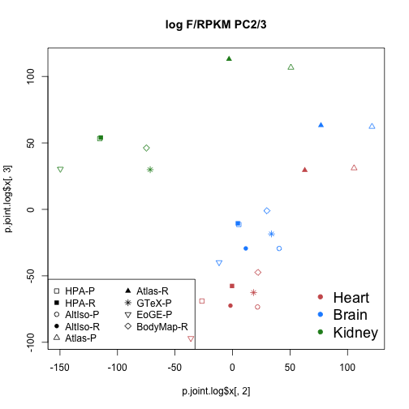 

ComBat (not shown):

```r
meta <- data.frame(study=c(rep("HPA",3),rep("AltIso",2),rep("GTex",3),rep("Atlas",3),rep("EoGE",3),rep("Atlas",3),rep("BodyMap",3),rep("HPA",3),rep("AltIso",2)),tissue=c("Heart","Brain","Kidney","Heart","Brain","Heart","Brain","Kidney","Heart","Brain","Kidney","Brain","Heart","Kidney","Brain","Heart","Kidney","Brain","Heart","Kidney","Brain","Heart","Kidney","Brain","Heart"),quantification=c(rep("other",11),rep("tophatcufflinks",14)))
batch <- meta$study
design <- model.matrix(~1,data=meta)
combat.j <- ComBat(dat=j.log,batch=batch,mod=design,numCovs=NULL,par.prior=TRUE)
```

```
## Found 6 batches
## Found 0  categorical covariate(s)
## Standardizing Data across genes
## Fitting L/S model and finding priors
## Finding parametric adjustments
## Adjusting the Data
```

```r
p.com <- prcomp(t(combat.j))
plot(p.com$x[,1],p.com$x[,2],pch=shapes,col=colors,main="ComBat PC1/2")
legend("topright",legend=c("Heart","Brain","Kidney"),col=c("indianred", "dodgerblue", "forestgreen"),cex=1.5,pch=20,bty="n")
legend("bottom",legend=c("HPA-P","HPA-R","AltIso-P","AltIso-R", "Atlas-P", "Atlas-R", "GTeX-P","EoGE-P", "BodyMap-R"),col="black",pch=c(0,15,1,16,2,17,8,6,5),ncol=2)
```

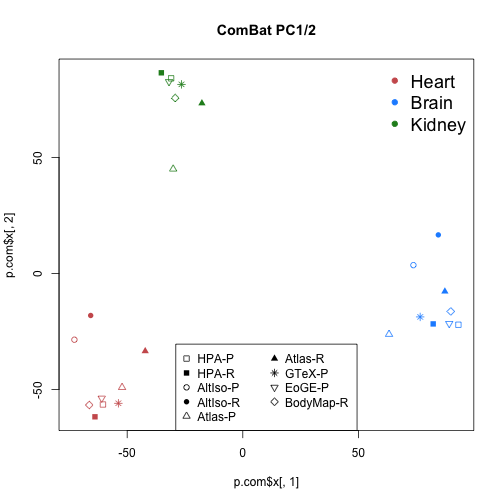 

ANOVAs including quantification method, (**Figure 4k-l**).


```r
sampleinfo_cufflinks$quantification <- "topcuff"
sampleinfo_published$quantification <- c(rep("topcuff",3),rep("custom_AltIso",2),rep("fluxcapacitor",3),rep("custom_Atlas",3))
studylabels_cuff <- c("EoGE_brain","EoEG_heart","EoEG_kidney","Atlas_brain","Atlas_heart","Atlas_kidney","BodyMap_brain","BodyMap_heart","BodyMap_kidney","HPA_brain","HPA_heart","HPA_kidney","AltIso_brain","AltIso_heart")
sampleinfo_cufflinks <- data.frame(Study_labels=studylabels_cuff, sampleinfo_cufflinks)
sampleinfo <- rbind(sampleinfo_published, sampleinfo_cufflinks)
par(mfrow=c(3,1))
do_anova(j, sampleinfo, caption="Joint analysis, raw F/RPKM", include.quant=T)
```

```
## Using  as id variables
```

```r
do_anova(j.log, sampleinfo, caption="Joint analysis, log F/RPKM", include.quant=T)
```

```
## Using  as id variables
```

```r
do_anova(combat.j, sampleinfo, caption="Joint analysis, ComBat adj log F/RPKM", include.quant=T)
```

```
## Using  as id variables
```

 
Analyses relating to Supplementary Figure 1.
--------------------------------------------
Correlations between PCs 1 and 2 and various factors (Supplementary figure 1).


```r
print_PCA_corrs(published,sampleinfo_published,caption="Published F/RPKM")
```

```
## Number_of_rawreads~PCAs: PCA1="0.248381"PCA2="0.402136"PCA3="0.693511
## Number_of_mappedreads~PCAs: PCA1="0.451197"PCA2="0.485476"PCA3="0.503067
## Tissues~PCAs: PCA1="0.027159"PCA2="0.618127"PCA3="0.374913"
## LibPrep~PCAs: PCA1="0.414216"PCA2="0.041227"PCA3="1.000000"
## Study~PCAs: PCA1="0.535538"PCA2="0.048584"PCA3="0.168499"
## Study~PCAs: PCA1="0.715001"PCA2="0.465209"PCA3="0.100348"
## ReadType~PCAs: PCA1="0.715001"PCA2="0.465209"PCA3="0.100348"
```

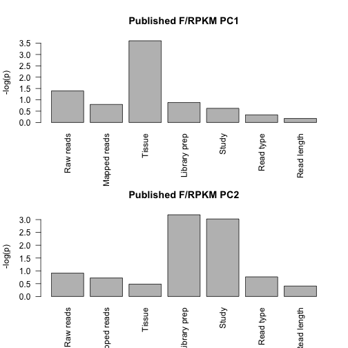 

```r
print_PCA_corrs(published.log,sampleinfo_published,caption="Published log F/RPKM")
```

```
## Number_of_rawreads~PCAs: PCA1="0.418167"PCA2="0.614426"PCA3="0.902918
## Number_of_mappedreads~PCAs: PCA1="0.172787"PCA2="0.902918"PCA3="0.967576
## Tissues~PCAs: PCA1="0.618127"PCA2="0.019757"PCA3="0.021968"
## LibPrep~PCAs: PCA1="0.014306"PCA2="0.220671"PCA3="0.220671"
## Study~PCAs: PCA1="0.033146"PCA2="0.594709"PCA3="0.294275"
## Study~PCAs: PCA1="0.028460"PCA2="0.201243"PCA3="0.855132"
## ReadType~PCAs: PCA1="0.028460"PCA2="0.201243"PCA3="0.855132"
```

 

```r
print_PCA_corrs(combat,sampleinfo_published,caption="Published ComBat adj log F/RPKM")
```

```
## Number_of_rawreads~PCAs: PCA1="0.203068"PCA2="0.775665"PCA3="0.881472
## Number_of_mappedreads~PCAs: PCA1="0.451197"PCA2="0.796592"PCA3="0.633870
## Tissues~PCAs: PCA1="0.011626"PCA2="0.021968"PCA3="0.977529"
## LibPrep~PCAs: PCA1="0.683091"PCA2="0.683091"PCA3="0.683091"
## Study~PCAs: PCA1="0.877472"PCA2="0.908798"PCA3="0.970466"
## Study~PCAs: PCA1="0.855132"PCA2="1.000000"PCA3="0.715001"
## ReadType~PCAs: PCA1="0.855132"PCA2="1.000000"PCA3="0.715001"
```

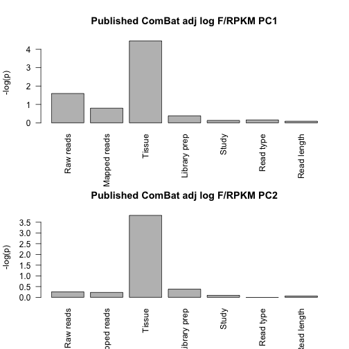 

```r
print_PCA_corrs(cufflinks_fpkms,sampleinfo_cufflinks,caption="Reprocessed F/RPKM")
```

```
## Number_of_rawreads~PCAs: PCA1="0.542316"PCA2="0.615812"PCA3="0.252961
## Number_of_mappedreads~PCAs: PCA1="0.583826"PCA2="0.382464"PCA3="0.552566
## Tissues~PCAs: PCA1="0.824600"PCA2="0.012962"PCA3="0.945809"
## LibPrep~PCAs: PCA1="0.015807"PCA2="0.242908"PCA3="0.139101"
## Study~PCAs: PCA1="0.031955"PCA2="0.749770"PCA3="0.045886"
## Study~PCAs: PCA1="0.245278"PCA2="0.897279"PCA3="0.009823"
## ReadType~PCAs: PCA1="0.245278"PCA2="0.897279"PCA3="0.009823"
```

 

```r
print_PCA_corrs(cufflinks_log,sampleinfo_cufflinks,caption="Reprocessed log F/RPKM")
```

```
## Number_of_rawreads~PCAs: PCA1="0.648476"PCA2="0.252961"PCA3="0.773199
## Number_of_mappedreads~PCAs: PCA1="0.573323"PCA2="0.087184"PCA3="0.435614
## Tissues~PCAs: PCA1="0.003071"PCA2="0.138662"PCA3="0.017724"
## LibPrep~PCAs: PCA1="0.585788"PCA2="0.015807"PCA3="0.035558"
## Study~PCAs: PCA1="0.896532"PCA2="0.096954"PCA3="0.223881"
## Study~PCAs: PCA1="0.796253"PCA2="0.796253"PCA3="1.000000"
## ReadType~PCAs: PCA1="0.796253"PCA2="0.796253"PCA3="1.000000"
```

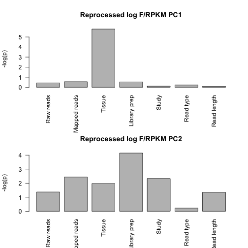 

```r
print_PCA_corrs(combat.cufflinks,sampleinfo_cufflinks,caption="Reprocessed ComBat adj log F/RPKM")
```

```
## Number_of_rawreads~PCAs: PCA1="0.692996"PCA2="0.391062"PCA3="0.365589
## Number_of_mappedreads~PCAs: PCA1="0.583826"PCA2="0.492398"PCA3="0.287738
## Tissues~PCAs: PCA1="0.003071"PCA2="0.003071"PCA3="0.903546"
## LibPrep~PCAs: PCA1="0.815335"PCA2="0.937947"PCA3="0.585788"
## Study~PCAs: PCA1="0.968205"PCA2="0.999600"PCA3="0.972095"
## Study~PCAs: PCA1="0.796253"PCA2="0.897279"PCA3="0.698535"
## ReadType~PCAs: PCA1="0.796253"PCA2="0.897279"PCA3="0.698535"
```

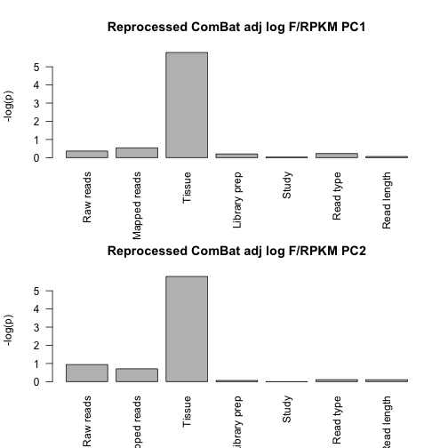 

```r
print_PCA_corrs(j,sampleinfo,caption="Joint analysis, F/RPKM",include.quant=T)
```

```
## Warning in cor.test.default(x[, 1], sampleinfo$NumberRaw, method =
## "spearman"): Cannot compute exact p-value with ties
```

```
## Warning in cor.test.default(x[, 2], sampleinfo$NumberRaw, method =
## "spearman"): Cannot compute exact p-value with ties
```

```
## Warning in cor.test.default(x[, 3], sampleinfo$NumberRaw, method =
## "spearman"): Cannot compute exact p-value with ties
```

```
## Number_of_rawreads~PCAs: PCA1="0.803591"PCA2="0.438636"PCA3="0.782412
```

```
## Warning in cor.test.default(x[, 1], sampleinfo$Numbermapped, method =
## "spearman"): Cannot compute exact p-value with ties
```

```
## Warning in cor.test.default(x[, 2], sampleinfo$Numbermapped, method =
## "spearman"): Cannot compute exact p-value with ties
```

```
## Warning in cor.test.default(x[, 3], sampleinfo$Numbermapped, method =
## "spearman"): Cannot compute exact p-value with ties
```

```
## Number_of_mappedreads~PCAs: PCA1="0.593636"PCA2="0.188381"PCA3="0.892388
## Tissues~PCAs: PCA1="0.000230"PCA2="0.075868"PCA3="0.832643"
## LibPrep~PCAs: PCA1="0.252080"PCA2="0.000287"PCA3="0.018560"
## Study~PCAs: PCA1="0.871625"PCA2="0.007401"PCA3="0.007750"
## Study~PCAs: PCA1="0.327545"PCA2="0.513941"PCA3="0.301387"
## ReadType~PCAs: PCA1="0.327545"PCA2="0.513941"PCA3="0.301387"
## QuantificationMethod~PCAs: PCA1="0.327545"PCA2="0.513941"PCA3="0.301387"
```

 

```r
print_PCA_corrs(j.log,sampleinfo,caption="Joint analysis, log F/RPKM",include.quant=T)
```

```
## Warning in cor.test.default(x[, 1], sampleinfo$NumberRaw, method =
## "spearman"): Cannot compute exact p-value with ties
```

```
## Warning in cor.test.default(x[, 2], sampleinfo$NumberRaw, method =
## "spearman"): Cannot compute exact p-value with ties
```

```
## Warning in cor.test.default(x[, 3], sampleinfo$NumberRaw, method =
## "spearman"): Cannot compute exact p-value with ties
```

```
## Number_of_rawreads~PCAs: PCA1="0.741902"PCA2="0.174526"PCA3="0.707503
```

```
## Warning in cor.test.default(x[, 1], sampleinfo$Numbermapped, method =
## "spearman"): Cannot compute exact p-value with ties
```

```
## Warning in cor.test.default(x[, 2], sampleinfo$Numbermapped, method =
## "spearman"): Cannot compute exact p-value with ties
```

```
## Warning in cor.test.default(x[, 3], sampleinfo$Numbermapped, method =
## "spearman"): Cannot compute exact p-value with ties
```

```
## Number_of_mappedreads~PCAs: PCA1="0.362139"PCA2="0.063942"PCA3="0.371112
## Tissues~PCAs: PCA1="0.000054"PCA2="0.015439"PCA3="0.001266"
## LibPrep~PCAs: PCA1="0.252080"PCA2="0.003423"PCA3="0.001822"
## Study~PCAs: PCA1="0.710896"PCA2="0.022280"PCA3="0.030101"
## Study~PCAs: PCA1="0.703389"PCA2="0.102725"PCA3="0.663459"
## ReadType~PCAs: PCA1="0.703389"PCA2="0.102725"PCA3="0.663459"
## QuantificationMethod~PCAs: PCA1="0.703389"PCA2="0.102725"PCA3="0.663459"
```

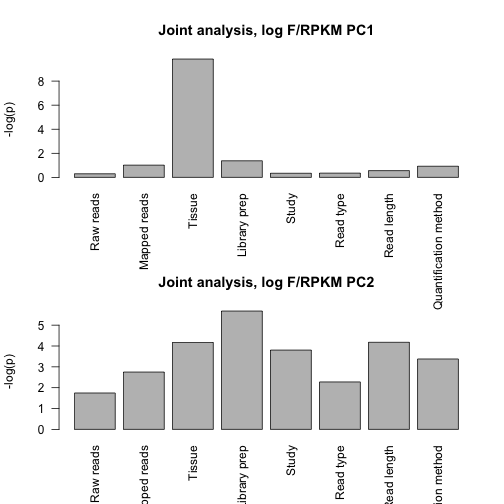 

```r
print_PCA_corrs(combat.j,sampleinfo,caption="Joint analysis, ComBat adj log F/RPKM",include.quant=T)
```

```
## Warning in cor.test.default(x[, 1], sampleinfo$NumberRaw, method =
## "spearman"): Cannot compute exact p-value with ties
```

```
## Warning in cor.test.default(x[, 2], sampleinfo$NumberRaw, method =
## "spearman"): Cannot compute exact p-value with ties
```

```
## Warning in cor.test.default(x[, 3], sampleinfo$NumberRaw, method =
## "spearman"): Cannot compute exact p-value with ties
```

```
## Number_of_rawreads~PCAs: PCA1="0.345634"PCA2="0.348530"PCA3="0.953366
```

```
## Warning in cor.test.default(x[, 1], sampleinfo$Numbermapped, method =
## "spearman"): Cannot compute exact p-value with ties
```

```
## Warning in cor.test.default(x[, 2], sampleinfo$Numbermapped, method =
## "spearman"): Cannot compute exact p-value with ties
```

```
## Warning in cor.test.default(x[, 3], sampleinfo$Numbermapped, method =
## "spearman"): Cannot compute exact p-value with ties
```

```
## Number_of_mappedreads~PCAs: PCA1="0.453001"PCA2="0.431960"PCA3="0.982501
## Tissues~PCAs: PCA1="0.000024"PCA2="0.000053"PCA3="0.889393"
## LibPrep~PCAs: PCA1="0.656031"PCA2="0.949266"PCA3="1.000000"
## Study~PCAs: PCA1="0.989826"PCA2="0.999314"PCA3="0.991491"
## Study~PCAs: PCA1="0.913372"PCA2="0.785650"PCA3="0.785650"
## ReadType~PCAs: PCA1="0.913372"PCA2="0.785650"PCA3="0.785650"
## QuantificationMethod~PCAs: PCA1="0.913372"PCA2="0.785650"PCA3="0.785650"
```

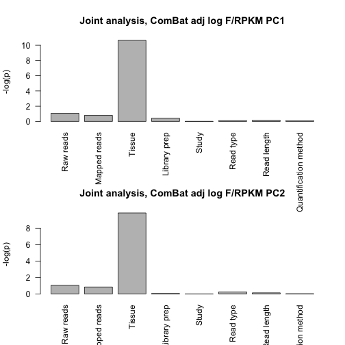 
Analyses relating to Supplementary Figure 2.
--------------------------------------------
Let's compare the FPKM distribution in the samples before and after merge


```r
altIso_all <- read.delim("altiso_fpkms.txt",sep="\t",stringsAsFactors=FALSE)
gtex_all <- read.delim("gtex_fpkms.txt",sep="\t",stringsAsFactors=FALSE)
HPA_all <- read.delim("hpa_fpkms.txt",sep="\t",stringsAsFactors=FALSE)

#Atlas requires a little bit of extra work:
atlas <- read.delim("atlas_fpkms_all.txt",sep="\t",stringsAsFactors=FALSE)
library(org.Hs.eg.db)
library(data.table)
m <- org.Hs.egENSEMBL
mapped_genes <- mappedkeys(m)
ensg.for.entrez <- as.list(m[mapped_genes])
remapped.ensg <- ensg.for.entrez[as.character(atlas$entrez_gene_id)]
atlas$remapped_ensg <- as.character(remapped.ensg)

# And add expression values
data.dt <- data.table(atlas[,6:ncol(atlas)])
setkey(data.dt, remapped_ensg)
temp <- data.dt[, lapply(.SD, sum), by=remapped_ensg]
collapsed <- as.data.frame(temp)
atlas_all <- collapsed[,c("remapped_ensg","hypothalamus","heart","kidney")]

colnames(altIso_all)[1] <- "ENSEMBL_ID"
altIso_pc <- getPcs(altIso_all)

colnames(atlas_all)[c(1:2)] <- c("ENSEMBL_ID","brain")
atlas_pc <- getPcs(atlas_all)

colnames(gtex_all)[1] <- "ENSEMBL_ID"
gtex_pc <- getPcs(gtex_all)

colnames(HPA_all)[1] <- "ENSEMBL_ID"
HPA_pc <- getPcs(HPA_all)
                                  
#-----------NON-MERGED DATA-----------
all_altIso_heart <- distr_data(altIso_pc,"heart","AltIso",1)
all_atlas_heart <- distr_data(atlas_pc,"heart","Atlas",1)
all_gtex_heart <- distr_data(gtex_pc,"heart","gtex",1)
all_HPA_heart <- distr_data(HPA_pc,"heart","HPA",1)

all_altIso_brain <- distr_data(altIso_pc,"brain","AltIso",1)
all_atlas_brain <- distr_data(atlas_pc,"brain","Atlas",1)
all_gtex_brain <- distr_data(gtex_pc,"brain","gtex",1)
all_HPA_brain <- distr_data(HPA_pc,"brain","HPA",1)

all_atlas_kidney <- distr_data(atlas_pc,"kidney","Atlas",1)
all_gtex_kidney <- distr_data(gtex_pc,"kidney","gtex",1)
all_HPA_kidney <- distr_data(HPA_pc,"kidney","HPA",1)

#-----------MERGED DATA-----------

merg_altIso_heart <- distr_data(published.nozero,"heart","AltIso",2)
merg_atlas_heart <- distr_data(published.nozero,"heart","Atlas",2)
merg_gtex_heart <- distr_data(published.nozero,"heart","GTEx",2)
merg_HPA_heart <- distr_data(published.nozero,"heart","HPA",2)

merg_altIso_brain <- distr_data(published.nozero,"brain","AltIso",2)
merg_atlas_brain <- distr_data(published.nozero,"brain","Atlas",2)
merg_gtex_brain <- distr_data(published.nozero,"brain","GTEx",2)
merg_HPA_brain <- distr_data(published.nozero,"brain","HPA",2)

merg_atlas_kidney <- distr_data(published.nozero,"kidney","Atlas",2)
merg_gtex_kidney <- distr_data(published.nozero,"kidney","GTEx",2)
merg_HPA_kidney <- distr_data(published.nozero,"kidney","HPA",2)

#--------------RE-PROCESSED DATA-----------------------------

repr_altIso_heart <- distr_data_repr(cufflinks_pc_nozero,"heart","AltIso")
repr_atlas_heart <- distr_data_repr(cufflinks_pc_nozero,"heart","Atlas")
repr_Bodymap_heart <- distr_data_repr(cufflinks_pc_nozero,"heart","BodyMap")
repr_EoGE_heart <- distr_data_repr(cufflinks_pc_nozero,"heart","EoGE")
repr_HPA_heart <- distr_data_repr(cufflinks_pc_nozero,"heart","HPA")

repr_altIso_brain <- distr_data_repr(cufflinks_pc_nozero,"brain","AltIso")
repr_atlas_brain <- distr_data_repr(cufflinks_pc_nozero,"brain","Atlas")
repr_Bodymap_brain <- distr_data_repr(cufflinks_pc_nozero,"brain","BodyMap")
repr_EoGE_brain <- distr_data_repr(cufflinks_pc_nozero,"brain","EoGE")
repr_HPA_brain <- distr_data_repr(cufflinks_pc_nozero,"brain","HPA")

repr_atlas_kidney <- distr_data_repr(cufflinks_pc_nozero,"kidney","Atlas")
repr_Bodymap_kidney <- distr_data_repr(cufflinks_pc_nozero,"kidney","BodyMap")
repr_EoGE_kidney <- distr_data_repr(cufflinks_pc_nozero,"kidney","EoGE")
repr_HPA_kidney <- distr_data_repr(cufflinks_pc_nozero,"kidney","HPA")

#--------------PLOT DISTRIBUTIONS NON-MERGED DATA-----------------------------

all_altiso <- rbind(all_altIso_brain,all_altIso_heart)
all_atlas <- rbind(all_atlas_brain,all_atlas_heart,all_atlas_kidney)
all_gtex <- rbind(all_gtex_brain,all_gtex_heart,all_gtex_kidney)
all_hpa <- rbind(all_HPA_brain,all_HPA_heart,all_HPA_kidney)

all_data_beforemerge <- rbind(all_altiso,all_atlas,all_gtex,all_hpa)

brain_data_beforemerge <- rbind(all_altIso_brain,
                                all_atlas_brain,
                                all_gtex_brain,
                                all_HPA_brain)

heart_data_beforemerge <- rbind(all_altIso_heart,
                                all_atlas_heart,
                                all_gtex_heart,
                                all_HPA_heart)


kidney_data_beforemerge <- rbind(all_atlas_kidney,
                                 all_gtex_kidney,
                                 all_HPA_kidney)


ggplot(all_data_beforemerge, aes(log2(FPKM+1), colour = study)) + geom_density(alpha = 0.2,size=0.6) + xlim(0, 7) + theme_bw() + theme(panel.grid.major = element_blank(), panel.grid.minor = element_blank()) 
```

```
## Warning: Removed 727 rows containing non-finite values (stat_density).
```

```
## Warning: Removed 506 rows containing non-finite values (stat_density).
```

```
## Warning: Removed 732 rows containing non-finite values (stat_density).
```

```
## Warning: Removed 1455 rows containing non-finite values (stat_density).
```

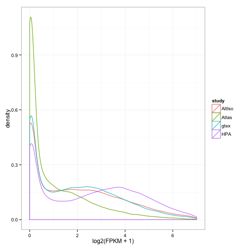 

```r
ggplot(brain_data_beforemerge, aes(log2(FPKM+1), colour = study)) + geom_density(alpha = 0.2,size=0.6) + xlim(0, 7) + theme_bw() + theme(panel.grid.major = element_blank(), panel.grid.minor = element_blank())
```

```
## Warning: Removed 375 rows containing non-finite values (stat_density).
```

```
## Warning: Removed 181 rows containing non-finite values (stat_density).
```

```
## Warning: Removed 225 rows containing non-finite values (stat_density).
```

```
## Warning: Removed 364 rows containing non-finite values (stat_density).
```

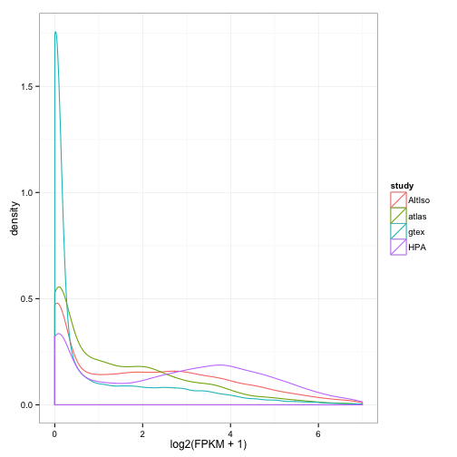 

```r
ggplot(heart_data_beforemerge, aes(log2(FPKM+1), colour = study)) + geom_density(alpha = 0.2,size=0.6) + xlim(0, 7) + theme_bw() + theme(panel.grid.major = element_blank(), panel.grid.minor = element_blank())
```

```
## Warning: Removed 352 rows containing non-finite values (stat_density).
```

```
## Warning: Removed 209 rows containing non-finite values (stat_density).
```

```
## Warning: Removed 241 rows containing non-finite values (stat_density).
```

```
## Warning: Removed 569 rows containing non-finite values (stat_density).
```

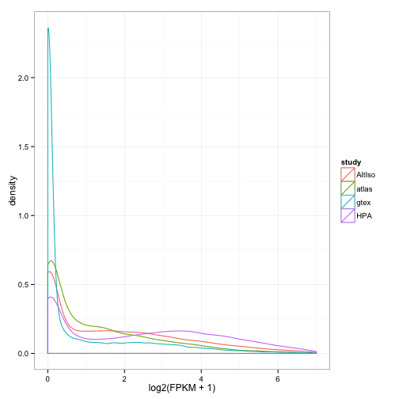 

```r
ggplot(kidney_data_beforemerge, aes(log2(FPKM+1), colour = study)) + geom_density(alpha = 0.2,size=0.6) + xlim(0, 7) + theme_bw() + theme(panel.grid.major = element_blank(), panel.grid.minor = element_blank())
```

```
## Warning: Removed 116 rows containing non-finite values (stat_density).
```

```
## Warning: Removed 266 rows containing non-finite values (stat_density).
```

```
## Warning: Removed 522 rows containing non-finite values (stat_density).
```

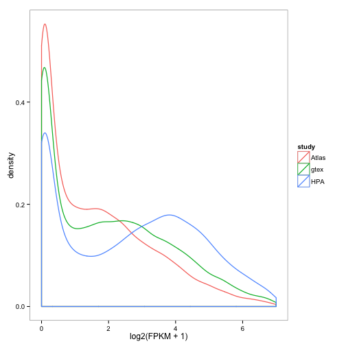 

```r
#--------------PLOT DISTRIBUTIONS MERGED DATA-----------------------------
merg_altiso <- rbind(merg_altIso_brain,merg_altIso_heart)
merg_atlas <- rbind(merg_atlas_brain,merg_atlas_heart,merg_atlas_kidney)
merg_gtex <- rbind(merg_gtex_brain,merg_gtex_heart,merg_gtex_kidney)
merg_hpa <- rbind(merg_HPA_brain,merg_HPA_heart,merg_HPA_kidney)

merged_data <- rbind(merg_altiso,merg_atlas,merg_gtex,merg_hpa)
brain_data_merged <- rbind(merg_altIso_brain,
                           merg_atlas_brain,
                           merg_gtex_brain,
                           merg_HPA_brain)

heart_data_merged <- rbind(merg_altIso_heart,
                           merg_atlas_heart,
                           merg_gtex_heart,
                           merg_HPA_heart)

kidney_data_merged <- rbind(merg_atlas_kidney,
                            merg_gtex_kidney,
                            merg_HPA_kidney)


ggplot(merged_data, aes(log2(FPKM+1), colour = study)) + geom_density(alpha = 0.2,size=0.6) + xlim(0, 7) + theme_bw() + theme(panel.grid.major = element_blank(), panel.grid.minor = element_blank())
```

```
## Warning: Removed 608 rows containing non-finite values (stat_density).
```

```
## Warning: Removed 447 rows containing non-finite values (stat_density).
```

```
## Warning: Removed 571 rows containing non-finite values (stat_density).
```

```
## Warning: Removed 1124 rows containing non-finite values (stat_density).
```

 

```r
ggplot(brain_data_merged, aes(log2(FPKM+1), colour = study)) + geom_density(alpha = 0.2,size=0.6) + xlim(0, 7) + theme_bw() + theme(panel.grid.major = element_blank(), panel.grid.minor = element_blank())
```

```
## Warning: Removed 308 rows containing non-finite values (stat_density).
```

```
## Warning: Removed 163 rows containing non-finite values (stat_density).
```

```
## Warning: Removed 166 rows containing non-finite values (stat_density).
```

```
## Warning: Removed 278 rows containing non-finite values (stat_density).
```

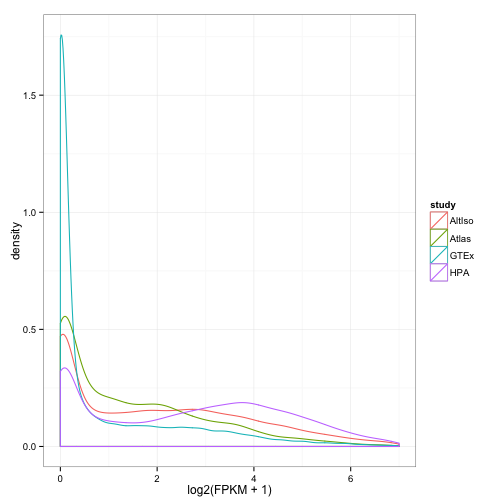 

```r
ggplot(heart_data_merged, aes(log2(FPKM+1), colour = study)) + geom_density(alpha = 0.2,size=0.6) + xlim(0, 7) + theme_bw() + theme(panel.grid.major = element_blank(), panel.grid.minor = element_blank())
```

```
## Warning: Removed 300 rows containing non-finite values (stat_density).
```

```
## Warning: Removed 182 rows containing non-finite values (stat_density).
```

```
## Warning: Removed 197 rows containing non-finite values (stat_density).
```

```
## Warning: Removed 432 rows containing non-finite values (stat_density).
```

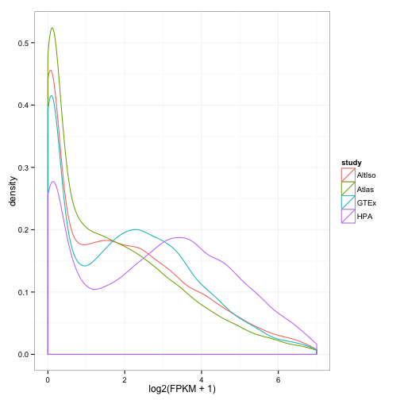 

```r
ggplot(kidney_data_merged, aes(log2(FPKM+1), colour = study)) + geom_density(alpha = 0.2,size=0.6) + xlim(0, 7) + theme_bw() + theme(panel.grid.major = element_blank(), panel.grid.minor = element_blank())
```

```
## Warning: Removed 102 rows containing non-finite values (stat_density).
```

```
## Warning: Removed 208 rows containing non-finite values (stat_density).
```

```
## Warning: Removed 414 rows containing non-finite values (stat_density).
```

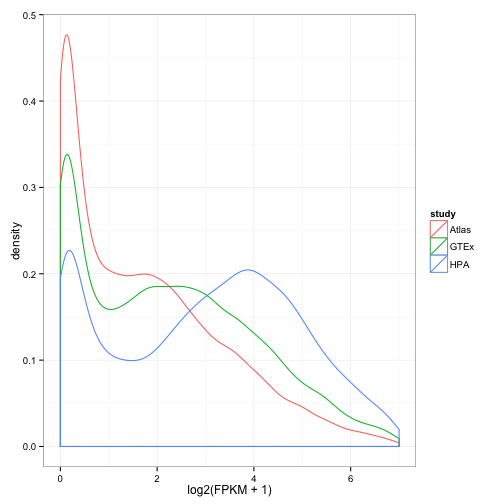 

```r
#--------------PLOT DISTRIBUTIONS  DATA-----------------------------

repr_altiso <- rbind(repr_altIso_brain,repr_altIso_heart)
repr_atlas <- rbind(repr_atlas_brain,repr_atlas_heart,repr_atlas_kidney)
repr_BodyMap <- rbind(repr_Bodymap_brain,repr_Bodymap_heart,repr_Bodymap_kidney)
repr_EoGE <- rbind(repr_EoGE_brain,repr_EoGE_heart,repr_EoGE_kidney)
repr_HPA <- rbind(repr_HPA_brain,repr_HPA_heart,repr_HPA_kidney)

repr_data <- rbind(repr_altiso,repr_atlas,repr_BodyMap,repr_EoGE,repr_HPA)

brain_data_repr <- rbind(repr_altIso_brain,
                           repr_atlas_brain,
                           repr_Bodymap_brain,
                           repr_EoGE_brain,
                           repr_HPA_brain)

heart_data_repr <- rbind(repr_altIso_heart,
                           repr_atlas_heart,
                           repr_Bodymap_heart,
                           repr_EoGE_heart,
                           repr_HPA_heart)

kidney_data_repr <- rbind(repr_atlas_kidney,
                           repr_Bodymap_kidney,
                           repr_EoGE_kidney,
                           repr_HPA_kidney)

ggplot(repr_data, aes(log2(FPKM+1), colour = study)) + geom_density(alpha = 0.2,size=0.6) + xlim(0, 7) + theme_bw() + theme(panel.grid.major = element_blank(), panel.grid.minor = element_blank())
```

```
## Warning: Removed 1150 rows containing non-finite values (stat_density).
```

```
## Warning: Removed 1546 rows containing non-finite values (stat_density).
```

```
## Warning: Removed 1267 rows containing non-finite values (stat_density).
```

```
## Warning: Removed 2621 rows containing non-finite values (stat_density).
```

```
## Warning: Removed 1395 rows containing non-finite values (stat_density).
```

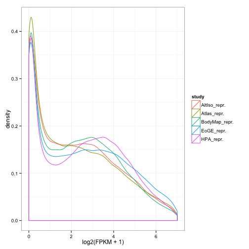 

```r
ggplot(brain_data_repr, aes(log2(FPKM+1), colour = study)) + geom_density(alpha = 0.2,size=0.6) + xlim(0, 7) + theme_bw() + theme(panel.grid.major = element_blank(), panel.grid.minor = element_blank())
```

```
## Warning: Removed 637 rows containing non-finite values (stat_density).
```

```
## Warning: Removed 620 rows containing non-finite values (stat_density).
```

```
## Warning: Removed 459 rows containing non-finite values (stat_density).
```

```
## Warning: Removed 881 rows containing non-finite values (stat_density).
```

```
## Warning: Removed 391 rows containing non-finite values (stat_density).
```

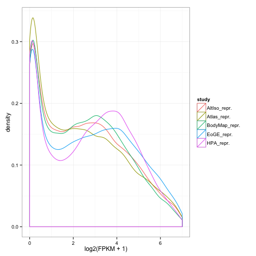 

```r
ggplot(heart_data_repr, aes(log2(FPKM+1), colour = study)) + geom_density(alpha = 0.2,size=0.6) + xlim(0, 7) + theme_bw() + theme(panel.grid.major = element_blank(), panel.grid.minor = element_blank())
```

```
## Warning: Removed 513 rows containing non-finite values (stat_density).
```

```
## Warning: Removed 540 rows containing non-finite values (stat_density).
```

```
## Warning: Removed 380 rows containing non-finite values (stat_density).
```

```
## Warning: Removed 654 rows containing non-finite values (stat_density).
```

```
## Warning: Removed 403 rows containing non-finite values (stat_density).
```

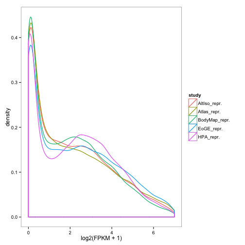 

```r
ggplot(kidney_data_repr, aes(log2(FPKM+1), colour = study)) + geom_density(alpha = 0.2,size=0.6) + xlim(0, 7) + theme_bw() + theme(panel.grid.major = element_blank(), panel.grid.minor = element_blank())
```

```
## Warning: Removed 386 rows containing non-finite values (stat_density).
```

```
## Warning: Removed 428 rows containing non-finite values (stat_density).
```

```
## Warning: Removed 1086 rows containing non-finite values (stat_density).
```

```
## Warning: Removed 601 rows containing non-finite values (stat_density).
```

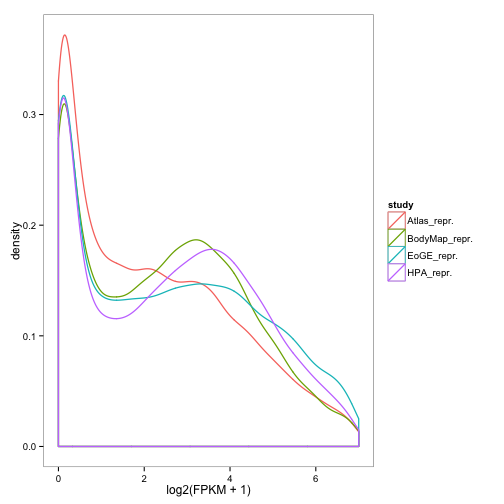 

Analyses relating to Supplementary Figure 3.


```r
boxplot(published.nozero,outline=F,las=2,main="F/RPKM distributions, published data\n(Outliers not shown for clarity)",cex.axis=0.8)
```

 

Analyses relating to Supplementary Figure 4.
Quantile normalization


```r
published.qn <- quantile_normalisation(published.nozero)
published.log.qn <- quantile_normalisation(published.log)

plot.pca.published(published.qn,1,2,"Quantile normalized")
```

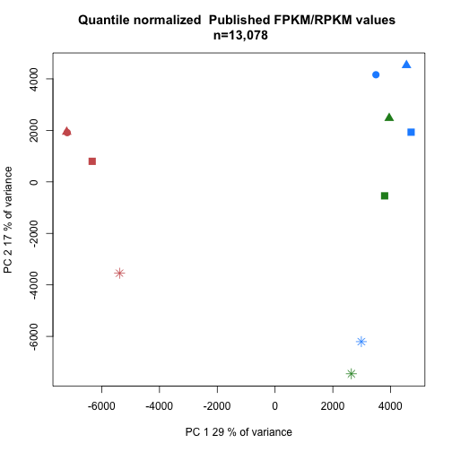 

```r
plot.pca.published(published.qn,2,3,"Quantile normalized")
```

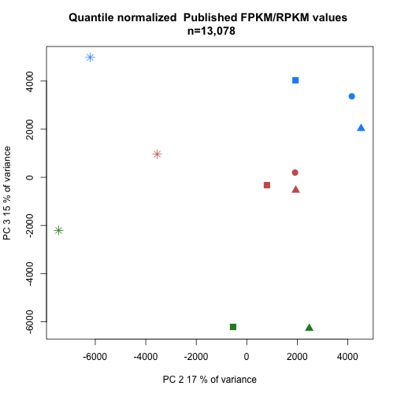 

```r
plot.pca.published(published.log.qn,1,2,"Quantile normalized log2")
```

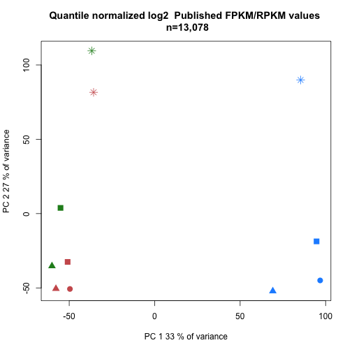 

```r
plot.pca.published(published.log.qn,2,3,"Quantile normalized log2")
```

 
