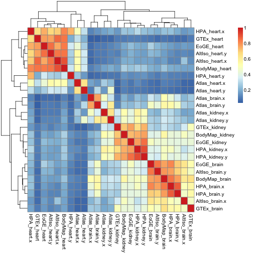
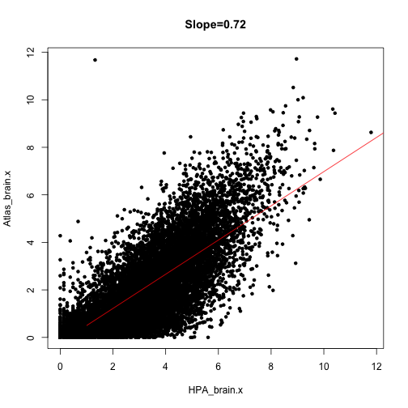
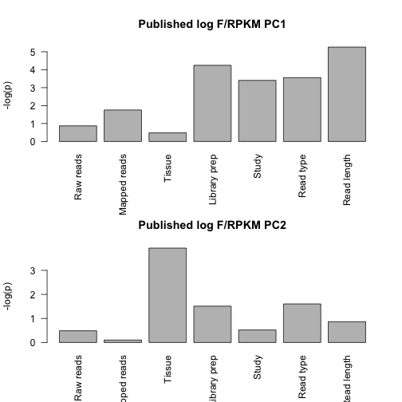
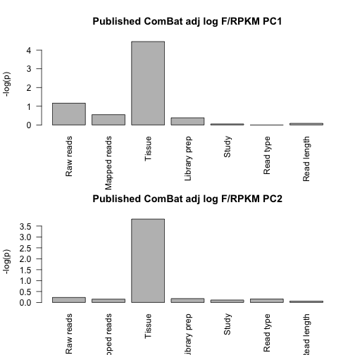
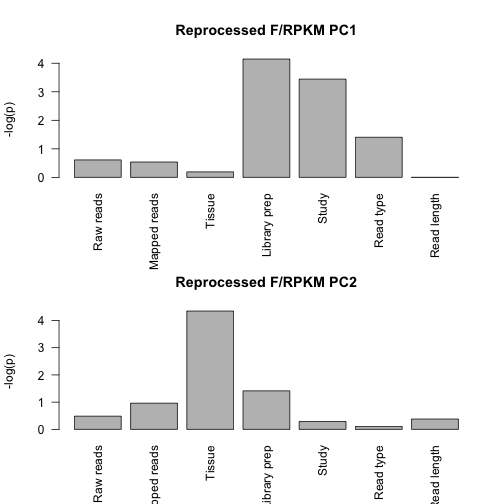
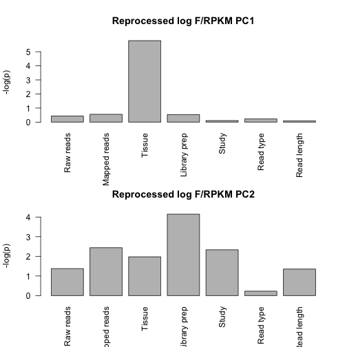
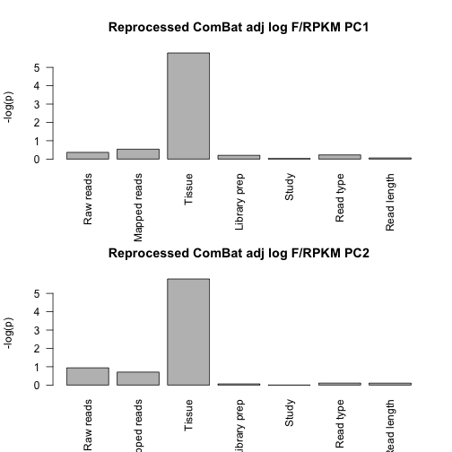
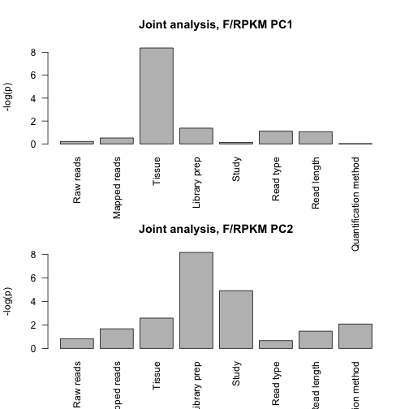
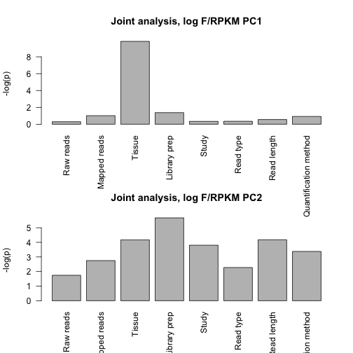
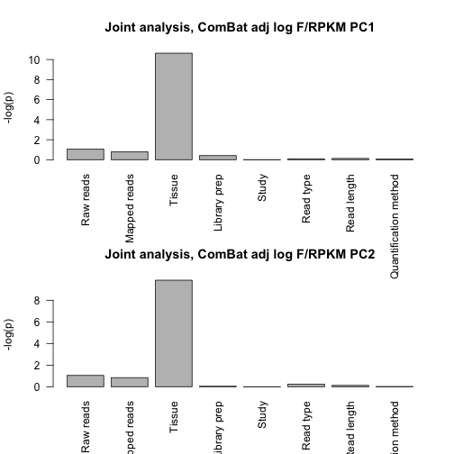

Walkthrough with all data analyses that comes with the manuscript
Comparing published FPKM/RPKM values and reprocessed FPKM values.
========================================================

The first part of this document defines some helper functions and then shows in detail how data were downloaded and combined. However, most of the material related to downloading and combining is commented out - it is just left for reference. 

Prepare by loading packages etc.

```r
library(pheatmap)
library(reshape)
library(gplots)
```

```
## Warning: package 'gplots' was built under R version 3.1.2
```

```
## 
## Attaching package: 'gplots'
## 
## The following object is masked from 'package:stats':
## 
##     lowess
```

```r
library(ops)
```

```
## 
## Attaching package: 'ops'
## 
## The following object is masked from 'package:stats':
## 
##     filter
```

```r
library(calibrate)
```

```
## Loading required package: MASS
```

```r
library(biomaRt)
library(sva)
```

```
## Loading required package: mgcv
```

```
## Warning: package 'mgcv' was built under R version 3.1.2
```

```
## Loading required package: nlme
## This is mgcv 1.8-4. For overview type 'help("mgcv-package")'.
## Loading required package: genefilter
## 
## Attaching package: 'genefilter'
## 
## The following object is masked from 'package:MASS':
## 
##     area
## 
## The following object is masked from 'package:base':
## 
##     anyNA
```
Function definitions
--------------------
Define functions for (a) computing and plotting p-values for correlations between PCA scores and various sample features and (b) quantifying and plotting the importance of various sample features using ANOVA.

**Correlations between PCs and experimental factors.**

```r
 print_PCA_corrs <- function(data,sampleinfo,caption="PCA correlations",include.quant=F){
pca <- prcomp(t(data[,]))
rot <- pca$r
x <- pca$x

if(include.quant){
  pc1 <- rep(1,8)
names(pc1) <- c("Raw reads","Mapped reads", "Tissue", "Library prep", "Study", "Read type", "Read length","Quantification method")
pc2 <- rep(1,8)
}
else{pc1 <- rep(1,7)
names(pc1) <- c("Raw reads","Mapped reads", "Tissue", "Library prep", "Study", "Read type", "Read length")
pc2 <- rep(1,7)
}
names(pc2) <- names(pc1)

# Test correlations between number of seq'd reads and PCs 1-4 from prcomp
pval.nraw.pc1 <- cor.test(x[,1], sampleinfo$NumberRaw,method="spearman")$p.value
pval.nraw.pc2 <- cor.test(x[,2], sampleinfo$NumberRaw,method="spearman")$p.value
pval.nraw.pc3 <- cor.test(x[,3], sampleinfo$NumberRaw,method="spearman")$p.value

cat(sprintf("Number_of_rawreads~PCAs: PCA1=\"%f\"PCA2=\"%f\"PCA3=\"%f\n", pval.nraw.pc1,pval.nraw.pc2,pval.nraw.pc3))

pc1[1] <- pval.nraw.pc1
pc2[1] <- pval.nraw.pc2

pval.nmapped.pc1 <- cor.test(x[,1], sampleinfo$Numbermapped,method="spearman")$p.value
pval.nmapped.pc2 <- cor.test(x[,2], sampleinfo$Numbermapped,method="spearman")$p.value
pval.nmapped.pc3 <- cor.test(x[,3], sampleinfo$Numbermapped,method="spearman")$p.value

cat(sprintf("Number_of_mappedreads~PCAs: PCA1=\"%f\"PCA2=\"%f\"PCA3=\"%f\n", pval.nmapped.pc1,pval.nmapped.pc2,pval.nmapped.pc3))

pc1[2] <- pval.nmapped.pc1
pc2[2] <- pval.nmapped.pc2

# For tissue, use kruskal.test which handles ordinal variables 
pval.tissue.pc1<-kruskal.test(x[,1], sampleinfo$Tissue)$p.value
pval.tissue.pc2<-kruskal.test(x[,2], sampleinfo$Tissue)$p.value
pval.tissue.pc3<-kruskal.test(x[,3], sampleinfo$Tissue)$p.value

cat(sprintf("Tissues~PCAs: PCA1=\"%f\"PCA2=\"%f\"PCA3=\"%f\"\n", pval.tissue.pc1,pval.tissue.pc2,pval.tissue.pc3))

pc1[3] <- pval.tissue.pc1
pc2[3] <- pval.tissue.pc2

# Library prep 
pval.prep.pc1<-kruskal.test(x[,1], sampleinfo$Preparation)$p.value
pval.prep.pc2<-kruskal.test(x[,2], sampleinfo$Preparation)$p.value
pval.prep.pc3<-kruskal.test(x[,3], sampleinfo$Preparation)$p.value

cat(sprintf("LibPrep~PCAs: PCA1=\"%f\"PCA2=\"%f\"PCA3=\"%f\"\n", pval.prep.pc1,pval.prep.pc2,pval.prep.pc3))

pc1[4] <- pval.prep.pc1
pc2[4] <- pval.prep.pc2

# Study  
pval.study.pc1<-kruskal.test(x[,1], sampleinfo$Study)$p.value
pval.study.pc2<-kruskal.test(x[,2], sampleinfo$Study)$p.value
pval.study.pc3<-kruskal.test(x[,3], sampleinfo$Study)$p.value

cat(sprintf("Study~PCAs: PCA1=\"%f\"PCA2=\"%f\"PCA3=\"%f\"\n", pval.study.pc1,pval.study.pc2,pval.study.pc3))

pc1[5] <- pval.study.pc1
pc2[5] <- pval.study.pc2

# Layout
pval.layout.pc1<-kruskal.test(x[,1], sampleinfo$Readtype)$p.value
pval.layout.pc2<-kruskal.test(x[,2], sampleinfo$Readtype)$p.value
pval.layout.pc3<-kruskal.test(x[,3], sampleinfo$Readtype)$p.value

cat(sprintf("Study~PCAs: PCA1=\"%f\"PCA2=\"%f\"PCA3=\"%f\"\n", pval.layout.pc1,pval.layout.pc2,pval.layout.pc3))

pc1[6] <- pval.layout.pc1
pc2[6] <- pval.layout.pc2

# Read length
pval.readlength.pc1<-cor.test(x[,1], sampleinfo$readlength)$p.value
pval.readlength.pc2<-cor.test(x[,2], sampleinfo$readlength)$p.value
pval.readlength.pc3<-cor.test(x[,3], sampleinfo$readlength)$p.value

cat(sprintf("ReadType~PCAs: PCA1=\"%f\"PCA2=\"%f\"PCA3=\"%f\"\n", pval.layout.pc1,pval.layout.pc2,pval.layout.pc3))

pc1[7] <- pval.readlength.pc1
pc2[7] <- pval.readlength.pc2

# Quantification
if(include.quant){
pval.quant.pc1<-kruskal.test(x[,1], as.factor(sampleinfo$quantification))$p.value
pval.quant.pc2<-kruskal.test(x[,2], as.factor(sampleinfo$quantification))$p.value
pval.quant.pc3<-kruskal.test(x[,3], as.factor(sampleinfo$quantification))$p.value

cat(sprintf("QuantificationMethod~PCAs: PCA1=\"%f\"PCA2=\"%f\"PCA3=\"%f\"\n", pval.layout.pc1,pval.layout.pc2,pval.layout.pc3))

pc1[8] <- pval.quant.pc1
pc2[8] <- pval.quant.pc2
}
par(mfrow=c(2,1))
barplot(-log(pc1),las=2,main=paste(caption, "PC1"),ylab="-log(p)")
barplot(-log(pc2),las=2,main=paste(caption, "PC2"),ylab="-log(p)")
}
```

** ANOVA for estimating the influence of different factors.**

```r
do_anova <- function(data, sampleinfo, caption="ANOVA", include.quant=F){
m <- melt(data)
colnames(m) <- c("sample_ID","RPKM")
if (include.quant){
  meta <- sampleinfo[,c("Study","Tissue","Preparation","NumberRaw","Numbermapped","Readtype","readlength","quantification")]}
else{
  meta <- sampleinfo[,c("Study","Tissue","Preparation","NumberRaw","Numbermapped","Readtype","readlength")]}
rownames(meta) <- colnames(data)
tissue <- rep(meta$Tissue, each=nrow(data))
study <- rep(meta$Study, each=nrow(data))
prep <- rep(meta$Preparation, each=nrow(data))
layout <- rep(meta$Readtype, each=nrow(data))
raw <- rep(meta$NumberRaw, each=nrow(data))
mapped <- rep(meta$Numbermapped, each=nrow(data))
readlen <- rep(meta$readlength, each=nrow(data))
if(include.quant){
quant <- rep(meta$quantification, each=nrow(data))
matrix <- data.frame(m, tissue=tissue, study=study, prep=prep, layout=layout, readlen=readlen, nraw=raw,nmapped=mapped, quant=quant)
fit <- lm(RPKM ~ layout + readlen + prep + nraw + quant + study + tissue, data=matrix)
}
else{
matrix <- data.frame(m, tissue=tissue, study=study, prep=prep, layout=layout, readlen=readlen, nraw=raw,nmapped=mapped)
fit <- lm(RPKM ~ layout + readlen + prep + nraw + study + tissue, data=matrix)
}

a <- anova(fit)
nfac <- length(a[,1])-1
maxval = 100
barplot(100*a$"Sum Sq"[1:nfac]/sum(a$"Sum Sq"[1:nfac]),names.arg=rownames(a[1:nfac,]),main=caption,ylim=c(0,maxval))
}
```

**Function for plotting the highest gene loadings in PCA.**

```r
plot.highest.loadings <- function(p, caption="Highest loading"){
      par(mfrow=c(3,1))
      for(i in 1:3){
      load <- p$rotation[,i][order(p$rotation[,i])]
      extreme <- c(tail(load), head(load))
      extreme.ensg <- names(extreme)
      ensembl = useMart("ensembl", dataset = "hsapiens_gene_ensembl") #select the ensembl database
      extreme.symbols <- getBM(attributes=c("ensembl_gene_id", "hgnc_symbol"), 
                           filters = "ensembl_gene_id",
                           values=extreme.ensg,
                           mart=ensembl)
      q <- extreme.symbols[,2]
      names(q) <- extreme.symbols[,1]
      fpkm <- cbind(q[extreme.ensg],published.nozero[extreme.ensg,])
      names(fpkm)[names(fpkm) == 'q[extreme.ensg]'] <- 'Gene Symbol'
      barplot(extreme, names.arg=q[extreme.ensg],las=2,main=paste0(caption, ", PC", i))
      print(fpkm)
     }
}
```

Downloading public data sets
----------------------------
Data from four different public sources are downloaded and brain, heart and kidney samples are extracted. Please uncomment the next blocks to download; we have commented this code out because the downloading of the GTEx data in particular takes a fair amount of time.

Start with Human Protein Atlas (HPA):


```r
#temp <- tempfile()
#download.file(url="http://www.proteinatlas.org/download/rna.csv.zip",destfile=temp)
#hpa <- read.csv(unz(temp, "rna.csv"))
#unlink(temp)

#hpa.heart <- hpa[hpa$Sample=="heart muscle", c("Gene", "Value")]
#hpa.brain <- hpa[hpa$Sample=="cerebral cortex", c("Gene", "Value")]
#hpa.kidney <- hpa[hpa$Sample=="kidney", c("Gene", "Value")]

#hpa.fpkms <- merge(hpa.heart, hpa.brain, by="Gene")
#hpa.fpkms <- merge(hpa.fpkms, hpa.kidney, by="Gene")
#colnames(hpa.fpkms) <- c("ENSG_ID", "HPA_heart", "HPA_brain", "HPA_kidney")
```

Check if the identifiers are unique and write table to file.


```r
#length(hpa.fpkms[,1])
#length(unique(hpa.fpkms[,1]))

#write.table(hpa.fpkms,file="hpa_fpkms.txt",quote=F,sep="\t")
```

The next dataset, "AltIso", is from the article "Alternative isoform regulation in human tissue transcriptomes.." by Wang et al.


```r
#temp <- tempfile()
#download.file(url="http://genes.mit.edu/burgelab/Supplementary/wang_sandberg08/hg18.ensGene.CEs.rpkm.txt",destfile=temp)
#altiso <- read.delim(temp, sep="\t")
#unlink(temp)
```

There is no kidney sample here, so just use heart and brain.


```r
#altiso.fpkms <- altiso[,c("X.Gene","heart","brain")]
#colnames(altiso.fpkms) <- c("ENSG_ID", "AltIso_heart", "AltIso_brain")
```

Check uniqueness of IDs.


```r
#length(altiso.fpkms[,1])
#length(unique(altiso.fpkms[,1]))

#write.table(altiso.fpkms,file="altiso_fpkms.txt",quote=F,sep="\t")
```

The next dataset is derived from "GTEx": Genotype-Tissue Expression.

This is a big download: 337.8 Mb (as of 2014-02-04)
We also add some code to randomly select one sample from each tissue type; there are many biological replicates in this data set.


```r
#temp <- tempfile()
#download.file(url="http://www.gtexportal.org/home/rest/file/download?portalFileId=175729&forDownload=true",destfile=temp)
#header_lines <- readLines(temp, n=2)
#gtex <- read.delim(temp, skip=2, sep="\t")
#unlink(temp)

#write.table(gtex, file="gtex_all.txt",   quote=F, sep="\t")

#download.file(url="http://www.gtexportal.org/home/rest/file/download?portalFileId=175707&forDownload=true",destfile="GTEx_description.txt")

#metadata <- read.delim("GTEx_description.txt", sep="\t")
```

The metadata table seems to contain entries that are not in the RPKM table.


```r
#samp.id <- gsub('-','.',metadata$SAMPID)
#eligible.samples <- which(samp.id %in% colnames(gtex))
#metadata <- metadata[eligible.samples,]
```

Select random heart, kidney and brain samples.


```r
#random.heart <- sample(which(metadata$SMTS=="Heart"), size=1)
#random.heart.samplename <- gsub('-','.',metadata[random.heart, "SAMPID"])
#gtex.heart.fpkm <- as.numeric(gtex[,random.heart.samplename])

#random.brain <- sample(which(metadata$SMTS=="Brain"), size=1)
#random.brain.samplename <- gsub('-','.',metadata[random.brain, "SAMPID"])
#gtex.brain.fpkm <- as.numeric(gtex[,random.brain.samplename])

#random.kidney <- sample(which(metadata$SMTS=="Kidney"), size=1)
#random.kidney.samplename <- gsub('-','.',metadata[random.kidney, "SAMPID"])
#gtex.kidney.fpkm <- as.numeric(gtex[,random.kidney.samplename])
```

Get gene IDs on same format as the other data sets by removing the part after the dot; check ID uniqueness and write to file.


```r
#gtex.names <- gtex[,"Name"]
#temp_list <- strsplit(as.character(gtex.names), split="\\.")
#gtex.names.nodot <- unlist(temp_list)[2*(1:length(gtex.names))-1]

#gtex.fpkms <- data.frame(ENSG_ID=gtex.names.nodot, GTEx_heart=gtex.heart.fpkm, GTEx_brain=gtex.brain.fpkm,GTEx_kidney=gtex.kidney.fpkm)

#length(gtex.fpkms[,1])
#length(unique(gtex.fpkms[,1]))

#write.table(gtex.fpkms,file="gtex_fpkms.txt",quote=F,sep="\t")
```

RNA-seq Atlas data.


```r
#temp <- tempfile()
#download.file(url="http://medicalgenomics.org/rna_seq_atlas/download?download_revision1=1",destfile=temp)
#atlas <- read.delim(temp, sep="\t")
#unlink(temp)

#atlas.fpkms <- atlas[,c("ensembl_gene_id","heart","hypothalamus","kidney")]
#colnames(atlas.fpkms) <- c("ENSG_ID","Atlas_heart","Atlas_brain","Atlas_kidney")
#write.table(atlas.fpkms,file="atlas_fpkms.txt",quote=F,sep="\t")
```

Combining F/RPKM values from public data sets
---------------------------------------------

We will join the data sets on ENSEMBL ID:s, losing a lot of data in the process - but joining on gene symbols or something else would lead to an even worse loss. 


```r
library(org.Hs.eg.db) # for transferring gene identifiers
```

```
## Loading required package: AnnotationDbi
## Loading required package: stats4
## Loading required package: BiocGenerics
```

```
## Warning: package 'BiocGenerics' was built under R version 3.1.2
```

```
## Loading required package: parallel
## 
## Attaching package: 'BiocGenerics'
## 
## The following objects are masked from 'package:parallel':
## 
##     clusterApply, clusterApplyLB, clusterCall, clusterEvalQ,
##     clusterExport, clusterMap, parApply, parCapply, parLapply,
##     parLapplyLB, parRapply, parSapply, parSapplyLB
## 
## The following object is masked from 'package:stats':
## 
##     xtabs
## 
## The following objects are masked from 'package:base':
## 
##     anyDuplicated, append, as.data.frame, as.vector, cbind,
##     colnames, do.call, duplicated, eval, evalq, Filter, Find, get,
##     intersect, is.unsorted, lapply, Map, mapply, match, mget,
##     order, paste, pmax, pmax.int, pmin, pmin.int, Position, rank,
##     rbind, Reduce, rep.int, rownames, sapply, setdiff, sort,
##     table, tapply, union, unique, unlist, unsplit
## 
## Loading required package: Biobase
## Welcome to Bioconductor
## 
##     Vignettes contain introductory material; view with
##     'browseVignettes()'. To cite Bioconductor, see
##     'citation("Biobase")', and for packages 'citation("pkgname")'.
## 
## Loading required package: GenomeInfoDb
```

```
## Warning: package 'GenomeInfoDb' was built under R version 3.1.2
```

```
## Loading required package: S4Vectors
## 
## Attaching package: 'S4Vectors'
## 
## The following object is masked from 'package:reshape':
## 
##     rename
## 
## Loading required package: IRanges
```

```
## Warning: package 'IRanges' was built under R version 3.1.2
```

```
## 
## Attaching package: 'IRanges'
## 
## The following object is masked from 'package:nlme':
## 
##     collapse
## 
## The following object is masked from 'package:ops':
## 
##     distance
## 
## The following object is masked from 'package:gplots':
## 
##     space
## 
## The following object is masked from 'package:reshape':
## 
##     expand
## 
## 
## Attaching package: 'AnnotationDbi'
## 
## The following object is masked from 'package:GenomeInfoDb':
## 
##     species
## 
## The following object is masked from 'package:MASS':
## 
##     select
```

```
## Warning: package 'RSQLite' was built under R version 3.1.2
```

```
## Loading required package: DBI
```

```r
library(data.table) # for collapsing transcript RPKMs
library(pheatmap) # for nicer visualization
library(edgeR) # for TMM normalization
```

```
## Warning: package 'edgeR' was built under R version 3.1.2
```

```
## Loading required package: limma
## 
## Attaching package: 'limma'
## 
## The following object is masked from 'package:BiocGenerics':
## 
##     plotMA
```

```r
#hpa.fpkms <- read.delim("hpa_fpkms.txt")
#altiso.fpkms <- read.delim("altiso_fpkms.txt")
#gtex.fpkms <- read.delim("gtex_fpkms.txt")
#atlas.fpkms <- read.delim("atlas_fpkms.txt")
```

The RNA-seq Atlas data set uses many different identifiers, while the other all use ENSG as the primary identifier.

**Approach 1**: Merge on ENSEMBL genes (ENSG) as given in RNA-seq Atlas. Note that there are repeated ENSG ID:s in RNA-seq Atlas, as opposed to the other data sets, so we need to do something about that. In this case, we just sum the transcripts that belong to each ENSG gene. We use data.table for this.


```r
#data.dt <- data.table(atlas.fpkms)
#setkey(data.dt, ENSG_ID)
#temp <- data.dt[, lapply(.SD, sum), by=ENSG_ID]
#collapsed <- as.data.frame(temp)
#atlas.fpkms.summed <- collapsed[,2:ncol(collapsed)] 
#rownames(atlas.fpkms.summed) <- collapsed[,1]

#atlas.fpkms.summed <- atlas.fpkms.summed[2:nrow(atlas.fpkms.summed),]
```

Finally, combine all the data sets into a data frame.


```r
#fpkms <- merge(hpa.fpkms, altiso.fpkms, by="ENSG_ID")
#fpkms <- merge(fpkms, gtex.fpkms, by="ENSG_ID")
#fpkms <- merge(fpkms, atlas.fpkms.summed, by.x="ENSG_ID", by.y=0)
#gene_id <- fpkms[,1]
#f <- fpkms[,2:ncol(fpkms)]
#rownames(f) <- gene_id
```

Check how many ENSG IDs we have left.


```r
#dim(f)
```

**Approach 2**: Try to map Entrez symbols to ENSEMBL to recover more ENSG IDs than already present in the table. 


```r
#m <- org.Hs.egENSEMBL
#mapped_genes <- mappedkeys(m)
#ensg.for.entrez <- as.list(m[mapped_genes])
#remapped.ensg <- ensg.for.entrez[as.character(atlas$entrez_gene_id)]

#atlas.fpkms$remapped_ensg <- as.character(remapped.ensg)

# And add expression values
#data.dt <- data.table(atlas.fpkms[,2:ncol(atlas.fpkms)])
#setkey(data.dt, remapped_ensg)
#temp <- data.dt[, lapply(.SD, sum), by=remapped_ensg]
#collapsed <- as.data.frame(temp)
#atlas.fpkms.summed <- collapsed[,2:ncol(collapsed)] 
#rownames(atlas.fpkms.summed) <- collapsed[,1]
```

Combine data sets again.


```r
#fpkms <- merge(hpa.fpkms, altiso.fpkms, by="ENSG_ID")
#fpkms <- merge(fpkms, gtex.fpkms, by="ENSG_ID")
#fpkms <- merge(fpkms, atlas.fpkms.summed, by.x="ENSG_ID", by.y=0)
#gene_id <- fpkms[,1]
#f <- fpkms[,2:ncol(fpkms)]
#rownames(f) <- gene_id
#write.table(f, file = 'published_rpkms.txt', quote=F)

#instead of downloading everytime:
```

Analyzing public RNA-seq expression data
----------------------------------------

Here is where the actual data analysis starts - after the public data has been downloaded, combined, and written to a single file called published_rpkms.txt

Download the data and sample descriptions from local files:


```r
published <- read.delim("published_rpkms.txt",sep=" ")
sampleinfo_published <- read.table("sample_info_published.txt",header=TRUE)
```

Analyses and plots related to Figure 1
--------------------------------------
Figure 1 deals with untransformed (but combined) published data.

The published FPKM values are first filtered by removing all lines where FPKM is less or equal to 0.01 in all samples:


```r
published.nozero <- published[-which(rowSums(published[,])<=0.01),]
```

Heatmap of Spearman correlations between published expression profiles (# genes = 13,323), **Figure 1b**:


```r
pheatmap(cor(published.nozero, method="spearman")) 
```

 
Alternatively, one could use Pearson correlation (not shown in paper):

```r
pheatmap(cor(published.nozero))
```

 
PCA analysis of published FPKM values, **Figure 1c**:

```r
colors <- c("indianred", "dodgerblue", "forestgreen",
            "indianred", "dodgerblue",
            "indianred", "dodgerblue", "forestgreen", 
            "indianred", "dodgerblue", "forestgreen")
  
p <- prcomp(t(published.nozero))
shapes <- c(rep(15,3),rep(16,2),rep(17,3),rep(8,3))
plot(p$x[,1],p$x[,2],pch=shapes,cex=1.5,col=colors,xlab=paste("PC1 58% of variance"),ylab=paste("PC2 13% of variance"),main="Published FPKM/RPKM values \n n=13,323")
legend("bottomleft",legend=c("Heart","Brain","Kidney"),col=c("indianred", "dodgerblue", "forestgreen"),cex=1.5,pch=20)
legend("top",legend=c("HPA","AltIso","GTEx","Atlas"),col="black",pch=c(15,16,17,8),ncol=2)
```

 

We can plot all pairwise combinations of principal components 1 to 5. (not shown in paper):

```r
par(mfrow=c(4,4))
for (i in 1:6){
  for(j in 1:6){
  	if (i<j){ 
		plot(p$x[,i],p$x[,j],pch=20,col=colors,xlab=paste("PC",i),ylab=paste("PC",j),main="Published FPKM values \n n=13,323")
		}
	}
}
```

 
Look a bit closer at PCs 1-3 in prcomp (not shown in paper):

```r
plot.highest.loadings(p, caption="Published F/RPKM")
```

```
##                 Gene Symbol HPA_heart HPA_brain HPA_kidney AltIso_heart
## ENSG00000136872       ALDOB       0.4       2.4     1824.1         0.00
## ENSG00000123560        PLP1      11.9    1295.2        0.7         2.56
## ENSG00000118785        SPP1       8.3     368.2     1251.1         7.74
## ENSG00000120885         CLU     336.9    3545.9      631.6        58.72
## ENSG00000087086         FTL     436.5     487.2     1523.1       463.86
## ENSG00000131095        GFAP       3.0    1372.0        1.4         1.70
## ENSG00000111245        MYL2    5291.5       0.2        2.6     16780.36
## ENSG00000118194       TNNT2    2693.8       7.0       20.8      8074.39
## ENSG00000198125          MB    3937.3       0.9        2.3      7065.54
## ENSG00000175084         DES    3403.6       2.4       10.2      3160.05
## ENSG00000159251       ACTC1    2914.4       1.6        0.4      3457.43
## ENSG00000092054        MYH7    1802.4       2.1        0.8      4117.17
##                 AltIso_brain   GTEx_heart   GTEx_brain  GTEx_kidney
## ENSG00000136872         0.49 1.629837e-01    0.2298469 1927.8311768
## ENSG00000123560      1544.93 2.431595e+00 1164.7164307    0.4162828
## ENSG00000118785       309.26 5.712032e-01  317.7869873 2806.6496582
## ENSG00000120885      1682.03 2.138420e+01  307.3468933  365.1710815
## ENSG00000087086       407.35 5.737621e+02 2099.7219238 5310.5092773
## ENSG00000131095       834.13 1.671327e+00 3633.8173828    0.8537604
## ENSG00000111245         1.03 1.576518e+04   10.2006025    2.3142705
## ENSG00000118194         9.37 2.027960e+03    1.6754625   11.8667431
## ENSG00000198125         1.35 2.705914e+03    2.6915243    0.6978353
## ENSG00000175084         2.65 5.524179e+03   13.1029377    4.9041762
## ENSG00000159251         0.42 5.319639e+03    3.6530383    1.0412433
## ENSG00000092054         0.83 4.713973e+03    6.4869833    0.6886783
##                 Atlas_heart Atlas_brain Atlas_kidney
## ENSG00000136872       1.452       0.125      788.910
## ENSG00000123560       5.086     779.755        0.513
## ENSG00000118785      16.293     121.874      878.535
## ENSG00000120885      29.357     394.746       47.363
## ENSG00000087086      16.930       7.700       40.892
## ENSG00000131095       0.549     691.908        0.135
## ENSG00000111245    1064.500       0.000        0.358
## ENSG00000118194   10930.800       8.713       43.633
## ENSG00000198125    1415.554       0.032        0.000
## ENSG00000175084    1675.890       4.500        6.252
## ENSG00000159251     310.068       0.421        0.311
## ENSG00000092054    2137.510       0.635        0.354
```

```
##                 Gene Symbol HPA_heart HPA_brain HPA_kidney AltIso_heart
## ENSG00000125971     DYNLRB1     207.8     164.7      170.0      1532.98
## ENSG00000160808        MYL3    1213.4       3.2       24.9      3909.81
## ENSG00000087086         FTL     436.5     487.2     1523.1       463.86
## ENSG00000075624        ACTB     423.6     786.5      521.8       377.87
## ENSG00000111245        MYL2    5291.5       0.2        2.6     16780.36
## ENSG00000167996        FTH1     363.8     366.9      498.9      3563.32
## ENSG00000118194       TNNT2    2693.8       7.0       20.8      8074.39
## ENSG00000140416        TPM1    4937.5      61.9      128.6      4379.09
## ENSG00000148677      ANKRD1    2451.5       0.2        0.3      1088.94
## ENSG00000175206        NPPA    6693.0       8.1        0.1       193.69
## ENSG00000188257     PLA2G2A      51.2       0.8        2.3       210.68
## ENSG00000106631        MYL7    4606.5       0.2        0.1       896.01
##                 AltIso_brain   GTEx_heart   GTEx_brain  GTEx_kidney
## ENSG00000125971      2293.04    21.458061   42.5225830   32.5898590
## ENSG00000160808         0.84  3996.971191    5.8288269   19.8492756
## ENSG00000087086       407.35   573.762085 2099.7219238 5310.5092773
## ENSG00000075624      3277.02   283.548279  782.8235474  653.1090088
## ENSG00000111245         1.03 15765.178711   10.2006025    2.3142705
## ENSG00000167996      9086.14   337.275970 1151.6777344 1828.0887451
## ENSG00000118194         9.37  2027.959717    1.6754625   11.8667431
## ENSG00000140416        68.39  1132.400513   17.7401543   31.1860542
## ENSG00000148677         0.10  1471.471680    2.0739977    0.5601565
## ENSG00000175206         1.74   137.694275    0.8982058    2.7191663
## ENSG00000188257         0.00     2.313501    0.4622447    0.4419056
## ENSG00000106631         0.00   214.277832    1.5850240    0.5706197
##                 Atlas_heart Atlas_brain Atlas_kidney
## ENSG00000125971      20.874      42.315       23.413
## ENSG00000160808      80.668       0.204        2.634
## ENSG00000087086      16.930       7.700       40.892
## ENSG00000075624      67.058     140.560       69.191
## ENSG00000111245    1064.500       0.000        0.358
## ENSG00000167996      43.503      53.459       66.455
## ENSG00000118194   10930.800       8.713       43.633
## ENSG00000140416    4228.464     105.073      189.505
## ENSG00000148677    3863.610       0.403        0.263
## ENSG00000175206     311.399       0.445        0.131
## ENSG00000188257    2351.218       3.057       24.728
## ENSG00000106631     115.287       0.000        0.000
```

 

```
##                 Gene Symbol HPA_heart HPA_brain HPA_kidney AltIso_heart
## ENSG00000111245        MYL2    5291.5       0.2        2.6     16780.36
## ENSG00000101608      MYL12A    2033.5      32.2      214.9       528.97
## ENSG00000175206        NPPA    6693.0       8.1        0.1       193.69
## ENSG00000175084         DES    3403.6       2.4       10.2      3160.05
## ENSG00000159251       ACTC1    2914.4       1.6        0.4      3457.43
## ENSG00000129991       TNNI3    2157.5       0.5        0.1      2698.36
## ENSG00000167996        FTH1     363.8     366.9      498.9      3563.32
## ENSG00000118194       TNNT2    2693.8       7.0       20.8      8074.39
## ENSG00000125971     DYNLRB1     207.8     164.7      170.0      1532.98
## ENSG00000075624        ACTB     423.6     786.5      521.8       377.87
## ENSG00000071082       RPL31     632.0     348.9      561.3      2239.86
## ENSG00000106211       HSPB1     521.6      37.7      196.6      3971.37
##                 AltIso_brain  GTEx_heart   GTEx_brain  GTEx_kidney
## ENSG00000111245         1.03 15765.17871   10.2006025    2.3142705
## ENSG00000101608        28.70  1968.66089   54.9993858  141.2810822
## ENSG00000175206         1.74   137.69427    0.8982058    2.7191663
## ENSG00000175084         2.65  5524.17871   13.1029377    4.9041762
## ENSG00000159251         0.42  5319.63867    3.6530383    1.0412433
## ENSG00000129991         0.47  5751.82275    4.0958185    0.6090932
## ENSG00000167996      9086.14   337.27597 1151.6777344 1828.0887451
## ENSG00000118194         9.37  2027.95972    1.6754625   11.8667431
## ENSG00000125971      2293.04    21.45806   42.5225830   32.5898590
## ENSG00000075624      3277.02   283.54828  782.8235474  653.1090088
## ENSG00000071082      1678.90    38.41791   99.8054581   51.5868454
## ENSG00000106211       643.46   333.51608   86.1186981  201.8283081
##                 Atlas_heart Atlas_brain Atlas_kidney
## ENSG00000111245    1064.500       0.000        0.358
## ENSG00000101608     300.410      15.476       24.862
## ENSG00000175206     311.399       0.445        0.131
## ENSG00000175084    1675.890       4.500        6.252
## ENSG00000159251     310.068       0.421        0.311
## ENSG00000129991     999.559       0.675        0.132
## ENSG00000167996      43.503      53.459       66.455
## ENSG00000118194   10930.800       8.713       43.633
## ENSG00000125971      20.874      42.315       23.413
## ENSG00000075624      67.058     140.560       69.191
## ENSG00000071082     378.917     484.379      259.057
## ENSG00000106211      61.190       6.808       17.175
```
             
Try Anova on a "melted" expression matrix with some metadata, **Figure 1d**:

```r
do_anova(published.nozero,sampleinfo_published,"ANOVA, published data")
```

```
## Using  as id variables
```

 
Analyses and plots related to Figure 2
--------------------------------------
Figure 2 deals with the effects of log-transforming the published data.


```r
pseudo <- 1
published.log <- log2(published.nozero + pseudo)
```
Heatmap of Spearman correlations between published expression profiles with log2 values, **Figure 2a**:


```r
pheatmap(cor(published.log),method="spearman")
```

 
PCA analysis of log2 transformed published FPKM values, **Figure 2b**:


```r
colors <- c("indianred", "dodgerblue", "forestgreen",
            "indianred", "dodgerblue",
            "indianred", "dodgerblue", "forestgreen", 
            "indianred", "dodgerblue", "forestgreen")
p.log <- prcomp(t(published.log))
shapes <- c(rep(15,3),rep(16,2),rep(17,3),rep(8,3))
plot(p.log$x[,1],p.log$x[,2],pch=shapes,col=colors,xlab=paste("PC1 31% of variance"),ylab=paste("PC2 27% of variance"),main="log2 Published FPKM/RPKM values \n n=13,323")
legend("bottomright",legend=c("Heart","Brain","Kidney"),col=c("indianred", "dodgerblue", "forestgreen"),cex=1.5,pch=20,bty="n")
legend("top",legend=c("HPA","AltIso","GTEx","Atlas"),col="black",pch=c(15,16,17,8),ncol=2)
```

 
**Figure 2c**, PCs 2 and 3 for log transformed public data:


```r
plot(p.log$x[,2],p.log$x[,3],pch=shapes,col=colors,xlab=paste("PC2 27% of variance"),ylab=paste("PC3 19% of variance"),main="log2 Published FPKM values \n n=13,323")
legend("bottomright",legend=c("Heart","Brain","Kidney"),col=c("indianred", "dodgerblue", "forestgreen"),cex=1.5,pch=20,bty="n")
legend("topright",legend=c("HPA","AltIso","GTEx","Atlas"),col="black",pch=c(15,16,17,8),ncol=2)
```

 
Cross-validation by leaving out one of the studies, in this case AltIso, **Figure 2d**: 


```r
p.loo <- published.log[,-c(4,5)]
colors.loo <- colors[-c(4,5)]
p.loo.log <- prcomp(t(p.loo))
p.add <- published.log[,c(4,5)]
projection <- t(p.add) %*% p.loo.log$rotation
p.original.plus.new <- rbind(p.loo.log$x, projection)
col.original.plus.new <- c(colors.loo, colors[c(4,5)])
plot(p.original.plus.new[,2],p.original.plus.new[,3],pch=c(rep(15,3),rep(17,3),rep(8,3),rep(22,nrow(projection))),col=col.original.plus.new,xlab="PC2",ylab="PC3",main="log2 Published FPKM/RPKM values; AltIso projected onto existing PCs \n n=13,323",xlim=c(-150,100))
legend("bottomleft",legend=c("Heart","Brain","Kidney"),col=c("indianred", "dodgerblue", "forestgreen"),cex=1.5,pch=20,bty="n")
legend("top",legend=c("HPA","GTEx","Atlas","AltIso"),col="black",pch=c(15,17,8,22),ncol=2)
```

 

In order to convince ourselves that there is no obviously superior combination of PCs, can plot all pairwise combinations of principal components 1 to 5. (not shown in paper):


```r
par(mfrow=c(4,4))
for (i in 1:6){
  for(j in 1:6){
    if (i<j){ 
		plot(p.log$x[,i],p.log$x[,j],pch=shapes,col=colors,xlab=paste("PC",i),ylab=paste("PC",j),main="log2 Published FPKM values \n n=13323")
		}
	}
}
```

 

Loadings for PCs 1-3 after taking logs (not shown in paper):


```r
plot.highest.loadings(p.log,caption="Published log F/RPKM")
```

```
##                 Gene Symbol HPA_heart HPA_brain HPA_kidney AltIso_heart
## ENSG00000171560         FGA       0.0       0.0        0.7         0.00
## ENSG00000148677      ANKRD1    2451.5       0.2        0.3      1088.94
## ENSG00000135218        CD36     499.4       2.6        8.0       132.46
## ENSG00000057593          F7       0.2       0.3        0.3         0.00
## ENSG00000118194       TNNT2    2693.8       7.0       20.8      8074.39
## ENSG00000188257     PLA2G2A      51.2       0.8        2.3       210.68
## ENSG00000105372       RPS19     419.2     268.3      453.6       118.30
## ENSG00000063177       RPL18     455.9     237.8      458.0       205.67
## ENSG00000100097      LGALS1     498.7     113.2       77.2       389.82
## ENSG00000105640      RPL18A      45.8      31.3       68.1       505.42
## ENSG00000105583     WDR83OS     132.7      52.6       99.0        23.17
## ENSG00000087086         FTL     436.5     487.2     1523.1       463.86
##                 AltIso_brain   GTEx_heart   GTEx_brain  GTEx_kidney
## ENSG00000171560         0.00 0.000000e+00    0.0000000    6.4727707
## ENSG00000148677         0.10 1.471472e+03    2.0739977    0.5601565
## ENSG00000135218         0.08 1.551205e+02    0.5913891    0.3047371
## ENSG00000057593         0.30 6.088877e-03    0.1806296    0.4762675
## ENSG00000118194         9.37 2.027960e+03    1.6754625   11.8667431
## ENSG00000188257         0.00 2.313501e+00    0.4622447    0.4419056
## ENSG00000105372       140.77 1.180695e+02  324.9812317  306.6752319
## ENSG00000063177       284.33 1.003603e+02  159.0169830  134.4763184
## ENSG00000100097       161.11 1.837938e+02  216.8468323   58.2166481
## ENSG00000105640       422.37 4.883201e+01   55.6919632   60.6585007
## ENSG00000105583        26.35 6.529290e+01   62.2843895   80.6908875
## ENSG00000087086       407.35 5.737621e+02 2099.7219238 5310.5092773
##                 Atlas_heart Atlas_brain Atlas_kidney
## ENSG00000171560      63.271       0.000       25.045
## ENSG00000148677    3863.610       0.403        0.263
## ENSG00000135218     894.983       8.763       17.456
## ENSG00000057593      26.652      15.712       19.155
## ENSG00000118194   10930.800       8.713       43.633
## ENSG00000188257    2351.218       3.057       24.728
## ENSG00000105372       3.360       2.945        3.123
## ENSG00000063177       3.984       5.143        2.603
## ENSG00000100097       2.138       1.154        0.332
## ENSG00000105640       0.000       0.000        0.000
## ENSG00000105583       0.411       0.352        0.452
## ENSG00000087086      16.930       7.700       40.892
```

```
##                 Gene Symbol HPA_heart HPA_brain HPA_kidney AltIso_heart
## ENSG00000168314        MOBP       0.0     138.0        0.1         0.00
## ENSG00000104833      TUBB4A       0.3     235.1        1.5         2.94
## ENSG00000104435       STMN2       0.1     235.9        0.2         0.00
## ENSG00000132639      SNAP25       1.2     802.9        1.7         0.15
## ENSG00000123560        PLP1      11.9    1295.2        0.7         2.56
## ENSG00000131095        GFAP       3.0    1372.0        1.4         1.70
## ENSG00000111245        MYL2    5291.5       0.2        2.6     16780.36
## ENSG00000114854       TNNC1    3087.9       0.3       14.0      4100.03
## ENSG00000160808        MYL3    1213.4       3.2       24.9      3909.81
## ENSG00000198125          MB    3937.3       0.9        2.3      7065.54
## ENSG00000104879         CKM    1172.0       0.1        2.6      3321.37
## ENSG00000159251       ACTC1    2914.4       1.6        0.4      3457.43
##                 AltIso_brain   GTEx_heart  GTEx_brain GTEx_kidney
## ENSG00000168314       100.74 6.864151e-03  486.668854  0.02783972
## ENSG00000104833      2038.44 5.334400e-01  387.557159  1.91307497
## ENSG00000104435       176.88 1.790114e-02  217.035278  0.15557937
## ENSG00000132639       535.77 3.757800e-02  117.302628  0.65681189
## ENSG00000123560      1544.93 2.431595e+00 1164.716431  0.41628277
## ENSG00000131095       834.13 1.671327e+00 3633.817383  0.85376036
## ENSG00000111245         1.03 1.576518e+04   10.200603  2.31427050
## ENSG00000114854         0.69 2.618310e+03    3.013112  5.23761368
## ENSG00000160808         0.84 3.996971e+03    5.828827 19.84927559
## ENSG00000198125         1.35 2.705914e+03    2.691524  0.69783533
## ENSG00000104879         0.26 2.774733e+03    4.498085  1.39116168
## ENSG00000159251         0.42 5.319639e+03    3.653038  1.04124331
##                 Atlas_heart Atlas_brain Atlas_kidney
## ENSG00000168314       0.176     153.127        0.139
## ENSG00000104833       0.408      82.655        0.389
## ENSG00000104435       0.105     139.464        0.000
## ENSG00000132639       0.346     284.680        0.180
## ENSG00000123560       5.086     779.755        0.513
## ENSG00000131095       0.549     691.908        0.135
## ENSG00000111245    1064.500       0.000        0.358
## ENSG00000114854     316.135       0.763        1.014
## ENSG00000160808      80.668       0.204        2.634
## ENSG00000198125    1415.554       0.032        0.000
## ENSG00000104879      57.889       0.000        0.060
## ENSG00000159251     310.068       0.421        0.311
```

 

```
##                 Gene Symbol HPA_heart HPA_brain HPA_kidney AltIso_heart
## ENSG00000145692        BHMT       0.0       1.0      538.5         0.00
## ENSG00000163586       FABP1       0.1       2.5      344.7         0.00
## ENSG00000124253        PCK1       0.5       0.7      489.6         0.93
## ENSG00000164825       DEFB1       0.1       0.6      662.2         0.84
## ENSG00000169344        UMOD       0.1       1.5     1425.7         0.00
## ENSG00000136872       ALDOB       0.4       2.4     1824.1         0.00
## ENSG00000111245        MYL2    5291.5       0.2        2.6     16780.36
## ENSG00000129991       TNNI3    2157.5       0.5        0.1      2698.36
## ENSG00000198125          MB    3937.3       0.9        2.3      7065.54
## ENSG00000092054        MYH7    1802.4       2.1        0.8      4117.17
## ENSG00000159251       ACTC1    2914.4       1.6        0.4      3457.43
## ENSG00000148677      ANKRD1    2451.5       0.2        0.3      1088.94
##                 AltIso_brain   GTEx_heart  GTEx_brain  GTEx_kidney
## ENSG00000145692         0.26 1.949457e-02  0.04663841  210.6383972
## ENSG00000163586         0.61 2.870946e-02  0.17399925  282.3176270
## ENSG00000124253         0.00 1.512038e-02  1.43247831 1107.3145752
## ENSG00000164825         0.22 1.319554e-01  0.37882489  726.4010620
## ENSG00000169344         0.00 0.000000e+00  0.00000000  285.9096680
## ENSG00000136872         0.49 1.629837e-01  0.22984688 1927.8311768
## ENSG00000111245         1.03 1.576518e+04 10.20060253    2.3142705
## ENSG00000129991         0.47 5.751823e+03  4.09581852    0.6090932
## ENSG00000198125         1.35 2.705914e+03  2.69152427    0.6978353
## ENSG00000092054         0.83 4.713973e+03  6.48698330    0.6886783
## ENSG00000159251         0.42 5.319639e+03  3.65303826    1.0412433
## ENSG00000148677         0.10 1.471472e+03  2.07399774    0.5601565
##                 Atlas_heart Atlas_brain Atlas_kidney
## ENSG00000145692       0.052       0.106      116.957
## ENSG00000163586       1.372       0.000      233.488
## ENSG00000124253       0.923       0.099      127.729
## ENSG00000164825       0.000       0.082      179.618
## ENSG00000169344       0.000       0.000      371.344
## ENSG00000136872       1.452       0.125      788.910
## ENSG00000111245    1064.500       0.000        0.358
## ENSG00000129991     999.559       0.675        0.132
## ENSG00000198125    1415.554       0.032        0.000
## ENSG00000092054    2137.510       0.635        0.354
## ENSG00000159251     310.068       0.421        0.311
## ENSG00000148677    3863.610       0.403        0.263
```

To further validate the above results, indicating that tissue specificity appears mainly in PC 2 and 3, we will extract the 500 genes with highest loadings in each component and plot the corresponding published FPKM values in a heatmap (not shown in paper):


```r
     load.pc1 <- abs(p.log$rotation[,1])[order(abs(p.log$rotation[,1]),decreasing=TRUE)]
     top.pc1 <- names(load.pc1[1:500]) 

     load.pc2 <- abs(p.log$rotation[,2])[order(abs(p.log$rotation[,2]),decreasing=TRUE)]
     top.pc2 <- names(load.pc2[1:500])

     load.pc3 <- abs(p.log$rotation[,3])[order(abs(p.log$rotation[,3]),decreasing=TRUE)]
     top.pc3 <- names(load.pc3[1:500])

     pheatmap(cor(published[top.pc1,]),method="spearman")
```

 

```r
     pheatmap(cor(published[top.pc2,]),method="spearman")
```

 

```r
     pheatmap(cor(published[top.pc3,]),method="spearman")
```

 

Perform Anova on logged values to estimate influence of different sample properties (**Figure 2e**):


```r
do_anova(published.log,sampleinfo_published,"ANOVA, published data (log)")
```

```
## Using  as id variables
```

 
Analyses relating to Figure 3
-----------------------------

Combat analysis is performed on log2 values (n=13,323):


```r
meta <- data.frame(study=c(rep("HPA",3),rep("AltIso",2),rep("GTex",3),rep("Atlas",3)),tissue=c("Heart","Brain","Kidney","Heart","Brain","Heart","Brain","Kidney","Heart","Brain","Kidney"))
batch <- meta$study
design <- model.matrix(~1,data=meta)
combat <- ComBat(dat=published.log,batch=batch,mod=design,numCovs=NULL,par.prior=TRUE)
```

```
## Found 4 batches
## Found 0  categorical covariate(s)
## Standardizing Data across genes
## Fitting L/S model and finding priors
## Finding parametric adjustments
## Adjusting the Data
```
Heatmap of Spearman correlations between published expression profiles after combat run (# genes = 13,323), **Figure 3a**:


```r
pheatmap(cor(combat, method="spearman")) 
```

 

PCA analysis of published FPKM values after ComBat run, **Figure 3b**:

```r
colors <- c("indianred", "dodgerblue", "forestgreen",
            "indianred", "dodgerblue",
            "indianred", "dodgerblue", "forestgreen", 
            "indianred", "dodgerblue", "forestgreen")
p.combat <- prcomp(t(combat))
shapes <- c(rep(15,3),rep(16,2),rep(17,3),rep(8,3))
plot(p.combat$x[,1],p.combat$x[,2],pch=shapes,col=colors,xlab=paste("PC1 54% of variance"),ylab=paste("PC2 38% of variance"),main="Published FPKM values \n COMBAT \n n=13,323")
legend("bottomright",legend=c("Heart","Brain","Kidney"),col=c("indianred", "dodgerblue", "forestgreen"),cex=1.5,pch=20,bty="n")
legend("topright",legend=c("HPA","AltIso","GTEx","Atlas"),col="black",pch=c(15,16,17,8),ncol=2)
```

 
Loadings of PCs 1-3 after ComBat (not shown in paper):


```r
plot.highest.loadings(p.combat,caption="Published ComBat adj log F/RPKM")
```

```
##                 Gene Symbol HPA_heart HPA_brain HPA_kidney AltIso_heart
## ENSG00000104833      TUBB4A       0.3     235.1        1.5         2.94
## ENSG00000168314        MOBP       0.0     138.0        0.1         0.00
## ENSG00000104435       STMN2       0.1     235.9        0.2         0.00
## ENSG00000132639      SNAP25       1.2     802.9        1.7         0.15
## ENSG00000123560        PLP1      11.9    1295.2        0.7         2.56
## ENSG00000131095        GFAP       3.0    1372.0        1.4         1.70
## ENSG00000111245        MYL2    5291.5       0.2        2.6     16780.36
## ENSG00000198125          MB    3937.3       0.9        2.3      7065.54
## ENSG00000114854       TNNC1    3087.9       0.3       14.0      4100.03
## ENSG00000148677      ANKRD1    2451.5       0.2        0.3      1088.94
## ENSG00000118194       TNNT2    2693.8       7.0       20.8      8074.39
## ENSG00000129991       TNNI3    2157.5       0.5        0.1      2698.36
##                 AltIso_brain   GTEx_heart  GTEx_brain GTEx_kidney
## ENSG00000104833      2038.44 5.334400e-01  387.557159  1.91307497
## ENSG00000168314       100.74 6.864151e-03  486.668854  0.02783972
## ENSG00000104435       176.88 1.790114e-02  217.035278  0.15557937
## ENSG00000132639       535.77 3.757800e-02  117.302628  0.65681189
## ENSG00000123560      1544.93 2.431595e+00 1164.716431  0.41628277
## ENSG00000131095       834.13 1.671327e+00 3633.817383  0.85376036
## ENSG00000111245         1.03 1.576518e+04   10.200603  2.31427050
## ENSG00000198125         1.35 2.705914e+03    2.691524  0.69783533
## ENSG00000114854         0.69 2.618310e+03    3.013112  5.23761368
## ENSG00000148677         0.10 1.471472e+03    2.073998  0.56015652
## ENSG00000118194         9.37 2.027960e+03    1.675462 11.86674309
## ENSG00000129991         0.47 5.751823e+03    4.095819  0.60909325
##                 Atlas_heart Atlas_brain Atlas_kidney
## ENSG00000104833       0.408      82.655        0.389
## ENSG00000168314       0.176     153.127        0.139
## ENSG00000104435       0.105     139.464        0.000
## ENSG00000132639       0.346     284.680        0.180
## ENSG00000123560       5.086     779.755        0.513
## ENSG00000131095       0.549     691.908        0.135
## ENSG00000111245    1064.500       0.000        0.358
## ENSG00000198125    1415.554       0.032        0.000
## ENSG00000114854     316.135       0.763        1.014
## ENSG00000148677    3863.610       0.403        0.263
## ENSG00000118194   10930.800       8.713       43.633
## ENSG00000129991     999.559       0.675        0.132
```

```
##                 Gene Symbol HPA_heart HPA_brain HPA_kidney AltIso_heart
## ENSG00000095932      SMIM24       0.1       2.2      424.6         0.00
## ENSG00000145692        BHMT       0.0       1.0      538.5         0.00
## ENSG00000124253        PCK1       0.5       0.7      489.6         0.93
## ENSG00000164825       DEFB1       0.1       0.6      662.2         0.84
## ENSG00000169344        UMOD       0.1       1.5     1425.7         0.00
## ENSG00000136872       ALDOB       0.4       2.4     1824.1         0.00
## ENSG00000129991       TNNI3    2157.5       0.5        0.1      2698.36
## ENSG00000092054        MYH7    1802.4       2.1        0.8      4117.17
## ENSG00000111245        MYL2    5291.5       0.2        2.6     16780.36
## ENSG00000148677      ANKRD1    2451.5       0.2        0.3      1088.94
## ENSG00000198125          MB    3937.3       0.9        2.3      7065.54
## ENSG00000159251       ACTC1    2914.4       1.6        0.4      3457.43
##                 AltIso_brain   GTEx_heart  GTEx_brain  GTEx_kidney
## ENSG00000095932         3.06 0.000000e+00  0.75338495  237.5329590
## ENSG00000145692         0.26 1.949457e-02  0.04663841  210.6383972
## ENSG00000124253         0.00 1.512038e-02  1.43247831 1107.3145752
## ENSG00000164825         0.22 1.319554e-01  0.37882489  726.4010620
## ENSG00000169344         0.00 0.000000e+00  0.00000000  285.9096680
## ENSG00000136872         0.49 1.629837e-01  0.22984688 1927.8311768
## ENSG00000129991         0.47 5.751823e+03  4.09581852    0.6090932
## ENSG00000092054         0.83 4.713973e+03  6.48698330    0.6886783
## ENSG00000111245         1.03 1.576518e+04 10.20060253    2.3142705
## ENSG00000148677         0.10 1.471472e+03  2.07399774    0.5601565
## ENSG00000198125         1.35 2.705914e+03  2.69152427    0.6978353
## ENSG00000159251         0.42 5.319639e+03  3.65303826    1.0412433
##                 Atlas_heart Atlas_brain Atlas_kidney
## ENSG00000095932       0.000       0.042      109.653
## ENSG00000145692       0.052       0.106      116.957
## ENSG00000124253       0.923       0.099      127.729
## ENSG00000164825       0.000       0.082      179.618
## ENSG00000169344       0.000       0.000      371.344
## ENSG00000136872       1.452       0.125      788.910
## ENSG00000129991     999.559       0.675        0.132
## ENSG00000092054    2137.510       0.635        0.354
## ENSG00000111245    1064.500       0.000        0.358
## ENSG00000148677    3863.610       0.403        0.263
## ENSG00000198125    1415.554       0.032        0.000
## ENSG00000159251     310.068       0.421        0.311
```

 

```
##                 Gene Symbol HPA_heart HPA_brain HPA_kidney AltIso_heart
## ENSG00000163631         ALB       0.8       0.8      327.6         0.00
## ENSG00000173432        SAA1       0.6       1.3        1.2         5.20
## ENSG00000161610        HCRT       0.0       0.0        0.1         0.00
## ENSG00000140575      IQGAP1      22.5      15.9       40.6         6.29
## ENSG00000188257     PLA2G2A      51.2       0.8        2.3       210.68
## ENSG00000183395        PMCH       0.2       0.0        0.0         0.13
## ENSG00000129824      RPS4Y1      40.8      53.7       60.9        66.40
## ENSG00000170345         FOS     147.3     116.7      288.4         6.23
## ENSG00000104888     SLC17A7       1.1     263.4        0.5         0.84
## ENSG00000103316        CRYM     124.5      58.4       43.4        30.53
## ENSG00000070808      CAMK2A       8.8     134.7        1.2         1.63
## ENSG00000170579      DLGAP1       0.4      57.5        0.8         0.00
##                 AltIso_brain   GTEx_heart   GTEx_brain GTEx_kidney
## ENSG00000163631         0.00 6.669276e-02    0.6302398 12.09975052
## ENSG00000173432         0.00 2.748352e-02    0.5260081  9.07668495
## ENSG00000161610         0.00 0.000000e+00  165.0033417  0.04222484
## ENSG00000140575         4.86 1.250947e+01  331.6091614 14.63416481
## ENSG00000188257         0.00 2.313501e+00    0.4622447  0.44190565
## ENSG00000183395         0.14 0.000000e+00 2045.6381836  0.00000000
## ENSG00000129824        45.76 8.935241e+01    0.6486077 86.30981445
## ENSG00000170345        20.94 2.698389e+02    8.9939346 29.33131218
## ENSG00000104888       311.50 1.172251e+00    0.5592491  0.32665563
## ENSG00000103316        38.56 6.342062e+01    4.4874167 48.14843750
## ENSG00000070808       322.44 1.065451e+00    3.2226882  0.08715166
## ENSG00000170579        56.90 4.433761e-03    1.1073956  0.42644233
##                 Atlas_heart Atlas_brain Atlas_kidney
## ENSG00000163631      37.193       0.152       24.347
## ENSG00000173432     110.718       0.000       35.264
## ENSG00000161610       0.000       0.197        0.000
## ENSG00000140575      28.961       8.308       23.509
## ENSG00000188257    2351.218       3.057       24.728
## ENSG00000183395       0.000       0.050        0.000
## ENSG00000129824      30.176      42.832       14.097
## ENSG00000170345      15.149      41.809       34.855
## ENSG00000104888       0.044      11.004        0.019
## ENSG00000103316       7.586      20.478        5.674
## ENSG00000070808       1.640     131.757        0.144
## ENSG00000170579       0.241      53.706        0.905
```

Revisit Anova with "combated"" values, **Figure 3c**:


```r
do_anova(combat, sampleinfo_published, caption="ANOVA, ComBat adj log F/RPKM")
```

```
## Using  as id variables
```

 
Analyses relating to Figure 4 (data consistently reprocessed from FASTQ)
------------------------------------------------------------------------

All of the preceding analysis was for studies with published F/RPKM values.
We now turn to FPKMs for FASTQ files reprocessed with TopHat and Cufflinks:


```r
cufflinks <- read.delim("fpkm_table_tophat.txt")
sampleinfo_cufflinks <- read.delim("sample_info_reprocessed.txt")
```
First, we will restrict the data set to only include protein coding genes using the ensembl based R package biomaRt:


```r
gene_ids <- as.vector(cufflinks[,1])
ensembl = useMart("ensembl", dataset = "hsapiens_gene_ensembl") #select the ensembl database
gene_type <- getBM(attributes=c("ensembl_gene_id", "gene_biotype"), 
                   filters = "ensembl_gene_id",
                   values=gene_ids,
                   mart=ensembl)
pc <- subset(gene_type[,1],gene_type[,2]=="protein_coding")
cufflinks_pc <- cufflinks[match(pc,cufflinks[,1]),]
```

Let's remove all lines where FPKM is close to zero in all samples before we proceed with this version of the data set:


```r
cufflinks_pc_nozero <- cufflinks_pc[-which(rowSums(cufflinks_pc[,3:16])<=0.01),]
```
Heatmap of Spearman correlations between reprocessed expression profiles (# genes = 19,475), **Figure 4a**:

```r
pheatmap(cor(cufflinks_pc_nozero[,3:16], method="spearman")) 
```

 

Let's look at a few PCA plots, **Figure 4b**:


```r
cufflinks_fpkms <- cufflinks_pc_nozero[,3:16]
rownames(cufflinks_fpkms) <- cufflinks_pc_nozero[,1]
p.cufflinks <- prcomp(t(cufflinks_fpkms))
colors <- c("dodgerblue", "indianred", "forestgreen",
            "dodgerblue", "indianred", "forestgreen",
            "dodgerblue", "indianred", "forestgreen",
            "dodgerblue", "indianred", "forestgreen",
            "dodgerblue", "indianred")          
shapes_cufflinks <- c(rep(11,3),rep(8,3),rep(17,3),rep(15,3),rep(16,2))
plot(p.cufflinks$x[,1],p.cufflinks$x[,2],pch=shapes_cufflinks,col=colors,xlab=paste("PC1 87% of variance"),ylab=paste("PC2 7.7% of variance"),main="Reprocessed FPKM values \n n=19,475")
legend("bottomright",legend=c("Heart","Brain","Kidney"),col=c("indianred", "dodgerblue", "forestgreen"),cex=1.5,pch=20,bty="n")
legend("top",legend=c("EoGE","Atlas","BodyMap","HPA","AltIso"),col="black",pch=c(11,8,17,15,16),ncol=2)
```

 

All pairwise combinations of principal components 1 to 5 (not shown in paper):


```r
colors <- c("dodgerblue", "indianred", "forestgreen",
            "dodgerblue", "indianred", "forestgreen",
            "dodgerblue", "indianred", "forestgreen",
            "dodgerblue", "indianred", "forestgreen",
            "dodgerblue", "indianred")
par(mfrow=c(4,4))
for (i in 1:6){
  for(j in 1:6){
    if (i<j){ 
      plot(p.cufflinks$x[,i],p.cufflinks$x[,j],pch=shapes_cufflinks,col=colors,xlab=paste("PC",i),ylab=paste("PC",j),main="Cufflinks FPKM values \n n=19475")
		}
	}
}
```

 

Look at PCA loadings for PC1-3 (not shown in paper):


```r
plot.highest.loadings(p.cufflinks,caption="Cufflinks FPKM")    
```

```
##                 Gene Symbol HPA_heart HPA_brain HPA_kidney AltIso_heart
## ENSG00000198888      MT-ND1        NA        NA         NA           NA
## ENSG00000198804      MT-CO1        NA        NA         NA           NA
## ENSG00000198938      MT-CO3        NA        NA         NA           NA
## ENSG00000198899     MT-ATP6        NA        NA         NA           NA
## ENSG00000198840      MT-ND3        NA        NA         NA           NA
## ENSG00000228253     MT-ATP8        NA        NA         NA           NA
## ENSG00000060138        YBX3     406.5      16.8       58.1       330.98
## ENSG00000211445        GPX3        NA        NA         NA           NA
## ENSG00000166598     HSP90B1     160.1     123.4      209.4        68.70
## ENSG00000130203        APOE      18.9     297.9      562.2        20.34
## ENSG00000136872       ALDOB       0.4       2.4     1824.1         0.00
## ENSG00000109971       HSPA8     437.9     593.0      562.5       141.28
##                 AltIso_brain  GTEx_heart  GTEx_brain GTEx_kidney
## ENSG00000198888           NA          NA          NA          NA
## ENSG00000198804           NA          NA          NA          NA
## ENSG00000198938           NA          NA          NA          NA
## ENSG00000198899           NA          NA          NA          NA
## ENSG00000198840           NA          NA          NA          NA
## ENSG00000228253           NA          NA          NA          NA
## ENSG00000060138        22.01 115.8372955  11.2493086    36.93932
## ENSG00000211445           NA          NA          NA          NA
## ENSG00000166598        64.20  98.2878418 124.4748154   214.53424
## ENSG00000130203       273.14   4.4977636 259.6938782   427.36316
## ENSG00000136872         0.49   0.1629837   0.2298469  1927.83118
## ENSG00000109971       293.35 338.0662842 169.1463623   168.92249
##                 Atlas_heart Atlas_brain Atlas_kidney
## ENSG00000198888          NA          NA           NA
## ENSG00000198804          NA          NA           NA
## ENSG00000198938          NA          NA           NA
## ENSG00000198899          NA          NA           NA
## ENSG00000198840          NA          NA           NA
## ENSG00000228253          NA          NA           NA
## ENSG00000060138    1005.239      60.509       68.401
## ENSG00000211445          NA          NA           NA
## ENSG00000166598    1072.420     334.601      444.050
## ENSG00000130203       2.654      22.059       31.520
## ENSG00000136872       1.452       0.125      788.910
## ENSG00000109971     926.821    1087.863      633.889
```

```
##                 Gene Symbol HPA_heart HPA_brain HPA_kidney AltIso_heart
## ENSG00000123560        PLP1      11.9    1295.2        0.7         2.56
## ENSG00000131095        GFAP       3.0    1372.0        1.4         1.70
## ENSG00000060138        YBX3     406.5      16.8       58.1       330.98
## ENSG00000120885         CLU     336.9    3545.9      631.6        58.72
## ENSG00000197971         MBP        NA        NA         NA           NA
## ENSG00000228253     MT-ATP8        NA        NA         NA           NA
## ENSG00000198804      MT-CO1        NA        NA         NA           NA
## ENSG00000198899     MT-ATP6        NA        NA         NA           NA
## ENSG00000198938      MT-CO3        NA        NA         NA           NA
## ENSG00000212907     MT-ND4L        NA        NA         NA           NA
## ENSG00000198840      MT-ND3        NA        NA         NA           NA
## ENSG00000198886      MT-ND4        NA        NA         NA           NA
##                 AltIso_brain GTEx_heart GTEx_brain GTEx_kidney Atlas_heart
## ENSG00000123560      1544.93   2.431595 1164.71643   0.4162828       5.086
## ENSG00000131095       834.13   1.671327 3633.81738   0.8537604       0.549
## ENSG00000060138        22.01 115.837296   11.24931  36.9393196    1005.239
## ENSG00000120885      1682.03  21.384203  307.34689 365.1710815      29.357
## ENSG00000197971           NA         NA         NA          NA          NA
## ENSG00000228253           NA         NA         NA          NA          NA
## ENSG00000198804           NA         NA         NA          NA          NA
## ENSG00000198899           NA         NA         NA          NA          NA
## ENSG00000198938           NA         NA         NA          NA          NA
## ENSG00000212907           NA         NA         NA          NA          NA
## ENSG00000198840           NA         NA         NA          NA          NA
## ENSG00000198886           NA         NA         NA          NA          NA
##                 Atlas_brain Atlas_kidney
## ENSG00000123560     779.755        0.513
## ENSG00000131095     691.908        0.135
## ENSG00000060138      60.509       68.401
## ENSG00000120885     394.746       47.363
## ENSG00000197971          NA           NA
## ENSG00000228253          NA           NA
## ENSG00000198804          NA           NA
## ENSG00000198899          NA           NA
## ENSG00000198938          NA           NA
## ENSG00000212907          NA           NA
## ENSG00000198840          NA           NA
## ENSG00000198886          NA           NA
```

 

```
##                 Gene Symbol HPA_heart HPA_brain HPA_kidney AltIso_heart
## ENSG00000060138        YBX3     406.5      16.8       58.1       330.98
## ENSG00000111245        MYL2    5291.5       0.2        2.6     16780.36
## ENSG00000118194       TNNT2    2693.8       7.0       20.8      8074.39
## ENSG00000198888      MT-ND1        NA        NA         NA           NA
## ENSG00000198695      MT-ND6        NA        NA         NA           NA
## ENSG00000198840      MT-ND3        NA        NA         NA           NA
## ENSG00000198804      MT-CO1        NA        NA         NA           NA
## ENSG00000198938      MT-CO3        NA        NA         NA           NA
## ENSG00000228253     MT-ATP8        NA        NA         NA           NA
## ENSG00000212907     MT-ND4L        NA        NA         NA           NA
## ENSG00000175206        NPPA    6693.0       8.1        0.1       193.69
## ENSG00000106631        MYL7    4606.5       0.2        0.1       896.01
##                 AltIso_brain GTEx_heart GTEx_brain GTEx_kidney Atlas_heart
## ENSG00000060138        22.01   115.8373 11.2493086  36.9393196    1005.239
## ENSG00000111245         1.03 15765.1787 10.2006025   2.3142705    1064.500
## ENSG00000118194         9.37  2027.9597  1.6754625  11.8667431   10930.800
## ENSG00000198888           NA         NA         NA          NA          NA
## ENSG00000198695           NA         NA         NA          NA          NA
## ENSG00000198840           NA         NA         NA          NA          NA
## ENSG00000198804           NA         NA         NA          NA          NA
## ENSG00000198938           NA         NA         NA          NA          NA
## ENSG00000228253           NA         NA         NA          NA          NA
## ENSG00000212907           NA         NA         NA          NA          NA
## ENSG00000175206         1.74   137.6943  0.8982058   2.7191663     311.399
## ENSG00000106631         0.00   214.2778  1.5850240   0.5706197     115.287
##                 Atlas_brain Atlas_kidney
## ENSG00000060138      60.509       68.401
## ENSG00000111245       0.000        0.358
## ENSG00000118194       8.713       43.633
## ENSG00000198888          NA           NA
## ENSG00000198695          NA           NA
## ENSG00000198840          NA           NA
## ENSG00000198804          NA           NA
## ENSG00000198938          NA           NA
## ENSG00000228253          NA           NA
## ENSG00000212907          NA           NA
## ENSG00000175206       0.445        0.131
## ENSG00000106631       0.000        0.000
```
Mitochondrially encoded genes have relatively high expression levels, FPKM values of several thousands.

Anova analysis of different sample properties, **Figure 4c**:


```r
do_anova(cufflinks_fpkms,sampleinfo_cufflinks,caption="ANOVA, Cufflinks FPKM")
```

```
## Using  as id variables
```

 
Try log2 transformation of the reprocessed FPKM values:

```r
pseudo <- 1
cufflinks_log <- log2(cufflinks_fpkms + pseudo)
```
Heatmap of Spearman correlations between log2 reprocessed cufflinks FPKM values, **Figure 4d**:


```r
pheatmap(cor(cufflinks_log) ,method="spearman")
```

 
PCA analysis of log2 reprocessed cufflinks FPKM values, **Figure 4e**:

```r
colors <- c("dodgerblue", "indianred", "forestgreen",
            "dodgerblue", "indianred", "forestgreen",
            "dodgerblue", "indianred", "forestgreen",
            "dodgerblue", "indianred", "forestgreen",
            "dodgerblue", "indianred")          
p.log.cufflinks <- prcomp(t(cufflinks_log))
shapes_cufflinks <- c(rep(11,3),rep(8,3),rep(17,3),rep(15,3),rep(16,2))
plot(p.log.cufflinks$x[,1],p.log.cufflinks$x[,2],pch=shapes_cufflinks,col=colors,xlab=paste("PC1 33% of variance"),ylab=paste("PC2 25% of variance"),main="log2 reprocessed cufflinks FPKM values \n n=19,475")
legend("bottomleft",legend=c("Heart","Brain","Kidney"),col=c("indianred", "dodgerblue", "forestgreen"),cex=1.5,pch=20,bty="n")
legend("top",legend=c("EoGE","Atlas","BodyMap","HPA","AltIso"),col="black",pch=c(11,8,17,15,16),ncol=2)
```

 
**Figure 4f**:


```r
plot(p.log.cufflinks$x[,2],p.log.cufflinks$x[,3],pch=shapes_cufflinks,col=colors,xlab=paste("PC2 25% of variance"),ylab=paste("PC3 22% of variance"),main="log2 reprocessed cufflinks FPKM values \n n=19,475")
legend("bottomleft",legend=c("Heart","Brain","Kidney"),col=c("indianred", "dodgerblue", "forestgreen"),cex=1.5,pch=20,bty="n")
legend("topleft",legend=c("EoGE","Atlas","BodyMap","HPA","AltIso"),col="black",pch=c(11,8,17,15,16),ncol=2)
```

 
All pairwise combinations of principal components 1 to 5. (not shown in paper):

```r
par(mfrow=c(4,4))
for (i in 1:6){
  for(j in 1:6){
    if (i<j){ 
  	plot(p.log.cufflinks$x[,i],p.log.cufflinks$x[,j],pch=shapes_cufflinks,col=colors,xlab=paste("PC",i),ylab=paste("PC",j),main="log2 reprocessed FPKM values \n n=19475")
		}
	}
}
```

 
Cross-validation by leaving out one of the studies, in this case AltIso, **Figure 4g**: 

```r
colors <- c("dodgerblue", "indianred", "forestgreen",
            "dodgerblue", "indianred", "forestgreen",
            "dodgerblue", "indianred", "forestgreen",
            "dodgerblue", "indianred", "forestgreen",
            "dodgerblue", "indianred") 
p.loo <- cufflinks_log[,-c(13,14)]
colors.loo <- colors[-c(13,14)]
p.loo.log <- prcomp(t(p.loo))
p.add <- cufflinks_log[,c(13,14)]
projection <- t(p.add) %*% p.loo.log$rotation
p.original.plus.new <- rbind(p.loo.log$x, projection)
col.original.plus.new <- c(colors.loo, colors[c(13,14)])
plot(p.original.plus.new[,2],p.original.plus.new[,3],pch=c(shapes_cufflinks[1:12],rep(22,nrow(projection))),col=col.original.plus.new,xlab="PC2",ylab="PC3",main="log2 Cufflinks FPKM values; AltIso projected onto existing PCs \n n=19,475,",xlim=c(-150,100))
legend("bottomleft",legend=c("Heart","Brain","Kidney"),col=c("indianred", "dodgerblue", "forestgreen"),cex=1.5,pch=20,bty="n")
legend("topleft",legend=c("HPA","GTEx","Atlas","AltIso"),col="black",pch=c(11,8,17,15,22),ncol=2)
```

 
Loadings for PCs 1-3 for logged FPKM values from Cufflinks (not shown in paper):

```r
plot.highest.loadings(p.log.cufflinks,caption="Cufflinks log FPKM")
```

```
##                 Gene Symbol HPA_heart HPA_brain HPA_kidney AltIso_heart
## ENSG00000148677      ANKRD1    2451.5       0.2        0.3      1088.94
## ENSG00000111245        MYL2    5291.5       0.2        2.6     16780.36
## ENSG00000159251       ACTC1    2914.4       1.6        0.4      3457.43
## ENSG00000175084         DES    3403.6       2.4       10.2      3160.05
## ENSG00000198125          MB    3937.3       0.9        2.3      7065.54
## ENSG00000114854       TNNC1    3087.9       0.3       14.0      4100.03
## ENSG00000123560        PLP1      11.9    1295.2        0.7         2.56
## ENSG00000132639      SNAP25       1.2     802.9        1.7         0.15
## ENSG00000131095        GFAP       3.0    1372.0        1.4         1.70
## ENSG00000197971         MBP        NA        NA         NA           NA
## ENSG00000125462     C1orf61        NA        NA         NA           NA
## ENSG00000091513          TF      23.0     408.0        0.9         0.22
##                 AltIso_brain   GTEx_heart  GTEx_brain GTEx_kidney
## ENSG00000148677         0.10 1.471472e+03    2.073998   0.5601565
## ENSG00000111245         1.03 1.576518e+04   10.200603   2.3142705
## ENSG00000159251         0.42 5.319639e+03    3.653038   1.0412433
## ENSG00000175084         2.65 5.524179e+03   13.102938   4.9041762
## ENSG00000198125         1.35 2.705914e+03    2.691524   0.6978353
## ENSG00000114854         0.69 2.618310e+03    3.013112   5.2376137
## ENSG00000123560      1544.93 2.431595e+00 1164.716431   0.4162828
## ENSG00000132639       535.77 3.757800e-02  117.302628   0.6568119
## ENSG00000131095       834.13 1.671327e+00 3633.817383   0.8537604
## ENSG00000197971           NA           NA          NA          NA
## ENSG00000125462           NA           NA          NA          NA
## ENSG00000091513       550.05 4.950459e-01  320.684631   0.2549605
##                 Atlas_heart Atlas_brain Atlas_kidney
## ENSG00000148677    3863.610       0.403        0.263
## ENSG00000111245    1064.500       0.000        0.358
## ENSG00000159251     310.068       0.421        0.311
## ENSG00000175084    1675.890       4.500        6.252
## ENSG00000198125    1415.554       0.032        0.000
## ENSG00000114854     316.135       0.763        1.014
## ENSG00000123560       5.086     779.755        0.513
## ENSG00000132639       0.346     284.680        0.180
## ENSG00000131095       0.549     691.908        0.135
## ENSG00000197971          NA          NA           NA
## ENSG00000125462          NA          NA           NA
## ENSG00000091513       3.755      75.915        1.269
```

```
##                   Gene Symbol HPA_heart HPA_brain HPA_kidney AltIso_heart
## ENSG00000111245          MYL2    5291.5       0.2        2.6     16780.36
## ENSG00000258644 SYNJ2BP-COX16        NA        NA         NA           NA
## ENSG00000092054          MYH7    1802.4       2.1        0.8      4117.17
## ENSG00000148677        ANKRD1    2451.5       0.2        0.3      1088.94
## ENSG00000077522         ACTN2     990.2      27.3        0.8       330.44
## ENSG00000129991         TNNI3    2157.5       0.5        0.1      2698.36
## ENSG00000162366      PDZK1IP1       0.3       0.7      805.9         0.00
## ENSG00000137731         FXYD2        NA        NA         NA           NA
## ENSG00000169344          UMOD       0.1       1.5     1425.7         0.00
## ENSG00000136872         ALDOB       0.4       2.4     1824.1         0.00
## ENSG00000164825         DEFB1       0.1       0.6      662.2         0.84
## ENSG00000095932        SMIM24       0.1       2.2      424.6         0.00
##                 AltIso_brain   GTEx_heart GTEx_brain  GTEx_kidney
## ENSG00000111245         1.03 1.576518e+04 10.2006025    2.3142705
## ENSG00000258644           NA           NA         NA           NA
## ENSG00000092054         0.83 4.713973e+03  6.4869833    0.6886783
## ENSG00000148677         0.10 1.471472e+03  2.0739977    0.5601565
## ENSG00000077522         8.13 5.112896e+02  7.1326900    0.3184223
## ENSG00000129991         0.47 5.751823e+03  4.0958185    0.6090932
## ENSG00000162366         0.00 3.655232e-02  0.1259237  758.1644287
## ENSG00000137731           NA           NA         NA           NA
## ENSG00000169344         0.00 0.000000e+00  0.0000000  285.9096680
## ENSG00000136872         0.49 1.629837e-01  0.2298469 1927.8311768
## ENSG00000164825         0.22 1.319554e-01  0.3788249  726.4010620
## ENSG00000095932         3.06 0.000000e+00  0.7533849  237.5329590
##                 Atlas_heart Atlas_brain Atlas_kidney
## ENSG00000111245    1064.500       0.000        0.358
## ENSG00000258644          NA          NA           NA
## ENSG00000092054    2137.510       0.635        0.354
## ENSG00000148677    3863.610       0.403        0.263
## ENSG00000077522     363.736       7.071        0.066
## ENSG00000129991     999.559       0.675        0.132
## ENSG00000162366       0.000       0.000       15.119
## ENSG00000137731          NA          NA           NA
## ENSG00000169344       0.000       0.000      371.344
## ENSG00000136872       1.452       0.125      788.910
## ENSG00000164825       0.000       0.082      179.618
## ENSG00000095932       0.000       0.042      109.653
```

 

```
##                 Gene Symbol HPA_heart HPA_brain HPA_kidney AltIso_heart
## ENSG00000092054        MYH7    1802.4       2.1        0.8      4117.17
## ENSG00000173991        TCAP    1609.3       1.9        1.7      2002.65
## ENSG00000159251       ACTC1    2914.4       1.6        0.4      3457.43
## ENSG00000104879         CKM    1172.0       0.1        2.6      3321.37
## ENSG00000106631        MYL7    4606.5       0.2        0.1       896.01
## ENSG00000198125          MB    3937.3       0.9        2.3      7065.54
## ENSG00000136872       ALDOB       0.4       2.4     1824.1         0.00
## ENSG00000169344        UMOD       0.1       1.5     1425.7         0.00
## ENSG00000145692        BHMT       0.0       1.0      538.5         0.00
## ENSG00000164825       DEFB1       0.1       0.6      662.2         0.84
## ENSG00000163586       FABP1       0.1       2.5      344.7         0.00
## ENSG00000118785        SPP1       8.3     368.2     1251.1         7.74
##                 AltIso_brain   GTEx_heart   GTEx_brain  GTEx_kidney
## ENSG00000092054         0.83 4.713973e+03   6.48698330    0.6886783
## ENSG00000173991         1.00 2.321173e+03   5.72456503    2.1028221
## ENSG00000159251         0.42 5.319639e+03   3.65303826    1.0412433
## ENSG00000104879         0.26 2.774733e+03   4.49808455    1.3911617
## ENSG00000106631         0.00 2.142778e+02   1.58502400    0.5706197
## ENSG00000198125         1.35 2.705914e+03   2.69152427    0.6978353
## ENSG00000136872         0.49 1.629837e-01   0.22984688 1927.8311768
## ENSG00000169344         0.00 0.000000e+00   0.00000000  285.9096680
## ENSG00000145692         0.26 1.949457e-02   0.04663841  210.6383972
## ENSG00000164825         0.22 1.319554e-01   0.37882489  726.4010620
## ENSG00000163586         0.61 2.870946e-02   0.17399925  282.3176270
## ENSG00000118785       309.26 5.712032e-01 317.78698730 2806.6496582
##                 Atlas_heart Atlas_brain Atlas_kidney
## ENSG00000092054    2137.510       0.635        0.354
## ENSG00000173991     643.574       0.394        0.251
## ENSG00000159251     310.068       0.421        0.311
## ENSG00000104879      57.889       0.000        0.060
## ENSG00000106631     115.287       0.000        0.000
## ENSG00000198125    1415.554       0.032        0.000
## ENSG00000136872       1.452       0.125      788.910
## ENSG00000169344       0.000       0.000      371.344
## ENSG00000145692       0.052       0.106      116.957
## ENSG00000164825       0.000       0.082      179.618
## ENSG00000163586       1.372       0.000      233.488
## ENSG00000118785      16.293     121.874      878.535
```
To further validate the above results, indicating that tissue specificity appears mainly in PC 3, we will extract the 500 genes with highest loadings in each component and plot the corresponding cufflinks FPKM values in a heatmap (not shown in paper):


```r
     cufflinks_values <- cufflinks_pc_nozero[,3:16]
     rownames(cufflinks_values) <- cufflinks_pc_nozero[,1]
     load.pc1 <- abs(p.log.cufflinks$rotation[,1])[order(abs(p.log.cufflinks$rotation[,1]),decreasing=TRUE)]
     top.pc1 <- names(load.pc1[1:500])
     load.pc2 <- abs(p.log.cufflinks$rotation[,2])[order(abs(p.log.cufflinks$rotation[,2]),decreasing=TRUE)]
     top.pc2 <- names(load.pc2[1:500])
     load.pc3 <- abs(p.log.cufflinks$rotation[,3])[order(abs(p.log.cufflinks$rotation[,3]),decreasing=TRUE)]
     top.pc3 <- names(load.pc3[1:500])
     
     pheatmap(cor(cufflinks_values[top.pc1,]),method="spearman")
```

 

```r
     pheatmap(cor(cufflinks_values[top.pc2,]),method="spearman")
```

 

```r
     pheatmap(cor(cufflinks_values[top.pc3,]),method="spearman")
```

 
Anova on logged Cufflinks values (not shown in paper):


```r
do_anova(cufflinks_log,sampleinfo_cufflinks,caption="ANOVA, Cufflinks log FPKM")
```

```
## Using  as id variables
```

 
Combat analysis for removal of batch effects (n=19,475):

```r
meta <- data.frame(study=c(rep("EoGE",3),rep("Atlas",3),rep("BodyMap",3),rep("HPA",3),rep("AltIso",2)),tissue=c("Brain","Heart","Kidney","Brain","Heart","Kidney","Brain","Heart","Kidney","Brain","Heart","Kidney","Brain","Heart"),prep=c(rep("poly-A",3),rep("rRNA-depl",3),rep("poly-A",8)),layout=c(rep("PE",3),rep("SE",3),rep("PE",6),rep("SE",2)))
batch <- meta$study
design <- model.matrix(~1,data=meta)
combat.cufflinks <- ComBat(dat=cufflinks_log,batch=batch,mod=design,numCovs=NULL,par.prior=TRUE)
```

```
## Found 5 batches
## Found 0  categorical covariate(s)
## Standardizing Data across genes
## Fitting L/S model and finding priors
## Finding parametric adjustments
## Adjusting the Data
```

```r
rownames(combat.cufflinks) <- rownames(cufflinks_log)
```

Heatmap of Spearman correlations between reprocessed cufflinks FPKM values after ComBat run, **Figure 4h**:


```r
pheatmap(cor(combat.cufflinks),method="spearman")
```

 

PCA analysis on reprocessed cufflinks FPKM values after ComBat run, **Figure 4i**:

```r
p.combat.cufflinks <- prcomp(t(combat.cufflinks))
shapes_cufflinks <- c(rep(11,3),rep(8,3),rep(17,3),rep(15,3),rep(16,2))
plot(p.combat.cufflinks$x[,1],p.combat.cufflinks$x[,2],pch=shapes_cufflinks,col=colors,xlab=paste("PC1 54% of variance"),ylab=paste("PC2 37% of variance"),main="Cufflinks FPKM values \n COMBAT \n n=19,475")
legend("bottomleft",legend=c("Heart","Brain","Kidney"),col=c("indianred", "dodgerblue", "forestgreen"),cex=1.5,pch=20,bty="n")
legend("top",legend=c("EoGE","Atlas","BodyMap","HPA","AltIso"),col="black",pch=c(11,8,17,15,16),ncol=2)
```

 
Loadings for PCs 1-3 in prcomp (not shown in paper):

```r
plot.highest.loadings(p.combat.cufflinks,caption="Cufflinks ComBat adj log FPKM")
```

```
##                 Gene Symbol HPA_heart HPA_brain HPA_kidney AltIso_heart
## ENSG00000106631        MYL7    4606.5       0.2        0.1       896.01
## ENSG00000111245        MYL2    5291.5       0.2        2.6     16780.36
## ENSG00000175084         DES    3403.6       2.4       10.2      3160.05
## ENSG00000159251       ACTC1    2914.4       1.6        0.4      3457.43
## ENSG00000114854       TNNC1    3087.9       0.3       14.0      4100.03
## ENSG00000198125          MB    3937.3       0.9        2.3      7065.54
## ENSG00000132639      SNAP25       1.2     802.9        1.7         0.15
## ENSG00000123560        PLP1      11.9    1295.2        0.7         2.56
## ENSG00000131095        GFAP       3.0    1372.0        1.4         1.70
## ENSG00000197971         MBP        NA        NA         NA           NA
## ENSG00000104435       STMN2       0.1     235.9        0.2         0.00
## ENSG00000125462     C1orf61        NA        NA         NA           NA
##                 AltIso_brain   GTEx_heart  GTEx_brain GTEx_kidney
## ENSG00000106631         0.00 2.142778e+02    1.585024   0.5706197
## ENSG00000111245         1.03 1.576518e+04   10.200603   2.3142705
## ENSG00000175084         2.65 5.524179e+03   13.102938   4.9041762
## ENSG00000159251         0.42 5.319639e+03    3.653038   1.0412433
## ENSG00000114854         0.69 2.618310e+03    3.013112   5.2376137
## ENSG00000198125         1.35 2.705914e+03    2.691524   0.6978353
## ENSG00000132639       535.77 3.757800e-02  117.302628   0.6568119
## ENSG00000123560      1544.93 2.431595e+00 1164.716431   0.4162828
## ENSG00000131095       834.13 1.671327e+00 3633.817383   0.8537604
## ENSG00000197971           NA           NA          NA          NA
## ENSG00000104435       176.88 1.790114e-02  217.035278   0.1555794
## ENSG00000125462           NA           NA          NA          NA
##                 Atlas_heart Atlas_brain Atlas_kidney
## ENSG00000106631     115.287       0.000        0.000
## ENSG00000111245    1064.500       0.000        0.358
## ENSG00000175084    1675.890       4.500        6.252
## ENSG00000159251     310.068       0.421        0.311
## ENSG00000114854     316.135       0.763        1.014
## ENSG00000198125    1415.554       0.032        0.000
## ENSG00000132639       0.346     284.680        0.180
## ENSG00000123560       5.086     779.755        0.513
## ENSG00000131095       0.549     691.908        0.135
## ENSG00000197971          NA          NA           NA
## ENSG00000104435       0.105     139.464        0.000
## ENSG00000125462          NA          NA           NA
```

```
##                 Gene Symbol HPA_heart HPA_brain HPA_kidney AltIso_heart
## ENSG00000095932      SMIM24       0.1       2.2      424.6         0.00
## ENSG00000164825       DEFB1       0.1       0.6      662.2         0.84
## ENSG00000162366    PDZK1IP1       0.3       0.7      805.9         0.00
## ENSG00000137731       FXYD2        NA        NA         NA           NA
## ENSG00000136872       ALDOB       0.4       2.4     1824.1         0.00
## ENSG00000169344        UMOD       0.1       1.5     1425.7         0.00
## ENSG00000198125          MB    3937.3       0.9        2.3      7065.54
## ENSG00000092054        MYH7    1802.4       2.1        0.8      4117.17
## ENSG00000129991       TNNI3    2157.5       0.5        0.1      2698.36
## ENSG00000106631        MYL7    4606.5       0.2        0.1       896.01
## ENSG00000175206        NPPA    6693.0       8.1        0.1       193.69
## ENSG00000148677      ANKRD1    2451.5       0.2        0.3      1088.94
##                 AltIso_brain   GTEx_heart GTEx_brain  GTEx_kidney
## ENSG00000095932         3.06 0.000000e+00  0.7533849  237.5329590
## ENSG00000164825         0.22 1.319554e-01  0.3788249  726.4010620
## ENSG00000162366         0.00 3.655232e-02  0.1259237  758.1644287
## ENSG00000137731           NA           NA         NA           NA
## ENSG00000136872         0.49 1.629837e-01  0.2298469 1927.8311768
## ENSG00000169344         0.00 0.000000e+00  0.0000000  285.9096680
## ENSG00000198125         1.35 2.705914e+03  2.6915243    0.6978353
## ENSG00000092054         0.83 4.713973e+03  6.4869833    0.6886783
## ENSG00000129991         0.47 5.751823e+03  4.0958185    0.6090932
## ENSG00000106631         0.00 2.142778e+02  1.5850240    0.5706197
## ENSG00000175206         1.74 1.376943e+02  0.8982058    2.7191663
## ENSG00000148677         0.10 1.471472e+03  2.0739977    0.5601565
##                 Atlas_heart Atlas_brain Atlas_kidney
## ENSG00000095932       0.000       0.042      109.653
## ENSG00000164825       0.000       0.082      179.618
## ENSG00000162366       0.000       0.000       15.119
## ENSG00000137731          NA          NA           NA
## ENSG00000136872       1.452       0.125      788.910
## ENSG00000169344       0.000       0.000      371.344
## ENSG00000198125    1415.554       0.032        0.000
## ENSG00000092054    2137.510       0.635        0.354
## ENSG00000129991     999.559       0.675        0.132
## ENSG00000106631     115.287       0.000        0.000
## ENSG00000175206     311.399       0.445        0.131
## ENSG00000148677    3863.610       0.403        0.263
```

 

```
##                 Gene Symbol HPA_heart HPA_brain HPA_kidney AltIso_heart
## ENSG00000106538     RARRES2      31.3       6.9       86.0        16.04
## ENSG00000198838        RYR3       0.6       3.8        0.8         0.01
## ENSG00000105697        HAMP      27.7       5.7        0.2         4.27
## ENSG00000223865    HLA-DPB1        NA        NA         NA           NA
## ENSG00000163220      S100A9      27.6      11.9        9.8        67.54
## ENSG00000118271         TTR       0.5       1.5        7.8         0.00
## ENSG00000175445         LPL     246.0      29.9       12.2        90.24
## ENSG00000257017          HP        NA        NA         NA           NA
## ENSG00000005513        SOX8       1.0      51.0        0.2         0.17
## ENSG00000157150       TIMP4       7.3      13.4        0.7        10.80
## ENSG00000125676       THOC2      13.1      19.0       22.0         2.61
## ENSG00000101311      FERMT1       0.8       9.0        4.6         0.00
##                 AltIso_brain   GTEx_heart GTEx_brain GTEx_kidney
## ENSG00000106538        13.34   3.12010431  14.708440  74.6067123
## ENSG00000198838         0.56   0.07323427   1.525232   0.3726308
## ENSG00000105697        43.80   0.00000000   4.318167   0.1723849
## ENSG00000223865           NA           NA         NA          NA
## ENSG00000163220         9.68   5.24711323  47.492512  61.8382721
## ENSG00000118271        32.67   0.27305058  12.112947   0.2486095
## ENSG00000175445         2.06 360.23608398  12.039604   2.0753438
## ENSG00000257017           NA           NA         NA          NA
## ENSG00000005513        31.83   1.16536796  42.667988   0.2596987
## ENSG00000157150         2.11   9.05981731   7.743078   2.0672257
## ENSG00000125676         3.72   4.57082987   5.406246   4.8189497
## ENSG00000101311         0.85   0.28443825   2.323971   0.8638009
##                 Atlas_heart Atlas_brain Atlas_kidney
## ENSG00000106538       3.275       5.274        6.665
## ENSG00000198838       0.064       2.136        0.195
## ENSG00000105697       1.969       2.668        0.000
## ENSG00000223865          NA          NA           NA
## ENSG00000163220     119.477      41.107        5.077
## ENSG00000118271       4.187    3267.100        2.323
## ENSG00000175445     312.192       3.944        6.655
## ENSG00000257017          NA          NA           NA
## ENSG00000005513       0.012       0.696        0.000
## ENSG00000157150       1.552       0.080        0.259
## ENSG00000125676      12.242      10.057       15.444
## ENSG00000101311       0.322       0.449        3.243
```
Revisit ANOVA analysis on reprocessed Cufflinks FPKM values after ComBat run, **Figure 4j**:

```r
do_anova(combat.cufflinks,sampleinfo_cufflinks,caption="ANOVA, Cufflinks ComBat adj log FPKM")
```

```
## Using  as id variables
```

 
Perform a joint analysis of both published and reprocessed data to try to quantify the influence of using different bioinformatics pipelines.

```r
j <- merge(published.nozero, cufflinks_pc_nozero, by.x=0, by.y="ENSEMBL_ID")
j <- j[,-which(colnames(j)=="Gene_ID"),]
rown <- j[,1]
j <- j[,2:ncol(j)]
rownames(j) <- rown
```
Heatmap and PCA of untransformed joint data (not shown in paper).

```r
pheatmap(cor(j))
```

 
Here, RNA-seq Atlas forms its own group, whereas the other studies form tissue-specific groups.

PCA (not shown):

```r
#par(mfrow=c(2,2))
colors <- c("indianred", "dodgerblue", "forestgreen","indianred", "dodgerblue", "indianred", "dodgerblue", "forestgreen","indianred", "dodgerblue", "forestgreen","dodgerblue","indianred","forestgreen","dodgerblue","indianred","forestgreen","dodgerblue","indianred","forestgreen","dodgerblue","indianred","forestgreen","dodgerblue","indianred")
shapes <- c(rep(0,3),rep(1,2),rep(8,3),rep(2,3),rep(6,3),rep(17,3),rep(5,3),rep(15,3),rep(16,2))
p.joint <- prcomp(t(j))
plot(p.joint$x[,1],p.joint$x[,2],col=colors,pch=shapes,main="Raw F/RPKM PC1/2")
legend("topright",legend=c("Heart","Brain","Kidney"),col=c("indianred", "dodgerblue", "forestgreen"),cex=1.5,pch=20,bty="n")
legend("top",legend=c("HPA-P","HPA-R","AltIso-P","AltIso-R", "Atlas-P", "Atlas-R", "GTeX-P","EoGE-P", "BodyMap-R"),col="black",pch=c(0,15,1,16,2,17,8,6,5),ncol=2)
```

 

After log transformation (not shown):

```r
j.log <- log2(j+1)
p.joint.log <- prcomp(t(j.log))
plot(p.joint.log$x[,1],p.joint.log$x[,2],pch=shapes,col=colors,main="log F/RPKM PC1/2")
legend("bottomright",legend=c("Heart","Brain","Kidney"),col=c("indianred", "dodgerblue", "forestgreen"),cex=1.5,pch=20,bty="n")
legend("bottomleft",legend=c("HPA-P","HPA-R","AltIso-P","AltIso-R", "Atlas-P", "Atlas-R", "GTeX-P","EoGE-P", "BodyMap-R"),col="black",pch=c(0,15,1,16,2,17,8,6,5),ncol=2)
```

 

```r
plot(p.joint.log$x[,2],p.joint.log$x[,3],pch=shapes,col=colors,main="log F/RPKM PC2/3")
legend("bottomright",legend=c("Heart","Brain","Kidney"),col=c("indianred", "dodgerblue", "forestgreen"),cex=1.5,pch=20,bty="n")
legend("bottomleft",legend=c("HPA-P","HPA-R","AltIso-P","AltIso-R", "Atlas-P", "Atlas-R", "GTeX-P","EoGE-P", "BodyMap-R"),col="black",pch=c(0,15,1,16,2,17,8,6,5),ncol=2)
```

 

ComBat (not shown):

```r
meta <- data.frame(study=c(rep("HPA",3),rep("AltIso",2),rep("GTex",3),rep("Atlas",3),rep("EoGE",3),rep("Atlas",3),rep("BodyMap",3),rep("HPA",3),rep("AltIso",2)),tissue=c("Heart","Brain","Kidney","Heart","Brain","Heart","Brain","Kidney","Heart","Brain","Kidney","Brain","Heart","Kidney","Brain","Heart","Kidney","Brain","Heart","Kidney","Brain","Heart","Kidney","Brain","Heart"),quantification=c(rep("other",11),rep("tophatcufflinks",14)))
batch <- meta$study
design <- model.matrix(~1,data=meta)
combat.j <- ComBat(dat=j.log,batch=batch,mod=design,numCovs=NULL,par.prior=TRUE)
```

```
## Found 6 batches
## Found 0  categorical covariate(s)
## Standardizing Data across genes
## Fitting L/S model and finding priors
## Finding parametric adjustments
## Adjusting the Data
```

```r
p.com <- prcomp(t(combat.j))
plot(p.com$x[,1],p.com$x[,2],pch=shapes,col=colors,main="ComBat PC1/2")
legend("topright",legend=c("Heart","Brain","Kidney"),col=c("indianred", "dodgerblue", "forestgreen"),cex=1.5,pch=20,bty="n")
legend("bottom",legend=c("HPA-P","HPA-R","AltIso-P","AltIso-R", "Atlas-P", "Atlas-R", "GTeX-P","EoGE-P", "BodyMap-R"),col="black",pch=c(0,15,1,16,2,17,8,6,5),ncol=2)
```

 

ANOVAs including quantification method (**Figure 4k**?).

```r
sampleinfo_cufflinks$quantification <- "topcuff"
sampleinfo_published$quantification <- c(rep("topcuff",3),rep("custom_AltIso",2),rep("fluxcapacitor",3),rep("custom_Atlas",3))
studylabels_cuff <- c("EoGE_brain","EoEG_heart","EoEG_kidney","Atlas_brain","Atlas_heart","Atlas_kidney","BodyMap_brain","BodyMap_heart","BodyMap_kidney","HPA_brain","HPA_heart","HPA_kidney","AltIso_brain","AltIso_heart")
sampleinfo_cufflinks <- data.frame(Study_labels=studylabels_cuff, sampleinfo_cufflinks)
sampleinfo <- rbind(sampleinfo_published, sampleinfo_cufflinks)
par(mfrow=c(3,1))
do_anova(j, sampleinfo, caption="Joint analysis, raw F/RPKM", include.quant=T)
```

```
## Using  as id variables
```

```r
do_anova(j.log, sampleinfo, caption="Joint analysis, log F/RPKM", include.quant=T)
```

```
## Using  as id variables
```

```r
do_anova(combat.j, sampleinfo, caption="Joint analysis, ComBat adj log F/RPKM", include.quant=T)
```

```
## Using  as id variables
```

 
Analyses relating to Supplementary Figure X.
--------------------------------------------
Correlations between PCs 1 and 2 and various factors (Supplementary figure X).


```r
print_PCA_corrs(published,sampleinfo_published,caption="Published F/RPKM")
```

```
## Number_of_rawreads~PCAs: PCA1="0.248381"PCA2="0.402136"PCA3="0.693511
## Number_of_mappedreads~PCAs: PCA1="0.451197"PCA2="0.485476"PCA3="0.503067
## Tissues~PCAs: PCA1="0.027159"PCA2="0.618127"PCA3="0.374913"
## LibPrep~PCAs: PCA1="0.414216"PCA2="0.041227"PCA3="1.000000"
## Study~PCAs: PCA1="0.535538"PCA2="0.048584"PCA3="0.168499"
## Study~PCAs: PCA1="0.715001"PCA2="0.465209"PCA3="0.100348"
## ReadType~PCAs: PCA1="0.715001"PCA2="0.465209"PCA3="0.100348"
```

 

```r
print_PCA_corrs(published.log,sampleinfo_published,caption="Published log F/RPKM")
```

```
## Number_of_rawreads~PCAs: PCA1="0.418167"PCA2="0.614426"PCA3="0.902918
## Number_of_mappedreads~PCAs: PCA1="0.172787"PCA2="0.902918"PCA3="0.967576
## Tissues~PCAs: PCA1="0.618127"PCA2="0.019757"PCA3="0.021968"
## LibPrep~PCAs: PCA1="0.014306"PCA2="0.220671"PCA3="0.220671"
## Study~PCAs: PCA1="0.033146"PCA2="0.594709"PCA3="0.294275"
## Study~PCAs: PCA1="0.028460"PCA2="0.201243"PCA3="0.855132"
## ReadType~PCAs: PCA1="0.028460"PCA2="0.201243"PCA3="0.855132"
```

 

```r
print_PCA_corrs(combat,sampleinfo_published,caption="Published ComBat adj log F/RPKM")
```

```
## Number_of_rawreads~PCAs: PCA1="0.313026"PCA2="0.796592"PCA3="0.881472
## Number_of_mappedreads~PCAs: PCA1="0.576258"PCA2="0.860104"PCA3="0.633870
## Tissues~PCAs: PCA1="0.011626"PCA2="0.021968"PCA3="0.977529"
## LibPrep~PCAs: PCA1="0.683091"PCA2="0.838256"PCA3="0.683091"
## Study~PCAs: PCA1="0.947648"PCA2="0.895044"PCA3="0.970466"
## Study~PCAs: PCA1="1.000000"PCA2="0.855132"PCA3="0.715001"
## ReadType~PCAs: PCA1="1.000000"PCA2="0.855132"PCA3="0.715001"
```

 

```r
print_PCA_corrs(cufflinks_fpkms,sampleinfo_cufflinks,caption="Reprocessed F/RPKM")
```

```
## Number_of_rawreads~PCAs: PCA1="0.542316"PCA2="0.615812"PCA3="0.252961
## Number_of_mappedreads~PCAs: PCA1="0.583826"PCA2="0.382464"PCA3="0.552566
## Tissues~PCAs: PCA1="0.824600"PCA2="0.012962"PCA3="0.945809"
## LibPrep~PCAs: PCA1="0.015807"PCA2="0.242908"PCA3="0.139101"
## Study~PCAs: PCA1="0.031955"PCA2="0.749770"PCA3="0.045886"
## Study~PCAs: PCA1="0.245278"PCA2="0.897279"PCA3="0.009823"
## ReadType~PCAs: PCA1="0.245278"PCA2="0.897279"PCA3="0.009823"
```

 

```r
print_PCA_corrs(cufflinks_log,sampleinfo_cufflinks,caption="Reprocessed log F/RPKM")
```

```
## Number_of_rawreads~PCAs: PCA1="0.648476"PCA2="0.252961"PCA3="0.773199
## Number_of_mappedreads~PCAs: PCA1="0.573323"PCA2="0.087184"PCA3="0.435614
## Tissues~PCAs: PCA1="0.003071"PCA2="0.138662"PCA3="0.017724"
## LibPrep~PCAs: PCA1="0.585788"PCA2="0.015807"PCA3="0.035558"
## Study~PCAs: PCA1="0.896532"PCA2="0.096954"PCA3="0.223881"
## Study~PCAs: PCA1="0.796253"PCA2="0.796253"PCA3="1.000000"
## ReadType~PCAs: PCA1="0.796253"PCA2="0.796253"PCA3="1.000000"
```

 

```r
print_PCA_corrs(combat.cufflinks,sampleinfo_cufflinks,caption="Reprocessed ComBat adj log F/RPKM")
```

```
## Number_of_rawreads~PCAs: PCA1="0.692996"PCA2="0.391062"PCA3="0.325291
## Number_of_mappedreads~PCAs: PCA1="0.583826"PCA2="0.492398"PCA3="0.233428
## Tissues~PCAs: PCA1="0.003071"PCA2="0.003071"PCA3="0.990050"
## LibPrep~PCAs: PCA1="0.815335"PCA2="0.937947"PCA3="0.585788"
## Study~PCAs: PCA1="0.968205"PCA2="0.999600"PCA3="0.959836"
## Study~PCAs: PCA1="0.796253"PCA2="0.897279"PCA3="0.698535"
## ReadType~PCAs: PCA1="0.796253"PCA2="0.897279"PCA3="0.698535"
```

 

```r
print_PCA_corrs(j,sampleinfo,caption="Joint analysis, F/RPKM",include.quant=T)
```

```
## Warning in cor.test.default(x[, 1], sampleinfo$NumberRaw, method =
## "spearman"): Cannot compute exact p-value with ties
```

```
## Warning in cor.test.default(x[, 2], sampleinfo$NumberRaw, method =
## "spearman"): Cannot compute exact p-value with ties
```

```
## Warning in cor.test.default(x[, 3], sampleinfo$NumberRaw, method =
## "spearman"): Cannot compute exact p-value with ties
```

```
## Number_of_rawreads~PCAs: PCA1="0.803591"PCA2="0.438636"PCA3="0.782412
```

```
## Warning in cor.test.default(x[, 1], sampleinfo$Numbermapped, method =
## "spearman"): Cannot compute exact p-value with ties
```

```
## Warning in cor.test.default(x[, 2], sampleinfo$Numbermapped, method =
## "spearman"): Cannot compute exact p-value with ties
```

```
## Warning in cor.test.default(x[, 3], sampleinfo$Numbermapped, method =
## "spearman"): Cannot compute exact p-value with ties
```

```
## Number_of_mappedreads~PCAs: PCA1="0.593636"PCA2="0.188381"PCA3="0.892388
## Tissues~PCAs: PCA1="0.000230"PCA2="0.075868"PCA3="0.832643"
## LibPrep~PCAs: PCA1="0.252080"PCA2="0.000287"PCA3="0.018560"
## Study~PCAs: PCA1="0.871625"PCA2="0.007401"PCA3="0.007750"
## Study~PCAs: PCA1="0.327545"PCA2="0.513941"PCA3="0.301387"
## ReadType~PCAs: PCA1="0.327545"PCA2="0.513941"PCA3="0.301387"
## QuantificationMethod~PCAs: PCA1="0.327545"PCA2="0.513941"PCA3="0.301387"
```

 

```r
print_PCA_corrs(j.log,sampleinfo,caption="Joint analysis, log F/RPKM",include.quant=T)
```

```
## Warning in cor.test.default(x[, 1], sampleinfo$NumberRaw, method =
## "spearman"): Cannot compute exact p-value with ties
```

```
## Warning in cor.test.default(x[, 2], sampleinfo$NumberRaw, method =
## "spearman"): Cannot compute exact p-value with ties
```

```
## Warning in cor.test.default(x[, 3], sampleinfo$NumberRaw, method =
## "spearman"): Cannot compute exact p-value with ties
```

```
## Number_of_rawreads~PCAs: PCA1="0.741902"PCA2="0.174526"PCA3="0.707503
```

```
## Warning in cor.test.default(x[, 1], sampleinfo$Numbermapped, method =
## "spearman"): Cannot compute exact p-value with ties
```

```
## Warning in cor.test.default(x[, 2], sampleinfo$Numbermapped, method =
## "spearman"): Cannot compute exact p-value with ties
```

```
## Warning in cor.test.default(x[, 3], sampleinfo$Numbermapped, method =
## "spearman"): Cannot compute exact p-value with ties
```

```
## Number_of_mappedreads~PCAs: PCA1="0.362139"PCA2="0.063942"PCA3="0.371112
## Tissues~PCAs: PCA1="0.000054"PCA2="0.015439"PCA3="0.001266"
## LibPrep~PCAs: PCA1="0.252080"PCA2="0.003423"PCA3="0.001822"
## Study~PCAs: PCA1="0.710896"PCA2="0.022280"PCA3="0.030101"
## Study~PCAs: PCA1="0.703389"PCA2="0.102725"PCA3="0.663459"
## ReadType~PCAs: PCA1="0.703389"PCA2="0.102725"PCA3="0.663459"
## QuantificationMethod~PCAs: PCA1="0.703389"PCA2="0.102725"PCA3="0.663459"
```

 

```r
print_PCA_corrs(combat.j,sampleinfo,caption="Joint analysis, ComBat adj log F/RPKM",include.quant=T)
```

```
## Warning in cor.test.default(x[, 1], sampleinfo$NumberRaw, method =
## "spearman"): Cannot compute exact p-value with ties
```

```
## Warning in cor.test.default(x[, 2], sampleinfo$NumberRaw, method =
## "spearman"): Cannot compute exact p-value with ties
```

```
## Warning in cor.test.default(x[, 3], sampleinfo$NumberRaw, method =
## "spearman"): Cannot compute exact p-value with ties
```

```
## Number_of_rawreads~PCAs: PCA1="0.345634"PCA2="0.348530"PCA3="0.953366
```

```
## Warning in cor.test.default(x[, 1], sampleinfo$Numbermapped, method =
## "spearman"): Cannot compute exact p-value with ties
```

```
## Warning in cor.test.default(x[, 2], sampleinfo$Numbermapped, method =
## "spearman"): Cannot compute exact p-value with ties
```

```
## Warning in cor.test.default(x[, 3], sampleinfo$Numbermapped, method =
## "spearman"): Cannot compute exact p-value with ties
```

```
## Number_of_mappedreads~PCAs: PCA1="0.453001"PCA2="0.431960"PCA3="0.982501
## Tissues~PCAs: PCA1="0.000024"PCA2="0.000053"PCA3="0.889393"
## LibPrep~PCAs: PCA1="0.656031"PCA2="0.949266"PCA3="1.000000"
## Study~PCAs: PCA1="0.989826"PCA2="0.999314"PCA3="0.991491"
## Study~PCAs: PCA1="0.913372"PCA2="0.785650"PCA3="0.785650"
## ReadType~PCAs: PCA1="0.913372"PCA2="0.785650"PCA3="0.785650"
## QuantificationMethod~PCAs: PCA1="0.913372"PCA2="0.785650"PCA3="0.785650"
```

 
