Walkthrough with all data analyses that comes with the manuscript
Comparing published FPKM/RPKM values and reprocessed FPKM values.
========================================================

Prepare by loading packages etc.

```r
library(pheatmap)
library(reshape)
library(gplots)
```

```
## Warning: package 'gplots' was built under R version 3.1.2
```

```
## 
## Attaching package: 'gplots'
## 
## The following object is masked from 'package:stats':
## 
##     lowess
```

```r
library(ops)
```

```
## 
## Attaching package: 'ops'
## 
## The following object is masked from 'package:stats':
## 
##     filter
```

```r
library(calibrate)
```

```
## Loading required package: MASS
```

```r
library(biomaRt)
library(sva)
```

```
## Loading required package: mgcv
```

```
## Warning: package 'mgcv' was built under R version 3.1.2
```

```
## Loading required package: nlme
## This is mgcv 1.8-4. For overview type 'help("mgcv-package")'.
## Loading required package: genefilter
## 
## Attaching package: 'genefilter'
## 
## The following object is masked from 'package:MASS':
## 
##     area
## 
## The following object is masked from 'package:base':
## 
##     anyNA
```

Data from four different public sources are downloaded and brain, heart and kidney samples are extracted. 

Start with Human Protein Atlas (HPA):


```r
#temp <- tempfile()
#download.file(url="http://www.proteinatlas.org/download/rna.csv.zip",destfile=temp)
#hpa <- read.csv(unz(temp, "rna.csv"))
#unlink(temp)

#hpa.heart <- hpa[hpa$Sample=="heart muscle", c("Gene", "Value")]
#hpa.brain <- hpa[hpa$Sample=="cerebral cortex", c("Gene", "Value")]
#hpa.kidney <- hpa[hpa$Sample=="kidney", c("Gene", "Value")]

#hpa.fpkms <- merge(hpa.heart, hpa.brain, by="Gene")
#hpa.fpkms <- merge(hpa.fpkms, hpa.kidney, by="Gene")
#colnames(hpa.fpkms) <- c("ENSG_ID", "HPA_heart", "HPA_brain", "HPA_kidney")
```

Check if the identifiers are unique and write table to file.


```r
#length(hpa.fpkms[,1])
#length(unique(hpa.fpkms[,1]))

#write.table(hpa.fpkms,file="hpa_fpkms.txt",quote=F,sep="\t")
```

Next dataset is from the article "Alternative isoform regulation in human tissue transcriptomes.." by Wang et.al
AltIso:


```r
#temp <- tempfile()
#download.file(url="http://genes.mit.edu/burgelab/Supplementary/wang_sandberg08/hg18.ensGene.CEs.rpkm.txt",destfile=temp)
#altiso <- read.delim(temp, sep="\t")
#unlink(temp)
```

There is no kidney sample here, so just use heart and brain


```r
#altiso.fpkms <- altiso[,c("X.Gene","heart","brain")]
#colnames(altiso.fpkms) <- c("ENSG_ID", "AltIso_heart", "AltIso_brain")
```

Check uniqueness of IDs.


```r
#length(altiso.fpkms[,1])
#length(unique(altiso.fpkms[,1]))

#write.table(altiso.fpkms,file="altiso_fpkms.txt",quote=F,sep="\t")
```

Next dataset is derived from "GTEx": Genotype-Tissue Expression

This is a big download: 337.8 Mb (as of 2014-02-04)
We also add some code to randomly select one sample from each tissue type; there are many biological replicates in this data set.


```r
#temp <- tempfile()
#download.file(url="http://www.gtexportal.org/home/rest/file/download?portalFileId=175729&forDownload=true",destfile=temp)
#header_lines <- readLines(temp, n=2)
#gtex <- read.delim(temp, skip=2, sep="\t")
#unlink(temp)

#write.table(gtex, file="gtex_all.txt",   quote=F, sep="\t")

#download.file(url="http://www.gtexportal.org/home/rest/file/download?portalFileId=175707&forDownload=true",destfile="GTEx_description.txt")

#metadata <- read.delim("GTEx_description.txt", sep="\t")
```

The metadata table seems to contain entries that are not in the RPKM table.


```r
#samp.id <- gsub('-','.',metadata$SAMPID)
#eligible.samples <- which(samp.id %in% colnames(gtex))
#metadata <- metadata[eligible.samples,]
```

Select random heart, kidney and brain samples.


```r
#random.heart <- sample(which(metadata$SMTS=="Heart"), size=1)
#random.heart.samplename <- gsub('-','.',metadata[random.heart, "SAMPID"])
#gtex.heart.fpkm <- as.numeric(gtex[,random.heart.samplename])

#random.brain <- sample(which(metadata$SMTS=="Brain"), size=1)
#random.brain.samplename <- gsub('-','.',metadata[random.brain, "SAMPID"])
#gtex.brain.fpkm <- as.numeric(gtex[,random.brain.samplename])

#random.kidney <- sample(which(metadata$SMTS=="Kidney"), size=1)
#random.kidney.samplename <- gsub('-','.',metadata[random.kidney, "SAMPID"])
#gtex.kidney.fpkm <- as.numeric(gtex[,random.kidney.samplename])
```

Get gene IDs on same format as the other data sets by removing the part after the dot; check ID uniqueness and write to file.


```r
#gtex.names <- gtex[,"Name"]
#temp_list <- strsplit(as.character(gtex.names), split="\\.")
#gtex.names.nodot <- unlist(temp_list)[2*(1:length(gtex.names))-1]

#gtex.fpkms <- data.frame(ENSG_ID=gtex.names.nodot, GTEx_heart=gtex.heart.fpkm, GTEx_brain=gtex.brain.fpkm,GTEx_kidney=gtex.kidney.fpkm)

#length(gtex.fpkms[,1])
#length(unique(gtex.fpkms[,1]))

#write.table(gtex.fpkms,file="gtex_fpkms.txt",quote=F,sep="\t")
```

*RNA-seq Atlas*


```r
#temp <- tempfile()
#download.file(url="http://medicalgenomics.org/rna_seq_atlas/download?download_revision1=1",destfile=temp)
#atlas <- read.delim(temp, sep="\t")
#unlink(temp)

#atlas.fpkms <- atlas[,c("ensembl_gene_id","heart","hypothalamus","kidney")]
#colnames(atlas.fpkms) <- c("ENSG_ID","Atlas_heart","Atlas_brain","Atlas_kidney")
#write.table(atlas.fpkms,file="atlas_fpkms.txt",quote=F,sep="\t")
```

Combining F/RPKM values from public data sets
---------------------------------------------

We will join the data sets on ENSEMBL ID:s, losing a lot of data in the process - but joining on gene symbols or something else would lead to an even worse loss. 


```r
library(org.Hs.eg.db) # for transferring gene identifiers
```

```
## Loading required package: AnnotationDbi
## Loading required package: stats4
## Loading required package: BiocGenerics
```

```
## Warning: package 'BiocGenerics' was built under R version 3.1.2
```

```
## Loading required package: parallel
## 
## Attaching package: 'BiocGenerics'
## 
## The following objects are masked from 'package:parallel':
## 
##     clusterApply, clusterApplyLB, clusterCall, clusterEvalQ,
##     clusterExport, clusterMap, parApply, parCapply, parLapply,
##     parLapplyLB, parRapply, parSapply, parSapplyLB
## 
## The following object is masked from 'package:stats':
## 
##     xtabs
## 
## The following objects are masked from 'package:base':
## 
##     anyDuplicated, append, as.data.frame, as.vector, cbind,
##     colnames, do.call, duplicated, eval, evalq, Filter, Find, get,
##     intersect, is.unsorted, lapply, Map, mapply, match, mget,
##     order, paste, pmax, pmax.int, pmin, pmin.int, Position, rank,
##     rbind, Reduce, rep.int, rownames, sapply, setdiff, sort,
##     table, tapply, union, unique, unlist, unsplit
## 
## Loading required package: Biobase
## Welcome to Bioconductor
## 
##     Vignettes contain introductory material; view with
##     'browseVignettes()'. To cite Bioconductor, see
##     'citation("Biobase")', and for packages 'citation("pkgname")'.
## 
## Loading required package: GenomeInfoDb
```

```
## Warning: package 'GenomeInfoDb' was built under R version 3.1.2
```

```
## Loading required package: S4Vectors
## 
## Attaching package: 'S4Vectors'
## 
## The following object is masked from 'package:reshape':
## 
##     rename
## 
## Loading required package: IRanges
```

```
## Warning: package 'IRanges' was built under R version 3.1.2
```

```
## 
## Attaching package: 'IRanges'
## 
## The following object is masked from 'package:nlme':
## 
##     collapse
## 
## The following object is masked from 'package:ops':
## 
##     distance
## 
## The following object is masked from 'package:gplots':
## 
##     space
## 
## The following object is masked from 'package:reshape':
## 
##     expand
## 
## 
## Attaching package: 'AnnotationDbi'
## 
## The following object is masked from 'package:GenomeInfoDb':
## 
##     species
## 
## The following object is masked from 'package:MASS':
## 
##     select
```

```
## Warning: package 'RSQLite' was built under R version 3.1.2
```

```
## Loading required package: DBI
```

```r
library(data.table) # for collapsing transcript RPKMs
library(pheatmap) # for nicer visualization
library(edgeR) # for TMM normalization
```

```
## Warning: package 'edgeR' was built under R version 3.1.2
```

```
## Loading required package: limma
## 
## Attaching package: 'limma'
## 
## The following object is masked from 'package:BiocGenerics':
## 
##     plotMA
```

```r
#hpa.fpkms <- read.delim("hpa_fpkms.txt")
#altiso.fpkms <- read.delim("altiso_fpkms.txt")
#gtex.fpkms <- read.delim("gtex_fpkms.txt")
#atlas.fpkms <- read.delim("atlas_fpkms.txt")
```

The RNA-seq Atlas data set uses many different identifiers, while the other all use ENSG as the primary identifier

Approach 1: Merge on ENSEMBL genes (ENSG) as given in RNA-seq Atlas. Note that there are repeated ENSG ID:s in RNA-seq Atlas, as opposed to the other data sets, so we need to do something about that. In this case, we just sum the transcripts that belong to each ENSG gene. We use data.table for this.


```r
#data.dt <- data.table(atlas.fpkms)
#setkey(data.dt, ENSG_ID)
#temp <- data.dt[, lapply(.SD, sum), by=ENSG_ID]
#collapsed <- as.data.frame(temp)
#atlas.fpkms.summed <- collapsed[,2:ncol(collapsed)] 
#rownames(atlas.fpkms.summed) <- collapsed[,1]

#atlas.fpkms.summed <- atlas.fpkms.summed[2:nrow(atlas.fpkms.summed),]
```

Finally, combine all the data sets into a data frame.


```r
#fpkms <- merge(hpa.fpkms, altiso.fpkms, by="ENSG_ID")
#fpkms <- merge(fpkms, gtex.fpkms, by="ENSG_ID")
#fpkms <- merge(fpkms, atlas.fpkms.summed, by.x="ENSG_ID", by.y=0)
#gene_id <- fpkms[,1]
#f <- fpkms[,2:ncol(fpkms)]
#rownames(f) <- gene_id
```

Check how many ENSG IDs we have left.


```r
#dim(f)
```

Approach 2: Try to map Entrez symbols to ENSEMBL to recover more ENSG IDs than already present in the table. 


```r
#m <- org.Hs.egENSEMBL
#mapped_genes <- mappedkeys(m)
#ensg.for.entrez <- as.list(m[mapped_genes])
#remapped.ensg <- ensg.for.entrez[as.character(atlas$entrez_gene_id)]

#atlas.fpkms$remapped_ensg <- as.character(remapped.ensg)

# And add expression values
#data.dt <- data.table(atlas.fpkms[,2:ncol(atlas.fpkms)])
#setkey(data.dt, remapped_ensg)
#temp <- data.dt[, lapply(.SD, sum), by=remapped_ensg]
#collapsed <- as.data.frame(temp)
#atlas.fpkms.summed <- collapsed[,2:ncol(collapsed)] 
#rownames(atlas.fpkms.summed) <- collapsed[,1]
```

Combine data sets again


```r
#fpkms <- merge(hpa.fpkms, altiso.fpkms, by="ENSG_ID")
#fpkms <- merge(fpkms, gtex.fpkms, by="ENSG_ID")
#fpkms <- merge(fpkms, atlas.fpkms.summed, by.x="ENSG_ID", by.y=0)
#gene_id <- fpkms[,1]
#f <- fpkms[,2:ncol(fpkms)]
#rownames(f) <- gene_id
#write.table(f, file = 'published_rpkms.txt', quote=F)

#instead of downloading everytime:
```
Download the data from local file:


```r
published <- read.delim("published_rpkms.txt",sep=" ")

sampleinfo_published <- read.table("sample_info_published.txt",header=TRUE)
```

The published FPKM values are first filtered by removing all lines where FPKM is less or equal to 0.01 in all samples:


```r
published.nozero <- published[-which(rowSums(published[,])<=0.01),]
```

Heatmap of Spearman correlations between published expression profiles (# genes = 13,323), Figure 1b:


```r
pheatmap(cor(published.nozero, method="spearman")) 
```

 

Alternatively, one could use Pearson correlation (not shown in paper):


```r
pheatmap(cor(published.nozero))
```

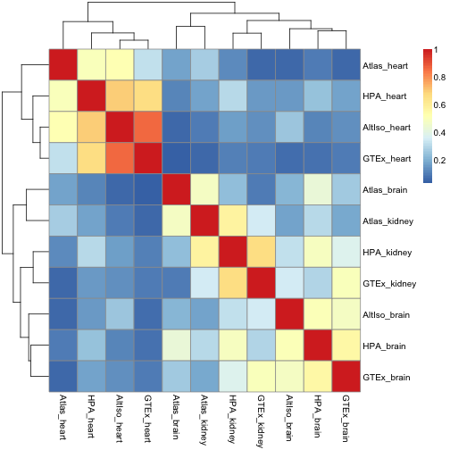 

PCA analysis of published FPKM values, Figure 1c:


```r
colors <- c("indianred", "dodgerblue", "forestgreen",
            "indianred", "dodgerblue",
            "indianred", "dodgerblue", "forestgreen", 
            "indianred", "dodgerblue", "forestgreen")
  
p <- prcomp(t(published.nozero))

shapes <- c(rep(15,3),rep(16,2),rep(17,3),rep(8,3))

plot(p$x[,1],p$x[,2],pch=shapes,cex=1.5,col=colors,xlab=paste("PC1 58% of variance"),ylab=paste("PC2 13% of variance"),main="Published FPKM/RPKM values \n n=13,323")
legend("bottomleft",legend=c("Heart","Brain","Kidney"),col=c("indianred", "dodgerblue", "forestgreen"),cex=1.5,pch=20)
legend("top",legend=c("HPA","AltIso","GTEx","Atlas"),col="black",pch=c(15,16,17,8),ncol=2)
```

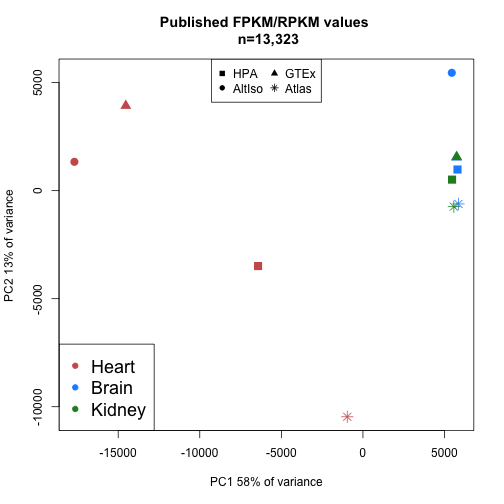 

We can plot all pairwise combinations of principal components 1 to 5. (not shown in paper):


```r
par(mfrow=c(4,4))
for (i in 1:6){
  for(j in 1:6){
  	if (i<j){ 
		plot(p$x[,i],p$x[,j],pch=20,col=colors,xlab=paste("PC",i),ylab=paste("PC",j),main="Published FPKM values \n n=13,323")
		}
	}
}
```

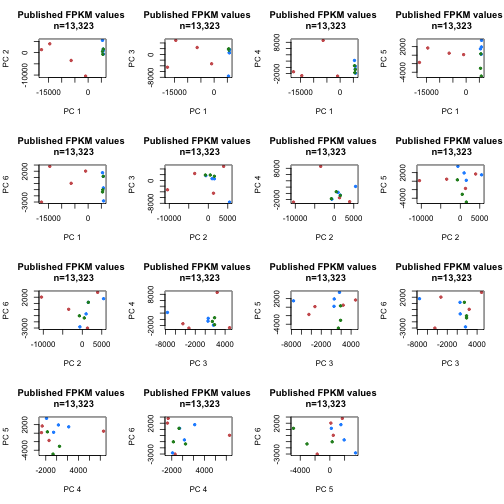 

Look a bit closer at PCs 1-3 in prcomp (not shown in paper):


```r
      #PC1:
      load.pc1 <- p$rotation[,1][order(p$rotation[,1])]
      extreme.pc1 <- c(tail(load.pc1), head(load.pc1))

      extreme.pc1.ensg <- names(extreme.pc1)
      ensembl = useMart("ensembl", dataset = "hsapiens_gene_ensembl") #select the ensembl database
      extreme.pc1.symbols <- getBM(attributes=c("ensembl_gene_id", "hgnc_symbol"), 
                           filters = "ensembl_gene_id",
                           values=extreme.pc1.ensg,
                           mart=ensembl)
      
      q <- extreme.pc1.symbols[,2]
      names(q) <- extreme.pc1.symbols[,1]

      fpkm.pc1 <- cbind(q[extreme.pc1.ensg],published.nozero[extreme.pc1.ensg,])
      names(fpkm.pc1)[names(fpkm.pc1) == 'q[extreme.pc1.ensg]'] <- 'Gene Symbol'
      
      barplot(extreme.pc1, names.arg=q[extreme.pc1.ensg],las=2,main="Genes w highest absolute loadings in PC1 (raw RPKM)")
```

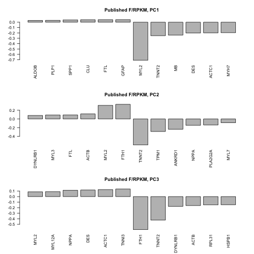 

```r
      print(fpkm.pc1)
```

```
##                 Gene Symbol HPA_heart HPA_brain HPA_kidney AltIso_heart
## ENSG00000136872       ALDOB       0.4       2.4     1824.1         0.00
## ENSG00000123560        PLP1      11.9    1295.2        0.7         2.56
## ENSG00000118785        SPP1       8.3     368.2     1251.1         7.74
## ENSG00000120885         CLU     336.9    3545.9      631.6        58.72
## ENSG00000087086         FTL     436.5     487.2     1523.1       463.86
## ENSG00000131095        GFAP       3.0    1372.0        1.4         1.70
## ENSG00000111245        MYL2    5291.5       0.2        2.6     16780.36
## ENSG00000118194       TNNT2    2693.8       7.0       20.8      8074.39
## ENSG00000198125          MB    3937.3       0.9        2.3      7065.54
## ENSG00000175084         DES    3403.6       2.4       10.2      3160.05
## ENSG00000159251       ACTC1    2914.4       1.6        0.4      3457.43
## ENSG00000092054        MYH7    1802.4       2.1        0.8      4117.17
##                 AltIso_brain   GTEx_heart   GTEx_brain  GTEx_kidney
## ENSG00000136872         0.49 1.629837e-01    0.2298469 1927.8311768
## ENSG00000123560      1544.93 2.431595e+00 1164.7164307    0.4162828
## ENSG00000118785       309.26 5.712032e-01  317.7869873 2806.6496582
## ENSG00000120885      1682.03 2.138420e+01  307.3468933  365.1710815
## ENSG00000087086       407.35 5.737621e+02 2099.7219238 5310.5092773
## ENSG00000131095       834.13 1.671327e+00 3633.8173828    0.8537604
## ENSG00000111245         1.03 1.576518e+04   10.2006025    2.3142705
## ENSG00000118194         9.37 2.027960e+03    1.6754625   11.8667431
## ENSG00000198125         1.35 2.705914e+03    2.6915243    0.6978353
## ENSG00000175084         2.65 5.524179e+03   13.1029377    4.9041762
## ENSG00000159251         0.42 5.319639e+03    3.6530383    1.0412433
## ENSG00000092054         0.83 4.713973e+03    6.4869833    0.6886783
##                 Atlas_heart Atlas_brain Atlas_kidney
## ENSG00000136872       1.452       0.125      788.910
## ENSG00000123560       5.086     779.755        0.513
## ENSG00000118785      16.293     121.874      878.535
## ENSG00000120885      29.357     394.746       47.363
## ENSG00000087086      16.930       7.700       40.892
## ENSG00000131095       0.549     691.908        0.135
## ENSG00000111245    1064.500       0.000        0.358
## ENSG00000118194   10930.800       8.713       43.633
## ENSG00000198125    1415.554       0.032        0.000
## ENSG00000175084    1675.890       4.500        6.252
## ENSG00000159251     310.068       0.421        0.311
## ENSG00000092054    2137.510       0.635        0.354
```

```r
      #PC2:
      load.pc2 <- p$rotation[,2][order(p$rotation[,2])]
      extreme.pc2 <- c(tail(load.pc2), head(load.pc2))
      
      extreme.pc2.ensg <- names(extreme.pc2)
      extreme.pc2.symbols <- getBM(attributes=c("ensembl_gene_id", "hgnc_symbol"), 
                           filters = "ensembl_gene_id",
                           values=extreme.pc2.ensg,
                           mart=ensembl)
      
      q <- extreme.pc2.symbols[,2]
      names(q) <- extreme.pc2.symbols[,1]

      fpkm.pc2 <- cbind(q[extreme.pc2.ensg],published.nozero[extreme.pc2.ensg,])
      names(fpkm.pc2)[names(fpkm.pc2) == 'q[extreme.pc2.ensg]'] <- 'Gene Symbol'
      
      barplot(extreme.pc2, names.arg=q[extreme.pc2.ensg],las=2,main="Genes w highest absolute loadings in PC2 (raw RPKM)")
```

 

```r
      print(fpkm.pc2)
```

```
##                 Gene Symbol HPA_heart HPA_brain HPA_kidney AltIso_heart
## ENSG00000125971     DYNLRB1     207.8     164.7      170.0      1532.98
## ENSG00000160808        MYL3    1213.4       3.2       24.9      3909.81
## ENSG00000087086         FTL     436.5     487.2     1523.1       463.86
## ENSG00000075624        ACTB     423.6     786.5      521.8       377.87
## ENSG00000111245        MYL2    5291.5       0.2        2.6     16780.36
## ENSG00000167996        FTH1     363.8     366.9      498.9      3563.32
## ENSG00000118194       TNNT2    2693.8       7.0       20.8      8074.39
## ENSG00000140416        TPM1    4937.5      61.9      128.6      4379.09
## ENSG00000148677      ANKRD1    2451.5       0.2        0.3      1088.94
## ENSG00000175206        NPPA    6693.0       8.1        0.1       193.69
## ENSG00000188257     PLA2G2A      51.2       0.8        2.3       210.68
## ENSG00000106631        MYL7    4606.5       0.2        0.1       896.01
##                 AltIso_brain   GTEx_heart   GTEx_brain  GTEx_kidney
## ENSG00000125971      2293.04    21.458061   42.5225830   32.5898590
## ENSG00000160808         0.84  3996.971191    5.8288269   19.8492756
## ENSG00000087086       407.35   573.762085 2099.7219238 5310.5092773
## ENSG00000075624      3277.02   283.548279  782.8235474  653.1090088
## ENSG00000111245         1.03 15765.178711   10.2006025    2.3142705
## ENSG00000167996      9086.14   337.275970 1151.6777344 1828.0887451
## ENSG00000118194         9.37  2027.959717    1.6754625   11.8667431
## ENSG00000140416        68.39  1132.400513   17.7401543   31.1860542
## ENSG00000148677         0.10  1471.471680    2.0739977    0.5601565
## ENSG00000175206         1.74   137.694275    0.8982058    2.7191663
## ENSG00000188257         0.00     2.313501    0.4622447    0.4419056
## ENSG00000106631         0.00   214.277832    1.5850240    0.5706197
##                 Atlas_heart Atlas_brain Atlas_kidney
## ENSG00000125971      20.874      42.315       23.413
## ENSG00000160808      80.668       0.204        2.634
## ENSG00000087086      16.930       7.700       40.892
## ENSG00000075624      67.058     140.560       69.191
## ENSG00000111245    1064.500       0.000        0.358
## ENSG00000167996      43.503      53.459       66.455
## ENSG00000118194   10930.800       8.713       43.633
## ENSG00000140416    4228.464     105.073      189.505
## ENSG00000148677    3863.610       0.403        0.263
## ENSG00000175206     311.399       0.445        0.131
## ENSG00000188257    2351.218       3.057       24.728
## ENSG00000106631     115.287       0.000        0.000
```

```r
      #PC3:
      load.pc3 <- p$rotation[,3][order(p$rotation[,3])]
      extreme.pc3 <- c(tail(load.pc3), head(load.pc3))
      
      extreme.pc3.ensg <- names(extreme.pc3)
      extreme.pc3.symbols <- getBM(attributes=c("ensembl_gene_id", "hgnc_symbol"), 
                           filters = "ensembl_gene_id",
                           values=extreme.pc3.ensg,
                           mart=ensembl)
      
      q <- extreme.pc3.symbols[,2]
      names(q) <- extreme.pc3.symbols[,1]

      fpkm.pc3 <- cbind(q[extreme.pc3.ensg],published.nozero[extreme.pc3.ensg,])
      names(fpkm.pc3)[names(fpkm.pc3) == 'q[extreme.pc3.ensg]'] <- 'Gene Symbol'
      
      barplot(extreme.pc3, names.arg=q[extreme.pc3.ensg],las=2,main="Genes w highest absolute loadings in PC3 (raw RPKM)")
```

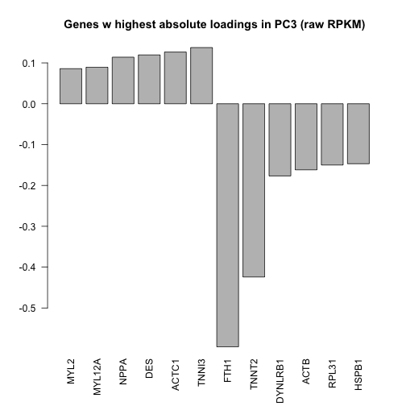 

```r
      print(fpkm.pc3)
```

```
##                 Gene Symbol HPA_heart HPA_brain HPA_kidney AltIso_heart
## ENSG00000111245        MYL2    5291.5       0.2        2.6     16780.36
## ENSG00000101608      MYL12A    2033.5      32.2      214.9       528.97
## ENSG00000175206        NPPA    6693.0       8.1        0.1       193.69
## ENSG00000175084         DES    3403.6       2.4       10.2      3160.05
## ENSG00000159251       ACTC1    2914.4       1.6        0.4      3457.43
## ENSG00000129991       TNNI3    2157.5       0.5        0.1      2698.36
## ENSG00000167996        FTH1     363.8     366.9      498.9      3563.32
## ENSG00000118194       TNNT2    2693.8       7.0       20.8      8074.39
## ENSG00000125971     DYNLRB1     207.8     164.7      170.0      1532.98
## ENSG00000075624        ACTB     423.6     786.5      521.8       377.87
## ENSG00000071082       RPL31     632.0     348.9      561.3      2239.86
## ENSG00000106211       HSPB1     521.6      37.7      196.6      3971.37
##                 AltIso_brain  GTEx_heart   GTEx_brain  GTEx_kidney
## ENSG00000111245         1.03 15765.17871   10.2006025    2.3142705
## ENSG00000101608        28.70  1968.66089   54.9993858  141.2810822
## ENSG00000175206         1.74   137.69427    0.8982058    2.7191663
## ENSG00000175084         2.65  5524.17871   13.1029377    4.9041762
## ENSG00000159251         0.42  5319.63867    3.6530383    1.0412433
## ENSG00000129991         0.47  5751.82275    4.0958185    0.6090932
## ENSG00000167996      9086.14   337.27597 1151.6777344 1828.0887451
## ENSG00000118194         9.37  2027.95972    1.6754625   11.8667431
## ENSG00000125971      2293.04    21.45806   42.5225830   32.5898590
## ENSG00000075624      3277.02   283.54828  782.8235474  653.1090088
## ENSG00000071082      1678.90    38.41791   99.8054581   51.5868454
## ENSG00000106211       643.46   333.51608   86.1186981  201.8283081
##                 Atlas_heart Atlas_brain Atlas_kidney
## ENSG00000111245    1064.500       0.000        0.358
## ENSG00000101608     300.410      15.476       24.862
## ENSG00000175206     311.399       0.445        0.131
## ENSG00000175084    1675.890       4.500        6.252
## ENSG00000159251     310.068       0.421        0.311
## ENSG00000129991     999.559       0.675        0.132
## ENSG00000167996      43.503      53.459       66.455
## ENSG00000118194   10930.800       8.713       43.633
## ENSG00000125971      20.874      42.315       23.413
## ENSG00000075624      67.058     140.560       69.191
## ENSG00000071082     378.917     484.379      259.057
## ENSG00000106211      61.190       6.808       17.175
```
             
Try Anova on a "melted" expression matrix with some metadata, Figure 1d:


```r
m <- melt(published.nozero)
```

```
## Using  as id variables
```

```r
colnames(m) <- c("sample_ID","RPKM")

meta <- sampleinfo_published[,c("Study","Tissue","Preparation","NumberRaw","Numbermapped","Readtype","readlength")]
rownames(meta) <- colnames(published.nozero)
tissue <- rep(meta$Tissue, each=nrow(published.nozero))
study <- rep(meta$Study, each=nrow(published.nozero))
prep <- rep(meta$Preparation, each=nrow(published.nozero))
layout <- rep(meta$Readtype, each=nrow(published.nozero))
raw <- rep(meta$NumberRaw, each=nrow(published.nozero))
mapped <- rep(meta$Numbermapped, each=nrow(published.nozero))
readlen <- rep(meta$readlength, each=nrow(published.nozero))
data <- data.frame(m, tissue=tissue, study=study, prep=prep, layout=layout, readlen=readlen, nraw=raw,nmapped=mapped)
fit <- lm(RPKM ~ layout + readlen + prep + nraw + study + tissue, data=data)
a <- anova(fit)
maxval = 100

barplot(100*a$"Sum Sq"[1:5]/sum(a$"Sum Sq"[1:5]),names.arg=rownames(a[1:5,]),main="Anova, published FPKM/RPKM values",ylim=c(0,maxval))
```

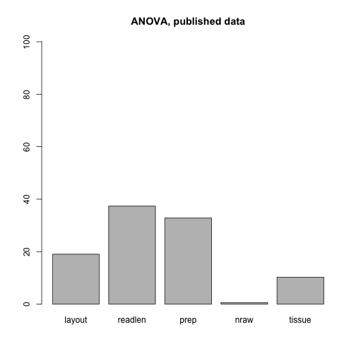 
Try log2 transformation of the published FPKM values:


```r
pseudo <- 1
published.log <- log2(published.nozero + pseudo)
```
Heatmap of Spearman correlations between published expression profiles with log2 values, Figure 2a:


```r
pheatmap(cor(published.log),method="spearman")
```

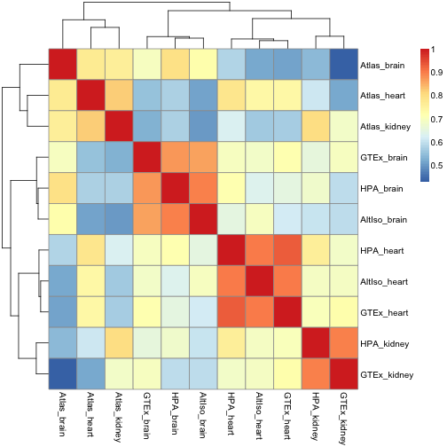 

PCA analysis of log2 published FPKM values, Figure 2b:


```r
colors <- c("indianred", "dodgerblue", "forestgreen",
            "indianred", "dodgerblue",
            "indianred", "dodgerblue", "forestgreen", 
            "indianred", "dodgerblue", "forestgreen")

p.log <- prcomp(t(published.log))

shapes <- c(rep(15,3),rep(16,2),rep(17,3),rep(8,3))

plot(p.log$x[,1],p.log$x[,2],pch=shapes,col=colors,xlab=paste("PC1 31% of variance"),ylab=paste("PC2 27% of variance"),main="log2 Published FPKM/RPKM values \n n=13,323")
legend("bottomright",legend=c("Heart","Brain","Kidney"),col=c("indianred", "dodgerblue", "forestgreen"),cex=1.5,pch=20,bty="n")
legend("top",legend=c("HPA","AltIso","GTEx","Atlas"),col="black",pch=c(15,16,17,8),ncol=2)
```

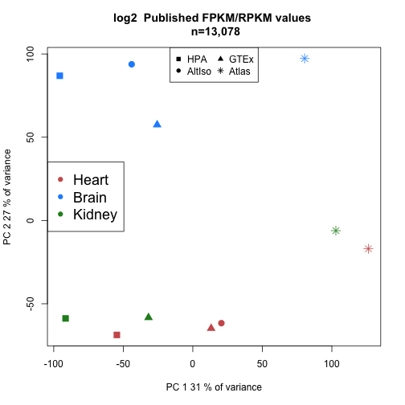 

Figure 2c:


```r
plot(p.log$x[,2],p.log$x[,3],pch=shapes,col=colors,xlab=paste("PC2 27% of variance"),ylab=paste("PC3 19% of variance"),main="log2 Published FPKM values \n n=13,323")
legend("bottomright",legend=c("Heart","Brain","Kidney"),col=c("indianred", "dodgerblue", "forestgreen"),cex=1.5,pch=20,bty="n")
legend("topright",legend=c("HPA","AltIso","GTEx","Atlas"),col="black",pch=c(15,16,17,8),ncol=2)
```

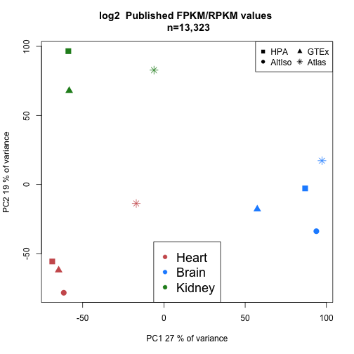 

Cross-validattion by leaving out one of the studies, in this case AltIso, Figure 2d: 


```r
p.loo <- published.log[,-c(4,5)]
colors.loo <- colors[-c(4,5)]
p.loo.log <- prcomp(t(p.loo))

p.add <- published.log[,c(4,5)]
projection <- t(p.add) %*% p.loo.log$rotation

p.original.plus.new <- rbind(p.loo.log$x, projection)
col.original.plus.new <- c(colors.loo, colors[c(4,5)])
plot(p.original.plus.new[,2],p.original.plus.new[,3],pch=c(rep(15,3),rep(17,3),rep(8,3),rep(22,nrow(projection))),col=col.original.plus.new,xlab="PC2",ylab="PC3",main="log2 Published FPKM/RPKM values; AltIso projected onto existing PCs \n n=13,323",xlim=c(-150,100))

legend("bottomleft",legend=c("Heart","Brain","Kidney"),col=c("indianred", "dodgerblue", "forestgreen"),cex=1.5,pch=20,bty="n")
legend("top",legend=c("HPA","GTEx","Atlas","AltIso"),col="black",pch=c(15,17,8,22),ncol=2)
```

 

We can plot all pairwise combinations of principal components 1 to 5. (not shown in paper):


```r
par(mfrow=c(4,4))
for (i in 1:6){
  for(j in 1:6){
    if (i<j){ 
		plot(p.log$x[,i],p.log$x[,j],pch=shapes,col=colors,xlab=paste("PC",i),ylab=paste("PC",j),main="log2 Published FPKM values \n n=13323")
		}
	}
}
```

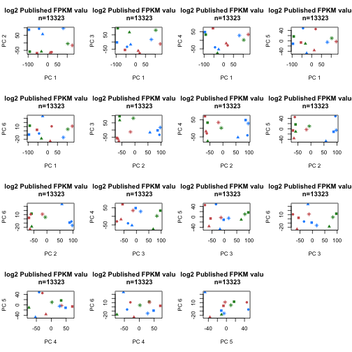 

Look a bit closer at PCs 1-3 in prcomp (not shown in paper):


```r
     #PC1:
     load.pc1 <- p.log$rotation[,1][order(p.log$rotation[,1])]
     extreme.pc1 <- c(tail(load.pc1), head(load.pc1))

     extreme.pc1.ensg <- names(extreme.pc1)
     extreme.pc1.symbols <- getBM(attributes=c("ensembl_gene_id", "hgnc_symbol"), 
                           filters = "ensembl_gene_id",
                           values=extreme.pc1.ensg,
                           mart=ensembl)
     
      q <- extreme.pc1.symbols[,2]
      names(q) <- extreme.pc1.symbols[,1]

      fpkm.log.pc1 <- cbind(q[extreme.pc1.ensg],published.nozero[extreme.pc1.ensg,])
      names(fpkm.log.pc1)[names(fpkm.log.pc1) == 'q[extreme.pc1.ensg]'] <- 'Gene Symbol'
      
      barplot(extreme.pc1, names.arg=q[extreme.pc1.ensg],las=2,main="Genes w highest absolute loadings in PC1 (log2 RPKM)")
```

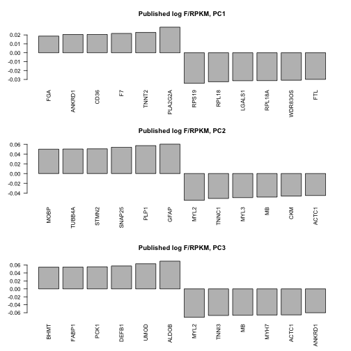 

```r
      print(fpkm.log.pc1)
```

```
##                 Gene Symbol HPA_heart HPA_brain HPA_kidney AltIso_heart
## ENSG00000171560         FGA       0.0       0.0        0.7         0.00
## ENSG00000148677      ANKRD1    2451.5       0.2        0.3      1088.94
## ENSG00000135218        CD36     499.4       2.6        8.0       132.46
## ENSG00000057593          F7       0.2       0.3        0.3         0.00
## ENSG00000118194       TNNT2    2693.8       7.0       20.8      8074.39
## ENSG00000188257     PLA2G2A      51.2       0.8        2.3       210.68
## ENSG00000105372       RPS19     419.2     268.3      453.6       118.30
## ENSG00000063177       RPL18     455.9     237.8      458.0       205.67
## ENSG00000100097      LGALS1     498.7     113.2       77.2       389.82
## ENSG00000105640      RPL18A      45.8      31.3       68.1       505.42
## ENSG00000105583     WDR83OS     132.7      52.6       99.0        23.17
## ENSG00000087086         FTL     436.5     487.2     1523.1       463.86
##                 AltIso_brain   GTEx_heart   GTEx_brain  GTEx_kidney
## ENSG00000171560         0.00 0.000000e+00    0.0000000    6.4727707
## ENSG00000148677         0.10 1.471472e+03    2.0739977    0.5601565
## ENSG00000135218         0.08 1.551205e+02    0.5913891    0.3047371
## ENSG00000057593         0.30 6.088877e-03    0.1806296    0.4762675
## ENSG00000118194         9.37 2.027960e+03    1.6754625   11.8667431
## ENSG00000188257         0.00 2.313501e+00    0.4622447    0.4419056
## ENSG00000105372       140.77 1.180695e+02  324.9812317  306.6752319
## ENSG00000063177       284.33 1.003603e+02  159.0169830  134.4763184
## ENSG00000100097       161.11 1.837938e+02  216.8468323   58.2166481
## ENSG00000105640       422.37 4.883201e+01   55.6919632   60.6585007
## ENSG00000105583        26.35 6.529290e+01   62.2843895   80.6908875
## ENSG00000087086       407.35 5.737621e+02 2099.7219238 5310.5092773
##                 Atlas_heart Atlas_brain Atlas_kidney
## ENSG00000171560      63.271       0.000       25.045
## ENSG00000148677    3863.610       0.403        0.263
## ENSG00000135218     894.983       8.763       17.456
## ENSG00000057593      26.652      15.712       19.155
## ENSG00000118194   10930.800       8.713       43.633
## ENSG00000188257    2351.218       3.057       24.728
## ENSG00000105372       3.360       2.945        3.123
## ENSG00000063177       3.984       5.143        2.603
## ENSG00000100097       2.138       1.154        0.332
## ENSG00000105640       0.000       0.000        0.000
## ENSG00000105583       0.411       0.352        0.452
## ENSG00000087086      16.930       7.700       40.892
```

```r
      #PC2:
      load.pc2 <- p.log$rotation[,2][order(p.log$rotation[,2])]
      extreme.pc2 <- c(tail(load.pc2), head(load.pc2))
      
      extreme.pc2.ensg <- names(extreme.pc2)
      extreme.pc2.symbols <- getBM(attributes=c("ensembl_gene_id", "hgnc_symbol"), 
                           filters = "ensembl_gene_id",
                           values=extreme.pc2.ensg,
                           mart=ensembl)

      q <- extreme.pc2.symbols[,2]
      names(q) <- extreme.pc2.symbols[,1]
      
      fpkm.log.pc2 <- cbind(q[extreme.pc2.ensg],published.nozero[extreme.pc2.ensg,])
      names(fpkm.log.pc2)[names(fpkm.log.pc2) == 'q[extreme.pc2.ensg]'] <- 'Gene Symbol'
      
      barplot(extreme.pc2, names.arg=q[extreme.pc2.ensg],las=2,main="Genes w highest absolute loadings in PC2 (log2 RPKM)")
```

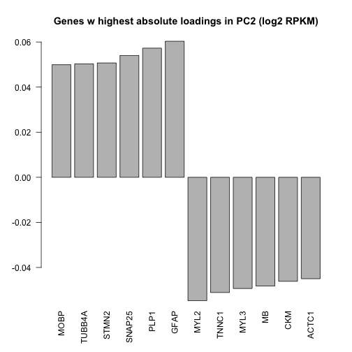 

```r
      print(fpkm.log.pc2)
```

```
##                 Gene Symbol HPA_heart HPA_brain HPA_kidney AltIso_heart
## ENSG00000168314        MOBP       0.0     138.0        0.1         0.00
## ENSG00000104833      TUBB4A       0.3     235.1        1.5         2.94
## ENSG00000104435       STMN2       0.1     235.9        0.2         0.00
## ENSG00000132639      SNAP25       1.2     802.9        1.7         0.15
## ENSG00000123560        PLP1      11.9    1295.2        0.7         2.56
## ENSG00000131095        GFAP       3.0    1372.0        1.4         1.70
## ENSG00000111245        MYL2    5291.5       0.2        2.6     16780.36
## ENSG00000114854       TNNC1    3087.9       0.3       14.0      4100.03
## ENSG00000160808        MYL3    1213.4       3.2       24.9      3909.81
## ENSG00000198125          MB    3937.3       0.9        2.3      7065.54
## ENSG00000104879         CKM    1172.0       0.1        2.6      3321.37
## ENSG00000159251       ACTC1    2914.4       1.6        0.4      3457.43
##                 AltIso_brain   GTEx_heart  GTEx_brain GTEx_kidney
## ENSG00000168314       100.74 6.864151e-03  486.668854  0.02783972
## ENSG00000104833      2038.44 5.334400e-01  387.557159  1.91307497
## ENSG00000104435       176.88 1.790114e-02  217.035278  0.15557937
## ENSG00000132639       535.77 3.757800e-02  117.302628  0.65681189
## ENSG00000123560      1544.93 2.431595e+00 1164.716431  0.41628277
## ENSG00000131095       834.13 1.671327e+00 3633.817383  0.85376036
## ENSG00000111245         1.03 1.576518e+04   10.200603  2.31427050
## ENSG00000114854         0.69 2.618310e+03    3.013112  5.23761368
## ENSG00000160808         0.84 3.996971e+03    5.828827 19.84927559
## ENSG00000198125         1.35 2.705914e+03    2.691524  0.69783533
## ENSG00000104879         0.26 2.774733e+03    4.498085  1.39116168
## ENSG00000159251         0.42 5.319639e+03    3.653038  1.04124331
##                 Atlas_heart Atlas_brain Atlas_kidney
## ENSG00000168314       0.176     153.127        0.139
## ENSG00000104833       0.408      82.655        0.389
## ENSG00000104435       0.105     139.464        0.000
## ENSG00000132639       0.346     284.680        0.180
## ENSG00000123560       5.086     779.755        0.513
## ENSG00000131095       0.549     691.908        0.135
## ENSG00000111245    1064.500       0.000        0.358
## ENSG00000114854     316.135       0.763        1.014
## ENSG00000160808      80.668       0.204        2.634
## ENSG00000198125    1415.554       0.032        0.000
## ENSG00000104879      57.889       0.000        0.060
## ENSG00000159251     310.068       0.421        0.311
```

```r
      #PC3:
      load.pc3 <- p.log$rotation[,3][order(p$rotation[,3])]
      extreme.pc3 <- c(tail(load.pc3), head(load.pc3))
      
      extreme.pc3.ensg <- names(extreme.pc3)
      extreme.pc3.symbols <- getBM(attributes=c("ensembl_gene_id", "hgnc_symbol"), 
                           filters = "ensembl_gene_id",
                           values=extreme.pc3.ensg,
                           mart=ensembl)
      
      q <- extreme.pc3.symbols[,2]
      names(q) <- extreme.pc3.symbols[,1]
      
      fpkm.log.pc3 <- cbind(q[extreme.pc3.ensg],published.nozero[extreme.pc3.ensg,])
      names(fpkm.log.pc3)[names(fpkm.log.pc3) == 'q[extreme.pc3.ensg]'] <- 'Gene Symbol'
      
      barplot(extreme.pc3, names.arg=q[extreme.pc3.ensg],las=2,main="Genes w highest absolute loadings in PC3 (log2 RPKM)")
```

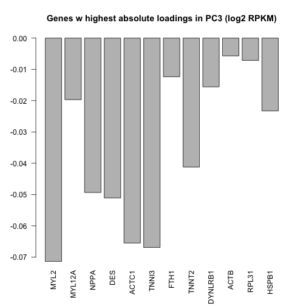 

```r
      print(fpkm.log.pc3)
```

```
##                 Gene Symbol HPA_heart HPA_brain HPA_kidney AltIso_heart
## ENSG00000111245        MYL2    5291.5       0.2        2.6     16780.36
## ENSG00000101608      MYL12A    2033.5      32.2      214.9       528.97
## ENSG00000175206        NPPA    6693.0       8.1        0.1       193.69
## ENSG00000175084         DES    3403.6       2.4       10.2      3160.05
## ENSG00000159251       ACTC1    2914.4       1.6        0.4      3457.43
## ENSG00000129991       TNNI3    2157.5       0.5        0.1      2698.36
## ENSG00000167996        FTH1     363.8     366.9      498.9      3563.32
## ENSG00000118194       TNNT2    2693.8       7.0       20.8      8074.39
## ENSG00000125971     DYNLRB1     207.8     164.7      170.0      1532.98
## ENSG00000075624        ACTB     423.6     786.5      521.8       377.87
## ENSG00000071082       RPL31     632.0     348.9      561.3      2239.86
## ENSG00000106211       HSPB1     521.6      37.7      196.6      3971.37
##                 AltIso_brain  GTEx_heart   GTEx_brain  GTEx_kidney
## ENSG00000111245         1.03 15765.17871   10.2006025    2.3142705
## ENSG00000101608        28.70  1968.66089   54.9993858  141.2810822
## ENSG00000175206         1.74   137.69427    0.8982058    2.7191663
## ENSG00000175084         2.65  5524.17871   13.1029377    4.9041762
## ENSG00000159251         0.42  5319.63867    3.6530383    1.0412433
## ENSG00000129991         0.47  5751.82275    4.0958185    0.6090932
## ENSG00000167996      9086.14   337.27597 1151.6777344 1828.0887451
## ENSG00000118194         9.37  2027.95972    1.6754625   11.8667431
## ENSG00000125971      2293.04    21.45806   42.5225830   32.5898590
## ENSG00000075624      3277.02   283.54828  782.8235474  653.1090088
## ENSG00000071082      1678.90    38.41791   99.8054581   51.5868454
## ENSG00000106211       643.46   333.51608   86.1186981  201.8283081
##                 Atlas_heart Atlas_brain Atlas_kidney
## ENSG00000111245    1064.500       0.000        0.358
## ENSG00000101608     300.410      15.476       24.862
## ENSG00000175206     311.399       0.445        0.131
## ENSG00000175084    1675.890       4.500        6.252
## ENSG00000159251     310.068       0.421        0.311
## ENSG00000129991     999.559       0.675        0.132
## ENSG00000167996      43.503      53.459       66.455
## ENSG00000118194   10930.800       8.713       43.633
## ENSG00000125971      20.874      42.315       23.413
## ENSG00000075624      67.058     140.560       69.191
## ENSG00000071082     378.917     484.379      259.057
## ENSG00000106211      61.190       6.808       17.175
```

To further validate the above results, indicating that tissue specificity appears mainly in PC 2 and 3, we will extract the 500 genes with highest loadings in each component and plot the corresponding published FPKM values in a heatmap (not shown in paper):


```r
     load.pc1 <- abs(p.log$rotation[,1])[order(abs(p.log$rotation[,1]),decreasing=TRUE)]
     top.pc1 <- names(load.pc1[1:500]) 

     load.pc2 <- abs(p.log$rotation[,2])[order(abs(p.log$rotation[,2]),decreasing=TRUE)]
     top.pc2 <- names(load.pc2[1:500])

     load.pc3 <- abs(p.log$rotation[,3])[order(abs(p.log$rotation[,3]),decreasing=TRUE)]
     top.pc3 <- names(load.pc3[1:500])

     pheatmap(cor(published[top.pc1,]),method="spearman")
```

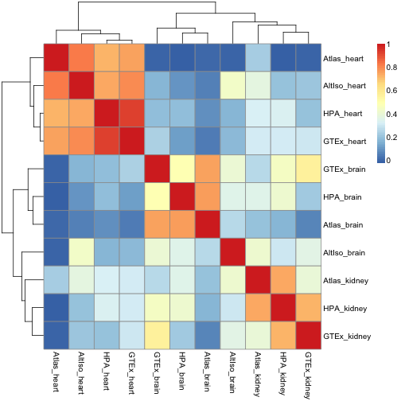 

```r
     pheatmap(cor(published[top.pc2,]),method="spearman")
```

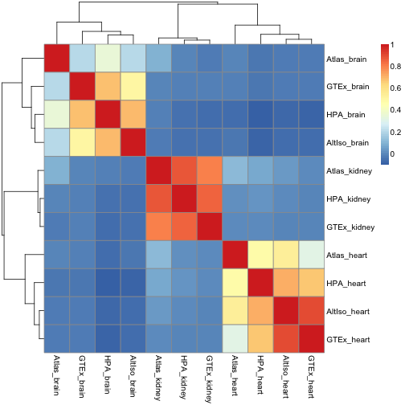 

```r
     pheatmap(cor(published[top.pc3,]),method="spearman")
```

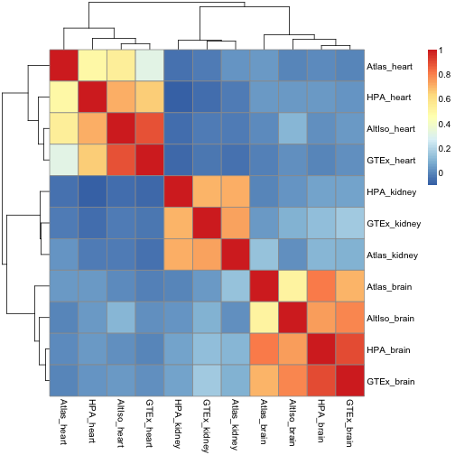 

Try Anova on a "melted" expression matrix with logged values and some metadata, Figure 2e:


```r
n <- melt(published.log)
```

```
## Using  as id variables
```

```r
colnames(n) <- c("sample_ID","RPKM")
meta <- sampleinfo_published[,c("Study","Tissue","Preparation","NumberRaw","Numbermapped","Readtype","readlength")]
rownames(meta) <- colnames(published.log)
tissue <- rep(meta$Tissue, each=nrow(published.log))
study <- rep(meta$Study, each=nrow(published.log))
prep <- rep(meta$Preparation, each=nrow(published.log))
layout <- rep(meta$Readtype, each=nrow(published.log))
raw <- rep(meta$NumberRaw, each=nrow(published.log))
mapped <- rep(meta$Numbermapped, each=nrow(published.log))
readlen <- rep(meta$readlength, each=nrow(published.log))

data <- data.frame(n, tissue=tissue, study=study, prep=prep, layout=layout,nraw=raw,nmapped=mapped, readlen=readlen)
fit <- lm(RPKM ~ layout + readlen + prep + nraw + study + tissue, data=data)
b <- anova(fit)
maxval = 100

barplot(100*b$"Sum Sq"[1:5]/sum(b$"Sum Sq"[1:5]),names.arg=rownames(b[1:5,]),main="Anova, log2 reprocessed FPKM/RPKM values",ylim=c(0,maxval))
```

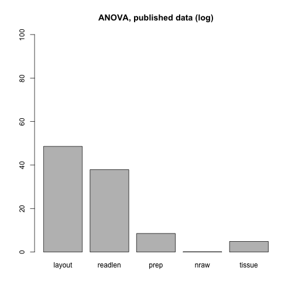 
Another way is to do SVA:

```r
mod <- model.matrix(~as.factor(Tissue), data=sampleinfo_reprocessed)
```

```
## Error in terms.formula(object, data = data): object 'sampleinfo_reprocessed' not found
```

```r
mod0 <- model.matrix(~1, data=sampleinfo_reprocessed)
```

```
## Error in terms.formula(object, data = data): object 'sampleinfo_reprocessed' not found
```

```r
n.sv <- num.sv(cufflinks_log,mod,method="leek")
```

```
## Error in as.matrix(dat): object 'cufflinks_log' not found
```

```r
svobj <- sva(as.matrix(cufflinks_log),mod,mod0,n.sv=n.sv)
```

```
## Error in sva(as.matrix(cufflinks_log), mod, mod0, n.sv = n.sv): object 'n.sv' not found
```

```r
surr <- svobj$sv
```

```
## Error in eval(expr, envir, enclos): object 'svobj' not found
```
What are the surrogate variables correlated to?

```r
par(mfrow=c(2,1))
for (i in c(1,2)){
ps <- rep(1,5)
names(ps) <- c("Preparation", "Study", "NumberRaw", "Readtype", "Readlength")
ps[1] <- cor.test(surr[,i], as.numeric(sampleinfo_reprocessed$Preparation))$p.value
ps[2] <- cor.test(surr[,i], as.numeric(sampleinfo_reprocessed$Study))$p.value
ps[3] <- cor.test(surr[,i], as.numeric(sampleinfo_reprocessed$NumberRaw))$p.value
ps[4] <- cor.test(surr[,i], as.numeric(sampleinfo_reprocessed$Readtype))$p.value
ps[5] <- cor.test(surr[,i], as.numeric(sampleinfo_reprocessed$readlength))$p.value
barplot(-log(ps),las=2)
}
```

```
## Error in cor.test(surr[, i], as.numeric(sampleinfo_reprocessed$Preparation)): object 'surr' not found
```

Combat analysis is performed on log2 values (n=13,323):


```r
meta <- data.frame(study=c(rep("HPA",3),rep("AltIso",2),rep("GTex",3),rep("Atlas",3)),tissue=c("Heart","Brain","Kidney","Heart","Brain","Heart","Brain","Kidney","Heart","Brain","Kidney"))

batch <- meta$study
design <- model.matrix(~1,data=meta)
combat <- ComBat(dat=published.log,batch=batch,mod=design,numCovs=NULL,par.prior=TRUE)
```

```
## Found 4 batches
## Found 0  categorical covariate(s)
## Standardizing Data across genes
## Fitting L/S model and finding priors
## Finding parametric adjustments
## Adjusting the Data
```

Heatmap of Spearman correlations between published expression profiles after combat run (# genes = 13,323), Figure 3a:


```r
pheatmap(cor(combat, method="spearman")) 
```

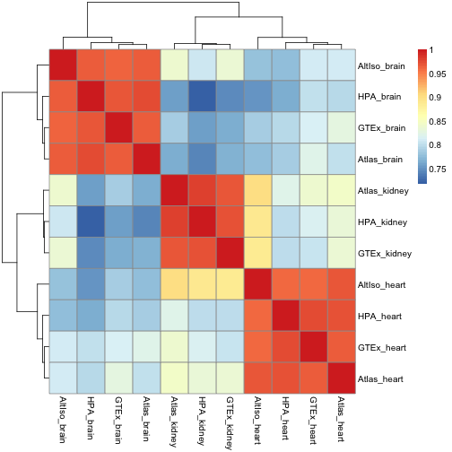 

PCA analysis of published FPKM values after combat run, Figure 3b:


```r
colors <- c("indianred", "dodgerblue", "forestgreen",
            "indianred", "dodgerblue",
            "indianred", "dodgerblue", "forestgreen", 
            "indianred", "dodgerblue", "forestgreen")

p.combat <- prcomp(t(combat))

shapes <- c(rep(15,3),rep(16,2),rep(17,3),rep(8,3))

plot(p.combat$x[,1],p.combat$x[,2],pch=shapes,col=colors,xlab=paste("PC1 54% of variance"),ylab=paste("PC2 38% of variance"),main="Published FPKM values \n COMBAT \n n=13,323")
legend("bottomright",legend=c("Heart","Brain","Kidney"),col=c("indianred", "dodgerblue", "forestgreen"),cex=1.5,pch=20,bty="n")
legend("topright",legend=c("HPA","AltIso","GTEx","Atlas"),col="black",pch=c(15,16,17,8),ncol=2)
```

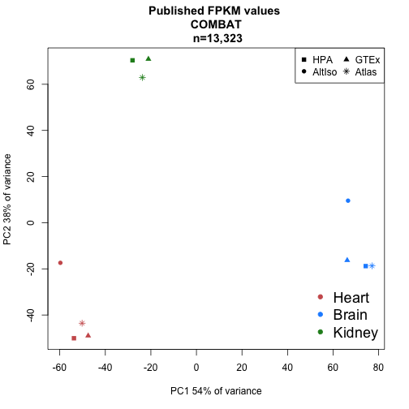 

We can plot all pairwise combinations of principal components 1 to 5. (not shown in paper):


```r
par(mfrow=c(4,4))
for (i in 1:6){
  for(j in 1:6){
    if (i<j){ 
		plot(p.combat$x[,i],p.combat$x[,j],pch=shapes,col=colors,xlab=paste("PC",i),ylab=paste("PC",j),main="Published FPKM values \n COMBAT \ n=13323")
		}
	}
}
```

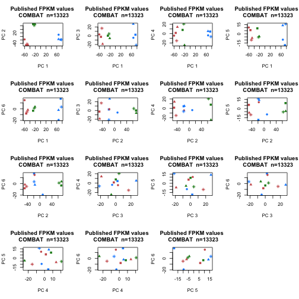 

Look a bit closer at PCs 1-3 in prcomp (not shown in paper):


```r
     #PC1:
     load.pc1 <- p.combat$rotation[,1][order(p.combat$rotation[,1])]
     extreme.pc1 <- c(tail(load.pc1), head(load.pc1))

     extreme.pc1.ensg <- names(extreme.pc1)
     extreme.pc1.symbols <- getBM(attributes=c("ensembl_gene_id", "hgnc_symbol"), 
                           filters = "ensembl_gene_id",
                           values=extreme.pc1.ensg,
                           mart=ensembl)

      q <- extreme.pc1.symbols[,2]
      names(q) <- extreme.pc1.symbols[,1]

      fpkm.combat.pc1 <- cbind(q[extreme.pc1.ensg],published.nozero[extreme.pc1.ensg,])
      names(fpkm.combat.pc1)[names(fpkm.combat.pc1) == 'q[extreme.pc1.ensg]'] <- 'Gene Symbol'
      
      barplot(extreme.pc1, names.arg=q[extreme.pc1.ensg],las=2,main="Genes w highest absolute loadings in PC1 (ComBat log2 RPKM)")
```

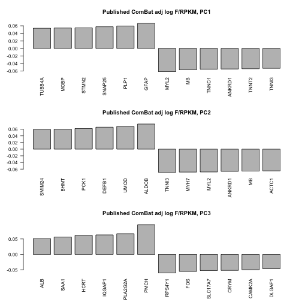 

```r
      print(fpkm.combat.pc1)
```

```
##                 Gene Symbol HPA_heart HPA_brain HPA_kidney AltIso_heart
## ENSG00000104833      TUBB4A       0.3     235.1        1.5         2.94
## ENSG00000168314        MOBP       0.0     138.0        0.1         0.00
## ENSG00000104435       STMN2       0.1     235.9        0.2         0.00
## ENSG00000132639      SNAP25       1.2     802.9        1.7         0.15
## ENSG00000123560        PLP1      11.9    1295.2        0.7         2.56
## ENSG00000131095        GFAP       3.0    1372.0        1.4         1.70
## ENSG00000111245        MYL2    5291.5       0.2        2.6     16780.36
## ENSG00000198125          MB    3937.3       0.9        2.3      7065.54
## ENSG00000114854       TNNC1    3087.9       0.3       14.0      4100.03
## ENSG00000148677      ANKRD1    2451.5       0.2        0.3      1088.94
## ENSG00000118194       TNNT2    2693.8       7.0       20.8      8074.39
## ENSG00000129991       TNNI3    2157.5       0.5        0.1      2698.36
##                 AltIso_brain   GTEx_heart  GTEx_brain GTEx_kidney
## ENSG00000104833      2038.44 5.334400e-01  387.557159  1.91307497
## ENSG00000168314       100.74 6.864151e-03  486.668854  0.02783972
## ENSG00000104435       176.88 1.790114e-02  217.035278  0.15557937
## ENSG00000132639       535.77 3.757800e-02  117.302628  0.65681189
## ENSG00000123560      1544.93 2.431595e+00 1164.716431  0.41628277
## ENSG00000131095       834.13 1.671327e+00 3633.817383  0.85376036
## ENSG00000111245         1.03 1.576518e+04   10.200603  2.31427050
## ENSG00000198125         1.35 2.705914e+03    2.691524  0.69783533
## ENSG00000114854         0.69 2.618310e+03    3.013112  5.23761368
## ENSG00000148677         0.10 1.471472e+03    2.073998  0.56015652
## ENSG00000118194         9.37 2.027960e+03    1.675462 11.86674309
## ENSG00000129991         0.47 5.751823e+03    4.095819  0.60909325
##                 Atlas_heart Atlas_brain Atlas_kidney
## ENSG00000104833       0.408      82.655        0.389
## ENSG00000168314       0.176     153.127        0.139
## ENSG00000104435       0.105     139.464        0.000
## ENSG00000132639       0.346     284.680        0.180
## ENSG00000123560       5.086     779.755        0.513
## ENSG00000131095       0.549     691.908        0.135
## ENSG00000111245    1064.500       0.000        0.358
## ENSG00000198125    1415.554       0.032        0.000
## ENSG00000114854     316.135       0.763        1.014
## ENSG00000148677    3863.610       0.403        0.263
## ENSG00000118194   10930.800       8.713       43.633
## ENSG00000129991     999.559       0.675        0.132
```

```r
      #PC2:
      load.pc2 <- p.combat$rotation[,2][order(p.combat$rotation[,2])]
      extreme.pc2 <- c(tail(load.pc2), head(load.pc2))

      extreme.pc2.ensg <- names(extreme.pc2)
      extreme.pc2.symbols <- getBM(attributes=c("ensembl_gene_id", "hgnc_symbol"), 
                           filters = "ensembl_gene_id",
                           values=extreme.pc2.ensg,
                           mart=ensembl)
      q <- extreme.pc2.symbols[,2]
      names(q) <- extreme.pc2.symbols[,1]

      fpkm.combat.pc2 <- cbind(q[extreme.pc2.ensg],published.nozero[extreme.pc2.ensg,])
      names(fpkm.combat.pc2)[names(fpkm.combat.pc2) == 'q[extreme.pc2.ensg]'] <- 'Gene Symbol'
      
      barplot(extreme.pc2, names.arg=q[extreme.pc2.ensg],las=2,main="Genes w highest absolute loadings in PC2 (ComBat log2 RPKM)")
```

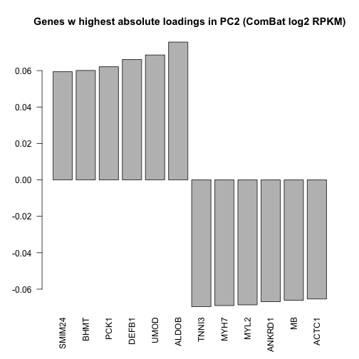 

```r
      print(fpkm.combat.pc2)
```

```
##                 Gene Symbol HPA_heart HPA_brain HPA_kidney AltIso_heart
## ENSG00000095932      SMIM24       0.1       2.2      424.6         0.00
## ENSG00000145692        BHMT       0.0       1.0      538.5         0.00
## ENSG00000124253        PCK1       0.5       0.7      489.6         0.93
## ENSG00000164825       DEFB1       0.1       0.6      662.2         0.84
## ENSG00000169344        UMOD       0.1       1.5     1425.7         0.00
## ENSG00000136872       ALDOB       0.4       2.4     1824.1         0.00
## ENSG00000129991       TNNI3    2157.5       0.5        0.1      2698.36
## ENSG00000092054        MYH7    1802.4       2.1        0.8      4117.17
## ENSG00000111245        MYL2    5291.5       0.2        2.6     16780.36
## ENSG00000148677      ANKRD1    2451.5       0.2        0.3      1088.94
## ENSG00000198125          MB    3937.3       0.9        2.3      7065.54
## ENSG00000159251       ACTC1    2914.4       1.6        0.4      3457.43
##                 AltIso_brain   GTEx_heart  GTEx_brain  GTEx_kidney
## ENSG00000095932         3.06 0.000000e+00  0.75338495  237.5329590
## ENSG00000145692         0.26 1.949457e-02  0.04663841  210.6383972
## ENSG00000124253         0.00 1.512038e-02  1.43247831 1107.3145752
## ENSG00000164825         0.22 1.319554e-01  0.37882489  726.4010620
## ENSG00000169344         0.00 0.000000e+00  0.00000000  285.9096680
## ENSG00000136872         0.49 1.629837e-01  0.22984688 1927.8311768
## ENSG00000129991         0.47 5.751823e+03  4.09581852    0.6090932
## ENSG00000092054         0.83 4.713973e+03  6.48698330    0.6886783
## ENSG00000111245         1.03 1.576518e+04 10.20060253    2.3142705
## ENSG00000148677         0.10 1.471472e+03  2.07399774    0.5601565
## ENSG00000198125         1.35 2.705914e+03  2.69152427    0.6978353
## ENSG00000159251         0.42 5.319639e+03  3.65303826    1.0412433
##                 Atlas_heart Atlas_brain Atlas_kidney
## ENSG00000095932       0.000       0.042      109.653
## ENSG00000145692       0.052       0.106      116.957
## ENSG00000124253       0.923       0.099      127.729
## ENSG00000164825       0.000       0.082      179.618
## ENSG00000169344       0.000       0.000      371.344
## ENSG00000136872       1.452       0.125      788.910
## ENSG00000129991     999.559       0.675        0.132
## ENSG00000092054    2137.510       0.635        0.354
## ENSG00000111245    1064.500       0.000        0.358
## ENSG00000148677    3863.610       0.403        0.263
## ENSG00000198125    1415.554       0.032        0.000
## ENSG00000159251     310.068       0.421        0.311
```

```r
      #PC3:
      load.pc3 <- p.combat$rotation[,3][order(p.combat$rotation[,3])]
      extreme.pc3 <- c(tail(load.pc3), head(load.pc3))

      extreme.pc3.ensg <- names(extreme.pc3)
      extreme.pc3.symbols <- getBM(attributes=c("ensembl_gene_id", "hgnc_symbol"), 
                           filters = "ensembl_gene_id",
                           values=extreme.pc3.ensg,
                           mart=ensembl)

      q <- extreme.pc3.symbols[,2]
      names(q) <- extreme.pc3.symbols[,1]

      fpkm.combat.pc3 <- cbind(q[extreme.pc3.ensg],published.nozero[extreme.pc3.ensg,])
      names(fpkm.combat.pc3)[names(fpkm.combat.pc3) == 'q[extreme.pc3.ensg]'] <- 'Gene Symbol'
      
      barplot(extreme.pc3, names.arg=q[extreme.pc3.ensg],las=2,main="Genes w highest absolute loadings in PC3 (ComBat log2 RPKM)")
```

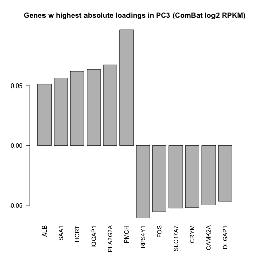 

```r
      print(fpkm.combat.pc3)
```

```
##                 Gene Symbol HPA_heart HPA_brain HPA_kidney AltIso_heart
## ENSG00000163631         ALB       0.8       0.8      327.6         0.00
## ENSG00000173432        SAA1       0.6       1.3        1.2         5.20
## ENSG00000161610        HCRT       0.0       0.0        0.1         0.00
## ENSG00000140575      IQGAP1      22.5      15.9       40.6         6.29
## ENSG00000188257     PLA2G2A      51.2       0.8        2.3       210.68
## ENSG00000183395        PMCH       0.2       0.0        0.0         0.13
## ENSG00000129824      RPS4Y1      40.8      53.7       60.9        66.40
## ENSG00000170345         FOS     147.3     116.7      288.4         6.23
## ENSG00000104888     SLC17A7       1.1     263.4        0.5         0.84
## ENSG00000103316        CRYM     124.5      58.4       43.4        30.53
## ENSG00000070808      CAMK2A       8.8     134.7        1.2         1.63
## ENSG00000170579      DLGAP1       0.4      57.5        0.8         0.00
##                 AltIso_brain   GTEx_heart   GTEx_brain GTEx_kidney
## ENSG00000163631         0.00 6.669276e-02    0.6302398 12.09975052
## ENSG00000173432         0.00 2.748352e-02    0.5260081  9.07668495
## ENSG00000161610         0.00 0.000000e+00  165.0033417  0.04222484
## ENSG00000140575         4.86 1.250947e+01  331.6091614 14.63416481
## ENSG00000188257         0.00 2.313501e+00    0.4622447  0.44190565
## ENSG00000183395         0.14 0.000000e+00 2045.6381836  0.00000000
## ENSG00000129824        45.76 8.935241e+01    0.6486077 86.30981445
## ENSG00000170345        20.94 2.698389e+02    8.9939346 29.33131218
## ENSG00000104888       311.50 1.172251e+00    0.5592491  0.32665563
## ENSG00000103316        38.56 6.342062e+01    4.4874167 48.14843750
## ENSG00000070808       322.44 1.065451e+00    3.2226882  0.08715166
## ENSG00000170579        56.90 4.433761e-03    1.1073956  0.42644233
##                 Atlas_heart Atlas_brain Atlas_kidney
## ENSG00000163631      37.193       0.152       24.347
## ENSG00000173432     110.718       0.000       35.264
## ENSG00000161610       0.000       0.197        0.000
## ENSG00000140575      28.961       8.308       23.509
## ENSG00000188257    2351.218       3.057       24.728
## ENSG00000183395       0.000       0.050        0.000
## ENSG00000129824      30.176      42.832       14.097
## ENSG00000170345      15.149      41.809       34.855
## ENSG00000104888       0.044      11.004        0.019
## ENSG00000103316       7.586      20.478        5.674
## ENSG00000070808       1.640     131.757        0.144
## ENSG00000170579       0.241      53.706        0.905
```

Revisit Anova with combated values, Figure 3c:


```r
o <- melt(combat)
```

```
## Using  as id variables
```

```r
colnames(o) <- c("sample_ID","combat")
meta <- sampleinfo_published[,c("Study","Tissue","Preparation","NumberRaw","Numbermapped","Readtype","readlength")]
rownames(meta) <- colnames(combat)
tissue <- rep(meta$Tissue, each=nrow(combat))
study <- rep(meta$Study, each=nrow(combat))
prep <- rep(meta$Preparation, each=nrow(combat))
layout <- rep(meta$Readtype, each=nrow(combat))
raw <- rep(meta$NumberRaw, each=nrow(combat))
mapped <- rep(meta$Numbermapped, each=nrow(combat))
readlen <- rep(meta$readlength, each=nrow(combat))
data <- data.frame(o, tissue=tissue, study=study, prep=prep, layout=layout,nraw=raw,nmapped=mapped,readlen=readlen)
fit <- lm(combat ~ layout + readlen + prep + nraw + study + tissue, data=data)
c <- anova(fit)
maxval = 100

barplot(100*c$"Sum Sq"[1:5]/sum(c$"Sum Sq"[1:5]),names.arg=rownames(c[1:5,]),main="Anova Combat",ylim=c(0,maxval))
```

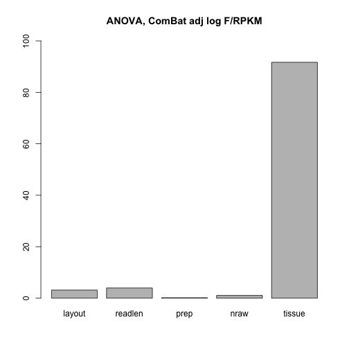 

Comparing FPKMs for FASTQ files reprocessed with TopHat and Cufflinks:


```r
cufflinks <- read.delim("fpkm_table_tophat.txt")

sampleinfo_cufflinks <- read.delim("sample_info_reprocessed.txt")
```

First, we will restrict the data set to only include protein coding genes using the ensembl based R package biomaRt:


```r
gene_ids <- as.vector(cufflinks[,1])

ensembl = useMart("ensembl", dataset = "hsapiens_gene_ensembl") #select the ensembl database

gene_type <- getBM(attributes=c("ensembl_gene_id", "gene_biotype"), 
                   filters = "ensembl_gene_id",
                   values=gene_ids,
                   mart=ensembl)

pc <- subset(gene_type[,1],gene_type[,2]=="protein_coding")

cufflinks_pc <- cufflinks[match(pc,cufflinks[,1]),]
```

Let's remove all lines where FPKM is close to zero in all samples before we proceed with this version of the data set:


```r
cufflinks_pc_nozero <- cufflinks_pc[-which(rowSums(cufflinks_pc[,3:16])<=0.01),]
```

Heatmap of Spearman correlations between reprocessed expression profiles (# genes = 19,475), Figure 4a:


```r
pheatmap(cor(cufflinks_pc_nozero[,3:16], method="spearman")) 
```

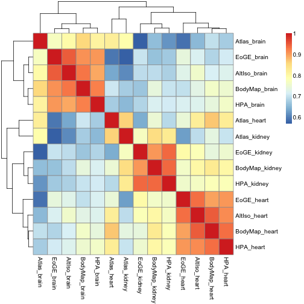 

Let's look at a few PCA plots, Figure 4b:


```r
cufflinks_fpkms <- cufflinks_pc_nozero[,3:16]
rownames(cufflinks_fpkms) <- cufflinks_pc_nozero[,1]

p.cufflinks <- prcomp(t(cufflinks_fpkms))

colors <- c("dodgerblue", "indianred", "forestgreen",
            "dodgerblue", "indianred", "forestgreen",
            "dodgerblue", "indianred", "forestgreen",
            "dodgerblue", "indianred", "forestgreen",
            "dodgerblue", "indianred")          

shapes_cufflinks <- c(rep(11,3),rep(8,3),rep(17,3),rep(15,3),rep(16,2))

plot(p.cufflinks$x[,1],p.cufflinks$x[,2],pch=shapes_cufflinks,col=colors,xlab=paste("PC1 87% of variance"),ylab=paste("PC2 7.7% of variance"),main="Reprocessed FPKM values \n n=19,475")
legend("bottomright",legend=c("Heart","Brain","Kidney"),col=c("indianred", "dodgerblue", "forestgreen"),cex=1.5,pch=20,bty="n")
legend("top",legend=c("EoGE","Atlas","BodyMap","HPA","AltIso"),col="black",pch=c(11,8,17,15,16),ncol=2)
```

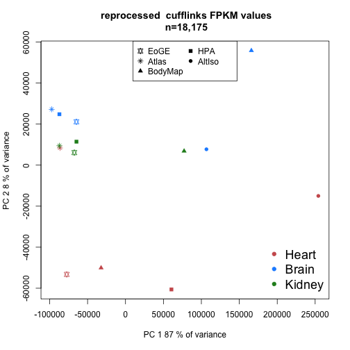 

We can plot all pairwise combinations of principal components 1 to 5 (not shown in paper):


```r
colors <- c("dodgerblue", "indianred", "forestgreen",
            "dodgerblue", "indianred", "forestgreen",
            "dodgerblue", "indianred", "forestgreen",
            "dodgerblue", "indianred", "forestgreen",
            "dodgerblue", "indianred")

par(mfrow=c(4,4))
for (i in 1:6){
  for(j in 1:6){
    if (i<j){ 
      plot(p.cufflinks$x[,i],p.cufflinks$x[,j],pch=shapes_cufflinks,col=colors,xlab=paste("PC",i),ylab=paste("PC",j),main="Cufflinks FPKM values \n n=19475")
		}
	}
}
```

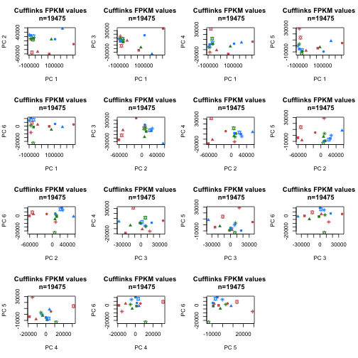 

Look at PCA loadings for PC1-3 (not shown in paper):


```r
      #PC1:
      load.pc1 <- p.cufflinks$rotation[,1][order(p.cufflinks$rotation[,1])]
      extreme.pc1 <- c(tail(load.pc1), head(load.pc1))
      
      extreme.pc1.ensg <- names(extreme.pc1)
      extreme.pc1.symbols <- getBM(attributes=c("ensembl_gene_id", "hgnc_symbol"), 
                           filters = "ensembl_gene_id",
                           values=extreme.pc1.ensg,
                           mart=ensembl)
      
      q <- extreme.pc1.symbols[,2]
      names(q) <- extreme.pc1.symbols[,1]
      
      fpkm.cuff.pc1 <- cbind(q[extreme.pc1.ensg],cufflinks_fpkms[extreme.pc1.ensg,])
      names(fpkm.cuff.pc1)[names(fpkm.cuff.pc1) == 'q[extreme.pc1.ensg]'] <- 'Gene Symbol'
      
      barplot(extreme.pc1, names.arg=q[extreme.pc1.ensg],las=2,main="Genes w highest absolute loadings in PC1 (raw Cufflinks FPKM)")
```

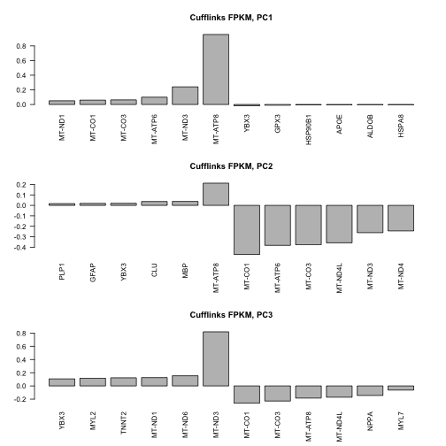 

```r
      print(fpkm.cuff.pc1)
```

```
##                 Gene Symbol  EoGE_brain  EoGE_heart EoGE_kidney
## ENSG00000198888      MT-ND1 9.78313e+03 1.29704e+04   12927.400
## ENSG00000198804      MT-CO1 9.52453e+03 3.87410e+04    3772.820
## ENSG00000198938      MT-CO3 1.03779e+04 2.79864e+04   13574.300
## ENSG00000198899     MT-ATP6 1.45439e+04 4.36996e+04   27038.300
## ENSG00000198840      MT-ND3 1.11546e+04 1.12741e+04   16370.800
## ENSG00000228253     MT-ATP8 3.59405e+04 1.25506e+04   29657.800
## ENSG00000060138        YBX3 9.07246e+00 2.25311e+02     243.229
## ENSG00000211445        GPX3 3.09235e+01 5.42119e+02   18989.300
## ENSG00000166598     HSP90B1 1.02055e+02 6.23045e+01     197.881
## ENSG00000130203        APOE 8.03945e+02 6.57937e+01    7062.530
## ENSG00000136872       ALDOB 2.32646e-01 2.62751e-01    3923.870
## ENSG00000109971       HSPA8 6.27816e+02 4.84668e+02     508.538
##                 Atlas_brain Atlas_heart Atlas_kidney BodyMap_brain
## ENSG00000198888 6609.070000 11043.30000     9043.730   1.26450e+04
## ENSG00000198804 4331.870000 12564.70000    12148.200   1.41602e+04
## ENSG00000198938 2072.480000  3861.35000     4634.460   1.24644e+04
## ENSG00000198899 8168.860000 16937.60000    16023.400   2.62130e+04
## ENSG00000198840 4281.000000 11015.10000    11389.900   2.17279e+04
## ENSG00000228253 5519.300000 12604.10000    11548.200   2.71870e+05
## ENSG00000060138 2266.430000 29731.30000     2030.770   4.95210e+01
## ENSG00000211445   11.297300   392.65900     2265.160   2.87217e+01
## ENSG00000166598 1934.760000  5957.27000     2593.600   1.05416e+02
## ENSG00000130203   97.184500     9.90770      131.672   2.36936e+02
## ENSG00000136872    0.141965     1.94897      839.917   4.26264e-01
## ENSG00000109971 2205.090000  2103.80000     1276.960   4.20237e+02
##                 BodyMap_heart BodyMap_kidney   HPA_brain   HPA_heart
## ENSG00000198888   2.88022e+04      12167.300 3.65390e+03 2.35580e+04
## ENSG00000198804   4.93494e+04      30835.800 1.12354e+04 6.49431e+04
## ENSG00000198938   3.89022e+04      29411.400 7.53832e+03 5.67093e+04
## ENSG00000198899   4.91401e+04      33007.100 8.50714e+03 5.36826e+04
## ENSG00000198840   3.45605e+04      32774.300 5.55203e+03 4.18535e+04
## ENSG00000228253   5.17674e+04     172497.000 1.55311e+04 1.42989e+05
## ENSG00000060138   3.20109e+02        123.268 1.76349e+01 2.08790e+02
## ENSG00000211445   3.66150e+02       3920.100 8.35414e+01 7.29493e+02
## ENSG00000166598   9.51998e+01        415.542 1.44129e+02 1.00780e+02
## ENSG00000130203   7.50127e+00        318.506 7.02494e+02 1.75460e+01
## ENSG00000136872   2.48512e-01        492.240 2.34255e-01 2.95117e-01
## ENSG00000109971   2.98899e+02        605.504 6.47549e+02 2.97209e+02
##                 HPA_kidney AltIso_brain AltIso_heart
## ENSG00000198888  6011.1400  2.61690e+04  3.01527e+04
## ENSG00000198804 18088.5000  1.69366e+04  3.74794e+04
## ENSG00000198938 15282.4000  2.02301e+04  3.17234e+04
## ENSG00000198899 16901.4000  3.76973e+04  6.11711e+04
## ENSG00000198840 12978.9000  6.82735e+04  1.23074e+05
## ENSG00000228253 34584.4000  1.93776e+05  3.27884e+05
## ENSG00000060138    41.4174  2.45855e+01  3.08346e+02
## ENSG00000211445  8203.3100  2.39292e+01  4.08317e+02
## ENSG00000166598   192.4100  6.63249e+01  6.66813e+01
## ENSG00000130203  1933.3900  2.60673e+02  2.13628e+01
## ENSG00000136872  3730.3700  2.18647e-01  1.61570e-01
## ENSG00000109971   716.9350  2.93391e+02  1.23311e+02
```

```r
      #PC2:
      load.pc2 <- p.cufflinks$rotation[,2][order(p.cufflinks$rotation[,2])]
      extreme.pc2 <- c(tail(load.pc2), head(load.pc2))
      
      extreme.pc2.ensg <- names(extreme.pc2)
      extreme.pc2.symbols <- getBM(attributes=c("ensembl_gene_id", "hgnc_symbol"), 
                           filters = "ensembl_gene_id",
                           values=extreme.pc2.ensg,
                           mart=ensembl)
      
      q <- extreme.pc2.symbols[,2]
      names(q) <- extreme.pc2.symbols[,1]
      
      fpkm.cuff.pc2 <- cbind(q[extreme.pc2.ensg],cufflinks_fpkms[extreme.pc2.ensg,])
      names(fpkm.cuff.pc2)[names(fpkm.cuff.pc2) == 'q[extreme.pc2.ensg]'] <- 'Gene Symbol'
      
      barplot(extreme.pc2, names.arg=q[extreme.pc2.ensg],las=2,main="Genes w highest absolute loadings in PC2 (raw Cufflinks FPKM)")
```

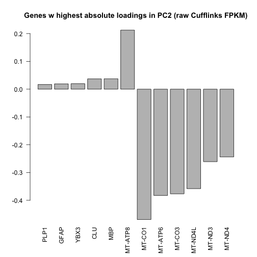 

```r
      print(fpkm.cuff.pc2)
```

```
##                 Gene Symbol  EoGE_brain  EoGE_heart EoGE_kidney
## ENSG00000123560        PLP1  2829.73000     8.54714     0.00000
## ENSG00000131095        GFAP  1848.19000     9.74111     5.94327
## ENSG00000060138        YBX3     9.07246   225.31100   243.22900
## ENSG00000120885         CLU  5495.28000   275.90600  2845.96000
## ENSG00000197971         MBP  6099.71000     9.18006    28.51080
## ENSG00000228253     MT-ATP8 35940.50000 12550.60000 29657.80000
## ENSG00000198804      MT-CO1  9524.53000 38741.00000  3772.82000
## ENSG00000198899     MT-ATP6 14543.90000 43699.60000 27038.30000
## ENSG00000198938      MT-CO3 10377.90000 27986.40000 13574.30000
## ENSG00000212907     MT-ND4L  9785.53000 61755.40000 17136.40000
## ENSG00000198840      MT-ND3 11154.60000 11274.10000 16370.80000
## ENSG00000198886      MT-ND4  9043.37000 31881.50000 17645.40000
##                 Atlas_brain Atlas_heart Atlas_kidney BodyMap_brain
## ENSG00000123560      474.81     2.27603  3.28358e-01      1993.670
## ENSG00000131095      934.18     0.96437  5.57265e+00      2412.650
## ENSG00000060138     2266.43 29731.30000  2.03077e+03        49.521
## ENSG00000120885     3538.52   170.58400  3.30082e+02      2412.680
## ENSG00000197971     2304.66    12.39860  2.30044e+01      3361.860
## ENSG00000228253     5519.30 12604.10000  1.15482e+04    271870.000
## ENSG00000198804     4331.87 12564.70000  1.21482e+04     14160.200
## ENSG00000198899     8168.86 16937.60000  1.60234e+04     26213.000
## ENSG00000198938     2072.48  3861.35000  4.63446e+03     12464.400
## ENSG00000212907     3655.66  8937.97000  1.23879e+04     13244.600
## ENSG00000198840     4281.00 11015.10000  1.13899e+04     21727.900
## ENSG00000198886    10485.30 23653.50000  2.22740e+04     13637.500
##                 BodyMap_heart BodyMap_kidney  HPA_brain   HPA_heart
## ENSG00000123560       3.17969    2.66083e-01  1789.8700 1.36904e+01
## ENSG00000131095       1.40515    4.52636e-01  2752.7200 2.58878e+00
## ENSG00000060138     320.10900    1.23268e+02    17.6349 2.08790e+02
## ENSG00000120885      94.74010    5.58195e+02  5895.8000 2.14378e+02
## ENSG00000197971       6.55905    1.28627e+01  2097.8600 1.04630e+01
## ENSG00000228253   51767.40000    1.72497e+05 15531.1000 1.42989e+05
## ENSG00000198804   49349.40000    3.08358e+04 11235.4000 6.49431e+04
## ENSG00000198899   49140.10000    3.30071e+04  8507.1400 5.36826e+04
## ENSG00000198938   38902.20000    2.94114e+04  7538.3200 5.67093e+04
## ENSG00000212907   22257.20000    1.94946e+04  7248.3700 3.87762e+04
## ENSG00000198840   34560.50000    3.27743e+04  5552.0300 4.18535e+04
## ENSG00000198886   30344.00000    2.33878e+04  7150.8100 3.85014e+04
##                  HPA_kidney AltIso_brain AltIso_heart
## ENSG00000123560 2.36948e-01    2404.6500  3.63968e+00
## ENSG00000131095 5.72929e-01    1472.6400  1.15580e+01
## ENSG00000060138 4.14174e+01      24.5855  3.08346e+02
## ENSG00000120885 7.29142e+02    6333.5200  2.06256e+02
## ENSG00000197971 1.98815e+01   15257.1000  1.19544e+01
## ENSG00000228253 3.45844e+04  193776.0000  3.27884e+05
## ENSG00000198804 1.80885e+04   16936.6000  3.74794e+04
## ENSG00000198899 1.69014e+04   37697.3000  6.11711e+04
## ENSG00000198938 1.52824e+04   20230.1000  3.17234e+04
## ENSG00000212907 1.29200e+04   21268.1000  2.95195e+04
## ENSG00000198840 1.29789e+04   68273.5000  1.23074e+05
## ENSG00000198886 1.04462e+04   21114.9000  2.56405e+04
```

```r
      #PC3:
      load.pc3 <- p.cufflinks$rotation[,3][order(p.cufflinks$rotation[,3])]
      extreme.pc3 <- c(tail(load.pc3), head(load.pc3))
      
      extreme.pc3.ensg <- names(extreme.pc3)
      extreme.pc3.symbols <- getBM(attributes=c("ensembl_gene_id", "hgnc_symbol"), 
                           filters = "ensembl_gene_id",
                           values=extreme.pc3.ensg,
                           mart=ensembl)
      
      q <- extreme.pc3.symbols[,2]
      names(q) <- extreme.pc3.symbols[,1]
      
      fpkm.cuff.pc3 <- cbind(q[extreme.pc3.ensg],cufflinks_fpkms[extreme.pc3.ensg,])
      names(fpkm.cuff.pc3)[names(fpkm.cuff.pc3) == 'q[extreme.pc3.ensg]'] <- 'Gene Symbol'
      
      barplot(extreme.pc3, names.arg=q[extreme.pc3.ensg],las=2,main="Genes w highest absolute loadings in PC3 (raw Cufflinks FPKM)")
```

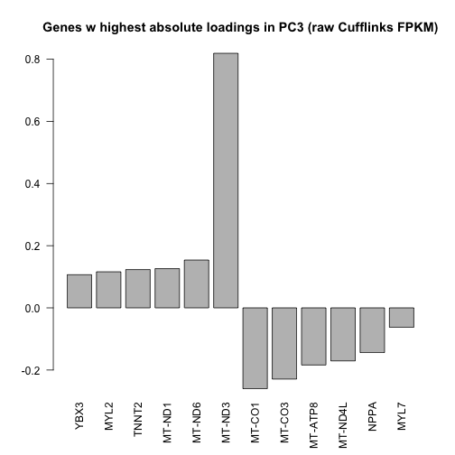 

```r
      print(fpkm.cuff.pc3)
```

```
##                 Gene Symbol  EoGE_brain EoGE_heart EoGE_kidney Atlas_brain
## ENSG00000060138        YBX3 9.07246e+00    225.311 2.43229e+02 2.26643e+03
## ENSG00000111245        MYL2 0.00000e+00   9422.800 1.39516e-01 3.66549e-01
## ENSG00000118194       TNNT2 3.71590e+01   6316.890 1.10142e+02 1.45246e+01
## ENSG00000198888      MT-ND1 9.78313e+03  12970.400 1.29274e+04 6.60907e+03
## ENSG00000198695      MT-ND6 3.82118e+03   5483.280 6.60388e+03 1.16186e+04
## ENSG00000198840      MT-ND3 1.11546e+04  11274.100 1.63708e+04 4.28100e+03
## ENSG00000198804      MT-CO1 9.52453e+03  38741.000 3.77282e+03 4.33187e+03
## ENSG00000198938      MT-CO3 1.03779e+04  27986.400 1.35743e+04 2.07248e+03
## ENSG00000228253     MT-ATP8 3.59405e+04  12550.600 2.96578e+04 5.51930e+03
## ENSG00000212907     MT-ND4L 9.78553e+03  61755.400 1.71364e+04 3.65566e+03
## ENSG00000175206        NPPA 2.84121e+00    451.672 3.93243e-01 6.99760e-01
## ENSG00000106631        MYL7 6.93233e-01   4082.360 2.47695e-01 0.00000e+00
##                 Atlas_heart Atlas_kidney BodyMap_brain BodyMap_heart
## ENSG00000060138   29731.300   2030.77000   4.95210e+01       320.109
## ENSG00000111245    2115.710      2.47691   5.07789e-01      6846.970
## ENSG00000118194   18168.900     69.13160   1.14161e+01      2903.310
## ENSG00000198888   11043.300   9043.73000   1.26450e+04     28802.200
## ENSG00000198695   17693.000  20262.40000   8.16544e+03     12493.100
## ENSG00000198840   11015.100  11389.90000   2.17279e+04     34560.500
## ENSG00000198804   12564.700  12148.20000   1.41602e+04     49349.400
## ENSG00000198938    3861.350   4634.46000   1.24644e+04     38902.200
## ENSG00000228253   12604.100  11548.20000   2.71870e+05     51767.400
## ENSG00000212907    8937.970  12387.90000   1.32446e+04     22257.200
## ENSG00000175206     425.586      0.16033   9.12246e-01       262.600
## ENSG00000106631     317.582      0.00000   1.87680e-01       462.302
##                 BodyMap_kidney   HPA_brain   HPA_heart HPA_kidney
## ENSG00000060138    1.23268e+02    17.63490 2.08790e+02    41.4174
## ENSG00000111245    0.00000e+00     0.00000 5.94298e+00     0.0000
## ENSG00000118194    2.37429e+01     6.30235 3.83771e+03    19.3001
## ENSG00000198888    1.21673e+04  3653.90000 2.35580e+04  6011.1400
## ENSG00000198695    1.55920e+04  4505.17000 2.12975e+04  5803.0100
## ENSG00000198840    3.27743e+04  5552.03000 4.18535e+04 12978.9000
## ENSG00000198804    3.08358e+04 11235.40000 6.49431e+04 18088.5000
## ENSG00000198938    2.94114e+04  7538.32000 5.67093e+04 15282.4000
## ENSG00000228253    1.72497e+05 15531.10000 1.42989e+05 34584.4000
## ENSG00000212907    1.94946e+04  7248.37000 3.87762e+04 12920.0000
## ENSG00000175206    3.06539e-01    11.06860 2.55263e+04     0.0000
## ENSG00000106631    0.00000e+00     0.00000 1.00109e+04     0.0000
##                 AltIso_brain AltIso_heart
## ENSG00000060138  2.45855e+01      308.346
## ENSG00000111245  1.76461e+00    15922.700
## ENSG00000118194  2.61744e+01    12212.100
## ENSG00000198888  2.61690e+04    30152.700
## ENSG00000198695  1.41279e+04    28571.200
## ENSG00000198840  6.82735e+04   123074.000
## ENSG00000198804  1.69366e+04    37479.400
## ENSG00000198938  2.02301e+04    31723.400
## ENSG00000228253  1.93776e+05   327884.000
## ENSG00000212907  2.12681e+04    29519.500
## ENSG00000175206  3.20302e+00      737.390
## ENSG00000106631  0.00000e+00      851.308
```
Mitochondrially encoded genes have relatively high expresseion levels, FPKM values of several thousands.

Anova analysis of different batch factors, Figure 4c:


```r
p <- melt(cufflinks_fpkms)
```

```
## Using  as id variables
```

```r
colnames(p) <- c("sample_ID","Cuff_FPKM")
meta <- sampleinfo_cufflinks[,c("Study","Tissue","Preparation","NumberRaw","Numbermapped","Readtype","readlength")]
rownames(meta) <- colnames(cufflinks_fpkms)
tissue <- rep(meta$Tissue, each=nrow(cufflinks_fpkms))
study <- rep(meta$Study, each=nrow(cufflinks_fpkms))
prep <- rep(meta$Preparation, each=nrow(cufflinks_fpkms))
layout <- rep(meta$Readtype, each=nrow(cufflinks_fpkms))
raw <- rep(meta$NumberRaw, each=nrow(cufflinks_fpkms))
readlen <- rep(meta$readlength, each=nrow(cufflinks_fpkms))

data <- data.frame(p, tissue=tissue, study=study, prep=prep, layout=layout, nraw=raw, readlen=readlen)
fit <- lm(Cuff_FPKM ~ layout + readlen + prep + nraw + study + tissue, data=data)
d <- anova(fit)
maxval = 100

barplot(100*d$"Sum Sq"[1:5]/sum(d$"Sum Sq"[1:5]),names.arg=rownames(d[1:5,]),main="Anova, Cufflinks FPKM",ylim=c(0,maxval))
```

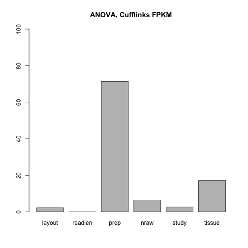 

Try log2 transformation of the reprocessed FPKM values:


```r
pseudo <- 1
cufflinks_log <- log2(cufflinks_fpkms + pseudo)
```

Heatmap of Spearman correlations between log2 reprocessed cufflinks FPKM values, Figure 4d:


```r
pheatmap(cor(cufflinks_log) ,method="spearman")
```

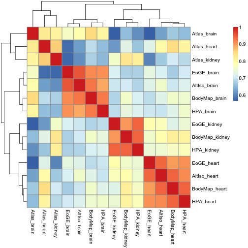 

PCA analysis of log2 reprocessed cufflinks FPKM values, Figure 4e:


```r
colors <- c("dodgerblue", "indianred", "forestgreen",
            "dodgerblue", "indianred", "forestgreen",
            "dodgerblue", "indianred", "forestgreen",
            "dodgerblue", "indianred", "forestgreen",
            "dodgerblue", "indianred")          

p.log.cufflinks <- prcomp(t(cufflinks_log))

shapes_cufflinks <- c(rep(11,3),rep(8,3),rep(17,3),rep(15,3),rep(16,2))
plot(p.log.cufflinks$x[,1],p.log.cufflinks$x[,2],pch=shapes_cufflinks,col=colors,xlab=paste("PC1 33% of variance"),ylab=paste("PC2 25% of variance"),main="log2 reprocessed cufflinks FPKM values \n n=19,475")
legend("bottomleft",legend=c("Heart","Brain","Kidney"),col=c("indianred", "dodgerblue", "forestgreen"),cex=1.5,pch=20,bty="n")
legend("top",legend=c("EoGE","Atlas","BodyMap","HPA","AltIso"),col="black",pch=c(11,8,17,15,16),ncol=2)
```

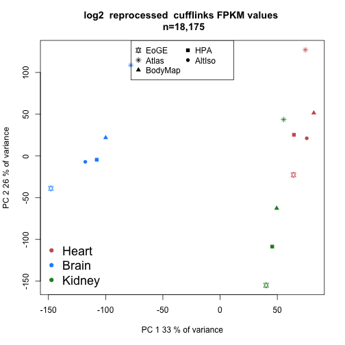 

Figure 4f:


```r
plot(p.log.cufflinks$x[,2],p.log.cufflinks$x[,3],pch=shapes_cufflinks,col=colors,xlab=paste("PC2 25% of variance"),ylab=paste("PC3 22% of variance"),main="log2 reprocessed cufflinks FPKM values \n n=19,475")
legend("bottomleft",legend=c("Heart","Brain","Kidney"),col=c("indianred", "dodgerblue", "forestgreen"),cex=1.5,pch=20,bty="n")
legend("topleft",legend=c("EoGE","Atlas","BodyMap","HPA","AltIso"),col="black",pch=c(11,8,17,15,16),ncol=2)
```

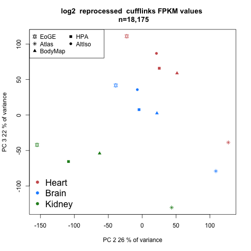 

We can plot all pairwise combinations of principal components 1 to 5. (not shown in paper):


```r
par(mfrow=c(4,4))
for (i in 1:6){
  for(j in 1:6){
    if (i<j){ 
  	plot(p.log.cufflinks$x[,i],p.log.cufflinks$x[,j],pch=shapes_cufflinks,col=colors,xlab=paste("PC",i),ylab=paste("PC",j),main="log2 reprocessed FPKM values \n n=19475")
		}
	}
}
```

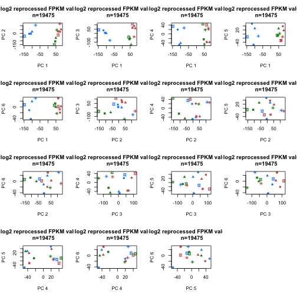 

Cross-validattion by leaving out one of the studies, in this case AltIso, Figure 4g: 


```r
colors <- c("dodgerblue", "indianred", "forestgreen",
            "dodgerblue", "indianred", "forestgreen",
            "dodgerblue", "indianred", "forestgreen",
            "dodgerblue", "indianred", "forestgreen",
            "dodgerblue", "indianred") 

p.loo <- cufflinks_log[,-c(13,14)]
colors.loo <- colors[-c(13,14)]
p.loo.log <- prcomp(t(p.loo))

p.add <- cufflinks_log[,c(13,14)]
projection <- t(p.add) %*% p.loo.log$rotation

p.original.plus.new <- rbind(p.loo.log$x, projection)
col.original.plus.new <- c(colors.loo, colors[c(13,14)])
plot(p.original.plus.new[,2],p.original.plus.new[,3],pch=c(shapes_cufflinks[1:12],rep(22,nrow(projection))),col=col.original.plus.new,xlab="PC2",ylab="PC3",main="log2 Cufflinks FPKM values; AltIso projected onto existing PCs \n n=19,475,",xlim=c(-150,100))

legend("bottomleft",legend=c("Heart","Brain","Kidney"),col=c("indianred", "dodgerblue", "forestgreen"),cex=1.5,pch=20,bty="n")
legend("topleft",legend=c("HPA","GTEx","Atlas","AltIso"),col="black",pch=c(11,8,17,15,22),ncol=2)
```

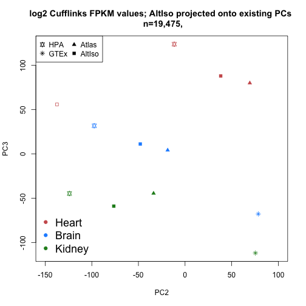 

Look a bit closer at PCs 1-3 in prcomp for the logged FPKM values from cufflinks (not shown in paper):


```r
      #PC1
      load.pc1 <- p.log.cufflinks$rotation[,1][order(p.log.cufflinks$rotation[,1])]
      extreme.pc1 <- c(tail(load.pc1), head(load.pc1))
      
      extreme.pc1.ensg <- names(extreme.pc1)
      extreme.pc1.symbols <- getBM(attributes=c("ensembl_gene_id", "hgnc_symbol"), 
                           filters = "ensembl_gene_id",
                           values=extreme.pc1.ensg,
                           mart=ensembl)
      
      q <- extreme.pc1.symbols[,2]
      names(q) <- extreme.pc1.symbols[,1]
      
      fpkm.logcuff.pc1 <- cbind(q[extreme.pc1.ensg],cufflinks_fpkms[extreme.pc1.ensg,])
      names(fpkm.logcuff.pc1)[names(fpkm.logcuff.pc1) == 'q[extreme.pc1.ensg]'] <- 'Gene Symbol'
      
      barplot(extreme.pc1, names.arg=q[extreme.pc1.ensg],las=2,main="Genes w highest absolute loadings in PC1 (log2 Cufflinks FPKM)")
```

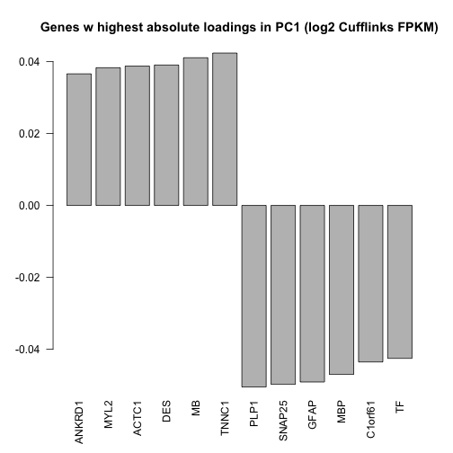 

```r
      print(fpkm.combat.pc1)
```

```
##                 Gene Symbol HPA_heart HPA_brain HPA_kidney AltIso_heart
## ENSG00000104833      TUBB4A       0.3     235.1        1.5         2.94
## ENSG00000168314        MOBP       0.0     138.0        0.1         0.00
## ENSG00000104435       STMN2       0.1     235.9        0.2         0.00
## ENSG00000132639      SNAP25       1.2     802.9        1.7         0.15
## ENSG00000123560        PLP1      11.9    1295.2        0.7         2.56
## ENSG00000131095        GFAP       3.0    1372.0        1.4         1.70
## ENSG00000111245        MYL2    5291.5       0.2        2.6     16780.36
## ENSG00000198125          MB    3937.3       0.9        2.3      7065.54
## ENSG00000114854       TNNC1    3087.9       0.3       14.0      4100.03
## ENSG00000148677      ANKRD1    2451.5       0.2        0.3      1088.94
## ENSG00000118194       TNNT2    2693.8       7.0       20.8      8074.39
## ENSG00000129991       TNNI3    2157.5       0.5        0.1      2698.36
##                 AltIso_brain   GTEx_heart  GTEx_brain GTEx_kidney
## ENSG00000104833      2038.44 5.334400e-01  387.557159  1.91307497
## ENSG00000168314       100.74 6.864151e-03  486.668854  0.02783972
## ENSG00000104435       176.88 1.790114e-02  217.035278  0.15557937
## ENSG00000132639       535.77 3.757800e-02  117.302628  0.65681189
## ENSG00000123560      1544.93 2.431595e+00 1164.716431  0.41628277
## ENSG00000131095       834.13 1.671327e+00 3633.817383  0.85376036
## ENSG00000111245         1.03 1.576518e+04   10.200603  2.31427050
## ENSG00000198125         1.35 2.705914e+03    2.691524  0.69783533
## ENSG00000114854         0.69 2.618310e+03    3.013112  5.23761368
## ENSG00000148677         0.10 1.471472e+03    2.073998  0.56015652
## ENSG00000118194         9.37 2.027960e+03    1.675462 11.86674309
## ENSG00000129991         0.47 5.751823e+03    4.095819  0.60909325
##                 Atlas_heart Atlas_brain Atlas_kidney
## ENSG00000104833       0.408      82.655        0.389
## ENSG00000168314       0.176     153.127        0.139
## ENSG00000104435       0.105     139.464        0.000
## ENSG00000132639       0.346     284.680        0.180
## ENSG00000123560       5.086     779.755        0.513
## ENSG00000131095       0.549     691.908        0.135
## ENSG00000111245    1064.500       0.000        0.358
## ENSG00000198125    1415.554       0.032        0.000
## ENSG00000114854     316.135       0.763        1.014
## ENSG00000148677    3863.610       0.403        0.263
## ENSG00000118194   10930.800       8.713       43.633
## ENSG00000129991     999.559       0.675        0.132
```

```r
      #PC2
      load.pc2 <- p.log.cufflinks$rotation[,2][order(p.log.cufflinks$rotation[,2])]
      extreme.pc2 <- c(tail(load.pc2), head(load.pc2))
      
      extreme.pc2.ensg <- names(extreme.pc2)
      extreme.pc2.symbols <- getBM(attributes=c("ensembl_gene_id", "hgnc_symbol"), 
                           filters = "ensembl_gene_id",
                           values=extreme.pc2.ensg,
                           mart=ensembl)
      
      q <- extreme.pc2.symbols[,2]
      names(q) <- extreme.pc2.symbols[,1]
      
      fpkm.logcuff.pc2 <- cbind(q[extreme.pc2.ensg],cufflinks_fpkms[extreme.pc2.ensg,])
      names(fpkm.logcuff.pc2)[names(fpkm.logcuff.pc2) == 'q[extreme.pc2.ensg]'] <- 'Gene Symbol'
      
      barplot(extreme.pc2, names.arg=q[extreme.pc2.ensg],las=2,main="Genes w highest absolute loadings in PC2 (log2 Cufflinks FPKM)")
```

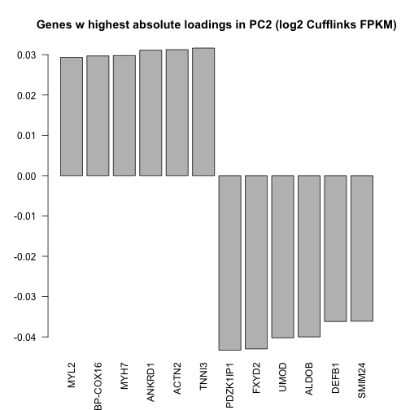 

```r
      print(fpkm.combat.pc2)
```

```
##                 Gene Symbol HPA_heart HPA_brain HPA_kidney AltIso_heart
## ENSG00000095932      SMIM24       0.1       2.2      424.6         0.00
## ENSG00000145692        BHMT       0.0       1.0      538.5         0.00
## ENSG00000124253        PCK1       0.5       0.7      489.6         0.93
## ENSG00000164825       DEFB1       0.1       0.6      662.2         0.84
## ENSG00000169344        UMOD       0.1       1.5     1425.7         0.00
## ENSG00000136872       ALDOB       0.4       2.4     1824.1         0.00
## ENSG00000129991       TNNI3    2157.5       0.5        0.1      2698.36
## ENSG00000092054        MYH7    1802.4       2.1        0.8      4117.17
## ENSG00000111245        MYL2    5291.5       0.2        2.6     16780.36
## ENSG00000148677      ANKRD1    2451.5       0.2        0.3      1088.94
## ENSG00000198125          MB    3937.3       0.9        2.3      7065.54
## ENSG00000159251       ACTC1    2914.4       1.6        0.4      3457.43
##                 AltIso_brain   GTEx_heart  GTEx_brain  GTEx_kidney
## ENSG00000095932         3.06 0.000000e+00  0.75338495  237.5329590
## ENSG00000145692         0.26 1.949457e-02  0.04663841  210.6383972
## ENSG00000124253         0.00 1.512038e-02  1.43247831 1107.3145752
## ENSG00000164825         0.22 1.319554e-01  0.37882489  726.4010620
## ENSG00000169344         0.00 0.000000e+00  0.00000000  285.9096680
## ENSG00000136872         0.49 1.629837e-01  0.22984688 1927.8311768
## ENSG00000129991         0.47 5.751823e+03  4.09581852    0.6090932
## ENSG00000092054         0.83 4.713973e+03  6.48698330    0.6886783
## ENSG00000111245         1.03 1.576518e+04 10.20060253    2.3142705
## ENSG00000148677         0.10 1.471472e+03  2.07399774    0.5601565
## ENSG00000198125         1.35 2.705914e+03  2.69152427    0.6978353
## ENSG00000159251         0.42 5.319639e+03  3.65303826    1.0412433
##                 Atlas_heart Atlas_brain Atlas_kidney
## ENSG00000095932       0.000       0.042      109.653
## ENSG00000145692       0.052       0.106      116.957
## ENSG00000124253       0.923       0.099      127.729
## ENSG00000164825       0.000       0.082      179.618
## ENSG00000169344       0.000       0.000      371.344
## ENSG00000136872       1.452       0.125      788.910
## ENSG00000129991     999.559       0.675        0.132
## ENSG00000092054    2137.510       0.635        0.354
## ENSG00000111245    1064.500       0.000        0.358
## ENSG00000148677    3863.610       0.403        0.263
## ENSG00000198125    1415.554       0.032        0.000
## ENSG00000159251     310.068       0.421        0.311
```

```r
      #PC3
      load.pc3 <- p.log.cufflinks$rotation[,3][order(p.log.cufflinks$rotation[,3])]
      extreme.pc3 <- c(tail(load.pc3), head(load.pc3))
      
      extreme.pc3.ensg <- names(extreme.pc3)
      extreme.pc3.symbols <- getBM(attributes=c("ensembl_gene_id", "hgnc_symbol"), 
                           filters = "ensembl_gene_id",
                           values=extreme.pc3.ensg,
                           mart=ensembl)

      q <- extreme.pc3.symbols[,2]
      names(q) <- extreme.pc3.symbols[,1]
  
      fpkm.logcuff.pc3 <- cbind(q[extreme.pc3.ensg],cufflinks_fpkms[extreme.pc3.ensg,])
      names(fpkm.logcuff.pc3)[names(fpkm.logcuff.pc3) == 'q[extreme.pc3.ensg]'] <- 'Gene Symbol'
      
      barplot(extreme.pc3, names.arg=q[extreme.pc3.ensg],las=2,main="Genes w highest absolute loadings in PC3 (log2 Cufflinks FPKM)")
```

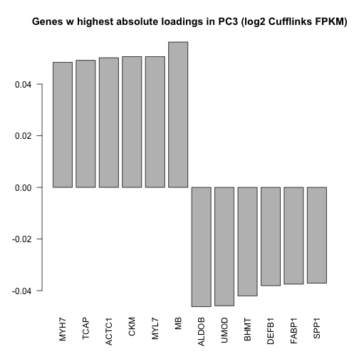 

```r
      print(fpkm.combat.pc3)
```

```
##                 Gene Symbol HPA_heart HPA_brain HPA_kidney AltIso_heart
## ENSG00000163631         ALB       0.8       0.8      327.6         0.00
## ENSG00000173432        SAA1       0.6       1.3        1.2         5.20
## ENSG00000161610        HCRT       0.0       0.0        0.1         0.00
## ENSG00000140575      IQGAP1      22.5      15.9       40.6         6.29
## ENSG00000188257     PLA2G2A      51.2       0.8        2.3       210.68
## ENSG00000183395        PMCH       0.2       0.0        0.0         0.13
## ENSG00000129824      RPS4Y1      40.8      53.7       60.9        66.40
## ENSG00000170345         FOS     147.3     116.7      288.4         6.23
## ENSG00000104888     SLC17A7       1.1     263.4        0.5         0.84
## ENSG00000103316        CRYM     124.5      58.4       43.4        30.53
## ENSG00000070808      CAMK2A       8.8     134.7        1.2         1.63
## ENSG00000170579      DLGAP1       0.4      57.5        0.8         0.00
##                 AltIso_brain   GTEx_heart   GTEx_brain GTEx_kidney
## ENSG00000163631         0.00 6.669276e-02    0.6302398 12.09975052
## ENSG00000173432         0.00 2.748352e-02    0.5260081  9.07668495
## ENSG00000161610         0.00 0.000000e+00  165.0033417  0.04222484
## ENSG00000140575         4.86 1.250947e+01  331.6091614 14.63416481
## ENSG00000188257         0.00 2.313501e+00    0.4622447  0.44190565
## ENSG00000183395         0.14 0.000000e+00 2045.6381836  0.00000000
## ENSG00000129824        45.76 8.935241e+01    0.6486077 86.30981445
## ENSG00000170345        20.94 2.698389e+02    8.9939346 29.33131218
## ENSG00000104888       311.50 1.172251e+00    0.5592491  0.32665563
## ENSG00000103316        38.56 6.342062e+01    4.4874167 48.14843750
## ENSG00000070808       322.44 1.065451e+00    3.2226882  0.08715166
## ENSG00000170579        56.90 4.433761e-03    1.1073956  0.42644233
##                 Atlas_heart Atlas_brain Atlas_kidney
## ENSG00000163631      37.193       0.152       24.347
## ENSG00000173432     110.718       0.000       35.264
## ENSG00000161610       0.000       0.197        0.000
## ENSG00000140575      28.961       8.308       23.509
## ENSG00000188257    2351.218       3.057       24.728
## ENSG00000183395       0.000       0.050        0.000
## ENSG00000129824      30.176      42.832       14.097
## ENSG00000170345      15.149      41.809       34.855
## ENSG00000104888       0.044      11.004        0.019
## ENSG00000103316       7.586      20.478        5.674
## ENSG00000070808       1.640     131.757        0.144
## ENSG00000170579       0.241      53.706        0.905
```

Seems to yield a heart vs. brain separation

To further validate the above results, indicating that tissue specificity appears mainly in PC 3, we will extract the 500 genes with highest loadings in each component and plot the corresponding cufflinks FPKM values in a heatmap (not shown in paper):


```r
     cufflinks_values <- cufflinks_pc_nozero[,3:16]
     rownames(cufflinks_values) <- cufflinks_pc_nozero[,1]

     load.pc1 <- abs(p.log.cufflinks$rotation[,1])[order(abs(p.log.cufflinks$rotation[,1]),decreasing=TRUE)]
     top.pc1 <- names(load.pc1[1:500])
     load.pc2 <- abs(p.log.cufflinks$rotation[,2])[order(abs(p.log.cufflinks$rotation[,2]),decreasing=TRUE)]
     top.pc2 <- names(load.pc2[1:500])
     load.pc3 <- abs(p.log.cufflinks$rotation[,3])[order(abs(p.log.cufflinks$rotation[,3]),decreasing=TRUE)]
     top.pc3 <- names(load.pc3[1:500])
     
     pheatmap(cor(cufflinks_values[top.pc1,]),method="spearman")
```

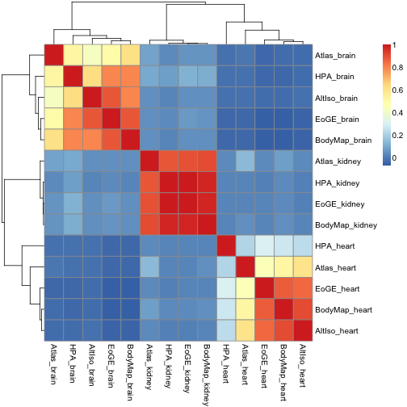 

```r
     pheatmap(cor(cufflinks_values[top.pc2,]),method="spearman")
```

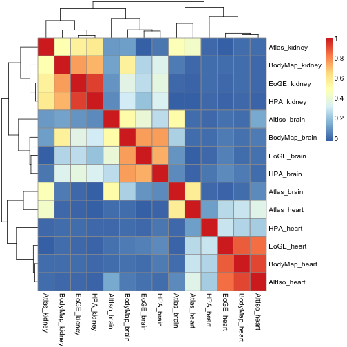 

```r
     pheatmap(cor(cufflinks_values[top.pc3,]),method="spearman")
```

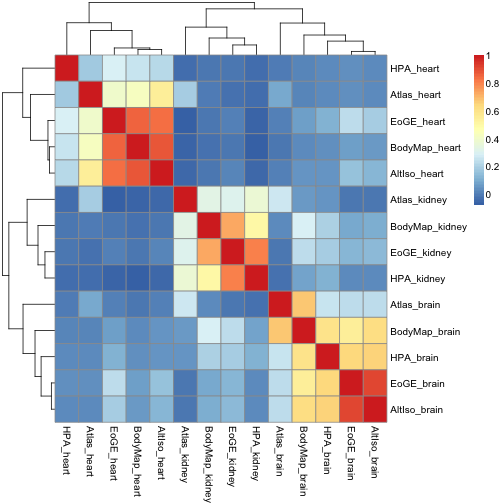 
    
Try Anova on a "melted" expression matrix with logged cufflinks values and some metadata (not shown in paper):


```r
q <- melt(cufflinks_log[,])
```

```
## Using  as id variables
```

```r
colnames(q) <- c("sample_ID","logFPKM")
meta <- sampleinfo_cufflinks[,c("Study","Tissue","Preparation","NumberRaw","Numbermapped","Readtype","readlength")]
rownames(meta) <- colnames(cufflinks_log)
tissue <- rep(meta$Tissue, each=nrow(cufflinks_log))
study <- rep(meta$Study, each=nrow(cufflinks_log))
prep <- rep(meta$Preparation, each=nrow(cufflinks_log))
layout <- rep(meta$Readtype, each=nrow(cufflinks_log))
readlen <- rep(meta$readlength, each=nrow(cufflinks_log))
raw <- rep(meta$NumberRaw, each=nrow(cufflinks_log))
data <- data.frame(q, tissue=tissue, study=study, prep=prep, layout=layout, nraw=raw, readlen=readlen)
fit <- lm(logFPKM ~ layout + readlen + prep + nraw + study + tissue, data=data)
e <- anova(fit)
maxval = 100

barplot(100*e$"Sum Sq"[1:5]/sum(e$"Sum Sq"[1:5]),names.arg=rownames(e[1:5,]),main="Anova, Cufflinks log2 FPKM",ylim=c(0,maxval))
```

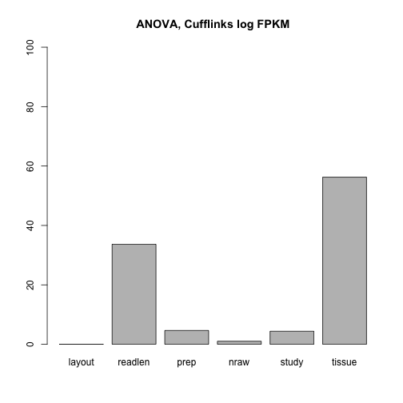 

SVA analysis.

```r
library(sva)
mod <- model.matrix(~as.factor(Tissue), data=sampleinfo_reprocessed)
```

```
## Error in terms.formula(object, data = data): object 'sampleinfo_reprocessed' not found
```

```r
mod0 <- model.matrix(~1, data=sampleinfo_reprocessed)
```

```
## Error in terms.formula(object, data = data): object 'sampleinfo_reprocessed' not found
```

```r
n.sv <- num.sv(published.log,mod,method="leek")
```

```
## Error in num.sv(published.log, mod, method = "leek"): object 'mod' not found
```

```r
svobj <- sva(as.matrix(published.log),mod,mod0,n.sv=n.sv)
```

```
## Error in sva(as.matrix(published.log), mod, mod0, n.sv = n.sv): object 'n.sv' not found
```

```r
surr <- svobj$sv
```

```
## Error in eval(expr, envir, enclos): object 'svobj' not found
```
What are the surrogate variables correlated to?

```r
par(mfrow=c(2,1))
for (i in c(1,2)){
ps <- rep(1,5)
names(ps) <- c("Preparation", "Study", "NumberRaw", "Readtype", "Readlength")
ps[1] <- cor.test(surr[,i], as.numeric(sampleinfo_published$Preparation))$p.value
ps[2] <- cor.test(surr[,i], as.numeric(sampleinfo_published$Study))$p.value
ps[3] <- cor.test(surr[,i], as.numeric(sampleinfo_published$NumberRaw))$p.value
ps[4] <- cor.test(surr[,i], as.numeric(sampleinfo_published$Readtype))$p.value
ps[5] <- cor.test(surr[,i], as.numeric(sampleinfo_published$readlength))$p.value
barplot(-log(ps),las=2)
}
```

```
## Error in cor.test(surr[, i], as.numeric(sampleinfo_published$Preparation)): object 'surr' not found
```

Combat analysis for removal of batch effects (n=19,475):


```r
meta <- data.frame(study=c(rep("EoGE",3),rep("Atlas",3),rep("BodyMap",3),rep("HPA",3),rep("AltIso",2)),tissue=c("Brain","Heart","Kidney","Brain","Heart","Kidney","Brain","Heart","Kidney","Brain","Heart","Kidney","Brain","Heart"),prep=c(rep("poly-A",3),rep("rRNA-depl",3),rep("poly-A",8)),layout=c(rep("PE",3),rep("SE",3),rep("PE",6),rep("SE",2)))

batch <- meta$study
design <- model.matrix(~1,data=meta)
combat.cufflinks <- ComBat(dat=cufflinks_log,batch=batch,mod=design,numCovs=NULL,par.prior=TRUE)
```

```
## Found 5 batches
## Found 0  categorical covariate(s)
## Standardizing Data across genes
## Fitting L/S model and finding priors
## Finding parametric adjustments
## Adjusting the Data
```

```r
rownames(combat.cufflinks) <- rownames(cufflinks_log)
```

Heatmap of Spearman correlations between reprocessed cufflinks FPKM values after ComBat run, Figure 4h:


```r
pheatmap(cor(combat.cufflinks),method="spearman")
```

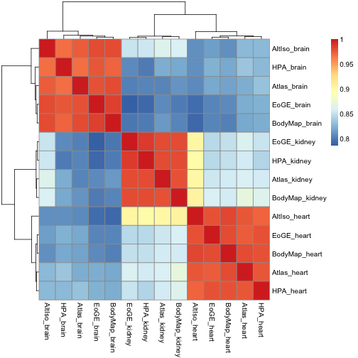 

PCA analysis on reprocessed cufflinks FPKM values after ComBat run, Figure 4i:


```r
p.combat.cufflinks <- prcomp(t(combat.cufflinks))

shapes_cufflinks <- c(rep(11,3),rep(8,3),rep(17,3),rep(15,3),rep(16,2))


plot(p.combat.cufflinks$x[,1],p.combat.cufflinks$x[,2],pch=shapes_cufflinks,col=colors,xlab=paste("PC1 54% of variance"),ylab=paste("PC2 37% of variance"),main="Cufflinks FPKM values \n COMBAT \n n=19,475")
legend("bottomleft",legend=c("Heart","Brain","Kidney"),col=c("indianred", "dodgerblue", "forestgreen"),cex=1.5,pch=20,bty="n")
legend("top",legend=c("EoGE","Atlas","BodyMap","HPA","AltIso"),col="black",pch=c(11,8,17,15,16),ncol=2)
```

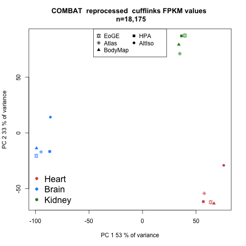 

We can plot all pairwise combinations of principal components 1 to 5. (not shown in paper):


```r
par(mfrow=c(4,4))
for (i in 1:6){
  for(j in 1:6){
    if (i<j){ 
  	plot(p.combat.cufflinks$x[,i],p.combat.cufflinks$x[,j],pch=shapes_cufflinks,col=colors,xlab=paste("PC",i),ylab=paste("PC",j),main="Cufflinks FPKM values \n COMBAT \ n=19,475")
		}
	}
}
```

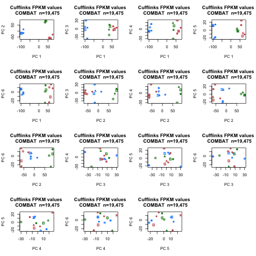 

Look a bit closer at PCs 1-3 in prcomp (not shown in paper):


```r
      #PC1:
      load.pc1 <- p.combat.cufflinks$rotation[,1][order(p.combat.cufflinks$rotation[,1])]
      extreme.pc1 <- c(tail(load.pc1), head(load.pc1))
      
      extreme.pc1.ensg <- names(extreme.pc1)
      extreme.pc1.symbols <- getBM(attributes=c("ensembl_gene_id", "hgnc_symbol"), 
                           filters = "ensembl_gene_id",
                           values=extreme.pc1.ensg,
                           mart=ensembl)
      
      q <- extreme.pc1.symbols[,2]
      names(q) <- extreme.pc1.symbols[,1]

      fpkm.combatcuff.pc1 <- cbind(q[extreme.pc1.ensg],cufflinks_fpkms[extreme.pc1.ensg,])
      names(fpkm.combatcuff.pc1)[names(fpkm.combatcuff.pc1) == 'q[extreme.pc1.ensg]'] <- 'Gene Symbol'
      
      barplot(extreme.pc1, names.arg=q[extreme.pc1.ensg],las=2,main="Genes w highest absolute loadings in PC1 (COMBAT Cufflinks FPKM)")
```

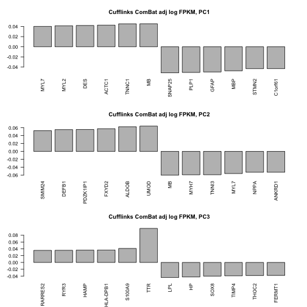 

```r
      print(fpkm.combatcuff.pc1)
```

```
##                 Gene Symbol  EoGE_brain  EoGE_heart EoGE_kidney
## ENSG00000106631        MYL7    0.693233 4.08236e+03    0.247695
## ENSG00000111245        MYL2    0.000000 9.42280e+03    0.139516
## ENSG00000175084         DES    1.787960 1.30498e+04    4.611970
## ENSG00000159251       ACTC1    0.781353 8.11527e+03    2.472130
## ENSG00000114854       TNNC1    0.955578 5.47605e+03   37.998000
## ENSG00000198125          MB    0.422366 6.14664e+03    1.012190
## ENSG00000132639      SNAP25 1281.440000 3.19712e-01    0.413912
## ENSG00000123560        PLP1 2829.730000 8.54714e+00    0.000000
## ENSG00000131095        GFAP 1848.190000 9.74111e+00    5.943270
## ENSG00000197971         MBP 6099.710000 9.18006e+00   28.510800
## ENSG00000104435       STMN2  370.645000 1.17016e-01    0.000000
## ENSG00000125462     C1orf61  267.177000 0.00000e+00    0.000000
##                 Atlas_brain Atlas_heart Atlas_kidney BodyMap_brain
## ENSG00000106631 0.00000e+00  317.582000     0.000000      0.187680
## ENSG00000111245 3.66549e-01 2115.710000     2.476910      0.507789
## ENSG00000175084 5.34511e+00 1877.990000     6.613140      7.811780
## ENSG00000159251 4.59502e-01  306.744000     0.362615      0.403238
## ENSG00000114854 2.02926e+00  760.254000     2.111650      0.514965
## ENSG00000198125 8.95293e-02  645.039000     0.000000      0.245229
## ENSG00000132639 1.05741e+03    1.779320     0.191087    989.464000
## ENSG00000123560 4.74810e+02    2.276030     0.328358   1993.670000
## ENSG00000131095 9.34180e+02    0.964370     5.572650   2412.650000
## ENSG00000197971 2.30466e+03   12.398600    23.004400   3361.860000
## ENSG00000104435 2.42026e+02    0.233898     0.000000    180.868000
## ENSG00000125462 2.31515e+01    0.224189     0.437641    184.808000
##                 BodyMap_heart BodyMap_kidney   HPA_brain   HPA_heart
## ENSG00000106631   4.62302e+02      0.0000000    0.000000 1.00109e+04
## ENSG00000111245   6.84697e+03      0.0000000    0.000000 5.94298e+00
## ENSG00000175084   3.31610e+03     28.8400000    0.343441 2.85280e+03
## ENSG00000159251   2.51572e+03      4.9242600    0.203375 4.20522e+03
## ENSG00000114854   1.92088e+03      6.2579100    0.000000 1.66310e+03
## ENSG00000198125   4.56240e+03      0.2971230    0.756973 6.00091e+03
## ENSG00000132639   1.47433e-01      0.6909620  383.400000 2.51400e+00
## ENSG00000123560   3.17969e+00      0.2660830 1789.870000 1.36904e+01
## ENSG00000131095   1.40515e+00      0.4526360 2752.720000 2.58878e+00
## ENSG00000197971   6.55905e+00     12.8627000 2097.860000 1.04630e+01
## ENSG00000104435   5.87224e-03      0.0000000   91.125100 3.29211e-02
## ENSG00000125462   5.94140e-03      0.0309964 1182.530000 0.00000e+00
##                 HPA_kidney AltIso_brain AltIso_heart
## ENSG00000106631  0.0000000  0.00000e+00  8.51308e+02
## ENSG00000111245  0.0000000  1.76461e+00  1.59227e+04
## ENSG00000175084 15.3258000  1.24444e+01  1.12005e+04
## ENSG00000159251  0.4576150  1.21448e+00  1.72576e+03
## ENSG00000114854  8.5596600  5.48798e-01  4.13093e+03
## ENSG00000198125  0.6131480  8.09898e-01  7.28009e+03
## ENSG00000132639  0.9298860  5.95834e+02  9.81550e-02
## ENSG00000123560  0.2369480  2.40465e+03  3.63968e+00
## ENSG00000131095  0.5729290  1.47264e+03  1.15580e+01
## ENSG00000197971 19.8815000  1.52571e+04  1.19544e+01
## ENSG00000104435  0.0351684  1.67587e+02  2.99662e-02
## ENSG00000125462  0.0000000  2.99887e+02  1.38336e-01
```

```r
      #PC2:
      load.pc2 <- p.combat.cufflinks$rotation[,2][order(p.combat.cufflinks$rotation[,2])]
      extreme.pc2 <- c(tail(load.pc2), head(load.pc2))
      
      extreme.pc2.ensg <- names(extreme.pc2)
      extreme.pc2.symbols <- getBM(attributes=c("ensembl_gene_id", "hgnc_symbol"), 
                           filters = "ensembl_gene_id",
                           values=extreme.pc2.ensg,
                           mart=ensembl)
      
      q <- extreme.pc2.symbols[,2]
      names(q) <- extreme.pc2.symbols[,1]
      
      fpkm.combatcuff.pc2 <- cbind(q[extreme.pc2.ensg],cufflinks_fpkms[extreme.pc2.ensg,])
      names(fpkm.combatcuff.pc2)[names(fpkm.combatcuff.pc2) == 'q[extreme.pc2.ensg]'] <- 'Gene Symbol'
      
      barplot(extreme.pc2, names.arg=q[extreme.pc2.ensg],las=2,main="Genes w highest absolute loadings in PC2 (COMBAT Cufflinks FPKM)")
```

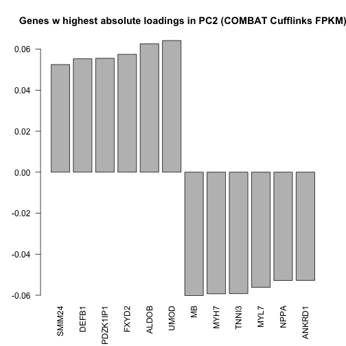 

```r
      print(fpkm.combatcuff.pc2)
```

```
##                 Gene Symbol EoGE_brain  EoGE_heart EoGE_kidney Atlas_brain
## ENSG00000095932      SMIM24   6.958530    0.000000 1019.650000   0.0648434
## ENSG00000164825       DEFB1   0.000000    0.000000 1469.920000   0.1447300
## ENSG00000162366    PDZK1IP1   0.000000    0.338415 4259.220000   0.0000000
## ENSG00000137731       FXYD2   0.085333    1.057280 2744.210000   0.0000000
## ENSG00000136872       ALDOB   0.232646    0.262751 3923.870000   0.1419650
## ENSG00000169344        UMOD   0.000000    0.000000 1380.650000   0.0000000
## ENSG00000198125          MB   0.422366 6146.640000    1.012190   0.0895293
## ENSG00000092054        MYH7   1.119220 7826.230000    0.124365   0.9550060
## ENSG00000129991       TNNI3   1.061300 3832.320000    0.000000   1.8883400
## ENSG00000106631        MYL7   0.693233 4082.360000    0.247695   0.0000000
## ENSG00000175206        NPPA   2.841210  451.672000    0.393243   0.6997600
## ENSG00000148677      ANKRD1   0.000000  400.980000    0.000000   0.4716580
##                 Atlas_heart Atlas_kidney BodyMap_brain BodyMap_heart
## ENSG00000095932 0.00000e+00   237.905000     5.0188200   0.00000e+00
## ENSG00000164825 0.00000e+00   300.820000     0.4429480   9.55738e-01
## ENSG00000162366 1.76553e-01    34.162000     0.2206780   6.88281e-02
## ENSG00000137731 3.14842e-02    83.444000     0.0788030   2.42817e-01
## ENSG00000136872 1.94897e+00   839.917000     0.4262640   2.48512e-01
## ENSG00000169344 0.00000e+00   701.195000     0.0000000   0.00000e+00
## ENSG00000198125 6.45039e+02     0.000000     0.2452290   4.56240e+03
## ENSG00000092054 3.06060e+03     0.445822     0.4532170   2.77221e+03
## ENSG00000129991 3.11226e+03     0.425951     0.4234730   1.48068e+03
## ENSG00000106631 3.17582e+02     0.000000     0.1876800   4.62302e+02
## ENSG00000175206 4.25586e+02     0.160330     0.9122460   2.62600e+02
## ENSG00000148677 4.32044e+03     0.438835     0.0464207   7.95391e+02
##                 BodyMap_kidney  HPA_brain   HPA_heart  HPA_kidney
## ENSG00000095932     178.100000  0.9530750 0.00000e+00 6.26060e+02
## ENSG00000164825     289.458000  0.0000000 0.00000e+00 9.01979e+02
## ENSG00000162366     525.810000  0.0000000 2.17821e-01 1.30491e+03
## ENSG00000137731    1244.340000  0.2491600 7.38869e-01 1.50256e+03
## ENSG00000136872     492.240000  0.2342550 2.95117e-01 3.73037e+03
## ENSG00000169344    1357.400000  0.0000000 0.00000e+00 2.09624e+03
## ENSG00000198125       0.297123  0.7569730 6.00091e+03 6.13148e-01
## ENSG00000092054       0.054512  4.2841700 3.28643e+02 7.33492e-02
## ENSG00000129991       0.000000  0.1386610 1.10360e+03 0.00000e+00
## ENSG00000106631       0.000000  0.0000000 1.00109e+04 0.00000e+00
## ENSG00000175206       0.306539 11.0686000 2.55263e+04 0.00000e+00
## ENSG00000148677       0.278846  0.0494568 1.85788e+03 7.97934e-02
##                 AltIso_brain AltIso_heart
## ENSG00000095932    5.2137000     0.579565
## ENSG00000164825    0.2545150     1.097130
## ENSG00000162366    0.0000000     0.282131
## ENSG00000137731    0.0176443     0.148702
## ENSG00000136872    0.2186470     0.161570
## ENSG00000169344    0.0000000     0.000000
## ENSG00000198125    0.8098980  7280.090000
## ENSG00000092054    0.6425810  2699.210000
## ENSG00000129991    1.0688300  3405.670000
## ENSG00000106631    0.0000000   851.308000
## ENSG00000175206    3.2030200   737.390000
## ENSG00000148677    0.3143330   793.048000
```

```r
      #PC3:      
      load.pc3 <- p.combat.cufflinks$rotation[,3][order(p.combat.cufflinks$rotation[,3])]
      extreme.pc3 <- c(tail(load.pc3), head(load.pc3))
      
      extreme.pc3.ensg <- names(extreme.pc3)
      extreme.pc3.symbols <- getBM(attributes=c("ensembl_gene_id", "hgnc_symbol"), 
                           filters = "ensembl_gene_id",
                           values=extreme.pc3.ensg,
                           mart=ensembl)
      
      q <- extreme.pc3.symbols[,2]
      names(q) <- extreme.pc3.symbols[,1]

      fpkm.combatcuff.pc3 <- cbind(q[extreme.pc3.ensg],cufflinks_fpkms[extreme.pc3.ensg,])
      names(fpkm.combatcuff.pc3)[names(fpkm.combatcuff.pc3) == 'q[extreme.pc3.ensg]'] <- 'Gene Symbol'
      
      barplot(extreme.pc3, names.arg=q[extreme.pc3.ensg],las=2,main="Genes w highest absolute loadings in PC3 (COMBAT Cufflinks FPKM)")
```

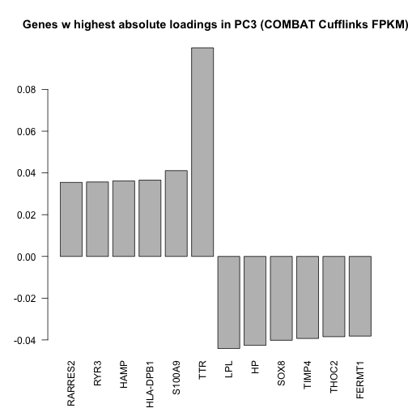 

```r
      print(fpkm.combatcuff.pc3)
```

```
##                 Gene Symbol EoGE_brain  EoGE_heart EoGE_kidney Atlas_brain
## ENSG00000106538     RARRES2  19.221500  43.5079000  157.480000   15.175500
## ENSG00000198838        RYR3  16.210700   0.0153557    0.569747   68.232800
## ENSG00000105697        HAMP   0.749301   3.9022700    0.180399    5.527820
## ENSG00000223865    HLA-DPB1  15.339700  74.8610000  132.634000   18.698100
## ENSG00000163220      S100A9   0.628971  14.0657000   65.356500   67.623000
## ENSG00000118271         TTR   1.780900   0.6296700    6.368740 4138.280000
## ENSG00000175445         LPL   2.607340 361.1440000   11.954000    4.436880
## ENSG00000257017          HP   2.282470  23.7432000   13.078000    3.540720
## ENSG00000005513        SOX8  53.741700   1.2010800    0.111987    0.728862
## ENSG00000157150       TIMP4   1.166090  15.8590000    0.308683    0.137820
## ENSG00000125676       THOC2  10.123200   3.5178800   12.851800    0.000000
## ENSG00000101311      FERMT1   1.041820   0.0975321    1.851870    3.278000
##                 Atlas_heart Atlas_kidney BodyMap_brain BodyMap_heart
## ENSG00000106538 8.21562e+00    17.997600     16.329700     4.8572100
## ENSG00000198838 1.30538e-01     0.797074      4.188260     0.0330254
## ENSG00000105697 2.65190e+00     0.195172     17.736800     0.5113880
## ENSG00000223865 1.34148e+01     9.947090     36.301800    17.6661000
## ENSG00000163220 1.94930e+02     7.535590     23.390800    44.5317000
## ENSG00000118271 4.04212e+00     2.959640   1200.000000     0.0761347
## ENSG00000175445 5.37610e+02    14.795200      6.940570   145.1600000
## ENSG00000257017 2.58971e+03   921.400000      0.887407    12.6242000
## ENSG00000005513 1.50932e-02     0.000000     14.785200     0.1657400
## ENSG00000157150 1.42460e+00     0.553118      2.545750     9.9785600
## ENSG00000125676 4.85217e+01    52.463300     14.281600     8.7890800
## ENSG00000101311 4.00422e+00    34.084800      0.324685     0.3509160
##                 BodyMap_kidney  HPA_brain HPA_heart HPA_kidney
## ENSG00000106538      81.797600   1.237550 36.226700 81.4596000
## ENSG00000198838       0.260271   1.091290  0.464087  0.3984780
## ENSG00000105697       0.530746   0.897110 79.820000  0.0000000
## ENSG00000223865      41.010300   3.998890 49.816100 53.9421000
## ENSG00000163220      42.327700   1.548150 17.651100  4.9108500
## ENSG00000118271       1.306470   0.000000  0.367298  2.1004900
## ENSG00000175445       5.474160  75.328400 18.721900 10.3548000
## ENSG00000257017      26.685000   0.172453  5.040100  0.0000000
## ENSG00000005513       0.136993 119.156000  0.626317  0.0825905
## ENSG00000157150       1.721800  34.386700  1.809200  0.5847700
## ENSG00000125676      19.108900  24.739700 11.049900 17.0486000
## ENSG00000101311       0.582377  23.134300  0.696682  4.6616700
##                 AltIso_brain AltIso_heart
## ENSG00000106538    13.795300    15.656100
## ENSG00000198838    38.072100     0.328235
## ENSG00000105697    28.697200     3.213010
## ENSG00000223865    18.387700    49.695400
## ENSG00000163220    14.236500    74.127300
## ENSG00000118271    20.562100     0.321282
## ENSG00000175445     2.476180    88.124300
## ENSG00000257017     0.715922    16.989300
## ENSG00000005513    26.239000     0.148836
## ENSG00000157150     1.891990     8.992230
## ENSG00000125676     8.847560     6.345840
## ENSG00000101311     0.430884     0.160023
```

Revisit ANOVA analysis on reprocessed Cufflinks FPKM values after ComBat run, Figure 4j:


```r
q <- melt(combat.cufflinks)
```

```
## Using  as id variables
```

```r
colnames(q) <- c("sample_ID","combat")
meta <- sampleinfo_cufflinks[,c("Study","Tissue","Preparation","NumberRaw","Numbermapped","Readtype","readlength")]
rownames(meta) <- colnames(combat.cufflinks)
tissue <- rep(meta$Tissue, each=nrow(combat.cufflinks))
study <- rep(meta$Study, each=nrow(combat.cufflinks))
prep <- rep(meta$Preparation, each=nrow(combat.cufflinks))
layout <- rep(meta$Readtype, each=nrow(combat.cufflinks))
raw <- rep(meta$NumberRaw, each=nrow(combat.cufflinks))
readlen <- rep(meta$readlength, each=nrow(combat.cufflinks))
mapped <- rep(meta$Numbermapped, each=nrow(combat.cufflinks))
data <- data.frame(q, tissue=tissue, study=study, prep=prep, layout=layout,nraw=raw,nmapped=mapped, readlen=readlen)
fit <- lm(combat ~ prep + nraw + layout + study + tissue + readlen, data=data)
f <- anova(fit)
maxval = 100
barplot(100*f$"Sum Sq"[1:5]/sum(f$"Sum Sq"[1:5]),names.arg=rownames(f[1:5,]),main="Anova Cufflinks Combat",ylim=c(0,maxval))
```

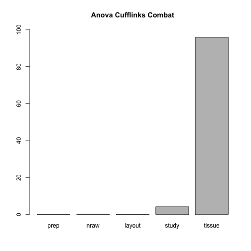 


```r
j <- merge(published.nozero, cufflinks_pc_nozero, by.x=0, by.y="ENSEMBL_ID")
j <- j[,-which(colnames(j)=="Gene_ID"),]
rown <- j[,1]
j <- j[,2:ncol(j)]
rownames(j) <- rown
```

Heatmap and PCA of untransformed.

```r
pheatmap(cor(j))
```

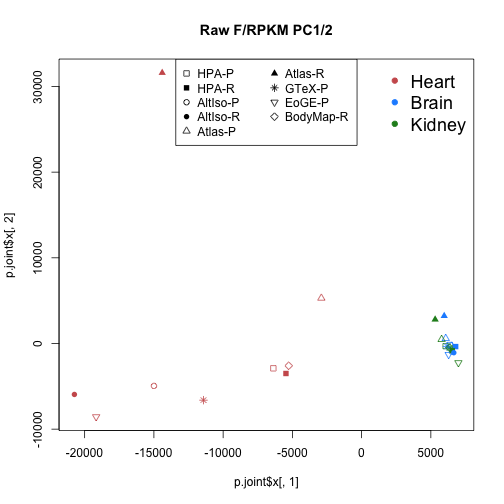 

Here, RNA-seq Atlas forms its own group, whereas the other studies form tissue-specific groups.

PCA:

```r
pdf("Joint_PCA.pdf")
#par(mfrow=c(2,2))

colors <- c("indianred", "dodgerblue", "forestgreen","indianred", "dodgerblue", "indianred", "dodgerblue", "forestgreen","indianred", "dodgerblue", "forestgreen","dodgerblue","indianred","forestgreen","dodgerblue","indianred","forestgreen","dodgerblue","indianred","forestgreen","dodgerblue","indianred","forestgreen","dodgerblue","indianred")
shapes <- c(rep(0,3),rep(1,2),rep(8,3),rep(2,3),rep(6,3),rep(17,3),rep(5,3),rep(15,3),rep(16,2))

p.joint <- prcomp(t(j))
plot(p.joint$x[,1],p.joint$x[,2],col=colors,pch=shapes,main="Raw F/RPKM PC1/2")
#text(p.joint$x[,1],p.joint$x[,2],labels=colnames(j))
legend("topright",legend=c("Heart","Brain","Kidney"),col=c("indianred", "dodgerblue", "forestgreen"),cex=1.5,pch=20,bty="n")
legend("top",legend=c("HPA-P","HPA-R","AltIso-P","AltIso-R", "Atlas-P", "Atlas-R", "GTeX-P","EoGE-P", "BodyMap-R"),col="black",pch=c(0,15,1,16,2,17,8,6,5),ncol=2)
```

After log transformation:

```r
j.log <- log2(j+1)
p.joint.log <- prcomp(t(j.log))
plot(p.joint.log$x[,1],p.joint.log$x[,2],pch=shapes,col=colors,main="log F/RPKM PC1/2")
#text(p.joint.log$x[,1],p.joint.log$x[,2],labels=colnames(j))
legend("bottomright",legend=c("Heart","Brain","Kidney"),col=c("indianred", "dodgerblue", "forestgreen"),cex=1.5,pch=20,bty="n")
legend("bottomleft",legend=c("HPA-P","HPA-R","AltIso-P","AltIso-R", "Atlas-P", "Atlas-R", "GTeX-P","EoGE-P", "BodyMap-R"),col="black",pch=c(0,15,1,16,2,17,8,6,5),ncol=2)
```

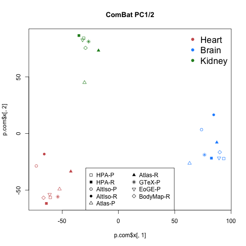 

```r
plot(p.joint.log$x[,2],p.joint.log$x[,3],pch=shapes,col=colors,main="log F/RPKM PC2/3")
#text(p.joint.log$x[,2],p.joint.log$x[,3],labels=colnames(j))
legend("bottomright",legend=c("Heart","Brain","Kidney"),col=c("indianred", "dodgerblue", "forestgreen"),cex=1.5,pch=20,bty="n")
legend("bottomleft",legend=c("HPA-P","HPA-R","AltIso-P","AltIso-R", "Atlas-P", "Atlas-R", "GTeX-P","EoGE-P", "BodyMap-R"),col="black",pch=c(0,15,1,16,2,17,8,6,5),ncol=2)
```

 

ComBat:

```r
meta <- data.frame(study=c(rep("HPA",3),rep("AltIso",2),rep("GTex",3),rep("Atlas",3),rep("EoGE",3),rep("Atlas",3),rep("BodyMap",3),rep("HPA",3),rep("AltIso",2)),tissue=c("Heart","Brain","Kidney","Heart","Brain","Heart","Brain","Kidney","Heart","Brain","Kidney","Brain","Heart","Kidney","Brain","Heart","Kidney","Brain","Heart","Kidney","Brain","Heart","Kidney","Brain","Heart"),quantification=c(rep("other",11),rep("tophatcufflinks",14)))

batch <- meta$study
design <- model.matrix(~1,data=meta)
combat.j <- ComBat(dat=j.log,batch=batch,mod=design,numCovs=NULL,par.prior=TRUE)
```

```
## Found 6 batches
## Found 0  categorical covariate(s)
## Standardizing Data across genes
## Fitting L/S model and finding priors
## Finding parametric adjustments
## Adjusting the Data
```

```r
p.com <- prcomp(t(combat.j))
plot(p.com$x[,1],p.com$x[,2],pch=shapes,col=colors,main="ComBat PC1/2")
#text(p.com$x[,1],p.com$x[,2],labels=colnames(j))
legend("topright",legend=c("Heart","Brain","Kidney"),col=c("indianred", "dodgerblue", "forestgreen"),cex=1.5,pch=20,bty="n")
legend("bottom",legend=c("HPA-P","HPA-R","AltIso-P","AltIso-R", "Atlas-P", "Atlas-R", "GTeX-P","EoGE-P", "BodyMap-R"),col="black",pch=c(0,15,1,16,2,17,8,6,5),ncol=2)
```

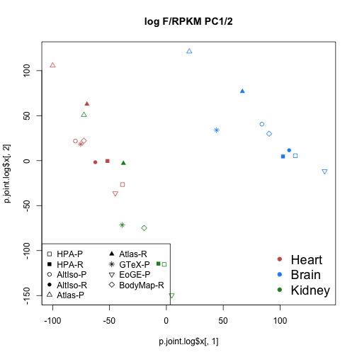 

```r
dev.off()
```

```
## pdf 
##   3
```

Check out Atlas (pre-computed) RPKMs against (pre-computed HPA): (both are logged for clarity)
Try to fit a linear model between the two datasets' logged RPKMs.

```r
pdf("Atlas_vs_HPA_published.pdf")
par(mfrow=c(3,1))
l <- lm(Atlas_heart.x ~ HPA_heart.x,data=j.log)
l
```

```
## 
## Call:
## lm(formula = Atlas_heart.x ~ HPA_heart.x, data = j.log)
## 
## Coefficients:
## (Intercept)  HPA_heart.x  
##     -0.1316       0.6533
```

```r
plot(Atlas_heart.x ~ HPA_heart.x,data=j.log,pch=20,main=paste("Slope",signif(l$coefficients[2],2),sep="="))
yfit <- l$coefficients[1] + l$coefficients[2]*(1:13)
lines(yfit,col="red")
```
The plot and linear model show that the RNA-seq Atlas FPKMs are consistently lower than the ones from HPA (slope=0.65). On a linear scale, the slope is just 0.42! (but with a different intercept)

Look at the other tissues too!

```r
l <- lm(Atlas_brain.x ~ HPA_brain.x,data=j.log)
plot(Atlas_brain.x ~ HPA_brain.x,data=j.log,pch=20,main=paste("Slope",signif(l$coefficients[2],2),sep="="))
yfit <- l$coefficients[1] + l$coefficients[2]*(1:13)
lines(yfit,col="red")
```

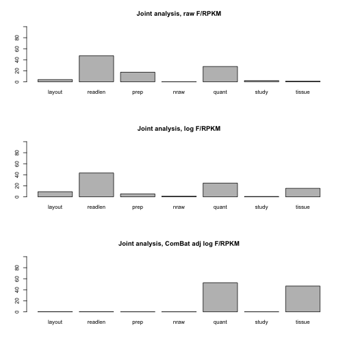 

```r
l <- lm(Atlas_kidney.x ~ HPA_kidney.x,data=j.log)

plot(Atlas_kidney.x ~ HPA_kidney.x,data=j.log,pch=20,main=paste("Slope",signif(l$coefficients[2],2),sep="="))
yfit <- l$coefficients[1] + l$coefficients[2]*(1:13)
lines(yfit,col="red")
```

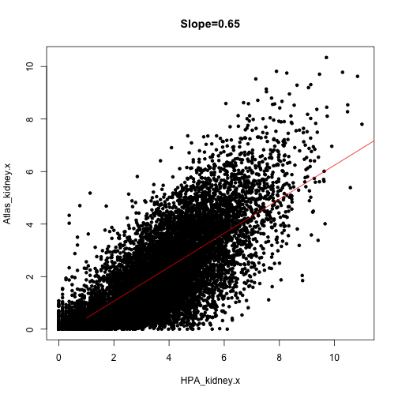 

```r
dev.off()
```

```
## pdf 
##   3
```

Instead look at AltIso vs HPA.

```r
par(mfrow=c(2,1))
l <- lm(AltIso_heart.x ~ HPA_heart.x,data=j.log)
plot(AltIso_heart.x ~ HPA_heart.x,data=j.log,col=densCols(j.log$HPA_heart.x,j.log$AltIso_heart.x),pch=20,main=paste("Slope",signif(l$coefficients[2],2),sep="="))
yfit <- l$coefficients[1] + l$coefficients[2]*(1:13)
lines(yfit,col="red")
l <- lm(AltIso_brain.x ~ HPA_brain.x,data=j.log)
plot(AltIso_brain.x ~ HPA_brain.x,data=j.log,col=densCols(j.log$HPA_brain.x,j.log$AltIso_brain.x),pch=20,main=paste("Slope",signif(l$coefficients[2],2),sep="="))
yfit <- l$coefficients[1] + l$coefficients[2]*(1:13)
lines(yfit,col="red")
```

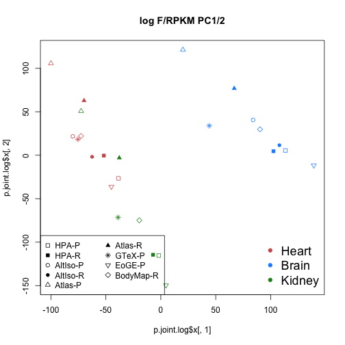 
Look at RNA-seq Atlas, published vs reprocessed:

```r
pdf("Atlas_published_vs_reprocessed.pdf")
par(mfrow=c(3,1))
l <- lm(Atlas_heart.x ~ Atlas_heart.y,data=j.log)
plot(Atlas_heart.x ~ Atlas_heart.y,data=j.log,col=densCols(j.log$Atlas_heart.y,j.log$Atlas_heart.x),pch=20,main=paste("Slope",signif(l$coefficients[2],2),sep="="))
yfit <- l$coefficients[1] + l$coefficients[2]*(1:13)
lines(yfit,col="red")
#
l <- lm(Atlas_brain.x ~ Atlas_brain.y,data=j.log)
plot(Atlas_brain.x ~ Atlas_brain.y,data=j.log,col=densCols(j.log$Atlas_brain.y,j.log$Atlas_brain.x),pch=20,main=paste("Slope",signif(l$coefficients[2],2),sep="="))
yfit <- l$coefficients[1] + l$coefficients[2]*(1:13)
lines(yfit,col="red")
#
l <- lm(Atlas_kidney.x ~ Atlas_kidney.y,data=j.log)
plot(Atlas_kidney.x ~ Atlas_kidney.y,data=j.log,col=densCols(j.log$Atlas_kidney.y,j.log$Atlas_kidney.x),pch=20,main=paste("Slope",signif(l$coefficients[2],2),sep="="))
yfit <- l$coefficients[1] + l$coefficients[2]*(1:13)
lines(yfit,col="red")
dev.off()
```

```
## pdf 
##   2
```

Correlations between studies (per tissue)

```r
heart.p <- j[,c(1,4,6,9)]
pheatmap(cor(log2(1+heart.p)))
```

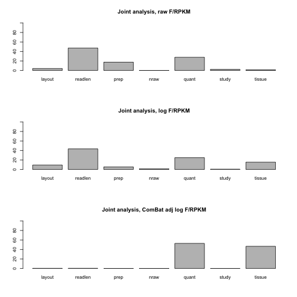 

```r
heart.r <- j[,c(16,19,22,25)]
pheatmap(cor(log2(1+heart.r)))
```

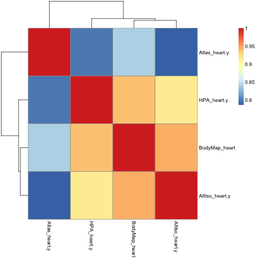 

```r
heart.all <- cbind(heart.p, heart.r)
```

ANOVAs including quantification method

```r
pdf("Joint_ANOVAs.pdf")
par(mfrow=c(3,1))
sampleinfo_cufflinks$quantification <- "topcuff"
sampleinfo_published$quantification <- "other"
studylabels_cuff <- c("EoGE_brain","EoEG_heart","EoEG_kidney","Atlas_brain","Atlas_heart","Atlas_kidney","BodyMap_brain","BodyMap_heart","BodyMap_kidney","HPA_brain","HPA_heart","HPA_kidney","AltIso_brain","AltIso_heart")
sampleinfo_reprocessed <- data.frame(Study_labels=studylabels_cuff, sampleinfo_cufflinks)
sampleinfo <- rbind(sampleinfo_published, sampleinfo_reprocessed)
meta <- sampleinfo[,c("Study","Tissue","Preparation","NumberRaw","Numbermapped","Readtype","quantification","readlength")]
rownames(meta) <- colnames(j)
tissue <- rep(meta$Tissue, each=nrow(j))
study <- rep(meta$Study, each=nrow(j))
prep <- rep(meta$Preparation, each=nrow(j))
layout <- rep(meta$Readtype, each=nrow(j))
raw <- rep(meta$NumberRaw, each=nrow(j))
mapped <- rep(meta$Numbermapped, each=nrow(j))
quantification <- rep(meta$quantification, each=nrow(j))
readlen <- rep(meta$readlength, each=nrow(j))
o <- melt(j)
```

```
## Using  as id variables
```

```r
colnames(o) <- c("sample_ID","RawRPKM")
data <- data.frame(o, tissue=tissue, study=study, prep=prep, layout=layout,nraw=raw,nmapped=mapped,quant=quantification,readlen=readlen)

#fit <- lm(RawRPKM ~ layout + prep + nraw + study + tissue + quant, data=data)
fit <- lm(RawRPKM ~ layout + readlen + prep + nraw + quant + study + tissue, data=data)
a <- anova(fit)
maxval = 100
barplot(100*a$"Sum Sq"[1:7]/sum(a$"Sum Sq"[1:7]),names.arg=rownames(a[1:7,]),main="Anova raw",ylim=c(0,maxval))

o <- melt(j.log)
```

```
## Using  as id variables
```

```r
colnames(o) <- c("sample_ID","logRPKM")
data <- data.frame(o, tissue=tissue, study=study, prep=prep, layout=layout,nraw=raw,nmapped=mapped,quant=quantification, readlen=readlen)

fit <- lm(logRPKM ~  layout + readlen + prep + nraw + quant + study + tissue, data=data)
b <- anova(fit)
maxval = 100
barplot(100*b$"Sum Sq"[1:7]/sum(b$"Sum Sq"[1:7]),names.arg=rownames(b[1:7,]),main="Anova log",ylim=c(0,maxval))

o <- melt(combat.j)
```

```
## Using  as id variables
```

```r
colnames(o) <- c("sample_ID","combat")
data <- data.frame(o, tissue=tissue, study=study, prep=prep, layout=layout,nraw=raw,nmapped=mapped,quant=quantification,readlen=readlen)

fit <- lm(combat ~ layout + readlen + prep + nraw + quant + study + tissue, data=data)
c <- anova(fit)
maxval = 100
barplot(100*c$"Sum Sq"[1:7]/sum(c$"Sum Sq"[1:7]),names.arg=rownames(c[1:7,]),main="Anova ComBat",ylim=c(0,maxval))
dev.off()
```

```
## pdf 
##   2
```

Try SVA to assess importance of different factors.

```r
library(sva)
mod <- model.matrix(~as.factor(Tissue), data=sampleinfo)
mod0 <- model.matrix(~1, data=sampleinfo)
n.sv <- num.sv(j.log,mod,method="leek")
svobj <- sva(as.matrix(j.log),mod,mod0,n.sv=n.sv)
```

```
## Number of significant surrogate variables is:  2 
## Iteration (out of 5 ):1  2  3  4  5
```

```r
surr <- svobj$sv
heatmap(surr,scale="none",labRow=colnames(j), Rowv=NA, Colv=NA)
```

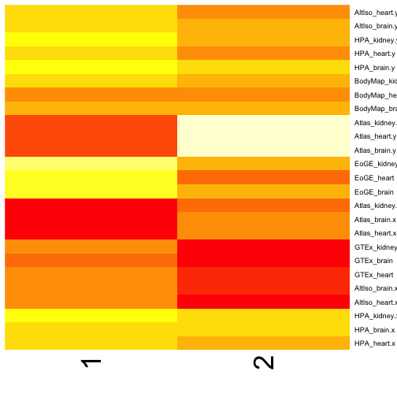 

What is in the first surrogate variable?

```r
cor.test(surr[,1], as.numeric(sampleinfo$Preparation)) # 2e-7
```

```
## 
## 	Pearson's product-moment correlation
## 
## data:  surr[, 1] and as.numeric(sampleinfo$Preparation)
## t = -7.2348, df = 23, p-value = 2.301e-07
## alternative hypothesis: true correlation is not equal to 0
## 95 percent confidence interval:
##  -0.9242416 -0.6536458
## sample estimates:
##        cor 
## -0.8335031
```

```r
cor.test(surr[,1], as.numeric(sampleinfo$Study)) # NS
```

```
## 
## 	Pearson's product-moment correlation
## 
## data:  surr[, 1] and as.numeric(sampleinfo$Study)
## t = 0.3488, df = 23, p-value = 0.7304
## alternative hypothesis: true correlation is not equal to 0
## 95 percent confidence interval:
##  -0.3321140  0.4546362
## sample estimates:
##        cor 
## 0.07253569
```

```r
cor.test(surr[,1], as.numeric(sampleinfo$NumberRaw)) # NS
```

```
## 
## 	Pearson's product-moment correlation
## 
## data:  surr[, 1] and as.numeric(sampleinfo$NumberRaw)
## t = -0.5112, df = 23, p-value = 0.6141
## alternative hypothesis: true correlation is not equal to 0
## 95 percent confidence interval:
##  -0.4809776  0.3017794
## sample estimates:
##      cor 
## -0.10599
```

```r
cor.test(surr[,1], as.numeric(sampleinfo$Readtype)) # NS
```

```
## 
## 	Pearson's product-moment correlation
## 
## data:  surr[, 1] and as.numeric(sampleinfo$Readtype)
## t = -1.6279, df = 23, p-value = 0.1172
## alternative hypothesis: true correlation is not equal to 0
## 95 percent confidence interval:
##  -0.63580713  0.08442599
## sample estimates:
##        cor 
## -0.3214275
```

```r
cor.test(surr[,1], as.numeric(sampleinfo$readlength)) # 0.017
```

```
## 
## 	Pearson's product-moment correlation
## 
## data:  surr[, 1] and as.numeric(sampleinfo$readlength)
## t = 2.5712, df = 23, p-value = 0.01707
## alternative hypothesis: true correlation is not equal to 0
## 95 percent confidence interval:
##  0.09514833 0.73113822
## sample estimates:
##       cor 
## 0.4725145
```

```r
sampleinfo$quant_numeric <- c(rep(0,11),rep(1,14))
cor.test(surr[,1], as.numeric(sampleinfo$quant_numeric)) # 0.033
```

```
## 
## 	Pearson's product-moment correlation
## 
## data:  surr[, 1] and as.numeric(sampleinfo$quant_numeric)
## t = 2.2687, df = 23, p-value = 0.03298
## alternative hypothesis: true correlation is not equal to 0
## 95 percent confidence interval:
##  0.03910152 0.70383139
## sample estimates:
##       cor 
## 0.4276255
```
Mostly the prep (=Atlas vs others).

The second surrogate variable:

```r
cor.test(surr[,2], as.numeric(sampleinfo$Preparation)) # 0.014
```

```
## 
## 	Pearson's product-moment correlation
## 
## data:  surr[, 2] and as.numeric(sampleinfo$Preparation)
## t = 2.6492, df = 23, p-value = 0.01434
## alternative hypothesis: true correlation is not equal to 0
## 95 percent confidence interval:
##  0.1092694 0.7377112
## sample estimates:
##       cor 
## 0.4835238
```

```r
cor.test(surr[,2], as.numeric(sampleinfo$Study)) # 0.03
```

```
## 
## 	Pearson's product-moment correlation
## 
## data:  surr[, 2] and as.numeric(sampleinfo$Study)
## t = 2.3286, df = 23, p-value = 0.02903
## alternative hypothesis: true correlation is not equal to 0
## 95 percent confidence interval:
##  0.05034521 0.70947167
## sample estimates:
##       cor 
## 0.4367871
```

```r
cor.test(surr[,2], as.numeric(sampleinfo$NumberRaw)) # 0.02
```

```
## 
## 	Pearson's product-moment correlation
## 
## data:  surr[, 2] and as.numeric(sampleinfo$NumberRaw)
## t = -2.5029, df = 23, p-value = 0.01987
## alternative hypothesis: true correlation is not equal to 0
## 95 percent confidence interval:
##  -0.72521742 -0.08264373
## sample estimates:
##        cor 
## -0.4626662
```

```r
cor.test(surr[,2], as.numeric(sampleinfo$Readtype)) # NS
```

```
## 
## 	Pearson's product-moment correlation
## 
## data:  surr[, 2] and as.numeric(sampleinfo$Readtype)
## t = 0.8568, df = 23, p-value = 0.4004
## alternative hypothesis: true correlation is not equal to 0
## 95 percent confidence interval:
##  -0.2356428  0.5338939
## sample estimates:
##       cor 
## 0.1758626
```

```r
cor.test(surr[,2], as.numeric(sampleinfo$readlength)) # NS
```

```
## 
## 	Pearson's product-moment correlation
## 
## data:  surr[, 2] and as.numeric(sampleinfo$readlength)
## t = -0.4349, df = 23, p-value = 0.6677
## alternative hypothesis: true correlation is not equal to 0
## 95 percent confidence interval:
##  -0.4687162  0.3160995
## sample estimates:
##         cor 
## -0.09031139
```

```r
sampleinfo$quant_numeric <- c(rep(0,11),rep(1,14))
cor.test(surr[,2], as.numeric(sampleinfo$quant_numeric)) # 0.003
```

```
## 
## 	Pearson's product-moment correlation
## 
## data:  surr[, 2] and as.numeric(sampleinfo$quant_numeric)
## t = 3.3336, df = 23, p-value = 0.002887
## alternative hypothesis: true correlation is not equal to 0
## 95 percent confidence interval:
##  0.2267650 0.7881419
## sample estimates:
##       cor 
## 0.5707552
```

A little bit of everything, though quantification seems to be the strongest.

Correlations between PCs and experimental factors.

```r
print_PCA_corrs <- function(data,sampleinfo){
pca <- prcomp(t(data[,]))

rot <- pca$r
x <- pca$x

pc1 <- rep(1,7)
names(pc1) <- c("Raw reads","Mapped reads", "Tissue", "Library prep", "Study", "Read type", "Read length")
pc2 <- rep(1,7)
names(pc2) <- names(pc1)

# Test correlations between number of seq'd reads and PCs 1-4 from prcomp
pval.nraw.pc1 <- cor.test(x[,1], sampleinfo$NumberRaw,method="spearman")$p.value
pval.nraw.pc2 <- cor.test(x[,2], sampleinfo$NumberRaw,method="spearman")$p.value
pval.nraw.pc3 <- cor.test(x[,3], sampleinfo$NumberRaw,method="spearman")$p.value
pval.nraw.pc4 <- cor.test(x[,4], sampleinfo$NumberRaw,method="spearman")$p.value

cat(sprintf("Number_of_rawreads~PCAs: PCA1=\"%f\"PCA2=\"%f\"PCA3=\"%f\"PCA4=\"%f\n", pval.nraw.pc1,pval.nraw.pc2,pval.nraw.pc3,pval.nraw.pc4))

pc1[1] <- pval.nraw.pc1
pc2[1] <- pval.nraw.pc2

pval.nmapped.pc1 <- cor.test(x[,1], sampleinfo$Numbermapped,method="spearman")$p.value
pval.nmapped.pc2 <- cor.test(x[,2], sampleinfo$Numbermapped,method="spearman")$p.value
pval.nmapped.pc3 <- cor.test(x[,3], sampleinfo$Numbermapped,method="spearman")$p.value
pval.nmapped.pc4 <- cor.test(x[,4], sampleinfo$Numbermapped,method="spearman")$p.value

cat(sprintf("Number_of_mappedreads~PCAs: PCA1=\"%f\"PCA2=\"%f\"PCA3=\"%f\"PCA4=\"%f\n", pval.nmapped.pc1,pval.nmapped.pc2,pval.nmapped.pc3,pval.nmapped.pc4))

pc1[2] <- pval.nmapped.pc1
pc2[2] <- pval.nmapped.pc2

# For tissue, use kruskal.test which handles ordinal variables 
pval.tissue.pc1<-kruskal.test(x[,1], sampleinfo$Tissue)$p.value
pval.tissue.pc2<-kruskal.test(x[,2], sampleinfo$Tissue)$p.value
pval.tissue.pc3<-kruskal.test(x[,3], sampleinfo$Tissue)$p.value
pval.tissue.pc4<-kruskal.test(x[,4], sampleinfo$Tissue)$p.value

cat(sprintf("Tissues~PCAs: PCA1=\"%f\"PCA2=\"%f\"PCA3=\"%f\"\n", pval.tissue.pc1,pval.tissue.pc2,pval.tissue.pc3,pval.tissue.pc4))

pc1[3] <- pval.tissue.pc1
pc2[3] <- pval.tissue.pc2

# Library prep 
pval.prep.pc1<-kruskal.test(x[,1], sampleinfo$Preparation)$p.value
pval.prep.pc2<-kruskal.test(x[,2], sampleinfo$Preparation)$p.value
pval.prep.pc3<-kruskal.test(x[,3], sampleinfo$Preparation)$p.value
pval.prep.pc4<-kruskal.test(x[,4], sampleinfo$Preparation)$p.value

cat(sprintf("LibPrep~PCAs: PCA1=\"%f\"PCA2=\"%f\"PCA3=\"%f\"\n", pval.prep.pc1,pval.prep.pc2,pval.prep.pc3,pval.prep.pc4))

pc1[4] <- pval.prep.pc1
pc2[4] <- pval.prep.pc2

# Study  
pval.study.pc1<-kruskal.test(x[,1], sampleinfo$Study)$p.value
pval.study.pc2<-kruskal.test(x[,2], sampleinfo$Study)$p.value
pval.study.pc3<-kruskal.test(x[,3], sampleinfo$Study)$p.value
pval.study.pc4<-kruskal.test(x[,4], sampleinfo$Study)$p.value

cat(sprintf("Study~PCAs: PCA1=\"%f\"PCA2=\"%f\"PCA3=\"%f\"\n", pval.study.pc1,pval.study.pc2,pval.study.pc3,pval.study.pc4))

pc1[5] <- pval.study.pc1
pc2[5] <- pval.study.pc2

# Layout
pval.layout.pc1<-kruskal.test(x[,1], sampleinfo$Readtype)$p.value
pval.layout.pc2<-kruskal.test(x[,2], sampleinfo$Readtype)$p.value
pval.layout.pc3<-kruskal.test(x[,3], sampleinfo$Readtype)$p.value
pval.layout.pc4<-kruskal.test(x[,4], sampleinfo$Readtype)$p.value

pc1[6] <- pval.layout.pc1
pc2[6] <- pval.layout.pc2

# Read length
pval.readlength.pc1<-kruskal.test(x[,1], sampleinfo$readlength)$p.value
pval.readlength.pc2<-kruskal.test(x[,2], sampleinfo$readlength)$p.value
pval.readlength.pc3<-kruskal.test(x[,3], sampleinfo$readlength)$p.value
pval.readlength.pc4<-kruskal.test(x[,4], sampleinfo$readlength)$p.value

cat(sprintf("ReadType~PCAs: PCA1=\"%f\"PCA2=\"%f\"PCA3=\"%f\"\n", pval.layout.pc1,pval.layout.pc2,pval.layout.pc3,pval.layout.pc4))

pc1[7] <- pval.readlength.pc1
pc2[7] <- pval.readlength.pc2

# Quantification
#pval.layout.pc1<-kruskal.test(x[,1], sampleinfo$quantification=="other")$p.value
#pval.layout.pc2<-kruskal.test(x[,2], sampleinfo$quantification=="other")$p.value
#pval.layout.pc3<-kruskal.test(x[,3], sampleinfo$quantification=="other")$p.value
#pval.layout.pc4<-kruskal.test(x[,4], sampleinfo$quantification=="other")$p.value

cat(sprintf("QuantificationMethod~PCAs: PCA1=\"%f\"PCA2=\"%f\"PCA3=\"%f\"\n", pval.layout.pc1,pval.layout.pc2,pval.layout.pc3,pval.layout.pc4))

par(mfrow=c(2,1))
barplot(-log(pc1),las=2)
barplot(-log(pc2),las=2)
}
```

Try for raw RPKM, logged RPKM and ComBat adjusted RPKM:

```r
print_PCA_corrs(published,sampleinfo_published)
```

```
## Number_of_rawreads~PCAs: PCA1="0.248381"PCA2="0.402136"PCA3="0.693511"PCA4="0.129162
## Number_of_mappedreads~PCAs: PCA1="0.451197"PCA2="0.485476"PCA3="0.503067"PCA4="0.037001
## Tissues~PCAs: PCA1="0.027159"PCA2="0.618127"PCA3="0.374913"
## LibPrep~PCAs: PCA1="0.414216"PCA2="0.041227"PCA3="1.000000"
## Study~PCAs: PCA1="0.535538"PCA2="0.048584"PCA3="0.168499"
## ReadType~PCAs: PCA1="0.715001"PCA2="0.465209"PCA3="0.100348"
## QuantificationMethod~PCAs: PCA1="0.715001"PCA2="0.465209"PCA3="0.100348"
```

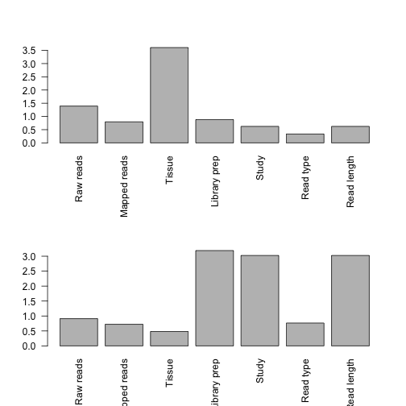 

```r
print_PCA_corrs(published.log,sampleinfo_published)
```

```
## Number_of_rawreads~PCAs: PCA1="0.418167"PCA2="0.614426"PCA3="0.902918"PCA4="0.213864
## Number_of_mappedreads~PCAs: PCA1="0.172787"PCA2="0.902918"PCA3="0.967576"PCA4="0.182532
## Tissues~PCAs: PCA1="0.618127"PCA2="0.019757"PCA3="0.021968"
## LibPrep~PCAs: PCA1="0.014306"PCA2="0.220671"PCA3="0.220671"
## Study~PCAs: PCA1="0.033146"PCA2="0.594709"PCA3="0.294275"
## ReadType~PCAs: PCA1="0.028460"PCA2="0.201243"PCA3="0.855132"
## QuantificationMethod~PCAs: PCA1="0.028460"PCA2="0.201243"PCA3="0.855132"
```

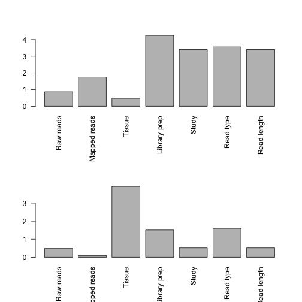 

```r
print_PCA_corrs(combat,sampleinfo_published)
```

```
## Number_of_rawreads~PCAs: PCA1="0.313026"PCA2="0.796592"PCA3="0.881472"PCA4="0.945984
## Number_of_mappedreads~PCAs: PCA1="0.576258"PCA2="0.860104"PCA3="0.633870"PCA4="0.945984
## Tissues~PCAs: PCA1="0.011626"PCA2="0.021968"PCA3="0.977529"
## LibPrep~PCAs: PCA1="0.683091"PCA2="0.838256"PCA3="0.683091"
## Study~PCAs: PCA1="0.947648"PCA2="0.895044"PCA3="0.970466"
## ReadType~PCAs: PCA1="1.000000"PCA2="0.855132"PCA3="0.715001"
## QuantificationMethod~PCAs: PCA1="1.000000"PCA2="0.855132"PCA3="0.715001"
```

 

```r
print_PCA_corrs(cufflinks_fpkms,sampleinfo_reprocessed)
```

```
## Number_of_rawreads~PCAs: PCA1="0.542316"PCA2="0.615812"PCA3="0.252961"PCA4="0.659506
## Number_of_mappedreads~PCAs: PCA1="0.583826"PCA2="0.382464"PCA3="0.552566"PCA4="0.273494
## Tissues~PCAs: PCA1="0.824600"PCA2="0.012962"PCA3="0.945809"
## LibPrep~PCAs: PCA1="0.015807"PCA2="0.242908"PCA3="0.139101"
## Study~PCAs: PCA1="0.031955"PCA2="0.749770"PCA3="0.045886"
## ReadType~PCAs: PCA1="0.245278"PCA2="0.897279"PCA3="0.009823"
## QuantificationMethod~PCAs: PCA1="0.245278"PCA2="0.897279"PCA3="0.009823"
```

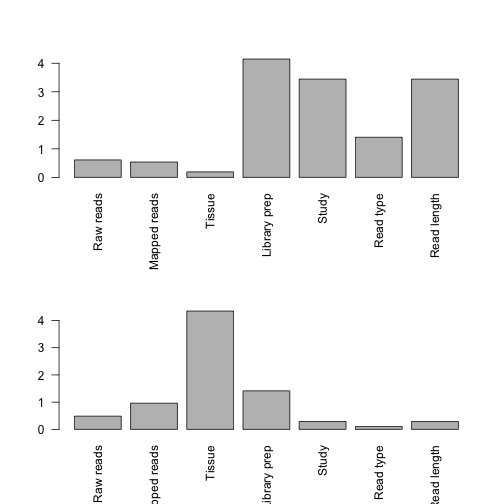 

```r
print_PCA_corrs(cufflinks_log,sampleinfo_reprocessed)
```

```
## Number_of_rawreads~PCAs: PCA1="0.648476"PCA2="0.252961"PCA3="0.773199"PCA4="0.295027
## Number_of_mappedreads~PCAs: PCA1="0.573323"PCA2="0.087184"PCA3="0.435614"PCA4="0.214891
## Tissues~PCAs: PCA1="0.003071"PCA2="0.138662"PCA3="0.017724"
## LibPrep~PCAs: PCA1="0.585788"PCA2="0.015807"PCA3="0.035558"
## Study~PCAs: PCA1="0.896532"PCA2="0.096954"PCA3="0.223881"
## ReadType~PCAs: PCA1="0.796253"PCA2="0.796253"PCA3="1.000000"
## QuantificationMethod~PCAs: PCA1="0.796253"PCA2="0.796253"PCA3="1.000000"
```

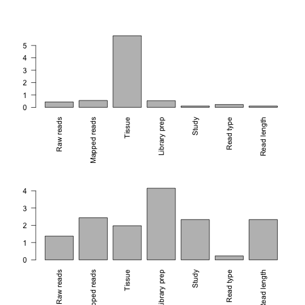 

```r
print_PCA_corrs(combat.cufflinks,sampleinfo_reprocessed)
```

```
## Number_of_rawreads~PCAs: PCA1="0.692996"PCA2="0.391062"PCA3="0.325291"PCA4="0.927566
## Number_of_mappedreads~PCAs: PCA1="0.583826"PCA2="0.492398"PCA3="0.233428"PCA4="0.963749
## Tissues~PCAs: PCA1="0.003071"PCA2="0.003071"PCA3="0.990050"
## LibPrep~PCAs: PCA1="0.815335"PCA2="0.937947"PCA3="0.585788"
## Study~PCAs: PCA1="0.968205"PCA2="0.999600"PCA3="0.959836"
## ReadType~PCAs: PCA1="0.796253"PCA2="0.897279"PCA3="0.698535"
## QuantificationMethod~PCAs: PCA1="0.796253"PCA2="0.897279"PCA3="0.698535"
```

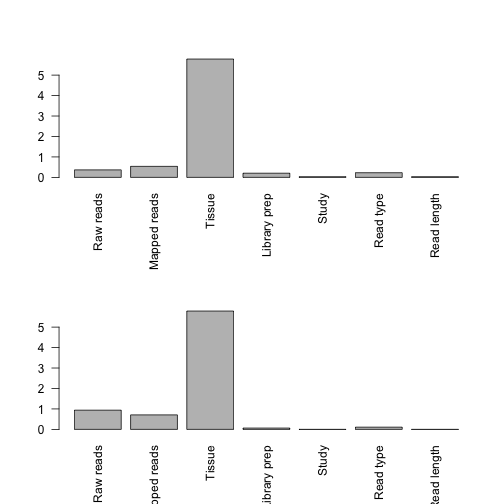 

```r
#print_PCA_corrs(j)
#print_PCA_corrs(j.log)
#print_PCA_corrs(combat.j)
```

