Walkthrough with all data analyses that comes with the manuscript
Comparing published, reprocessed FPKMs and reprocessed counts
========================================================

Prepare by loading packages etc.

```r
library(pheatmap)
library(reshape)
library(gplots)
```

```
## KernSmooth 2.23 loaded
## Copyright M. P. Wand 1997-2009
## 
## Attaching package: 'gplots'
## 
## The following object is masked from 'package:stats':
## 
##     lowess
```

```r
library(ops)
```

```
## 
## Attaching package: 'ops'
## 
## The following object is masked from 'package:stats':
## 
##     filter
```

```r
library(calibrate)
```

```
## Loading required package: MASS
```

```r
library(biomaRt)
library(sva)
```

```
## Loading required package: corpcor
## Loading required package: mgcv
## Loading required package: nlme
## This is mgcv 1.7-29. For overview type 'help("mgcv-package")'.
```

Data from four different public sources are downloaded and brain, heart and kidney samples are extracted. 

Start with Human Protein Atlas (HPA):


```r
#temp <- tempfile()
#download.file(url="http://www.proteinatlas.org/download/rna.csv.zip",destfile=temp)
#hpa <- read.csv(unz(temp, "rna.csv"))
#unlink(temp)

#hpa.heart <- hpa[hpa$Sample=="heart muscle", c("Gene", "Value")]
#hpa.brain <- hpa[hpa$Sample=="cerebral cortex", c("Gene", "Value")]
#hpa.kidney <- hpa[hpa$Sample=="kidney", c("Gene", "Value")]

#hpa.fpkms <- merge(hpa.heart, hpa.brain, by="Gene")
#hpa.fpkms <- merge(hpa.fpkms, hpa.kidney, by="Gene")
#colnames(hpa.fpkms) <- c("ENSG_ID", "HPA_heart", "HPA_brain", "HPA_kidney")
```

Check if the identifiers are unique and write table to file.


```r
#length(hpa.fpkms[,1])
#length(unique(hpa.fpkms[,1]))

#write.table(hpa.fpkms,file="hpa_fpkms.txt",quote=F,sep="\t")
```

Next dataset is from the article "Alternative isoform regulation in human tissue transcriptomes.." by Wang et.al
AltIso:


```r
#temp <- tempfile()
#download.file(url="http://genes.mit.edu/burgelab/Supplementary/wang_sandberg08/hg18.ensGene.CEs.rpkm.txt",destfile=temp)
#altiso <- read.delim(temp, sep="\t")
#unlink(temp)
```

There is no kidney sample here, so just use heart + brain


```r
#altiso.fpkms <- altiso[,c("X.Gene","heart","brain")]
#colnames(altiso.fpkms) <- c("ENSG_ID", "AltIso_heart", "AltIso_brain")
```

Check uniqueness of IDs.


```r
#length(altiso.fpkms[,1])
#length(unique(altiso.fpkms[,1]))

#write.table(altiso.fpkms,file="altiso_fpkms.txt",quote=F,sep="\t")
```

Next dataset is derived from "GTEx": Genotype-Tissue Expression

This is a big download: 337.8 Mb (as of 2014-02-04)
We also add some code to randomly select one sample from each tissue type; there are many biological replicates in this data set.


```r
#temp <- tempfile()
#download.file(url="http://www.gtexportal.org/home/rest/file/download?portalFileId=175729&forDownload=true",destfile=temp)
#header_lines <- readLines(temp, n=2)
#gtex <- read.delim(temp, skip=2, sep="\t")
#unlink(temp)

#write.table(gtex, file="gtex_all.txt",   quote=F, sep="\t")

#download.file(url="http://www.gtexportal.org/home/rest/file/download?portalFileId=175707&forDownload=true",destfile="GTEx_description.txt")

#metadata <- read.delim("GTEx_description.txt", sep="\t")
```

The metadata table seems to contain entries that are not in the RPKM table.


```r
#samp.id <- gsub('-','.',metadata$SAMPID)
#eligible.samples <- which(samp.id %in% colnames(gtex))
#metadata <- metadata[eligible.samples,]
```

Select random heart, kidney and brain samples.


```r
#random.heart <- sample(which(metadata$SMTS=="Heart"), size=1)
#random.heart.samplename <- gsub('-','.',metadata[random.heart, "SAMPID"])
#gtex.heart.fpkm <- as.numeric(gtex[,random.heart.samplename])

#random.brain <- sample(which(metadata$SMTS=="Brain"), size=1)
#random.brain.samplename <- gsub('-','.',metadata[random.brain, "SAMPID"])
#gtex.brain.fpkm <- as.numeric(gtex[,random.brain.samplename])

#random.kidney <- sample(which(metadata$SMTS=="Kidney"), size=1)
#random.kidney.samplename <- gsub('-','.',metadata[random.kidney, "SAMPID"])
#gtex.kidney.fpkm <- as.numeric(gtex[,random.kidney.samplename])
```

Get gene IDs on same format as the other data sets by removing the part after the dot; check ID uniqueness and write to file.


```r
#gtex.names <- gtex[,"Name"]
#temp_list <- strsplit(as.character(gtex.names), split="\\.")
#gtex.names.nodot <- unlist(temp_list)[2*(1:length(gtex.names))-1]

#gtex.fpkms <- data.frame(ENSG_ID=gtex.names.nodot, GTEx_heart=gtex.heart.fpkm, GTEx_brain=gtex.brain.fpkm,GTEx_kidney=gtex.kidney.fpkm)

#length(gtex.fpkms[,1])
#length(unique(gtex.fpkms[,1]))

#write.table(gtex.fpkms,file="gtex_fpkms.txt",quote=F,sep="\t")
```

*RNA-seq Atlas*


```r
#temp <- tempfile()
#download.file(url="http://medicalgenomics.org/rna_seq_atlas/download?download_revision1=1",destfile=temp)
#atlas <- read.delim(temp, sep="\t")
#unlink(temp)

#atlas.fpkms <- atlas[,c("ensembl_gene_id","heart","hypothalamus","kidney")]
#colnames(atlas.fpkms) <- c("ENSG_ID","Atlas_heart","Atlas_brain","Atlas_kidney")
#write.table(atlas.fpkms,file="atlas_fpkms.txt",quote=F,sep="\t")
```

Combining F/RPKM values from public data sets
---------------------------------------------

We will join the data sets on ENSEMBL ID:s, losing a lot of data in the process - but joining on gene symbols or something else would lead to an even worse loss. 


```r
library(org.Hs.eg.db) # for transferring gene identifiers
```

```
## Error: there is no package called 'org.Hs.eg.db'
```

```r
library(data.table) # for collapsing transcript RPKMs
```

```
## Error: there is no package called 'data.table'
```

```r
library(pheatmap) # for nicer visualization
library(edgeR) # for TMM normalization
```

```
## Loading required package: limma
```

```r
#hpa.fpkms <- read.delim("hpa_fpkms.txt")
#altiso.fpkms <- read.delim("altiso_fpkms.txt")
#gtex.fpkms <- read.delim("gtex_fpkms.txt")
#atlas.fpkms <- read.delim("atlas_fpkms.txt")
```

The RNA-seq Atlas data set uses many different identifiers, while the other all use ENSG as the primary identifier

Approach 1: Merge on ENSEMBL genes (ENSG) as given in RNA-seq Atlas. Note that there are repeated ENSG ID:s in RNA-seq Atlas, as opposed to the other data sets, so we need to do something about that. In this case, we just sum the transcripts that belong to each ENSG gene. We use data.table for this.


```r
#data.dt <- data.table(atlas.fpkms)
#setkey(data.dt, ENSG_ID)
#temp <- data.dt[, lapply(.SD, sum), by=ENSG_ID]
#collapsed <- as.data.frame(temp)
#atlas.fpkms.summed <- collapsed[,2:ncol(collapsed)] 
#rownames(atlas.fpkms.summed) <- collapsed[,1]

#atlas.fpkms.summed <- atlas.fpkms.summed[2:nrow(atlas.fpkms.summed),]
```

Finally, combine all the data sets into a data frame.


```r
#fpkms <- merge(hpa.fpkms, altiso.fpkms, by="ENSG_ID")
#fpkms <- merge(fpkms, gtex.fpkms, by="ENSG_ID")
#fpkms <- merge(fpkms, atlas.fpkms.summed, by.x="ENSG_ID", by.y=0)
#gene_id <- fpkms[,1]
#f <- fpkms[,2:ncol(fpkms)]
#rownames(f) <- gene_id
```

Check how many ENSG IDs we have left.


```r
#dim(f)
```

Approach 2: Try to map Entrez symbols to ENSEMBL to recover more ENSG IDs than already present in the table. 


```r
#m <- org.Hs.egENSEMBL
#mapped_genes <- mappedkeys(m)
#ensg.for.entrez <- as.list(m[mapped_genes])
#remapped.ensg <- ensg.for.entrez[as.character(atlas$entrez_gene_id)]

#atlas.fpkms$remapped_ensg <- as.character(remapped.ensg)

# And add expression values
#data.dt <- data.table(atlas.fpkms[,2:ncol(atlas.fpkms)])
#setkey(data.dt, remapped_ensg)
#temp <- data.dt[, lapply(.SD, sum), by=remapped_ensg]
#collapsed <- as.data.frame(temp)
#atlas.fpkms.summed <- collapsed[,2:ncol(collapsed)] 
#rownames(atlas.fpkms.summed) <- collapsed[,1]
```

Combine data sets again


```r
#fpkms <- merge(hpa.fpkms, altiso.fpkms, by="ENSG_ID")
#fpkms <- merge(fpkms, gtex.fpkms, by="ENSG_ID")
#fpkms <- merge(fpkms, atlas.fpkms.summed, by.x="ENSG_ID", by.y=0)
#gene_id <- fpkms[,1]
#f <- fpkms[,2:ncol(fpkms)]
#rownames(f) <- gene_id
#write.table(f, file = 'published_rpkms.txt', quote=F)

#instead of downloading everytime:

published <- read.delim("published_rpkms.txt",sep=" ")
sampleinfo_published <- read.table("sample_info_published.txt",header=TRUE)
dim(published)
```

```
## [1] 13537    11
```

The published FPKM values are first filtered by removing all lines where FPKM is less or equal to 0.01 in all samples


```r
published.nozero <- published[-which(rowSums(published[,])<=0.01),]
```

Heatmap of Spearman correlations between published expression profiles (# genes = 13,323)


```r
pheatmap(cor(published.nozero, method="spearman")) 
```

 

The brain samples are in a separate cluster, whereas the heart and kidney ones are intermixed.

Alternatively, one could use Pearson correlation:


```r
pheatmap(cor(published.nozero))
```

 

PCA analysis of published FPKM values


```r
colors <- c(1, 2, 3, 1, 2, 1, 2, 3, 1, 2, 3)

p <- prcomp(t(published.nozero))

plot(p$x[,1],p$x[,2],pch=20,col=colors,xlab=paste("PC1"),ylab=paste("PC2"),main="Published FPKM values \n n=13323")
textxy(p$x[,1],p$x[,2],labs=rownames(p$x))
```

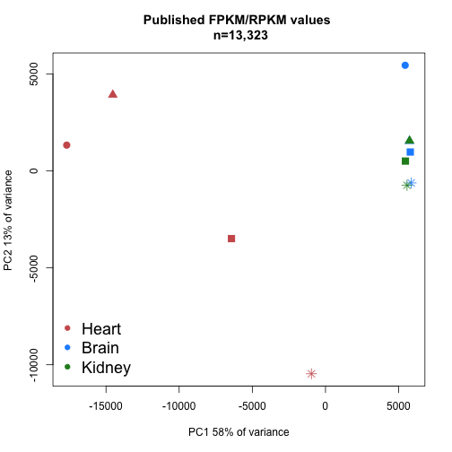 

```r
plot(p$x[,2],p$x[,3],pch=20,col=colors,xlab=paste("PC2"),ylab=paste("PC3"),main="Published FPKM values \n n=13323")
textxy(p$x[,2],p$x[,3],labs=rownames(p$x))
```

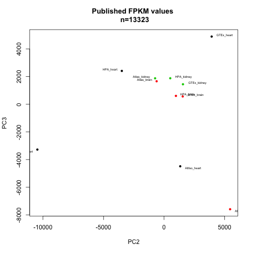 

We can plot all pairwise combinations of principal components 1 to 5. (not shown in paper):


```r
par(mfrow=c(4,4))
for (i in 1:6){
  for(j in 1:6){
  	if (i<j){ 
		plot(p$x[,i],p$x[,j],pch=20,col=colors,xlab=paste("PC",i),ylab=paste("PC",j),main="Published FPKM values \n n=13323")
		}
	}
}
```

 

Look a bit closer at PCs 1-3 in prcomp: (not shown in paper)


```r
      load.pc1 <- p$rotation[,1][order(p$rotation[,1])]
      extreme.pc1 <- c(tail(load.pc1), head(load.pc1))

      extreme.pc1.ensg <- names(extreme.pc1)
      ensembl = useMart("ensembl", dataset = "hsapiens_gene_ensembl") #select the ensembl database
      extreme.pc1.symbols <- getBM(attributes=c("ensembl_gene_id", "hgnc_symbol"), 
                           filters = "ensembl_gene_id",
                           values=extreme.pc1.ensg,
                           mart=ensembl)
      
      barplot(extreme.pc1, names.arg=extreme.pc1.symbols[,2], las=2, main="Genes w highest absolute loadings in PC1 (raw RPKM)")
```

 

```r
      load.pc2 <- p$rotation[,2][order(p$rotation[,2])]
      extreme.pc2 <- c(tail(load.pc2), head(load.pc2))
      
      extreme.pc2.ensg <- names(extreme.pc2)
      extreme.pc2.symbols <- getBM(attributes=c("ensembl_gene_id", "hgnc_symbol"), 
                           filters = "ensembl_gene_id",
                           values=extreme.pc2.ensg,
                           mart=ensembl)
      
      barplot(extreme.pc2, names.arg=extreme.pc2.symbols[,2], las=2, main="Genes w highest absolute loadings in PC2 (raw RPKM)")
```

 

```r
      load.pc3 <- p$rotation[,3][order(p$rotation[,3])]
      extreme.pc3 <- c(tail(load.pc3), head(load.pc3))
      
      extreme.pc3.ensg <- names(extreme.pc3)
      extreme.pc3.symbols <- getBM(attributes=c("ensembl_gene_id", "hgnc_symbol"), 
                           filters = "ensembl_gene_id",
                           values=extreme.pc3.ensg,
                           mart=ensembl)
      
      
      barplot(extreme.pc3, names.arg=extreme.pc3.symbols[,2], las=2, main="Genes w highest absolute loadings in PC3 (raw RPKM)")
```

 


Despite what it might appear like from the plot, PC 1 seems to be about tissue specificity. MYL2, TNNT2, MB, DES, ACTC1, MYH7 are all heart genes. SPP1 and ALDOB are kidney genes and GFAP, CLU, PLP1 are brain genes.

PC 2: Very high positive loadings for FTH1 (highly variable between tissues) and MYL2 (heart). But also high *negative* loading for TNNT2 (heart). 

PC3: The same genes seem to be involved again (MYL2, TNNT2, FTH1 etc.)


Try Anova on a "melted" expression matrix with some metadata:


```r
m <- melt(published.nozero)
```

```
## Using  as id variables
```

```r
colnames(m) <- c("sample_ID","RPKM")

meta <- sampleinfo_published[,c("Study","Tissue","Preparation","NumberRaw","Numbermapped","Readtype")]
rownames(meta) <- colnames(published.nozero)
tissue <- rep(meta$Tissue, each=nrow(published.nozero))
study <- rep(meta$Study, each=nrow(published.nozero))
prep <- rep(meta$Preparation, each=nrow(published.nozero))
layout <- rep(meta$Readtype, each=nrow(published.nozero))
raw <- rep(meta$NumberRaw, each=nrow(published.nozero))
mapped <- rep(meta$Numbermapped, each=nrow(published.nozero))
data <- data.frame(m, tissue=tissue, study=study, prep=prep, layout=layout,nraw=raw,nmapped=mapped)
subset <- data[sample(1:nrow(data), 1000),]
fit <- lm(RPKM ~ study + nraw + layout + prep + tissue, data=data)
a <- anova(fit)
maxval = 3000

barplot(a$"F value"[-7],names.arg=rownames(a)[-7],main="Anova F score, Raw RPKM",ylim=c(0,maxval))
```

 

```r
print(a)
```

```
## Analysis of Variance Table
## 
## Response: RPKM
##               Df   Sum Sq Mean Sq F value  Pr(>F)    
## study          3 4.11e+06 1369775  102.59 < 2e-16 ***
## nraw           1 2.50e+04   25029    1.87    0.17    
## tissue         2 4.72e+05  236037   17.68 2.1e-08 ***
## Residuals 146546 1.96e+09   13352                    
## ---
## Signif. codes:  0 '***' 0.001 '**' 0.01 '*' 0.05 '.' 0.1 ' ' 1
```

Try log2 tranform the published FPKM values:


```r
pseudo <- 1
published.log <- log2(published.nozero + pseudo)
```

Heatmap with log2 values:


```r
pheatmap(cor(published.log),method="spearman")
```

 

PCA analysis of log2 published FPKM values


```r
colors <- c(1, 2, 3, 1, 2, 1, 2, 3, 1, 2, 3)

p.log <- prcomp(t(published.log))

plot(p.log$x[,1],p.log$x[,2],pch=20,col=colors,xlab=paste("PC1"),ylab=paste("PC2"),main="log2 Published FPKM values \n n=13323")
textxy(p.log$x[,1],p.log$x[,2],labs=rownames(p.log$x))
```

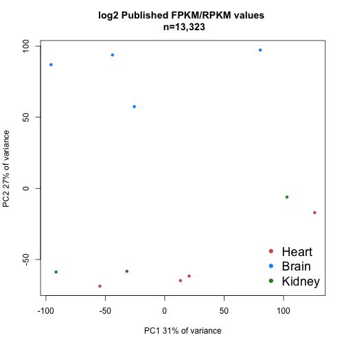 

```r
plot(p.log$x[,2],p.log$x[,3],pch=20,col=colors,xlab=paste("PC2"),ylab=paste("PC3"),main="log2 Published FPKM values \n n=13323")
textxy(p.log$x[,2],p.log$x[,3],labs=rownames(p.log$x))
```

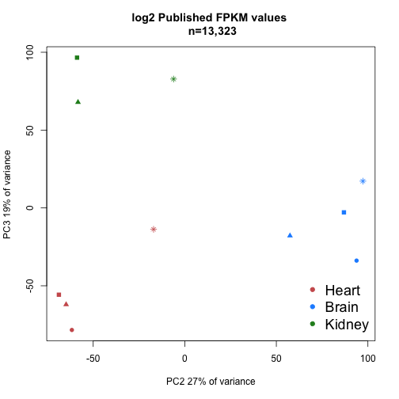 

We can plot all pairwise combinations of principal components 1 to 5. (not shown in paper):


```r
par(mfrow=c(4,4))
for (i in 1:6){
  for(j in 1:6){
    if (i<j){ 
		plot(p.log$x[,i],p.log$x[,j],pch=20,col=colors,xlab=paste("PC",i),ylab=paste("PC",j),main="log2 Published FPKM values \n n=13323")
		}
	}
}
```

 

Look a bit closer at PCs 1-3 in prcomp:


```r
     load.pc1 <- p.log$rotation[,1][order(p.log$rotation[,1])]
     extreme.pc1 <- c(tail(load.pc1), head(load.pc1))

     extreme.pc1.ensg <- names(extreme.pc1)
     extreme.pc1.symbols <- getBM(attributes=c("ensembl_gene_id", "hgnc_symbol"), 
                           filters = "ensembl_gene_id",
                           values=extreme.pc1.ensg,
                           mart=ensembl)
      
      barplot(extreme.pc1, names.arg=extreme.pc1.symbols[,2], las=2, main="Genes w highest absolute loadings in PC1 (log2RPKM)")
```

 

```r
      load.pc2 <- p.log$rotation[,2][order(p.log$rotation[,2])]
      extreme.pc2 <- c(tail(load.pc2), head(load.pc2))
      
      extreme.pc2.ensg <- names(extreme.pc2)
      extreme.pc2.symbols <- getBM(attributes=c("ensembl_gene_id", "hgnc_symbol"), 
                           filters = "ensembl_gene_id",
                           values=extreme.pc2.ensg,
                           mart=ensembl)
     
      barplot(extreme.pc2, names.arg=extreme.pc2.symbols[,2], las=2, main="Genes w highest absolute loadings in PC2 (log2RPKM)")
```

 

```r
      load.pc3 <- p.log$rotation[,3][order(p$rotation[,3])]
      extreme.pc3 <- c(tail(load.pc3), head(load.pc3))
      
      extreme.pc3.ensg <- names(extreme.pc3)
      extreme.pc3.symbols <- getBM(attributes=c("ensembl_gene_id", "hgnc_symbol"), 
                           filters = "ensembl_gene_id",
                           values=extreme.pc3.ensg,
                           mart=ensembl)
      
      barplot(extreme.pc3, names.arg=extreme.pc3.symbols[,2], las=2, main="Genes w highest absolute loadings in PC3 (log2RPKM)")
```

 

PC1:
ENSG00000171560 - FGA - fibrinogen light chain. A bit inconsistent between studies. Mostly kidney specific but not in the Atlas.
ENSG00000148677 - ANKRD1 - definitely heart gene.
ENSG00000135218 - CD36 - heart gene.
ENSG00000057593 - F7 - varies mostly across studies.
ENSG00000118194 - TNNT2 - heart.
ENSG00000188257 - PLA2G2A - heart.
ENSG00000105372 - RPS19 - ribosomal - varies across studies. 
ENSG00000063177 - RPL18 - ribosomal - varies across studies.
ENSG00000100097 - LGALS1 - varies across studies / a bit heart specific
ENSG00000105640 - RPL18A - varies across studies
ENSG00000105583 - varies across studies
ENSG00000087086 - FTL - kidney specific / large variation across studies


PC2:
ENSG00000168314 - MOBP - brain
ENSG00000104833 - TUBB4A - brain
ENSG00000104435 - STMN2 - brain
ENSG00000132639 - SNAP25 - brain
ENSG00000123560 - PLP1 - brain
ENSG00000131095 - GFAP - brain
ENSG00000111245 - MYL1 - heart
ENSG00000114854 - TNNC1 - heart
ENSG00000160808 - MYL3 - heart
ENSG00000198125 - MB - heart
ENSG00000104879 - CKM - heart
ENSG00000159251 - ACTC1 - heart

PC3:
ENSG00000111245 - MYL2 - heart
ENSG00000101608 - MYL12A - heart but varying
ENSG00000175206 - NPPA - heart
ENSG00000175084 - DES - heart
ENSG00000159251 - ACTC1 - heart
ENSG00000129991 - TNNI3 - heart
ENSG00000167996 - FTH1 - varying between tissues, high in kidney and brain
ENSG00000118194 - TNNT2 - heart
ENSG00000125971 - DYNLRB1 - varying
ENSG00000075624 - ACTB - brain
ENSG00000071082 - RPL31 - varying
ENSG00000106211 - HSPB1 - heart & kidney


To further validate the above results, indicating that tissue specificity appears mainly in PC 2 and 3, we will extract the 500 genes with highest loadings in each component and plot the corresponding published FPKM values in a heatmap:


```r
     load.pc1 <- abs(p.log$rotation[,1])[order(abs(p.log$rotation[,1]),decreasing=TRUE)]
     top.pc1 <- names(load.pc1[1:500])
     pheatmap(cor(published[top.pc1,]),method="spearman")
```

 

```r
     load.pc2 <- abs(p.log$rotation[,2])[order(abs(p.log$rotation[,2]),decreasing=TRUE)]
     top.pc2 <- names(load.pc2[1:500])
     pheatmap(cor(published[top.pc2,]),method="spearman")
```

 

```r
     load.pc3 <- abs(p.log$rotation[,3])[order(abs(p.log$rotation[,3]),decreasing=TRUE)]
     top.pc3 <- names(load.pc3[1:500])
     pheatmap(cor(published[top.pc3,]),method="spearman")
```

 

Try Anova on a "melted" expression matrix with logged values and some metadata:


```r
n <- melt(published.log)
```

```
## Using  as id variables
```

```r
colnames(n) <- c("sample_ID","RPKM")
meta <- sampleinfo_published[,c("Study","Tissue","Preparation","NumberRaw","Numbermapped","Readtype")]
rownames(meta) <- colnames(published.log)
tissue <- rep(meta$Tissue, each=nrow(published.log))
study <- rep(meta$Study, each=nrow(published.log))
prep <- rep(meta$Preparation, each=nrow(published.log))
layout <- rep(meta$Readtype, each=nrow(published.log))
raw <- rep(meta$NumberRaw, each=nrow(published.log))
mapped <- rep(meta$Numbermapped, each=nrow(published.log))
data <- data.frame(n, tissue=tissue, study=study, prep=prep, layout=layout,nraw=raw,nmapped=mapped)
subset <- data[sample(1:nrow(data), 1000),]
fit <- lm(RPKM ~ study + nraw + layout + prep + tissue, data=data)
a <- anova(fit)
maxval = 3000

barplot(a$"F value"[-7],names.arg=rownames(a)[-7],main="Anova F score, Raw RPKM",ylim=c(0,maxval))
```

 

```r
print(a)
```

```
## Analysis of Variance Table
## 
## Response: RPKM
##               Df Sum Sq Mean Sq F value  Pr(>F)    
## study          3  28954    9651  2640.1 < 2e-16 ***
## nraw           1     42      42    11.4 0.00073 ***
## tissue         2   1481     740   202.5 < 2e-16 ***
## Residuals 146546 535714       4                    
## ---
## Signif. codes:  0 '***' 0.001 '**' 0.01 '*' 0.05 '.' 0.1 ' ' 1
```

Combat analysis is performed on logged values (n=13,323)


```r
meta <- data.frame(study=c(rep("HPA",3),rep("AltIso",2),rep("GTex",3),rep("Atlas",3)),tissue=c("Heart","Brain","Kidney","Heart","Brain","Heart","Brain","Kidney","Heart","Brain","Kidney"))

batch <- meta$study
design <- model.matrix(~as.factor(tissue),data=meta)

combat <- ComBat(dat=published.log,batch=batch,mod=design,numCovs=NULL,par.prior=TRUE)
```

```
## Found 4 batches
## Found 2  categorical covariate(s)
## Standardizing Data across genes
## Fitting L/S model and finding priors
## Finding parametric adjustments
## Adjusting the Data
```

```r
write.table(combat, file="published_rpkms_combat_log2.txt", quote=F)
```

Heatmap of Spearman correlations between published expression profiles after combat run (# genes = 13,323)


```r
pheatmap(cor(combat, method="spearman")) 
```

 

Alternatively, one could use Pearson correlation:


```r
pheatmap(cor(combat))
```

 

PCA analysis of published FPKM values after combat run


```r
colors <- c(1, 2, 3, 1, 2, 1, 2, 3, 1, 2, 3)

p.combat <- prcomp(t(combat))

plot(p.combat$x[,1],p.combat$x[,2],pch=20,col=colors,xlab=paste("PC1"),ylab=paste("PC2"),main="Published FPKM values \n COMBAT \n n=13323")
```

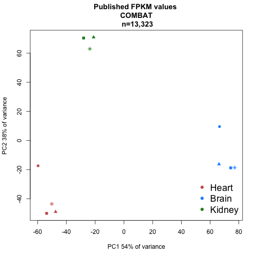 

```r
plot(p.combat$x[,2],p.combat$x[,3],pch=20,col=colors,xlab=paste("PC2"),ylab=paste("PC3"),main="Published FPKM values \n COMBAT \n n=13323")
```

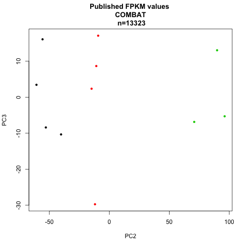 

We can plot all pairwise combinations of principal components 1 to 5. (not shown in paper):


```r
par(mfrow=c(4,4))
for (i in 1:6){
  for(j in 1:6){
    if (i<j){ 
		plot(p.combat$x[,i],p.combat$x[,j],pch=20,col=colors,xlab=paste("PC",i),ylab=paste("PC",j),main="Published FPKM values \n COMBAT \ n=13323")
		}
	}
}
```

 

Look a bit closer at PCs 1-3 in prcomp:


```r
     load.pc1 <- p.combat$rotation[,1][order(p.combat$rotation[,1])]
     extreme.pc1 <- c(tail(load.pc1), head(load.pc1))

     extreme.pc1.ensg <- names(extreme.pc1)
     extreme.pc1.symbols <- getBM(attributes=c("ensembl_gene_id", "hgnc_symbol"), 
                           filters = "ensembl_gene_id",
                           values=extreme.pc1.ensg,
                           mart=ensembl)
      
      barplot(extreme.pc1, names.arg=extreme.pc1.symbols[,2], las=2, main="Genes w highest absolute loadings in PC1 (Combat log2RPKM)")
```

 

```r
      load.pc2 <- p.combat$rotation[,2][order(p.combat$rotation[,2])]
      extreme.pc2 <- c(tail(load.pc2), head(load.pc2))

      extreme.pc2.ensg <- names(extreme.pc2)
      extreme.pc2.symbols <- getBM(attributes=c("ensembl_gene_id", "hgnc_symbol"), 
                           filters = "ensembl_gene_id",
                           values=extreme.pc2.ensg,
                           mart=ensembl)
      
      barplot(extreme.pc2, names.arg=extreme.pc2.symbols[,2], las=2, main="Genes w highest absolute loadings in PC2 (Combat log2RPKM)")
```

 

```r
      load.pc3 <- p.combat$rotation[,3][order(p.combat$rotation[,3])]
      extreme.pc3 <- c(tail(load.pc3), head(load.pc3))

      extreme.pc3.ensg <- names(extreme.pc3)
      extreme.pc3.symbols <- getBM(attributes=c("ensembl_gene_id", "hgnc_symbol"), 
                           filters = "ensembl_gene_id",
                           values=extreme.pc3.ensg,
                           mart=ensembl)
      
      barplot(extreme.pc3, names.arg=extreme.pc3.symbols[,2], las=2, main="Genes w highest absolute loadings in PC3 (Combat log2RPKM)")
```

 

Revisit Anova with combated values.


```r
m <- melt(combat)
```

```
## Using  as id variables
```

```r
colnames(m) <- c("sample_ID","combat")
data <- data.frame(m, tissue=tissue, study=study, prep=prep, layout=layout,nraw=raw,nmapped=mapped)
fit <- lm(combat ~ study + nraw + layout + prep + tissue, data=data)
c <- anova(fit)

maxval <- 500
barplot(c$"F value"[-7],names.arg=rownames(c)[-7],main="Anova F score, Combat",ylim=c(0,maxval))
```

 

```r
print(c)
```

```
## Analysis of Variance Table
## 
## Response: combat
##               Df Sum Sq Mean Sq F value Pr(>F)    
## study          3      6       2    0.59 0.6228    
## nraw           1     21      21    6.66 0.0099 ** 
## tissue         2   1424     712  221.43 <2e-16 ***
## Residuals 146546 471365       3                   
## ---
## Signif. codes:  0 '***' 0.001 '**' 0.01 '*' 0.05 '.' 0.1 ' ' 1
```

Comparing FPKMs for FASTQ files reprocessed with TopHat and Cufflinks


```r
cufflinks <- read.delim("fpkm_table_tophat.txt")

sampleinfo_cufflinks <- read.delim("sample_info_reprocessed.txt")
```

First, we will restrict the data set to only include protein coding genes using the ensembl based R package biomaRt


```r
gene_ids <- as.vector(cufflinks[,1])

ensembl = useMart("ensembl", dataset = "hsapiens_gene_ensembl") #select the ensembl database

gene_type <- getBM(attributes=c("ensembl_gene_id", "gene_biotype"), 
                   filters = "ensembl_gene_id",
                   values=gene_ids,
                   mart=ensembl)

pc <- subset(gene_type[,1],gene_type[,2]=="protein_coding")

cufflinks_pc <- cufflinks[match(pc,cufflinks[,1]),]
```

And let's remove all lines where FPKM is close to zero in all samples before we proceed with this version of the data set:


```r
cufflinks_pc_nozero <- cufflinks_pc[-which(rowSums(cufflinks_pc[,3:16])<=0.01),]

#write.table(cufflinks_pc_nozero, file="cufflinks_pc_nozero.txt", quote=F)
#cufflinks_pc_nozero <- read.table(file="cufflinks_fpkm_proteincoding_nozero.txt")
```

Heatmap of Spearman correlations between reprocessed expression profiles (# genes = 19,475)


```r
pheatmap(cor(cufflinks_pc_nozero[,3:16], method="spearman")) 
```

 

The brain samples are in a separate cluster, whereas the heart and kidney ones are intermixed.

Alternatively, one could use Pearson correlation:


```r
pheatmap(cor(cufflinks_pc_nozero[,3:16])) 
```

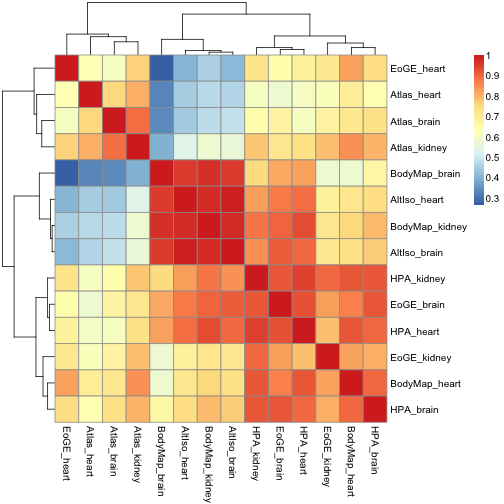 

Let's look at a few SVD plots. 

First we take a look at the "raw" FPKM values for PC 1&2:


```r
colors <- c(2,1,3,2,1,3,2,1,3,2,1,3,2,1)

cufflinks.fpkms <- cufflinks_pc_nozero[,3:16]
rownames(cufflinks.fpkms) <- cufflinks_pc_nozero[,1]
p.cufflinks <- prcomp(t(cufflinks.fpkms))

plot(p.cufflinks$x[,1],p.cufflinks$x[,2],pch=20,col=colors,xlab=paste("PC1"),ylab=paste("PC2"),main="Reprocessed FPKM values \n n=19475")
textxy(p.cufflinks$x[,1],p.cufflinks$x[,2],labs=rownames(p.cufflinks$x))
```

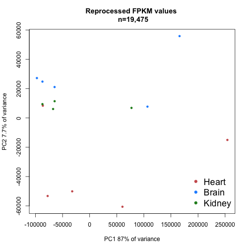 

```r
plot(p.cufflinks$x[,2],p.cufflinks$x[,2],pch=20,col=colors,xlab=paste("PC2"),ylab=paste("PC3"),main="Reprocessed FPKM values \n n=19475")
textxy(p.cufflinks$x[,2],p.cufflinks$x[,3],labs=rownames(p.cufflinks$x))
```

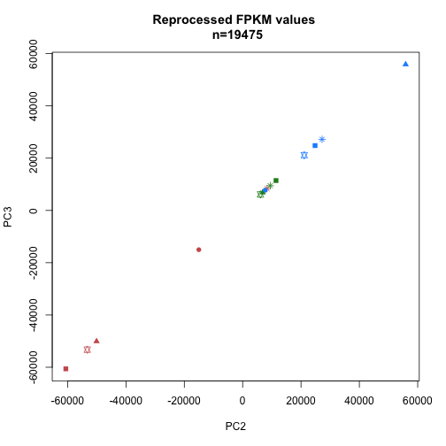 

We can plot all pairwise combinations of principal components 1 to 5. (not shown in paper)
Start with SVD on the "raw" F/RPKMs.


```r
colors <- c(2,1,3,2,1,3,2,1,3,2,1,3,2,1)

par(mfrow=c(4,4))
for (i in 1:6){
  for(j in 1:6){
    if (i<j){ 
      plot(p.cufflinks$x[,i],p.cufflinks$x[,j],pch=20,col=colors,xlab=paste("PC",i),ylab=paste("PC",j),main="Reprocessed FPKM values \n n=19475")
		}
	}
}
```

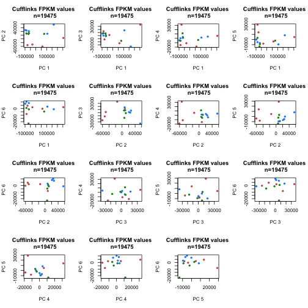 

Look at PCA loadings for PC1 (cuffinks FPKM)


```r
      load.pc1 <- p.cufflinks$rotation[,1][order(p.cufflinks$rotation[,1])]
      extreme.pc1 <- c(tail(load.pc1), head(load.pc1))
      
      extreme.pc1.ensg <- names(extreme.pc1)
      extreme.pc1.symbols <- getBM(attributes=c("ensembl_gene_id", "hgnc_symbol"), 
                           filters = "ensembl_gene_id",
                           values=extreme.pc1.ensg,
                           mart=ensembl)
      
      barplot(extreme.pc1, names.arg=extreme.pc1.symbols[,2], las=2, main="Genes w highest absolute loadings in PC1 (raw Cufflinks    FPKM)")
```

 

```r
      load.pc2 <- p.cufflinks$rotation[,2][order(p.cufflinks$rotation[,2])]
      extreme.pc2 <- c(tail(load.pc2), head(load.pc2))
      
      extreme.pc2.ensg <- names(extreme.pc2)
      extreme.pc2.symbols <- getBM(attributes=c("ensembl_gene_id", "hgnc_symbol"), 
                           filters = "ensembl_gene_id",
                           values=extreme.pc2.ensg,
                           mart=ensembl)
      
      barplot(extreme.pc2, names.arg=extreme.pc2.symbols[,2], las=2, main="Genes w highest absolute loadings in PC2 (raw Cufflinks    FPKM)")
```

 

```r
      load.pc3 <- p.cufflinks$rotation[,3][order(p.cufflinks$rotation[,3])]
      extreme.pc3 <- c(tail(load.pc3), head(load.pc3))
      
      extreme.pc3.ensg <- names(extreme.pc3)
      extreme.pc3.symbols <- getBM(attributes=c("ensembl_gene_id", "hgnc_symbol"), 
                           filters = "ensembl_gene_id",
                           values=extreme.pc3.ensg,
                           mart=ensembl)
      
      barplot(extreme.pc3, names.arg=extreme.pc3.symbols[,2], las=2, main="Genes w highest absolute loadings in PC3 (raw Cufflinks    FPKM)")
```

 

PC1:
ENSG00000198888 - Mitochndrial NADH dehydrogenase 1 - highly expressed in all tissues
ENSG00000198804 - Mitochndrial cytochrome C oxidase - high in all but mostly in heart
ENSG00000198938 - Mitochndrial cytochrome C oxidase III - very high expression
ENSG00000198899 - Mitochondrially encoded ATP synthase 6 - very high expression
ENSG00000198840 - Mitochondrially encoded NADH dehydrogenase 3 - very high expression
ENSG00000228253 - Mitochondrially encoded ATP synthase 8 - very high expression in all tissues, up to FPKM 51767
ENSG00000060138 - Y box binding protein 3 - high in kidney & heart
ENSG00000211445 - Glutathione peroxidase 3 - highly upregulated in kidney
ENSG00000166598 - heat shock protein 90kDa beta - highly upregulated in kidney
ENSG00000130203 - APOE apolipoprotein E - highly upregulated in kidney 
ENSG00000136872 - aldolase B, fructose-bisphosphate - kidney specific
ENSG00000109971 - heat shock 70kDa protein 8 - highly expressed in kidney

All highly loaded ones are mitochondrial. This is likely not tissue specificity but more about variation between studies. 

PC2 seems to be "mitochondrial vs brain":
ENSG00000123560 - PLP1 proteolipid protein 1 - brain specific
ENSG00000131095 - GFAP glial fibrillary acidic protein - brain specific
ENSG00000060138 - CSDA Y box binding protein 3 - varying but high in kidney and heart
ENSG00000120885 - CLU clusterin - brain
ENSG00000197971 - MBP myelin basic protein
ENSG00000228253 - mitochondrially encoded ATP synthase 8
ENSG00000198804 - mitochondrially encoded cytochrome c oxidase I
ENSG00000198899 - mitochondrially encoded ATP synthase 6
ENSG00000198938 - mitochondrially encoded cytochrome c oxidase III
ENSG00000212907 - mitochondrially encoded NADH dehydrogenase 4L
ENSG00000198840 - mitochondrially encoded NADH dehydrogenase 3
ENSG00000198886 - mitochondrially encoded NADH dehydrogenase 4

All mitochondrially encoded genes have relatively high expresseion levels, FPKM values of several thousands.

Anova analysis of different batch factors:


```r
o <- melt(cufflinks_pc_nozero)
```

```
## Using ENSEMBL_ID, Gene_ID as id variables
```

```r
colnames(o) <- c("ENSG","Gene","sample_ID","Cuff_FPKM")
meta <- data.frame(tissue=c("brain","heart","kidney","brain","heart","kidney","brain","heart","kidney","brain","heart","kidney","brain","heart"),study=c("EoGE","EoGE","EoGE","Atlas","Atlas","Atlas","BodyMap","BodyMap","BodyMap","HPA","HPA","HPA","AltIso","AltIso"),prep=c(rep("poly-A",3),rep("rRNA-depl",3),rep("poly-A",8)),layout=c(rep("PE",3),rep("SE",3),rep("PE",6),rep("SE",2)))
rownames(meta) <- colnames(f_pc_nozero)[3:16]
```

```
## Error: object 'f_pc_nozero' not found
```

```r
tissue <- rep(meta$tissue, each=nrow(cufflinks_pc_nozero))
study <- rep(meta$study, each=nrow(cufflinks_pc_nozero))
prep <- rep(meta$prep, each=nrow(cufflinks_pc_nozero))
layout <- rep(meta$layout, each=nrow(cufflinks_pc_nozero))
data <- data.frame(o, tissue=tissue, study=study, prep=prep, layout=layout)

#subset <- data[sample(1:nrow(data), 1000),]
fit <- lm(Cuff_FPKM ~ prep + layout + study + tissue, data=data)
d <- anova(fit)
maxval = 3000
barplot(d$"F value"[-5],names.arg=rownames(d)[-5],main="Anova F score, Cufflinks FPKM",ylim=c(0,maxval))
```

 

Try log2 tranform the reprocessed FPKM values:


```r
pseudo <- 1
cufflinks.log <- log2(cufflinks_pc_nozero[,3:16] + pseudo)
rownames(cufflinks.log) <- cufflinks_pc_nozero[,1]
```

Heatmap with log2 values:


```r
pheatmap(cor(cufflinks.log) ,method="spearman")
```

 

PCA analysis of log2 reprocessed cufflinks FPKM values


```r
colors <- c(2,1,3,2,1,3,2,1,3,2,1,3,2,1)

p.log.cufflinks <- prcomp(t(cufflinks.log))

plot(p.log.cufflinks$x[,1],p.log.cufflinks$x[,2],pch=20,col=colors,xlab=paste("PC1"),ylab=paste("PC2"),main="log2 reprocessed cufflinks FPKM values \n n=19475")
textxy(p.log.cufflinks$x[,1],p.log.cufflinks$x[,2],labs=rownames(p.log.cufflinks$x))
```

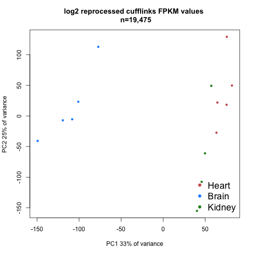 

```r
plot(p.log.cufflinks$x[,2],p.log.cufflinks$x[,3],pch=20,col=colors,xlab=paste("PC2"),ylab=paste("PC3"),main="log2 reprocessed cufflinks FPKM values \n n=19475")
textxy(p.log.cufflinks$x[,2],p.log.cufflinks$x[,3],labs=rownames(p.log.cufflinks$x))
```

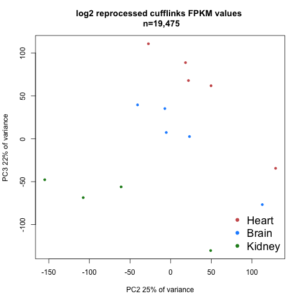 

We can plot all pairwise combinations of principal components 1 to 5. (not shown in paper):


```r
par(mfrow=c(4,4))
for (i in 1:6){
  for(j in 1:6){
    if (i<j){ 
  	plot(p.log.cufflinks$x[,i],p.log.cufflinks$x[,j],pch=20,col=colors,xlab=paste("PC",i),ylab=paste("PC",j),main="log2 reprocessed FPKM values \n n=19475")
		}
	}
}
```

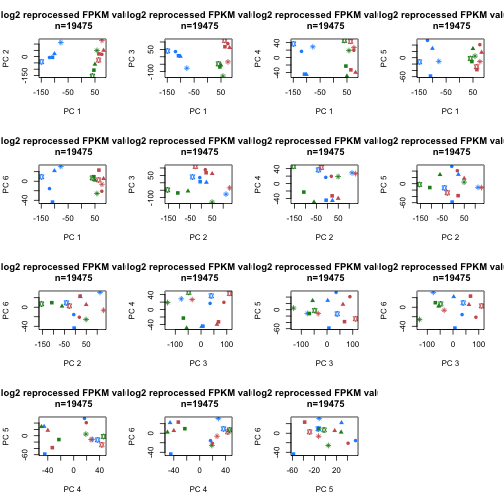 

Look a bit closer at PCs 1-3 in prcomp for the logged FPKM values from cufflinks:


```r
      load.pc1 <- p.log.cufflinks$rotation[,1][order(p.log.cufflinks$rotation[,1])]
      extreme.pc1 <- c(tail(load.pc1), head(load.pc1))
      
      extreme.pc1.ensg <- names(extreme.pc1)
      extreme.pc1.symbols <- getBM(attributes=c("ensembl_gene_id", "hgnc_symbol"), 
                           filters = "ensembl_gene_id",
                           values=extreme.pc1.ensg,
                           mart=ensembl)
      
      barplot(extreme.pc1, names.arg=extreme.pc1.symbols[,2], las=2, main="Genes w highest absolute loadings in PC1 (log2Cufflinks FPKM)")
```

 

```r
      load.pc2 <- p.log.cufflinks$rotation[,2][order(p.log.cufflinks$rotation[,2])]
      extreme.pc2 <- c(tail(load.pc2), head(load.pc2))
      
      extreme.pc2.ensg <- names(extreme.pc2)
      extreme.pc2.symbols <- getBM(attributes=c("ensembl_gene_id", "hgnc_symbol"), 
                           filters = "ensembl_gene_id",
                           values=extreme.pc2.ensg,
                           mart=ensembl)
      
      barplot(extreme.pc2, names.arg=extreme.pc2.symbols[,2], las=2, main="Genes w highest absolute loadings in PC2 (log2Cufflinks FPKM)")
```

 

```r
      load.pc3 <- p.log.cufflinks$rotation[,3][order(p.log.cufflinks$rotation[,3])]
      extreme.pc3 <- c(tail(load.pc3), head(load.pc3))
      
      extreme.pc3.ensg <- names(extreme.pc3)
      extreme.pc3.symbols <- getBM(attributes=c("ensembl_gene_id", "hgnc_symbol"), 
                           filters = "ensembl_gene_id",
                           values=extreme.pc3.ensg,
                           mart=ensembl)
      
      barplot(extreme.pc3, names.arg=extreme.pc3.symbols[,2], las=2, main="Genes w highest absolute loadings in PC3 (log2Cufflinks FPKM)")
```

 

Seems to yield a heart vs. brain separation

PC1:
ENSG00000198888 - mitochondrially encoded NADH dehydrogenase 1
ENSG00000198804 - MTCO1 - mitochondrially encoded cytochrome c oxidase I
ENSG00000198938 - MTCO3 - mitochondrially encoded cytochrome c oxidase III
ENSG00000198899 - MTATP6 - mitochondrially encoded ATP synthase 6
ENSG00000198840 - MTND3 - mitochondrially encoded NADH dehydrogenase 3
ENSG00000228253 - MTATP8 - mitochondrially encoded ATP synthase 8
ENSG00000060138 - YBX3 - Y box binding protein 3
ENSG00000211445 - GPX3 - glutathione peroxidase 3
ENSG00000166598 - HSP90B1 - heat shock protein 90kDa beta
ENSG00000130203 - APOE - apolipoprotein E
ENSG00000136872 - ALDOB - aldolase B, fructose-bisphosphate
ENSG00000109971 - HSPA8 - heat shock 70kDa protein 8

PC2:
ENSG00000123560 - PLP1- proteolipid protein 1
ENSG00000131095 - GFAP - glial fibrillary acidic protein
ENSG00000060138 - YBX3 - Y box binding protein 3
ENSG00000120885 - CLU - clusterin
ENSG00000197971 - MBP - myelin basic protein
ENSG00000228253 - MT-ATP8
ENSG00000198804 - MT-CO1 - mitochondrially encoded cytochrome c oxidase I
ENSG00000198899 - MT-ATP6 - mitochondrially encoded ATP synthase 6
ENSG00000198938 - MT-CO3 - mitochondrially encoded cytochrome c oxidase III
ENSG00000212907 - MT-NDAL
ENSG00000198840 - MT-ND3
ENSG00000198886 - MT-ND4

PC3:

ENSG00000092054 - MYH7 - myosin, heavy chain 7 - heart
ENSG00000173991 - TCAP - titin-cap - heart
ENSG00000159251 - ACTC1 - actin, alpha, cardiac muscle 1 - heart
ENSG00000104879 - CKM - creatine kinase, muscle - heart
ENSG00000106631 - MYL7 - myosin, light chain 7, regulatory - totally heart specific
ENSG00000198125 - MB - myoglobin - heart specific
ENSG00000136872 - ALDOB - aldolase B, fructose-bisphosphate - kidney specific
ENSG00000169344 - UMOD - uromodulin - kidney specific
ENSG00000145692 - BHMT - betaine--homocysteine S-methyltransferase - kidney specific
ENSG00000164825 - DEFB1 - defensin, beta 1 - kidney specific
ENSG00000163586 - FABP1 - fatty acid binding protein 1, liver - kidney specific
ENSG00000118785 - SPP1 - secreted phosphoprotein 1 - kidney specific

To further validate the above results, indicating that tissue specificity appears mainly in PC 3, we will extract the 500 genes with highest loadings in each component and plot the corresponding cufflinks FPKM values in a heatmap:


```r
     cufflinks_values <- cufflinks_pc_nozero[,3:16]
     rownames(cufflinks_values) <- cufflinks_pc_nozero[,1]

     load.pc1 <- abs(p.log.cufflinks$rotation[,1])[order(abs(p.log.cufflinks$rotation[,1]),decreasing=TRUE)]
     top.pc1 <- names(load.pc1[1:500])
     pheatmap(cor(cufflinks_values[top.pc1,]),method="spearman")
```

 

```r
     load.pc2 <- abs(p.log.cufflinks$rotation[,2])[order(abs(p.log.cufflinks$rotation[,2]),decreasing=TRUE)]
     top.pc2 <- names(load.pc2[1:500])
     pheatmap(cor(cufflinks_values[top.pc2,]),method="spearman")
```

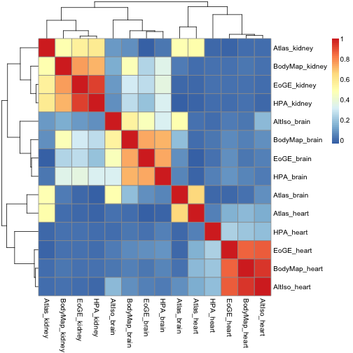 

```r
     load.pc3 <- abs(p.log.cufflinks$rotation[,3])[order(abs(p.log.cufflinks$rotation[,3]),decreasing=TRUE)]
     top.pc3 <- names(load.pc3[1:500])
     pheatmap(cor(cufflinks_values[top.pc3,]),method="spearman")
```

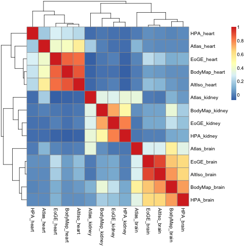 
    
Try Anova on a "melted" expression matrix with logged cufflinks values and some metadata:


```r
n <- melt(cufflinks.log[,])
```

```
## Using  as id variables
```

```r
colnames(n) <- c("sample_ID","FPKM")
meta <- sampleinfo_cufflinks[,c("Study","Tissue","Preparation","NumberRaw","Numbermapped","Readtype")]
rownames(meta) <- colnames(cufflinks.log[,3:16])
```

```
## Error: undefined columns selected
```

```r
tissue <- rep(meta$Tissue, each=nrow(cufflinks.log))
study <- rep(meta$Study, each=nrow(cufflinks.log))
prep <- rep(meta$Preparation, each=nrow(cufflinks.log))
layout <- rep(meta$Readtype, each=nrow(cufflinks.log))
raw <- rep(meta$NumberRaw, each=nrow(cufflinks.log))
mapped <- rep(meta$Numbermapped, each=nrow(cufflinks.log))
data <- data.frame(n, tissue=tissue, study=study, prep=prep, layout=layout,nraw=raw,nmapped=mapped)
subset <- data[sample(1:nrow(data), 1000),]
fit <- lm(FPKM ~ study + nraw + layout + prep + tissue, data=data)
b <- anova(fit)
maxval = 3000

barplot(b$"F value"[-7],names.arg=rownames(b)[-7],main="Anova F score, Cufflinks FPKM",ylim=c(0,maxval))
```

 

```r
print(b)
```

```
## Analysis of Variance Table
## 
## Response: FPKM
##               Df  Sum Sq Mean Sq F value Pr(>F)    
## study          4    6309    1577     347 <2e-16 ***
## nraw           1     525     525     115 <2e-16 ***
## tissue         2    9347    4674    1028 <2e-16 ***
## Residuals 272642 1239904       5                   
## ---
## Signif. codes:  0 '***' 0.001 '**' 0.01 '*' 0.05 '.' 0.1 ' ' 1
```

Combat analysis for removal of batch effects (n=19,475):


```r
meta <- data.frame(study=c(rep("EoGE",3),rep("Atlas",3),rep("BodyMap",3),rep("HPA",3),rep("AltIso",2)),tissue=c("Brain","Heart","Kidney","Brain","Heart","Kidney","Brain","Heart","Kidney","Brain","Heart","Kidney","Brain","Heart"),prep=c(rep("poly-A",3),rep("rRNA-depl",3),rep("poly-A",8)),layout=c(rep("PE",3),rep("SE",3),rep("PE",6),rep("SE",2)))

batch <- meta$study
design <- model.matrix(~as.factor(tissue),data=meta)

combat.cufflinks <- ComBat(dat=cufflinks.log,batch=batch,mod=design,numCovs=NULL,par.prior=TRUE)
```

```
## Found 5 batches
## Found 2  categorical covariate(s)
## Standardizing Data across genes
## Fitting L/S model and finding priors
## Finding parametric adjustments
## Adjusting the Data
```

```r
rownames(combat.cufflinks) <- cufflinks.log[,1]
```

```
## Warning: non-unique values when setting 'row.names': '0',
## '0.00517626822431635', '0.0236637209322414', '0.029023246781642',
## '0.0295290736223259', '0.0308315599061923', '0.0335529659871592',
## '0.0365005204369574', '0.0391991894096902', '0.0452433282159679',
## '0.0520594195747167', '0.0573823382774518', '0.0661454157097659',
## '0.0673137985819971', '0.0681548560643002', '0.0695535593253672',
## '0.0716392593747526', '0.0732855488870674', '0.0749125669138654',
## '0.075407900254143', '0.0893173958611689', '0.0898936174436686',
## '0.0932006068857741', '0.0970783843770903', '0.0974744757294469',
## '0.09795740629009', '0.0994065754227192', '0.101704394624187',
## '0.102830236799458', '0.109140276656624', '0.119233185780424',
## '0.120118860591409', '0.13705963001129', '0.15350963434378',
## '0.156285287247517', '0.160797592606634', '0.161366606121914',
## '0.162676677196662', '0.164923977521195', '0.170960805156456',
## '0.181463895038575', '0.203006904167888', '0.206521952492307',
## '0.210691835996985', '0.213930774696719', '0.21727166956314',
## '0.218969589117264', '0.220136757028785', '0.22367584888226',
## '0.225351443745212', '0.270977378909498', '0.335160791590051',
## '0.436672503488679', '0.460078850044039', '0.5854846618205',
## '0.616433923487993', '0.809282722841083', '0.84348866150229',
## '0.921226081151365', '1.13035104024741', '1.15132631075292',
## '1.15604706536181', '1.19365190801207', '1.23195458428843',
## '1.48487025173659', '1.56151188446719', '1.66872730716005',
## '1.71524324275728', '1.77754385822541', '1.86603754999863',
## '1.89636486039866', '1.90667898481735', '1.91626643514462',
## '2.10607690916893', '2.16952740402622', '2.24867144851896',
## '2.28917639897285', '2.41892123190363', '2.47423094921783',
## '2.5684432021167', '2.60460511698491', '3.00141855360976',
## '3.09435431869144', '3.27874605140721', '3.42780593735344',
## '3.47438412346816', '3.54003967201576', '3.5521188090109',
## '3.59203837071098', '3.59632693612744', '3.61146750023341',
## '3.64385618977472', '3.64623179424125', '3.64706118091508',
## '3.68090941871255', '3.68811320287153', '3.74088439751766',
## '3.77866066216647', '3.78107639286242', '3.82900723461057',
## '3.83333540913747', '3.84960901871275', '3.90441665815967',
## '3.93375201981657', '3.94363069594144', '3.99889952542205',
## '4.00900670479347', '4.05735495584939', '4.08855717704175',
## '4.09164906391653', '4.10029649453609', '4.10831535538772',
## '4.132157297938', '4.18009215142613', '4.22559114038389',
## '4.26866643980743', '4.27268016762593', '4.33292986965226',
## '4.41095159691781', '4.47354016499028', '4.56531080171176',
## '4.58689081606473', '4.72526672299093', '4.73147653078029',
## '4.78649181498392', '4.93943346830942', '4.96829354476239',
## '5.05955861821302', '5.90294424113534', '6.25540820131061',
## '8.57261307484397'
```

```
## Error: duplicate 'row.names' are not allowed
```

```r
write.table(combat, file="reprocessed_rpkms_combat_log2.txt", quote=F)
```

Let's see how the correlation heatmap and PCA plots look after correction for batch effects with combat:


```r
pheatmap(cor(combat.cufflinks),method="spearman")
```

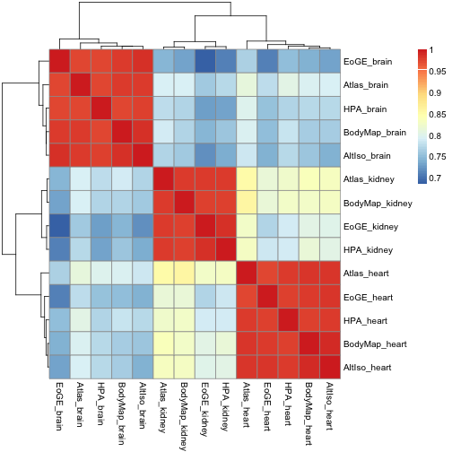 


```r
colors <- c(2,1,3,2,1,3,2,1,3,2,1,3,2,1)

p.combat.cufflinks <- prcomp(t(combat.cufflinks))

plot(p.combat.cufflinks$x[,1],p.combat.cufflinks$x[,2],pch=20,col=colors,xlab=paste("PC1"),ylab=paste("PC2"),main="Cufflinks FPKM values \n COMBAT \n n=19,475")
textxy(p.combat.cufflinks$x[,1],p.combat.cufflinks$x[,2],labs=rownames(p.combat.cufflinks$x))
```

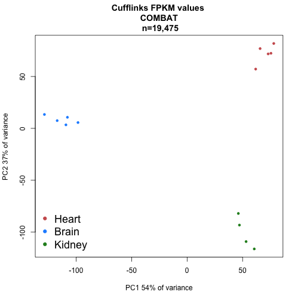 

```r
plot(p.combat.cufflinks$x[,2],p.combat.cufflinks$x[,3],pch=20,col=colors,xlab=paste("PC2"),ylab=paste("PC3"),main="Cufflinks FPKM values \n COMBAT \n n=19,475")
textxy(p.combat.cufflinks$x[,2],p.combat.cufflinks$x[,3],labs=rownames(p.combat.cufflinks$x))
```

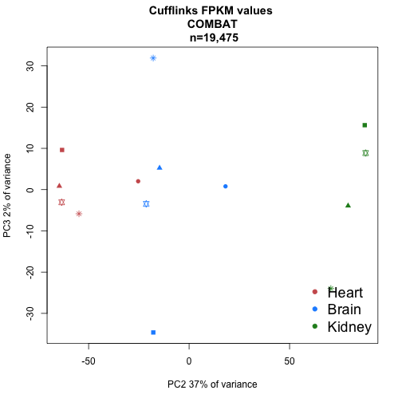 

We can plot all pairwise combinations of principal components 1 to 5. (not shown in paper):


```r
par(mfrow=c(4,4))
for (i in 1:6){
  for(j in 1:6){
    if (i<j){ 
  	plot(p.combat.cufflinks$x[,i],p.combat.cufflinks$x[,j],pch=20,col=colors,xlab=paste("PC",i),ylab=paste("PC",j),main="Cufflinks FPKM values \n COMBAT \ n=19,475")
		}
	}
}
```

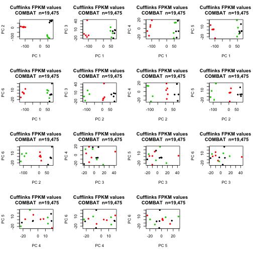 

Look a bit closer at PCs 1-3 in prcomp:


```r
      load.pc1 <- p.combat.cufflinks$rotation[,1][order(p.combat.cufflinks$rotation[,1])]
      extreme.pc1 <- c(tail(load.pc1), head(load.pc1))
      
      extreme.pc1.ensg <- names(extreme.pc1)
      extreme.pc1.symbols <- getBM(attributes=c("ensembl_gene_id", "hgnc_symbol"), 
                           filters = "ensembl_gene_id",
                           values=extreme.pc1.ensg,
                           mart=ensembl)
      
      barplot(extreme.pc1, names.arg=extreme.pc1.symbols[,2], las=2, main="Genes w highest absolute loadings in PC1 (COMBAT Cufflinks FPKM)")
```

 

```r
      load.pc2 <- p.combat.cufflinks$rotation[,2][order(p.combat.cufflinks$rotation[,2])]
      extreme.pc2 <- c(tail(load.pc2), head(load.pc2))
      
      extreme.pc2.ensg <- names(extreme.pc2)
      extreme.pc2.symbols <- getBM(attributes=c("ensembl_gene_id", "hgnc_symbol"), 
                           filters = "ensembl_gene_id",
                           values=extreme.pc2.ensg,
                           mart=ensembl)
      
      
      barplot(extreme.pc2, names.arg=extreme.pc2.symbols[,2], las=2, main="Genes w highest absolute loadings in PC2 (Combat Cufflinks FPKM)")
```

 

```r
      load.pc3 <- p.combat.cufflinks$rotation[,3][order(p.combat.cufflinks$rotation[,3])]
      extreme.pc3 <- c(tail(load.pc3), head(load.pc3))
      
      extreme.pc3.ensg <- names(extreme.pc3)
      extreme.pc3.symbols <- getBM(attributes=c("ensembl_gene_id", "hgnc_symbol"), 
                           filters = "ensembl_gene_id",
                           values=extreme.pc3.ensg,
                           mart=ensembl)
      
      
      barplot(extreme.pc3, names.arg=extreme.pc3.symbols[,2], las=2, main="Genes w highest absolute loadings in PC3 (Combat Cufflinks FPKM)")
```

 
Let's have a look at the genes with highest loadings:

PC1:
ENSG00000173641 - HSPB7 - heat shock 27kDa protein family, member 7 - heart specific
ENSG00000175084 - DES- desmin - heart specific
ENSG00000159251 - ACTC1 - actin, alpha, cardiac muscle 1 - heart specific
ENSG00000111245 - MYL2 - myosin, light chain 2, regulatory, cardiac, slow - heart specific
ENSG00000198125 - MB - myoglobin - heart specific
ENSG00000114854 - TNNC1 - troponin C type 1 - heart specific
ENSG00000132639 - SNAP25 - synaptosomal-associated protein, 25kDa - brain specific
ENSG00000123560 - PLP1 - proteolipid protein 1 - brain specific
ENSG00000131095 - GFAP - glial fibrillary acidic protein - brain specific
ENSG00000197971 - MBP - myelin basic protein - brain specific
ENSG00000091513 - TF - transferrin - brain specific
ENSG00000125462 - C1orf61 - chromosome 1 open reading frame 61 - brain specific

PC2:
ENSG00000148677 - ANKRD1 - ankyrin repeat domain 1 - heart specific
ENSG00000111245 - MYL2 - myosin, light chain 2, regulatory - heart specific
ENSG00000106631 - MYL7 - myosin, light chain 7, regulatory - heart specific
ENSG00000129991 - TNNI3 - troponin I type 3 - heart specific
ENSG00000092054 - MYH7 - myosin, heavy chain 7 - heart specific
ENSG00000198125 - MB - myoglobin - heart specific
ENSG00000169344 - UMOD - uromodulin - kidney specific (FPKM 0 in all others)
ENSG00000136872 - ALDOB - aldolase B, fructose-bisphosphate - kidney specific
ENSG00000137731 - FXYD2 - FXYD domain containing ion transport regulator 2 - kidney specific
ENSG00000162366 - PDZK1IP1 - PDZK1 interacting protein 1 - kidney specific
ENSG00000164825 - DEFB1 - defensin, beta 1 - kidney specific
ENSG00000095932 - C19orf77 - small integral membrane protein 24 - kidney specific

PC3:
ENSG00000090932 - DLL3 - delta-like 3 (Drosophila) - brain (but relatively low expressed)
ENSG00000088882 - CPXM1 - carboxypeptidase X (M14 family), member 1 - brain
ENSG00000023228 - NDUFS1 - NADH dehydrogenase (ubiquinone) Fe-S protein 1, 75kDa - quite similar expression
ENSG00000157150 - TIMP4 - TIMP metallopeptidase inhibitor 4 - heart
ENSG00000114942 - EEF1B2 - eukaryotic translation elongation factor 1 beta 2 - quite the same
ENSG00000266956 - No name
ENSG00000118271 - TTR - transthyretin - brain
ENSG00000268332 - No name - brain
ENSG00000010438 - RPSS3 - protease, serine, 3 - brain
ENSG00000105697 - HAMP - hepcidin antimicrobial peptide - brain
ENSG00000129824 - RPS4Y1 - ribosomal protein S4, Y-linked 1 - no clear tissue specificity
ENSG00000205116 - TMEM88B - transmembrane protein 88B - brain


```r
o <- melt(combat.cufflinks[,])
```

```
## Using  as id variables
```

```r
colnames(o) <- c("sample_ID","FPKM")
meta <- sampleinfo_cufflinks[,c("Study","Tissue","Preparation","NumberRaw","Numbermapped","Readtype")]
rownames(meta) <- colnames(cufflinks.log[,3:16])
```

```
## Error: undefined columns selected
```

```r
tissue <- rep(meta$Tissue, each=nrow(cufflinks.log))
study <- rep(meta$Study, each=nrow(cufflinks.log))
prep <- rep(meta$Preparation, each=nrow(cufflinks.log))
layout <- rep(meta$Readtype, each=nrow(cufflinks.log))
raw <- rep(meta$NumberRaw, each=nrow(cufflinks.log))
mapped <- rep(meta$Numbermapped, each=nrow(cufflinks.log))
data <- data.frame(o, tissue=tissue, study=study, prep=prep, layout=layout,nraw=raw,nmapped=mapped)
subset <- data[sample(1:nrow(data), 1000),]
fit <- lm(FPKM ~ study + nraw + layout + prep + tissue, data=data)
b <- anova(fit)
maxval = 3000

barplot(b$"F value"[-7],names.arg=rownames(b)[-7],main="Anova F score, Cufflinks FPKM",ylim=c(0,maxval))
```

 

```r
print(b)
```

```
## Analysis of Variance Table
## 
## Response: FPKM
##               Df  Sum Sq Mean Sq F value  Pr(>F)    
## study          4      80      20    4.86 0.00065 ***
## nraw           1     498     498  120.53 < 2e-16 ***
## tissue         2    9529    4765 1154.08 < 2e-16 ***
## Residuals 272642 1125635       4                    
## ---
## Signif. codes:  0 '***' 0.001 '**' 0.01 '*' 0.05 '.' 0.1 ' ' 1
```

Let's include the raw counts that were generated with HTSeq and merge all data into a big data frame:


```r
library(biomaRt)

counts <- read.delim("count_table.txt",row.names=1)
```


```r
ensembl = useMart("ensembl", dataset = "hsapiens_gene_ensembl") #select the ensembl database

gene_type <- getBM(attributes=c("ensembl_gene_id", "gene_biotype"), 
                   filters = "ensembl_gene_id",
                   values=rownames(counts),
                   mart=ensembl)

pc <- subset(gene_type[,1],gene_type[,2]=="protein_coding")

counts_pc <- counts[match(pc,rownames(counts)),]

colnames(counts_pc)<-c("EoGE_brain","EoGE_heart","EoGE_kidney","Atlas_brain","Atlas_heart","Atlas_kidney","BodyMap_brain","BodyMap_heart","BodyMap_kidney","HPA_brain","HPA_heart","HPA_kidney","AltIso_brain","AltIso_heart")

counts_pc_nonzero <- counts_pc[-which(rowSums(counts_pc)<=0.01),]
```

First join everything into a large matrix. We have to give the columns unique names to avoid collisions.


```r
cufflinks_values <- cufflinks_pc_nozero[,3:16]
rownames(cufflinks_values) <- cufflinks_pc_nozero[,1]

new.colnames.published <- paste0("PUB-FPKM-",colnames(published.nozero))
new.colnames.fpkm <- paste0("REPR-FPKM-",colnames(cufflinks_values))
new.colnames.counts <- paste0("REPR-CNTS-",colnames(counts_pc_nonzero))
new.colnames <- c(new.colnames.published,new.colnames.fpkm,new.colnames.counts)

common.ensg.temp <- intersect(rownames(published.nozero), cufflinks_pc_nozero[,1])
common.ensg <- intersect(common.ensg.temp, rownames(counts_pc_nonzero))

data <- data.frame(published.nozero[common.ensg,], cufflinks_values[common.ensg,], counts_pc_nonzero[common.ensg,])
colnames(data) <- new.colnames
```

Visualize the matrix with all samples processed in different ways using a heatmap and PCA with various settings.

Set the colors: heart is red, brain is blue, kidney is black.


```r
colorvec <- rep("black", length(new.colnames))
colorvec[grep("heart", new.colnames)] <- "red"
colorvec[grep("brain", new.colnames)] <- "blue"
```


```r
pheatmap(cor(data),method="spearman")
```

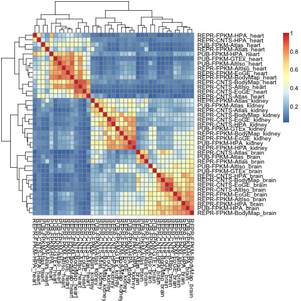 

```r
p <- prcomp(t(data))
plot(p$x[,1],p$x[,2],pch=20,xlab="PC1",ylab="PC2",col=colorvec,main="Default prcomp")
```

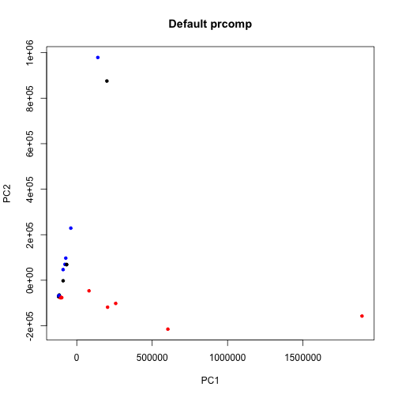 

```r
plot(p$x[,2],p$x[,3],pch=20,xlab="PC2",ylab="PC3",col=colorvec,main="Default prcomp")
```

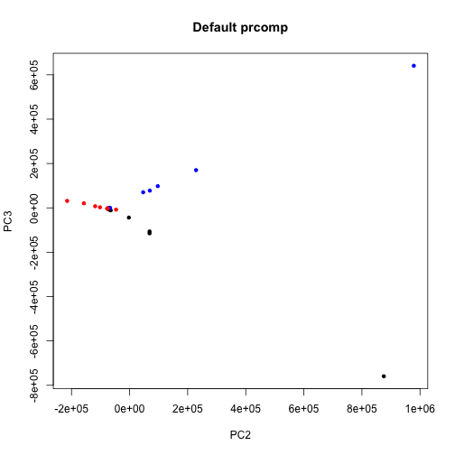 

```r
p.sc <- prcomp(t(data),scale.=TRUE)
plot(p.sc$x[,1],p.sc$x[,2],pch=20,xlab="PC1",ylab="PC2",col=colorvec,main="Scaled prcomp")
```

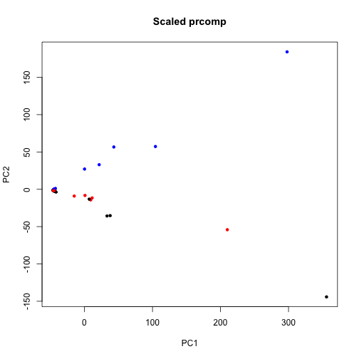 

```r
plot(p.sc$x[,2],p.sc$x[,3],pch=20,xlab="PC2",ylab="PC3",col=colorvec,main="Scaled prcomp")
```

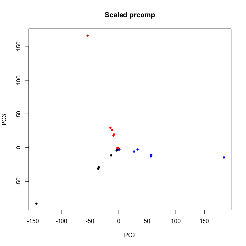 

```r
p.nm <- prcomp(t(data),center=FALSE)
plot(p.nm$x[,1],p.nm$x[,2],pch=20,xlab="PC1",ylab="PC2",col=colorvec,main="prcomp without centering") # This should be equal to the plot.SVD() function
```

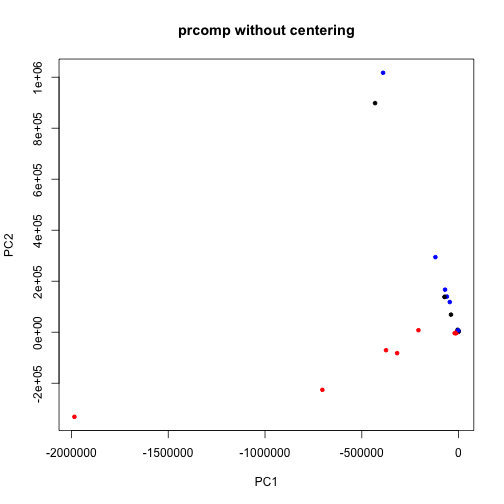 

```r
plot(p.nm$x[,2],p.nm$x[,3],pch=20,xlab="PC2",ylab="PC3",col=colorvec,main="prcomp without centering") # This should be equal to the plot.SVD() function
```

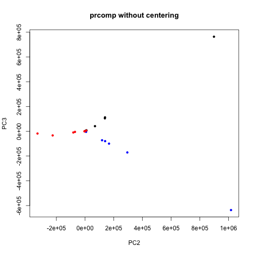 

```r
plot.SVD(data, groups=colorvec)
```

```
## Error: could not find function "plot.SVD"
```

Log transforming the whole matrix.


```r
pseudo <- 1
data.log <- log2((data + pseudo)/1e6)
p <- prcomp(t(data.log))
plot(p$x[,1],p$x[,2],pch=20,xlab="PC1",ylab="PC2",col=colorvec,main="log2, Default prcomp")
```

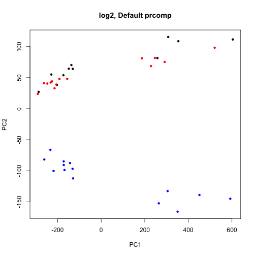 

```r
plot(p$x[,2],p$x[,3],pch=20,xlab="PC2",ylab="PC3",col=colorvec,main="log2, Default prcomp")
```

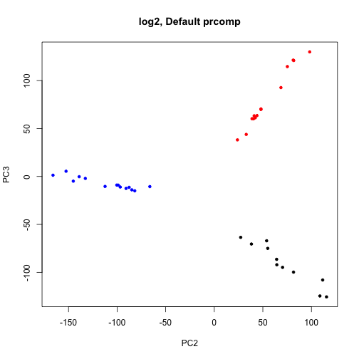 

```r
p.sc <- prcomp(t(data.log),scale.=TRUE)
plot(p.sc$x[,1],p.sc$x[,2],pch=20,xlab="PC1",ylab="PC2",col=colorvec,main="log2, Scaled prcomp")
```

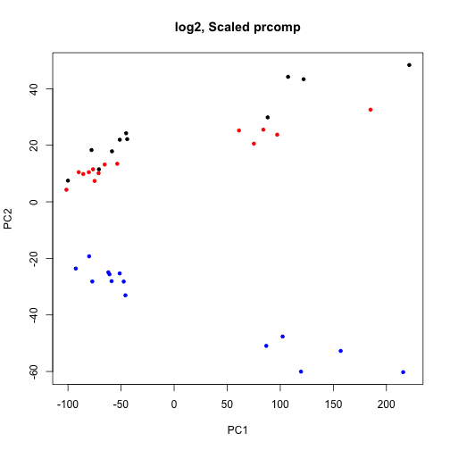 

```r
plot(p.sc$x[,2],p.sc$x[,3],pch=20,xlab="PC2",ylab="PC3",col=colorvec,main="log2, Scaled prcomp")
```

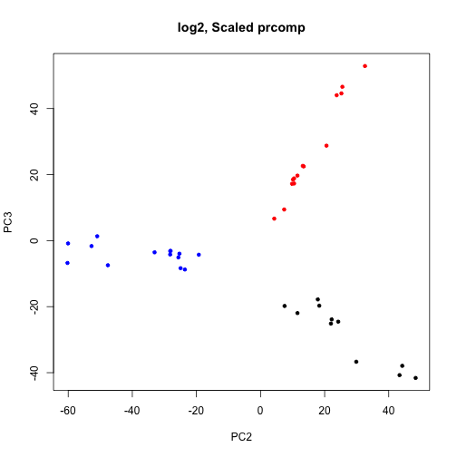 

```r
p.nm <- prcomp(t(data.log),center=F)
plot(p.nm$x[,1],p.nm$x[,2],pch=20,xlab="PC1",ylab="PC2",col=colorvec,main="log2, prcomp without centering") # This should be equal to the plot.SVD() function
```

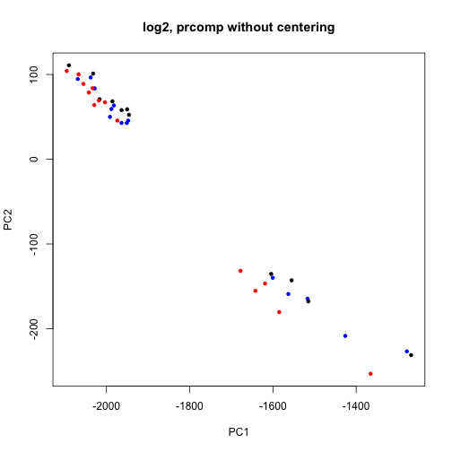 

```r
plot(p.nm$x[,2],p.nm$x[,3],pch=20,xlab="PC2",ylab="PC3",col=colorvec,main="log2, prcomp without centering") # This should be equal to the plot.SVD() function
```

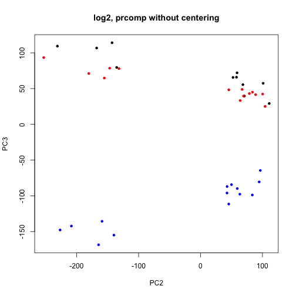 

Doing PCA on each of the three data sets in turn (logged), looking at PCs 2 and 3.

```r
pub.merged.log <- log2(pub.merged + pseudo)
```

```
## Error: object 'pub.merged' not found
```

```r
repr.fpkm.nonzero.log <- log2(repr.fpkm.nonzero + pseudo)
```

```
## Error: object 'repr.fpkm.nonzero' not found
```

```r
repr.counts.nonzero.log <- log2(repr.counts.nonzero + pseudo)
```

```
## Error: object 'repr.counts.nonzero' not found
```

```r
repr.counts.log <- normalize.voom(repr.counts) # voom also normalizes by lib size
```

```
## Error: could not find function "normalize.voom"
```

```r
#repr.counts.log <- log2( (repr.counts+0.5)/(1e6+1))

p.pub <- prcomp(t(pub.merged.log))
```

```
## Error: object 'pub.merged.log' not found
```

```r
cols.pub <- rep("black", length(colnames(pub.merged.log)))
```

```
## Error: object 'pub.merged.log' not found
```

```r
cols.pub[grep("heart",colnames(pub.merged.log))] <- "red"
```

```
## Error: object 'cols.pub' not found
```

```r
cols.pub[grep("brain",colnames(pub.merged.log))] <- "blue"
```

```
## Error: object 'cols.pub' not found
```

```r
p.fpkm <- prcomp(t(repr.fpkm.nonzero.log))
```

```
## Error: object 'repr.fpkm.nonzero.log' not found
```

```r
cols.fpkm <- rep("black", length(colnames(repr.fpkm.nonzero.log)))
```

```
## Error: object 'repr.fpkm.nonzero.log' not found
```

```r
cols.fpkm[grep("heart",colnames(repr.fpkm.nonzero.log))] <- "red"
```

```
## Error: object 'cols.fpkm' not found
```

```r
cols.fpkm[grep("brain",colnames(repr.fpkm.nonzero.log))] <- "blue"
```

```
## Error: object 'cols.fpkm' not found
```

```r
p.counts <- prcomp(t(repr.counts.log))
```

```
## Error: object 'repr.counts.log' not found
```

```r
cols.counts <- rep("black", length(colnames(repr.counts.log)))
```

```
## Error: object 'repr.counts.log' not found
```

```r
cols.counts[grep("heart",colnames(repr.counts.log))] <- "red"
```

```
## Error: object 'cols.counts' not found
```

```r
cols.counts[grep("brain",colnames(repr.counts.log))] <- "blue"
```

```
## Error: object 'cols.counts' not found
```

```r
par(mfrow=c(3,1))
plot(p.pub$x[,2],p.pub$x[,3],pch=20,xlab="PC2",ylab="PC3",col=cols.pub,main="Published RPKMs (log2), PC 2-3") 
```

```
## Error: object 'p.pub' not found
```

```r
plot(p.fpkm$x[,2],p.fpkm$x[,3],pch=20,xlab="PC2",ylab="PC3",col=cols.fpkm,main="Reprocessed FPKMs (log2), PC 2-3") 
```

```
## Error: object 'p.fpkm' not found
```

```r
plot(p.counts$x[,2],p.counts$x[,3],pch=20,xlab="PC2",ylab="PC3",col=cols.counts,main="Reprocessed counts (log2), PC 2-3") 
```

```
## Error: object 'p.counts' not found
```
Other combinations of PCs


```r
par(mfrow=c(3,3))
for (i in 2:4){
for (j in 2:4){
if (i < j){
plot(p.pub$x[,i],p.pub$x[,j],pch=20,xlab=paste0("PC", i),ylab=paste0("PC",j),col=cols.pub,main="Published RPKMs (log2)") 
plot(p.fpkm$x[,i],p.fpkm$x[,j],pch=20,xlab=paste0("PC", i),ylab=paste0("PC",j),col=cols.fpkm,main="Reprocessed FPKMs (log2)") 
plot(p.counts$x[,i],p.counts$x[,j],pch=20,xlab=paste0("PC", i),ylab=paste0("PC",j),col=cols.counts,main="Reprocessed counts (log2)") 
}}}
```

```
## Error: object 'p.pub' not found
```

Try "blind" SVA to see what features are pulled out (3x3 scenarios)


```r
pheno <- read.delim("sample_info_published.txt")
expr.nozero <- pub.merged[which(rowSums(pub.merged)>0),] # required for SVA to work?
```

```
## Error: object 'pub.merged' not found
```

```r
mod <- model.matrix(~as.factor(Tissue), data=pheno)
mod0 <- model.matrix(~1,data=pheno)
n.sv <- num.sv(pub.merged.log,mod,method="leek") # 8 (!)
```

```
## Error: object 'pub.merged.log' not found
```

```r
svobj <- sva(as.matrix(pub.merged.log),mod,mod0,n.sv=n.sv)
```

```
## Error: object 'n.sv' not found
```

The above did not work ... What about the reprocessed ones?

```r
pheno <- read.delim("sample_info_reprocessed.txt")
mod <- model.matrix(~as.factor(Tissue), data=pheno)
mod0 <- model.matrix(~1,data=pheno)
n.sv <- num.sv(repr.fpkm.nonzero.log,mod,method="leek") 
```

```
## Error: object 'repr.fpkm.nonzero.log' not found
```

```r
svobj <- sva(as.matrix(repr.fpkm.nonzero.log),mod,mod0,n.sv=n.sv)
```

```
## Error: object 'n.sv' not found
```

```r
l <- svobj$sv # the matrix with 3 surrogate variables
```

```
## Error: object 'svobj' not found
```

```r
rownames(l) <- colnames(repr.fpkm.nonzero.log)
```

```
## Error: object 'repr.fpkm.nonzero.log' not found
```

```r
heatmap(l,scale="none")
```

```
## Error: object 'l' not found
```

Seems like variable 1 is preparation (r~0.9), variable 2 is study (r~-0.8), variable 3 is read type (single/paired, r~0.97)


```r
pheno <- read.delim("sample_info_reprocessed.txt")
mod <- model.matrix(~as.factor(Tissue), data=pheno)
mod0 <- model.matrix(~1,data=pheno)
n.sv <- num.sv(repr.counts.nonzero.log,mod,method="leek") 
```

```
## Error: object 'repr.counts.nonzero.log' not found
```

```r
svobj <- sva(as.matrix(repr.counts.nonzero.log),mod,mod0,n.sv=n.sv)
```

```
## Error: object 'n.sv' not found
```

```r
l <- svobj$sv # the matrix with 3 surrogate variables
```

```
## Error: object 'svobj' not found
```

```r
rownames(l) <- colnames(repr.fpkm.nonzero.log)
```

```
## Error: object 'repr.fpkm.nonzero.log' not found
```

```r
cor(l, as.numeric(pheno$Preparation))
```

```
## Error: object 'l' not found
```

```r
cor(l, as.numeric(pheno$Study))
```

```
## Error: object 'l' not found
```

```r
cor(l, as.numeric(pheno$readlength))
```

```
## Error: object 'l' not found
```

```r
cor(l, pheno$NumberRaw)
```

```
## Error: object 'l' not found
```

```r
heatmap(l,scale="none")
```

```
## Error: object 'l' not found
```
The first variable is apparently correlated to raw/mapped read number (r 0.97) or just BodyMap. Even though voom should correct for library size, the BodyMap samples somehow have higher log-CPMs. The second variable appears to be preparation, and the third seems to be study. 
