Walkthrough with all data analyses that comes with the manuscript
Comparing published FPKM/RPKM values and reprocessed FPKM values.
========================================================

Prepare by loading packages etc.

```r
library(pheatmap)
library(reshape)
library(gplots)
```

```
## 
## Attaching package: 'gplots'
## 
## The following object is masked from 'package:stats':
## 
##     lowess
```

```r
library(ops)
```

```
## 
## Attaching package: 'ops'
## 
## The following object is masked from 'package:stats':
## 
##     filter
```

```r
library(calibrate)
```

```
## Loading required package: MASS
```

```r
library(biomaRt)
library(sva)
```

```
## Loading required package: corpcor
## Loading required package: mgcv
## Loading required package: nlme
## This is mgcv 1.8-3. For overview type 'help("mgcv-package")'.
```

Data from four different public sources are downloaded and brain, heart and kidney samples are extracted. 

Start with Human Protein Atlas (HPA):


```r
#temp <- tempfile()
#download.file(url="http://www.proteinatlas.org/download/rna.csv.zip",destfile=temp)
#hpa <- read.csv(unz(temp, "rna.csv"))
#unlink(temp)

#hpa.heart <- hpa[hpa$Sample=="heart muscle", c("Gene", "Value")]
#hpa.brain <- hpa[hpa$Sample=="cerebral cortex", c("Gene", "Value")]
#hpa.kidney <- hpa[hpa$Sample=="kidney", c("Gene", "Value")]

#hpa.fpkms <- merge(hpa.heart, hpa.brain, by="Gene")
#hpa.fpkms <- merge(hpa.fpkms, hpa.kidney, by="Gene")
#colnames(hpa.fpkms) <- c("ENSG_ID", "HPA_heart", "HPA_brain", "HPA_kidney")
```

Check if the identifiers are unique and write table to file.


```r
#length(hpa.fpkms[,1])
#length(unique(hpa.fpkms[,1]))

#write.table(hpa.fpkms,file="hpa_fpkms.txt",quote=F,sep="\t")
```

Next dataset is from the article "Alternative isoform regulation in human tissue transcriptomes.." by Wang et.al
AltIso:


```r
#temp <- tempfile()
#download.file(url="http://genes.mit.edu/burgelab/Supplementary/wang_sandberg08/hg18.ensGene.CEs.rpkm.txt",destfile=temp)
#altiso <- read.delim(temp, sep="\t")
#unlink(temp)
```

There is no kidney sample here, so just use heart and brain


```r
#altiso.fpkms <- altiso[,c("X.Gene","heart","brain")]
#colnames(altiso.fpkms) <- c("ENSG_ID", "AltIso_heart", "AltIso_brain")
```

Check uniqueness of IDs.


```r
#length(altiso.fpkms[,1])
#length(unique(altiso.fpkms[,1]))

#write.table(altiso.fpkms,file="altiso_fpkms.txt",quote=F,sep="\t")
```

Next dataset is derived from "GTEx": Genotype-Tissue Expression

This is a big download: 337.8 Mb (as of 2014-02-04)
We also add some code to randomly select one sample from each tissue type; there are many biological replicates in this data set.


```r
#temp <- tempfile()
#download.file(url="http://www.gtexportal.org/home/rest/file/download?portalFileId=175729&forDownload=true",destfile=temp)
#header_lines <- readLines(temp, n=2)
#gtex <- read.delim(temp, skip=2, sep="\t")
#unlink(temp)

#write.table(gtex, file="gtex_all.txt",   quote=F, sep="\t")

#download.file(url="http://www.gtexportal.org/home/rest/file/download?portalFileId=175707&forDownload=true",destfile="GTEx_description.txt")

#metadata <- read.delim("GTEx_description.txt", sep="\t")
```

The metadata table seems to contain entries that are not in the RPKM table.


```r
#samp.id <- gsub('-','.',metadata$SAMPID)
#eligible.samples <- which(samp.id %in% colnames(gtex))
#metadata <- metadata[eligible.samples,]
```

Select random heart, kidney and brain samples.


```r
#random.heart <- sample(which(metadata$SMTS=="Heart"), size=1)
#random.heart.samplename <- gsub('-','.',metadata[random.heart, "SAMPID"])
#gtex.heart.fpkm <- as.numeric(gtex[,random.heart.samplename])

#random.brain <- sample(which(metadata$SMTS=="Brain"), size=1)
#random.brain.samplename <- gsub('-','.',metadata[random.brain, "SAMPID"])
#gtex.brain.fpkm <- as.numeric(gtex[,random.brain.samplename])

#random.kidney <- sample(which(metadata$SMTS=="Kidney"), size=1)
#random.kidney.samplename <- gsub('-','.',metadata[random.kidney, "SAMPID"])
#gtex.kidney.fpkm <- as.numeric(gtex[,random.kidney.samplename])
```

Get gene IDs on same format as the other data sets by removing the part after the dot; check ID uniqueness and write to file.


```r
#gtex.names <- gtex[,"Name"]
#temp_list <- strsplit(as.character(gtex.names), split="\\.")
#gtex.names.nodot <- unlist(temp_list)[2*(1:length(gtex.names))-1]

#gtex.fpkms <- data.frame(ENSG_ID=gtex.names.nodot, GTEx_heart=gtex.heart.fpkm, GTEx_brain=gtex.brain.fpkm,GTEx_kidney=gtex.kidney.fpkm)

#length(gtex.fpkms[,1])
#length(unique(gtex.fpkms[,1]))

#write.table(gtex.fpkms,file="gtex_fpkms.txt",quote=F,sep="\t")
```

*RNA-seq Atlas*


```r
#temp <- tempfile()
#download.file(url="http://medicalgenomics.org/rna_seq_atlas/download?download_revision1=1",destfile=temp)
#atlas <- read.delim(temp, sep="\t")
#unlink(temp)

#atlas.fpkms <- atlas[,c("ensembl_gene_id","heart","hypothalamus","kidney")]
#colnames(atlas.fpkms) <- c("ENSG_ID","Atlas_heart","Atlas_brain","Atlas_kidney")
#write.table(atlas.fpkms,file="atlas_fpkms.txt",quote=F,sep="\t")
```

Combining F/RPKM values from public data sets
---------------------------------------------

We will join the data sets on ENSEMBL ID:s, losing a lot of data in the process - but joining on gene symbols or something else would lead to an even worse loss. 


```r
library(org.Hs.eg.db) # for transferring gene identifiers
```

```
## Loading required package: AnnotationDbi
## Loading required package: BiocGenerics
## Loading required package: parallel
## 
## Attaching package: 'BiocGenerics'
## 
## The following objects are masked from 'package:parallel':
## 
##     clusterApply, clusterApplyLB, clusterCall, clusterEvalQ,
##     clusterExport, clusterMap, parApply, parCapply, parLapply,
##     parLapplyLB, parRapply, parSapply, parSapplyLB
## 
## The following object is masked from 'package:stats':
## 
##     xtabs
## 
## The following objects are masked from 'package:base':
## 
##     anyDuplicated, append, as.data.frame, as.vector, cbind,
##     colnames, do.call, duplicated, eval, evalq, Filter, Find, get,
##     intersect, is.unsorted, lapply, Map, mapply, match, mget,
##     order, paste, pmax, pmax.int, pmin, pmin.int, Position, rank,
##     rbind, Reduce, rep.int, rownames, sapply, setdiff, sort,
##     table, tapply, union, unique, unlist
## 
## Loading required package: Biobase
## Welcome to Bioconductor
## 
##     Vignettes contain introductory material; view with
##     'browseVignettes()'. To cite Bioconductor, see
##     'citation("Biobase")', and for packages 'citation("pkgname")'.
## 
## Loading required package: GenomeInfoDb
## 
## Attaching package: 'AnnotationDbi'
## 
## The following object is masked from 'package:MASS':
## 
##     select
## 
## Loading required package: DBI
```

```r
library(data.table) # for collapsing transcript RPKMs
library(pheatmap) # for nicer visualization
library(edgeR) # for TMM normalization
```

```
## Loading required package: limma
## 
## Attaching package: 'limma'
## 
## The following object is masked from 'package:BiocGenerics':
## 
##     plotMA
```

```r
#hpa.fpkms <- read.delim("hpa_fpkms.txt")
#altiso.fpkms <- read.delim("altiso_fpkms.txt")
#gtex.fpkms <- read.delim("gtex_fpkms.txt")
#atlas.fpkms <- read.delim("atlas_fpkms.txt")
```

The RNA-seq Atlas data set uses many different identifiers, while the other all use ENSG as the primary identifier

Approach 1: Merge on ENSEMBL genes (ENSG) as given in RNA-seq Atlas. Note that there are repeated ENSG ID:s in RNA-seq Atlas, as opposed to the other data sets, so we need to do something about that. In this case, we just sum the transcripts that belong to each ENSG gene. We use data.table for this.


```r
#data.dt <- data.table(atlas.fpkms)
#setkey(data.dt, ENSG_ID)
#temp <- data.dt[, lapply(.SD, sum), by=ENSG_ID]
#collapsed <- as.data.frame(temp)
#atlas.fpkms.summed <- collapsed[,2:ncol(collapsed)] 
#rownames(atlas.fpkms.summed) <- collapsed[,1]

#atlas.fpkms.summed <- atlas.fpkms.summed[2:nrow(atlas.fpkms.summed),]
```

Finally, combine all the data sets into a data frame.


```r
#fpkms <- merge(hpa.fpkms, altiso.fpkms, by="ENSG_ID")
#fpkms <- merge(fpkms, gtex.fpkms, by="ENSG_ID")
#fpkms <- merge(fpkms, atlas.fpkms.summed, by.x="ENSG_ID", by.y=0)
#gene_id <- fpkms[,1]
#f <- fpkms[,2:ncol(fpkms)]
#rownames(f) <- gene_id
```

Check how many ENSG IDs we have left.


```r
#dim(f)
```

Approach 2: Try to map Entrez symbols to ENSEMBL to recover more ENSG IDs than already present in the table. 


```r
#m <- org.Hs.egENSEMBL
#mapped_genes <- mappedkeys(m)
#ensg.for.entrez <- as.list(m[mapped_genes])
#remapped.ensg <- ensg.for.entrez[as.character(atlas$entrez_gene_id)]

#atlas.fpkms$remapped_ensg <- as.character(remapped.ensg)

# And add expression values
#data.dt <- data.table(atlas.fpkms[,2:ncol(atlas.fpkms)])
#setkey(data.dt, remapped_ensg)
#temp <- data.dt[, lapply(.SD, sum), by=remapped_ensg]
#collapsed <- as.data.frame(temp)
#atlas.fpkms.summed <- collapsed[,2:ncol(collapsed)] 
#rownames(atlas.fpkms.summed) <- collapsed[,1]
```

Combine data sets again


```r
#fpkms <- merge(hpa.fpkms, altiso.fpkms, by="ENSG_ID")
#fpkms <- merge(fpkms, gtex.fpkms, by="ENSG_ID")
#fpkms <- merge(fpkms, atlas.fpkms.summed, by.x="ENSG_ID", by.y=0)
#gene_id <- fpkms[,1]
#f <- fpkms[,2:ncol(fpkms)]
#rownames(f) <- gene_id
#write.table(f, file = 'published_rpkms.txt', quote=F)

#instead of downloading everytime:
```
Download the data from local file:


```r
published <- read.delim("published_rpkms.txt",sep=" ")

sampleinfo_published <- read.table("sample_info_published.txt",header=TRUE)
```

The published FPKM values are first filtered by removing all lines where FPKM is less or equal to 0.01 in all samples:


```r
published.nozero <- published[-which(rowSums(published[,])<=0.01),]
```

Heatmap of Spearman correlations between published expression profiles (# genes = 13,323), Figure 1b:


```r
pheatmap(cor(published.nozero, method="spearman")) 
```

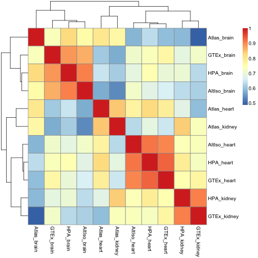 

Alternatively, one could use Pearson correlation (not shown in paper):


```r
pheatmap(cor(published.nozero))
```

 

PCA analysis of published FPKM values, Figure 1c:


```r
colors <- c("indianred", "dodgerblue", "forestgreen",
            "indianred", "dodgerblue",
            "indianred", "dodgerblue", "forestgreen", 
            "indianred", "dodgerblue", "forestgreen")
  
p <- prcomp(t(published.nozero))

shapes <- c(rep(15,3),rep(16,2),rep(17,3),rep(8,3))

plot(p$x[,1],p$x[,2],pch=shapes,cex=1.5,col=colors,xlab=paste("PC1 58% of variance"),ylab=paste("PC2 13% of variance"),main="Published FPKM/RPKM values \n n=13,323")
legend("bottomleft",legend=c("Heart","Brain","Kidney"),col=c("indianred", "dodgerblue", "forestgreen"),cex=1.5,pch=20)
legend("top",legend=c("HPA","AltIso","GTEx","Atlas"),col="black",pch=c(15,16,17,8),ncol=2)
```

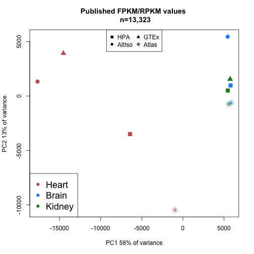 

We can plot all pairwise combinations of principal components 1 to 5. (not shown in paper):


```r
par(mfrow=c(4,4))
for (i in 1:6){
  for(j in 1:6){
  	if (i<j){ 
		plot(p$x[,i],p$x[,j],pch=20,col=colors,xlab=paste("PC",i),ylab=paste("PC",j),main="Published FPKM values \n n=13,323")
		}
	}
}
```

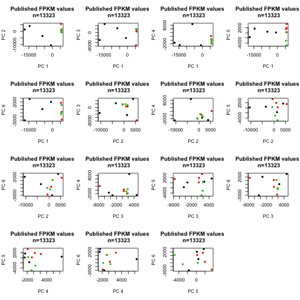 

Look a bit closer at PCs 1-3 in prcomp (not shown in paper):


```r
      #PC1:
      load.pc1 <- p$rotation[,1][order(p$rotation[,1])]
      extreme.pc1 <- c(tail(load.pc1), head(load.pc1))

      extreme.pc1.ensg <- names(extreme.pc1)
      ensembl = useMart("ensembl", dataset = "hsapiens_gene_ensembl") #select the ensembl database
      extreme.pc1.symbols <- getBM(attributes=c("ensembl_gene_id", "hgnc_symbol"), 
                           filters = "ensembl_gene_id",
                           values=extreme.pc1.ensg,
                           mart=ensembl)
      
      q <- extreme.pc1.symbols[,2]
      names(q) <- extreme.pc1.symbols[,1]

      fpkm.pc1 <- cbind(q[extreme.pc1.ensg],published.nozero[extreme.pc1.ensg,])
      names(fpkm.pc1)[names(fpkm.pc1) == 'q[extreme.pc1.ensg]'] <- 'Gene Symbol'
      
      barplot(extreme.pc1, names.arg=q[extreme.pc1.ensg],las=2,main="Genes w highest absolute loadings in PC1 (raw RPKM)")
```

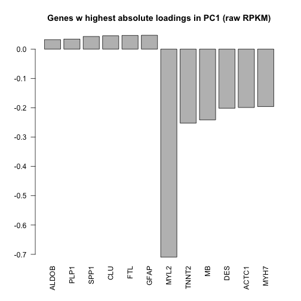 

```r
      print(fpkm.pc1)
```

```
##                 Gene Symbol HPA_heart HPA_brain HPA_kidney AltIso_heart
## ENSG00000136872       ALDOB       0.4       2.4     1824.1         0.00
## ENSG00000123560        PLP1      11.9    1295.2        0.7         2.56
## ENSG00000118785        SPP1       8.3     368.2     1251.1         7.74
## ENSG00000120885         CLU     336.9    3545.9      631.6        58.72
## ENSG00000087086         FTL     436.5     487.2     1523.1       463.86
## ENSG00000131095        GFAP       3.0    1372.0        1.4         1.70
## ENSG00000111245        MYL2    5291.5       0.2        2.6     16780.36
## ENSG00000118194       TNNT2    2693.8       7.0       20.8      8074.39
## ENSG00000198125          MB    3937.3       0.9        2.3      7065.54
## ENSG00000175084         DES    3403.6       2.4       10.2      3160.05
## ENSG00000159251       ACTC1    2914.4       1.6        0.4      3457.43
## ENSG00000092054        MYH7    1802.4       2.1        0.8      4117.17
##                 AltIso_brain GTEx_heart GTEx_brain GTEx_kidney Atlas_heart
## ENSG00000136872         0.49  1.630e-01     0.2298   1927.8312       1.452
## ENSG00000123560      1544.93  2.432e+00  1164.7164      0.4163       5.086
## ENSG00000118785       309.26  5.712e-01   317.7870   2806.6497      16.293
## ENSG00000120885      1682.03  2.138e+01   307.3469    365.1711      29.357
## ENSG00000087086       407.35  5.738e+02  2099.7219   5310.5093      16.930
## ENSG00000131095       834.13  1.671e+00  3633.8174      0.8538       0.549
## ENSG00000111245         1.03  1.577e+04    10.2006      2.3143    1064.500
## ENSG00000118194         9.37  2.028e+03     1.6755     11.8667   10930.800
## ENSG00000198125         1.35  2.706e+03     2.6915      0.6978    1415.554
## ENSG00000175084         2.65  5.524e+03    13.1029      4.9042    1675.890
## ENSG00000159251         0.42  5.320e+03     3.6530      1.0412     310.068
## ENSG00000092054         0.83  4.714e+03     6.4870      0.6887    2137.510
##                 Atlas_brain Atlas_kidney
## ENSG00000136872       0.125      788.910
## ENSG00000123560     779.755        0.513
## ENSG00000118785     121.874      878.535
## ENSG00000120885     394.746       47.363
## ENSG00000087086       7.700       40.892
## ENSG00000131095     691.908        0.135
## ENSG00000111245       0.000        0.358
## ENSG00000118194       8.713       43.633
## ENSG00000198125       0.032        0.000
## ENSG00000175084       4.500        6.252
## ENSG00000159251       0.421        0.311
## ENSG00000092054       0.635        0.354
```

```r
      #PC2:
      load.pc2 <- p$rotation[,2][order(p$rotation[,2])]
      extreme.pc2 <- c(tail(load.pc2), head(load.pc2))
      
      extreme.pc2.ensg <- names(extreme.pc2)
      extreme.pc2.symbols <- getBM(attributes=c("ensembl_gene_id", "hgnc_symbol"), 
                           filters = "ensembl_gene_id",
                           values=extreme.pc2.ensg,
                           mart=ensembl)
      
      q <- extreme.pc2.symbols[,2]
      names(q) <- extreme.pc2.symbols[,1]

      fpkm.pc2 <- cbind(q[extreme.pc2.ensg],published.nozero[extreme.pc2.ensg,])
      names(fpkm.pc2)[names(fpkm.pc2) == 'q[extreme.pc2.ensg]'] <- 'Gene Symbol'
      
      barplot(extreme.pc2, names.arg=q[extreme.pc2.ensg],las=2,main="Genes w highest absolute loadings in PC2 (raw RPKM)")
```

 

```r
      print(fpkm.pc2)
```

```
##                 Gene Symbol HPA_heart HPA_brain HPA_kidney AltIso_heart
## ENSG00000125971     DYNLRB1     207.8     164.7      170.0       1533.0
## ENSG00000160808        MYL3    1213.4       3.2       24.9       3909.8
## ENSG00000087086         FTL     436.5     487.2     1523.1        463.9
## ENSG00000075624        ACTB     423.6     786.5      521.8        377.9
## ENSG00000111245        MYL2    5291.5       0.2        2.6      16780.4
## ENSG00000167996        FTH1     363.8     366.9      498.9       3563.3
## ENSG00000118194       TNNT2    2693.8       7.0       20.8       8074.4
## ENSG00000140416        TPM1    4937.5      61.9      128.6       4379.1
## ENSG00000148677      ANKRD1    2451.5       0.2        0.3       1088.9
## ENSG00000175206        NPPA    6693.0       8.1        0.1        193.7
## ENSG00000188257     PLA2G2A      51.2       0.8        2.3        210.7
## ENSG00000106631        MYL7    4606.5       0.2        0.1        896.0
##                 AltIso_brain GTEx_heart GTEx_brain GTEx_kidney Atlas_heart
## ENSG00000125971      2293.04     21.458    42.5226     32.5899       20.87
## ENSG00000160808         0.84   3996.971     5.8288     19.8493       80.67
## ENSG00000087086       407.35    573.762  2099.7219   5310.5093       16.93
## ENSG00000075624      3277.02    283.548   782.8235    653.1090       67.06
## ENSG00000111245         1.03  15765.179    10.2006      2.3143     1064.50
## ENSG00000167996      9086.14    337.276  1151.6777   1828.0887       43.50
## ENSG00000118194         9.37   2027.960     1.6755     11.8667    10930.80
## ENSG00000140416        68.39   1132.401    17.7402     31.1861     4228.46
## ENSG00000148677         0.10   1471.472     2.0740      0.5602     3863.61
## ENSG00000175206         1.74    137.694     0.8982      2.7192      311.40
## ENSG00000188257         0.00      2.314     0.4622      0.4419     2351.22
## ENSG00000106631         0.00    214.278     1.5850      0.5706      115.29
##                 Atlas_brain Atlas_kidney
## ENSG00000125971      42.315       23.413
## ENSG00000160808       0.204        2.634
## ENSG00000087086       7.700       40.892
## ENSG00000075624     140.560       69.191
## ENSG00000111245       0.000        0.358
## ENSG00000167996      53.459       66.455
## ENSG00000118194       8.713       43.633
## ENSG00000140416     105.073      189.505
## ENSG00000148677       0.403        0.263
## ENSG00000175206       0.445        0.131
## ENSG00000188257       3.057       24.728
## ENSG00000106631       0.000        0.000
```

```r
      #PC3:
      load.pc3 <- p$rotation[,3][order(p$rotation[,3])]
      extreme.pc3 <- c(tail(load.pc3), head(load.pc3))
      
      extreme.pc3.ensg <- names(extreme.pc3)
      extreme.pc3.symbols <- getBM(attributes=c("ensembl_gene_id", "hgnc_symbol"), 
                           filters = "ensembl_gene_id",
                           values=extreme.pc3.ensg,
                           mart=ensembl)
      
      q <- extreme.pc3.symbols[,2]
      names(q) <- extreme.pc3.symbols[,1]

      fpkm.pc3 <- cbind(q[extreme.pc3.ensg],published.nozero[extreme.pc3.ensg,])
      names(fpkm.pc3)[names(fpkm.pc3) == 'q[extreme.pc3.ensg]'] <- 'Gene Symbol'
      
      barplot(extreme.pc3, names.arg=q[extreme.pc3.ensg],las=2,main="Genes w highest absolute loadings in PC3 (raw RPKM)")
```

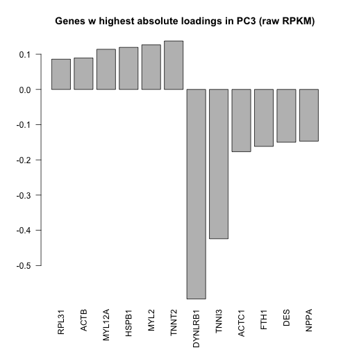 

```r
      print(fpkm.pc3)
```

```
##                 Gene Symbol HPA_heart HPA_brain HPA_kidney AltIso_heart
## ENSG00000111245        MYL2    5291.5       0.2        2.6      16780.4
## ENSG00000101608      MYL12A    2033.5      32.2      214.9        529.0
## ENSG00000175206        NPPA    6693.0       8.1        0.1        193.7
## ENSG00000175084         DES    3403.6       2.4       10.2       3160.1
## ENSG00000159251       ACTC1    2914.4       1.6        0.4       3457.4
## ENSG00000129991       TNNI3    2157.5       0.5        0.1       2698.4
## ENSG00000167996        FTH1     363.8     366.9      498.9       3563.3
## ENSG00000118194       TNNT2    2693.8       7.0       20.8       8074.4
## ENSG00000125971     DYNLRB1     207.8     164.7      170.0       1533.0
## ENSG00000075624        ACTB     423.6     786.5      521.8        377.9
## ENSG00000071082       RPL31     632.0     348.9      561.3       2239.9
## ENSG00000106211       HSPB1     521.6      37.7      196.6       3971.4
##                 AltIso_brain GTEx_heart GTEx_brain GTEx_kidney Atlas_heart
## ENSG00000111245         1.03   15765.18    10.2006      2.3143     1064.50
## ENSG00000101608        28.70    1968.66    54.9994    141.2811      300.41
## ENSG00000175206         1.74     137.69     0.8982      2.7192      311.40
## ENSG00000175084         2.65    5524.18    13.1029      4.9042     1675.89
## ENSG00000159251         0.42    5319.64     3.6530      1.0412      310.07
## ENSG00000129991         0.47    5751.82     4.0958      0.6091      999.56
## ENSG00000167996      9086.14     337.28  1151.6777   1828.0887       43.50
## ENSG00000118194         9.37    2027.96     1.6755     11.8667    10930.80
## ENSG00000125971      2293.04      21.46    42.5226     32.5899       20.87
## ENSG00000075624      3277.02     283.55   782.8235    653.1090       67.06
## ENSG00000071082      1678.90      38.42    99.8055     51.5868      378.92
## ENSG00000106211       643.46     333.52    86.1187    201.8283       61.19
##                 Atlas_brain Atlas_kidney
## ENSG00000111245       0.000        0.358
## ENSG00000101608      15.476       24.862
## ENSG00000175206       0.445        0.131
## ENSG00000175084       4.500        6.252
## ENSG00000159251       0.421        0.311
## ENSG00000129991       0.675        0.132
## ENSG00000167996      53.459       66.455
## ENSG00000118194       8.713       43.633
## ENSG00000125971      42.315       23.413
## ENSG00000075624     140.560       69.191
## ENSG00000071082     484.379      259.057
## ENSG00000106211       6.808       17.175
```
             
Try Anova on a "melted" expression matrix with some metadata, Figure 1d:


```r
m <- melt(published.nozero)
```

```
## Using  as id variables
```

```r
colnames(m) <- c("sample_ID","RPKM")

meta <- sampleinfo_published[,c("Study","Tissue","Preparation","NumberRaw","Numbermapped","Readtype","readlength")]
rownames(meta) <- colnames(published.nozero)
tissue <- rep(meta$Tissue, each=nrow(published.nozero))
study <- rep(meta$Study, each=nrow(published.nozero))
prep <- rep(meta$Preparation, each=nrow(published.nozero))
layout <- rep(meta$Readtype, each=nrow(published.nozero))
raw <- rep(meta$NumberRaw, each=nrow(published.nozero))
mapped <- rep(meta$Numbermapped, each=nrow(published.nozero))
readlen <- rep(meta$readlength, each=nrow(published.nozero))
data <- data.frame(m, tissue=tissue, study=study, prep=prep, layout=layout, readlen=readlen, nraw=raw,nmapped=mapped)
fit <- lm(RPKM ~ layout + readlen + prep + nraw + study + tissue, data=data)
a <- anova(fit)
maxval = 100

barplot(100*a$"Sum Sq"[1:5]/sum(a$"Sum Sq"[1:5]),names.arg=rownames(a[1:5,]),main="Anova, published FPKM/RPKM values",ylim=c(0,maxval))
```

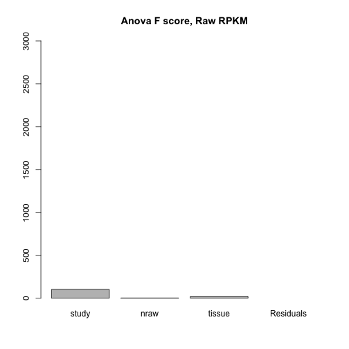 
Try log2 transformation of the published FPKM values:


```r
pseudo <- 1
published.log <- log2(published.nozero + pseudo)
```
Heatmap of Spearman correlations between published expression profiles with log2 values, Figure 2a:


```r
pheatmap(cor(published.log),method="spearman")
```

 

PCA analysis of log2 published FPKM values, Figure 2b:


```r
colors <- c("indianred", "dodgerblue", "forestgreen",
            "indianred", "dodgerblue",
            "indianred", "dodgerblue", "forestgreen", 
            "indianred", "dodgerblue", "forestgreen")

p.log <- prcomp(t(published.log))

shapes <- c(rep(15,3),rep(16,2),rep(17,3),rep(8,3))

plot(p.log$x[,1],p.log$x[,2],pch=shapes,col=colors,xlab=paste("PC1 31% of variance"),ylab=paste("PC2 27% of variance"),main="log2 Published FPKM/RPKM values \n n=13,323")
legend("bottomright",legend=c("Heart","Brain","Kidney"),col=c("indianred", "dodgerblue", "forestgreen"),cex=1.5,pch=20,bty="n")
legend("top",legend=c("HPA","AltIso","GTEx","Atlas"),col="black",pch=c(15,16,17,8),ncol=2)
```

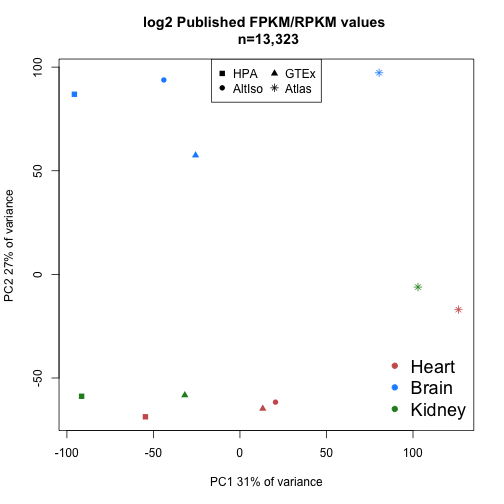 

Figure 2c:


```r
plot(p.log$x[,2],p.log$x[,3],pch=shapes,col=colors,xlab=paste("PC2 27% of variance"),ylab=paste("PC3 19% of variance"),main="log2 Published FPKM values \n n=13,323")
legend("bottomright",legend=c("Heart","Brain","Kidney"),col=c("indianred", "dodgerblue", "forestgreen"),cex=1.5,pch=20,bty="n")
legend("topright",legend=c("HPA","AltIso","GTEx","Atlas"),col="black",pch=c(15,16,17,8),ncol=2)
```

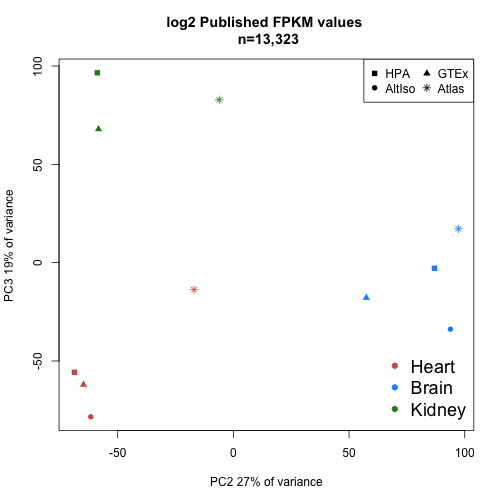 

Cross-validattion by leaving out one of the studies, in this case AltIso, Figure 2d: 


```r
p.loo <- published.log[,-c(4,5)]
colors.loo <- colors[-c(4,5)]
p.loo.log <- prcomp(t(p.loo))

p.add <- published.log[,c(4,5)]
projection <- t(p.add) %*% p.loo.log$rotation

p.original.plus.new <- rbind(p.loo.log$x, projection)
col.original.plus.new <- c(colors.loo, colors[c(4,5)])
plot(p.original.plus.new[,2],p.original.plus.new[,3],pch=c(rep(15,3),rep(17,3),rep(8,3),rep(22,nrow(projection))),col=col.original.plus.new,xlab="PC2",ylab="PC3",main="log2 Published FPKM/RPKM values; AltIso projected onto existing PCs \n n=13,323",xlim=c(-150,100))

legend("bottomleft",legend=c("Heart","Brain","Kidney"),col=c("indianred", "dodgerblue", "forestgreen"),cex=1.5,pch=20,bty="n")
legend("top",legend=c("HPA","GTEx","Atlas","AltIso"),col="black",pch=c(15,17,8,22),ncol=2)
```

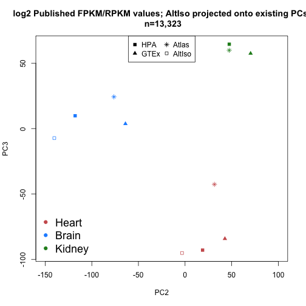 

We can plot all pairwise combinations of principal components 1 to 5. (not shown in paper):


```r
par(mfrow=c(4,4))
for (i in 1:6){
  for(j in 1:6){
    if (i<j){ 
		plot(p.log$x[,i],p.log$x[,j],pch=shapes,col=colors,xlab=paste("PC",i),ylab=paste("PC",j),main="log2 Published FPKM values \n n=13323")
		}
	}
}
```

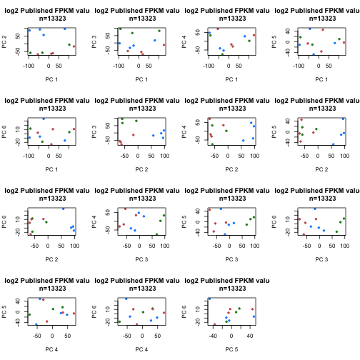 

Look a bit closer at PCs 1-3 in prcomp (not shown in paper):


```r
     #PC1:
     load.pc1 <- p.log$rotation[,1][order(p.log$rotation[,1])]
     extreme.pc1 <- c(tail(load.pc1), head(load.pc1))

     extreme.pc1.ensg <- names(extreme.pc1)
     extreme.pc1.symbols <- getBM(attributes=c("ensembl_gene_id", "hgnc_symbol"), 
                           filters = "ensembl_gene_id",
                           values=extreme.pc1.ensg,
                           mart=ensembl)
     
      q <- extreme.pc1.symbols[,2]
      names(q) <- extreme.pc1.symbols[,1]

      fpkm.log.pc1 <- cbind(q[extreme.pc1.ensg],published.nozero[extreme.pc1.ensg,])
      names(fpkm.log.pc1)[names(fpkm.log.pc1) == 'q[extreme.pc1.ensg]'] <- 'Gene Symbol'
      
      barplot(extreme.pc1, names.arg=q[extreme.pc1.ensg],las=2,main="Genes w highest absolute loadings in PC1 (log2 RPKM)")
```

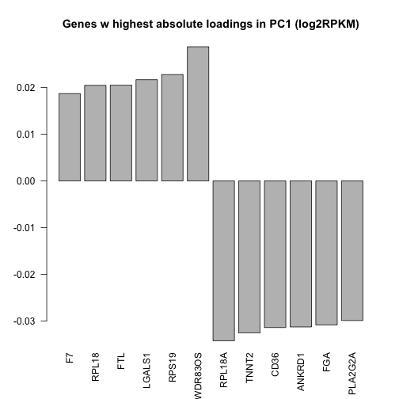 

```r
      print(fpkm.log.pc1)
```

```
##                 Gene Symbol HPA_heart HPA_brain HPA_kidney AltIso_heart
## ENSG00000171560         FGA       0.0       0.0        0.7         0.00
## ENSG00000148677      ANKRD1    2451.5       0.2        0.3      1088.94
## ENSG00000135218        CD36     499.4       2.6        8.0       132.46
## ENSG00000057593          F7       0.2       0.3        0.3         0.00
## ENSG00000118194       TNNT2    2693.8       7.0       20.8      8074.39
## ENSG00000188257     PLA2G2A      51.2       0.8        2.3       210.68
## ENSG00000105372       RPS19     419.2     268.3      453.6       118.30
## ENSG00000063177       RPL18     455.9     237.8      458.0       205.67
## ENSG00000100097      LGALS1     498.7     113.2       77.2       389.82
## ENSG00000105640      RPL18A      45.8      31.3       68.1       505.42
## ENSG00000105583     WDR83OS     132.7      52.6       99.0        23.17
## ENSG00000087086         FTL     436.5     487.2     1523.1       463.86
##                 AltIso_brain GTEx_heart GTEx_brain GTEx_kidney Atlas_heart
## ENSG00000171560         0.00  0.000e+00     0.0000      6.4728      63.271
## ENSG00000148677         0.10  1.471e+03     2.0740      0.5602    3863.610
## ENSG00000135218         0.08  1.551e+02     0.5914      0.3047     894.983
## ENSG00000057593         0.30  6.089e-03     0.1806      0.4763      26.652
## ENSG00000118194         9.37  2.028e+03     1.6755     11.8667   10930.800
## ENSG00000188257         0.00  2.314e+00     0.4622      0.4419    2351.218
## ENSG00000105372       140.77  1.181e+02   324.9812    306.6752       3.360
## ENSG00000063177       284.33  1.004e+02   159.0170    134.4763       3.984
## ENSG00000100097       161.11  1.838e+02   216.8468     58.2166       2.138
## ENSG00000105640       422.37  4.883e+01    55.6920     60.6585       0.000
## ENSG00000105583        26.35  6.529e+01    62.2844     80.6909       0.411
## ENSG00000087086       407.35  5.738e+02  2099.7219   5310.5093      16.930
##                 Atlas_brain Atlas_kidney
## ENSG00000171560       0.000       25.045
## ENSG00000148677       0.403        0.263
## ENSG00000135218       8.763       17.456
## ENSG00000057593      15.712       19.155
## ENSG00000118194       8.713       43.633
## ENSG00000188257       3.057       24.728
## ENSG00000105372       2.945        3.123
## ENSG00000063177       5.143        2.603
## ENSG00000100097       1.154        0.332
## ENSG00000105640       0.000        0.000
## ENSG00000105583       0.352        0.452
## ENSG00000087086       7.700       40.892
```

```r
      #PC2:
      load.pc2 <- p.log$rotation[,2][order(p.log$rotation[,2])]
      extreme.pc2 <- c(tail(load.pc2), head(load.pc2))
      
      extreme.pc2.ensg <- names(extreme.pc2)
      extreme.pc2.symbols <- getBM(attributes=c("ensembl_gene_id", "hgnc_symbol"), 
                           filters = "ensembl_gene_id",
                           values=extreme.pc2.ensg,
                           mart=ensembl)

      q <- extreme.pc2.symbols[,2]
      names(q) <- extreme.pc2.symbols[,1]
      
      fpkm.log.pc2 <- cbind(q[extreme.pc2.ensg],published.nozero[extreme.pc2.ensg,])
      names(fpkm.log.pc2)[names(fpkm.log.pc2) == 'q[extreme.pc2.ensg]'] <- 'Gene Symbol'
      
      barplot(extreme.pc2, names.arg=q[extreme.pc2.ensg],las=2,main="Genes w highest absolute loadings in PC2 (log2 RPKM)")
```

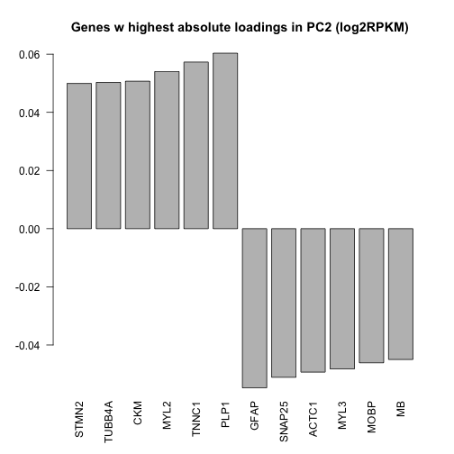 

```r
      print(fpkm.log.pc2)
```

```
##                 Gene Symbol HPA_heart HPA_brain HPA_kidney AltIso_heart
## ENSG00000168314        MOBP       0.0     138.0        0.1         0.00
## ENSG00000104833      TUBB4A       0.3     235.1        1.5         2.94
## ENSG00000104435       STMN2       0.1     235.9        0.2         0.00
## ENSG00000132639      SNAP25       1.2     802.9        1.7         0.15
## ENSG00000123560        PLP1      11.9    1295.2        0.7         2.56
## ENSG00000131095        GFAP       3.0    1372.0        1.4         1.70
## ENSG00000111245        MYL2    5291.5       0.2        2.6     16780.36
## ENSG00000114854       TNNC1    3087.9       0.3       14.0      4100.03
## ENSG00000160808        MYL3    1213.4       3.2       24.9      3909.81
## ENSG00000198125          MB    3937.3       0.9        2.3      7065.54
## ENSG00000104879         CKM    1172.0       0.1        2.6      3321.37
## ENSG00000159251       ACTC1    2914.4       1.6        0.4      3457.43
##                 AltIso_brain GTEx_heart GTEx_brain GTEx_kidney Atlas_heart
## ENSG00000168314       100.74  6.864e-03    486.669     0.02784       0.176
## ENSG00000104833      2038.44  5.334e-01    387.557     1.91307       0.408
## ENSG00000104435       176.88  1.790e-02    217.035     0.15558       0.105
## ENSG00000132639       535.77  3.758e-02    117.303     0.65681       0.346
## ENSG00000123560      1544.93  2.432e+00   1164.716     0.41628       5.086
## ENSG00000131095       834.13  1.671e+00   3633.817     0.85376       0.549
## ENSG00000111245         1.03  1.577e+04     10.201     2.31427    1064.500
## ENSG00000114854         0.69  2.618e+03      3.013     5.23761     316.135
## ENSG00000160808         0.84  3.997e+03      5.829    19.84928      80.668
## ENSG00000198125         1.35  2.706e+03      2.692     0.69784    1415.554
## ENSG00000104879         0.26  2.775e+03      4.498     1.39116      57.889
## ENSG00000159251         0.42  5.320e+03      3.653     1.04124     310.068
##                 Atlas_brain Atlas_kidney
## ENSG00000168314     153.127        0.139
## ENSG00000104833      82.655        0.389
## ENSG00000104435     139.464        0.000
## ENSG00000132639     284.680        0.180
## ENSG00000123560     779.755        0.513
## ENSG00000131095     691.908        0.135
## ENSG00000111245       0.000        0.358
## ENSG00000114854       0.763        1.014
## ENSG00000160808       0.204        2.634
## ENSG00000198125       0.032        0.000
## ENSG00000104879       0.000        0.060
## ENSG00000159251       0.421        0.311
```

```r
      #PC3:
      load.pc3 <- p.log$rotation[,3][order(p$rotation[,3])]
      extreme.pc3 <- c(tail(load.pc3), head(load.pc3))
      
      extreme.pc3.ensg <- names(extreme.pc3)
      extreme.pc3.symbols <- getBM(attributes=c("ensembl_gene_id", "hgnc_symbol"), 
                           filters = "ensembl_gene_id",
                           values=extreme.pc3.ensg,
                           mart=ensembl)
      
      q <- extreme.pc3.symbols[,2]
      names(q) <- extreme.pc3.symbols[,1]
      
      fpkm.log.pc3 <- cbind(q[extreme.pc3.ensg],published.nozero[extreme.pc3.ensg,])
      names(fpkm.log.pc3)[names(fpkm.log.pc3) == 'q[extreme.pc3.ensg]'] <- 'Gene Symbol'
      
      barplot(extreme.pc3, names.arg=q[extreme.pc3.ensg],las=2,main="Genes w highest absolute loadings in PC3 (log2 RPKM)")
```

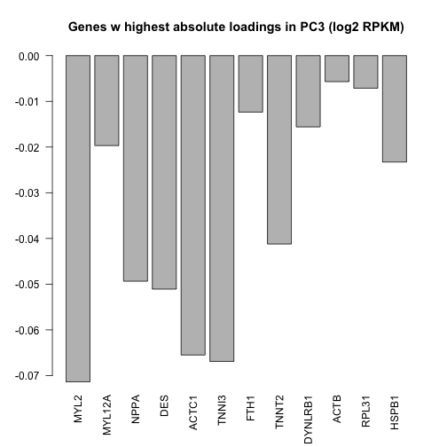 

```r
      print(fpkm.log.pc3)
```

```
##                 Gene Symbol HPA_heart HPA_brain HPA_kidney AltIso_heart
## ENSG00000111245        MYL2    5291.5       0.2        2.6      16780.4
## ENSG00000101608      MYL12A    2033.5      32.2      214.9        529.0
## ENSG00000175206        NPPA    6693.0       8.1        0.1        193.7
## ENSG00000175084         DES    3403.6       2.4       10.2       3160.1
## ENSG00000159251       ACTC1    2914.4       1.6        0.4       3457.4
## ENSG00000129991       TNNI3    2157.5       0.5        0.1       2698.4
## ENSG00000167996        FTH1     363.8     366.9      498.9       3563.3
## ENSG00000118194       TNNT2    2693.8       7.0       20.8       8074.4
## ENSG00000125971     DYNLRB1     207.8     164.7      170.0       1533.0
## ENSG00000075624        ACTB     423.6     786.5      521.8        377.9
## ENSG00000071082       RPL31     632.0     348.9      561.3       2239.9
## ENSG00000106211       HSPB1     521.6      37.7      196.6       3971.4
##                 AltIso_brain GTEx_heart GTEx_brain GTEx_kidney Atlas_heart
## ENSG00000111245         1.03   15765.18    10.2006      2.3143     1064.50
## ENSG00000101608        28.70    1968.66    54.9994    141.2811      300.41
## ENSG00000175206         1.74     137.69     0.8982      2.7192      311.40
## ENSG00000175084         2.65    5524.18    13.1029      4.9042     1675.89
## ENSG00000159251         0.42    5319.64     3.6530      1.0412      310.07
## ENSG00000129991         0.47    5751.82     4.0958      0.6091      999.56
## ENSG00000167996      9086.14     337.28  1151.6777   1828.0887       43.50
## ENSG00000118194         9.37    2027.96     1.6755     11.8667    10930.80
## ENSG00000125971      2293.04      21.46    42.5226     32.5899       20.87
## ENSG00000075624      3277.02     283.55   782.8235    653.1090       67.06
## ENSG00000071082      1678.90      38.42    99.8055     51.5868      378.92
## ENSG00000106211       643.46     333.52    86.1187    201.8283       61.19
##                 Atlas_brain Atlas_kidney
## ENSG00000111245       0.000        0.358
## ENSG00000101608      15.476       24.862
## ENSG00000175206       0.445        0.131
## ENSG00000175084       4.500        6.252
## ENSG00000159251       0.421        0.311
## ENSG00000129991       0.675        0.132
## ENSG00000167996      53.459       66.455
## ENSG00000118194       8.713       43.633
## ENSG00000125971      42.315       23.413
## ENSG00000075624     140.560       69.191
## ENSG00000071082     484.379      259.057
## ENSG00000106211       6.808       17.175
```

To further validate the above results, indicating that tissue specificity appears mainly in PC 2 and 3, we will extract the 500 genes with highest loadings in each component and plot the corresponding published FPKM values in a heatmap (not shown in paper):


```r
     load.pc1 <- abs(p.log$rotation[,1])[order(abs(p.log$rotation[,1]),decreasing=TRUE)]
     top.pc1 <- names(load.pc1[1:500]) 

     load.pc2 <- abs(p.log$rotation[,2])[order(abs(p.log$rotation[,2]),decreasing=TRUE)]
     top.pc2 <- names(load.pc2[1:500])

     load.pc3 <- abs(p.log$rotation[,3])[order(abs(p.log$rotation[,3]),decreasing=TRUE)]
     top.pc3 <- names(load.pc3[1:500])

     pheatmap(cor(published[top.pc1,]),method="spearman")
```

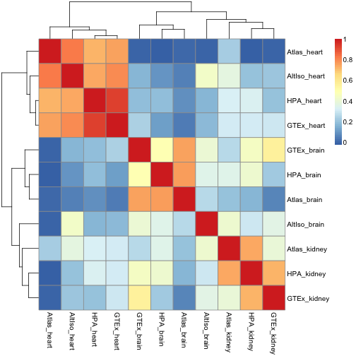 

```r
     pheatmap(cor(published[top.pc2,]),method="spearman")
```

 

```r
     pheatmap(cor(published[top.pc3,]),method="spearman")
```

 

Try Anova on a "melted" expression matrix with logged values and some metadata, Figure 2e:


```r
n <- melt(published.log)
```

```
## Using  as id variables
```

```r
colnames(n) <- c("sample_ID","RPKM")
meta <- sampleinfo_published[,c("Study","Tissue","Preparation","NumberRaw","Numbermapped","Readtype","readlength")]
rownames(meta) <- colnames(published.log)
tissue <- rep(meta$Tissue, each=nrow(published.log))
study <- rep(meta$Study, each=nrow(published.log))
prep <- rep(meta$Preparation, each=nrow(published.log))
layout <- rep(meta$Readtype, each=nrow(published.log))
raw <- rep(meta$NumberRaw, each=nrow(published.log))
mapped <- rep(meta$Numbermapped, each=nrow(published.log))
readlen <- rep(meta$readlength, each=nrow(published.log))

data <- data.frame(n, tissue=tissue, study=study, prep=prep, layout=layout,nraw=raw,nmapped=mapped, readlen=readlen)
fit <- lm(RPKM ~ layout + readlen + prep + nraw + study + tissue, data=data)
b <- anova(fit)
maxval = 100

barplot(100*b$"Sum Sq"[1:5]/sum(b$"Sum Sq"[1:5]),names.arg=rownames(b[1:5,]),main="Anova, log2 reprocessed FPKM/RPKM values",ylim=c(0,maxval))
```

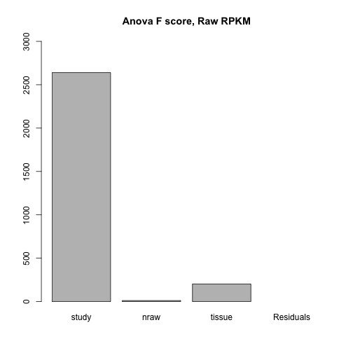 
Another way is to do SVA:

```r
mod <- model.matrix(~as.factor(Tissue), data=sampleinfo_published)
mod0 <- model.matrix(~1, data=sampleinfo_published)
n.sv <- num.sv(cufflinks_log,mod,method="leek")
```

```
## Error: object 'cufflinks_log' not found
```

```r
svobj <- sva(as.matrix(cufflinks_log),mod,mod0,n.sv=n.sv)
```

```
## Error: object 'n.sv' not found
```

```r
surr <- svobj$sv
```

```
## Error: object 'svobj' not found
```
What are the surrogate variables correlated to?

```r
par(mfrow=c(2,1))
for (i in c(1,2)){
ps <- rep(1,5)
names(ps) <- c("Preparation", "Study", "NumberRaw", "Readtype", "Readlength")
ps[1] <- cor.test(surr[,i], as.numeric(sampleinfo_cufflinks$Preparation))$p.value
ps[2] <- cor.test(surr[,i], as.numeric(sampleinfo_cufflinks$Study))$p.value
ps[3] <- cor.test(surr[,i], as.numeric(sampleinfo_cufflinks$NumberRaw))$p.value
ps[4] <- cor.test(surr[,i], as.numeric(sampleinfo_cufflinks$Readtype))$p.value
ps[5] <- cor.test(surr[,i], as.numeric(sampleinfo_cufflinks$readlength))$p.value
barplot(-log(ps),las=2)
}
```

```
## Error: object 'surr' not found
```

Combat analysis is performed on log2 values (n=13,323):


```r
meta <- data.frame(study=c(rep("HPA",3),rep("AltIso",2),rep("GTex",3),rep("Atlas",3)),tissue=c("Heart","Brain","Kidney","Heart","Brain","Heart","Brain","Kidney","Heart","Brain","Kidney"))

batch <- meta$study
design <- model.matrix(~1,data=meta)
combat <- ComBat(dat=published.log,batch=batch,mod=design,numCovs=NULL,par.prior=TRUE)
```

```
## Found 4 batches
## Found 0  categorical covariate(s)
## Standardizing Data across genes
## Fitting L/S model and finding priors
## Finding parametric adjustments
## Adjusting the Data
```

Heatmap of Spearman correlations between published expression profiles after combat run (# genes = 13,323), Figure 3a:


```r
pheatmap(cor(combat, method="spearman")) 
```

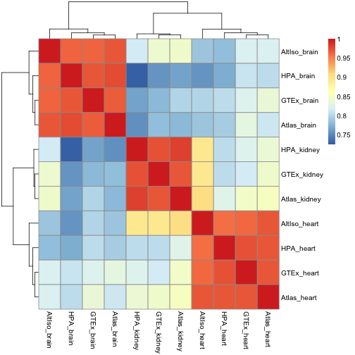 

PCA analysis of published FPKM values after combat run, Figure 3b:


```r
colors <- c("indianred", "dodgerblue", "forestgreen",
            "indianred", "dodgerblue",
            "indianred", "dodgerblue", "forestgreen", 
            "indianred", "dodgerblue", "forestgreen")

p.combat <- prcomp(t(combat))

shapes <- c(rep(15,3),rep(16,2),rep(17,3),rep(8,3))

plot(p.combat$x[,1],p.combat$x[,2],pch=shapes,col=colors,xlab=paste("PC1 54% of variance"),ylab=paste("PC2 38% of variance"),main="Published FPKM values \n COMBAT \n n=13,323")
legend("bottomright",legend=c("Heart","Brain","Kidney"),col=c("indianred", "dodgerblue", "forestgreen"),cex=1.5,pch=20,bty="n")
legend("topright",legend=c("HPA","AltIso","GTEx","Atlas"),col="black",pch=c(15,16,17,8),ncol=2)
```

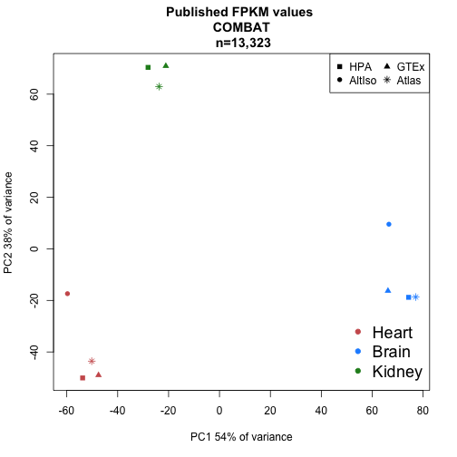 

We can plot all pairwise combinations of principal components 1 to 5. (not shown in paper):


```r
par(mfrow=c(4,4))
for (i in 1:6){
  for(j in 1:6){
    if (i<j){ 
		plot(p.combat$x[,i],p.combat$x[,j],pch=shapes,col=colors,xlab=paste("PC",i),ylab=paste("PC",j),main="Published FPKM values \n COMBAT \ n=13323")
		}
	}
}
```

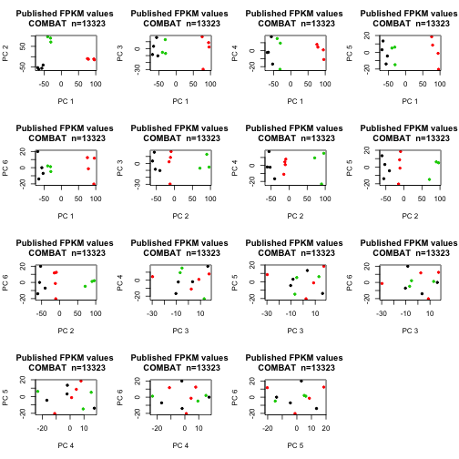 

Look a bit closer at PCs 1-3 in prcomp (not shown in paper):


```r
     #PC1:
     load.pc1 <- p.combat$rotation[,1][order(p.combat$rotation[,1])]
     extreme.pc1 <- c(tail(load.pc1), head(load.pc1))

     extreme.pc1.ensg <- names(extreme.pc1)
     extreme.pc1.symbols <- getBM(attributes=c("ensembl_gene_id", "hgnc_symbol"), 
                           filters = "ensembl_gene_id",
                           values=extreme.pc1.ensg,
                           mart=ensembl)

      q <- extreme.pc1.symbols[,2]
      names(q) <- extreme.pc1.symbols[,1]

      fpkm.combat.pc1 <- cbind(q[extreme.pc1.ensg],published.nozero[extreme.pc1.ensg,])
      names(fpkm.combat.pc1)[names(fpkm.combat.pc1) == 'q[extreme.pc1.ensg]'] <- 'Gene Symbol'
      
      barplot(extreme.pc1, names.arg=q[extreme.pc1.ensg],las=2,main="Genes w highest absolute loadings in PC1 (ComBat log2 RPKM)")
```

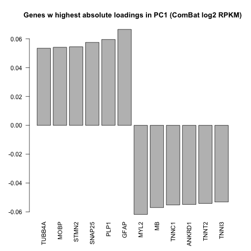 

```r
      print(fpkm.combat.pc1)
```

```
##                 Gene Symbol HPA_heart HPA_brain HPA_kidney AltIso_heart
## ENSG00000104833      TUBB4A       0.3     235.1        1.5         2.94
## ENSG00000168314        MOBP       0.0     138.0        0.1         0.00
## ENSG00000104435       STMN2       0.1     235.9        0.2         0.00
## ENSG00000132639      SNAP25       1.2     802.9        1.7         0.15
## ENSG00000123560        PLP1      11.9    1295.2        0.7         2.56
## ENSG00000131095        GFAP       3.0    1372.0        1.4         1.70
## ENSG00000111245        MYL2    5291.5       0.2        2.6     16780.36
## ENSG00000198125          MB    3937.3       0.9        2.3      7065.54
## ENSG00000114854       TNNC1    3087.9       0.3       14.0      4100.03
## ENSG00000148677      ANKRD1    2451.5       0.2        0.3      1088.94
## ENSG00000118194       TNNT2    2693.8       7.0       20.8      8074.39
## ENSG00000129991       TNNI3    2157.5       0.5        0.1      2698.36
##                 AltIso_brain GTEx_heart GTEx_brain GTEx_kidney Atlas_heart
## ENSG00000104833      2038.44  5.334e-01    387.557     1.91307       0.408
## ENSG00000168314       100.74  6.864e-03    486.669     0.02784       0.176
## ENSG00000104435       176.88  1.790e-02    217.035     0.15558       0.105
## ENSG00000132639       535.77  3.758e-02    117.303     0.65681       0.346
## ENSG00000123560      1544.93  2.432e+00   1164.716     0.41628       5.086
## ENSG00000131095       834.13  1.671e+00   3633.817     0.85376       0.549
## ENSG00000111245         1.03  1.577e+04     10.201     2.31427    1064.500
## ENSG00000198125         1.35  2.706e+03      2.692     0.69784    1415.554
## ENSG00000114854         0.69  2.618e+03      3.013     5.23761     316.135
## ENSG00000148677         0.10  1.471e+03      2.074     0.56016    3863.610
## ENSG00000118194         9.37  2.028e+03      1.675    11.86674   10930.800
## ENSG00000129991         0.47  5.752e+03      4.096     0.60909     999.559
##                 Atlas_brain Atlas_kidney
## ENSG00000104833      82.655        0.389
## ENSG00000168314     153.127        0.139
## ENSG00000104435     139.464        0.000
## ENSG00000132639     284.680        0.180
## ENSG00000123560     779.755        0.513
## ENSG00000131095     691.908        0.135
## ENSG00000111245       0.000        0.358
## ENSG00000198125       0.032        0.000
## ENSG00000114854       0.763        1.014
## ENSG00000148677       0.403        0.263
## ENSG00000118194       8.713       43.633
## ENSG00000129991       0.675        0.132
```

```r
      #PC2:
      load.pc2 <- p.combat$rotation[,2][order(p.combat$rotation[,2])]
      extreme.pc2 <- c(tail(load.pc2), head(load.pc2))

      extreme.pc2.ensg <- names(extreme.pc2)
      extreme.pc2.symbols <- getBM(attributes=c("ensembl_gene_id", "hgnc_symbol"), 
                           filters = "ensembl_gene_id",
                           values=extreme.pc2.ensg,
                           mart=ensembl)
      q <- extreme.pc2.symbols[,2]
      names(q) <- extreme.pc2.symbols[,1]

      fpkm.combat.pc2 <- cbind(q[extreme.pc2.ensg],published.nozero[extreme.pc2.ensg,])
      names(fpkm.combat.pc2)[names(fpkm.combat.pc2) == 'q[extreme.pc2.ensg]'] <- 'Gene Symbol'
      
      barplot(extreme.pc2, names.arg=q[extreme.pc2.ensg],las=2,main="Genes w highest absolute loadings in PC2 (ComBat log2 RPKM)")
```

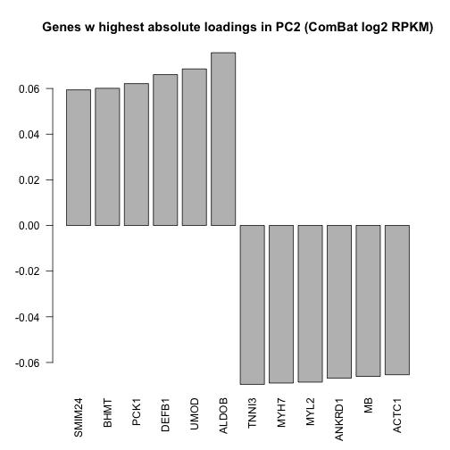 

```r
      print(fpkm.combat.pc2)
```

```
##                 Gene Symbol HPA_heart HPA_brain HPA_kidney AltIso_heart
## ENSG00000095932      SMIM24       0.1       2.2      424.6         0.00
## ENSG00000145692        BHMT       0.0       1.0      538.5         0.00
## ENSG00000124253        PCK1       0.5       0.7      489.6         0.93
## ENSG00000164825       DEFB1       0.1       0.6      662.2         0.84
## ENSG00000169344        UMOD       0.1       1.5     1425.7         0.00
## ENSG00000136872       ALDOB       0.4       2.4     1824.1         0.00
## ENSG00000129991       TNNI3    2157.5       0.5        0.1      2698.36
## ENSG00000092054        MYH7    1802.4       2.1        0.8      4117.17
## ENSG00000111245        MYL2    5291.5       0.2        2.6     16780.36
## ENSG00000148677      ANKRD1    2451.5       0.2        0.3      1088.94
## ENSG00000198125          MB    3937.3       0.9        2.3      7065.54
## ENSG00000159251       ACTC1    2914.4       1.6        0.4      3457.43
##                 AltIso_brain GTEx_heart GTEx_brain GTEx_kidney Atlas_heart
## ENSG00000095932         3.06  0.000e+00    0.75338    237.5330       0.000
## ENSG00000145692         0.26  1.949e-02    0.04664    210.6384       0.052
## ENSG00000124253         0.00  1.512e-02    1.43248   1107.3146       0.923
## ENSG00000164825         0.22  1.320e-01    0.37882    726.4011       0.000
## ENSG00000169344         0.00  0.000e+00    0.00000    285.9097       0.000
## ENSG00000136872         0.49  1.630e-01    0.22985   1927.8312       1.452
## ENSG00000129991         0.47  5.752e+03    4.09582      0.6091     999.559
## ENSG00000092054         0.83  4.714e+03    6.48698      0.6887    2137.510
## ENSG00000111245         1.03  1.577e+04   10.20060      2.3143    1064.500
## ENSG00000148677         0.10  1.471e+03    2.07400      0.5602    3863.610
## ENSG00000198125         1.35  2.706e+03    2.69152      0.6978    1415.554
## ENSG00000159251         0.42  5.320e+03    3.65304      1.0412     310.068
##                 Atlas_brain Atlas_kidney
## ENSG00000095932       0.042      109.653
## ENSG00000145692       0.106      116.957
## ENSG00000124253       0.099      127.729
## ENSG00000164825       0.082      179.618
## ENSG00000169344       0.000      371.344
## ENSG00000136872       0.125      788.910
## ENSG00000129991       0.675        0.132
## ENSG00000092054       0.635        0.354
## ENSG00000111245       0.000        0.358
## ENSG00000148677       0.403        0.263
## ENSG00000198125       0.032        0.000
## ENSG00000159251       0.421        0.311
```

```r
      #PC3:
      load.pc3 <- p.combat$rotation[,3][order(p.combat$rotation[,3])]
      extreme.pc3 <- c(tail(load.pc3), head(load.pc3))

      extreme.pc3.ensg <- names(extreme.pc3)
      extreme.pc3.symbols <- getBM(attributes=c("ensembl_gene_id", "hgnc_symbol"), 
                           filters = "ensembl_gene_id",
                           values=extreme.pc3.ensg,
                           mart=ensembl)

      q <- extreme.pc3.symbols[,2]
      names(q) <- extreme.pc3.symbols[,1]

      fpkm.combat.pc3 <- cbind(q[extreme.pc3.ensg],published.nozero[extreme.pc3.ensg,])
      names(fpkm.combat.pc3)[names(fpkm.combat.pc3) == 'q[extreme.pc3.ensg]'] <- 'Gene Symbol'
      
      barplot(extreme.pc3, names.arg=q[extreme.pc3.ensg],las=2,main="Genes w highest absolute loadings in PC3 (ComBat log2 RPKM)")
```

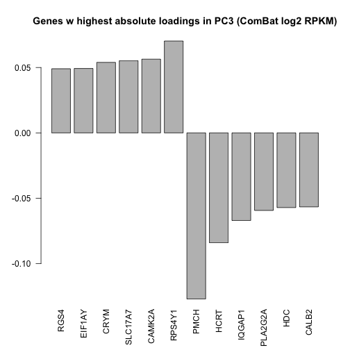 

```r
      print(fpkm.combat.pc3)
```

```
##                 Gene Symbol HPA_heart HPA_brain HPA_kidney AltIso_heart
## ENSG00000163631         ALB       0.8       0.8      327.6         0.00
## ENSG00000173432        SAA1       0.6       1.3        1.2         5.20
## ENSG00000161610        HCRT       0.0       0.0        0.1         0.00
## ENSG00000140575      IQGAP1      22.5      15.9       40.6         6.29
## ENSG00000188257     PLA2G2A      51.2       0.8        2.3       210.68
## ENSG00000183395        PMCH       0.2       0.0        0.0         0.13
## ENSG00000129824      RPS4Y1      40.8      53.7       60.9        66.40
## ENSG00000170345         FOS     147.3     116.7      288.4         6.23
## ENSG00000104888     SLC17A7       1.1     263.4        0.5         0.84
## ENSG00000103316        CRYM     124.5      58.4       43.4        30.53
## ENSG00000070808      CAMK2A       8.8     134.7        1.2         1.63
## ENSG00000170579      DLGAP1       0.4      57.5        0.8         0.00
##                 AltIso_brain GTEx_heart GTEx_brain GTEx_kidney Atlas_heart
## ENSG00000163631         0.00  6.669e-02     0.6302    12.09975      37.193
## ENSG00000173432         0.00  2.748e-02     0.5260     9.07668     110.718
## ENSG00000161610         0.00  0.000e+00   165.0033     0.04222       0.000
## ENSG00000140575         4.86  1.251e+01   331.6092    14.63416      28.961
## ENSG00000188257         0.00  2.314e+00     0.4622     0.44191    2351.218
## ENSG00000183395         0.14  0.000e+00  2045.6382     0.00000       0.000
## ENSG00000129824        45.76  8.935e+01     0.6486    86.30981      30.176
## ENSG00000170345        20.94  2.698e+02     8.9939    29.33131      15.149
## ENSG00000104888       311.50  1.172e+00     0.5592     0.32666       0.044
## ENSG00000103316        38.56  6.342e+01     4.4874    48.14844       7.586
## ENSG00000070808       322.44  1.065e+00     3.2227     0.08715       1.640
## ENSG00000170579        56.90  4.434e-03     1.1074     0.42644       0.241
##                 Atlas_brain Atlas_kidney
## ENSG00000163631       0.152       24.347
## ENSG00000173432       0.000       35.264
## ENSG00000161610       0.197        0.000
## ENSG00000140575       8.308       23.509
## ENSG00000188257       3.057       24.728
## ENSG00000183395       0.050        0.000
## ENSG00000129824      42.832       14.097
## ENSG00000170345      41.809       34.855
## ENSG00000104888      11.004        0.019
## ENSG00000103316      20.478        5.674
## ENSG00000070808     131.757        0.144
## ENSG00000170579      53.706        0.905
```

Revisit Anova with combated values, Figure 3c:


```r
o <- melt(combat)
```

```
## Using  as id variables
```

```r
colnames(o) <- c("sample_ID","combat")
meta <- sampleinfo_published[,c("Study","Tissue","Preparation","NumberRaw","Numbermapped","Readtype","readlength")]
rownames(meta) <- colnames(combat)
tissue <- rep(meta$Tissue, each=nrow(combat))
study <- rep(meta$Study, each=nrow(combat))
prep <- rep(meta$Preparation, each=nrow(combat))
layout <- rep(meta$Readtype, each=nrow(combat))
raw <- rep(meta$NumberRaw, each=nrow(combat))
mapped <- rep(meta$Numbermapped, each=nrow(combat))
readlen <- rep(meta$readlength, each=nrow(combat))
data <- data.frame(o, tissue=tissue, study=study, prep=prep, layout=layout,nraw=raw,nmapped=mapped,readlen=readlen)
fit <- lm(combat ~ layout + readlen + prep + nraw + study + tissue, data=data)
c <- anova(fit)
maxval = 100

barplot(100*c$"Sum Sq"[1:5]/sum(c$"Sum Sq"[1:5]),names.arg=rownames(c[1:5,]),main="Anova Combat",ylim=c(0,maxval))
```

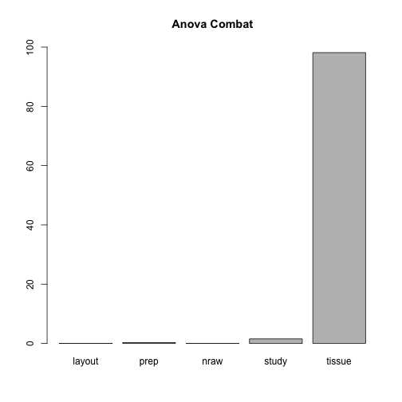 

Comparing FPKMs for FASTQ files reprocessed with TopHat and Cufflinks:


```r
cufflinks <- read.delim("fpkm_table_tophat.txt")

sampleinfo_cufflinks <- read.delim("sample_info_reprocessed.txt")
```

First, we will restrict the data set to only include protein coding genes using the ensembl based R package biomaRt:


```r
gene_ids <- as.vector(cufflinks[,1])

ensembl = useMart("ensembl", dataset = "hsapiens_gene_ensembl") #select the ensembl database

gene_type <- getBM(attributes=c("ensembl_gene_id", "gene_biotype"), 
                   filters = "ensembl_gene_id",
                   values=gene_ids,
                   mart=ensembl)
```

```
## Error: Query ERROR: caught BioMart::Exception: non-BioMart die(): 
## not well-formed (invalid token) at line 1, column 336, byte 336 at /usr/lib/perl5/XML/Parser.pm line 187
```

```r
pc <- subset(gene_type[,1],gene_type[,2]=="protein_coding")
```

```
## Error: error in evaluating the argument 'x' in selecting a method for function 'subset': Error: object 'gene_type' not found
```

```r
cufflinks_pc <- cufflinks[match(pc,cufflinks[,1]),]
```

```
## Error: error in evaluating the argument 'x' in selecting a method for function 'match': Error: object 'pc' not found
```

Let's remove all lines where FPKM is close to zero in all samples before we proceed with this version of the data set:


```r
cufflinks_pc_nozero <- cufflinks_pc[-which(rowSums(cufflinks_pc[,3:16])<=0.01),]
```

```
## Error: object 'cufflinks_pc' not found
```

Heatmap of Spearman correlations between reprocessed expression profiles (# genes = 19,475), Figure 4a:


```r
pheatmap(cor(cufflinks_pc_nozero[,3:16], method="spearman")) 
```

```
## Error: object 'cufflinks_pc_nozero' not found
```

Let's look at a few PCA plots, Figure 4b:


```r
cufflinks_fpkms <- cufflinks_pc_nozero[,3:16]
```

```
## Error: object 'cufflinks_pc_nozero' not found
```

```r
rownames(cufflinks_fpkms) <- cufflinks_pc_nozero[,1]
```

```
## Error: object 'cufflinks_pc_nozero' not found
```

```r
p.cufflinks <- prcomp(t(cufflinks_fpkms))
```

```
## Error: object 'cufflinks_fpkms' not found
```

```r
colors <- c("dodgerblue", "indianred", "forestgreen",
            "dodgerblue", "indianred", "forestgreen",
            "dodgerblue", "indianred", "forestgreen",
            "dodgerblue", "indianred", "forestgreen",
            "dodgerblue", "indianred")          

shapes_cufflinks <- c(rep(11,3),rep(8,3),rep(17,3),rep(15,3),rep(16,2))

plot(p.cufflinks$x[,1],p.cufflinks$x[,2],pch=shapes_cufflinks,col=colors,xlab=paste("PC1 87% of variance"),ylab=paste("PC2 7.7% of variance"),main="Reprocessed FPKM values \n n=19,475")
```

```
## Error: object 'p.cufflinks' not found
```

```r
legend("bottomright",legend=c("Heart","Brain","Kidney"),col=c("indianred", "dodgerblue", "forestgreen"),cex=1.5,pch=20,bty="n")
```

```
## Error: plot.new has not been called yet
```

```r
legend("top",legend=c("EoGE","Atlas","BodyMap","HPA","AltIso"),col="black",pch=c(11,8,17,15,16),ncol=2)
```

```
## Error: plot.new has not been called yet
```

We can plot all pairwise combinations of principal components 1 to 5 (not shown in paper):


```r
colors <- c("dodgerblue", "indianred", "forestgreen",
            "dodgerblue", "indianred", "forestgreen",
            "dodgerblue", "indianred", "forestgreen",
            "dodgerblue", "indianred", "forestgreen",
            "dodgerblue", "indianred")

par(mfrow=c(4,4))
for (i in 1:6){
  for(j in 1:6){
    if (i<j){ 
      plot(p.cufflinks$x[,i],p.cufflinks$x[,j],pch=shapes_cufflinks,col=colors,xlab=paste("PC",i),ylab=paste("PC",j),main="Cufflinks FPKM values \n n=19475")
		}
	}
}
```

```
## Error: object 'p.cufflinks' not found
```

Look at PCA loadings for PC1-3 (not shown in paper):


```r
      #PC1:
      load.pc1 <- p.cufflinks$rotation[,1][order(p.cufflinks$rotation[,1])]
```

```
## Error: object 'p.cufflinks' not found
```

```r
      extreme.pc1 <- c(tail(load.pc1), head(load.pc1))
      
      extreme.pc1.ensg <- names(extreme.pc1)
      extreme.pc1.symbols <- getBM(attributes=c("ensembl_gene_id", "hgnc_symbol"), 
                           filters = "ensembl_gene_id",
                           values=extreme.pc1.ensg,
                           mart=ensembl)
      
      q <- extreme.pc1.symbols[,2]
      names(q) <- extreme.pc1.symbols[,1]
      
      fpkm.cuff.pc1 <- cbind(q[extreme.pc1.ensg],cufflinks_fpkms[extreme.pc1.ensg,])
```

```
## Error: object 'cufflinks_fpkms' not found
```

```r
      names(fpkm.cuff.pc1)[names(fpkm.cuff.pc1) == 'q[extreme.pc1.ensg]'] <- 'Gene Symbol'
```

```
## Error: object 'fpkm.cuff.pc1' not found
```

```r
      barplot(extreme.pc1, names.arg=q[extreme.pc1.ensg],las=2,main="Genes w highest absolute loadings in PC1 (raw Cufflinks FPKM)")
```

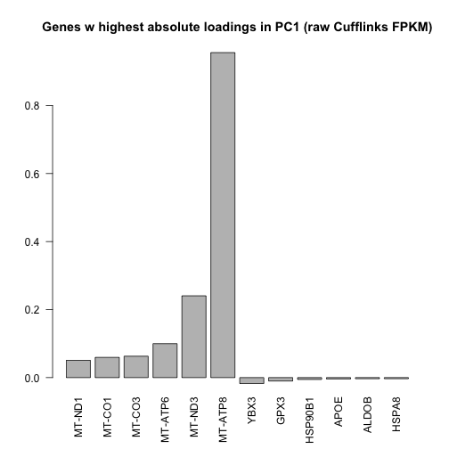 

```r
      print(fpkm.cuff.pc1)
```

```
## Error: object 'fpkm.cuff.pc1' not found
```

```r
      #PC2:
      load.pc2 <- p.cufflinks$rotation[,2][order(p.cufflinks$rotation[,2])]
```

```
## Error: object 'p.cufflinks' not found
```

```r
      extreme.pc2 <- c(tail(load.pc2), head(load.pc2))
      
      extreme.pc2.ensg <- names(extreme.pc2)
      extreme.pc2.symbols <- getBM(attributes=c("ensembl_gene_id", "hgnc_symbol"), 
                           filters = "ensembl_gene_id",
                           values=extreme.pc2.ensg,
                           mart=ensembl)
      
      q <- extreme.pc2.symbols[,2]
      names(q) <- extreme.pc2.symbols[,1]
      
      fpkm.cuff.pc2 <- cbind(q[extreme.pc2.ensg],cufflinks_fpkms[extreme.pc2.ensg,])
```

```
## Error: object 'cufflinks_fpkms' not found
```

```r
      names(fpkm.cuff.pc2)[names(fpkm.cuff.pc2) == 'q[extreme.pc2.ensg]'] <- 'Gene Symbol'
```

```
## Error: object 'fpkm.cuff.pc2' not found
```

```r
      barplot(extreme.pc2, names.arg=q[extreme.pc2.ensg],las=2,main="Genes w highest absolute loadings in PC2 (raw Cufflinks FPKM)")
```

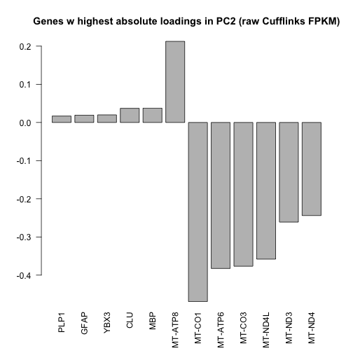 

```r
      print(fpkm.cuff.pc2)
```

```
## Error: object 'fpkm.cuff.pc2' not found
```

```r
      #PC3:
      load.pc3 <- p.cufflinks$rotation[,3][order(p.cufflinks$rotation[,3])]
```

```
## Error: object 'p.cufflinks' not found
```

```r
      extreme.pc3 <- c(tail(load.pc3), head(load.pc3))
      
      extreme.pc3.ensg <- names(extreme.pc3)
      extreme.pc3.symbols <- getBM(attributes=c("ensembl_gene_id", "hgnc_symbol"), 
                           filters = "ensembl_gene_id",
                           values=extreme.pc3.ensg,
                           mart=ensembl)
      
      q <- extreme.pc3.symbols[,2]
      names(q) <- extreme.pc3.symbols[,1]
      
      fpkm.cuff.pc3 <- cbind(q[extreme.pc3.ensg],cufflinks_fpkms[extreme.pc3.ensg,])
```

```
## Error: object 'cufflinks_fpkms' not found
```

```r
      names(fpkm.cuff.pc3)[names(fpkm.cuff.pc3) == 'q[extreme.pc3.ensg]'] <- 'Gene Symbol'
```

```
## Error: object 'fpkm.cuff.pc3' not found
```

```r
      barplot(extreme.pc3, names.arg=q[extreme.pc3.ensg],las=2,main="Genes w highest absolute loadings in PC3 (raw Cufflinks FPKM)")
```

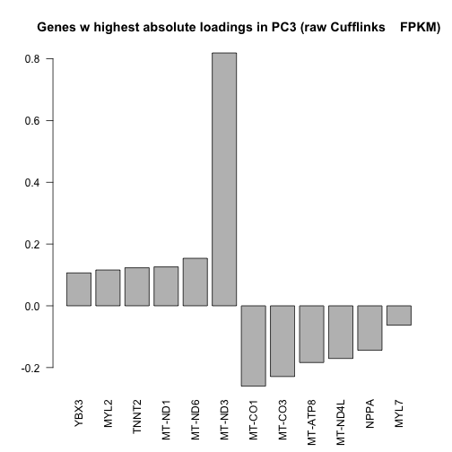 

```r
      print(fpkm.cuff.pc3)
```

```
## Error: object 'fpkm.cuff.pc3' not found
```
Mitochondrially encoded genes have relatively high expresseion levels, FPKM values of several thousands.

Anova analysis of different batch factors, Figure 4c:


```r
p <- melt(cufflinks_fpkms)
```

```
## Error: object 'cufflinks_fpkms' not found
```

```r
colnames(p) <- c("sample_ID","Cuff_FPKM")
```

```
## Error: attempt to set 'colnames' on an object with less than two
## dimensions
```

```r
meta <- sampleinfo_cufflinks[,c("Study","Tissue","Preparation","NumberRaw","Numbermapped","Readtype","readlength")]
rownames(meta) <- colnames(cufflinks_fpkms)
```

```
## Error: error in evaluating the argument 'x' in selecting a method for function 'colnames': Error: object 'cufflinks_fpkms' not found
```

```r
tissue <- rep(meta$Tissue, each=nrow(cufflinks_fpkms))
```

```
## Error: error in evaluating the argument 'x' in selecting a method for function 'nrow': Error: object 'cufflinks_fpkms' not found
```

```r
study <- rep(meta$Study, each=nrow(cufflinks_fpkms))
```

```
## Error: error in evaluating the argument 'x' in selecting a method for function 'nrow': Error: object 'cufflinks_fpkms' not found
```

```r
prep <- rep(meta$Preparation, each=nrow(cufflinks_fpkms))
```

```
## Error: error in evaluating the argument 'x' in selecting a method for function 'nrow': Error: object 'cufflinks_fpkms' not found
```

```r
layout <- rep(meta$Readtype, each=nrow(cufflinks_fpkms))
```

```
## Error: error in evaluating the argument 'x' in selecting a method for function 'nrow': Error: object 'cufflinks_fpkms' not found
```

```r
raw <- rep(meta$NumberRaw, each=nrow(cufflinks_fpkms))
```

```
## Error: error in evaluating the argument 'x' in selecting a method for function 'nrow': Error: object 'cufflinks_fpkms' not found
```

```r
readlen <- rep(meta$readlength, each=nrow(cufflinks_fpkms))
```

```
## Error: error in evaluating the argument 'x' in selecting a method for function 'nrow': Error: object 'cufflinks_fpkms' not found
```

```r
data <- data.frame(p, tissue=tissue, study=study, prep=prep, layout=layout, nraw=raw, readlen=readlen)
```

```
## Error: cannot coerce class ""prcomp"" to a data.frame
```

```r
fit <- lm(Cuff_FPKM ~ layout + readlen + prep + nraw + study + tissue, data=data)
```

```
## Error: object 'Cuff_FPKM' not found
```

```r
d <- anova(fit)
maxval = 100

barplot(100*d$"Sum Sq"[1:5]/sum(d$"Sum Sq"[1:5]),names.arg=rownames(d[1:5,]),main="Anova, Cufflinks FPKM",ylim=c(0,maxval))
```

 

Try log2 transformation of the reprocessed FPKM values:


```r
pseudo <- 1
cufflinks_log <- log2(cufflinks_fpkms + pseudo)
```

```
## Error: object 'cufflinks_fpkms' not found
```

Heatmap of Spearman correlations between log2 reprocessed cufflinks FPKM values, Figure 4d:


```r
pheatmap(cor(cufflinks_log) ,method="spearman")
```

```
## Error: object 'cufflinks_log' not found
```

PCA analysis of log2 reprocessed cufflinks FPKM values, Figure 4e:


```r
colors <- c("dodgerblue", "indianred", "forestgreen",
            "dodgerblue", "indianred", "forestgreen",
            "dodgerblue", "indianred", "forestgreen",
            "dodgerblue", "indianred", "forestgreen",
            "dodgerblue", "indianred")          

p.log.cufflinks <- prcomp(t(cufflinks_log))
```

```
## Error: object 'cufflinks_log' not found
```

```r
shapes_cufflinks <- c(rep(11,3),rep(8,3),rep(17,3),rep(15,3),rep(16,2))
plot(p.log.cufflinks$x[,1],p.log.cufflinks$x[,2],pch=shapes_cufflinks,col=colors,xlab=paste("PC1 33% of variance"),ylab=paste("PC2 25% of variance"),main="log2 reprocessed cufflinks FPKM values \n n=19,475")
```

```
## Error: object 'p.log.cufflinks' not found
```

```r
legend("bottomleft",legend=c("Heart","Brain","Kidney"),col=c("indianred", "dodgerblue", "forestgreen"),cex=1.5,pch=20,bty="n")
```

```
## Error: plot.new has not been called yet
```

```r
legend("top",legend=c("EoGE","Atlas","BodyMap","HPA","AltIso"),col="black",pch=c(11,8,17,15,16),ncol=2)
```

```
## Error: plot.new has not been called yet
```

Figure 4f:


```r
plot(p.log.cufflinks$x[,2],p.log.cufflinks$x[,3],pch=shapes_cufflinks,col=colors,xlab=paste("PC2 25% of variance"),ylab=paste("PC3 22% of variance"),main="log2 reprocessed cufflinks FPKM values \n n=19,475")
```

```
## Error: object 'p.log.cufflinks' not found
```

```r
legend("bottomleft",legend=c("Heart","Brain","Kidney"),col=c("indianred", "dodgerblue", "forestgreen"),cex=1.5,pch=20,bty="n")
```

```
## Error: plot.new has not been called yet
```

```r
legend("topleft",legend=c("EoGE","Atlas","BodyMap","HPA","AltIso"),col="black",pch=c(11,8,17,15,16),ncol=2)
```

```
## Error: plot.new has not been called yet
```

We can plot all pairwise combinations of principal components 1 to 5. (not shown in paper):


```r
par(mfrow=c(4,4))
for (i in 1:6){
  for(j in 1:6){
    if (i<j){ 
  	plot(p.log.cufflinks$x[,i],p.log.cufflinks$x[,j],pch=shapes_cufflinks,col=colors,xlab=paste("PC",i),ylab=paste("PC",j),main="log2 reprocessed FPKM values \n n=19475")
		}
	}
}
```

```
## Error: object 'p.log.cufflinks' not found
```

Cross-validattion by leaving out one of the studies, in this case AltIso, Figure 4g: 


```r
colors <- c("dodgerblue", "indianred", "forestgreen",
            "dodgerblue", "indianred", "forestgreen",
            "dodgerblue", "indianred", "forestgreen",
            "dodgerblue", "indianred", "forestgreen",
            "dodgerblue", "indianred") 

p.loo <- cufflinks_log[,-c(13,14)]
```

```
## Error: object 'cufflinks_log' not found
```

```r
colors.loo <- colors[-c(13,14)]
p.loo.log <- prcomp(t(p.loo))

p.add <- cufflinks_log[,c(13,14)]
```

```
## Error: object 'cufflinks_log' not found
```

```r
projection <- t(p.add) %*% p.loo.log$rotation

p.original.plus.new <- rbind(p.loo.log$x, projection)
col.original.plus.new <- c(colors.loo, colors[c(13,14)])
plot(p.original.plus.new[,2],p.original.plus.new[,3],pch=c(shapes_cufflinks[1:12],rep(22,nrow(projection))),col=col.original.plus.new,xlab="PC2",ylab="PC3",main="log2 Cufflinks FPKM values; AltIso projected onto existing PCs \n n=19,475,",xlim=c(-150,100))

legend("bottomleft",legend=c("Heart","Brain","Kidney"),col=c("indianred", "dodgerblue", "forestgreen"),cex=1.5,pch=20,bty="n")
legend("topleft",legend=c("HPA","GTEx","Atlas","AltIso"),col="black",pch=c(11,8,17,15,22),ncol=2)
```

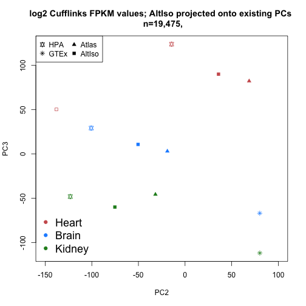 

Look a bit closer at PCs 1-3 in prcomp for the logged FPKM values from cufflinks (not shown in paper):


```r
      #PC1
      load.pc1 <- p.log.cufflinks$rotation[,1][order(p.log.cufflinks$rotation[,1])]
```

```
## Error: object 'p.log.cufflinks' not found
```

```r
      extreme.pc1 <- c(tail(load.pc1), head(load.pc1))
      
      extreme.pc1.ensg <- names(extreme.pc1)
      extreme.pc1.symbols <- getBM(attributes=c("ensembl_gene_id", "hgnc_symbol"), 
                           filters = "ensembl_gene_id",
                           values=extreme.pc1.ensg,
                           mart=ensembl)
      
      q <- extreme.pc1.symbols[,2]
      names(q) <- extreme.pc1.symbols[,1]
      
      fpkm.logcuff.pc1 <- cbind(q[extreme.pc1.ensg],cufflinks_fpkms[extreme.pc1.ensg,])
```

```
## Error: object 'cufflinks_fpkms' not found
```

```r
      names(fpkm.logcuff.pc1)[names(fpkm.logcuff.pc1) == 'q[extreme.pc1.ensg]'] <- 'Gene Symbol'
```

```
## Error: object 'fpkm.logcuff.pc1' not found
```

```r
      barplot(extreme.pc1, names.arg=q[extreme.pc1.ensg],las=2,main="Genes w highest absolute loadings in PC1 (log2 Cufflinks FPKM)")
```

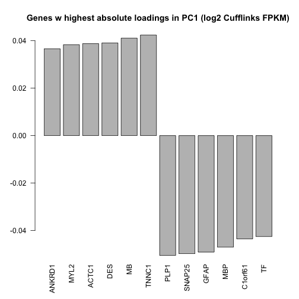 

```r
      print(fpkm.combat.pc1)
```

```
##                 Gene Symbol HPA_heart HPA_brain HPA_kidney AltIso_heart
## ENSG00000104833      TUBB4A       0.3     235.1        1.5         2.94
## ENSG00000168314        MOBP       0.0     138.0        0.1         0.00
## ENSG00000104435       STMN2       0.1     235.9        0.2         0.00
## ENSG00000132639      SNAP25       1.2     802.9        1.7         0.15
## ENSG00000123560        PLP1      11.9    1295.2        0.7         2.56
## ENSG00000131095        GFAP       3.0    1372.0        1.4         1.70
## ENSG00000111245        MYL2    5291.5       0.2        2.6     16780.36
## ENSG00000198125          MB    3937.3       0.9        2.3      7065.54
## ENSG00000114854       TNNC1    3087.9       0.3       14.0      4100.03
## ENSG00000148677      ANKRD1    2451.5       0.2        0.3      1088.94
## ENSG00000118194       TNNT2    2693.8       7.0       20.8      8074.39
## ENSG00000129991       TNNI3    2157.5       0.5        0.1      2698.36
##                 AltIso_brain GTEx_heart GTEx_brain GTEx_kidney Atlas_heart
## ENSG00000104833      2038.44  5.334e-01    387.557     1.91307       0.408
## ENSG00000168314       100.74  6.864e-03    486.669     0.02784       0.176
## ENSG00000104435       176.88  1.790e-02    217.035     0.15558       0.105
## ENSG00000132639       535.77  3.758e-02    117.303     0.65681       0.346
## ENSG00000123560      1544.93  2.432e+00   1164.716     0.41628       5.086
## ENSG00000131095       834.13  1.671e+00   3633.817     0.85376       0.549
## ENSG00000111245         1.03  1.577e+04     10.201     2.31427    1064.500
## ENSG00000198125         1.35  2.706e+03      2.692     0.69784    1415.554
## ENSG00000114854         0.69  2.618e+03      3.013     5.23761     316.135
## ENSG00000148677         0.10  1.471e+03      2.074     0.56016    3863.610
## ENSG00000118194         9.37  2.028e+03      1.675    11.86674   10930.800
## ENSG00000129991         0.47  5.752e+03      4.096     0.60909     999.559
##                 Atlas_brain Atlas_kidney
## ENSG00000104833      82.655        0.389
## ENSG00000168314     153.127        0.139
## ENSG00000104435     139.464        0.000
## ENSG00000132639     284.680        0.180
## ENSG00000123560     779.755        0.513
## ENSG00000131095     691.908        0.135
## ENSG00000111245       0.000        0.358
## ENSG00000198125       0.032        0.000
## ENSG00000114854       0.763        1.014
## ENSG00000148677       0.403        0.263
## ENSG00000118194       8.713       43.633
## ENSG00000129991       0.675        0.132
```

```r
      #PC2
      load.pc2 <- p.log.cufflinks$rotation[,2][order(p.log.cufflinks$rotation[,2])]
```

```
## Error: object 'p.log.cufflinks' not found
```

```r
      extreme.pc2 <- c(tail(load.pc2), head(load.pc2))
      
      extreme.pc2.ensg <- names(extreme.pc2)
      extreme.pc2.symbols <- getBM(attributes=c("ensembl_gene_id", "hgnc_symbol"), 
                           filters = "ensembl_gene_id",
                           values=extreme.pc2.ensg,
                           mart=ensembl)
      
      q <- extreme.pc2.symbols[,2]
      names(q) <- extreme.pc2.symbols[,1]
      
      fpkm.logcuff.pc2 <- cbind(q[extreme.pc2.ensg],cufflinks_fpkms[extreme.pc2.ensg,])
```

```
## Error: object 'cufflinks_fpkms' not found
```

```r
      names(fpkm.logcuff.pc2)[names(fpkm.logcuff.pc2) == 'q[extreme.pc2.ensg]'] <- 'Gene Symbol'
```

```
## Error: object 'fpkm.logcuff.pc2' not found
```

```r
      barplot(extreme.pc2, names.arg=q[extreme.pc2.ensg],las=2,main="Genes w highest absolute loadings in PC2 (log2 Cufflinks FPKM)")
```

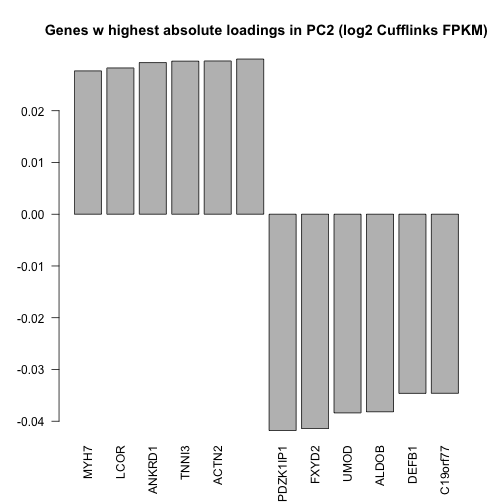 

```r
      print(fpkm.combat.pc2)
```

```
##                 Gene Symbol HPA_heart HPA_brain HPA_kidney AltIso_heart
## ENSG00000095932      SMIM24       0.1       2.2      424.6         0.00
## ENSG00000145692        BHMT       0.0       1.0      538.5         0.00
## ENSG00000124253        PCK1       0.5       0.7      489.6         0.93
## ENSG00000164825       DEFB1       0.1       0.6      662.2         0.84
## ENSG00000169344        UMOD       0.1       1.5     1425.7         0.00
## ENSG00000136872       ALDOB       0.4       2.4     1824.1         0.00
## ENSG00000129991       TNNI3    2157.5       0.5        0.1      2698.36
## ENSG00000092054        MYH7    1802.4       2.1        0.8      4117.17
## ENSG00000111245        MYL2    5291.5       0.2        2.6     16780.36
## ENSG00000148677      ANKRD1    2451.5       0.2        0.3      1088.94
## ENSG00000198125          MB    3937.3       0.9        2.3      7065.54
## ENSG00000159251       ACTC1    2914.4       1.6        0.4      3457.43
##                 AltIso_brain GTEx_heart GTEx_brain GTEx_kidney Atlas_heart
## ENSG00000095932         3.06  0.000e+00    0.75338    237.5330       0.000
## ENSG00000145692         0.26  1.949e-02    0.04664    210.6384       0.052
## ENSG00000124253         0.00  1.512e-02    1.43248   1107.3146       0.923
## ENSG00000164825         0.22  1.320e-01    0.37882    726.4011       0.000
## ENSG00000169344         0.00  0.000e+00    0.00000    285.9097       0.000
## ENSG00000136872         0.49  1.630e-01    0.22985   1927.8312       1.452
## ENSG00000129991         0.47  5.752e+03    4.09582      0.6091     999.559
## ENSG00000092054         0.83  4.714e+03    6.48698      0.6887    2137.510
## ENSG00000111245         1.03  1.577e+04   10.20060      2.3143    1064.500
## ENSG00000148677         0.10  1.471e+03    2.07400      0.5602    3863.610
## ENSG00000198125         1.35  2.706e+03    2.69152      0.6978    1415.554
## ENSG00000159251         0.42  5.320e+03    3.65304      1.0412     310.068
##                 Atlas_brain Atlas_kidney
## ENSG00000095932       0.042      109.653
## ENSG00000145692       0.106      116.957
## ENSG00000124253       0.099      127.729
## ENSG00000164825       0.082      179.618
## ENSG00000169344       0.000      371.344
## ENSG00000136872       0.125      788.910
## ENSG00000129991       0.675        0.132
## ENSG00000092054       0.635        0.354
## ENSG00000111245       0.000        0.358
## ENSG00000148677       0.403        0.263
## ENSG00000198125       0.032        0.000
## ENSG00000159251       0.421        0.311
```

```r
      #PC3
      load.pc3 <- p.log.cufflinks$rotation[,3][order(p.log.cufflinks$rotation[,3])]
```

```
## Error: object 'p.log.cufflinks' not found
```

```r
      extreme.pc3 <- c(tail(load.pc3), head(load.pc3))
      
      extreme.pc3.ensg <- names(extreme.pc3)
      extreme.pc3.symbols <- getBM(attributes=c("ensembl_gene_id", "hgnc_symbol"), 
                           filters = "ensembl_gene_id",
                           values=extreme.pc3.ensg,
                           mart=ensembl)

      q <- extreme.pc3.symbols[,2]
      names(q) <- extreme.pc3.symbols[,1]
  
      fpkm.logcuff.pc3 <- cbind(q[extreme.pc3.ensg],cufflinks_fpkms[extreme.pc3.ensg,])
```

```
## Error: object 'cufflinks_fpkms' not found
```

```r
      names(fpkm.logcuff.pc3)[names(fpkm.logcuff.pc3) == 'q[extreme.pc3.ensg]'] <- 'Gene Symbol'
```

```
## Error: object 'fpkm.logcuff.pc3' not found
```

```r
      barplot(extreme.pc3, names.arg=q[extreme.pc3.ensg],las=2,main="Genes w highest absolute loadings in PC3 (log2 Cufflinks FPKM)")
```

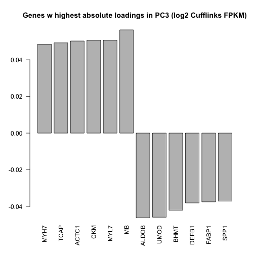 

```r
      print(fpkm.combat.pc3)
```

```
##                 Gene Symbol HPA_heart HPA_brain HPA_kidney AltIso_heart
## ENSG00000163631         ALB       0.8       0.8      327.6         0.00
## ENSG00000173432        SAA1       0.6       1.3        1.2         5.20
## ENSG00000161610        HCRT       0.0       0.0        0.1         0.00
## ENSG00000140575      IQGAP1      22.5      15.9       40.6         6.29
## ENSG00000188257     PLA2G2A      51.2       0.8        2.3       210.68
## ENSG00000183395        PMCH       0.2       0.0        0.0         0.13
## ENSG00000129824      RPS4Y1      40.8      53.7       60.9        66.40
## ENSG00000170345         FOS     147.3     116.7      288.4         6.23
## ENSG00000104888     SLC17A7       1.1     263.4        0.5         0.84
## ENSG00000103316        CRYM     124.5      58.4       43.4        30.53
## ENSG00000070808      CAMK2A       8.8     134.7        1.2         1.63
## ENSG00000170579      DLGAP1       0.4      57.5        0.8         0.00
##                 AltIso_brain GTEx_heart GTEx_brain GTEx_kidney Atlas_heart
## ENSG00000163631         0.00  6.669e-02     0.6302    12.09975      37.193
## ENSG00000173432         0.00  2.748e-02     0.5260     9.07668     110.718
## ENSG00000161610         0.00  0.000e+00   165.0033     0.04222       0.000
## ENSG00000140575         4.86  1.251e+01   331.6092    14.63416      28.961
## ENSG00000188257         0.00  2.314e+00     0.4622     0.44191    2351.218
## ENSG00000183395         0.14  0.000e+00  2045.6382     0.00000       0.000
## ENSG00000129824        45.76  8.935e+01     0.6486    86.30981      30.176
## ENSG00000170345        20.94  2.698e+02     8.9939    29.33131      15.149
## ENSG00000104888       311.50  1.172e+00     0.5592     0.32666       0.044
## ENSG00000103316        38.56  6.342e+01     4.4874    48.14844       7.586
## ENSG00000070808       322.44  1.065e+00     3.2227     0.08715       1.640
## ENSG00000170579        56.90  4.434e-03     1.1074     0.42644       0.241
##                 Atlas_brain Atlas_kidney
## ENSG00000163631       0.152       24.347
## ENSG00000173432       0.000       35.264
## ENSG00000161610       0.197        0.000
## ENSG00000140575       8.308       23.509
## ENSG00000188257       3.057       24.728
## ENSG00000183395       0.050        0.000
## ENSG00000129824      42.832       14.097
## ENSG00000170345      41.809       34.855
## ENSG00000104888      11.004        0.019
## ENSG00000103316      20.478        5.674
## ENSG00000070808     131.757        0.144
## ENSG00000170579      53.706        0.905
```

Seems to yield a heart vs. brain separation

To further validate the above results, indicating that tissue specificity appears mainly in PC 3, we will extract the 500 genes with highest loadings in each component and plot the corresponding cufflinks FPKM values in a heatmap (not shown in paper):


```r
     cufflinks_values <- cufflinks_pc_nozero[,3:16]
```

```
## Error: object 'cufflinks_pc_nozero' not found
```

```r
     rownames(cufflinks_values) <- cufflinks_pc_nozero[,1]
```

```
## Error: object 'cufflinks_pc_nozero' not found
```

```r
     load.pc1 <- abs(p.log.cufflinks$rotation[,1])[order(abs(p.log.cufflinks$rotation[,1]),decreasing=TRUE)]
```

```
## Error: object 'p.log.cufflinks' not found
```

```r
     top.pc1 <- names(load.pc1[1:500])
     load.pc2 <- abs(p.log.cufflinks$rotation[,2])[order(abs(p.log.cufflinks$rotation[,2]),decreasing=TRUE)]
```

```
## Error: object 'p.log.cufflinks' not found
```

```r
     top.pc2 <- names(load.pc2[1:500])
     load.pc3 <- abs(p.log.cufflinks$rotation[,3])[order(abs(p.log.cufflinks$rotation[,3]),decreasing=TRUE)]
```

```
## Error: object 'p.log.cufflinks' not found
```

```r
     top.pc3 <- names(load.pc3[1:500])
     
     pheatmap(cor(cufflinks_values[top.pc1,]),method="spearman")
```

```
## Error: object 'cufflinks_values' not found
```

```r
     pheatmap(cor(cufflinks_values[top.pc2,]),method="spearman")
```

```
## Error: object 'cufflinks_values' not found
```

```r
     pheatmap(cor(cufflinks_values[top.pc3,]),method="spearman")
```

```
## Error: object 'cufflinks_values' not found
```
    
Try Anova on a "melted" expression matrix with logged cufflinks values and some metadata (not shown in paper):


```r
q <- melt(cufflinks_log[,])
```

```
## Error: object 'cufflinks_log' not found
```

```r
colnames(q) <- c("sample_ID","logFPKM")
```

```
## Error: attempt to set 'colnames' on an object with less than two
## dimensions
```

```r
meta <- sampleinfo_cufflinks[,c("Study","Tissue","Preparation","NumberRaw","Numbermapped","Readtype","readlength")]
rownames(meta) <- colnames(cufflinks_log)
```

```
## Error: error in evaluating the argument 'x' in selecting a method for function 'colnames': Error: object 'cufflinks_log' not found
```

```r
tissue <- rep(meta$Tissue, each=nrow(cufflinks_log))
```

```
## Error: error in evaluating the argument 'x' in selecting a method for function 'nrow': Error: object 'cufflinks_log' not found
```

```r
study <- rep(meta$Study, each=nrow(cufflinks_log))
```

```
## Error: error in evaluating the argument 'x' in selecting a method for function 'nrow': Error: object 'cufflinks_log' not found
```

```r
prep <- rep(meta$Preparation, each=nrow(cufflinks_log))
```

```
## Error: error in evaluating the argument 'x' in selecting a method for function 'nrow': Error: object 'cufflinks_log' not found
```

```r
layout <- rep(meta$Readtype, each=nrow(cufflinks_log))
```

```
## Error: error in evaluating the argument 'x' in selecting a method for function 'nrow': Error: object 'cufflinks_log' not found
```

```r
readlen <- rep(meta$readlength, each=nrow(cufflinks_log))
```

```
## Error: error in evaluating the argument 'x' in selecting a method for function 'nrow': Error: object 'cufflinks_log' not found
```

```r
raw <- rep(meta$NumberRaw, each=nrow(cufflinks_log))
```

```
## Error: error in evaluating the argument 'x' in selecting a method for function 'nrow': Error: object 'cufflinks_log' not found
```

```r
data <- data.frame(q, tissue=tissue, study=study, prep=prep, layout=layout, nraw=raw, readlen=readlen)
```

```
## Error: arguments imply differing number of rows: 12, 146553
```

```r
fit <- lm(logFPKM ~ layout + readlen + prep + nraw + study + tissue, data=data)
```

```
## Error: object 'logFPKM' not found
```

```r
e <- anova(fit)
maxval = 100

barplot(100*e$"Sum Sq"[1:5]/sum(e$"Sum Sq"[1:5]),names.arg=rownames(e[1:5,]),main="Anova, Cufflinks log2 FPKM",ylim=c(0,maxval))
```

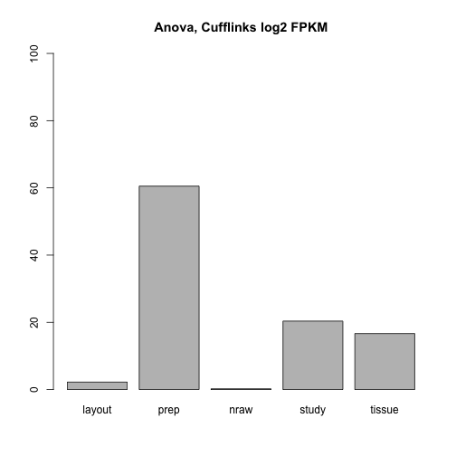 

SVA analysis.

```r
library(sva)
mod <- model.matrix(~as.factor(Tissue), data=sampleinfo_cufflinks)
mod0 <- model.matrix(~1, data=sampleinfo_cufflinks)
n.sv <- num.sv(published.log,mod,method="leek")
```

```
## Error: non-conformable arrays
```

```r
svobj <- sva(as.matrix(published.log),mod,mod0,n.sv=n.sv)
```

```
## Error: object 'n.sv' not found
```

```r
surr <- svobj$sv
```

```
## Error: object 'svobj' not found
```
What are the surrogate variables correlated to?

```r
par(mfrow=c(2,1))
for (i in c(1,2)){
ps <- rep(1,5)
names(ps) <- c("Preparation", "Study", "NumberRaw", "Readtype", "Readlength")
ps[1] <- cor.test(surr[,i], as.numeric(sampleinfo_published$Preparation))$p.value
ps[2] <- cor.test(surr[,i], as.numeric(sampleinfo_published$Study))$p.value
ps[3] <- cor.test(surr[,i], as.numeric(sampleinfo_published$NumberRaw))$p.value
ps[4] <- cor.test(surr[,i], as.numeric(sampleinfo_published$Readtype))$p.value
ps[5] <- cor.test(surr[,i], as.numeric(sampleinfo_published$readlength))$p.value
barplot(-log(ps),las=2)
}
```

```
## Error: object 'surr' not found
```

Combat analysis for removal of batch effects (n=19,475):


```r
meta <- data.frame(study=c(rep("EoGE",3),rep("Atlas",3),rep("BodyMap",3),rep("HPA",3),rep("AltIso",2)),tissue=c("Brain","Heart","Kidney","Brain","Heart","Kidney","Brain","Heart","Kidney","Brain","Heart","Kidney","Brain","Heart"),prep=c(rep("poly-A",3),rep("rRNA-depl",3),rep("poly-A",8)),layout=c(rep("PE",3),rep("SE",3),rep("PE",6),rep("SE",2)))

batch <- meta$study
design <- model.matrix(~1,data=meta)
combat.cufflinks <- ComBat(dat=cufflinks_log,batch=batch,mod=design,numCovs=NULL,par.prior=TRUE)
```

```
## Found 5 batches
## Found 0  categorical covariate(s)
```

```
## Error: object 'cufflinks_log' not found
```

```r
rownames(combat.cufflinks) <- rownames(cufflinks_log)
```

```
## Error: error in evaluating the argument 'x' in selecting a method for function 'rownames': Error: object 'cufflinks_log' not found
```

Heatmap of Spearman correlations between reprocessed cufflinks FPKM values after ComBat run, Figure 4h:


```r
pheatmap(cor(combat.cufflinks),method="spearman")
```

```
## Error: object 'combat.cufflinks' not found
```

PCA analysis on reprocessed cufflinks FPKM values after ComBat run, Figure 4i:


```r
p.combat.cufflinks <- prcomp(t(combat.cufflinks))
```

```
## Error: object 'combat.cufflinks' not found
```

```r
shapes_cufflinks <- c(rep(11,3),rep(8,3),rep(17,3),rep(15,3),rep(16,2))


plot(p.combat.cufflinks$x[,1],p.combat.cufflinks$x[,2],pch=shapes_cufflinks,col=colors,xlab=paste("PC1 54% of variance"),ylab=paste("PC2 37% of variance"),main="Cufflinks FPKM values \n COMBAT \n n=19,475")
```

```
## Error: object 'p.combat.cufflinks' not found
```

```r
legend("bottomleft",legend=c("Heart","Brain","Kidney"),col=c("indianred", "dodgerblue", "forestgreen"),cex=1.5,pch=20,bty="n")
```

```
## Error: plot.new has not been called yet
```

```r
legend("top",legend=c("EoGE","Atlas","BodyMap","HPA","AltIso"),col="black",pch=c(11,8,17,15,16),ncol=2)
```

```
## Error: plot.new has not been called yet
```

We can plot all pairwise combinations of principal components 1 to 5. (not shown in paper):


```r
par(mfrow=c(4,4))
for (i in 1:6){
  for(j in 1:6){
    if (i<j){ 
  	plot(p.combat.cufflinks$x[,i],p.combat.cufflinks$x[,j],pch=shapes_cufflinks,col=colors,xlab=paste("PC",i),ylab=paste("PC",j),main="Cufflinks FPKM values \n COMBAT \ n=19,475")
		}
	}
}
```

```
## Error: object 'p.combat.cufflinks' not found
```

Look a bit closer at PCs 1-3 in prcomp (not shown in paper):


```r
      #PC1:
      load.pc1 <- p.combat.cufflinks$rotation[,1][order(p.combat.cufflinks$rotation[,1])]
```

```
## Error: object 'p.combat.cufflinks' not found
```

```r
      extreme.pc1 <- c(tail(load.pc1), head(load.pc1))
      
      extreme.pc1.ensg <- names(extreme.pc1)
      extreme.pc1.symbols <- getBM(attributes=c("ensembl_gene_id", "hgnc_symbol"), 
                           filters = "ensembl_gene_id",
                           values=extreme.pc1.ensg,
                           mart=ensembl)
      
      q <- extreme.pc1.symbols[,2]
      names(q) <- extreme.pc1.symbols[,1]

      fpkm.combatcuff.pc1 <- cbind(q[extreme.pc1.ensg],cufflinks_fpkms[extreme.pc1.ensg,])
```

```
## Error: object 'cufflinks_fpkms' not found
```

```r
      names(fpkm.combatcuff.pc1)[names(fpkm.combatcuff.pc1) == 'q[extreme.pc1.ensg]'] <- 'Gene Symbol'
```

```
## Error: object 'fpkm.combatcuff.pc1' not found
```

```r
      barplot(extreme.pc1, names.arg=q[extreme.pc1.ensg],las=2,main="Genes w highest absolute loadings in PC1 (COMBAT Cufflinks FPKM)")
```

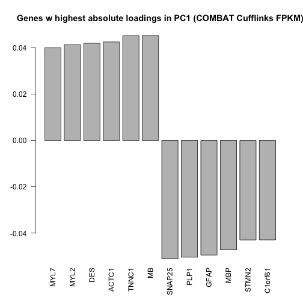 

```r
      print(fpkm.combatcuff.pc1)
```

```
## Error: object 'fpkm.combatcuff.pc1' not found
```

```r
      #PC2:
      load.pc2 <- p.combat.cufflinks$rotation[,2][order(p.combat.cufflinks$rotation[,2])]
```

```
## Error: object 'p.combat.cufflinks' not found
```

```r
      extreme.pc2 <- c(tail(load.pc2), head(load.pc2))
      
      extreme.pc2.ensg <- names(extreme.pc2)
      extreme.pc2.symbols <- getBM(attributes=c("ensembl_gene_id", "hgnc_symbol"), 
                           filters = "ensembl_gene_id",
                           values=extreme.pc2.ensg,
                           mart=ensembl)
      
      q <- extreme.pc2.symbols[,2]
      names(q) <- extreme.pc2.symbols[,1]
      
      fpkm.combatcuff.pc2 <- cbind(q[extreme.pc2.ensg],cufflinks_fpkms[extreme.pc2.ensg,])
```

```
## Error: object 'cufflinks_fpkms' not found
```

```r
      names(fpkm.combatcuff.pc2)[names(fpkm.combatcuff.pc2) == 'q[extreme.pc2.ensg]'] <- 'Gene Symbol'
```

```
## Error: object 'fpkm.combatcuff.pc2' not found
```

```r
      barplot(extreme.pc2, names.arg=q[extreme.pc2.ensg],las=2,main="Genes w highest absolute loadings in PC2 (COMBAT Cufflinks FPKM)")
```

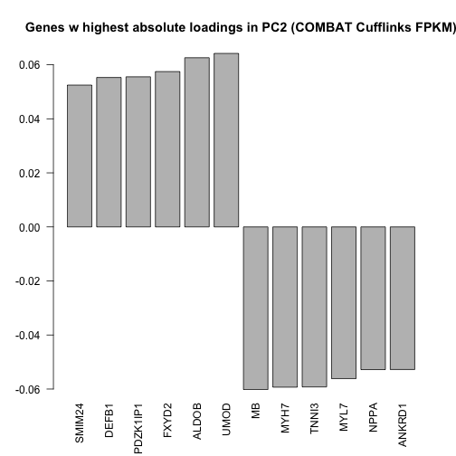 

```r
      print(fpkm.combatcuff.pc2)
```

```
## Error: object 'fpkm.combatcuff.pc2' not found
```

```r
      #PC3:      
      load.pc3 <- p.combat.cufflinks$rotation[,3][order(p.combat.cufflinks$rotation[,3])]
```

```
## Error: object 'p.combat.cufflinks' not found
```

```r
      extreme.pc3 <- c(tail(load.pc3), head(load.pc3))
      
      extreme.pc3.ensg <- names(extreme.pc3)
      extreme.pc3.symbols <- getBM(attributes=c("ensembl_gene_id", "hgnc_symbol"), 
                           filters = "ensembl_gene_id",
                           values=extreme.pc3.ensg,
                           mart=ensembl)
      
      q <- extreme.pc3.symbols[,2]
      names(q) <- extreme.pc3.symbols[,1]

      fpkm.combatcuff.pc3 <- cbind(q[extreme.pc3.ensg],cufflinks_fpkms[extreme.pc3.ensg,])
```

```
## Error: object 'cufflinks_fpkms' not found
```

```r
      names(fpkm.combatcuff.pc3)[names(fpkm.combatcuff.pc3) == 'q[extreme.pc3.ensg]'] <- 'Gene Symbol'
```

```
## Error: object 'fpkm.combatcuff.pc3' not found
```

```r
      barplot(extreme.pc3, names.arg=q[extreme.pc3.ensg],las=2,main="Genes w highest absolute loadings in PC3 (COMBAT Cufflinks FPKM)")
```

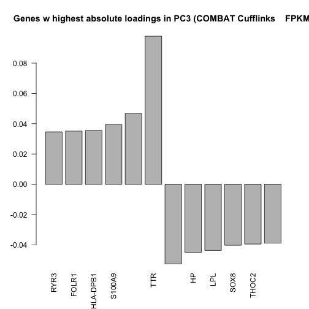 

```r
      print(fpkm.combatcuff.pc3)
```

```
## Error: object 'fpkm.combatcuff.pc3' not found
```

Revisit ANOVA analysis on reprocessed Cufflinks FPKM values after ComBat run, Figure 4j:


```r
q <- melt(combat.cufflinks)
```

```
## Error: object 'combat.cufflinks' not found
```

```r
colnames(q) <- c("sample_ID","combat")
```

```
## Error: attempt to set 'colnames' on an object with less than two
## dimensions
```

```r
meta <- sampleinfo_cufflinks[,c("Study","Tissue","Preparation","NumberRaw","Numbermapped","Readtype","readlength")]
rownames(meta) <- colnames(combat.cufflinks)
```

```
## Error: error in evaluating the argument 'x' in selecting a method for function 'colnames': Error: object 'combat.cufflinks' not found
```

```r
tissue <- rep(meta$Tissue, each=nrow(combat.cufflinks))
```

```
## Error: error in evaluating the argument 'x' in selecting a method for function 'nrow': Error: object 'combat.cufflinks' not found
```

```r
study <- rep(meta$Study, each=nrow(combat.cufflinks))
```

```
## Error: error in evaluating the argument 'x' in selecting a method for function 'nrow': Error: object 'combat.cufflinks' not found
```

```r
prep <- rep(meta$Preparation, each=nrow(combat.cufflinks))
```

```
## Error: error in evaluating the argument 'x' in selecting a method for function 'nrow': Error: object 'combat.cufflinks' not found
```

```r
layout <- rep(meta$Readtype, each=nrow(combat.cufflinks))
```

```
## Error: error in evaluating the argument 'x' in selecting a method for function 'nrow': Error: object 'combat.cufflinks' not found
```

```r
raw <- rep(meta$NumberRaw, each=nrow(combat.cufflinks))
```

```
## Error: error in evaluating the argument 'x' in selecting a method for function 'nrow': Error: object 'combat.cufflinks' not found
```

```r
readlen <- rep(meta$readlength, each=nrow(combat.cufflinks))
```

```
## Error: error in evaluating the argument 'x' in selecting a method for function 'nrow': Error: object 'combat.cufflinks' not found
```

```r
mapped <- rep(meta$Numbermapped, each=nrow(combat.cufflinks))
```

```
## Error: error in evaluating the argument 'x' in selecting a method for function 'nrow': Error: object 'combat.cufflinks' not found
```

```r
data <- data.frame(q, tissue=tissue, study=study, prep=prep, layout=layout,nraw=raw,nmapped=mapped, readlen=readlen)
```

```
## Error: arguments imply differing number of rows: 12, 146553
```

```r
fit <- lm(combat ~ prep + nraw + layout + study + tissue + readlen, data=data)
f <- anova(fit)
maxval = 100
barplot(100*f$"Sum Sq"[1:5]/sum(f$"Sum Sq"[1:5]),names.arg=rownames(f[1:5,]),main="Anova Cufflinks Combat",ylim=c(0,maxval))
```

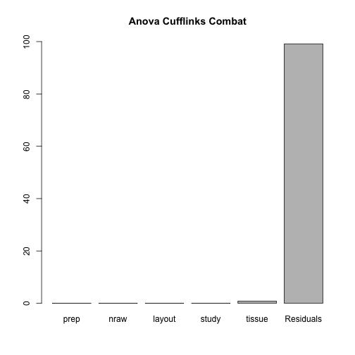 


```r
j <- merge(published.nozero, cufflinks_pc_nozero, by.x=0, by.y="ENSEMBL_ID")
```

```
## Error: object 'cufflinks_pc_nozero' not found
```

```r
j <- j[,-which(colnames(j)=="Gene_ID"),]
```

```
## Error: incorrect number of dimensions
```

```r
rown <- j[,1]
```

```
## Error: incorrect number of dimensions
```

```r
j <- j[,2:ncol(j)]
```

```
## Error: argument of length 0
```

```r
rownames(j) <- rown
```

```
## Error: object 'rown' not found
```

Heatmap and PCA of untransformed.

```r
pheatmap(cor(j))
```

```
## Error: supply both 'x' and 'y' or a matrix-like 'x'
```

Here, RNA-seq Atlas forms its own group, whereas the other studies form tissue-specific groups.

PCA:

```r
pdf("Joint_PCA.pdf")
#par(mfrow=c(2,2))

colors <- c("indianred", "dodgerblue", "forestgreen","indianred", "dodgerblue", "indianred", "dodgerblue", "forestgreen","indianred", "dodgerblue", "forestgreen","dodgerblue","indianred","forestgreen","dodgerblue","indianred","forestgreen","dodgerblue","indianred","forestgreen","dodgerblue","indianred","forestgreen","dodgerblue","indianred")
shapes <- c(rep(0,3),rep(1,2),rep(8,3),rep(2,3),rep(6,3),rep(17,3),rep(5,3),rep(15,3),rep(16,2))

p.joint <- prcomp(t(j))
plot(p.joint$x[,1],p.joint$x[,2],col=colors,pch=shapes,main="Raw F/RPKM PC1/2")
```

```
## Error: subscript out of bounds
```

```r
#text(p.joint$x[,1],p.joint$x[,2],labels=colnames(j))
legend("topright",legend=c("Heart","Brain","Kidney"),col=c("indianred", "dodgerblue", "forestgreen"),cex=1.5,pch=20,bty="n")
```

```
## Error: plot.new has not been called yet
```

```r
legend("top",legend=c("HPA-P","HPA-R","AltIso-P","AltIso-R", "Atlas-P", "Atlas-R", "GTeX-P","EoGE-P", "BodyMap-R"),col="black",pch=c(0,15,1,16,2,17,8,6,5),ncol=2)
```

```
## Error: plot.new has not been called yet
```

After log transformation:

```r
j.log <- log2(j+1)
p.joint.log <- prcomp(t(j.log))
plot(p.joint.log$x[,1],p.joint.log$x[,2],pch=shapes,col=colors,main="log F/RPKM PC1/2")
```

```
## Error: subscript out of bounds
```

```r
#text(p.joint.log$x[,1],p.joint.log$x[,2],labels=colnames(j))
legend("bottomright",legend=c("Heart","Brain","Kidney"),col=c("indianred", "dodgerblue", "forestgreen"),cex=1.5,pch=20,bty="n")
```

```
## Error: plot.new has not been called yet
```

```r
legend("bottomleft",legend=c("HPA-P","HPA-R","AltIso-P","AltIso-R", "Atlas-P", "Atlas-R", "GTeX-P","EoGE-P", "BodyMap-R"),col="black",pch=c(0,15,1,16,2,17,8,6,5),ncol=2)
```

```
## Error: plot.new has not been called yet
```

```r
plot(p.joint.log$x[,2],p.joint.log$x[,3],pch=shapes,col=colors,main="log F/RPKM PC2/3")
```

```
## Error: subscript out of bounds
```

```r
#text(p.joint.log$x[,2],p.joint.log$x[,3],labels=colnames(j))
legend("bottomright",legend=c("Heart","Brain","Kidney"),col=c("indianred", "dodgerblue", "forestgreen"),cex=1.5,pch=20,bty="n")
```

```
## Error: plot.new has not been called yet
```

```r
legend("bottomleft",legend=c("HPA-P","HPA-R","AltIso-P","AltIso-R", "Atlas-P", "Atlas-R", "GTeX-P","EoGE-P", "BodyMap-R"),col="black",pch=c(0,15,1,16,2,17,8,6,5),ncol=2)
```

```
## Error: plot.new has not been called yet
```

ComBat:

```r
meta <- data.frame(study=c(rep("HPA",3),rep("AltIso",2),rep("GTex",3),rep("Atlas",3),rep("EoGE",3),rep("Atlas",3),rep("BodyMap",3),rep("HPA",3),rep("AltIso",2)),tissue=c("Heart","Brain","Kidney","Heart","Brain","Heart","Brain","Kidney","Heart","Brain","Kidney","Brain","Heart","Kidney","Brain","Heart","Kidney","Brain","Heart","Kidney","Brain","Heart","Kidney","Brain","Heart"),quantification=c(rep("other",11),rep("tophatcufflinks",14)))

batch <- meta$study
design <- model.matrix(~1,data=meta)
combat.j <- ComBat(dat=j.log,batch=batch,mod=design,numCovs=NULL,par.prior=TRUE)
```

```
## Found 6 batches
## Found 0  categorical covariate(s)
## Standardizing Data across genes
```

```
## Error: non-conformable arguments
```

```r
p.com <- prcomp(t(combat.j))
```

```
## Error: object 'combat.j' not found
```

```r
plot(p.com$x[,1],p.com$x[,2],pch=shapes,col=colors,main="ComBat PC1/2")
```

```
## Error: object 'p.com' not found
```

```r
#text(p.com$x[,1],p.com$x[,2],labels=colnames(j))
legend("topright",legend=c("Heart","Brain","Kidney"),col=c("indianred", "dodgerblue", "forestgreen"),cex=1.5,pch=20,bty="n")
```

```
## Error: plot.new has not been called yet
```

```r
legend("bottom",legend=c("HPA-P","HPA-R","AltIso-P","AltIso-R", "Atlas-P", "Atlas-R", "GTeX-P","EoGE-P", "BodyMap-R"),col="black",pch=c(0,15,1,16,2,17,8,6,5),ncol=2)
```

```
## Error: plot.new has not been called yet
```

```r
dev.off()
```

```
## pdf 
##   3
```

Check out Atlas (pre-computed) RPKMs against (pre-computed HPA): (both are logged for clarity)
Try to fit a linear model between the two datasets' logged RPKMs.

```r
pdf("Atlas_vs_HPA_published.pdf")
par(mfrow=c(3,1))
l <- lm(Atlas_heart.x ~ HPA_heart.x,data=j.log)
```

```
## Error: object 'Atlas_heart.x' not found
```

```r
l
```

```
## Error: object 'l' not found
```

```r
plot(Atlas_heart.x ~ HPA_heart.x,data=j.log,pch=20,main=paste("Slope",signif(l$coefficients[2],2),sep="="))
```

```
## Error: object 'l' not found
```

```r
yfit <- l$coefficients[1] + l$coefficients[2]*(1:13)
```

```
## Error: object 'l' not found
```

```r
lines(yfit,col="red")
```

```
## Error: object 'yfit' not found
```
The plot and linear model show that the RNA-seq Atlas FPKMs are consistently lower than the ones from HPA (slope=0.65). On a linear scale, the slope is just 0.42! (but with a different intercept)

Look at the other tissues too!

```r
l <- lm(Atlas_brain.x ~ HPA_brain.x,data=j.log)
```

```
## Error: object 'Atlas_brain.x' not found
```

```r
plot(Atlas_brain.x ~ HPA_brain.x,data=j.log,pch=20,main=paste("Slope",signif(l$coefficients[2],2),sep="="))
```

```
## Error: object 'l' not found
```

```r
yfit <- l$coefficients[1] + l$coefficients[2]*(1:13)
```

```
## Error: object 'l' not found
```

```r
lines(yfit,col="red")
```

```
## Error: object 'yfit' not found
```

```r
l <- lm(Atlas_kidney.x ~ HPA_kidney.x,data=j.log)
```

```
## Error: object 'Atlas_kidney.x' not found
```

```r
plot(Atlas_kidney.x ~ HPA_kidney.x,data=j.log,pch=20,main=paste("Slope",signif(l$coefficients[2],2),sep="="))
```

```
## Error: object 'l' not found
```

```r
yfit <- l$coefficients[1] + l$coefficients[2]*(1:13)
```

```
## Error: object 'l' not found
```

```r
lines(yfit,col="red")
```

```
## Error: object 'yfit' not found
```

```r
dev.off()
```

```
## pdf 
##   3
```

Instead look at AltIso vs HPA.

```r
par(mfrow=c(2,1))
l <- lm(AltIso_heart.x ~ HPA_heart.x,data=j.log)
```

```
## Error: object 'AltIso_heart.x' not found
```

```r
plot(AltIso_heart.x ~ HPA_heart.x,data=j.log,col=densCols(j.log$HPA_heart.x,j.log$AltIso_heart.x),pch=20,main=paste("Slope",signif(l$coefficients[2],2),sep="="))
```

```
## Error: $ operator is invalid for atomic vectors
```

```r
yfit <- l$coefficients[1] + l$coefficients[2]*(1:13)
```

```
## Error: object 'l' not found
```

```r
lines(yfit,col="red")
```

```
## Error: object 'yfit' not found
```

```r
l <- lm(AltIso_brain.x ~ HPA_brain.x,data=j.log)
```

```
## Error: object 'AltIso_brain.x' not found
```

```r
plot(AltIso_brain.x ~ HPA_brain.x,data=j.log,col=densCols(j.log$HPA_brain.x,j.log$AltIso_brain.x),pch=20,main=paste("Slope",signif(l$coefficients[2],2),sep="="))
```

```
## Error: $ operator is invalid for atomic vectors
```

```r
yfit <- l$coefficients[1] + l$coefficients[2]*(1:13)
```

```
## Error: object 'l' not found
```

```r
lines(yfit,col="red")
```

```
## Error: object 'yfit' not found
```
Look at RNA-seq Atlas, published vs reprocessed:

```r
pdf("Atlas_published_vs_reprocessed.pdf")
par(mfrow=c(3,1))
l <- lm(Atlas_heart.x ~ Atlas_heart.y,data=j.log)
```

```
## Error: object 'Atlas_heart.x' not found
```

```r
plot(Atlas_heart.x ~ Atlas_heart.y,data=j.log,col=densCols(j.log$Atlas_heart.y,j.log$Atlas_heart.x),pch=20,main=paste("Slope",signif(l$coefficients[2],2),sep="="))
```

```
## Error: $ operator is invalid for atomic vectors
```

```r
yfit <- l$coefficients[1] + l$coefficients[2]*(1:13)
```

```
## Error: object 'l' not found
```

```r
lines(yfit,col="red")
```

```
## Error: object 'yfit' not found
```

```r
#
l <- lm(Atlas_brain.x ~ Atlas_brain.y,data=j.log)
```

```
## Error: object 'Atlas_brain.x' not found
```

```r
plot(Atlas_brain.x ~ Atlas_brain.y,data=j.log,col=densCols(j.log$Atlas_brain.y,j.log$Atlas_brain.x),pch=20,main=paste("Slope",signif(l$coefficients[2],2),sep="="))
```

```
## Error: $ operator is invalid for atomic vectors
```

```r
yfit <- l$coefficients[1] + l$coefficients[2]*(1:13)
```

```
## Error: object 'l' not found
```

```r
lines(yfit,col="red")
```

```
## Error: object 'yfit' not found
```

```r
#
l <- lm(Atlas_kidney.x ~ Atlas_kidney.y,data=j.log)
```

```
## Error: object 'Atlas_kidney.x' not found
```

```r
plot(Atlas_kidney.x ~ Atlas_kidney.y,data=j.log,col=densCols(j.log$Atlas_kidney.y,j.log$Atlas_kidney.x),pch=20,main=paste("Slope",signif(l$coefficients[2],2),sep="="))
```

```
## Error: $ operator is invalid for atomic vectors
```

```r
yfit <- l$coefficients[1] + l$coefficients[2]*(1:13)
```

```
## Error: object 'l' not found
```

```r
lines(yfit,col="red")
```

```
## Error: object 'yfit' not found
```

```r
dev.off()
```

```
## pdf 
##   2
```

Correlations between studies (per tissue)

```r
heart.p <- j[,c(1,4,6,9)]
```

```
## Error: incorrect number of dimensions
```

```r
pheatmap(cor(log2(1+heart.p)))
```

```
## Error: object 'heart.p' not found
```

```r
heart.r <- j[,c(16,19,22,25)]
```

```
## Error: incorrect number of dimensions
```

```r
pheatmap(cor(log2(1+heart.r)))
```

```
## Error: object 'heart.r' not found
```

```r
heart.all <- cbind(heart.p, heart.r)
```

```
## Error: object 'heart.p' not found
```

ANOVAs including quantification method

```r
pdf("Joint_ANOVAs.pdf")
par(mfrow=c(3,1))
sampleinfo_cufflinks$quantification <- "topcuff"
sampleinfo_published$quantification <- "other"
studylabels_cuff <- c("EoGE_brain","EoEG_heart","EoEG_kidney","Atlas_brain","Atlas_heart","Atlas_kidney","BodyMap_brain","BodyMap_heart","BodyMap_kidney","HPA_brain","HPA_heart","HPA_kidney","AltIso_brain","AltIso_heart")
sampleinfo_cufflinks <- data.frame(Study_labels=studylabels_cuff, sampleinfo_cufflinks)
sampleinfo <- rbind(sampleinfo_published, sampleinfo_cufflinks)
meta <- sampleinfo[,c("Study","Tissue","Preparation","NumberRaw","Numbermapped","Readtype","quantification","readlength")]
rownames(meta) <- colnames(j)
tissue <- rep(meta$Tissue, each=nrow(j))
```

```
## Warning: first element used of 'each' argument
```

```r
study <- rep(meta$Study, each=nrow(j))
```

```
## Warning: first element used of 'each' argument
```

```r
prep <- rep(meta$Preparation, each=nrow(j))
```

```
## Warning: first element used of 'each' argument
```

```r
layout <- rep(meta$Readtype, each=nrow(j))
```

```
## Warning: first element used of 'each' argument
```

```r
raw <- rep(meta$NumberRaw, each=nrow(j))
```

```
## Warning: first element used of 'each' argument
```

```r
mapped <- rep(meta$Numbermapped, each=nrow(j))
```

```
## Warning: first element used of 'each' argument
```

```r
quantification <- rep(meta$quantification, each=nrow(j))
```

```
## Warning: first element used of 'each' argument
```

```r
readlen <- rep(meta$readlength, each=nrow(j))
```

```
## Warning: first element used of 'each' argument
```

```r
o <- melt(j)
colnames(o) <- c("sample_ID","RawRPKM")
```

```
## Error: 'names' attribute [2] must be the same length as the vector [1]
```

```r
data <- data.frame(o, tissue=tissue, study=study, prep=prep, layout=layout,nraw=raw,nmapped=mapped,quant=quantification,readlen=readlen)

#fit <- lm(RawRPKM ~ layout + prep + nraw + study + tissue + quant, data=data)
fit <- lm(RawRPKM ~ layout + readlen + prep + nraw + quant + study + tissue, data=data)
```

```
## Error: object 'RawRPKM' not found
```

```r
a <- anova(fit)
maxval = 100
barplot(100*a$"Sum Sq"[1:7]/sum(a$"Sum Sq"[1:7]),names.arg=rownames(a[1:7,]),main="Anova raw",ylim=c(0,maxval))

o <- melt(j.log)
colnames(o) <- c("sample_ID","logRPKM")
```

```
## Error: 'names' attribute [2] must be the same length as the vector [1]
```

```r
data <- data.frame(o, tissue=tissue, study=study, prep=prep, layout=layout,nraw=raw,nmapped=mapped,quant=quantification, readlen=readlen)

fit <- lm(logRPKM ~  layout + readlen + prep + nraw + quant + study + tissue, data=data)
```

```
## Error: object 'logRPKM' not found
```

```r
b <- anova(fit)
maxval = 100
barplot(100*b$"Sum Sq"[1:7]/sum(b$"Sum Sq"[1:7]),names.arg=rownames(b[1:7,]),main="Anova log",ylim=c(0,maxval))

o <- melt(combat.j)
```

```
## Error: object 'combat.j' not found
```

```r
colnames(o) <- c("sample_ID","combat")
```

```
## Error: 'names' attribute [2] must be the same length as the vector [1]
```

```r
data <- data.frame(o, tissue=tissue, study=study, prep=prep, layout=layout,nraw=raw,nmapped=mapped,quant=quantification,readlen=readlen)

fit <- lm(combat ~ layout + readlen + prep + nraw + quant + study + tissue, data=data)
```

```
## Error: invalid type (list) for variable 'combat'
```

```r
c <- anova(fit)
maxval = 100
barplot(100*c$"Sum Sq"[1:7]/sum(c$"Sum Sq"[1:7]),names.arg=rownames(c[1:7,]),main="Anova ComBat",ylim=c(0,maxval))
dev.off()
```

```
## pdf 
##   2
```

Try SVA to assess importance of different factors.

```r
library(sva)
mod <- model.matrix(~as.factor(Tissue), data=sampleinfo)
mod0 <- model.matrix(~1, data=sampleinfo)
n.sv <- num.sv(j.log,mod,method="leek")
```

```
## Error: non-conformable arrays
```

```r
svobj <- sva(as.matrix(j.log),mod,mod0,n.sv=n.sv)
```

```
## Error: object 'n.sv' not found
```

```r
surr <- svobj$sv
```

```
## Error: object 'svobj' not found
```

```r
heatmap(surr,scale="none",labRow=colnames(j), Rowv=NA, Colv=NA)
```

```
## Error: object 'surr' not found
```

What is in the first surrogate variable?

```r
cor.test(surr[,1], as.numeric(sampleinfo$Preparation)) # 2e-7
```

```
## Error: object 'surr' not found
```

```r
cor.test(surr[,1], as.numeric(sampleinfo$Study)) # NS
```

```
## Error: object 'surr' not found
```

```r
cor.test(surr[,1], as.numeric(sampleinfo$NumberRaw)) # NS
```

```
## Error: object 'surr' not found
```

```r
cor.test(surr[,1], as.numeric(sampleinfo$Readtype)) # NS
```

```
## Error: object 'surr' not found
```

```r
cor.test(surr[,1], as.numeric(sampleinfo$readlength)) # 0.017
```

```
## Error: object 'surr' not found
```

```r
sampleinfo$quant_numeric <- c(rep(0,11),rep(1,14))
cor.test(surr[,1], as.numeric(sampleinfo$quant_numeric)) # 0.033
```

```
## Error: object 'surr' not found
```
Mostly the prep (=Atlas vs others).

The second surrogate variable:

```r
cor.test(surr[,2], as.numeric(sampleinfo$Preparation)) # 0.014
```

```
## Error: object 'surr' not found
```

```r
cor.test(surr[,2], as.numeric(sampleinfo$Study)) # 0.03
```

```
## Error: object 'surr' not found
```

```r
cor.test(surr[,2], as.numeric(sampleinfo$NumberRaw)) # 0.02
```

```
## Error: object 'surr' not found
```

```r
cor.test(surr[,2], as.numeric(sampleinfo$Readtype)) # NS
```

```
## Error: object 'surr' not found
```

```r
cor.test(surr[,2], as.numeric(sampleinfo$readlength)) # NS
```

```
## Error: object 'surr' not found
```

```r
sampleinfo$quant_numeric <- c(rep(0,11),rep(1,14))
cor.test(surr[,2], as.numeric(sampleinfo$quant_numeric)) # 0.003
```

```
## Error: object 'surr' not found
```

A little bit of everything, though quantification seems to be the strongest.

Correlations between PCs and experimental factors.

```r
print_PCA_corrs <- function(data,sampleinfo){
pca <- prcomp(t(data[,]))

rot <- pca$r
x <- pca$x

pc1 <- rep(1,7)
names(pc1) <- c("Raw reads","Mapped reads", "Tissue", "Library prep", "Study", "Read type", "Read length")
pc2 <- rep(1,7)
names(pc2) <- names(pc1)

# Test correlations between number of seq'd reads and PCs 1-4 from prcomp
pval.nraw.pc1 <- cor.test(x[,1], sampleinfo$NumberRaw,method="spearman")$p.value
pval.nraw.pc2 <- cor.test(x[,2], sampleinfo$NumberRaw,method="spearman")$p.value
pval.nraw.pc3 <- cor.test(x[,3], sampleinfo$NumberRaw,method="spearman")$p.value
pval.nraw.pc4 <- cor.test(x[,4], sampleinfo$NumberRaw,method="spearman")$p.value

cat(sprintf("Number_of_rawreads~PCAs: PCA1=\"%f\"PCA2=\"%f\"PCA3=\"%f\"PCA4=\"%f\n", pval.nraw.pc1,pval.nraw.pc2,pval.nraw.pc3,pval.nraw.pc4))

pc1[1] <- pval.nraw.pc1
pc2[1] <- pval.nraw.pc2

pval.nmapped.pc1 <- cor.test(x[,1], sampleinfo$Numbermapped,method="spearman")$p.value
pval.nmapped.pc2 <- cor.test(x[,2], sampleinfo$Numbermapped,method="spearman")$p.value
pval.nmapped.pc3 <- cor.test(x[,3], sampleinfo$Numbermapped,method="spearman")$p.value
pval.nmapped.pc4 <- cor.test(x[,4], sampleinfo$Numbermapped,method="spearman")$p.value

cat(sprintf("Number_of_mappedreads~PCAs: PCA1=\"%f\"PCA2=\"%f\"PCA3=\"%f\"PCA4=\"%f\n", pval.nmapped.pc1,pval.nmapped.pc2,pval.nmapped.pc3,pval.nmapped.pc4))

pc1[2] <- pval.nmapped.pc1
pc2[2] <- pval.nmapped.pc2

# For tissue, use kruskal.test which handles ordinal variables 
pval.tissue.pc1<-kruskal.test(x[,1], sampleinfo$Tissue)$p.value
pval.tissue.pc2<-kruskal.test(x[,2], sampleinfo$Tissue)$p.value
pval.tissue.pc3<-kruskal.test(x[,3], sampleinfo$Tissue)$p.value
pval.tissue.pc4<-kruskal.test(x[,4], sampleinfo$Tissue)$p.value

cat(sprintf("Tissues~PCAs: PCA1=\"%f\"PCA2=\"%f\"PCA3=\"%f\"\n", pval.tissue.pc1,pval.tissue.pc2,pval.tissue.pc3,pval.tissue.pc4))

pc1[3] <- pval.tissue.pc1
pc2[3] <- pval.tissue.pc2

# Library prep 
pval.prep.pc1<-kruskal.test(x[,1], sampleinfo$Preparation)$p.value
pval.prep.pc2<-kruskal.test(x[,2], sampleinfo$Preparation)$p.value
pval.prep.pc3<-kruskal.test(x[,3], sampleinfo$Preparation)$p.value
pval.prep.pc4<-kruskal.test(x[,4], sampleinfo$Preparation)$p.value

cat(sprintf("LibPrep~PCAs: PCA1=\"%f\"PCA2=\"%f\"PCA3=\"%f\"\n", pval.prep.pc1,pval.prep.pc2,pval.prep.pc3,pval.prep.pc4))

pc1[4] <- pval.prep.pc1
pc2[4] <- pval.prep.pc2

# Study  
pval.study.pc1<-kruskal.test(x[,1], sampleinfo$Study)$p.value
pval.study.pc2<-kruskal.test(x[,2], sampleinfo$Study)$p.value
pval.study.pc3<-kruskal.test(x[,3], sampleinfo$Study)$p.value
pval.study.pc4<-kruskal.test(x[,4], sampleinfo$Study)$p.value

cat(sprintf("Study~PCAs: PCA1=\"%f\"PCA2=\"%f\"PCA3=\"%f\"\n", pval.study.pc1,pval.study.pc2,pval.study.pc3,pval.study.pc4))

pc1[5] <- pval.study.pc1
pc2[5] <- pval.study.pc2

# Layout
pval.layout.pc1<-kruskal.test(x[,1], sampleinfo$Readtype)$p.value
pval.layout.pc2<-kruskal.test(x[,2], sampleinfo$Readtype)$p.value
pval.layout.pc3<-kruskal.test(x[,3], sampleinfo$Readtype)$p.value
pval.layout.pc4<-kruskal.test(x[,4], sampleinfo$Readtype)$p.value

pc1[6] <- pval.layout.pc1
pc2[6] <- pval.layout.pc2

# Read length
pval.readlength.pc1<-kruskal.test(x[,1], sampleinfo$readlength)$p.value
pval.readlength.pc2<-kruskal.test(x[,2], sampleinfo$readlength)$p.value
pval.readlength.pc3<-kruskal.test(x[,3], sampleinfo$readlength)$p.value
pval.readlength.pc4<-kruskal.test(x[,4], sampleinfo$readlength)$p.value

cat(sprintf("ReadType~PCAs: PCA1=\"%f\"PCA2=\"%f\"PCA3=\"%f\"\n", pval.layout.pc1,pval.layout.pc2,pval.layout.pc3,pval.layout.pc4))

pc1[7] <- pval.readlength.pc1
pc2[7] <- pval.readlength.pc2

# Quantification
#pval.layout.pc1<-kruskal.test(x[,1], sampleinfo$quantification=="other")$p.value
#pval.layout.pc2<-kruskal.test(x[,2], sampleinfo$quantification=="other")$p.value
#pval.layout.pc3<-kruskal.test(x[,3], sampleinfo$quantification=="other")$p.value
#pval.layout.pc4<-kruskal.test(x[,4], sampleinfo$quantification=="other")$p.value

cat(sprintf("QuantificationMethod~PCAs: PCA1=\"%f\"PCA2=\"%f\"PCA3=\"%f\"\n", pval.layout.pc1,pval.layout.pc2,pval.layout.pc3,pval.layout.pc4))

par(mfrow=c(2,1))
barplot(-log(pc1),las=2)
barplot(-log(pc2),las=2)
}
```

Try for raw RPKM, logged RPKM and ComBat adjusted RPKM:

```r
print_PCA_corrs(published,sampleinfo_published)
```

```
## Number_of_rawreads~PCAs: PCA1="0.248381"PCA2="0.402136"PCA3="0.693511"PCA4="0.129162
## Number_of_mappedreads~PCAs: PCA1="0.451197"PCA2="0.485476"PCA3="0.503067"PCA4="0.037001
## Tissues~PCAs: PCA1="0.027159"PCA2="0.618127"PCA3="0.374913"
## LibPrep~PCAs: PCA1="0.414216"PCA2="0.041227"PCA3="1.000000"
## Study~PCAs: PCA1="0.535538"PCA2="0.048584"PCA3="0.168499"
## ReadType~PCAs: PCA1="0.715001"PCA2="0.465209"PCA3="0.100348"
## QuantificationMethod~PCAs: PCA1="0.715001"PCA2="0.465209"PCA3="0.100348"
```

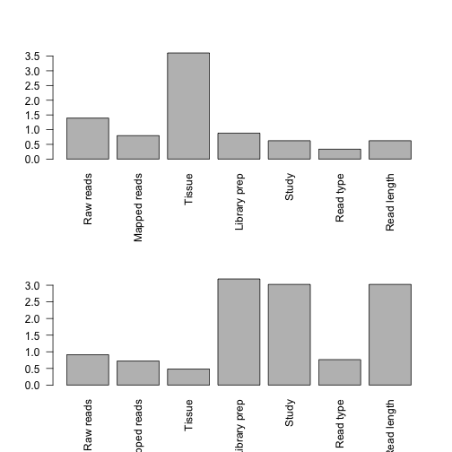 

```r
print_PCA_corrs(published.log,sampleinfo_published)
```

```
## Number_of_rawreads~PCAs: PCA1="0.418167"PCA2="0.614426"PCA3="0.902918"PCA4="0.213864
## Number_of_mappedreads~PCAs: PCA1="0.172787"PCA2="0.902918"PCA3="0.967576"PCA4="0.182532
## Tissues~PCAs: PCA1="0.618127"PCA2="0.019757"PCA3="0.021968"
## LibPrep~PCAs: PCA1="0.014306"PCA2="0.220671"PCA3="0.220671"
## Study~PCAs: PCA1="0.033146"PCA2="0.594709"PCA3="0.294275"
## ReadType~PCAs: PCA1="0.028460"PCA2="0.201243"PCA3="0.855132"
## QuantificationMethod~PCAs: PCA1="0.028460"PCA2="0.201243"PCA3="0.855132"
```

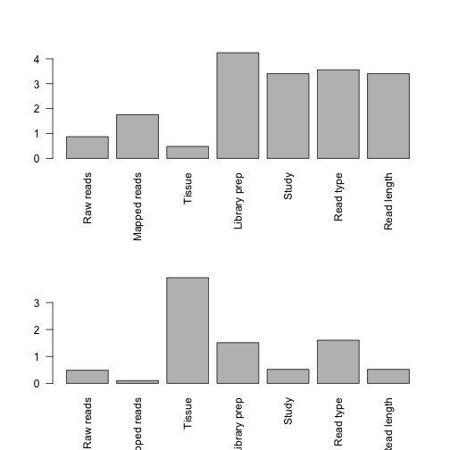 

```r
print_PCA_corrs(combat,sampleinfo_published)
```

```
## Number_of_rawreads~PCAs: PCA1="0.313026"PCA2="0.796592"PCA3="0.881472"PCA4="0.945984
## Number_of_mappedreads~PCAs: PCA1="0.576258"PCA2="0.860104"PCA3="0.633870"PCA4="0.945984
## Tissues~PCAs: PCA1="0.011626"PCA2="0.021968"PCA3="0.977529"
## LibPrep~PCAs: PCA1="0.683091"PCA2="0.838256"PCA3="0.683091"
## Study~PCAs: PCA1="0.947648"PCA2="0.895044"PCA3="0.970466"
## ReadType~PCAs: PCA1="1.000000"PCA2="0.855132"PCA3="0.715001"
## QuantificationMethod~PCAs: PCA1="1.000000"PCA2="0.855132"PCA3="0.715001"
```

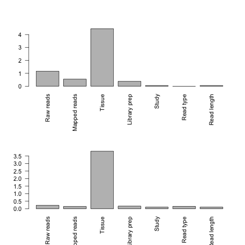 

```r
print_PCA_corrs(cufflinks_fpkms,sampleinfo_cufflinks)
```

```
## Error: object 'cufflinks_fpkms' not found
```

```r
print_PCA_corrs(cufflinks_log,sampleinfo_cufflinks)
```

```
## Error: object 'cufflinks_log' not found
```

```r
print_PCA_corrs(combat.cufflinks,sampleinfo_cufflinks)
```

```
## Error: object 'combat.cufflinks' not found
```

```r
#print_PCA_corrs(j)
#print_PCA_corrs(j.log)
#print_PCA_corrs(combat.j)
```

