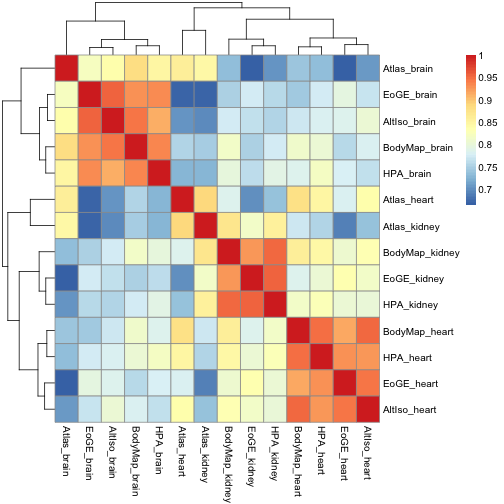

Combining F/RPKM values from public data sets
=============================================

We will join the data sets on ENSEMBL ID:s, losing a lot of data in the process; but joining on gene symbols or something else would lead to an even worse loss. 


```r
library(org.Hs.eg.db)  # for transferring gene identifiers
library(data.table)  # for collapsing transcript RPKMs
library(pheatmap)  # for nicer visualization
library(edgeR)  # for TMM normalization

hpa.fpkms <- read.delim("hpa_fpkms.txt")
altiso.fpkms <- read.delim("altiso_fpkms.txt")
gtex.fpkms <- read.delim("gtex_fpkms.txt")
atlas.fpkms <- read.delim("atlas_fpkms.txt")
```


The RNA-seq Atlas data set uses many different identifiers, while the other all use ENSG as the primary identifier

Approach 1: Merge on ENSEMBL genes (ENSG) as given in RNA-seq Atlas. Note that there are repeated ENSG ID:s in RNA-seq Atlas, as opposed to the other data sets, so we need to do something about that. In this case, we just sum the transcripts that belong to each ENSG gene. We use data.table for this.


```r
data.dt <- data.table(atlas.fpkms)
setkey(data.dt, ENSG_ID)
temp <- data.dt[, lapply(.SD, sum), by = ENSG_ID]
collapsed <- as.data.frame(temp)
atlas.fpkms.summed <- collapsed[, 2:ncol(collapsed)]
rownames(atlas.fpkms.summed) <- collapsed[, 1]

atlas.fpkms.summed <- atlas.fpkms.summed[2:nrow(atlas.fpkms.summed), ]
```


Finally, combine all the data sets into a data frame.


```r
fpkms <- merge(hpa.fpkms, altiso.fpkms, by = "ENSG_ID")
fpkms <- merge(fpkms, gtex.fpkms, by = "ENSG_ID")
fpkms <- merge(fpkms, atlas.fpkms.summed, by.x = "ENSG_ID", by.y = 0)
gene_id <- fpkms[, 1]
f <- fpkms[, 2:ncol(fpkms)]
rownames(f) <- gene_id
```


Check how many ENSG IDs we have left.


```r
dim(f)
```

```
## [1] 4506   11
```


Approach 2: Try to map Entrez symbols to ENSEMBL to recover more ENSG IDs than already present in the table. 


```r
m <- org.Hs.egENSEMBL
mapped_genes <- mappedkeys(m)
ensg.for.entrez <- as.list(m[mapped_genes])
remapped.ensg <- ensg.for.entrez[as.character(atlas$entrez_gene_id)]

atlas.fpkms$remapped_ensg <- as.character(remapped.ensg)

# And add expression values
data.dt <- data.table(atlas.fpkms[, 2:ncol(atlas.fpkms)])
setkey(data.dt, remapped_ensg)
temp <- data.dt[, lapply(.SD, sum), by = remapped_ensg]
collapsed <- as.data.frame(temp)
atlas.fpkms.summed <- collapsed[, 2:ncol(collapsed)]
rownames(atlas.fpkms.summed) <- collapsed[, 1]
```


Combine data sets again


```r
fpkms <- merge(hpa.fpkms, altiso.fpkms, by = "ENSG_ID")
fpkms <- merge(fpkms, gtex.fpkms, by = "ENSG_ID")
fpkms <- merge(fpkms, atlas.fpkms.summed, by.x = "ENSG_ID", by.y = 0)
gene_id <- fpkms[, 1]
f <- fpkms[, 2:ncol(fpkms)]
rownames(f) <- gene_id
```


Check how many ENSG IDs we have left.


```r
dim(f)
```

```
## [1] 13537    11
```


This looks much better. Let's proceed with this version of the data set. Start by a few correlation heat maps:


```r
pheatmap(cor(f))
```

 


Let's try Spearman correlation:


```r
pheatmap(cor(f, method = "spearman"))
```

 


Now the brain samples for a separate cluster, but the heart and kidney ones are intermixed.

Sometimes the linear (Pearson) correlation works better on log values. We don't know what value to use for the pseudocount - let's pick 0.125.

 
 ```r
 pseudo <- 0.125
 f.log <- log2(f + pseudo)
 pheatmap(cor(f.log))
 ```
 
  


What if we drop the genes that have less than FPKM 1 on average?


```r
f.nolow <- f[-which(rowMeans(f) < 1), ]
pheatmap(cor(log2(f.nolow + pseudo)))
```

 


What if we use TMM normalization?


```r
nf <- calcNormFactors(f.nolow)
f.nolow.tmm <- nf * f.nolow
pheatmap(cor(log2(f.nolow.tmm + pseudo)))
```

 


Let's look at PCA. We plot all pairwise combinations of principal components 1 to 5.

Start with the "raw" F/RPKMs.


```r

colors <- c(1, 2, 3, 1, 2, 1, 2, 3, 1, 2, 3)

p <- prcomp(t(f))

par(mfrow = c(4, 4))
for (i in 1:6) {
    for (j in 1:6) {
        if (i < j) {
            plot(p$x[, i], p$x[, j], pch = 20, col = colors, xlab = paste("PC", 
                i), ylab = paste("PC", j))
        }
    }
}
```

 


Or log2 values:


```r

colors <- c(1, 2, 3, 1, 2, 1, 2, 3, 1, 2, 3)

p <- prcomp(t(f.log))

par(mfrow = c(4, 4))
for (i in 1:6) {
    for (j in 1:6) {
        if (i < j) {
            plot(p$x[, i], p$x[, j], pch = 20, col = colors, xlab = paste("PC", 
                i), ylab = paste("PC", j))
        }
    }
}
```

 


Or log2/TMM values where genes with mean FPKM<1 have been filtered out:


```r

colors <- c(1, 2, 3, 1, 2, 1, 2, 3, 1, 2, 3)

p <- prcomp(t(log2(f.nolow + pseudo)))

par(mfrow = c(4, 4))
for (i in 1:6) {
    for (j in 1:6) {
        if (i < j) {
            plot(p$x[, i], p$x[, j], pch = 20, col = colors, xlab = paste("PC", 
                i), ylab = paste("PC", j))
        }
    }
}
```

 
