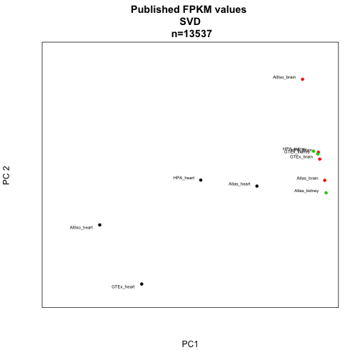
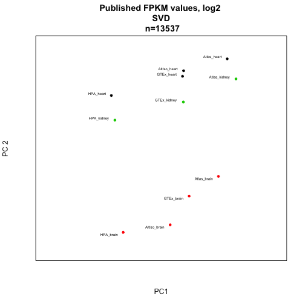
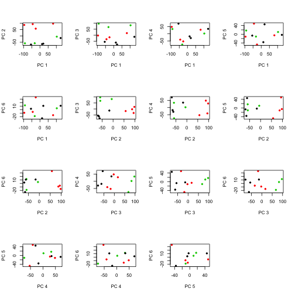
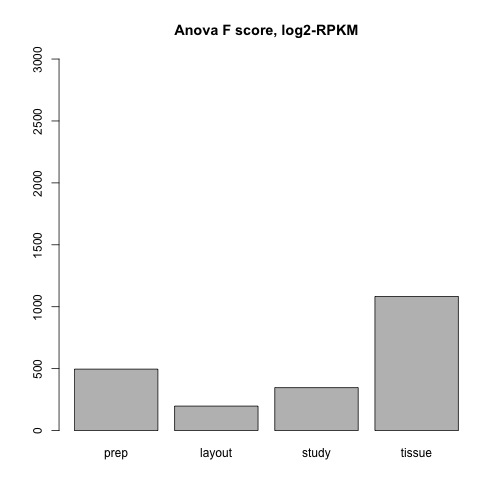

Downloading the F/RPKM data
---------------------------

Prepare by defining functions etc.

```r
library(pheatmap)
library(gplots)
```

```
## KernSmooth 2.23 loaded
## Copyright M. P. Wand 1997-2009
## 
## Attaching package: 'gplots'
## 
## The following object is masked from 'package:stats':
## 
##     lowess
```

```r
library(ops)
```

```
## 
## Attaching package: 'ops'
## 
## The following object is masked from 'package:stats':
## 
##     filter
```

```r
library(calibrate)
```

```
## Loading required package: MASS
```

```r
do.SVD = function(m, comp.1=1, comp.2=2){ # returns eig.cell
  s <- svd(m)
	ev <- s$d^2 / sum(s$d^2)
	return(s$u[,c(comp.1, comp.2)])
}

project.SVD <- function(m, eig.cell){
	return(t(m) %*% eig.cell)
}

plot.SVD <- function(m, comp.1=1, comp.2=2, groups=rep("blue", ncol(m)), title=""){
	eig <- do.SVD(m, comp.1, comp.2)
	proj <- project.SVD(m, eig)
	xminv <- min(proj[,1]) # - .2 * abs(min(proj[,1]))
	xmaxv <- max(proj[,1]) # + .2 * abs(max(proj[,1]))
	yminv <- min(proj[,2]) # - .2 * abs(min(proj[,2]))
	ymaxv <- max(proj[,2]) # + .2 * abs(max(proj[,2]))
	plot(proj,pch=20,col="white",xlim=c(xminv,xmaxv),ylim=c(yminv,ymaxv),xaxt='n',yaxt='n',xlab="PC1",ylab="PC2",main=title)
	
	points(proj, col=as.character(groups),pch=20) # , #pch=c(rep(15,3),rep(17,3),rep(19,3),rep(18,3),rep(20,2)), cex=2)
	textxy(proj[,1],proj[,2],labs=colnames(m))
}

loadings.SVD <- function(m, comp=1, gene.ids = rownames(m)){
	s <- svd(m)
	l <- s$u[,comp]
	names(l) <- gene.ids
	l.s <- l[order(l)]
	return(l.s)
}

plot.loadings.SVD <- function(m, comp=1, cutoff=0.1, gene.ids = rownames(m)){
	l <- loadings.SVD(m, comp, gene.ids)
	barplot(l[abs(l)>cutoff],las=2,main=paste("PC", comp, "cutoff", cutoff),cex.names=0.6)
}

plotPC <- function(matrix,a,b,desc,colors){
eig <- do.SVD(matrix, a, b)
proj <- project.SVD(matrix, eig)
xminv <- min(proj[,1]) - .2 * abs(min(proj[,1]))
xmaxv <- max(proj[,1]) + .2 * abs(max(proj[,1]))
yminv <- min(proj[,2]) - .2 * abs(min(proj[,2]))
ymaxv <- max(proj[,2]) + .2 * abs(max(proj[,2]))
plot(proj,pch=20,xlim=c(xminv,xmaxv),ylim=c(yminv,ymaxv),xaxt='n',yaxt='n',xlab=paste0("PC",a),ylab=paste("PC",b),col=colors,main=desc)
textxy(proj[,1],proj[,2],labs=rownames(proj))
}
```

Here, we download data from various public sources and extract the brain, heart and kidney samples.

"HPA": Human Protein Atlas

```r
#temp <- tempfile()
#download.file(url="http://www.proteinatlas.org/download/rna.csv.zip",destfile=temp)
#hpa <- read.csv(unz(temp, "rna.csv"))
#unlink(temp)

#hpa.heart <- hpa[hpa$Sample=="heart muscle", c("Gene", "Value")]
#hpa.brain <- hpa[hpa$Sample=="cerebral cortex", c("Gene", "Value")]
#hpa.kidney <- hpa[hpa$Sample=="kidney", c("Gene", "Value")]

#hpa.fpkms <- merge(hpa.heart, hpa.brain, by="Gene")
#hpa.fpkms <- merge(hpa.fpkms, hpa.kidney, by="Gene")
#colnames(hpa.fpkms) <- c("ENSG_ID", "HPA_heart", "HPA_brain", "HPA_kidney")
```

Check if the identifiers are unique and write table to file.

```r
#length(hpa.fpkms[,1])
#length(unique(hpa.fpkms[,1]))

#write.table(hpa.fpkms,file="hpa_fpkms.txt",quote=F,sep="\t")
```

"Altiso": Alternative isoform regulation in human tissue transcriptomes

```r
#temp <- tempfile()
#download.file(url="http://genes.mit.edu/burgelab/Supplementary/wang_sandberg08/hg18.ensGene.CEs.rpkm.txt",destfile=temp)
#altiso <- read.delim(temp, sep="\t")
#unlink(temp)
```

There is no kidney sample here, so just use heart + brain


```r
#altiso.fpkms <- altiso[,c("X.Gene","heart","brain")]
#colnames(altiso.fpkms) <- c("ENSG_ID", "AltIso_heart", "AltIso_brain")
```

Check uniqueness of IDs.


```r
#length(altiso.fpkms[,1])
#length(unique(altiso.fpkms[,1]))

#write.table(altiso.fpkms,file="altiso_fpkms.txt",quote=F,sep="\t")
```

"GTEx": Genotype-Tissue Expression

This is a big download: 337.8 Mb (as of 2014-02-04)
We also add some code to randomly select one sample from each tissue type; there are many biological replicates in this data set.


```r
#temp <- tempfile()
#download.file(url="http://www.broadinstitute.org/gtex/rest/file/download?portalFileId=119363&forDownload=true",destfile=temp)
#header_lines <- readLines(temp, n=2)
#gtex <- read.delim(temp, skip=2, sep="\t")
#unlink(temp)

#write.table(gtex, file="gtex_all.txt", 	quote=F, sep="\t")

#download.file(url="http://www.broadinstitute.org/gtex/rest/file/download?portalFileId=119273&forDownload=true",destfile="GTEx_description.txt")

#metadata <- read.delim("GTEx_description.txt", sep="\t")
```

The metadata table seems to contain entries that are not in the RPKM table.


```r
#samp.id <- gsub('-','.',metadata$SAMPID)
#eligible.samples <- which(samp.id %in% colnames(gtex))
#metadata <- metadata[eligible.samples,]
```

Select random heart, kidney and brain samples.


```r
#random.heart <- sample(which(metadata$SMTS=="Heart"), size=1)
#random.heart.samplename <- gsub('-','.',metadata[random.heart, "SAMPID"])
#gtex.heart.fpkm <- as.numeric(gtex[,random.heart.samplename])

#random.brain <- sample(which(metadata$SMTS=="Brain"), size=1)
#random.brain.samplename <- gsub('-','.',metadata[random.brain, "SAMPID"])
#gtex.brain.fpkm <- as.numeric(gtex[,random.brain.samplename])

#random.kidney <- sample(which(metadata$SMTS=="Kidney"), size=1)
#random.kidney.samplename <- gsub('-','.',metadata[random.kidney, "SAMPID"])
#gtex.kidney.fpkm <- as.numeric(gtex[,random.kidney.samplename])
```

Get gene IDs on same format as the other data sets by removing the part after the dot; check ID uniqueness and write to file.


```r
#gtex.names <- gtex[,"Name"]
#temp_list <- strsplit(as.character(gtex.names), split="\\.")
#gtex.names.nodot <- unlist(temp_list)[2*(1:length(gtex.names))-1]

#gtex.fpkms <- data.frame(ENSG_ID=gtex.names.nodot, GTEx_heart=gtex.heart.fpkm, GTEx_brain=gtex.brain.fpkm,GTEx_kidney=gtex.kidney.fpkm)

#length(gtex.fpkms[,1])
#length(unique(gtex.fpkms[,1]))

#write.table(gtex.fpkms,file="gtex_fpkms.txt",quote=F,sep="\t")
```

*RNA-seq Atlas*


```r
#temp <- tempfile()
#download.file(url="http://medicalgenomics.org/rna_seq_atlas/download?download_revision1=1",destfile=temp)
#atlas <- read.delim(temp, sep="\t")
#unlink(temp)

#atlas.fpkms <- atlas[,c("ensembl_gene_id","heart","hypothalamus","kidney")]
#colnames(atlas.fpkms) <- c("ENSG_ID","Atlas_heart","Atlas_brain","Atlas_kidney")
#write.table(atlas.fpkms,file="atlas_fpkms.txt",quote=F,sep="\t")
```

Combining F/RPKM values from public data sets
---------------------------------------------

We will join the data sets on ENSEMBL ID:s, losing a lot of data in the process - but joining on gene symbols or something else would lead to an even worse loss. 


```r
library(org.Hs.eg.db) # for transferring gene identifiers
```

```
## Loading required package: AnnotationDbi
## Loading required package: BiocGenerics
## Loading required package: parallel
## 
## Attaching package: 'BiocGenerics'
## 
## The following objects are masked from 'package:parallel':
## 
##     clusterApply, clusterApplyLB, clusterCall, clusterEvalQ,
##     clusterExport, clusterMap, parApply, parCapply, parLapply,
##     parLapplyLB, parRapply, parSapply, parSapplyLB
## 
## The following object is masked from 'package:stats':
## 
##     xtabs
## 
## The following objects are masked from 'package:base':
## 
##     anyDuplicated, append, as.data.frame, as.vector, cbind,
##     colnames, duplicated, eval, evalq, Filter, Find, get,
##     intersect, is.unsorted, lapply, Map, mapply, match, mget,
##     order, paste, pmax, pmax.int, pmin, pmin.int, Position, rank,
##     rbind, Reduce, rep.int, rownames, sapply, setdiff, sort,
##     table, tapply, union, unique, unlist
## 
## Loading required package: Biobase
## Welcome to Bioconductor
## 
##     Vignettes contain introductory material; view with
##     'browseVignettes()'. To cite Bioconductor, see
##     'citation("Biobase")', and for packages 'citation("pkgname")'.
## 
## 
## Attaching package: 'AnnotationDbi'
## 
## The following object is masked from 'package:MASS':
## 
##     select
## 
## Loading required package: DBI
```

```r
library(data.table) # for collapsing transcript RPKMs
library(pheatmap) # for nicer visualization
library(edgeR) # for TMM normalization
```

```
## Loading required package: limma
## 
## Attaching package: 'limma'
## 
## The following object is masked from 'package:BiocGenerics':
## 
##     plotMA
```

```r
#hpa.fpkms <- read.delim("hpa_fpkms.txt")
#altiso.fpkms <- read.delim("altiso_fpkms.txt")
#gtex.fpkms <- read.delim("gtex_fpkms.txt")
#atlas.fpkms <- read.delim("atlas_fpkms.txt")
```

The RNA-seq Atlas data set uses many different identifiers, while the other all use ENSG as the primary identifier

Approach 1: Merge on ENSEMBL genes (ENSG) as given in RNA-seq Atlas. Note that there are repeated ENSG ID:s in RNA-seq Atlas, as opposed to the other data sets, so we need to do something about that. In this case, we just sum the transcripts that belong to each ENSG gene. We use data.table for this.


```r
#data.dt <- data.table(atlas.fpkms)
#setkey(data.dt, ENSG_ID)
#temp <- data.dt[, lapply(.SD, sum), by=ENSG_ID]
#collapsed <- as.data.frame(temp)
#atlas.fpkms.summed <- collapsed[,2:ncol(collapsed)] 
#rownames(atlas.fpkms.summed) <- collapsed[,1]

#atlas.fpkms.summed <- atlas.fpkms.summed[2:nrow(atlas.fpkms.summed),]
```

Finally, combine all the data sets into a data frame.


```r
#fpkms <- merge(hpa.fpkms, altiso.fpkms, by="ENSG_ID")
#fpkms <- merge(fpkms, gtex.fpkms, by="ENSG_ID")
#fpkms <- merge(fpkms, atlas.fpkms.summed, by.x="ENSG_ID", by.y=0)
#gene_id <- fpkms[,1]
#f <- fpkms[,2:ncol(fpkms)]
#rownames(f) <- gene_id
```

Check how many ENSG IDs we have left.


```r
#dim(f)
```

Approach 2: Try to map Entrez symbols to ENSEMBL to recover more ENSG IDs than already present in the table. 


```r
#m <- org.Hs.egENSEMBL
#mapped_genes <- mappedkeys(m)
#ensg.for.entrez <- as.list(m[mapped_genes])
#remapped.ensg <- ensg.for.entrez[as.character(atlas$entrez_gene_id)]

#atlas.fpkms$remapped_ensg <- as.character(remapped.ensg)

# And add expression values
#data.dt <- data.table(atlas.fpkms[,2:ncol(atlas.fpkms)])
#setkey(data.dt, remapped_ensg)
#temp <- data.dt[, lapply(.SD, sum), by=remapped_ensg]
#collapsed <- as.data.frame(temp)
#atlas.fpkms.summed <- collapsed[,2:ncol(collapsed)] 
#rownames(atlas.fpkms.summed) <- collapsed[,1]
```

Combine data sets again


```r
#fpkms <- merge(hpa.fpkms, altiso.fpkms, by="ENSG_ID")
#fpkms <- merge(fpkms, gtex.fpkms, by="ENSG_ID")
#fpkms <- merge(fpkms, atlas.fpkms.summed, by.x="ENSG_ID", by.y=0)
#gene_id <- fpkms[,1]
#f <- fpkms[,2:ncol(fpkms)]
#rownames(f) <- gene_id
#write.table(f, file = 'published_rpkms.txt', quote=F)
```

Check how many ENSG IDs we have left.


```r
f <- read.delim("published_rpkms.txt",sep=" ")
sampleinfo <- read.table("sample_info_published.txt",header=TRUE)
#dim(f)
```

This looks much better. 
Let's remove all lines where FPKM is close to zero in all samples before we proceed with this version of the data set:


```r
f.nozero <- f[-which(rowSums(f[,])<=0.01),]
```

Start by a few correlation heat maps:

**Figure 1B**

Heatmap of Spearman correlations between published expression profiles (# genes = 13,333)


```r
pheatmap(cor(f.nozero, method="spearman")) 
```

 

The brain samples are in a separate cluster, whereas the heart and kidney ones are intermixed.

Alternatively, one could use Pearson correlation (not shown in paper):


```r
pheatmap(cor(f.nozero))
```

 

Sometimes the linear (Pearson) correlation works better on log values.  (not shown in paper):


```r
pseudo <- 1
fpkms.log <- log2(f.nozero + pseudo)
pheatmap(cor(fpkms.log))
```

 

```r
write.table(fpkms.log, file="published_rpkms_log2.txt", quote=F)
```

What if we drop the genes that have less than FPKM 1 on average? (not shown in paper):


```r
f.nolow <- f.nozero[-which(rowMeans(f.nozero)<1),]
pheatmap(cor(log2(f.nolow+pseudo)))
```

 

Try Anova on a "melted" expression matrix with some metadata:


```r
library(reshape)
m <- melt(f.nozero)
```

```
## Using  as id variables
```

```r
colnames(m) <- c("sample_ID","RPKM")
#meta <- data.frame(tissue=c("heart","brain","kidney","heart","brain","heart","brain","kidney","heart","brain","kidney"),study=c("HPA","HPA","HPA","AltIso","AltIso","GTex","GTex","GTex","Atlas","Atlas","Atlas"),prep=c(rep("poly-A",8),rep("rRNA-depl",3)),layout=c(rep("PE",3),rep("SE",2),rep("PE",3),rep("SE",3)))
meta <- sampleinfo[,c("Study","Tissue","Preparation","NumberRaw","Numbermapped","Readtype")]
rownames(meta) <- colnames(f.nozero)
tissue <- rep(meta$Tissue, each=nrow(f.nozero))
study <- rep(meta$Study, each=nrow(f.nozero))
prep <- rep(meta$Preparation, each=nrow(f.nozero))
layout <- rep(meta$Readtype, each=nrow(f.nozero))
raw <- rep(meta$NumberRaw, each=nrow(f.nozero))
mapped <- rep(meta$Numbermapped, each=nrow(f.nozero))
data <- data.frame(m, tissue=tissue, study=study, prep=prep, layout=layout,nraw=raw,nmapped=mapped)
subset <- data[sample(1:nrow(data), 1000),]
fit <- lm(RPKM ~ study + nraw + layout + prep + tissue, data=data)
a <- anova(fit)
maxval = 3000
```

**Figure 1X**


```r
barplot(a$"F value"[-7],names.arg=rownames(a)[-7],main="Anova F score, Raw RPKM",ylim=c(0,maxval))
```

 

```r
print(a)
```

```
## Analysis of Variance Table
## 
## Response: RPKM
##               Df   Sum Sq Mean Sq F value  Pr(>F)    
## study          3 4.11e+06 1369775  102.59 < 2e-16 ***
## nraw           1 2.50e+04   25029    1.87    0.17    
## tissue         2 4.72e+05  236037   17.68 2.1e-08 ***
## Residuals 146546 1.96e+09   13352                    
## ---
## Signif. codes:  0 '***' 0.001 '**' 0.01 '*' 0.05 '.' 0.1 ' ' 1
```
the number of raw reads, the number of mapped reads, the layout (single-end or paired-end), the library preparation method, the study, and the tissue
Let's look at a few SVD plots. 

**Figure 1C**


```r
colors <- c(1,2,3,1,2,1,2,3,1,2,3)
plotPC(f.nozero, 1, 2, "Published FPKM values \n SVD \n n=13333", colors=colors)
```

 

The heart samples are clearly separating into their own group.

**Figure 1D** (not included in the current manuscript version)


```r
plotPC(f.nozero, 2, 3, "Published FPKM values \n SVD \n n=13333", colors=colors)
```

 

We can plot all pairwise combinations of principal components 1 to 5. (not shown in paper)
Start with SVD on the "raw" F/RPKMs.


```r
colors <- c(1,2,3,1,2,1,2,3,1,2,3)

par(mfrow=c(4,4))
for (i in 1:6){
  for(j in 1:6){
		if (i<j){ 
		plotPC(f.nozero,i,j,desc="",colors=colors)
		}
	}
}
```

 

**Code for figure 2**

Figure 2 deals with log-transformed F/RPKM values from published data sets. 

PCA on log2-FPKM values:

**Figure 2A**


```r
pseudo <- 1
fpkms.log <- log2(f.nozero + pseudo)

plotPC(fpkms.log, 1, 2, desc="Published FPKM values, log2 \n SVD \n n=13333", colors=colors)
```

 

**Figure 2B**


```r
plotPC(fpkms.log, 2, 3, desc="Published FPKM values, log2 \n SVD \n n=13333", colors=colors)
```

 

Alternatively, with PCA (prcomp()) the plot would have looked like this (all combinations of top 5 PCs):


```r
colors <- c(1,2,3,1,2,1,2,3,1,2,3)

p <- prcomp(t(fpkms.log))

par(mfrow=c(4,4))
for (i in 1:6){
  for(j in 1:6){
		if (i<j){ 
    	plot(p$x[,i],p$x[,j],pch=20,col=colors,xlab=paste("PC", i),ylab=paste("PC", j))
		}
	}
}
```

 

**Figure 2C**


Let's have a look at the 100 most highly expressed genes in each sample and see how many of these genes that are shared between the studies


```r
library(VennDiagram)
```

```
## Loading required package: grid
```

```r
HPA_b <- rownames(f[order(f$HPA_brain,decreasing=T),][1:100,])
HPA_h <- rownames(f[order(f$HPA_heart,decreasing=T),][1:100,])
HPA_k <- rownames(f[order(f$HPA_kidney,decreasing=T),][1:100,])

AltIso_b <- rownames(f[order(f$AltIso_brain,decreasing=T),][1:100,])
AltIso_h <- rownames(f[order(f$AltIso_heart,decreasing=T),][1:100,])

GTEx_b <- rownames(f[order(f$GTEx_brain,decreasing=T),][1:100,])
GTEx_h <- rownames(f[order(f$GTEx_heart,decreasing=T),][1:100,])
GTEx_k <- rownames(f[order(f$GTEx_kidney,decreasing=T),][1:100,])

Atlas_b <- rownames(f[order(f$Atlas_brain,decreasing=T),][1:100,])
Atlas_h <- rownames(f[order(f$Atlas_heart,decreasing=T),][1:100,])
Atlas_k <- rownames(f[order(f$Atlas_kidney,decreasing=T),][1:100,])
```
Let's start with the four brain samples:


```r
draw.quad.venn(100, 100, 100, 100, 
               length(intersect(HPA_b,AltIso_b)),
               length(intersect(HPA_b,GTEx_b)),
               length(intersect(HPA_b,Atlas_b)),
               length(intersect(AltIso_b,GTEx_b)),
               length(intersect(AltIso_b,Atlas_b)),
               length(intersect(GTEx_b,Atlas_b)),
               length(intersect(intersect(HPA_b,AltIso_b),GTEx_b)),
               length(intersect(intersect(HPA_b,AltIso_b),Atlas_b)),
               length(intersect(intersect(HPA_b,GTEx_b),Atlas_b)),
               length(intersect(intersect(AltIso_b,GTEx_b),Atlas_b)),
               length(intersect(intersect(HPA_b,AltIso_b),intersect(Atlas_b,GTEx_b))),
               category = c("HPA","AltIso","GTEx","Atlas"), lwd = rep(0, 4), lty = rep("solid", 4),
               fill = c("mistyrose","steelblue","lightgoldenrod","darkseagreen")
)
```

 

```
## (polygon[GRID.polygon.321], polygon[GRID.polygon.322], polygon[GRID.polygon.323], polygon[GRID.polygon.324], polygon[GRID.polygon.325], polygon[GRID.polygon.326], polygon[GRID.polygon.327], polygon[GRID.polygon.328], text[GRID.text.329], text[GRID.text.330], text[GRID.text.331], text[GRID.text.332], text[GRID.text.333], text[GRID.text.334], text[GRID.text.335], text[GRID.text.336], text[GRID.text.337], text[GRID.text.338], text[GRID.text.339], text[GRID.text.340], text[GRID.text.341], text[GRID.text.342], text[GRID.text.343], text[GRID.text.344], text[GRID.text.345], text[GRID.text.346], text[GRID.text.347])
```

Let's investigate the heart samples:


```r
h_Ids <- list(HPA_h,AltIso_h,GTEx_h,Atlas_h)
draw.quad.venn(100, 100, 100, 100, 
               length(intersect(HPA_h,AltIso_h)),
               length(intersect(HPA_h,GTEx_h)),
               length(intersect(HPA_h,Atlas_h)),
               length(intersect(AltIso_h,GTEx_h)),
               length(intersect(AltIso_h,Atlas_h)),
               length(intersect(GTEx_h,Atlas_h)),
               length(intersect(intersect(HPA_h,AltIso_h),GTEx_h)),
               length(intersect(intersect(HPA_h,AltIso_h),Atlas_h)),
               length(intersect(intersect(HPA_h,GTEx_h),Atlas_h)),
               length(intersect(intersect(AltIso_h,GTEx_h),Atlas_h)),
               length(intersect(intersect(HPA_h,AltIso_h),intersect(Atlas_h,GTEx_h))),
               category = c("HPA","AltIso","GTEx","Atlas"), lwd = rep(0, 4), lty = rep("solid", 4),
               fill = c("mistyrose","steelblue","lightgoldenrod","darkseagreen")
)
```

 

```
## (polygon[GRID.polygon.348], polygon[GRID.polygon.349], polygon[GRID.polygon.350], polygon[GRID.polygon.351], polygon[GRID.polygon.352], polygon[GRID.polygon.353], polygon[GRID.polygon.354], polygon[GRID.polygon.355], text[GRID.text.356], text[GRID.text.357], text[GRID.text.358], text[GRID.text.359], text[GRID.text.360], text[GRID.text.361], text[GRID.text.362], text[GRID.text.363], text[GRID.text.364], text[GRID.text.365], text[GRID.text.366], text[GRID.text.367], text[GRID.text.368], text[GRID.text.369], text[GRID.text.370], text[GRID.text.371], text[GRID.text.372], text[GRID.text.373], text[GRID.text.374])
```

...and the three kidney samples:


```r
k_Ids <- list(HPA_k,GTEx_k,Atlas_k)
draw.triple.venn(100, 100, 100, 
                 length(intersect(HPA_k,GTEx_k)),
                 length(intersect(GTEx_k,Atlas_k)),
                 length(intersect(HPA_k,Atlas_k)),
                 length(intersect(intersect(HPA_k,GTEx_k),Atlas_k)),
                 category = c("HPA","GTEx","Atlas"), lwd = rep(0, 3), lty = rep("solid", 3),
                 fill = c("steelblue","lightgoldenrod","darkseagreen")
)
```

 

```
## (polygon[GRID.polygon.375], polygon[GRID.polygon.376], polygon[GRID.polygon.377], polygon[GRID.polygon.378], polygon[GRID.polygon.379], polygon[GRID.polygon.380], text[GRID.text.381], text[GRID.text.382], text[GRID.text.383], text[GRID.text.384], text[GRID.text.385], text[GRID.text.386], text[GRID.text.387], text[GRID.text.388], text[GRID.text.389], text[GRID.text.390])
```

**Figure 2D**


```r
m <- melt(fpkms.log)
```

```
## Using  as id variables
```

```r
colnames(m) <- c("sample_ID","log2RPKM")
data <- data.frame(m, tissue=tissue, study=study, prep=prep, layout=layout,nraw=raw,nmapped=mapped)
#subset <- data[sample(1:nrow(data), 1000),]
fit <- lm(log2RPKM ~ study + nraw + layout + prep + tissue, data=data)
b <- anova(fit)

maxval=8000
barplot(b$"F value"[-5],names.arg=rownames(b)[-5],main="Anova F score, log2-RPKM",ylim=c(0,maxval))
```

 

```r
print(b)
```

```
## Analysis of Variance Table
## 
## Response: log2RPKM
##               Df Sum Sq Mean Sq F value  Pr(>F)    
## study          3  28954    9651  2640.1 < 2e-16 ***
## nraw           1     42      42    11.4 0.00073 ***
## tissue         2   1481     740   202.5 < 2e-16 ***
## Residuals 146546 535714       4                    
## ---
## Signif. codes:  0 '***' 0.001 '**' 0.01 '*' 0.05 '.' 0.1 ' ' 1
```

**Code for figure 3**

Figure 3 is about ComBat.

Combat analysis is performed on logged values (n=13333)


```r
library(sva)
```

```
## Loading required package: corpcor
## Loading required package: mgcv
## Loading required package: nlme
## This is mgcv 1.8-1. For overview type 'help("mgcv-package")'.
```

```r
meta <- data.frame(study=c(rep("HPA",3),rep("AltIso",2),rep("GTex",3),rep("Atlas",3)),tissue=c("Heart","Brain","Kidney","Heart","Brain","Heart","Brain","Kidney","Heart","Brain","Kidney"))

batch <- meta$study
design <- model.matrix(~as.factor(tissue),data=meta)

combat <- ComBat(dat=fpkms.log,batch=batch,mod=design,numCovs=NULL,par.prior=TRUE)
```

```
## Found 4 batches
## Found 2  categorical covariate(s)
## Standardizing Data across genes
## Fitting L/S model and finding priors
## Finding parametric adjustments
## Adjusting the Data
```

```r
write.table(combat, file="published_rpkms_combat_log2.txt", quote=F)

pheatmap(cor(combat))
```

 

```r
colors <- c(1,2,3,1,2,1,2,3,1,2,3)

plotPC(combat,1,2,colors=colors,desc="Published F/RPKM values, ComBat adjusted log2 TMM values \n SVD \n n=13333")
```

 

```r
plotPC(combat,2,3,colors=colors,desc="Published F/RPKM values, ComBat adjusted log2 TMM values \n SVD \n n=13333")
```

 

Let's have a look again at the 100 most highly expressed genes in each sample and see how many of these genes that are shared between the studies, but this time looking at the values after the ComBat run:


```r
HPA_b_c <- rownames(combat[order(combat[,1],decreasing=T),][1:100,])
HPA_h_c <- rownames(combat[order(combat[,2],decreasing=T),][1:100,])
HPA_k_c <- rownames(combat[order(combat[,3],decreasing=T),][1:100,])

AltIso_b_c <- rownames(combat[order(combat[,4],decreasing=T),][1:100,])
AltIso_h_c <- rownames(combat[order(combat[,5],decreasing=T),][1:100,])

GTEx_b_c <- rownames(combat[order(combat[,6],decreasing=T),][1:100,])
GTEx_h_c <- rownames(combat[order(combat[,7],decreasing=T),][1:100,])
GTEx_k_c <- rownames(combat[order(combat[,8],decreasing=T),][1:100,])

Atlas_b_c <- rownames(combat[order(combat[,9],decreasing=T),][1:100,])
Atlas_h_c <- rownames(combat[order(combat[,10],decreasing=T),][1:100,])
Atlas_k_c <- rownames(combat[order(combat[,11],decreasing=T),][1:100,])
```
Brain:

```r
library(gridExtra)
r <- rectGrob(gp=gpar(fill="white",lwd=0))
top <- arrangeGrob(r, r, r, r, nrow=2)
grid.arrange(top, r, ncol=1, main = "\nBrain Combat", heights=c(2, 1))

draw.quad.venn(100, 100, 100, 100, 
               length(intersect(HPA_b_c,AltIso_b_c)),
               length(intersect(HPA_b_c,GTEx_b_c)),
               length(intersect(HPA_b_c,Atlas_b_c)),
               length(intersect(AltIso_b_c,GTEx_b_c)),
               length(intersect(AltIso_b_c,Atlas_b_c)),
               length(intersect(GTEx_b_c,Atlas_b_c)),
               length(intersect(intersect(HPA_b_c,AltIso_b_c),GTEx_b_c)),
               length(intersect(intersect(HPA_b_c,AltIso_b_c),Atlas_b_c)),
               length(intersect(intersect(HPA_b_c,GTEx_b_c),Atlas_b_c)),
               length(intersect(intersect(AltIso_b_c,GTEx_b_c),Atlas_b_c)),
               length(intersect(intersect(HPA_b_c,AltIso_b_c),intersect(Atlas_b_c,GTEx_b_c))),
               category = c("HPA","AltIso","GTEx","Atlas"), lwd = rep(0, 4), lty = rep("solid", 4),
               fill = c("mistyrose","steelblue","lightgoldenrod","darkseagreen")
)
```

 

```
## (polygon[GRID.polygon.524], polygon[GRID.polygon.525], polygon[GRID.polygon.526], polygon[GRID.polygon.527], polygon[GRID.polygon.528], polygon[GRID.polygon.529], polygon[GRID.polygon.530], polygon[GRID.polygon.531], text[GRID.text.532], text[GRID.text.533], text[GRID.text.534], text[GRID.text.535], text[GRID.text.536], text[GRID.text.537], text[GRID.text.538], text[GRID.text.539], text[GRID.text.540], text[GRID.text.541], text[GRID.text.542], text[GRID.text.543], text[GRID.text.544], text[GRID.text.545], text[GRID.text.546], text[GRID.text.547], text[GRID.text.548], text[GRID.text.549], text[GRID.text.550])
```
Heart:

```r
r <- rectGrob(gp=gpar(fill="white",lwd=0))
top <- arrangeGrob(r, r, r, r, nrow=2)
grid.arrange(top, r, ncol=1, main = "\nHeart Combat", heights=c(2, 1))

draw.quad.venn(100, 100, 100, 100, 
               length(intersect(HPA_h_c,AltIso_h_c)),
               length(intersect(HPA_h_c,GTEx_h_c)),
               length(intersect(HPA_h_c,Atlas_h_c)),
               length(intersect(AltIso_h_c,GTEx_h_c)),
               length(intersect(AltIso_h_c,Atlas_h_c)),
               length(intersect(GTEx_h_c,Atlas_h_c)),
               length(intersect(intersect(HPA_h_c,AltIso_h_c),GTEx_h_c)),
               length(intersect(intersect(HPA_h_c,AltIso_h_c),Atlas_h_c)),
               length(intersect(intersect(HPA_h_c,GTEx_h_c),Atlas_h_c)),
               length(intersect(intersect(AltIso_h_c,GTEx_h_c),Atlas_h_c)),
               length(intersect(intersect(HPA_h_c,AltIso_h_c),intersect(Atlas_h_c,GTEx_h_c))),
               category = c("HPA","AltIso","GTEx","Atlas"), lwd = rep(0, 4), lty = rep("solid", 4),
               fill = c("mistyrose","steelblue","lightgoldenrod","darkseagreen")
               
)
```

 

```
## (polygon[GRID.polygon.594], polygon[GRID.polygon.595], polygon[GRID.polygon.596], polygon[GRID.polygon.597], polygon[GRID.polygon.598], polygon[GRID.polygon.599], polygon[GRID.polygon.600], polygon[GRID.polygon.601], text[GRID.text.602], text[GRID.text.603], text[GRID.text.604], text[GRID.text.605], text[GRID.text.606], text[GRID.text.607], text[GRID.text.608], text[GRID.text.609], text[GRID.text.610], text[GRID.text.611], text[GRID.text.612], text[GRID.text.613], text[GRID.text.614], text[GRID.text.615], text[GRID.text.616], text[GRID.text.617], text[GRID.text.618], text[GRID.text.619], text[GRID.text.620])
```
Kidney:

```r
r <- rectGrob(gp=gpar(fill="white",lwd=0))
top <- arrangeGrob(r, r, r, r, nrow=2)
grid.arrange(top, r, ncol=1, main = "\n\nKidney Combat", heights=c(2, 1))

draw.triple.venn(100, 100, 100, 
                 length(intersect(HPA_k_c,GTEx_k_c)),
                 length(intersect(GTEx_k_c,Atlas_k_c)),
                 length(intersect(HPA_k_c,Atlas_k_c)),
                 length(intersect(intersect(HPA_k_c,GTEx_k_c),Atlas_k_c)),
                 category = c("HPA","GTEx","Atlas"), lwd = rep(0, 3), lty = rep("solid", 3),
                 fill = c("steelblue","lightgoldenrod","darkseagreen")
)
```

 

```
## (polygon[GRID.polygon.664], polygon[GRID.polygon.665], polygon[GRID.polygon.666], polygon[GRID.polygon.667], polygon[GRID.polygon.668], polygon[GRID.polygon.669], text[GRID.text.670], text[GRID.text.671], text[GRID.text.672], text[GRID.text.673], text[GRID.text.674], text[GRID.text.675], text[GRID.text.676], text[GRID.text.677], text[GRID.text.678], text[GRID.text.679])
```

Revisit Anova with combated values.


```r
m <- melt(combat)
```

```
## Using  as id variables
```

```r
colnames(m) <- c("sample_ID","combat")
data <- data.frame(m, tissue=tissue, study=study, prep=prep, layout=layout,nraw=raw,nmapped=mapped)
fit <- lm(combat ~ study + nraw + layout + prep + tissue, data=data)
c <- anova(fit)

maxval <- 500
barplot(c$"F value"[-7],names.arg=rownames(b)[-7],main="Anova F score, Combat",ylim=c(0,maxval))
```

 

```r
print(c)
```

```
## Analysis of Variance Table
## 
## Response: combat
##               Df Sum Sq Mean Sq F value Pr(>F)    
## study          3      6       2    0.59 0.6228    
## nraw           1     21      21    6.66 0.0099 ** 
## tissue         2   1424     712  221.43 <2e-16 ***
## Residuals 146546 471365       3                   
## ---
## Signif. codes:  0 '***' 0.001 '**' 0.01 '*' 0.05 '.' 0.1 ' ' 1
```

Define a function for printing out correlations between experimental factors and principal components from prcomp() or svd().


```r
print_PCA_SVD_corrs <- function(data){
pca <- prcomp(t(data[,]))

#var.percent <- ((pca$sdev)^2)/sum(pca$sdev^2) *100
#var.percent <- (pca$d^2 / sum(pca$d^2) ) *100
#barplot(var.percent[1:5], xlab="PC", ylab="Percent Variance",names.arg=1:length(var.percent[1:5]), las=1,ylim=c(0,max(var.percent[1:5])+10), col="gray")

rot <- pca$r
x <- pca$x
#plot(pca)
#summary(pca)
#screeplot(pca,type=c("lines"))
# Test correlations between number of seq'd reads and PCs 1-4 from prcomp
pval.nraw.pc1 <- cor.test(x[,1], sampleinfo$NumberRaw,method="spearman")$p.value
pval.nraw.pc2 <- cor.test(x[,2], sampleinfo$NumberRaw,method="spearman")$p.value
pval.nraw.pc3 <- cor.test(x[,3], sampleinfo$NumberRaw,method="spearman")$p.value
pval.nraw.pc4 <- cor.test(x[,4], sampleinfo$NumberRaw,method="spearman")$p.value

cat(sprintf("Number_of_rawreads~PCAs: PCA1=\"%f\"PCA2=\"%f\"PCA3=\"%f\"PCA4=\"%f\n", pval.nraw.pc1,pval.nraw.pc2,pval.nraw.pc3,pval.nraw.pc4))

# Thus no significant correlations between no of seq'd reads and PCs 1-4

pval.nmapped.pc1 <- cor.test(x[,1], sampleinfo$Numbermapped,method="spearman")$p.value
pval.nmapped.pc2 <- cor.test(x[,2], sampleinfo$Numbermapped,method="spearman")$p.value
pval.nmapped.pc3 <- cor.test(x[,3], sampleinfo$Numbermapped,method="spearman")$p.value
pval.nmapped.pc4 <- cor.test(x[,4], sampleinfo$Numbermapped,method="spearman")$p.value

cat(sprintf("Number_of_mappedreads~PCAs: PCA1=\"%f\"PCA2=\"%f\"PCA3=\"%f\"PCA4=\"%f\n", pval.nmapped.pc1,pval.nmapped.pc2,pval.nmapped.pc3,pval.nmapped.pc4))

# For tissue, use kruskal.test which handles ordinal variables 
pval.tissue.pc1<-kruskal.test(x[,1], sampleinfo$Tissue)$p.value
pval.tissue.pc2<-kruskal.test(x[,2], sampleinfo$Tissue)$p.value
pval.tissue.pc3<-kruskal.test(x[,3], sampleinfo$Tissue)$p.value
pval.tissue.pc4<-kruskal.test(x[,4], sampleinfo$Tissue)$p.value

cat(sprintf("Tissues~PCAs: PCA1=\"%f\"PCA2=\"%f\"PCA3=\"%f\"\n", pval.tissue.pc1,pval.tissue.pc2,pval.tissue.pc3,pval.tissue.pc4))

# Library prep 
pval.prep.pc1<-kruskal.test(x[,1], sampleinfo$Preparation)$p.value
pval.prep.pc2<-kruskal.test(x[,2], sampleinfo$Preparation)$p.value
pval.prep.pc3<-kruskal.test(x[,3], sampleinfo$Preparation)$p.value
pval.prep.pc4<-kruskal.test(x[,4], sampleinfo$Preparation)$p.value

cat(sprintf("LibPrep~PCAs: PCA1=\"%f\"PCA2=\"%f\"PCA3=\"%f\"\n", pval.prep.pc1,pval.prep.pc2,pval.prep.pc3,pval.prep.pc4))

# Study  
pval.study.pc1<-kruskal.test(x[,1], sampleinfo$Study)$p.value
pval.study.pc2<-kruskal.test(x[,2], sampleinfo$Study)$p.value
pval.study.pc3<-kruskal.test(x[,3], sampleinfo$Study)$p.value
pval.study.pc4<-kruskal.test(x[,4], sampleinfo$Study)$p.value

cat(sprintf("Study~PCAs: PCA1=\"%f\"PCA2=\"%f\"PCA3=\"%f\"\n", pval.study.pc1,pval.study.pc2,pval.study.pc3,pval.study.pc4))

# Layout
pval.layout.pc1<-kruskal.test(x[,1], sampleinfo$readlength)$p.value
pval.layout.pc2<-kruskal.test(x[,2], sampleinfo$readlength)$p.value
pval.layout.pc3<-kruskal.test(x[,3], sampleinfo$readlength)$p.value
pval.layout.pc4<-kruskal.test(x[,4], sampleinfo$readlengt)$p.value

cat(sprintf("ReadType~PCAs: PCA1=\"%f\"PCA2=\"%f\"PCA3=\"%f\"\n", pval.layout.pc1,pval.layout.pc2,pval.layout.pc3,pval.layout.pc4))

# To test:
# same for logged values
# same for ComBat
# svd() without mean subtraction instead

#svd.12 <- do.SVD(f.nozero, comp.1=1, comp.2=2)
#svd.scores.12 <- project.SVD(f.nozero, svd.12)
svd.12 <- do.SVD(data, comp.1=1, comp.2=2)
svd.scores.12 <- project.SVD(data, svd.12)
# Number of raw reads
pval.nraw.svd1 <- cor.test(svd.scores.12[,1], sampleinfo$NumberRaw,method="spearman")$p.value
pval.nraw.svd2 <- cor.test(svd.scores.12[,2], sampleinfo$NumberRaw,method="spearman")$p.value
cat(sprintf("RawReads~SVDcomps: SVD-PC1=\"%f\"SVD-PC2=\"%f\"\n", pval.nraw.svd1,pval.nraw.svd2))
# Number of mapped reads
pval.nmapped.svd1 <- cor.test(svd.scores.12[,1], sampleinfo$Numbermapped,method="spearman")$p.value
pval.nmapped.svd2 <- cor.test(svd.scores.12[,2], sampleinfo$Numbermapped,method="spearman")$p.value
cat(sprintf("MappedReads~SVDcomps: SVD-PC1=\"%f\"SVD-PC2=\"%f\"\n", pval.nmapped.svd1,pval.nmapped.svd2))
# Layout / read length
pval.layout.svd1 <- kruskal.test(svd.scores.12[,1], sampleinfo$Readtype)$p.value
pval.layout.svd2 <- kruskal.test(svd.scores.12[,2], sampleinfo$Readtype)$p.value
cat(sprintf("Layout~SVDcomps: SVD-PC1=\"%f\"SVD-PC2=\"%f\"\n", pval.layout.svd1,pval.layout.svd2))
# Prep
pval.prep.svd1 <- kruskal.test(svd.scores.12[,1], sampleinfo$Preparation)$p.value
pval.prep.svd2 <- kruskal.test(svd.scores.12[,2], sampleinfo$Preparation)$p.value
cat(sprintf("Prep~SVDcomps: SVD-PC1=\"%f\"SVD-PC2=\"%f\"\n", pval.prep.svd1,pval.prep.svd2))
# Study
pval.study.svd1 <- kruskal.test(svd.scores.12[,1], sampleinfo$Study)$p.value
pval.study.svd2 <- kruskal.test(svd.scores.12[,2], sampleinfo$Study)$p.value
cat(sprintf("Study~SVDcomps: SVD-PC1=\"%f\"SVD-PC2=\"%f\"\n", pval.study.svd1,pval.study.svd2))
# Tissue
pval.tissue.svd1 <- kruskal.test(svd.scores.12[,1], sampleinfo$Tissue)$p.value
pval.tissue.svd2 <- kruskal.test(svd.scores.12[,2], sampleinfo$Tissue)$p.value
cat(sprintf("Tissue~SVDcomps: SVD-PC1=\"%f\"SVD-PC2=\"%f\"\n", pval.tissue.svd1,pval.tissue.svd2))
}
```

Test raw values, logged values and ComBat-processed values.

```r
print_PCA_SVD_corrs(f.nozero)
```

```
## Number_of_rawreads~PCAs: PCA1="0.248381"PCA2="0.402136"PCA3="0.693511"PCA4="0.129162
## Number_of_mappedreads~PCAs: PCA1="0.451197"PCA2="0.485476"PCA3="0.503067"PCA4="0.037001
## Tissues~PCAs: PCA1="0.027159"PCA2="0.618127"PCA3="0.374913"
## LibPrep~PCAs: PCA1="0.414216"PCA2="0.041227"PCA3="1.000000"
## Study~PCAs: PCA1="0.535538"PCA2="0.048584"PCA3="0.168499"
## ReadType~PCAs: PCA1="0.535538"PCA2="0.048584"PCA3="0.168499"
## RawReads~SVDcomps: SVD-PC1="0.313026"SVD-PC2="0.299388"
## MappedReads~SVDcomps: SVD-PC1="0.468184"SVD-PC2="0.129162"
## Layout~SVDcomps: SVD-PC1="0.855132"SVD-PC2="0.361310"
## Prep~SVDcomps: SVD-PC1="0.153042"SVD-PC2="0.220671"
## Study~SVDcomps: SVD-PC1="0.368849"SVD-PC2="0.433066"
## Tissue~SVDcomps: SVD-PC1="0.030197"SVD-PC2="0.106604"
```

```r
print_PCA_SVD_corrs(fpkms.log)
```

```
## Number_of_rawreads~PCAs: PCA1="0.418167"PCA2="0.614426"PCA3="0.902918"PCA4="0.213864
## Number_of_mappedreads~PCAs: PCA1="0.172787"PCA2="0.902918"PCA3="0.967576"PCA4="0.182532
## Tissues~PCAs: PCA1="0.618127"PCA2="0.019757"PCA3="0.021968"
## LibPrep~PCAs: PCA1="0.014306"PCA2="0.220671"PCA3="0.220671"
## Study~PCAs: PCA1="0.033146"PCA2="0.594709"PCA3="0.294275"
## ReadType~PCAs: PCA1="0.033146"PCA2="0.594709"PCA3="0.294275"
## RawReads~SVDcomps: SVD-PC1="0.313026"SVD-PC2="0.924426"
## MappedReads~SVDcomps: SVD-PC1="0.129162"SVD-PC2="0.557553"
## Layout~SVDcomps: SVD-PC1="0.028460"SVD-PC2="0.361310"
## Prep~SVDcomps: SVD-PC1="0.014306"SVD-PC2="0.414216"
## Study~SVDcomps: SVD-PC1="0.033146"SVD-PC2="0.732013"
## Tissue~SVDcomps: SVD-PC1="0.741380"SVD-PC2="0.019757"
```

```r
print_PCA_SVD_corrs(combat)
```

```
## Number_of_rawreads~PCAs: PCA1="0.503067"PCA2="0.860104"PCA3="0.713791"PCA4="0.967576
## Number_of_mappedreads~PCAs: PCA1="0.902918"PCA2="0.924426"PCA3="0.503067"PCA4="0.902918
## Tissues~PCAs: PCA1="0.011626"PCA2="0.011626"PCA3="0.913101"
## LibPrep~PCAs: PCA1="0.838256"PCA2="0.540291"PCA3="0.838256"
## Study~PCAs: PCA1="0.994579"PCA2="0.922207"PCA3="0.978077"
## ReadType~PCAs: PCA1="0.994579"PCA2="0.922207"PCA3="0.978077"
## RawReads~SVDcomps: SVD-PC1="0.902918"SVD-PC2="0.503067"
## MappedReads~SVDcomps: SVD-PC1="0.734252"SVD-PC2="0.902918"
## Layout~SVDcomps: SVD-PC1="0.855132"SVD-PC2="1.000000"
## Prep~SVDcomps: SVD-PC1="1.000000"SVD-PC2="0.838256"
## Study~SVDcomps: SVD-PC1="0.994579"SVD-PC2="0.994579"
## Tissue~SVDcomps: SVD-PC1="0.079937"SVD-PC2="0.011626"
```
