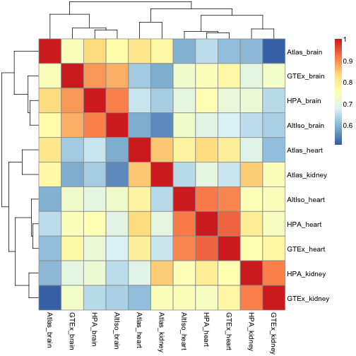
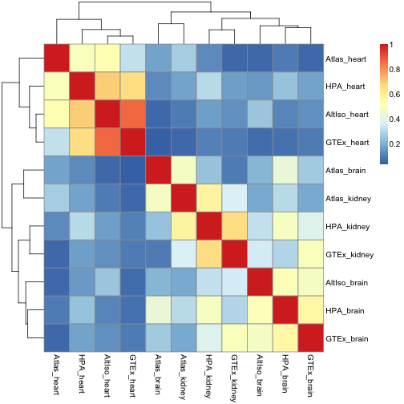
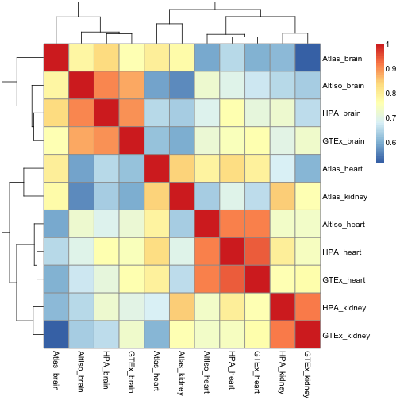
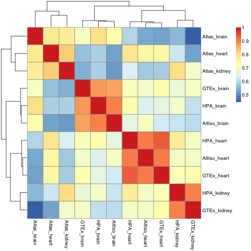
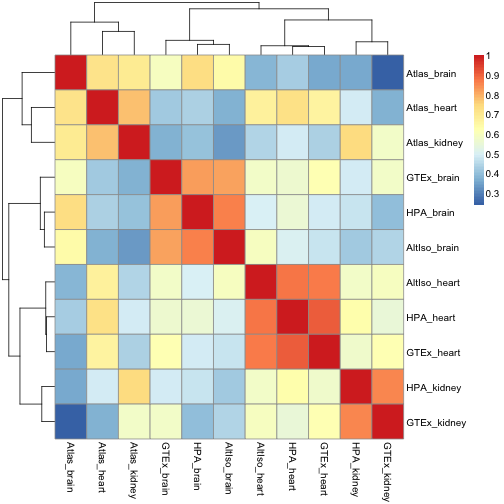
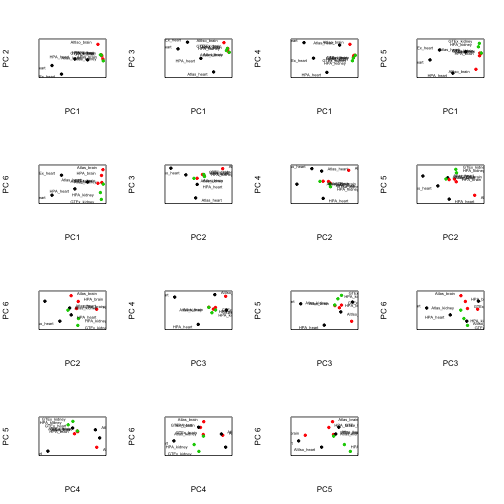
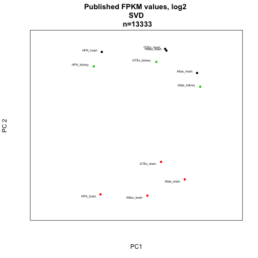

Downloading the F/RPKM data
---------------------------

Here, we download data from various public sources and extract the brain, heart and kidney samples.

"HPA": Human Protein Atlas

```r
# temp <- tempfile()
# download.file(url='http://www.proteinatlas.org/download/rna.csv.zip',destfile=temp)
# hpa <- read.csv(unz(temp, 'rna.csv')) unlink(temp)

# hpa.heart <- hpa[hpa$Sample=='heart muscle', c('Gene', 'Value')] hpa.brain
# <- hpa[hpa$Sample=='cerebral cortex', c('Gene', 'Value')] hpa.kidney <-
# hpa[hpa$Sample=='kidney', c('Gene', 'Value')]

# hpa.fpkms <- merge(hpa.heart, hpa.brain, by='Gene') hpa.fpkms <-
# merge(hpa.fpkms, hpa.kidney, by='Gene') colnames(hpa.fpkms) <-
# c('ENSG_ID', 'HPA_heart', 'HPA_brain', 'HPA_kidney')
```


Check if the identifiers are unique and write table to file.

```r
# length(hpa.fpkms[,1]) length(unique(hpa.fpkms[,1]))

# write.table(hpa.fpkms,file='hpa_fpkms.txt',quote=F,sep='\t')
```


"Altiso": Alternative isoform regulation in human tissue transcriptomes

```r
# temp <- tempfile()
# download.file(url='http://genes.mit.edu/burgelab/Supplementary/wang_sandberg08/hg18.ensGene.CEs.rpkm.txt',destfile=temp)
# altiso <- read.delim(temp, sep='\t') unlink(temp)
```


There is no kidney sample here, so just use heart + brain


```r
# altiso.fpkms <- altiso[,c('X.Gene','heart','brain')]
# colnames(altiso.fpkms) <- c('ENSG_ID', 'AltIso_heart', 'AltIso_brain')
```


Check uniqueness of IDs.


```r
# length(altiso.fpkms[,1]) length(unique(altiso.fpkms[,1]))

# write.table(altiso.fpkms,file='altiso_fpkms.txt',quote=F,sep='\t')
```


"GTEx": Genotype-Tissue Expression

This is a big download: 337.8 Mb (as of 2014-02-04)
We also add some code to randomly select one sample from each tissue type; there are many biological replicates in this data set.


```r
# temp <- tempfile()
# download.file(url='http://www.broadinstitute.org/gtex/rest/file/download?portalFileId=119363&forDownload=true',destfile=temp)
# header_lines <- readLines(temp, n=2) gtex <- read.delim(temp, skip=2,
# sep='\t') unlink(temp)

# write.table(gtex, file='gtex_all.txt', quote=F, sep='\t')

# download.file(url='http://www.broadinstitute.org/gtex/rest/file/download?portalFileId=119273&forDownload=true',destfile='GTEx_description.txt')

# metadata <- read.delim('GTEx_description.txt', sep='\t')
```


The metadata table seems to contain entries that are not in the RPKM table.


```r
# samp.id <- gsub('-','.',metadata$SAMPID) eligible.samples <- which(samp.id
# %in% colnames(gtex)) metadata <- metadata[eligible.samples,]
```


Select random heart, kidney and brain samples.


```r
# random.heart <- sample(which(metadata$SMTS=='Heart'), size=1)
# random.heart.samplename <- gsub('-','.',metadata[random.heart, 'SAMPID'])
# gtex.heart.fpkm <- as.numeric(gtex[,random.heart.samplename])

# random.brain <- sample(which(metadata$SMTS=='Brain'), size=1)
# random.brain.samplename <- gsub('-','.',metadata[random.brain, 'SAMPID'])
# gtex.brain.fpkm <- as.numeric(gtex[,random.brain.samplename])

# random.kidney <- sample(which(metadata$SMTS=='Kidney'), size=1)
# random.kidney.samplename <- gsub('-','.',metadata[random.kidney,
# 'SAMPID']) gtex.kidney.fpkm <- as.numeric(gtex[,random.kidney.samplename])
```


Get gene IDs on same format as the other data sets by removing the part after the dot; check ID uniqueness and write to file.


```r
# gtex.names <- gtex[,'Name'] temp_list <-
# strsplit(as.character(gtex.names), split='\\.') gtex.names.nodot <-
# unlist(temp_list)[2*(1:length(gtex.names))-1]

# gtex.fpkms <- data.frame(ENSG_ID=gtex.names.nodot,
# GTEx_heart=gtex.heart.fpkm,
# GTEx_brain=gtex.brain.fpkm,GTEx_kidney=gtex.kidney.fpkm)

# length(gtex.fpkms[,1]) length(unique(gtex.fpkms[,1]))

# write.table(gtex.fpkms,file='gtex_fpkms.txt',quote=F,sep='\t')
```


*RNA-seq Atlas*


```r
# temp <- tempfile()
# download.file(url='http://medicalgenomics.org/rna_seq_atlas/download?download_revision1=1',destfile=temp)
# atlas <- read.delim(temp, sep='\t') unlink(temp)

# atlas.fpkms <-
# atlas[,c('ensembl_gene_id','heart','hypothalamus','kidney')]
# colnames(atlas.fpkms) <-
# c('ENSG_ID','Atlas_heart','Atlas_brain','Atlas_kidney')
# write.table(atlas.fpkms,file='atlas_fpkms.txt',quote=F,sep='\t')
```


Combining F/RPKM values from public data sets
---------------------------------------------

We will join the data sets on ENSEMBL ID:s, losing a lot of data in the process - but joining on gene symbols or something else would lead to an even worse loss. 


```r
library(org.Hs.eg.db)  # for transferring gene identifiers
```

```
## Loading required package: AnnotationDbi
## Loading required package: BiocGenerics
## Loading required package: parallel
## 
## Attaching package: 'BiocGenerics'
## 
## The following objects are masked from 'package:parallel':
## 
##     clusterApply, clusterApplyLB, clusterCall, clusterEvalQ,
##     clusterExport, clusterMap, parApply, parCapply, parLapply,
##     parLapplyLB, parRapply, parSapply, parSapplyLB
## 
## The following object is masked from 'package:stats':
## 
##     xtabs
## 
## The following objects are masked from 'package:base':
## 
##     anyDuplicated, append, as.data.frame, as.vector, cbind,
##     colnames, duplicated, eval, evalq, Filter, Find, get,
##     intersect, is.unsorted, lapply, Map, mapply, match, mget,
##     order, paste, pmax, pmax.int, pmin, pmin.int, Position, rank,
##     rbind, Reduce, rep.int, rownames, sapply, setdiff, sort,
##     table, tapply, union, unique, unlist
## 
## Loading required package: Biobase
## Welcome to Bioconductor
## 
##     Vignettes contain introductory material; view with
##     'browseVignettes()'. To cite Bioconductor, see
##     'citation("Biobase")', and for packages 'citation("pkgname")'.
## 
## Loading required package: DBI
```

```r
library(data.table)  # for collapsing transcript RPKMs
library(pheatmap)  # for nicer visualization
library(edgeR)  # for TMM normalization
```

```
## Loading required package: limma
## 
## Attaching package: 'limma'
## 
## The following object is masked from 'package:BiocGenerics':
## 
##     plotMA
```

```r

# hpa.fpkms <- read.delim('hpa_fpkms.txt') altiso.fpkms <-
# read.delim('altiso_fpkms.txt') gtex.fpkms <- read.delim('gtex_fpkms.txt')
# atlas.fpkms <- read.delim('atlas_fpkms.txt')
```


The RNA-seq Atlas data set uses many different identifiers, while the other all use ENSG as the primary identifier

Approach 1: Merge on ENSEMBL genes (ENSG) as given in RNA-seq Atlas. Note that there are repeated ENSG ID:s in RNA-seq Atlas, as opposed to the other data sets, so we need to do something about that. In this case, we just sum the transcripts that belong to each ENSG gene. We use data.table for this.


```r
# data.dt <- data.table(atlas.fpkms) setkey(data.dt, ENSG_ID) temp <-
# data.dt[, lapply(.SD, sum), by=ENSG_ID] collapsed <- as.data.frame(temp)
# atlas.fpkms.summed <- collapsed[,2:ncol(collapsed)]
# rownames(atlas.fpkms.summed) <- collapsed[,1]

# atlas.fpkms.summed <- atlas.fpkms.summed[2:nrow(atlas.fpkms.summed),]
```


Finally, combine all the data sets into a data frame.


```r
# fpkms <- merge(hpa.fpkms, altiso.fpkms, by='ENSG_ID') fpkms <-
# merge(fpkms, gtex.fpkms, by='ENSG_ID') fpkms <- merge(fpkms,
# atlas.fpkms.summed, by.x='ENSG_ID', by.y=0) gene_id <- fpkms[,1] f <-
# fpkms[,2:ncol(fpkms)] rownames(f) <- gene_id
```


Check how many ENSG IDs we have left.


```r
# dim(f)
```


Approach 2: Try to map Entrez symbols to ENSEMBL to recover more ENSG IDs than already present in the table. 


```r
# m <- org.Hs.egENSEMBL mapped_genes <- mappedkeys(m) ensg.for.entrez <-
# as.list(m[mapped_genes]) remapped.ensg <-
# ensg.for.entrez[as.character(atlas$entrez_gene_id)]

# atlas.fpkms$remapped_ensg <- as.character(remapped.ensg)

# And add expression values data.dt <-
# data.table(atlas.fpkms[,2:ncol(atlas.fpkms)]) setkey(data.dt,
# remapped_ensg) temp <- data.dt[, lapply(.SD, sum), by=remapped_ensg]
# collapsed <- as.data.frame(temp) atlas.fpkms.summed <-
# collapsed[,2:ncol(collapsed)] rownames(atlas.fpkms.summed) <-
# collapsed[,1]
```


Combine data sets again


```r
# fpkms <- merge(hpa.fpkms, altiso.fpkms, by='ENSG_ID') fpkms <-
# merge(fpkms, gtex.fpkms, by='ENSG_ID') fpkms <- merge(fpkms,
# atlas.fpkms.summed, by.x='ENSG_ID', by.y=0) gene_id <- fpkms[,1] f <-
# fpkms[,2:ncol(fpkms)] rownames(f) <- gene_id write.table(f, file =
# 'published_rpkms.txt', quote=F)
```


Check how many ENSG IDs we have left.


```r
# dim(f)
```


This looks much better. Let's proceed with this version of the data set. Start by a few correlation heat maps:


```r
f <- read.delim("published_rpkms.txt", sep = " ")
pheatmap(cor(f))
```

 


Let's try Spearman correlation:


```r
pheatmap(cor(f, method = "spearman"))
```

 


Now the brain samples for a separate cluster, but the heart and kidney ones are intermixed.

Sometimes the linear (Pearson) correlation works better on log values. We don't know what value to use for the pseudocount - let's pick 0.125.

 
 ```r
 pseudo <- 0.125
 f.log <- log2(f + pseudo)
 pheatmap(cor(f.log))
 ```
 
  


What if we drop the genes that have less than FPKM 1 on average?


```r
f.nolow <- f[-which(rowMeans(f) < 1), ]
pheatmap(cor(log2(f.nolow + pseudo)))
```

 


What if we use TMM normalization?


```r
nf <- calcNormFactors(f.nolow)
f.nolow.tmm <- nf * f.nolow
pheatmap(cor(log2(f.nolow.tmm + pseudo)))
```

 


Let's look at PCA. We plot all pairwise combinations of principal components 1 to 5.

Start with the "raw" F/RPKMs.


```r

colors <- c(1, 2, 3, 1, 2, 1, 2, 3, 1, 2, 3)

p <- prcomp(t(f))

par(mfrow = c(4, 4))
for (i in 1:6) {
    for (j in 1:6) {
        if (i < j) {
            plot(p$x[, i], p$x[, j], pch = 20, col = colors, xlab = paste("PC", 
                i), ylab = paste("PC", j))
        }
    }
}
```

 


Or log2 values:


```r

colors <- c(1, 2, 3, 1, 2, 1, 2, 3, 1, 2, 3)

p <- prcomp(t(f.log))

s <- svd(f.log)

par(mfrow = c(4, 4))
for (i in 1:6) {
    for (j in 1:6) {
        if (i < j) {
            eig.cell <- s$u[, c(i, j)]
            proj <- t(f) %*% eig.cell
            plot(proj[, 1], proj[, 2], pch = 20, col = colors, xlab = paste("PC", 
                i), ylab = paste("PC", j))
        }
    }
}
```

 


Or log2/TMM values where genes with mean FPKM<1 have been filtered out:


```r

colors <- c(1, 2, 3, 1, 2, 1, 2, 3, 1, 2, 3)

p <- prcomp(t(log2(f.nolow + pseudo)))

par(mfrow = c(4, 4))
for (i in 1:6) {
    for (j in 1:6) {
        if (i < j) {
            plot(p$x[, i], p$x[, j], pch = 20, col = colors, xlab = paste("PC", 
                i), ylab = paste("PC", j))
        }
    }
}
```

 


Try ComBat.


```r
library(sva)
```

```
## Loading required package: corpcor
## Loading required package: mgcv
## Loading required package: nlme
## This is mgcv 1.7-28. For overview type 'help("mgcv-package")'.
```

```r
meta <- data.frame(study = c(rep("HPA", 3), rep("AltIso", 2), rep("GTex", 3), 
    rep("Atlas", 3)), tissue = c("Heart", "Brain", "Kidney", "Heart", "Brain", 
    "Heart", "Brain", "Kidney", "Heart", "Brain", "Kidney"))
batch <- meta$study
design <- model.matrix(~as.factor(tissue), data = meta)
# Combat fails unless we remove low/unexpressed genes
tmm <- cpm.tmm(f)
```

```
## Error: could not find function "cpm.tmm"
```

```r
log.tmm <- normalize.voom(tmm)
```

```
## Error: could not find function "normalize.voom"
```

```r
combat <- ComBat(dat = log.tmm, batch = batch, mod = design, numCovs = NULL, 
    par.prior = TRUE)
```

```
## Found 4 batches
## Found 2  categorical covariate(s)
```

```
## Error: object 'log.tmm' not found
```

```r

pheatmap(cor(combat))
```

```
## Error: object 'combat' not found
```

```r

s <- svd(combat)
```

```
## Error: object 'combat' not found
```

```r
# s <- svd(f.nolow.tmm)

par(mfrow = c(4, 4))
for (i in 1:6) {
    for (j in 1:6) {
        if (i < j) {
            eig.cell <- s$u[, c(i, j)]
            proj <- t(combat) %*% eig.cell
            plot(proj[, 1], proj[, 2], pch = 20, col = colors, xlab = paste("PC", 
                i), ylab = paste("PC", j))
        }
    }
}
```

```
## Error: object 'combat' not found
```


Try Anova on a "melted" expression matrix with some metadata:


```r
library(reshape)
```

```
## Loading required package: plyr
## 
## Attaching package: 'reshape'
## 
## The following objects are masked from 'package:plyr':
## 
##     rename, round_any
```

```r
m <- melt(f)
```

```
## Using  as id variables
```

```r
colnames(m) <- c("sample_ID", "RPKM")
meta <- data.frame(tissue = c("heart", "brain", "kidney", "heart", "brain", 
    "heart", "brain", "kidney", "heart", "brain", "kidney"), study = c("HPA", 
    "HPA", "HPA", "AltIso", "AltIso", "GTex", "GTex", "GTex", "Atlas", "Atlas", 
    "Atlas"), prep = c(rep("poly-A", 8), rep("rRNA-depl", 3)), layout = c(rep("PE", 
    3), rep("SE", 2), rep("PE", 3), rep("SE", 3)))
rownames(meta) <- colnames(f)
tissue <- rep(meta$tissue, each = nrow(f))
study <- rep(meta$study, each = nrow(f))
prep <- rep(meta$prep, each = nrow(f))
layout <- rep(meta$layout, each = nrow(f))
data <- data.frame(m, tissue = tissue, study = study, prep = prep, layout = layout)

# subset <- data[sample(1:nrow(data), 1000),]
fit <- lm(RPKM ~ prep + layout + study + tissue, data = data)
a <- anova(fit)
```

Revisit Anova with log-TMMed and combated values.


```r
m <- melt(log.tmm)
```

```
## Error: object 'log.tmm' not found
```

```r
colnames(m) <- c("gene_ID", "sample_ID", "logTMMRPKM")
```

```
## Error: 'names' attribute [3] must be the same length as the vector [2]
```

```r
data <- data.frame(m, tissue = tissue, study = study, prep = prep, layout = layout)

# subset <- data[sample(1:nrow(data), 1000),]
fit <- lm(logTMMRPKM ~ +prep + layout + study + tissue, data = data)
```

```
## Error: object 'logTMMRPKM' not found
```

```r
b <- anova(fit)

m <- melt(combat)
```

```
## Error: object 'combat' not found
```

```r
colnames(m) <- c("gene_ID", "sample_ID", "combatlogTMMRPKM")
```

```
## Error: 'names' attribute [3] must be the same length as the vector [2]
```

```r
data <- data.frame(m, tissue = tissue, study = study, prep = prep, layout = layout)

# subset <- data[sample(1:nrow(data), 1000),]
fit <- lm(combatlogTMMRPKM ~ prep + layout + study + tissue, data = data)
```

```
## Error: object 'combatlogTMMRPKM' not found
```

```r
d <- anova(fit)
```


Plot results

```r
pdf("anova.pdf")
par(mfrow = c(3, 1))
barplot(a$"F value", names.arg = rownames(a), main = "Anova F score, Raw RPKM")
barplot(b$"F value", names.arg = rownames(b), main = "Anova F score, voom-TMM")
barplot(d$"F value", names.arg = rownames(d), main = "Anova F score, ComBat on voom-TMM")
dev.off()
```

```
## pdf 
##   2
```


