Comparing reprocessed RNA-seq data
========================================================

FASTQ files have been downloaded and TopHat and HTSeq have been used to produce count and FPKM tables tables as described elsewhere. (TODO: include link to Gist)

Prepare by loading libraries and defining functions.


```r
library(edgeR)
```

```
## Loading required package: limma
```

```r
library(pheatmap)
library(ops)
```

```
## Error: there is no package called 'ops'
```

```r
library(calibrate)
```

```
## Loading required package: MASS
```

```r
normalize.voom <- function(counts){
  require(limma)
	return(voom(counts)$E)
}
 
cpm.tmm <- function(counts, groups=NA){
	require(edgeR)
	if(is.na(groups)){
		d<-DGEList(counts=counts)
	}
	else{
		d<-DGEList(counts=counts, group=groups)
	}
	d <- calcNormFactors(d, method="TMM") 
	return(cpm(d, normalized.lib.sizes=TRUE))
}

do.SVD = function(m, comp.1=1, comp.2=2){ # returns eig.cell
  s <- svd(m)
	ev <- s$d^2 / sum(s$d^2)
	return(s$u[,c(comp.1, comp.2)])
}

project.SVD <- function(m, eig.cell){
	return(t(m) %*% eig.cell)
}

plot.SVD <- function(m, comp.1=1, comp.2=2, groups=rep("blue", ncol(m)), title=""){
	eig <- do.SVD(m, comp.1, comp.2)
	proj <- project.SVD(m, eig)
	xminv <- min(proj[,1]) # - .2 * abs(min(proj[,1]))
	xmaxv <- max(proj[,1]) # + .2 * abs(max(proj[,1]))
	yminv <- min(proj[,2]) # - .2 * abs(min(proj[,2]))
	ymaxv <- max(proj[,2]) # + .2 * abs(max(proj[,2]))
	plot(proj,pch=20,col="white",xlim=c(xminv,xmaxv),ylim=c(yminv,ymaxv),xaxt='n',yaxt='n',xlab="PC1",ylab="PC2",main=title)
	
	points(proj, col=as.character(groups),pch=20) # , #pch=c(rep(15,3),rep(17,3),rep(19,3),rep(18,3),rep(20,2)), cex=2)
	textxy(proj[,1],proj[,2],labs=colnames(m))
}

loadings.SVD <- function(m, comp=1, gene.ids = rownames(m)){
	s <- svd(m)
	l <- s$u[,comp]
	names(l) <- gene.ids
	l.s <- l[order(l)]
	return(l.s)
}

plot.loadings.SVD <- function(m, comp=1, cutoff=0.1, gene.ids = rownames(m)){
	l <- loadings.SVD(m, comp, gene.ids)
	barplot(l[abs(l)>cutoff],las=2,main=paste("PC", comp, "cutoff", cutoff),cex.names=0.6)
}
```

Read data. The columns in the count table have complicated names which we will replace for clarity.


```r
counts <- read.delim("count_table.txt",row.names=1)
colnames(counts)<-c("EoEG_brain_TH","EoEG_heart_TH","EoEG_kidney_TH","Atlas_brain_TH","Atlas_heart_TH","Atlas_kidney_TH","BodyMap_brain_TH","BodyMap_heart_TH","BodyMap_kidney_TH","HPA_brain_TH","HPA_heart_TH","HPA_kidney_TH","Wang_brain_TH","Wang_heart_TH")
colors <- c("blue","red","black","blue","red","black","blue","red","black","blue","red","black","blue","red")
```
Make various preprocessed versions: OPS (optimal power space transform), voom (log2 transform), CPM-TMM (edgeR), log2-CPM-TMM.


```r
p<-findP(counts)$maxIQR
```

```
## Error: could not find function "findP"
```

```r
ops.counts <- counts^p
```

```
## Error: object 'p' not found
```

```r
tmm <- cpm.tmm(counts)
voom <- normalize.voom(counts)
dual <- normalize.voom(tmm)
```

SVD plots on the raw, logged, TMMed and logCPM-TMM preprocessed counts.


```r
plotPC <- function(matrix,a,b,desc,colors){
eig <- do.SVD(matrix, a, b)
proj <- project.SVD(matrix, eig)
xminv <- min(proj[,1]) - .2 * abs(min(proj[,1]))
xmaxv <- max(proj[,1]) + .2 * abs(max(proj[,1]))
yminv <- min(proj[,2]) - .2 * abs(min(proj[,2]))
ymaxv <- max(proj[,2]) + .2 * abs(max(proj[,2]))
plot(proj,pch=20,xlim=c(xminv,xmaxv),ylim=c(yminv,ymaxv),xaxt='n',yaxt='n',xlab=paste0("PC",a),ylab=paste("PC",b),col=colors,main=desc)
textxy(proj[,1],proj[,2],labs=rownames(proj))
}

plotPC(counts,1,2,"Raw counts PC1,2")
```

```
## Error: argument "colors" is missing, with no default
```

 

```r
plotPC(counts,2,3,"Raw counts PC2,3")
```

```
## Error: argument "colors" is missing, with no default
```

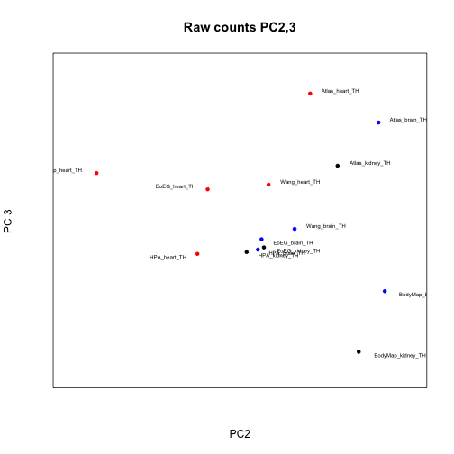 

```r
plotPC(voom,1,2,"Log2 counts PC1,2")
```

```
## Error: argument "colors" is missing, with no default
```

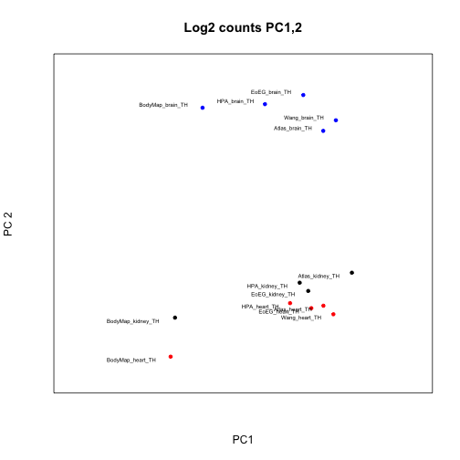 

```r
plotPC(voom,2,3,"Log2 counts PC2,3")
```

```
## Error: argument "colors" is missing, with no default
```

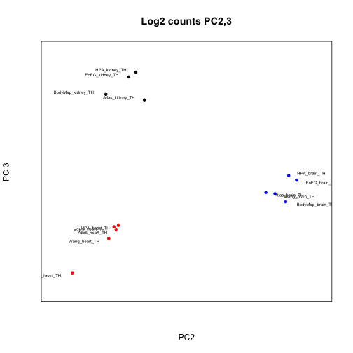 

```r
plotPC(tmm,1,2,"CPM-TMM counts PC1,2")
```

```
## Error: argument "colors" is missing, with no default
```

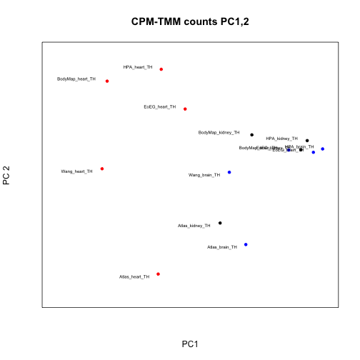 

```r
plotPC(tmm,2,3,"CPM-TMM counts PC2,3")
```

```
## Error: argument "colors" is missing, with no default
```

 

```r
plotPC(dual,1,2,"logCPM-TMM PC1,2")
```

```
## Error: argument "colors" is missing, with no default
```

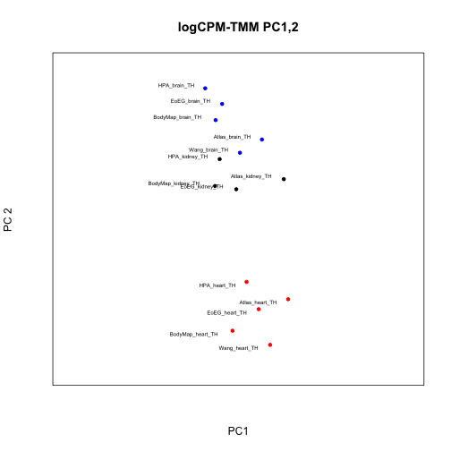 

```r
plotPC(dual,2,3,"logCPM-TMM PC2,3")
```

```
## Error: argument "colors" is missing, with no default
```

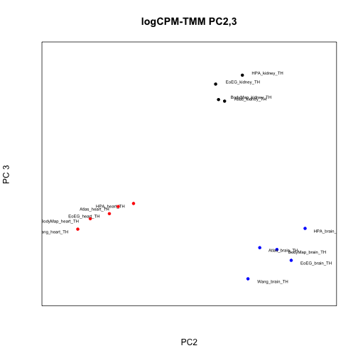 

```r
plotPC(dual,3,4,"logCPM-TMM PC3,4")
```

```
## Error: argument "colors" is missing, with no default
```

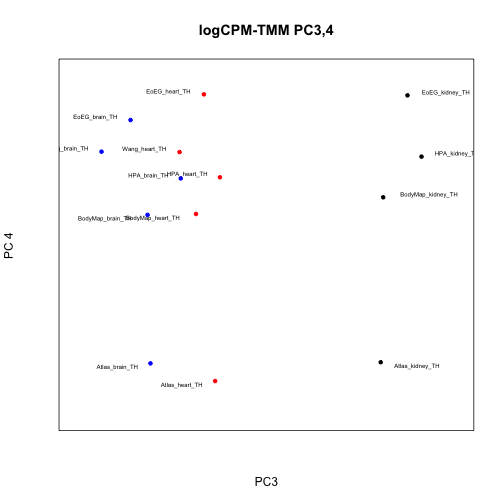 

ANOVA as for published RPKMs.


```r
library(reshape)
m <- melt(counts)
```

```
## Using  as id variables
```

```r
colnames(m) <- c("sample_ID","count")
meta <- data.frame(tissue=c(rep(c("brain","heart","kidney"),4),"brain","heart"),study=c("EoGE","EoGE","EoGE","Atlas","Atlas","Atlas","BodyMap","BodyMap","BodyMap","HPA","HPA","HPA","AltIso","AltIso"),prep=c(rep("poly-A",3),rep("rRNA-depl",3),rep("poly-A",8)),layout=c(rep("PE",3),rep("SE",3),rep("PE",6),rep("SE",2)))
rownames(meta) <- colnames(counts)
tissue <- rep(meta$tissue, each=nrow(counts))
study <- rep(meta$study, each=nrow(counts))
prep <- rep(meta$prep, each=nrow(counts))
layout <- rep(meta$layout, each=nrow(counts))
data <- data.frame(m, tissue=tissue, study=study, prep=prep, layout=layout)

#subset <- data[sample(1:nrow(data), 1000),]
fit <- lm(count ~ prep + layout + study + tissue, data=data)
a <- anova(fit)
```
Revisit Anova with log-TMMed and combated values.


```r
m <- melt(dual)
colnames(m) <- c("gene_ID","sample_ID","logTMM")
data <- data.frame(m, tissue=tissue, study=study, prep=prep, layout=layout)

#subset <- data[sample(1:nrow(data), 1000),]
fit <- lm(logTMM ~ + prep + layout + study + tissue, data=data)
b <- anova(fit)

m <- melt(combat)
```

```
## Error: object 'combat' not found
```

```r
colnames(m) <- c("gene_ID","sample_ID","combatlogTMM")
data <- data.frame(m, tissue=tissue, study=study, prep=prep, layout=layout)

#subset <- data[sample(1:nrow(data), 1000),]
fit <- lm(combatlogTMM ~ prep + layout + study + tissue, data=data)
d <- anova(fit)
```

Plot results

```r
pdf("anova_repr_counts.pdf")
par(mfrow=c(3,1))
barplot(a$"F value",names.arg=rownames(a),main="Anova F score, Raw counts")
barplot(b$"F value",names.arg=rownames(b),main="Anova F score, voom-TMM counts")
barplot(d$"F value",names.arg=rownames(d),main="Anova F score, ComBat on voom-TMM")
dev.off()
```

```
## pdf 
##   2
```


```r
library(sva)
```

```
## Loading required package: corpcor
## Loading required package: mgcv
## Loading required package: nlme
## This is mgcv 1.7-29. For overview type 'help("mgcv-package")'.
```

```r
meta <- data.frame(study=c(rep("EoGE",3),rep("Atlas",3),rep("BodyMap",3),rep("HPA",3),rep("AltIso",2)),tissue=c("Brain","Heart","Kidney","Brain","Heart","Kidney","Brain","Heart","Kidney","Brain","Heart","Kidney","Brain","Heart"))
batch <- meta$study
design <- model.matrix(~as.factor(tissue),data=meta)
# Combat fails unless we remove low/unexpressed genes
combat <- ComBat(dat=dual,batch=batch,mod=design,numCovs=NULL,par.prior=TRUE)
```

```
## Found 5 batches
## Found 2  categorical covariate(s)
## Standardizing Data across genes
## Fitting L/S model and finding priors
## Finding parametric adjustments
## Adjusting the Data
```

```r
plotPC(combat,1,2,"ComBat/dual")
```

```
## Error: argument "colors" is missing, with no default
```

 

```r
combat <- ComBat(dat=voom,batch=batch,mod=design,numCovs=NULL,par.prior=TRUE)
```

```
## Found 5 batches
## Found 2  categorical covariate(s)
## Standardizing Data across genes
## Fitting L/S model and finding priors
## Finding parametric adjustments
## Adjusting the Data
```

```r
plotPC(combat,1,2,"ComBat/voom")
```

```
## Error: argument "colors" is missing, with no default
```

 

Calculate RPKM and TPM values. For this, we need an auxiliary file of feature lengths


```r
lens <- read.delim("gene_lengths.tsv", header=F, row.names=1)
```

```
## Warning: cannot open file 'gene_lengths.tsv': No such file or directory
```

```
## Error: cannot open the connection
```

```r
r <- rpkm(counts[,1], lens, normalized.lib.sizes=F)
```

```
## Error: object 'lens' not found
```

```r
for (i in 2:ncol(counts)){
  temp <- rpkm(counts[,i], lens, normalized.lib.sizes=F)
  r <- cbind(r, temp)
}
```

```
## Error: object 'lens' not found
```

```r
colnames(r)<-colnames(counts)
```

```
## Error: object 'r' not found
```

```r
tpm <- function(vec, feat.lens, rlens){
rg <- vec 
fl <- feat.lens # Feature lengths
rl <- rlens
T <- sum(rg*rl/fl)
tpm <- rg*rl*1e6/(fl*T)
return(tpm)
}

readlengths <- c(76,76,76,35,35,35,152,152,152)
featlens <- lens
```

```
## Error: object 'lens' not found
```

```r
d.tpm <- tpm(counts[,1], featlens, readlengths)
```

```
## Error: object 'featlens' not found
```

```r
for (i in 2:ncol(counts)){
  temp <- tpm(counts[,i], featlens, readlengths)
  d.tpm <- cbind(d.tpm, temp)
}
```

```
## Error: object 'featlens' not found
```

```r
colnames(d.tpm)<-colnames(counts)
```

```
## Error: object 'd.tpm' not found
```

Cufflinks FPKM based analysis
=============================
Cufflinks produces output which occasionally has duplicate entries for genes. We need to collapse these to a single value. One might take the maximum or the sum of genes with the same ID. We choose the latter option here. 


```r
fpkm <- read.delim("fpkm_table_tophat.txt", sep="\t")
```


```r
library(data.table)
```

```
## Error: there is no package called 'data.table'
```

```r
data.dt <- data.table(fpkm)
```

```
## Error: could not find function "data.table"
```

```r
setkey(data.dt, ENSEMBL_ID)
```

```
## Error: could not find function "setkey"
```

```r
temp <- data.dt[, lapply(.SD, sum), by=ENSEMBL_ID]
```

```
## Error: object 'data.dt' not found
```

```r
collapsed <- as.data.frame(temp)
```

```
## Error: object 'temp' not found
```

```r
fpkms.summed <- collapsed[,3:ncol(collapsed)] 
```

```
## Error: object 'collapsed' not found
```

```r
rownames(fpkms.summed) <- collapsed[,1]
```

```
## Error: object 'collapsed' not found
```

```r
write.table(fpkms.summed, file="fpkm_table_tophat_summed.txt", quote=F, sep="\t")
```

```
## Error: object 'fpkms.summed' not found
```


TMM normalization on FPKMs.

```r
sizeF <- calcNormFactors(fpkms.summed, method="TMM") 
```

```
## Error: object 'fpkms.summed' not found
```

```r
fpkm.tmm <- sizeF * fpkms.summed
```

```
## Error: object 'sizeF' not found
```

```r
fpkm.voom <- normalize.voom(fpkms.summed)
```

```
## Error: object 'fpkms.summed' not found
```

```r
fpkm.dual <- normalize.voom(fpkm.tmm)
```

```
## Error: object 'fpkm.tmm' not found
```

Plot PCA/SVD for FPKMs.


```r
plotPC(fpkms.summed,1,2,"Raw FPKM PC1,2")
```

```
## Error: object 'fpkms.summed' not found
```

```r
plotPC(fpkms.summed,2,3,"Raw FPKM PC2,3")
```

```
## Error: object 'fpkms.summed' not found
```

```r
plotPC(fpkms.summed,3,4,"Raw FPKM PC3,4")
```

```
## Error: object 'fpkms.summed' not found
```

```r
plotPC(fpkm.tmm,3,4,"TMM-FPKM PC1,2")
```

```
## Error: object 'fpkm.tmm' not found
```

```r
plotPC(fpkm.tmm,3,4,"TMM-FPKM PC2,3")
```

```
## Error: object 'fpkm.tmm' not found
```

```r
plotPC(fpkm.voom,3,4,"Log2 FPKM PC1,2")
```

```
## Error: object 'fpkm.voom' not found
```

```r
plotPC(fpkm.voom,3,4,"Log2 FPKM PC2,3")
```

```
## Error: object 'fpkm.voom' not found
```

```r
plotPC(fpkm.dual,3,4,"Log2-TMM FPKM PC1,2")
```

```
## Error: object 'fpkm.dual' not found
```

```r
plotPC(fpkm.dual,3,4,"Log2-TMM FPKM PC2,3")
```

```
## Error: object 'fpkm.dual' not found
```
ANOVA on Cuff-FPKMs.


```r
library(reshape)
m <- melt(fpkms.summed)
```

```
## Error: object 'fpkms.summed' not found
```

```r
colnames(m) <- c("sample_ID","FPKM")
meta <- data.frame(tissue=c(rep(c("brain","heart","kidney"),4),"brain","heart"),study=c("EoGE","EoGE","EoGE","Atlas","Atlas","Atlas","BodyMap","BodyMap","BodyMap","HPA","HPA","HPA","AltIso","AltIso"),prep=c(rep("poly-A",3),rep("rRNA-depl",3),rep("poly-A",8)),layout=c(rep("PE",3),rep("SE",3),rep("PE",6),rep("SE",2)))
rownames(meta) <- colnames(fpkms.summed)
```

```
## Error: object 'fpkms.summed' not found
```

```r
tissue <- rep(meta$tissue, each=nrow(fpkms.summed))
```

```
## Error: object 'fpkms.summed' not found
```

```r
study <- rep(meta$study, each=nrow(fpkms.summed))
```

```
## Error: object 'fpkms.summed' not found
```

```r
prep <- rep(meta$prep, each=nrow(fpkms.summed))
```

```
## Error: object 'fpkms.summed' not found
```

```r
layout <- rep(meta$layout, each=nrow(fpkms.summed))
```

```
## Error: object 'fpkms.summed' not found
```

```r
data <- data.frame(m, tissue=tissue, study=study, prep=prep, layout=layout)

#subset <- data[sample(1:nrow(data), 1000),]
fit <- lm(FPKM ~ prep + layout + study + tissue, data=data)
```

```
## Warning: using type = "numeric" with a factor response will be ignored
## Warning: - not meaningful for factors
```

```r
a <- anova(fit)
```

```
## Warning: ^ not meaningful for factors
```

```
## Error: missing value where TRUE/FALSE needed
```
Revisit Anova with log-TMMed and combated values.


```r
m <- melt(fpkm.dual)
```

```
## Error: object 'fpkm.dual' not found
```

```r
colnames(m) <- c("gene_ID","sample_ID","logTMMFPKM")
data <- data.frame(m, tissue=tissue, study=study, prep=prep, layout=layout)

#subset <- data[sample(1:nrow(data), 1000),]
fit <- lm(logTMMFPKM ~ + prep + layout + study + tissue, data=data)
b <- anova(fit)

batch <- meta$study
design <- model.matrix(~as.factor(tissue),data=meta)
# Combat fails unless we remove low/unexpressed genes
combat <- ComBat(dat=fpkm.dual,batch=batch,mod=design,numCovs=NULL,par.prior=TRUE)
```

```
## Found 5 batches
## Found 2  categorical covariate(s)
```

```
## Error: object 'fpkm.dual' not found
```

```r
m <- melt(combat)
colnames(m) <- c("gene_ID","sample_ID","combatlogTMMFPKM")
data <- data.frame(m, tissue=tissue, study=study, prep=prep, layout=layout)

#subset <- data[sample(1:nrow(data), 1000),]
fit <- lm(combatlogTMMFPKM ~ prep + layout + study + tissue, data=data)
d <- anova(fit)
```

Plot results

```r
pdf("anova_repr_FPKM.pdf")
par(mfrow=c(3,1))
barplot(a$"F value",names.arg=rownames(a),main="Anova F score, Raw counts")
barplot(b$"F value",names.arg=rownames(b),main="Anova F score, voom-TMM counts")
barplot(d$"F value",names.arg=rownames(d),main="Anova F score, ComBat on voom-TMM")
dev.off()
```

```
## pdf 
##   2
```

Cufflinks on protein coding genes only:


```r
prot <- read.delim("cufflinks_data_protein_coding.txt")
```

```
## Warning: cannot open file 'cufflinks_data_protein_coding.txt': No such
## file or directory
```

```
## Error: cannot open the connection
```

```r
pnum <- prot[,3:ncol(prot)]
```

```
## Error: object 'prot' not found
```

```r
rownames(pnum) <- prot[,1]
```

```
## Error: object 'prot' not found
```

Some miscellaneous plots: heatmaps of various transformed counts, RPKMs, TPMs.

Heatmaps with linear corr and Spearman rank corr on raw count, optimal power space transformed counts (OPS), TMM scaled counts, logged counts, and log-TMMed counts.


```r
pheatmap(cor(counts),main="Raw counts, Pearson")
```

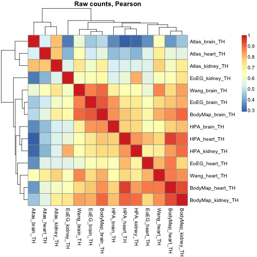 

```r
pheatmap(cor(counts,method="spearman"),main="Raw counts, Spearman")
```

 

```r
pheatmap(cor(ops.counts),main= "OPS counts, Pearson")
```

```
## Error: object 'ops.counts' not found
```

```r
pheatmap(cor(tmm),main="CPM-TMM, Pearson")
```

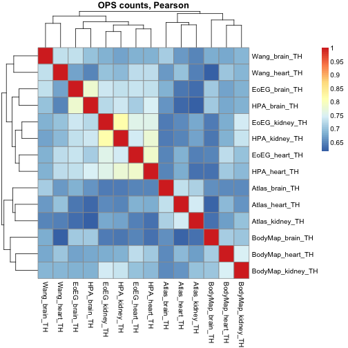 

```r
pheatmap(cor(tmm, method="spearman"),main="CPM-TMM, Spearman")
```

 

```r
pheatmap(cor(voom),main="Log2 counts, Pearson")
```

 

```r
pheatmap(cor(voom,method="spearman"),main="Log2 counts, Spearman")
```

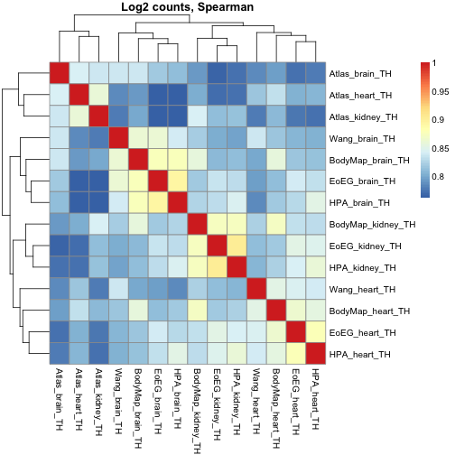 

```r
pheatmap(cor(dual),main="log-CPM-TMM")
```

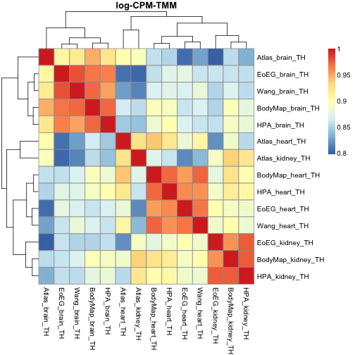 

