Comparing FPKMs for FASTQ files reprocessed with TopHat and Cufflinks 
========================================================

Preliminaries (libraries etc.)


```r
library(pheatmap)
library(edgeR)
```

```
## Loading required package: limma
```

```r
library(calibrate)
```

```
## Loading required package: MASS
```

```r
f <- read.delim("fpkm_table_tophat.txt")


do.SVD = function(m, comp.1=1, comp.2=2){ # returns eig.cell
  s <- svd(m)
  ev <- s$d^2 / sum(s$d^2)
	return(s$u[,c(comp.1, comp.2)])
}

project.SVD <- function(m, eig.cell){
	return(t(m) %*% eig.cell)
}

plot.SVD <- function(m, comp.1=1, comp.2=2, groups=rep("blue", ncol(m)), title=""){
	eig <- do.SVD(m, comp.1, comp.2)
	proj <- project.SVD(m, eig)
	xminv <- min(proj[,1]) # - .2 * abs(min(proj[,1]))
	xmaxv <- max(proj[,1]) # + .2 * abs(max(proj[,1]))
	yminv <- min(proj[,2]) # - .2 * abs(min(proj[,2]))
	ymaxv <- max(proj[,2]) # + .2 * abs(max(proj[,2]))
	plot(proj,pch=20,col="white",xlim=c(xminv,xmaxv),ylim=c(yminv,ymaxv),xaxt='n',yaxt='n',xlab="PC1",ylab="PC2",main=title)
	
	points(proj, col=as.character(groups),pch=20) # , #pch=c(rep(15,3),rep(17,3),rep(19,3),rep(18,3),rep(20,2)), cex=2)
	textxy(proj[,1],proj[,2],labs=colnames(m))
}

loadings.SVD <- function(m, comp=1, gene.ids = rownames(m)){
	s <- svd(m)
	l <- s$u[,comp]
	names(l) <- gene.ids
	l.s <- l[order(l)]
	return(l.s)
}

plot.loadings.SVD <- function(m, comp=1, cutoff=0.1, gene.ids = rownames(m)){
	l <- loadings.SVD(m, comp, gene.ids)
	barplot(l[abs(l)>cutoff],las=2,main=paste("PC", comp, "cutoff", cutoff),cex.names=0.6)
}

plotPC <- function(matrix,a,b,desc,colors){
eig <- do.SVD(matrix, a, b)
proj <- project.SVD(matrix, eig)
xminv <- min(proj[,1]) - .2 * abs(min(proj[,1]))
xmaxv <- max(proj[,1]) + .2 * abs(max(proj[,1]))
yminv <- min(proj[,2]) - .2 * abs(min(proj[,2]))
ymaxv <- max(proj[,2]) + .2 * abs(max(proj[,2]))
plot(proj,pch=20,xlim=c(xminv,xmaxv),ylim=c(yminv,ymaxv),xaxt='n',yaxt='n',xlab=paste0("PC",a),ylab=paste("PC",b),col=colors,main=desc)
textxy(proj[,1],proj[,2],labs=rownames(proj))
}
```

First, we will restrict the data set to only include protein coding genes:


```r
library(biomaRt)

f_ids <- as.vector(f[,1])

ensembl = useMart("ensembl", dataset = "hsapiens_gene_ensembl") #select the ensembl database

gene_type <- getBM(attributes=c("ensembl_gene_id", "gene_biotype"), 
                   filters = "ensembl_gene_id",
                   values=f_ids,
                   mart=ensembl)

pc <- subset(gene_type[,1],gene_type[,2]=="protein_coding")

f_pc <- f[match(pc,f[,1]),]
```

And let's remove all lines where FPKM is close to zero in all samples before we proceed with this version of the data set:


```r
f_pc_nozero <- f_pc[-which(rowSums(f_pc[,3:16])<=0.01),]
```

**Figure 4A**

Heatmap of Spearman correlations between reprocessed expression profiles (# genes = 22,360)


```r
pheatmap(cor(f_pc_nozero[,3:16], method="spearman"))
```

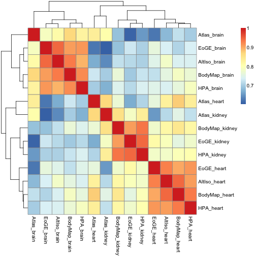 

Alternatively, one could use Pearson correlation (not shown in paper):


```r
pheatmap(cor(f_pc_nozero[,3:16]))
```

 

Sometimes the linear (Pearson) correlation works better on log values.  (not shown in paper):


```r
pseudo <- 1
fpkms.log <- log2(f_pc_nozero[,3:16] + pseudo)
pheatmap(cor(fpkms.log[,]))
```

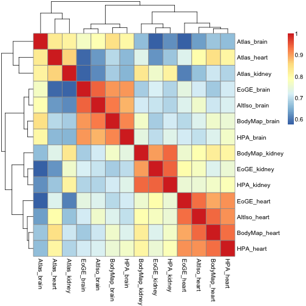 
What if we drop the genes that have less than FPKM 1 on average? (not shown in paper):

```r
f.nolow <- f_pc_nozero[-which(rowMeans(f_pc_nozero[,3:16])<1),]
pheatmap(cor(log2(f.nolow[,3:16] + pseudo)))
```

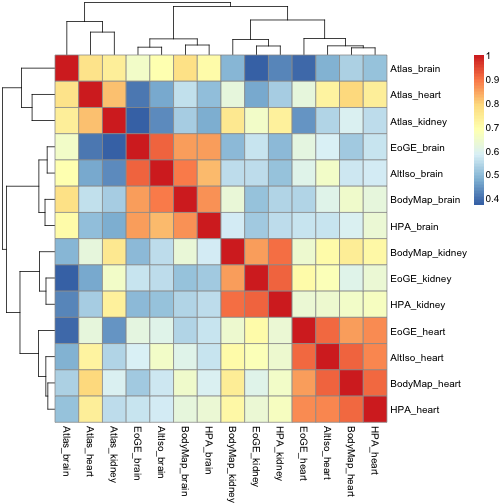 

Let's look at a few SVD plots. 

First we take a look at the "raw" FPKM values for PC 1&2:

**Figure 4B**

```r
colors <- c(2,1,3,2,1,3,2,1,3,2,1,3,2,1)
plotPC(f_pc_nozero[,3:16], 1, 2, "Reprocessed FPKM values \n SVD \n n=19524", colors=colors)
```

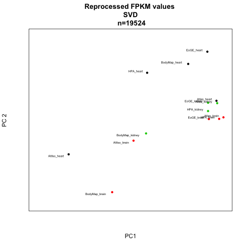 

and PC 2&3:

**Figure 1D** (not included in the current manuscript version)


```r
plotPC(f_pc_nozero[,3:16], 2, 3, "Reprocessed FPKM values \n SVD \n n=19524", colors=colors)
```

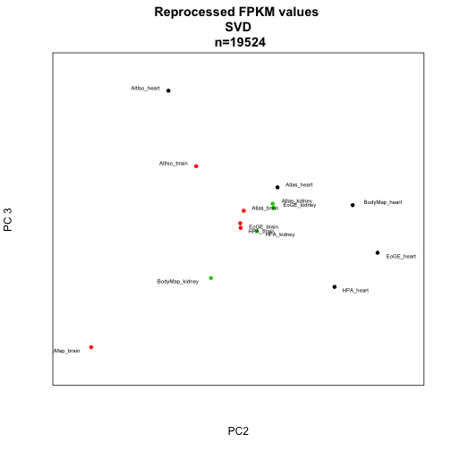 

We can plot all pairwise combinations of principal components 1 to 5. (not shown in paper)
Start with SVD on the "raw" F/RPKMs.


```r
colors <- c(2,1,3,2,1,3,2,1,3,2,1,3,2,1)

par(mfrow=c(4,4))
for (i in 1:6){
  for(j in 1:6){
  	if (i<j){ 
		plotPC(f_pc_nozero[,3:16],i,j,desc="",colors=colors)
		}
	}
}
```

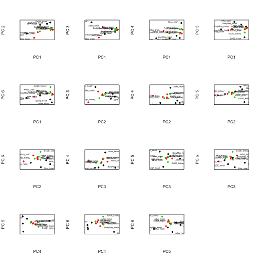 
Let's see how the PCA plots look for log2-FPKM values:

```r
plotPC(fpkms.log, 1, 2, desc="Reprocessed F/RPKM values, log2 \n SVD \n n=19475", colors=colors)
```

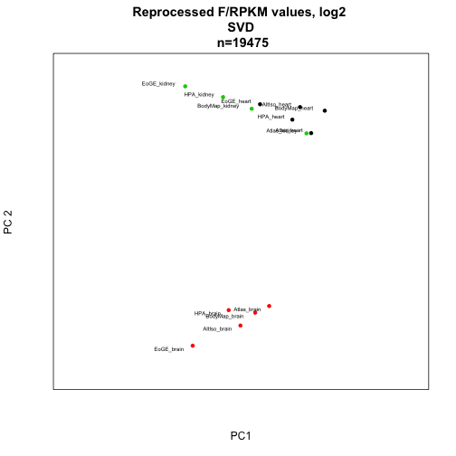 

```r
plotPC(fpkms.log, 2, 3, desc="Reprocessed FPKM values, log2 \n SVD \n n=19475", colors=colors)
```

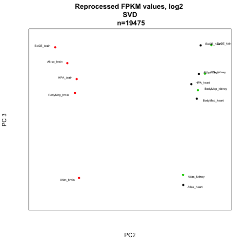 

Combat analysis for removal of batch effects (n=19475):


```r
library(sva)
```

```
## Loading required package: corpcor
## Loading required package: mgcv
## Loading required package: nlme
## This is mgcv 1.7-29. For overview type 'help("mgcv-package")'.
```

```r
meta <- data.frame(study=c(rep("EoGE",3),rep("Atlas",3),rep("BodyMap",3),rep("HPA",3),rep("AltIso",2)),tissue=c("Brain","Heart","Kidney","Brain","Heart","Kidney","Brain","Heart","Kidney","Brain","Heart","Kidney","Brain","Heart"),prep=c(rep("poly-A",3),rep("rRNA-depl",3),rep("poly-A",8)),layout=c(rep("PE",3),rep("SE",3),rep("PE",6),rep("SE",2)))

batch <- meta$study
design <- model.matrix(~as.factor(tissue),data=meta)

combat <- ComBat(dat=fpkms.log[,],batch=batch,mod=design,numCovs=NULL,par.prior=TRUE)
```

```
## Found 5 batches
## Found 2  categorical covariate(s)
## Standardizing Data across genes
## Fitting L/S model and finding priors
## Finding parametric adjustments
## Adjusting the Data
```

```r
write.table(combat, file="reprocessed_rpkms_combat_log2.txt", quote=F)

pheatmap(cor(combat))
```

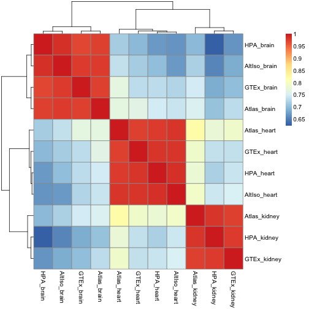 

```r
plotPC(combat,1,2,colors=colors,desc="Reprocessed F/RPKM values, ComBat on log2 values \n SVD \n n=19475")
```

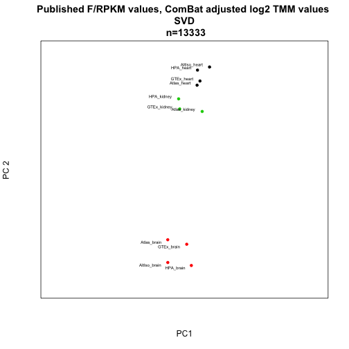 

```r
plotPC(combat,2,3,colors=colors,desc="Reprocessed F/RPKM values, ComBat on log2 values \n SVD \n n=19475")
```

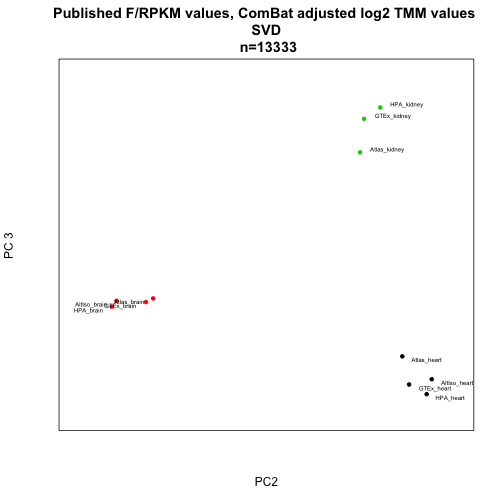 


```r
library(reshape)
m <- melt(f)
```

```
## Using ENSEMBL_ID, Gene_ID as id variables
```

```r
colnames(m) <- c("sample_ID","Cuff_FPKM")
meta <- data.frame(tissue=c("brain","heart","kidney","brain","heart","kidney","brain","heart","kidney","brain","heart","kidney","brain","heart"),study=c("EoGE","EoGE","EoGE","Atlas","Atlas","Atlas","BodyMap","BodyMap","BodyMap","HPA","HPA","HPA","AltIso","AltIso"),prep=c(rep("poly-A",3),rep("rRNA-depl",3),rep("poly-A",8)),layout=c(rep("PE",3),rep("SE",3),rep("PE",6),rep("SE",2)))
rownames(meta) <- colnames(f)
```

```
## Error: invalid 'row.names' length
```

```r
tissue <- rep(meta$tissue, each=nrow(f))
study <- rep(meta$study, each=nrow(f))
prep <- rep(meta$prep, each=nrow(f))
layout <- rep(meta$layout, each=nrow(f))
data <- data.frame(m, tissue=tissue, study=study, prep=prep, layout=layout)

#subset <- data[sample(1:nrow(data), 1000),]
fit <- lm(Cuff_FPKM ~ prep + layout + study + tissue, data=data)
```

```
## Warning: using type = "numeric" with a factor response will be ignored
## Warning: - not meaningful for factors
```

```r
a <- anova(fit)
```

```
## Warning: ^ not meaningful for factors
```

```
## Error: missing value where TRUE/FALSE needed
```

```r
maxval = 100
```

**Figure 4C (?)**


```r
barplot(a$"F value"[-5],names.arg=rownames(a)[-5],main="Anova F score, Cufflinks FPKM",ylim=c(0,maxval))
```

```
## Error: object 'a' not found
```

**Figure 4D (?)**


```r
colors <- c(1,2,3,1,2,3,1,2,3,1,2,3,1,2)
plotPC(f, 1, 2, "Reprocessed Cufflinks FPKM values \n SVD \n n=22674", colors=colors)
```

```
## Error: infinite or missing values in 'x'
```

```r
plotPC(f, 2, 3, "Reprocessed Cufflinks FPKM values \n SVD \n n=22674", colors=colors)
```

```
## Error: infinite or missing values in 'x'
```

```r
p <- prcomp(t(f))
```

```
## Error: 'x' must be numeric
```

```r
plot(p$x[,1],p$x[,2],pch=20,col=colors,xlab=paste("PC", 1),ylab=paste("PC", 2),main="Reprocessed Cufflinks FPKM values \n PCA \n n=22674")
```

```
## Error: object 'p' not found
```

```r
plot(p$x[,2],p$x[,3],pch=20,col=colors,xlab=paste("PC", 2),ylab=paste("PC", 3),main="Reprocessed Cufflinks FPKM values \n PCA \n n=22674")
```

```
## Error: object 'p' not found
```

PC plots for log transform, mean FPKM > 1, TMM, ComBat


```r
f.log.nolow <- log2.cpm(f.nolow)
```

```
## Error: could not find function "log2.cpm"
```

```r
plotPC(f.log.nolow, 1, 2, "log2-cpm Cufflinks FPKM (mean>1) values \n SVD \n n=22674", colors=colors)
```

```
## Error: object 'f.log.nolow' not found
```

```r
plotPC(f.log.nolow, 2, 3, "log2-cpm Cufflinks FPKM (mean>1) values \n SVD \n n=22674", colors=colors)
```

```
## Error: object 'f.log.nolow' not found
```

```r
p <- prcomp(t(f.log.nolow))
```

```
## Error: object 'f.log.nolow' not found
```

```r
plot(p$x[,1],p$x[,2],pch=20,col=colors,xlab=paste("PC", 1),ylab=paste("PC", 2),main="Reprocessed Cufflinks FPKM values (log2, FPKM>1) \n PCA \n n=22674")
```

```
## Error: object 'p' not found
```

ANOVA analyses


```r
m <- melt(f.log)
```

```
## Error: object 'f.log' not found
```

```r
colnames(m) <- c("gene_ID","sample_ID","log2FPKM")
data <- data.frame(m, tissue=tissue, study=study, prep=prep, layout=layout)
#subset <- data[sample(1:nrow(data), 1000),]
fit <- lm(log2FPKM ~ + prep + layout + study + tissue, data=data)
```

```
## Warning: using type = "numeric" with a factor response will be ignored
## Warning: - not meaningful for factors
```

```r
b <- anova(fit)
```

```
## Warning: ^ not meaningful for factors
```

```
## Error: missing value where TRUE/FALSE needed
```

```r
barplot(b$"F value"[-5],names.arg=rownames(b)[-5],main="Anova F score, log2-RPKM",ylim=c(0,3000))
```

```
## Error: object 'b' not found
```

```r
print(b)
```

```
## Error: object 'b' not found
```


```r
m <- melt(f.log.tmm)
```

```
## Error: object 'f.log.tmm' not found
```

```r
colnames(m) <- c("gene_ID","sample_ID","log2FPKM")
data <- data.frame(m, tissue=tissue, study=study, prep=prep, layout=layout)
#subset <- data[sample(1:nrow(data), 1000),]
fit <- lm(log2FPKM ~ + prep + layout + study + tissue, data=data)
```

```
## Warning: using type = "numeric" with a factor response will be ignored
## Warning: - not meaningful for factors
```

```r
b <- anova(fit)
```

```
## Warning: ^ not meaningful for factors
```

```
## Error: missing value where TRUE/FALSE needed
```

```r
barplot(b$"F value"[-5],names.arg=rownames(b)[-5],main="Anova F score, log2-TMM-FPKM",ylim=c(0,5000))
```

```
## Error: object 'b' not found
```

```r
print(b)
```

```
## Error: object 'b' not found
```

Finally, ANOVA on ComBat.


```r
m <- melt(combat)
```

```
## Using  as id variables
```

```r
colnames(m) <- c("gene_ID","sample_ID","combat")
```

```
## Error: 'names' attribute [3] must be the same length as the vector [2]
```

```r
data <- data.frame(m, tissue=tissue, study=study, prep=prep, layout=layout)
```

```
## Error: arguments imply differing number of rows: 272650, 867552
```

```r
#subset <- data[sample(1:nrow(data), 1000),]
fit <- lm(combat ~ + prep + layout + study + tissue, data=data)
```

```
## Error: invalid type (list) for variable 'combat'
```

```r
b <- anova(fit)
```

```
## Warning: ^ not meaningful for factors
```

```
## Error: missing value where TRUE/FALSE needed
```

```r
barplot(b$"F value"[-5],names.arg=rownames(b)[-5],main="Anova F score, log2-TMM-FPKM",ylim=c(0,5000))
```

```
## Error: object 'b' not found
```

```r
print(b)
```

```
## Error: object 'b' not found
```
