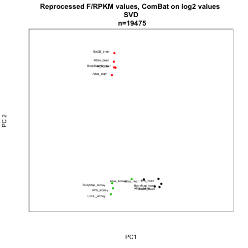
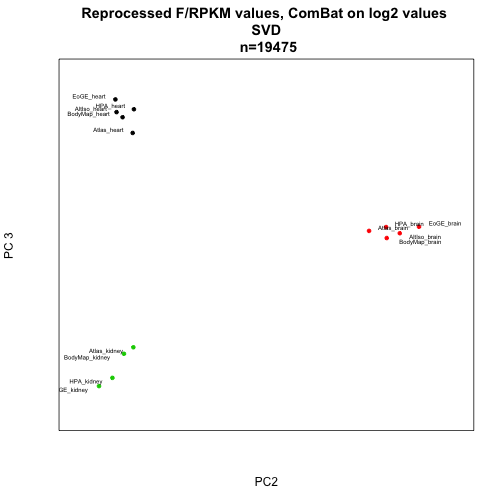
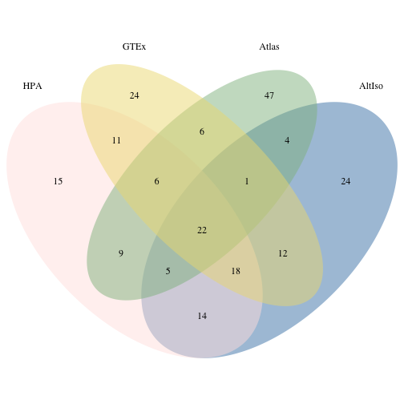
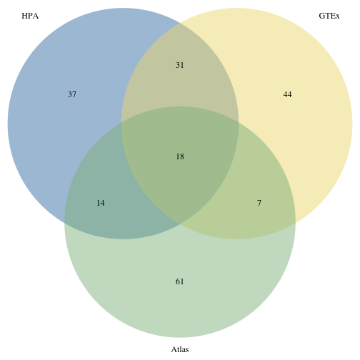
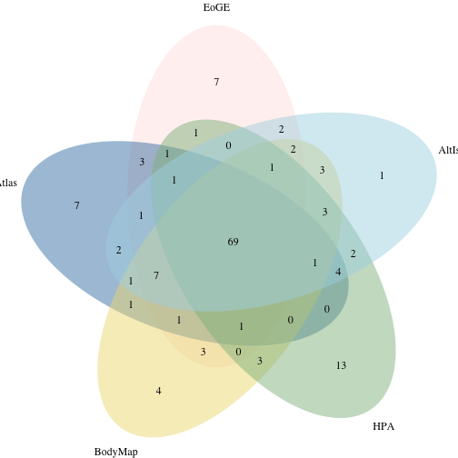
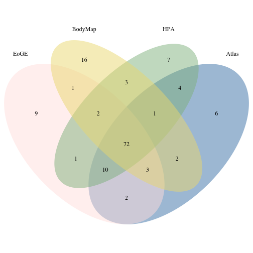

Comparing FPKMs for FASTQ files reprocessed with TopHat and Cufflinks 
========================================================

Preliminaries (libraries etc.)


```r
library(pheatmap)
library(calibrate)
```

```
## Loading required package: MASS
```

```r
f <- read.delim("fpkm_table_tophat.txt")

do.SVD = function(m, comp.1=1, comp.2=2){ # returns eig.cell
  s <- svd(m)
  ev <- s$d^2 / sum(s$d^2)
	return(s$u[,c(comp.1, comp.2)])
}

project.SVD <- function(m, eig.cell){
	return(t(m) %*% eig.cell)
}

plot.SVD <- function(m, comp.1=1, comp.2=2, groups=rep("blue", ncol(m)), title=""){
	eig <- do.SVD(m, comp.1, comp.2)
	proj <- project.SVD(m, eig)
	xminv <- min(proj[,1]) # - .2 * abs(min(proj[,1]))
	xmaxv <- max(proj[,1]) # + .2 * abs(max(proj[,1]))
	yminv <- min(proj[,2]) # - .2 * abs(min(proj[,2]))
	ymaxv <- max(proj[,2]) # + .2 * abs(max(proj[,2]))
	plot(proj,pch=20,col="white",xlim=c(xminv,xmaxv),ylim=c(yminv,ymaxv),xaxt='n',yaxt='n',xlab="PC1",ylab="PC2",main=title)
	
	points(proj, col=as.character(groups),pch=20) # , #pch=c(rep(15,3),rep(17,3),rep(19,3),rep(18,3),rep(20,2)), cex=2)
	textxy(proj[,1],proj[,2],labs=colnames(m))
}

loadings.SVD <- function(m, comp=1, gene.ids = rownames(m)){
	s <- svd(m)
	l <- s$u[,comp]
	names(l) <- gene.ids
	l.s <- l[order(l)]
	return(l.s)
}

plot.loadings.SVD <- function(m, comp=1, cutoff=0.1, gene.ids = rownames(m)){
	l <- loadings.SVD(m, comp, gene.ids)
	barplot(l[abs(l)>cutoff],las=2,main=paste("PC", comp, "cutoff", cutoff),cex.names=0.6)
}

plotPC <- function(matrix,a,b,desc,colors){
eig <- do.SVD(matrix, a, b)
proj <- project.SVD(matrix, eig)
xminv <- min(proj[,1]) - .2 * abs(min(proj[,1]))
xmaxv <- max(proj[,1]) + .2 * abs(max(proj[,1]))
yminv <- min(proj[,2]) - .2 * abs(min(proj[,2]))
ymaxv <- max(proj[,2]) + .2 * abs(max(proj[,2]))
plot(proj,pch=20,xlim=c(xminv,xmaxv),ylim=c(yminv,ymaxv),xaxt='n',yaxt='n',xlab=paste0("PC",a),ylab=paste("PC",b),col=colors,main=desc)
textxy(proj[,1],proj[,2],labs=rownames(proj))
}
```

First, we will restrict the data set to only include protein coding genes:


```r
library(biomaRt)

f_ids <- as.vector(f[,1])

ensembl = useMart("ensembl", dataset = "hsapiens_gene_ensembl") #select the ensembl database

gene_type <- getBM(attributes=c("ensembl_gene_id", "gene_biotype"), 
                   filters = "ensembl_gene_id",
                   values=f_ids,
                   mart=ensembl)

pc <- subset(gene_type[,1],gene_type[,2]=="protein_coding")

f_pc <- f[match(pc,f[,1]),]
```

And let's remove all lines where FPKM is close to zero in all samples before we proceed with this version of the data set:


```r
f_pc_nozero <- f_pc[-which(rowSums(f_pc[,3:16])<=0.01),]
```

**Figure 4A**

Heatmap of Spearman correlations between reprocessed expression profiles (# genes = 22,360)


```r
pheatmap(cor(f_pc_nozero[,3:16], method="spearman"))
```

 

Alternatively, one could use Pearson correlation (not shown in paper):


```r
pheatmap(cor(f_pc_nozero[,3:16]))
```

 

Sometimes the linear (Pearson) correlation works better on log values.  (not shown in paper):


```r
pseudo <- 1
logs <- log2(f_pc_nozero[,3:16] + pseudo)
fpkms.log <- cbind(f_pc_nozero[,1:2],logs) 

pheatmap(cor(fpkms.log[,3:16]))
```

 

What if we drop the genes that have less than FPKM 1 on average? (not shown in paper):


```r
f.nolow <- f_pc_nozero[-which(rowMeans(f_pc_nozero[,3:16])<1),]
pheatmap(cor(log2(f.nolow[,3:16] + pseudo)))
```

 

Let's look at a few SVD plots. 

First we take a look at the "raw" FPKM values for PC 1&2:

**Figure 4B**

```r
colors <- c(2,1,3,2,1,3,2,1,3,2,1,3,2,1)
plotPC(f_pc_nozero[,3:16], 1, 2, "Reprocessed FPKM values \n SVD \n n=19524", colors=colors)
```

 

and PC 2&3:

**Figure 1D** (not included in the current manuscript version)


```r
plotPC(f_pc_nozero[,3:16], 2, 3, "Reprocessed FPKM values \n SVD \n n=19524", colors=colors)
```

 

We can plot all pairwise combinations of principal components 1 to 5. (not shown in paper)
Start with SVD on the "raw" F/RPKMs.


```r
colors <- c(2,1,3,2,1,3,2,1,3,2,1,3,2,1)

par(mfrow=c(4,4))
for (i in 1:6){
  for(j in 1:6){
  	if (i<j){ 
		plotPC(f_pc_nozero[,3:16],i,j,desc="",colors=colors)
		}
	}
}
```

 

Let's see how the PCA plots look for log2-FPKM values:


```r
plotPC(fpkms.log[,3:16], 1, 2, desc="Reprocessed F/RPKM values, log2 \n SVD \n n=19475", colors=colors)
```

 

```r
plotPC(fpkms.log[,3:16], 2, 3, desc="Reprocessed FPKM values, log2 \n SVD \n n=19475", colors=colors)
```

 

Combat analysis for removal of batch effects (n=19475):


```r
library(sva)
```

```
## Loading required package: corpcor
## Loading required package: mgcv
## Loading required package: nlme
## This is mgcv 1.7-29. For overview type 'help("mgcv-package")'.
```

```r
meta <- data.frame(study=c(rep("EoGE",3),rep("Atlas",3),rep("BodyMap",3),rep("HPA",3),rep("AltIso",2)),tissue=c("Brain","Heart","Kidney","Brain","Heart","Kidney","Brain","Heart","Kidney","Brain","Heart","Kidney","Brain","Heart"),prep=c(rep("poly-A",3),rep("rRNA-depl",3),rep("poly-A",8)),layout=c(rep("PE",3),rep("SE",3),rep("PE",6),rep("SE",2)))

batch <- meta$study
design <- model.matrix(~as.factor(tissue),data=meta)

combat <- ComBat(dat=fpkms.log[,3:16],batch=batch,mod=design,numCovs=NULL,par.prior=TRUE)
```

```
## Found 5 batches
## Found 2  categorical covariate(s)
## Standardizing Data across genes
## Fitting L/S model and finding priors
## Finding parametric adjustments
## Adjusting the Data
```

```r
write.table(combat, file="reprocessed_rpkms_combat_log2.txt", quote=F)
```

Let's see how the correlation heatmap and PCA plots look after correction for batch effects with combat:


```r
pheatmap(cor(combat))
```

 

```r
plotPC(combat,1,2,colors=colors,desc="Reprocessed F/RPKM values, ComBat on log2 values \n SVD \n n=19475")
```

 

```r
plotPC(combat,2,3,colors=colors,desc="Reprocessed F/RPKM values, ComBat on log2 values \n SVD \n n=19475")
```

 

Anova analysis of different batch factors:


```r
library(reshape)
m <- melt(f_pc_nozero)
```

```
## Using ENSEMBL_ID, Gene_ID as id variables
```

```r
colnames(m) <- c("ENSG","Gene","sample_ID","Cuff_FPKM")
meta <- data.frame(tissue=c("brain","heart","kidney","brain","heart","kidney","brain","heart","kidney","brain","heart","kidney","brain","heart"),study=c("EoGE","EoGE","EoGE","Atlas","Atlas","Atlas","BodyMap","BodyMap","BodyMap","HPA","HPA","HPA","AltIso","AltIso"),prep=c(rep("poly-A",3),rep("rRNA-depl",3),rep("poly-A",8)),layout=c(rep("PE",3),rep("SE",3),rep("PE",6),rep("SE",2)))
rownames(meta) <- colnames(f_pc_nozero)[3:16]
tissue <- rep(meta$tissue, each=nrow(f_pc_nozero))
study <- rep(meta$study, each=nrow(f_pc_nozero))
prep <- rep(meta$prep, each=nrow(f_pc_nozero))
layout <- rep(meta$layout, each=nrow(f_pc_nozero))
data <- data.frame(m, tissue=tissue, study=study, prep=prep, layout=layout)

#subset <- data[sample(1:nrow(data), 1000),]
fit <- lm(Cuff_FPKM ~ prep + layout + study + tissue, data=data)
a <- anova(fit)
maxval = 100
```

**Figure 4C**


```r
barplot(a$"F value"[-5],names.arg=rownames(a)[-5],main="Anova F score, Cufflinks FPKM",ylim=c(0,maxval))
```

 

**Figure 4D (?)**

```

ANOVA analyseson logged values:


```r
m <- melt(fpkms.log[,])
```

```
## Using ENSEMBL_ID, Gene_ID as id variables
```

```r
colnames(m) <- c("sample_ID","log2FPKM")

data <- data.frame(m, tissue=tissue, study=study, prep=prep, layout=layout)
#subset <- data[sample(1:nrow(data), 1000),]
fit <- lm(log2FPKM ~ + prep + layout + study + tissue, data=data)
```

```
## Warning: using type = "numeric" with a factor response will be ignored
## Warning: - not meaningful for factors
```

```r
b <- anova(fit)
```

```
## Warning: ^ not meaningful for factors
```

```
## Error: missing value where TRUE/FALSE needed
```

```r
barplot(b$"F value"[-5],names.arg=rownames(b)[-5],main="Anova F score, log2-RPKM",ylim=c(0,3000))
```

```
## Error: object 'b' not found
```

```r
print(b)
```

```
## Error: object 'b' not found
```


Finally, ANOVA on ComBat.


```r
m <- melt(combat)
```

```
## Using  as id variables
```

```r
colnames(m) <- c("sample_ID","combat")
data <- data.frame(m, tissue=tissue, study=study, prep=prep, layout=layout)
#subset <- data[sample(1:nrow(data), 1000),]
fit <- lm(combat ~ + prep + layout + study + tissue, data=data)
c <- anova(fit)

barplot(c$"F value"[-5],names.arg=rownames(c)[-5],main="Anova F score, log2-TMM-FPKM",ylim=c(0,5000))
```

 

```r
print(c)
```

```
## Analysis of Variance Table
## 
## Response: combat
##               Df  Sum Sq Mean Sq F value  Pr(>F)    
## prep           1       3       3    0.73    0.39    
## layout         1      77      77   18.64 1.6e-05 ***
## study          2       0       0    0.02    0.98    
## tissue         2   10013    5007 1212.67 < 2e-16 ***
## Residuals 272643 1125649       4                    
## ---
## Signif. codes:  0 '***' 0.001 '**' 0.01 '*' 0.05 '.' 0.1 ' ' 1
```

**Figure X**


Let's have a look at the 100 most highly expressed genes in each sample and see how many of these genes that are shared between the studies


```r
library(VennDiagram)
```

```
## Loading required package: grid
```

```r
EoGE_b <- rownames(f_pc[order(f_pc$EoGE_brain,decreasing=T),][1:100,])
EoGE_h <- rownames(f_pc[order(f_pc$EoGE_heart,decreasing=T),][1:100,])
EoGE_k <- rownames(f_pc[order(f_pc$EoGE_kidney,decreasing=T),][1:100,])

Atlas_b <- rownames(f_pc[order(f_pc$Atlas_brain,decreasing=T),][1:100,])
Atlas_h <- rownames(f_pc[order(f_pc$Atlas_heart,decreasing=T),][1:100,])
Atlas_k <- rownames(f_pc[order(f_pc$Atlas_kidney,decreasing=T),][1:100,])

BodyMap_b <- rownames(f_pc[order(f_pc$BodyMap_brain,decreasing=T),][1:100,])
BodyMap_h <- rownames(f_pc[order(f_pc$BodyMap_heart,decreasing=T),][1:100,])
BodyMap_k <- rownames(f_pc[order(f_pc$BodyMap_kidney,decreasing=T),][1:100,])

HPA_b <- rownames(f_pc[order(f_pc$HPA_brain,decreasing=T),][1:100,])
HPA_h <- rownames(f_pc[order(f_pc$HPA_heart,decreasing=T),][1:100,])
HPA_k <- rownames(f_pc[order(f_pc$HPA_kidney,decreasing=T),][1:100,])

AltIso_b <- rownames(f_pc[order(f_pc$AltIso_brain,decreasing=T),][1:100,])
AltIso_h <- rownames(f_pc[order(f_pc$AltIso_heart,decreasing=T),][1:100,])
```

Let's start with the five brain samples:


```r
draw.quintuple.venn(100, 100, 100, 100, 100, 
               length(intersect(EoGE_b,Atlas_b)),
               length(intersect(EoGE_b,BodyMap_b)),
               length(intersect(EoGE_b,HPA_b)),
               length(intersect(EoGE_b,AltIso_b)),
               length(intersect(Atlas_b,BodyMap_b)),
               length(intersect(Atlas_b,HPA_b)),
               length(intersect(Atlas_b,AltIso_b)),
               length(intersect(BodyMap_b,HPA_b)),
               length(intersect(BodyMap_b,AltIso_b)),
               length(intersect(HPA_b,AltIso_b)),
               length(intersect(intersect(EoGE_b,Atlas_b),BodyMap_b)),
               length(intersect(intersect(EoGE_b,Atlas_b),HPA_b)),
               length(intersect(intersect(EoGE_b,Atlas_b),AltIso_b)),
               length(intersect(intersect(EoGE_b,BodyMap_b),HPA_b)),
               length(intersect(intersect(EoGE_b,BodyMap_b),AltIso_b)),
               length(intersect(intersect(EoGE_b,HPA_b),AltIso_b)),
               length(intersect(intersect(Atlas_b,BodyMap_b),HPA_b)),
               length(intersect(intersect(Atlas_b,BodyMap_b),AltIso_b)),
               length(intersect(intersect(Atlas_b,HPA_b),AltIso_b)),
               length(intersect(intersect(BodyMap_b,HPA_b),AltIso_b)),
               length(intersect(intersect(EoGE_b,Atlas_b),intersect(BodyMap_b,HPA_b))),
               length(intersect(intersect(EoGE_b,Atlas_b),intersect(BodyMap_b,AltIso_b))),
               length(intersect(intersect(EoGE_b,Atlas_b),intersect(HPA_b,AltIso_b))),
               length(intersect(intersect(EoGE_b,BodyMap_b),intersect(HPA_b,AltIso_b))),
               length(intersect(intersect(Atlas_b,BodyMap_b),intersect(HPA_b,AltIso_b))),
               length(intersect(intersect(intersect(EoGE_b,Atlas_b),intersect(BodyMap_b,HPA_b)),AltIso_b)),
               category = c("EoGE","Atlas","BodyMap","HPA","AltIso"), lwd = rep(0, 5), lty = rep("solid", 5),
               fill = c("mistyrose","steelblue","lightgoldenrod","darkseagreen","lightblue")
)
```

 

```
## (polygon[GRID.polygon.516], polygon[GRID.polygon.517], polygon[GRID.polygon.518], polygon[GRID.polygon.519], polygon[GRID.polygon.520], polygon[GRID.polygon.521], polygon[GRID.polygon.522], polygon[GRID.polygon.523], polygon[GRID.polygon.524], polygon[GRID.polygon.525], text[GRID.text.526], text[GRID.text.527], text[GRID.text.528], text[GRID.text.529], text[GRID.text.530], text[GRID.text.531], text[GRID.text.532], text[GRID.text.533], text[GRID.text.534], text[GRID.text.535], text[GRID.text.536], text[GRID.text.537], text[GRID.text.538], text[GRID.text.539], text[GRID.text.540], text[GRID.text.541], text[GRID.text.542], text[GRID.text.543], text[GRID.text.544], text[GRID.text.545], text[GRID.text.546], text[GRID.text.547], text[GRID.text.548], text[GRID.text.549], text[GRID.text.550], text[GRID.text.551], text[GRID.text.552], text[GRID.text.553], text[GRID.text.554], text[GRID.text.555], text[GRID.text.556], text[GRID.text.557], text[GRID.text.558], text[GRID.text.559], text[GRID.text.560], text[GRID.text.561])
```

and the five heart samples:


```r
draw.quintuple.venn(100, 100, 100, 100, 100, 
               length(intersect(EoGE_h,Atlas_h)),
               length(intersect(EoGE_h,BodyMap_h)),
               length(intersect(EoGE_h,HPA_h)),
               length(intersect(EoGE_h,AltIso_h)),
               length(intersect(Atlas_h,BodyMap_h)),
               length(intersect(Atlas_h,HPA_h)),
               length(intersect(Atlas_h,AltIso_h)),
               length(intersect(BodyMap_h,HPA_h)),
               length(intersect(BodyMap_h,AltIso_h)),
               length(intersect(HPA_h,AltIso_h)),
               length(intersect(intersect(EoGE_h,Atlas_h),BodyMap_h)),
               length(intersect(intersect(EoGE_h,Atlas_h),HPA_h)),
               length(intersect(intersect(EoGE_h,Atlas_h),AltIso_h)),
               length(intersect(intersect(EoGE_h,BodyMap_h),HPA_h)),
               length(intersect(intersect(EoGE_h,BodyMap_h),AltIso_h)),
               length(intersect(intersect(EoGE_h,HPA_h),AltIso_h)),
               length(intersect(intersect(Atlas_h,BodyMap_h),HPA_h)),
               length(intersect(intersect(Atlas_h,BodyMap_h),AltIso_h)),
               length(intersect(intersect(Atlas_h,HPA_h),AltIso_h)),
               length(intersect(intersect(BodyMap_h,HPA_h),AltIso_h)),
               length(intersect(intersect(EoGE_h,Atlas_h),intersect(BodyMap_h,HPA_h))),
               length(intersect(intersect(EoGE_h,Atlas_h),intersect(BodyMap_h,AltIso_h))),
               length(intersect(intersect(EoGE_h,Atlas_h),intersect(HPA_h,AltIso_h))),
               length(intersect(intersect(EoGE_h,BodyMap_h),intersect(HPA_h,AltIso_h))),
               length(intersect(intersect(Atlas_h,BodyMap_h),intersect(HPA_h,AltIso_h))),
               length(intersect(intersect(intersect(EoGE_h,Atlas_h),intersect(BodyMap_h,HPA_h)),AltIso_h)),
               category = c("EoGE","Atlas","BodyMap","HPA","AltIso"), lwd = rep(0, 5), lty = rep("solid", 5),
               fill = c("mistyrose","steelblue","lightgoldenrod","darkseagreen","lightblue")
)
```

 

```
## (polygon[GRID.polygon.562], polygon[GRID.polygon.563], polygon[GRID.polygon.564], polygon[GRID.polygon.565], polygon[GRID.polygon.566], polygon[GRID.polygon.567], polygon[GRID.polygon.568], polygon[GRID.polygon.569], polygon[GRID.polygon.570], polygon[GRID.polygon.571], text[GRID.text.572], text[GRID.text.573], text[GRID.text.574], text[GRID.text.575], text[GRID.text.576], text[GRID.text.577], text[GRID.text.578], text[GRID.text.579], text[GRID.text.580], text[GRID.text.581], text[GRID.text.582], text[GRID.text.583], text[GRID.text.584], text[GRID.text.585], text[GRID.text.586], text[GRID.text.587], text[GRID.text.588], text[GRID.text.589], text[GRID.text.590], text[GRID.text.591], text[GRID.text.592], text[GRID.text.593], text[GRID.text.594], text[GRID.text.595], text[GRID.text.596], text[GRID.text.597], text[GRID.text.598], text[GRID.text.599], text[GRID.text.600], text[GRID.text.601], text[GRID.text.602], text[GRID.text.603], text[GRID.text.604], text[GRID.text.605], text[GRID.text.606], text[GRID.text.607])
```

...and the four kidney samples:


```r
draw.quad.venn(100, 100, 100, 100, 
               length(intersect(EoGE_k,Atlas_k)),
               length(intersect(EoGE_k,BodyMap_k)),
               length(intersect(EoGE_k,HPA_k)),
               length(intersect(Atlas_k,BodyMap_k)),
               length(intersect(Atlas_k,HPA_k)),
               length(intersect(BodyMap_k,HPA_k)),
               length(intersect(intersect(EoGE_k,Atlas_k),BodyMap_k)),
               length(intersect(intersect(EoGE_k,Atlas_k),HPA_k)),
               length(intersect(intersect(EoGE_k,BodyMap_k),HPA_k)),
               length(intersect(intersect(Atlas_k,BodyMap_k),HPA_k)),
               length(intersect(intersect(EoGE_k,Atlas_k),intersect(BodyMap_k,HPA_k))),
               category = c("EoGE","Atlas","BodyMap","HPA"), lwd = rep(0, 4), lty = rep("solid", 4),
               fill = c("mistyrose","steelblue","lightgoldenrod","darkseagreen")
)
```

 

```
## (polygon[GRID.polygon.608], polygon[GRID.polygon.609], polygon[GRID.polygon.610], polygon[GRID.polygon.611], polygon[GRID.polygon.612], polygon[GRID.polygon.613], polygon[GRID.polygon.614], polygon[GRID.polygon.615], text[GRID.text.616], text[GRID.text.617], text[GRID.text.618], text[GRID.text.619], text[GRID.text.620], text[GRID.text.621], text[GRID.text.622], text[GRID.text.623], text[GRID.text.624], text[GRID.text.625], text[GRID.text.626], text[GRID.text.627], text[GRID.text.628], text[GRID.text.629], text[GRID.text.630], text[GRID.text.631], text[GRID.text.632], text[GRID.text.633], text[GRID.text.634])
```

Let's have a look again at the 100 most highly expressed genes in each sample and see how many of these genes that are shared between the studies, but this time looking at the values after the ComBat run:


```r
combat_data <- cbind(fpkms.log[,1:2],combat)

EoGE_bc <- rownames(combat_data[order(combat_data$EoGE_brain,decreasing=T),][1:100,])
EoGE_hc <- rownames(combat_data[order(combat_data$EoGE_heart,decreasing=T),][1:100,])
EoGE_kc <- rownames(combat_data[order(combat_data$EoGE_kidney,decreasing=T),][1:100,])

Atlas_bc <- rownames(combat_data[order(combat_data$Atlas_brain,decreasing=T),][1:100,])
Atlas_hc <- rownames(combat_data[order(combat_data$Atlas_heart,decreasing=T),][1:100,])
Atlas_kc <- rownames(combat_data[order(combat_data$Atlas_kidney,decreasing=T),][1:100,])

BodyMap_bc <- rownames(combat_data[order(combat_data$BodyMap_brain,decreasing=T),][1:100,])
BodyMap_hc <- rownames(combat_data[order(combat_data$BodyMap_heart,decreasing=T),][1:100,])
BodyMap_kc <- rownames(combat_data[order(combat_data$BodyMap_kidney,decreasing=T),][1:100,])

HPA_bc <- rownames(combat_data[order(combat_data$HPA_brain,decreasing=T),][1:100,])
HPA_hc <- rownames(combat_data[order(combat_data$HPA_heart,decreasing=T),][1:100,])
HPA_kc <- rownames(combat_data[order(combat_data$HPA_kidney,decreasing=T),][1:100,])

AltIso_bc <- rownames(combat_data[order(combat_data$AltIso_brain,decreasing=T),][1:100,])
AltIso_hc <- rownames(combat_data[order(combat_data$AltIso_heart,decreasing=T),][1:100,])
```

First the five brain samples:


```r
draw.quintuple.venn(100, 100, 100, 100, 100, 
               length(intersect(EoGE_bc,Atlas_bc)),
               length(intersect(EoGE_bc,BodyMap_bc)),
               length(intersect(EoGE_bc,HPA_bc)),
               length(intersect(EoGE_bc,AltIso_bc)),
               length(intersect(Atlas_bc,BodyMap_bc)),
               length(intersect(Atlas_bc,HPA_bc)),
               length(intersect(Atlas_bc,AltIso_bc)),
               length(intersect(BodyMap_bc,HPA_bc)),
               length(intersect(BodyMap_bc,AltIso_bc)),
               length(intersect(HPA_bc,AltIso_bc)),
               length(intersect(intersect(EoGE_bc,Atlas_bc),BodyMap_bc)),
               length(intersect(intersect(EoGE_bc,Atlas_bc),HPA_bc)),
               length(intersect(intersect(EoGE_bc,Atlas_bc),AltIso_bc)),
               length(intersect(intersect(EoGE_bc,BodyMap_bc),HPA_bc)),
               length(intersect(intersect(EoGE_bc,BodyMap_bc),AltIso_bc)),
               length(intersect(intersect(EoGE_bc,HPA_bc),AltIso_bc)),
               length(intersect(intersect(Atlas_bc,BodyMap_bc),HPA_bc)),
               length(intersect(intersect(Atlas_bc,BodyMap_bc),AltIso_bc)),
               length(intersect(intersect(Atlas_bc,HPA_bc),AltIso_bc)),
               length(intersect(intersect(BodyMap_bc,HPA_bc),AltIso_bc)),
               length(intersect(intersect(EoGE_bc,Atlas_bc),intersect(BodyMap_bc,HPA_bc))),
               length(intersect(intersect(EoGE_bc,Atlas_bc),intersect(BodyMap_bc,AltIso_bc))),
               length(intersect(intersect(EoGE_bc,Atlas_bc),intersect(HPA_bc,AltIso_bc))),
               length(intersect(intersect(EoGE_bc,BodyMap_bc),intersect(HPA_bc,AltIso_bc))),
               length(intersect(intersect(Atlas_bc,BodyMap_bc),intersect(HPA_bc,AltIso_bc))),
               length(intersect(intersect(intersect(EoGE_bc,Atlas_bc),intersect(BodyMap_bc,HPA_bc)),AltIso_bc)),
               category = c("EoGE","Atlas","BodyMap","HPA","AltIso"), lwd = rep(0, 5), lty = rep("solid", 5),
               fill = c("mistyrose","steelblue","lightgoldenrod","darkseagreen","lightblue")
)
```

 

```
## (polygon[GRID.polygon.635], polygon[GRID.polygon.636], polygon[GRID.polygon.637], polygon[GRID.polygon.638], polygon[GRID.polygon.639], polygon[GRID.polygon.640], polygon[GRID.polygon.641], polygon[GRID.polygon.642], polygon[GRID.polygon.643], polygon[GRID.polygon.644], text[GRID.text.645], text[GRID.text.646], text[GRID.text.647], text[GRID.text.648], text[GRID.text.649], text[GRID.text.650], text[GRID.text.651], text[GRID.text.652], text[GRID.text.653], text[GRID.text.654], text[GRID.text.655], text[GRID.text.656], text[GRID.text.657], text[GRID.text.658], text[GRID.text.659], text[GRID.text.660], text[GRID.text.661], text[GRID.text.662], text[GRID.text.663], text[GRID.text.664], text[GRID.text.665], text[GRID.text.666], text[GRID.text.667], text[GRID.text.668], text[GRID.text.669], text[GRID.text.670], text[GRID.text.671], text[GRID.text.672], text[GRID.text.673], text[GRID.text.674], text[GRID.text.675], text[GRID.text.676], text[GRID.text.677], text[GRID.text.678], text[GRID.text.679], text[GRID.text.680])
```

And for the five heart samples:


```r
draw.quintuple.venn(100, 100, 100, 100, 100, 
               length(intersect(EoGE_hc,Atlas_hc)),
               length(intersect(EoGE_hc,BodyMap_hc)),
               length(intersect(EoGE_hc,HPA_hc)),
               length(intersect(EoGE_hc,AltIso_hc)),
               length(intersect(Atlas_hc,BodyMap_hc)),
               length(intersect(Atlas_hc,HPA_hc)),
               length(intersect(Atlas_hc,AltIso_hc)),
               length(intersect(BodyMap_hc,HPA_hc)),
               length(intersect(BodyMap_hc,AltIso_hc)),
               length(intersect(HPA_hc,AltIso_hc)),
               length(intersect(intersect(EoGE_hc,Atlas_hc),BodyMap_hc)),
               length(intersect(intersect(EoGE_hc,Atlas_hc),HPA_hc)),
               length(intersect(intersect(EoGE_hc,Atlas_hc),AltIso_hc)),
               length(intersect(intersect(EoGE_hc,BodyMap_hc),HPA_hc)),
               length(intersect(intersect(EoGE_hc,BodyMap_hc),AltIso_hc)),
               length(intersect(intersect(EoGE_hc,HPA_hc),AltIso_hc)),
               length(intersect(intersect(Atlas_hc,BodyMap_hc),HPA_hc)),
               length(intersect(intersect(Atlas_hc,BodyMap_hc),AltIso_hc)),
               length(intersect(intersect(Atlas_hc,HPA_hc),AltIso_hc)),
               length(intersect(intersect(BodyMap_hc,HPA_hc),AltIso_hc)),
               length(intersect(intersect(EoGE_hc,Atlas_hc),intersect(BodyMap_hc,HPA_hc))),
               length(intersect(intersect(EoGE_hc,Atlas_hc),intersect(BodyMap_hc,AltIso_hc))),
               length(intersect(intersect(EoGE_hc,Atlas_hc),intersect(HPA_hc,AltIso_hc))),
               length(intersect(intersect(EoGE_hc,BodyMap_hc),intersect(HPA_hc,AltIso_hc))),
               length(intersect(intersect(Atlas_hc,BodyMap_hc),intersect(HPA_hc,AltIso_hc))),
               length(intersect(intersect(intersect(EoGE_hc,Atlas_hc),intersect(BodyMap_hc,HPA_hc)),AltIso_hc)),
               category = c("EoGE","Atlas","BodyMap","HPA","AltIso"), lwd = rep(0, 5), lty = rep("solid", 5),
               fill = c("mistyrose","steelblue","lightgoldenrod","darkseagreen","lightblue")
)
```

 

```
## (polygon[GRID.polygon.681], polygon[GRID.polygon.682], polygon[GRID.polygon.683], polygon[GRID.polygon.684], polygon[GRID.polygon.685], polygon[GRID.polygon.686], polygon[GRID.polygon.687], polygon[GRID.polygon.688], polygon[GRID.polygon.689], polygon[GRID.polygon.690], text[GRID.text.691], text[GRID.text.692], text[GRID.text.693], text[GRID.text.694], text[GRID.text.695], text[GRID.text.696], text[GRID.text.697], text[GRID.text.698], text[GRID.text.699], text[GRID.text.700], text[GRID.text.701], text[GRID.text.702], text[GRID.text.703], text[GRID.text.704], text[GRID.text.705], text[GRID.text.706], text[GRID.text.707], text[GRID.text.708], text[GRID.text.709], text[GRID.text.710], text[GRID.text.711], text[GRID.text.712], text[GRID.text.713], text[GRID.text.714], text[GRID.text.715], text[GRID.text.716], text[GRID.text.717], text[GRID.text.718], text[GRID.text.719], text[GRID.text.720], text[GRID.text.721], text[GRID.text.722], text[GRID.text.723], text[GRID.text.724], text[GRID.text.725], text[GRID.text.726])
```

And for the four kidney samples:


```r
draw.quad.venn(100, 100, 100, 100, 
               length(intersect(EoGE_kc,Atlas_kc)),
               length(intersect(EoGE_kc,BodyMap_kc)),
               length(intersect(EoGE_kc,HPA_kc)),
               length(intersect(Atlas_kc,BodyMap_kc)),
               length(intersect(Atlas_kc,HPA_kc)),
               length(intersect(BodyMap_kc,HPA_kc)),
               length(intersect(intersect(EoGE_kc,Atlas_kc),BodyMap_kc)),
               length(intersect(intersect(EoGE_kc,Atlas_kc),HPA_kc)),
               length(intersect(intersect(EoGE_kc,BodyMap_kc),HPA_kc)),
               length(intersect(intersect(Atlas_kc,BodyMap_kc),HPA_kc)),
               length(intersect(intersect(EoGE_kc,Atlas_kc),intersect(BodyMap_kc,HPA_kc))),
               category = c("EoGE","Atlas","BodyMap","HPA"), lwd = rep(0, 4), lty = rep("solid", 4),
               fill = c("mistyrose","steelblue","lightgoldenrod","darkseagreen")
)
```

 

```
## (polygon[GRID.polygon.727], polygon[GRID.polygon.728], polygon[GRID.polygon.729], polygon[GRID.polygon.730], polygon[GRID.polygon.731], polygon[GRID.polygon.732], polygon[GRID.polygon.733], polygon[GRID.polygon.734], text[GRID.text.735], text[GRID.text.736], text[GRID.text.737], text[GRID.text.738], text[GRID.text.739], text[GRID.text.740], text[GRID.text.741], text[GRID.text.742], text[GRID.text.743], text[GRID.text.744], text[GRID.text.745], text[GRID.text.746], text[GRID.text.747], text[GRID.text.748], text[GRID.text.749], text[GRID.text.750], text[GRID.text.751], text[GRID.text.752], text[GRID.text.753])
```
